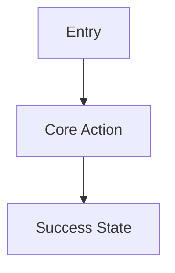

# Output Contract

Produce a core multi-file Markdown PRD package. Stage and publish it according to `artifact-lifecycle.md`. The final package belongs under `doc/`. Use exactly these artifact names unless the user requests different names:

- `doc/PRD.md`
- `doc/architecture.md`
- `doc/wireframes.md`

This package stays in the product/spec layer. Do not add design-system, high-fidelity UI mockup, visual token, or page-level visual acceptance artifacts to this output contract.

Produce `doc/implementation-plan.md` only when the user explicitly asks for delivery sequencing or implementation planning.

Default all artifact content to English unless the user explicitly asks for another language.

## `PRD.md`

Use this structure:

```markdown
# PRD: [Product Name]

## Summary
[One paragraph describing the product, user, and outcome.]

## Goals
- [Goal]

## Non-Goals
- [Explicitly out of scope]

## Users and Personas
| Persona | Need | Key Workflow | Success Signal |
| --- | --- | --- | --- |

## Problem Statement
[Current pain, trigger, and why now.]

## Builder UX Direction
Decision owner: [Human product/design owner or commissioning team]

| Dimension | Direction | Product / user rationale | Status | Validation needed |
| --- | --- | --- | --- | --- |
| Experience priority | [Speed / clarity / guided completion / expert control / exploration / conversion / comprehension] | [Why this fits the product and user task] | [selected / provisional / assumed] | [None / prototype review / likely-user test / benchmark] |
| Guidance and control | [Guided / balanced / expert-flexible] | [Reason] | [selected / provisional / assumed] | [Method or none] |
| Information density | [Sparse / balanced / dense] | [Reason] | [selected / provisional / assumed] | [Method or none] |
| Interaction and layout | [Familiar / expressive; preferred primary pattern] | [Reason] | [selected / provisional / assumed] | [Method or none] |
| Confirmation and recovery | [Confirm / undo / retry / escalation expectations] | [Reason] | [selected / provisional / assumed] | [Method or none] |

Builder direction is a product input, not usability proof. Record any conflict with user evidence or accessibility requirements as a hypothesis or open question.

## User Journeys
### Journey 1: [Name]
1. [Step]
2. [Step]

## Functional Requirements
| ID | Requirement | Priority | Acceptance Criteria |
| --- | --- | --- | --- |

## UX Requirements
| ID | User / task | Requirement | Success and failure signal | Evidence status |
| --- | --- | --- | --- | --- |
| UX-001 | [User completing a critical task] | [Screens, states, accessibility, notifications, responsive behavior, or recovery] | [Observable success plus failure or abandonment signal] | [research-backed / prototype-reviewed / assumption] |

## Frontend Delivery Requirements
- [Target devices and browsers, content/interactivity profile, SEO, rendering, performance, accessibility, localization, offline, and deployment constraints]

Omit this section only when the product has no browser frontend.

## Data and Integration Requirements
- [Data objects, external systems, freshness, retention]

## Business Rules
- [Rules, thresholds, approvals, calculations]

## Metrics
| Metric | Definition | Target |
| --- | --- | --- |

## Risks
| Risk | Impact | Mitigation |
| --- | --- | --- |

## Assumptions
- [Assumption]

## Open Questions
- [Question]
```

## `architecture.md`

Use this structure:

```markdown
# Architecture: [Product Name]

## Architecture Summary
[Implementation-ready overview.]

## Product Archetype
[Web app, mobile app, internal tool, automation or agent workflow, API or hybrid.]

## Frontend Technology Decision
Use this section for every product with a browser frontend. Omit it only when no browser surface exists.

Decision status: [Required / Selected / Recommended / Provisional]

Decision authority: [User constraint, existing repository, or PRD recommendation]

### Decision Drivers
- [Product evidence that determines the choice: content density, interactivity, SEO, rendering, auth, edge data, team capability, reuse, performance, and deployment constraints.]

### Recorded or Recommended Stack
| Layer | Selection | Why It Fits | Constraint or Follow-up |
| --- | --- | --- | --- |
| Deployment / runtime | [e.g. Cloudflare Workers with Static Assets] | [Reason] | [Constraint] |
| Rendering model | [Static, SSG, SSR, on-demand, SPA, islands, or hybrid by route] | [Reason] | [Constraint] |
| Framework | [e.g. Astro, React Router, or none] | [Reason] | [Constraint] |
| UI library | [e.g. React or none] | [Reason] | [Constraint] |
| Build tool | [e.g. Vite, or framework-managed] | [Reason] | [Constraint] |
| Routing and data | [Approach] | [Reason] | [Constraint] |
| Styling and components | [Approach] | [Reason] | [Constraint] |
| Testing | [Unit, component, end-to-end, accessibility] | [Reason] | [Constraint] |

### Rendering and Route Strategy
| Route Group | Rendering | Data Source | Cache / Freshness | Auth Boundary | Rationale |
| --- | --- | --- | --- | --- | --- |

### Alternatives Considered
| Alternative | Where It Fits Better | Why Not Selected Here | Revisit Trigger |
| --- | --- | --- | --- |

### Platform Compatibility Verification
- Checked on: [YYYY-MM-DD]
- Official sources: [Direct links]
- Runtime/build requirements: [Compatibility date, Node version, adapter/plugin, bindings, asset routing, or other constraints]

### Unresolved Decision Protocol
Use only when a stack layer cannot yet be decided.

| Open Decision | Missing Evidence | Owner | Decision Date | Time-boxed Spike | Pass / Fail Criteria |
| --- | --- | --- | --- | --- | --- |

## System Context
[Actors, systems, dependencies.]

## Component Architecture
| Component | Responsibility | Notes |
| --- | --- | --- |

## Data Model
| Entity | Key Fields | Relationships | Notes |
| --- | --- | --- | --- |

## API and Interface Contracts
| Interface | Method or Trigger | Input | Output | Errors |
| --- | --- | --- | --- | --- |

## Workflow and Data Flow
[Describe request, background job, event, and integration flows.]

## Auth, Permissions, and Security
[Authentication, authorization, secrets, audit, privacy, abuse cases.]

## Integrations
| System | Purpose | Direction | Failure Handling |
| --- | --- | --- | --- |

## Deployment and Operations
[Hosting, environments, config, migrations, queues, cron, rollback.]

For deployable Cloudflare products, include this environment contract:

| Target | Exact Release Source | Worker | Data / Bindings / Secrets | Auth Mode | Payment Mode | Migration Order | Deployed Verification | Rollback |
| --- | --- | --- | --- | --- | --- | --- | --- | --- |
| Development | [Current PR head after current-head CI] | [Distinct development Worker] | [Isolated non-production resources] | [Development] | [Sandbox or not applicable] | [Command/order or not applicable] | [URL, version, checks, smoke, evidence] | [Prior development version] |
| Production | [Exact merged base-branch SHA after development PASS] | [Distinct production Worker] | [Production resources] | [Production] | [Live or not applicable] | [Command/order or not applicable] | [URL, version, production smoke, evidence] | [Prior production version] |

State that both targets use one repository and one codebase. Do not reuse production data, sessions, secrets, or live payment mutations in development.

## Observability
[Logs, metrics, traces, alerts, dashboards, audit events.]

## Scaling and Reliability
[Expected load, bottlenecks, caching, retries, idempotency, disaster recovery.]

## Technical Risks and Tradeoffs
| Decision | Options Considered | Recommendation | Reason |
| --- | --- | --- | --- |
```

## `wireframes.md`

Use this structure:

````markdown
# Wireframes: [Product Name]

## Wireframe Direction
- Fidelity: Low
- Builder UX direction source: [PRD.md#builder-ux-direction]
- Decision status: [selected / provisional / assumed, with unresolved items]
- Product style intent: [User-selected direction, or provisional modern-minimal assumption]
- Structural interpretation: [Hierarchy, spacing, density, grouping, imagery, and interaction-tone consequences]
- High-fidelity decisions deferred: [Tokens, typefaces, palette, detailed art direction, and other design-package decisions]

## Navigation Model
[Primary navigation, tabs, routes, or channels.]

## User Flow


## Screen: [Name]
Purpose: [What user accomplishes here]

Layout pattern: [Landing / workspace / dashboard / form or wizard / search or catalog / justified custom pattern]

Density: [Sparse / balanced / dense, with a task or content reason]

```text
+------------------------------------------------+
| Header                                         |
+------------------------------------------------+
| [Exact copy/data or DISPLAY: responsibility]  |
|                                                |
| [Exact primary action label]                   |
+------------------------------------------------+
```

### States
- Loading:
- Empty:
- Error:
- Permission:
- Success:

### Content, Style, Media & Motion Notes
| Region | Content mode | Exact wording or display contract | Content priority | Style direction | Image / media | Motion | Notes |
| --- | --- | --- | --- | --- | --- | --- | --- |
| [Region] | [exact copy / display contract] | [Verbatim wording, or what to show + intended takeaway/action + source + constraints] | [must-have / secondary / defer] | [Visual job and hierarchy/comprehension purpose] | [required / optional / none; purpose] | [required / optional / none; purpose] | [Status, fallback, or design handoff question] |
````

## Optional `implementation-plan.md`

Create this file only when explicitly requested.

Use this structure:

```markdown
# Implementation Plan: [Product Name]

## Delivery Strategy
[How to sequence the build.]

## Milestones
| Milestone | Scope | Exit Criteria |
| --- | --- | --- |

## Dependency Order
1. [Foundational dependency]
2. [Next dependency]

## Engineering Tasks
| Area | Task | Owner Type | Notes |
| --- | --- | --- | --- |

## Test Strategy
| Test Type | Coverage | Acceptance Signal |
| --- | --- | --- |

## Release Plan
[Launch, feature flags, migration, rollout, support.]

## Rollback Plan
[How to revert safely.]

## Unresolved Decisions
- [Decision needed]
```

## Quality Checklist

Before archiving earlier documents or publishing the staged package, verify:

- All three core artifacts are present in the run-specific staging directory and are ready to publish under `doc/`.
- `PRD.md` includes goals, non-goals, personas, journeys, requirements, acceptance criteria, metrics, risks, assumptions, and open questions.
- For a UI-bearing product, `PRD.md` records the human Builder UX Direction owner and concrete choices for experience priority, guidance/control, information density, interaction/layout, confirmation/recovery, validation depth, and decision status.
- Builder preference is not presented as user validation. Conflicts with user evidence or accessibility requirements remain explicit hypotheses, validation needs, or open questions.
- For a browser product, `PRD.md` defines frontend delivery requirements including content/interactivity, rendering, SEO, accessibility, performance, target devices, and deployment constraints where applicable.
- `architecture.md` is implementation-ready and covers components, data model, APIs, integrations, auth, security, deployment, observability, scaling, and failure handling.
- For a deployable product, `architecture.md` records the platform. Unless the user or repository names another platform, it uses the Cloudflare organization default and defines one codebase with separate development and production Workers.
- For Cloudflare delivery, the environment contract names exact PR-head and merged-base release sources, distinct Worker names, isolated resources/secrets/data/auth/payment modes, migration order, deployed-environment verification, evidence, and rollback. Development never uses production customer data, sessions, or live payment mutations.
- For a browser product, `architecture.md` records the required/selected stack or recommends one frontend stack, separates its technology layers, maps rendering by route, explains rejected alternatives, and records official-source verification date and runtime constraints.
- The frontend decision status distinguishes a user requirement or existing selection from a PRD recommendation or provisional choice.
- Any unresolved frontend stack decision has an owner, deadline, time-boxed spike, and pass/fail criteria; a bare `TBD` does not pass validation.
- `wireframes.md` includes ASCII wireframes and at least one Mermaid user flow.
- `wireframes.md` records the user-selected interface style, or an explicit provisional `modern-minimal` assumption when the user authorized assumptions. A `modern` direction is translated into concrete hierarchy, spacing, density, grouping, imagery, and interaction-tone consequences.
- `wireframes.md` cites the Builder UX Direction Decision and preserves whether each controlling choice is selected, provisional, or assumed.
- Every important screen names a layout pattern and density justified by its primary task and content shape.
- Every visible wireframe region contains either exact UI wording or a display contract covering what to show, the intended takeaway or action, the source, and relevant constraints. Generic placeholders do not pass validation.
- Every visually important wireframe region names its style direction and purpose. Every animated region labels motion as required, optional, or none and states what it communicates.
- ASCII boxes represent real grouping, interaction, state, or hierarchy. Repeated bordered panels with colored side rails or accent stripes are not implied without a named semantic or approved brand role.
- Landing-page wireframes keep one clear value proposition and primary action in the first viewport, give each section one job, and defer secondary detail instead of copying the whole PRD into the page.
- Relevant wireframes label image/media and motion as required, optional, or none with a stated purpose, while leaving visual treatment and detailed choreography to the design package.
- UI states include loading, empty, error, permission, and success where applicable.
- If produced, `implementation-plan.md` includes milestones, dependency order, test strategy, release plan, rollback plan, and unresolved decisions.
- Assumptions and open questions are explicit.
- The artifacts match the selected product archetype.
- No current-package artifact will be published outside `doc/` unless the user explicitly requested another location.
- The superseded-document inventory excludes `doc/archived/`, unrelated documents, and ambiguous candidates.
