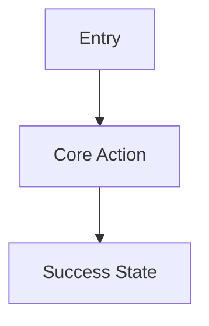

# Output Contract

Produce a core multi-file Markdown PRD package. Stage and publish it according to `artifact-lifecycle.md`. The final package belongs under `docs/product/`. Use exactly these artifact names unless the user requests different names:

- `docs/product/PRD.md`
- `docs/product/architecture.md`
- `docs/product/stack-decisions.md`
- `docs/product/wireframes.md`

This package stays in the product/spec layer. Do not add design-system, visual-token, primitive- or component-contract, UI-registry, page-recipe, high-fidelity UI mockup, or page-level visual acceptance artifacts to this output contract. `ui-architecture-builder` owns them and publishes `ui-architecture.md`, `ui-registry.json`, `page-recipes.md`, `design-system.md`, `mockups/*.html` plus `mockups/catalog.html`, and `visual-acceptance.md` alongside this package.

`wireframes.md` is the canonical source for product scope and screen structure. When the user explicitly authorizes the optional `frontend-design` Preference & HTML Exploration handoff in `wireframe-guide.md`, its two or three candidate directions and approved selected HTML remain non-canonical design-stage evidence outside this package. They cannot change scope or silently replace a wireframe; structural findings return to the PRD owner for a bounded wireframe revision and another quality-check pass.

Produce `docs/product/implementation-plan.md` only when the user explicitly asks for delivery sequencing or implementation planning.

Default all artifact content to English unless the user explicitly asks for another language.

## How To Read This Package

Every artifact has one primary reader and one job. Write for that reader.

| Artifact | Primary reader | Answers |
| --- | --- | --- |
| `PRD.md` | Anyone deciding whether to build this | What is it, for whom, and what counts as done |
| `wireframes.md` | A designer or frontend engineer | What each screen must show and do |
| `architecture.md` | An engineer about to implement | How the system is shaped and where the risk is |
| `stack-decisions.md` | An engineer choosing or reviewing technology | Which stack, and why that one |

Reading order is `PRD.md` → `wireframes.md` → `architecture.md` → `stack-decisions.md`.

Two rules keep the package readable:

- **Meaning before bookkeeping.** Each file opens with what a human needs to understand the product and ends with the ID matrices and decision records that machines, auditors, and downstream skills need. Never open a file with a trace table.
- **One notation per block.** Prose, ASCII, and ID tables do not interleave inside a section. A table wider than seven columns is a sign the content wants to be a list instead.

Length budget. These are targets, not caps — say less when the product is simple, and go over only when the product is genuinely more complex, not when a section drifted:

- `PRD.md`: about 200 lines. `## At a Glance` fits on one screen.
- `architecture.md`: about 250 lines.
- `stack-decisions.md`: about 150 lines.
- `wireframes.md`: about 40 lines per screen, plus roughly 10 lines per visible region block.

When a section runs past its share, the usual cause is detail that belongs in a different artifact. Move it before expanding the file.

## `PRD.md`

Use this structure:

```markdown
# PRD: [Product Name]

## At a Glance
| | |
| --- | --- |
| What it is | [One line] |
| Primary user | [One line] |
| Why now | [One line] |
| Success looks like | [One metric with its target] |
| Biggest risk | [One line] |

[One paragraph describing the product, user, and outcome.]

## Problem Statement
[Current pain, trigger, and why now.]

## Goals
- [Goal]

## Non-Goals
- [Explicitly out of scope]

## Users and Personas
| Persona | Need | Key Workflow | Success Signal |
| --- | --- | --- | --- |

## User Journeys
### Journey 1: [Name]
1. [Step]
2. [Step]

## Functional Requirements
| ID | Requirement | Priority | Acceptance Criteria |
| --- | --- | --- | --- |
| PRD-001 | [Requirement] | [Must / should / could] | [Observable acceptance] |

## Non-Functional Requirements
| ID | Quality attribute | Scope / requirement | Measure | Target / threshold | TEST IDs |
| --- | --- | --- | --- | --- | --- |
| PRD-002 | [Performance / reliability / availability / security / privacy / accessibility / scalability / maintainability / operability / compliance, or another applicable attribute] | [Surface, workflow, population, and condition covered] | [Measured signal with unit, population, window, and percentile where applicable] | [Numeric threshold or bounded outcome] | TEST-002 |
| N/A | [Non-applicable quality category] | [Why it does not apply to this product or scope] | N/A | N/A | N/A |

Record every applicable quality category as a measurable `PRD-*` requirement, or record the category as explicitly `N/A` with a reason. The `N/A` row is an applicability record, not an NFR obligation, and does not receive a requirement or TEST ID. Words such as `fast`, `secure`, `reliable`, `scalable`, or `accessible` do not pass without an observable measure and target. Include units, tested population or traffic shape, measurement window, and percentile where they affect the result.

## UX Requirements
| ID | User / task | Requirement | Success and failure signal | Evidence status |
| --- | --- | --- | --- | --- |
| UX-001 | [User completing a critical task] | [Screens, states, accessibility, notifications, responsive behavior, or recovery] | [Observable success plus failure or abandonment signal] | [research-backed / prototype-reviewed / assumption] |

## Frontend Delivery Requirements
- [Target devices and browsers, content/interactivity profile, SEO, rendering, performance, accessibility, localization, offline, and deployment constraints]

Omit this section only when the product has no browser frontend.

## Data and Integration Requirements
- [Data objects, external systems, freshness, retention]

## Business Rules
- [Rules, thresholds, approvals, calculations]

## Metrics
| Metric | Definition | Target |
| --- | --- | --- |

## Risks
| Risk | Impact | Mitigation |
| --- | --- | --- |

## Assumptions
- [Assumption]

## Open Questions
- [Question]

## Test Obligations
| TEST ID | Obligation | Test type | Required | Upstream trace IDs | Expected signal |
| --- | --- | --- | --- | --- | --- |
| TEST-001 | [Observable behavior or quality obligation] | [Unit / integration / contract / E2E / performance / security / accessibility / operational] | [Yes / No] | PRD-001 | [Literal pass signal, measured result, or threshold] |

Every `Must` functional requirement and every applicable non-functional requirement maps to at least one row whose `Required` value is `Yes`. A row may cover more than one upstream requirement only when one test genuinely verifies all of them. Preserve each `TEST-*` ID when its obligation keeps the same meaning; retire rather than reuse an ID whose meaning changes.

---

## Builder UX Direction Decision

Decision record. Read it when you need to know why the interface is shaped the way it is; skip it on a first pass.

Decision owner: [Human product/design owner or commissioning team]

| Dimension | Direction | Product / user rationale | Status | Validation needed |
| --- | --- | --- | --- | --- |
| Experience priority | [Speed / clarity / guided completion / expert control / exploration / conversion / comprehension] | [Why this fits the product and user task] | [selected / provisional / assumed] | [None / prototype review / likely-user test / benchmark] |
| Guidance and control | [Guided / balanced / expert-flexible] | [Reason] | [selected / provisional / assumed] | [Method or none] |
| Information density | [Sparse / balanced / dense] | [Reason] | [selected / provisional / assumed] | [Method or none] |
| Interaction and layout | [Familiar / expressive; preferred primary pattern] | [Reason] | [selected / provisional / assumed] | [Method or none] |
| Confirmation and recovery | [Confirm / undo / retry / escalation expectations] | [Reason] | [selected / provisional / assumed] | [Method or none] |

Validation depth: [lightweight direction-conformance review only / moderate (conformance plus targeted checks) / deep (formal usability or user-evidence validation)] — [selected / provisional / assumed], decided by [decision owner]
This is the single recorded home for the interview's validation-depth answer, so downstream skills (ui-architecture-builder) can read it here instead of re-asking.

Builder direction is a product input, not usability proof. Record any conflict with user evidence or accessibility requirements as a hypothesis or open question.
```

Keep this section's heading text exactly as written. `wireframes.md` links to it by anchor (`PRD.md#builder-ux-direction-decision`); the anchor survives the section moving to the end of the file, but not the heading being renamed.

## `architecture.md`

Use this structure:

```markdown
# Architecture: [Product Name]

## Architecture Summary
[Implementation-ready overview in a few sentences: the main pieces, what talks to what, and the one or two decisions that constrain everything else.]

Technology selections and their rationale live in `stack-decisions.md`.

## Product Archetype
[Web app, mobile app, desktop app, internal tool, automation or agent workflow, API or hybrid. For a mobile app, name the resolved platform: native iOS, native Android, Flutter, or React Native. For a desktop app, name the resolved platform: macOS, Windows, or cross-platform.]

## System Context
[Actors, systems, dependencies.]

## Component Architecture
| ARCH ID | Component | Responsibility | Upstream trace IDs | Notes |
| --- | --- | --- | --- | --- |

## Data Model
| Entity | Key Fields | Relationships | Notes |
| --- | --- | --- | --- |

## API and Interface Contracts
| ARCH ID | Interface | Method or Trigger | Input | Output | Errors | TEST IDs |
| --- | --- | --- | --- | --- | --- | --- |

## Workflow and Data Flow
[Describe request, background job, event, and integration flows.]

## Auth, Permissions, and Security
[Authentication, authorization, secrets, audit, privacy, abuse cases.]

## Integrations
| System | Purpose | Direction | Failure Handling |
| --- | --- | --- | --- |

## Deployment and Operations
[Hosting, environments, config, migrations, queues, cron, rollback.]

For every deployable hosted web, API, or backend target, include this environment contract (Cloudflare Worker naming shown as the worked example; substitute the resolved platform's equivalent deployment unit). Do not use this two-row hosted-environment table for native mobile or desktop store/signed-installer distribution:

| Target | Exact Release Source | Deployment Unit | Data / Bindings / Secrets | Auth Mode | Payment Mode | Migration Order | Deployed Verification | Rollback |
| --- | --- | --- | --- | --- | --- | --- | --- | --- |
| Development | [`pr_head` after current-head CI, or `integration_head` for an explicitly retained integration branch] | [Distinct development deployment unit, e.g. Cloudflare Worker, Vercel project environment, AWS stack] | [Isolated non-production resources] | [Development] | [Sandbox or not applicable] | [Classification, command, and ordering or not applicable] | [URL, version, checks, smoke, evidence] | [Prior development version] |
| Production | [`merged_main` after development PASS] | [Distinct production deployment unit] | [Production resources] | [Production] | [Live or not applicable] | [Classification, command, and ordering or not applicable] | [URL, version, production smoke, evidence] | [Prior production version] |

State that both hosted targets use one repository and one codebase. Do not reuse production data, sessions, secrets, or live payment mutations in development. Write each Migration Order cell so the engineering handoff can map it to PLAN-v5 `migration_classification`, `commands.migrate`, and `prerequisites` as appropriate.

## Release Targets
Use this provider-neutral section for every deployable web, API, mobile, or desktop surface, including hosted targets already summarized in the environment table above. First record the complete expected deployable-surface inventory using stable surface IDs. Then record one block per exact destination and give it a stable target ID. Every expected surface needs at least one `development` target and one `production` target; a package that omits an expected surface is incomplete. Keep the stable `surface` identity separate from `provider`, because one surface may use different providers by stage. Keep surface and target IDs stable across revisions; retire rather than reuse an ID when its meaning changes.

Expected deployable surfaces: [stable surface IDs, for example `web-app`, `public-api`, `ios-app`]

### Release Target: [stable-target-id]
- Surface: [Stable expected surface ID]
- Provider: [Stage-specific hosting, store, or distribution provider]
- Stage: [development / production]
- Source policy: [`pr_head` or `integration_head` for development; `merged_main` for production. Signed tags and other source rules are unsupported by the current PLAN-v5 engineering handoff and remain an explicit unresolved handoff gap rather than a frozen target source]
- Artifact kind: [Static bundle, container, serverless bundle, API service, IPA, AAB, signed DMG/PKG, MSIX, signed installer, or another exact artifact]
- Signing requirement: [Not required, or exact certificate/signing/notarization requirement and owner]
- Exact channel / track: [Named environment, URL, TestFlight group, Play track, App Store, update feed, direct-download channel, or another exact destination]
- Submission / promotion / review / manual approval path: [Ordered gates and decision owner]
- Availability signal: [Observable proof that the intended audience can reach, install, or download this exact release, plus the smoke/acceptance signal]
- Rollout: [Immediate, percentage/phased/staged rollout, audience ring, or another controlled sequence]
- Rollback / forward-fix: [Prior deployed version for instant rollback, or rollout halt/removal plus corrected signed artifact through the same review/distribution path]

A successful build, upload, submission, deployment command, notarization, or store approval is not availability by itself. Hosted availability requires the deployed route or API to answer the named smoke checks. Store and signed-installer availability requires the approved artifact to be actually installable or downloadable through the named channel and to pass its release smoke check. Native recovery may require halting a phased or staged rollout and shipping a signed forward-fix; do not promise web-style rollback when the channel cannot perform it.

## Observability
[Logs, metrics, traces, alerts, dashboards, audit events.]

## Scaling and Reliability
[Expected load, bottlenecks, caching, retries, idempotency, disaster recovery.]

## Technical Risks and Tradeoffs
| Decision | Options Considered | Recommendation | Reason |
| --- | --- | --- | --- |

---

## Architecture Trace Index
Coverage matrix. Fill it last and read it only when checking that a requirement reached implementation.

| ARCH ID | Contract or decision | Upstream PRD / UX IDs | Downstream UI / TEST IDs |
| --- | --- | --- | --- |
| ARCH-001 | [Stable architecture contract] | PRD-001 | UI-001, TEST-001 |
```

## `stack-decisions.md`

Every decision in this file uses the same shape: drivers, then resolved layers with status and authority/evidence on every row. The shared `Alternatives Considered` and `Unresolved Decision Protocol` tables at the end cover all decisions, so options and open decisions are compared in one place instead of repeated once per decision.

Use these statuses per layer: `Required` means a user, organization, or hard external constraint mandates the selection; `Selected` means the current product or repository already adopted it; `Recommended` is evidence-backed advice not yet accepted; `Provisional` is a leading choice pending named evidence. A section may mix statuses. `Authority / evidence` cites the source that justifies the row — for example a dated user statement, organization policy, repository/config path, product requirement IDs, official documentation with check date, or named spike. Authority is not another status label, and `PRD recommendation` alone is not evidence.

Use this structure:

```markdown
# Stack Decisions: [Product Name]

## Frontend Technology Decision
Use this section for every product with a browser frontend. Omit it only when no browser surface exists.

### Decision Drivers
- [Product evidence that determines the choice: content density, interactivity, SEO, rendering, auth, edge data, team capability, reuse, performance, and deployment constraints.]

### Recorded or Recommended Stack
| Layer | Selection | Status | Authority / evidence | Why It Fits | Constraint / follow-up |
| --- | --- | --- | --- | --- | --- |
| Deployment / runtime | [e.g. Cloudflare Workers with Static Assets] | [Required / Selected / Recommended / Provisional] | [Cited source] | [Reason] | [Constraint] |
| Rendering model | [Static, SSG, SSR, on-demand, SPA, islands, or hybrid by route] | [Required / Selected / Recommended / Provisional] | [Cited source] | [Reason] | [Constraint] |
| Framework | [e.g. Astro, React Router, or none] | [Required / Selected / Recommended / Provisional] | [Cited source] | [Reason] | [Constraint] |
| UI library | [e.g. React or none] | [Required / Selected / Recommended / Provisional] | [Cited source] | [Reason] | [Constraint] |
| Build tool | [e.g. Vite, or framework-managed] | [Required / Selected / Recommended / Provisional] | [Cited source] | [Reason] | [Constraint] |
| Routing and data | [Approach] | [Required / Selected / Recommended / Provisional] | [Cited source] | [Reason] | [Constraint] |
| Styling and components | [Approach] | [Required / Selected / Recommended / Provisional] | [Cited source] | [Reason] | [Constraint] |
| Testing | [Unit, component, end-to-end, accessibility] | [Required / Selected / Recommended / Provisional] | [Cited source] | [Reason] | [Constraint] |

### Rendering and Route Strategy
| Route Group | Rendering | Data Source | Cache / Freshness | Auth Boundary | Rationale |
| --- | --- | --- | --- | --- | --- |

### Platform Compatibility Verification
- Checked on: [YYYY-MM-DD]
- Official sources: [Direct links]
- Runtime/build requirements: [Compatibility date, Node version, adapter/plugin, bindings, asset routing, or other constraints]

## Mobile/Desktop Technology Decision
A product may add this section in a later revision after Frontend Technology Decision is already frozen, when a mobile or desktop target is added to an existing web product; freezing this section does not reopen or require revisiting the already-frozen Frontend Technology Decision. Use this section for every product with a mobile app or desktop app target (native iOS, native Android, Flutter, React Native, macOS, Windows, or cross-platform desktop) — omit it when no such target exists.

### Decision Drivers
- [Product evidence that determines the choice, weighed per `references/mobile-stack-selection.md`: target platforms and reach, native capability needs, offline/sync requirements, team capability, code reuse with an existing web frontend, distribution and store constraints, and performance expectations.]

### Recorded or Recommended Stack
| Layer | Selection | Status | Authority / evidence | Why It Fits | Constraint / follow-up |
| --- | --- | --- | --- | --- | --- |
| Platform | [native iOS, native Android, Flutter, React Native, macOS, Windows, or cross-platform desktop] | [Required / Selected / Recommended / Provisional] | [Cited source] | [Reason] | [Constraint] |
| Toolchain | [e.g. Xcode/SwiftUI, Android Studio/Jetpack Compose, Flutter/Dart, Expo/React Native, or the desktop equivalent] | [Required / Selected / Recommended / Provisional] | [Cited source] | [Reason] | [Constraint] |
| Distribution mechanism | [e.g. App Store/TestFlight, Play Console tracks, EAS Submit, MSIX, notarization — as applicable] | [Required / Selected / Recommended / Provisional] | [Cited source] | [Reason] | [Constraint] |
| Backend/API integration | [Approach for reaching the backend or APIs] | [Required / Selected / Recommended / Provisional] | [Cited source] | [Reason] | [Constraint] |
| Push / offline sync | [Push notification and offline/sync approach, when applicable] | [Required / Selected / Recommended / Provisional] | [Cited source] | [Reason] | [Constraint] |
| Testing | [Unit and UI-automation framework per platform] | [Required / Selected / Recommended / Provisional] | [Cited source] | [Reason] | [Constraint] |

Compatibility checked on: [YYYY-MM-DD] — official sources: [Direct links]

## Backend and Data Technology Decision
Use this section for every product with a backend, persistent data, or auth requirement. Omit it only when the product provably has none of these.

### Decision Drivers
- [Data shape/relationships, consistency/transaction needs, query complexity, scale, identity/compliance requirements, team capability, platform-managed services, integration surface.]

### Recorded or Recommended Stack
| Layer | Selection | Status | Authority / evidence | Why It Fits | Constraint / follow-up |
| --- | --- | --- | --- | --- | --- |
| Service topology | [Monolith or named services; monorepo or polyrepo organization] | [Required / Selected / Recommended / Provisional] | [Cited source] | [Reason] | [Constraint] |
| Backend runtime / framework | [Selection] | [Required / Selected / Recommended / Provisional] | [Cited source] | [Reason] | [Constraint] |
| Database category | [Relational / Document / Key-value or cache only / None] | [Required / Selected / Recommended / Provisional] | [Cited source] | [Reason] | [Constraint] |
| Database engine | [Selection] | [Required / Selected / Recommended / Provisional] | [Cited source] | [Reason] | [Constraint] |
| Auth strategy | [Build custom / Managed third-party / Platform-native / None] | [Required / Selected / Recommended / Provisional] | [Cited source] | [Reason] | [Constraint] |
| Auth provider | [Selection] | [Required / Selected / Recommended / Provisional] | [Cited source] | [Reason] | [Constraint] |
| API style | [REST / GraphQL / RPC / server actions] | [Required / Selected / Recommended / Provisional] | [Cited source] | [Reason] | [Constraint] |
| Background jobs / queue | [Selection or not applicable] | [Required / Selected / Recommended / Provisional] | [Cited source] | [Reason] | [Constraint] |
| File / object storage | [Selection or not applicable] | [Required / Selected / Recommended / Provisional] | [Cited source] | [Reason] | [Constraint] |

### Data Entity to Store Mapping
| Entity | Store | Rationale |
| --- | --- | --- |

### Platform and Vendor Compatibility Verification
- Checked on: [YYYY-MM-DD]
- Official sources: [Direct links]
- Runtime/service requirements: [Bindings, connection limits, region/residency, quota, or other constraints]

---

## Options And Open Decisions

### Alternatives Considered
One row per rejected option, across every decision above.

| Area | Alternative | Where It Fits Better | Why Not Selected Here | Revisit Trigger |
| --- | --- | --- | --- | --- |
| [Frontend / Mobile or desktop / Backend or data] | [Alternative] | [Context] | [Reason] | [Trigger] |

### Unresolved Decision Protocol
Use only when a layer cannot yet be decided.

| Area | Open Decision | Missing Evidence | Owner | Decision Date | Time-boxed Spike | Pass / Fail Criteria |
| --- | --- | --- | --- | --- | --- | --- |
```

## `wireframes.md`

Use this structure:

````markdown
# Wireframes: [Product Name]

## Wireframe Direction
- Fidelity: Low
- Builder UX direction source: [PRD.md#builder-ux-direction-decision]
- Decision status: [selected / provisional / assumed, with unresolved items]
- Product visual inputs: [Known brand references, hard limits, and product-specific visual goals; high-fidelity preference discovery deferred]
- Structural interpretation: [Hierarchy, spacing, density, grouping, imagery, and interaction-tone consequences]
- Canonical structure: [This `wireframes.md`; downstream visual candidates cannot change scope, screen structure, actions, states, region responsibilities, or trace IDs]
- Optional preference & HTML exploration handoff: [not requested / explicitly authorized for the same one or two representative UI IDs; owner and selected IDs]
- High-fidelity decisions deferred: [Tokens, typefaces, palette, primitive contracts and their variant sets, page recipes, detailed art direction, and other `ui-architecture-builder` decisions]

## Navigation Model
[Primary navigation, tabs, routes, or channels.]

## User Flow


## Screen: [Name]

Main purpose: [Single primary goal, one sentence]

Primary emphasis: [What gets the strongest weight, and why]

Secondary / quiet: [What stays present but subordinate]

Layout pattern: [Landing / workspace / dashboard / form or wizard / search or catalog / justified custom pattern] — chosen because: [one sentence tying the pattern to the main purpose]

Density: [Sparse / balanced / dense, with a task or content reason]

```text
+------------------------------------------------+
| Header                                         |
+------------------------------------------------+
| [Exact copy/data or DISPLAY: responsibility]  |
|                                                |
| [Exact primary action label]                   |
+------------------------------------------------+
```

### States
- Loading:
- Empty:
- Error:
- Permission:
- Success:

### Content, Style, Media & Motion Notes
One block per visible region, in the order the region appears on screen.

**UI-001-R01 — [Region]**
- Content mode: [exact copy / display contract]
- Exact wording or display contract: [Verbatim wording, or what to show + intended takeaway/action + source + constraints]
- Content priority: [must-have / secondary / defer]
- Style direction: [Visual job and hierarchy/comprehension purpose]
- Image / media: [required / optional / none; purpose]
- Motion: [required / optional / none; purpose]
- Notes: [Status, fallback, or design handoff question]
- Trace IDs: PRD-001, UX-001

### Trace
UI ID: UI-001

Trace IDs: PRD-001, UX-001, ARCH-001
````

## Optional `implementation-plan.md`

Create this file only when explicitly requested.

Use this structure:

```markdown
# Implementation Plan: [Product Name]

## Delivery Strategy
[How to sequence the build.]

## Milestones
| Milestone | Scope | Exit Criteria |
| --- | --- | --- |

## Dependency Order
1. [Foundational dependency]
2. [Next dependency]

## Engineering Tasks
| Area | Task | Owner Type | Notes |
| --- | --- | --- | --- |

## Release Plan
[Launch, feature flags, migration, rollout, support. Reuse the stable release target IDs from `architecture.md`; do not rename destinations in the plan.]

## Rollback Plan
[How to revert safely.]

## Unresolved Decisions
- [Decision needed]

---

## Harness Handoff Signals
These are planning hints, not a canonical Harness PLAN or RUN graph.

| Work area | Upstream trace IDs | Prerequisites | Parallel candidate | Shared or exclusive resources | Required review / evidence | Human gate |
| --- | --- | --- | --- | --- | --- | --- |
| [Area] | PRD-001, ARCH-001, UI-001 | [Contract or prior outcome] | [yes / no / conditional] | [Schema, generated client, port, database, external service, or none known] | [Frontend/backend/visual/E2E/security] | [Decision or none] |

## Test Strategy
Reuse the canonical `TEST-*` IDs from `PRD.md`'s `## Test Obligations` table. Sequence or add implementation detail to those obligations; do not create anonymous checks or replacement TEST IDs.

| TEST ID | Test Type | Coverage | Upstream trace IDs | Acceptance Signal |
| --- | --- | --- | --- | --- |
| TEST-001 | [Unit / integration / E2E / performance / security / visual / accessibility] | [Implementation coverage for the existing obligation] | PRD-001, ARCH-001, UI-001 | [Same pass signal, with implementation detail if needed] |
```

## Quality Checklist

Before archiving earlier documents or publishing the staged package, verify:

### Readability

- Each artifact opens with human-readable content and keeps ID matrices and decision records at the end: `PRD.md` opens with `## At a Glance`, and for a UI-bearing product closes with `## Builder UX Direction Decision`; `architecture.md` opens with `## Architecture Summary` and closes with `## Architecture Trace Index`; `stack-decisions.md` closes with `## Options And Open Decisions`.
- `## At a Glance` answers what the product is, who it is for, why now, what success looks like, and the biggest risk — one line each, on one screen.
- Each artifact is within reach of its length budget in "How To Read This Package". A file well over budget names which content should have moved to another artifact instead of expanding.
- No table in the package exceeds seven columns except the environment contract in `architecture.md`, whose columns are all release-critical.
- Every screen block in `wireframes.md` leads with `Main purpose:` and carries its `UI ID` and trace IDs in the closing `### Trace` block, not ahead of the human-readable lines.

### Completeness

- All four core artifacts are present in the run-specific staging directory and are ready to publish under `docs/product/`.
- `PRD.md` includes goals, non-goals, personas, journeys, functional requirements, non-functional requirements, acceptance criteria, metrics, risks, assumptions, open questions, and test obligations.
- `## Non-Functional Requirements` is always present immediately after `## Functional Requirements`. Every applicable quality attribute has a measurable `PRD-*` requirement with a measure and target; non-applicable categories are explicitly `N/A` with a reason. Vague adjectives alone do not pass. Units, tested population or traffic shape, measurement window, and percentile are present where applicable.
- `## Test Obligations` is always present after `## Open Questions` and before the trailing Builder UX decision. Its rows use stable `TEST-*` IDs and include obligation, test type, required status, upstream trace IDs, and an expected signal.
- Every `Must` functional requirement and every applicable non-functional requirement maps to at least one `TEST-*` row marked `Required: Yes`. No required obligation is left as anonymous prose.
- Product requirements use stable `PRD-*` IDs; architecture contracts use `ARCH-*`; screens and visible regions use `UI-*`; usability needs use `UX-*`; test obligations use `TEST-*`. Cross-document tables carry the upstream IDs they satisfy.
- For a UI-bearing product, `PRD.md` records the human Builder UX Direction owner and concrete choices for experience priority, guidance/control, information density, interaction/layout, confirmation/recovery, validation depth, and decision status.
- Builder preference is not presented as user validation. Conflicts with user evidence or accessibility requirements remain explicit hypotheses, validation needs, or open questions.
- For a browser product, `PRD.md` defines frontend delivery requirements including content/interactivity, rendering, SEO, accessibility, performance, target devices, and deployment constraints where applicable.
- `architecture.md` is implementation-ready and covers components, data model, APIs, integrations, auth, security, deployment, observability, scaling, and failure handling.
- For every deployable web, API, mobile, or desktop surface, `architecture.md` has a provider-neutral `## Release Targets` section with an explicit expected deployable-surface inventory and at least one development-stage and one production-stage target for every expected surface. A missing expected surface fails validation. Every target has a stable ID, separate stable surface and stage-specific provider fields, a PLAN-v5-compatible source policy, artifact kind, signing requirement, exact channel/track, submission/promotion/review or manual-approval path, actual availability signal, rollout, and rollback or forward-fix path. Different providers by stage are valid for the same surface.
- Upload, submission, deployment-command success, notarization, or store approval alone is not accepted as availability. Hosted targets prove the route/API is serving and passes smoke checks; store or signed-installer targets prove the intended audience can actually install/download the artifact and that its release smoke check passes.
- For a deployable hosted web, API, or backend target, `architecture.md` records the platform resolved during interview (via `AskUserQuestion` unless the user or repository already named one — never a silent default) and defines one codebase with separate development and production environments (named Workers when the platform is Cloudflare).
- The hosted environment contract uses PLAN-v5 release sources (`pr_head` or an explicitly retained `integration_head` for development; `merged_main` for production), distinct per-environment deployment-unit names, isolated resources/secrets/data/auth/payment modes, migration order, deployed-environment verification, evidence, and rollback. Migration Order maps to `migration_classification`, `commands.migrate`, and `prerequisites` as appropriate. For Cloudflare delivery specifically, that means distinct Worker names. Development never uses production customer data, sessions, or live payment mutations. Native mobile and desktop targets remain in provider-neutral release blocks rather than this hosted table.
- Native release recovery does not claim instant rollback when the channel cannot perform it. It records how to halt or reduce a staged/phased rollout and ship a corrected signed forward-fix through the same submission, review, or distribution path.
- For a browser product, `stack-decisions.md` records the required/selected stack or recommends one frontend stack, separates its technology layers, maps rendering by route, and records official-source verification date and runtime constraints.
- Every frontend layer row records Selection, Status, Authority / evidence, Why It Fits, and Constraint / follow-up. Status is accurate per layer, authority cites its source rather than repeating a status label, and one section may mix statuses.
- For a product with a backend, persistent data, or auth requirement, `stack-decisions.md` records the required/selected backend stack or recommends one, separates service topology first, then backend runtime, database category, database engine, auth strategy, and auth provider as distinct layers, maps data entities to stores, and records official-source verification date and runtime/service constraints. Service topology states monolith versus named services and monorepo versus polyrepo organization.
- Every backend/data layer row records Selection, Status, Authority / evidence, Why It Fits, and Constraint / follow-up. Status is accurate per layer, authority cites its source rather than repeating a status label, and the database category and auth strategy trace back to the interview's `AskUserQuestion` answers rather than a silent default.
- For a product with a mobile app or desktop app target, `stack-decisions.md` records the required/selected stack or recommends one per `mobile-stack-selection.md`, separates platform, toolchain, distribution mechanism, backend/API integration, push/offline-sync approach, and testing as distinct layers, and records official-source verification date.
- Every mobile/desktop layer row records Selection, Status, Authority / evidence, Why It Fits, and Constraint / follow-up. Status is accurate per layer, authority cites its source rather than repeating a status label, and one section may mix statuses.
- Every rejected option for any stack decision appears once in `stack-decisions.md`'s shared `Alternatives Considered` table with its area named, rather than repeated per decision section.
- Any unresolved frontend, backend, database, auth, or mobile/desktop decision appears in `stack-decisions.md`'s shared `Unresolved Decision Protocol` table with an owner, deadline, time-boxed spike, and pass/fail criteria; a bare `TBD` does not pass validation.
- `wireframes.md` includes ASCII wireframes and at least one Mermaid user flow.
- `wireframes.md` identifies itself as the canonical structural source and records whether the optional downstream `frontend-design` Preference & HTML Exploration handoff is not requested or explicitly authorized for the same one or two representative `UI-*` IDs.
- No `frontend-design` candidate or selected HTML is stored in the staged or published PRD package. Candidate directions never add scope or silently change the canonical wireframes; any structural finding returns to the PRD owner for a bounded wireframe revision and another checklist pass.
- `wireframes.md` records brand references, visual hard limits, and product-specific visual goals while explicitly deferring high-fidelity preference discovery. It does not freeze a style catalog, tokens, or a `modern-minimal` default.
- `wireframes.md` cites the Builder UX Direction Decision and preserves whether each controlling choice is selected, provisional, or assumed.
- Every important screen names a layout pattern and density justified by its primary task and content shape.
- Every important screen states a one-sentence main purpose, names its primary emphasis and secondary/quiet content, and ties its layout pattern to that purpose with a stated reason. A main purpose that could describe any screen in the product (for example "helps the user get things done") does not pass; it must be specific to this screen's job.
- The screen's ASCII layout is drawn from the skeleton matching its stated layout pattern in `references/wireframe-guide.md`'s Layout Skeletons by Pattern, not the workspace skeleton reused by default for a landing, wizard, or search screen.
- For a product with any public-facing marketing, landing, or SEO-relevant page, the exact copy on those screens has a clear headline/H1 and keyword-relevant (not stuffed) wording, a usable heading hierarchy, a meta-description-worthy summary, and descriptive non-generic alt text or `DISPLAY` contracts for images. This check does not apply to internal-tool, dashboard, or authenticated-only screens. Run it whether or not Dynamic Workflow's `seo-copy-verifier` role executed.
- Every visible wireframe region contains either exact UI wording or a display contract covering what to show, the intended takeaway or action, the source, and relevant constraints. Generic placeholders do not pass validation.
- Every visually important wireframe region names its style direction and purpose. Every animated region labels motion as required, optional, or none and states what it communicates.
- ASCII boxes represent real grouping, interaction, state, or hierarchy. Repeated bordered panels with colored side rails or accent stripes are not implied without a named semantic or approved brand role.
- Landing-page wireframes keep one clear value proposition and primary action in the first viewport, give each section one job, and defer secondary detail instead of copying the whole PRD into the page.
- Relevant wireframes label image/media and motion as required, optional, or none with a stated purpose, while leaving visual treatment and detailed choreography to `ui-architecture-builder`.
- UI states include loading, empty, error, permission, and success where applicable.
- If produced, `implementation-plan.md` includes milestones, dependency order, non-canonical Harness handoff signals, test strategy, release plan, rollback plan, and unresolved decisions. Its test strategy reuses the canonical `TEST-*` IDs from `PRD.md`; it does not replace them with anonymous checks or newly numbered duplicates. Its release plan reuses the stable release target IDs from `architecture.md`.
- When Dynamic Workflow was used, every required role has an explicit result, failed agents are retained as blocked lanes, and trace/consistency verifier findings are resolved or recorded before finalization. Workflow output is treated as a candidate; the parent still owns staging and publication.
- Assumptions and open questions are explicit.
- The artifacts match the selected product archetype.

### Publication

- No current-package artifact will be published outside `docs/product/` unless the user explicitly requested another location.
- The superseded-document inventory excludes `docs/product/archived/`, unrelated documents, and ambiguous candidates.
- In enhancement mode, unaffected sections, `PRD-*`, `ARCH-*`, `UI-*`, `UX-*`, `TEST-*` IDs, and stable release target IDs from the prior package were carried forward unchanged rather than regenerated, and the diff is scoped to what the new discovery actually added, changed, or removed; new TEST IDs cover only obligations that were previously uncovered, and new release target IDs cover only destinations that were previously uncovered.
- Validation does not trigger publication by itself. Exact overwrite and archive moves are already authorized, or the staged package remains unchanged while approval is requested.
