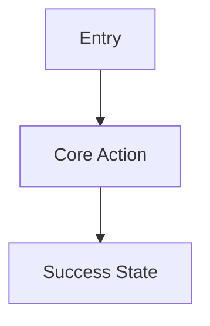

# Output Contract

Produce a multi-file Markdown PRD package. Use exactly these artifact names unless the user requests different names:

- `PRD.md`
- `architecture.md`
- `wireframes.md`
- `implementation-plan.md`

Default all artifact content to English unless the user explicitly asks for another language.

## `PRD.md`

Use this structure:

```markdown
# PRD: [Product Name]

## Summary
[One paragraph describing the product, user, and outcome.]

## Goals
- [Goal]

## Non-Goals
- [Explicitly out of scope]

## Users and Personas
| Persona | Need | Key Workflow | Success Signal |
| --- | --- | --- | --- |

## Problem Statement
[Current pain, trigger, and why now.]

## User Journeys
### Journey 1: [Name]
1. [Step]
2. [Step]

## Functional Requirements
| ID | Requirement | Priority | Acceptance Criteria |
| --- | --- | --- | --- |

## UX Requirements
- [Screens, states, accessibility, notifications, responsive behavior]

## Data and Integration Requirements
- [Data objects, external systems, freshness, retention]

## Business Rules
- [Rules, thresholds, approvals, calculations]

## Metrics
| Metric | Definition | Target |
| --- | --- | --- |

## Risks
| Risk | Impact | Mitigation |
| --- | --- | --- |

## Assumptions
- [Assumption]

## Open Questions
- [Question]
```

## `architecture.md`

Use this structure:

```markdown
# Architecture: [Product Name]

## Architecture Summary
[Implementation-ready overview.]

## Product Archetype
[Web app, mobile app, internal tool, automation or agent workflow, API or hybrid.]

## System Context
[Actors, systems, dependencies.]

## Component Architecture
| Component | Responsibility | Notes |
| --- | --- | --- |

## Data Model
| Entity | Key Fields | Relationships | Notes |
| --- | --- | --- | --- |

## API and Interface Contracts
| Interface | Method or Trigger | Input | Output | Errors |
| --- | --- | --- | --- | --- |

## Workflow and Data Flow
[Describe request, background job, event, and integration flows.]

## Auth, Permissions, and Security
[Authentication, authorization, secrets, audit, privacy, abuse cases.]

## Integrations
| System | Purpose | Direction | Failure Handling |
| --- | --- | --- | --- |

## Deployment and Operations
[Hosting, environments, config, migrations, queues, cron, rollback.]

## Observability
[Logs, metrics, traces, alerts, dashboards, audit events.]

## Scaling and Reliability
[Expected load, bottlenecks, caching, retries, idempotency, disaster recovery.]

## Technical Risks and Tradeoffs
| Decision | Options Considered | Recommendation | Reason |
| --- | --- | --- | --- |
```

## `wireframes.md`

Use this structure:

````markdown
# Wireframes: [Product Name]

## Navigation Model
[Primary navigation, tabs, routes, or channels.]

## User Flow


## Screen: [Name]
```text
+------------------------------------------------+
| Header                                         |
+------------------------------------------------+
| Main content                                   |
|                                                |
| [Primary action]                               |
+------------------------------------------------+
```

### States
- Loading:
- Empty:
- Error:
- Permission:
- Success:
````

## `implementation-plan.md`

Use this structure:

```markdown
# Implementation Plan: [Product Name]

## Delivery Strategy
[How to sequence the build.]

## Milestones
| Milestone | Scope | Exit Criteria |
| --- | --- | --- |

## Dependency Order
1. [Foundational dependency]
2. [Next dependency]

## Engineering Tasks
| Area | Task | Owner Type | Notes |
| --- | --- | --- | --- |

## Test Strategy
| Test Type | Coverage | Acceptance Signal |
| --- | --- | --- |

## Release Plan
[Launch, feature flags, migration, rollout, support.]

## Rollback Plan
[How to revert safely.]

## Unresolved Decisions
- [Decision needed]
```

## Quality Checklist

Before finalizing, verify:

- All four artifacts are present.
- `PRD.md` includes goals, non-goals, personas, journeys, requirements, acceptance criteria, metrics, risks, assumptions, and open questions.
- `architecture.md` is implementation-ready and covers components, data model, APIs, integrations, auth, security, deployment, observability, scaling, and failure handling.
- `wireframes.md` includes ASCII wireframes and at least one Mermaid user flow.
- UI states include loading, empty, error, permission, and success where applicable.
- `implementation-plan.md` includes milestones, dependency order, test strategy, release plan, rollback plan, and unresolved decisions.
- Assumptions and open questions are explicit.
- The artifacts match the selected product archetype.
