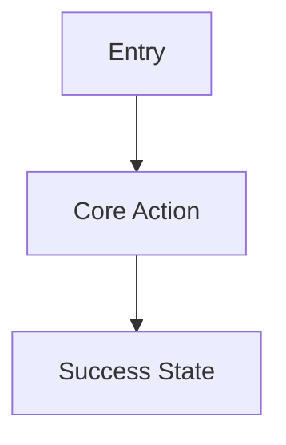

# Output Contract

Produce a core multi-file Markdown PRD package. Stage and publish it according to `artifact-lifecycle.md`. The final package belongs under `doc/`. Use exactly these artifact names unless the user requests different names:

- `doc/PRD.md`
- `doc/architecture.md`
- `doc/wireframes.md`

This package stays in the product/spec layer. Do not add design-system, high-fidelity UI mockup, visual token, or page-level visual acceptance artifacts to this output contract.

Produce `doc/implementation-plan.md` only when the user explicitly asks for delivery sequencing or implementation planning.

Default all artifact content to English unless the user explicitly asks for another language.

## `PRD.md`

Use this structure:

```markdown
# PRD: [Product Name]

## Summary
[One paragraph describing the product, user, and outcome.]

## Goals
- [Goal]

## Non-Goals
- [Explicitly out of scope]

## Users and Personas
| Persona | Need | Key Workflow | Success Signal |
| --- | --- | --- | --- |

## Problem Statement
[Current pain, trigger, and why now.]

## Builder UX Direction
Decision owner: [Human product/design owner or commissioning team]

| Dimension | Direction | Product / user rationale | Status | Validation needed |
| --- | --- | --- | --- | --- |
| Experience priority | [Speed / clarity / guided completion / expert control / exploration / conversion / comprehension] | [Why this fits the product and user task] | [selected / provisional / assumed] | [None / prototype review / likely-user test / benchmark] |
| Guidance and control | [Guided / balanced / expert-flexible] | [Reason] | [selected / provisional / assumed] | [Method or none] |
| Information density | [Sparse / balanced / dense] | [Reason] | [selected / provisional / assumed] | [Method or none] |
| Interaction and layout | [Familiar / expressive; preferred primary pattern] | [Reason] | [selected / provisional / assumed] | [Method or none] |
| Confirmation and recovery | [Confirm / undo / retry / escalation expectations] | [Reason] | [selected / provisional / assumed] | [Method or none] |

Builder direction is a product input, not usability proof. Record any conflict with user evidence or accessibility requirements as a hypothesis or open question.

## User Journeys
### Journey 1: [Name]
1. [Step]
2. [Step]

## Functional Requirements
| ID | Requirement | Priority | Acceptance Criteria |
| --- | --- | --- | --- |
| PRD-001 | [Requirement] | [Must / should / could] | [Observable acceptance] |

## UX Requirements
| ID | User / task | Requirement | Success and failure signal | Evidence status |
| --- | --- | --- | --- | --- |
| UX-001 | [User completing a critical task] | [Screens, states, accessibility, notifications, responsive behavior, or recovery] | [Observable success plus failure or abandonment signal] | [research-backed / prototype-reviewed / assumption] |

## Frontend Delivery Requirements
- [Target devices and browsers, content/interactivity profile, SEO, rendering, performance, accessibility, localization, offline, and deployment constraints]

Omit this section only when the product has no browser frontend.

## Data and Integration Requirements
- [Data objects, external systems, freshness, retention]

## Business Rules
- [Rules, thresholds, approvals, calculations]

## Metrics
| Metric | Definition | Target |
| --- | --- | --- |

## Risks
| Risk | Impact | Mitigation |
| --- | --- | --- |

## Assumptions
- [Assumption]

## Open Questions
- [Question]
```

## `architecture.md`

Use this structure:

```markdown
# Architecture: [Product Name]

## Architecture Summary
[Implementation-ready overview.]

## Architecture Trace Index
| ARCH ID | Contract or decision | Upstream PRD / UX IDs | Downstream UI / TEST IDs |
| --- | --- | --- | --- |
| ARCH-001 | [Stable architecture contract] | PRD-001 | UI-001, TEST-001 |

## Product Archetype
[Web app, mobile app, internal tool, automation or agent workflow, API or hybrid.]

## Frontend Technology Decision
Use this section for every product with a browser frontend. Omit it only when no browser surface exists.

Decision status: [Required / Selected / Recommended / Provisional]

Decision authority: [User constraint, existing repository, or PRD recommendation]

### Decision Drivers
- [Product evidence that determines the choice: content density, interactivity, SEO, rendering, auth, edge data, team capability, reuse, performance, and deployment constraints.]

### Recorded or Recommended Stack
| Layer | Selection | Why It Fits | Constraint or Follow-up |
| --- | --- | --- | --- |
| Deployment / runtime | [e.g. Cloudflare Workers with Static Assets] | [Reason] | [Constraint] |
| Rendering model | [Static, SSG, SSR, on-demand, SPA, islands, or hybrid by route] | [Reason] | [Constraint] |
| Framework | [e.g. Astro, React Router, or none] | [Reason] | [Constraint] |
| UI library | [e.g. React or none] | [Reason] | [Constraint] |
| Build tool | [e.g. Vite, or framework-managed] | [Reason] | [Constraint] |
| Routing and data | [Approach] | [Reason] | [Constraint] |
| Styling and components | [Approach] | [Reason] | [Constraint] |
| Testing | [Unit, component, end-to-end, accessibility] | [Reason] | [Constraint] |

### Rendering and Route Strategy
| Route Group | Rendering | Data Source | Cache / Freshness | Auth Boundary | Rationale |
| --- | --- | --- | --- | --- | --- |

### Alternatives Considered
| Alternative | Where It Fits Better | Why Not Selected Here | Revisit Trigger |
| --- | --- | --- | --- |

### Platform Compatibility Verification
- Checked on: [YYYY-MM-DD]
- Official sources: [Direct links]
- Runtime/build requirements: [Compatibility date, Node version, adapter/plugin, bindings, asset routing, or other constraints]

### Unresolved Decision Protocol
Use only when a stack layer cannot yet be decided.

| Open Decision | Missing Evidence | Owner | Decision Date | Time-boxed Spike | Pass / Fail Criteria |
| --- | --- | --- | --- | --- | --- |

## Backend and Data Technology Decision
Use this section for every product with a backend, persistent data, or auth requirement. Omit it only when the product provably has none of these.

Decision status: [Required / Selected / Recommended / Provisional]

Decision authority: [User constraint, existing repository, or PRD recommendation]

### Decision Drivers
- [Data shape/relationships, consistency/transaction needs, query complexity, scale, identity/compliance requirements, team capability, platform-managed services, integration surface.]

### Recorded or Recommended Stack
| Layer | Selection | Why It Fits | Constraint or Follow-up |
| --- | --- | --- | --- |
| Backend runtime / framework | [Selection] | [Reason] | [Constraint] |
| Database category | [Relational / Document / Key-value or cache only / None] | [Reason] | [Constraint] |
| Database engine | [Selection] | [Reason] | [Constraint] |
| Auth strategy | [Build custom / Managed third-party / Platform-native / None] | [Reason] | [Constraint] |
| Auth provider | [Selection] | [Reason] | [Constraint] |
| API style | [REST / GraphQL / RPC / server actions] | [Reason] | [Constraint] |
| Background jobs / queue | [Selection or not applicable] | [Reason] | [Constraint] |
| File / object storage | [Selection or not applicable] | [Reason] | [Constraint] |

### Data Entity to Store Mapping
| Entity | Store | Rationale |
| --- | --- | --- |

### Alternatives Considered
| Alternative | Where It Fits Better | Why Not Selected Here | Revisit Trigger |
| --- | --- | --- | --- |

### Platform and Vendor Compatibility Verification
- Checked on: [YYYY-MM-DD]
- Official sources: [Direct links]
- Runtime/service requirements: [Bindings, connection limits, region/residency, quota, or other constraints]

### Unresolved Decision Protocol
Use only when a layer cannot yet be decided.

| Open Decision | Missing Evidence | Owner | Decision Date | Time-boxed Spike | Pass / Fail Criteria |
| --- | --- | --- | --- | --- | --- |

## System Context
[Actors, systems, dependencies.]

## Component Architecture
| ARCH ID | Component | Responsibility | Upstream trace IDs | Notes |
| --- | --- | --- | --- | --- |

## Data Model
| Entity | Key Fields | Relationships | Notes |
| --- | --- | --- | --- |

## API and Interface Contracts
| ARCH ID | Interface | Method or Trigger | Input | Output | Errors | TEST IDs |
| --- | --- | --- | --- | --- | --- | --- |

## Workflow and Data Flow
[Describe request, background job, event, and integration flows.]

## Auth, Permissions, and Security
[Authentication, authorization, secrets, audit, privacy, abuse cases.]

## Integrations
| System | Purpose | Direction | Failure Handling |
| --- | --- | --- | --- |

## Deployment and Operations
[Hosting, environments, config, migrations, queues, cron, rollback.]

For every deployable product, include this environment contract (Cloudflare Worker naming shown as the worked example; substitute the resolved platform's equivalent deployment unit):

| Target | Exact Release Source | Deployment Unit | Data / Bindings / Secrets | Auth Mode | Payment Mode | Migration Order | Deployed Verification | Rollback |
| --- | --- | --- | --- | --- | --- | --- | --- | --- |
| Development | [Current PR head after current-head CI] | [Distinct development deployment unit, e.g. Cloudflare Worker, Vercel project environment, AWS stack] | [Isolated non-production resources] | [Development] | [Sandbox or not applicable] | [Command/order or not applicable] | [URL, version, checks, smoke, evidence] | [Prior development version] |
| Production | [Exact merged base-branch SHA after development PASS] | [Distinct production deployment unit] | [Production resources] | [Production] | [Live or not applicable] | [Command/order or not applicable] | [URL, version, production smoke, evidence] | [Prior production version] |

State that both targets use one repository and one codebase. Do not reuse production data, sessions, secrets, or live payment mutations in development.

## Observability
[Logs, metrics, traces, alerts, dashboards, audit events.]

## Scaling and Reliability
[Expected load, bottlenecks, caching, retries, idempotency, disaster recovery.]

## Technical Risks and Tradeoffs
| Decision | Options Considered | Recommendation | Reason |
| --- | --- | --- | --- |
```

## `wireframes.md`

Use this structure:

````markdown
# Wireframes: [Product Name]

## Wireframe Direction
- Fidelity: Low
- Builder UX direction source: [PRD.md#builder-ux-direction]
- Decision status: [selected / provisional / assumed, with unresolved items]
- Product style intent: [User-selected direction, or provisional modern-minimal assumption]
- Structural interpretation: [Hierarchy, spacing, density, grouping, imagery, and interaction-tone consequences]
- High-fidelity decisions deferred: [Tokens, typefaces, palette, detailed art direction, and other design-package decisions]

## Navigation Model
[Primary navigation, tabs, routes, or channels.]

## User Flow


## Screen: [Name]
UI ID: UI-001

Trace IDs: PRD-001, UX-001, ARCH-001

Main purpose: [Single primary goal, one sentence]

Primary emphasis: [What gets the strongest weight, and why]

Secondary / quiet: [What stays present but subordinate]

Layout pattern: [Landing / workspace / dashboard / form or wizard / search or catalog / justified custom pattern] — chosen because: [one sentence tying the pattern to the main purpose]

Density: [Sparse / balanced / dense, with a task or content reason]

```text
+------------------------------------------------+
| Header                                         |
+------------------------------------------------+
| [Exact copy/data or DISPLAY: responsibility]  |
|                                                |
| [Exact primary action label]                   |
+------------------------------------------------+
```

### States
- Loading:
- Empty:
- Error:
- Permission:
- Success:

### Content, Style, Media & Motion Notes
| UI ID | Region | Trace IDs | Content mode | Exact wording or display contract | Content priority | Style direction | Image / media | Motion | Notes |
| --- | --- | --- | --- | --- | --- | --- | --- | --- | --- |
| UI-001-R01 | [Region] | PRD-001, UX-001 | [exact copy / display contract] | [Verbatim wording, or what to show + intended takeaway/action + source + constraints] | [must-have / secondary / defer] | [Visual job and hierarchy/comprehension purpose] | [required / optional / none; purpose] | [required / optional / none; purpose] | [Status, fallback, or design handoff question] |
````

## Optional `implementation-plan.md`

Create this file only when explicitly requested.

Use this structure:

```markdown
# Implementation Plan: [Product Name]

## Delivery Strategy
[How to sequence the build.]

## Milestones
| Milestone | Scope | Exit Criteria |
| --- | --- | --- |

## Dependency Order
1. [Foundational dependency]
2. [Next dependency]

## Engineering Tasks
| Area | Task | Owner Type | Notes |
| --- | --- | --- | --- |

## Harness Handoff Signals
These are planning hints, not a canonical Harness PLAN or RUN graph.

| Work area | Upstream trace IDs | Prerequisites | Parallel candidate | Shared or exclusive resources | Required review / evidence | Human gate |
| --- | --- | --- | --- | --- | --- | --- |
| [Area] | PRD-001, ARCH-001, UI-001 | [Contract or prior outcome] | [yes / no / conditional] | [Schema, generated client, port, database, external service, or none known] | [Frontend/backend/visual/E2E/security] | [Decision or none] |

## Test Strategy
| TEST ID | Test Type | Coverage | Upstream trace IDs | Acceptance Signal |
| --- | --- | --- | --- | --- |
| TEST-001 | [Unit / integration / E2E / visual / accessibility] | [Coverage] | PRD-001, ARCH-001, UI-001 | [Literal signal] |

## Release Plan
[Launch, feature flags, migration, rollout, support.]

## Rollback Plan
[How to revert safely.]

## Unresolved Decisions
- [Decision needed]
```

## Quality Checklist

Before archiving earlier documents or publishing the staged package, verify:

- All three core artifacts are present in the run-specific staging directory and are ready to publish under `doc/`.
- `PRD.md` includes goals, non-goals, personas, journeys, requirements, acceptance criteria, metrics, risks, assumptions, and open questions.
- Product requirements use stable `PRD-*` IDs; architecture contracts use `ARCH-*`; screens and visible regions use `UI-*`; usability needs use `UX-*`; test obligations use `TEST-*`. Cross-document tables carry the upstream IDs they satisfy.
- For a UI-bearing product, `PRD.md` records the human Builder UX Direction owner and concrete choices for experience priority, guidance/control, information density, interaction/layout, confirmation/recovery, validation depth, and decision status.
- Builder preference is not presented as user validation. Conflicts with user evidence or accessibility requirements remain explicit hypotheses, validation needs, or open questions.
- For a browser product, `PRD.md` defines frontend delivery requirements including content/interactivity, rendering, SEO, accessibility, performance, target devices, and deployment constraints where applicable.
- `architecture.md` is implementation-ready and covers components, data model, APIs, integrations, auth, security, deployment, observability, scaling, and failure handling.
- For a deployable product, `architecture.md` records the platform resolved during interview (via `AskUserQuestion` unless the user or repository already named one — never a silent default) and defines one codebase with separate development and production environments (named Workers when the platform is Cloudflare).
- The environment contract names exact PR-head and merged-base release sources, distinct per-environment deployment-unit names, isolated resources/secrets/data/auth/payment modes, migration order, deployed-environment verification, evidence, and rollback. For Cloudflare delivery specifically, that means distinct Worker names. Development never uses production customer data, sessions, or live payment mutations.
- For a browser product, `architecture.md` records the required/selected stack or recommends one frontend stack, separates its technology layers, maps rendering by route, explains rejected alternatives, and records official-source verification date and runtime constraints.
- The frontend decision status distinguishes a user requirement or existing selection from a PRD recommendation or provisional choice.
- Any unresolved frontend stack decision has an owner, deadline, time-boxed spike, and pass/fail criteria; a bare `TBD` does not pass validation.
- For a product with a backend, persistent data, or auth requirement, `architecture.md` records the required/selected backend stack or recommends one, separates backend runtime, database category, database engine, auth strategy, and auth provider as distinct layers, maps data entities to stores, explains rejected alternatives, and records official-source verification date and runtime/service constraints.
- The backend/data decision status distinguishes a user requirement or existing selection from a PRD recommendation or provisional choice, and the database category and auth strategy trace back to the interview's `AskUserQuestion` answers rather than a silent default.
- Any unresolved backend, database, or auth decision has an owner, deadline, time-boxed spike, and pass/fail criteria; a bare `TBD` does not pass validation.
- `wireframes.md` includes ASCII wireframes and at least one Mermaid user flow.
- `wireframes.md` records the user-selected interface style, or an explicit provisional `modern-minimal` assumption when the user authorized assumptions. A `modern` direction is translated into concrete hierarchy, spacing, density, grouping, imagery, and interaction-tone consequences.
- `wireframes.md` cites the Builder UX Direction Decision and preserves whether each controlling choice is selected, provisional, or assumed.
- Every important screen names a layout pattern and density justified by its primary task and content shape.
- Every important screen states a one-sentence main purpose, names its primary emphasis and secondary/quiet content, and ties its layout pattern to that purpose with a stated reason. A main purpose that could describe any screen in the product (for example "helps the user get things done") does not pass; it must be specific to this screen's job.
- The screen's ASCII layout is drawn from the skeleton matching its stated layout pattern in `references/wireframe-guide.md`'s Layout Skeletons by Pattern, not the workspace skeleton reused by default for a landing, wizard, or search screen.
- For a product with any public-facing marketing, landing, or SEO-relevant page, the exact copy on those screens has a clear headline/H1 and keyword-relevant (not stuffed) wording, a usable heading hierarchy, a meta-description-worthy summary, and descriptive non-generic alt text or `DISPLAY` contracts for images. This check does not apply to internal-tool, dashboard, or authenticated-only screens. Run it whether or not Dynamic Workflow's `seo-copy-verifier` role executed.
- Every visible wireframe region contains either exact UI wording or a display contract covering what to show, the intended takeaway or action, the source, and relevant constraints. Generic placeholders do not pass validation.
- Every visually important wireframe region names its style direction and purpose. Every animated region labels motion as required, optional, or none and states what it communicates.
- ASCII boxes represent real grouping, interaction, state, or hierarchy. Repeated bordered panels with colored side rails or accent stripes are not implied without a named semantic or approved brand role.
- Landing-page wireframes keep one clear value proposition and primary action in the first viewport, give each section one job, and defer secondary detail instead of copying the whole PRD into the page.
- Relevant wireframes label image/media and motion as required, optional, or none with a stated purpose, while leaving visual treatment and detailed choreography to the design package.
- UI states include loading, empty, error, permission, and success where applicable.
- If produced, `implementation-plan.md` includes milestones, dependency order, non-canonical Harness handoff signals, test strategy, release plan, rollback plan, and unresolved decisions.
- When Dynamic Workflow was used, every required role has an explicit result, failed agents are retained as blocked lanes, and trace/consistency verifier findings are resolved or recorded before finalization. Workflow output is treated as a candidate; the parent still owns staging and publication.
- Assumptions and open questions are explicit.
- The artifacts match the selected product archetype.
- No current-package artifact will be published outside `doc/` unless the user explicitly requested another location.
- The superseded-document inventory excludes `doc/archived/`, unrelated documents, and ambiguous candidates.
- In enhancement mode, unaffected sections and trace IDs from the prior package were carried forward unchanged rather than regenerated, and the diff is scoped to what the new discovery actually added, changed, or removed.
- Validation does not trigger publication by itself. Exact overwrite and archive moves are already authorized, or the staged package remains unchanged while approval is requested.
