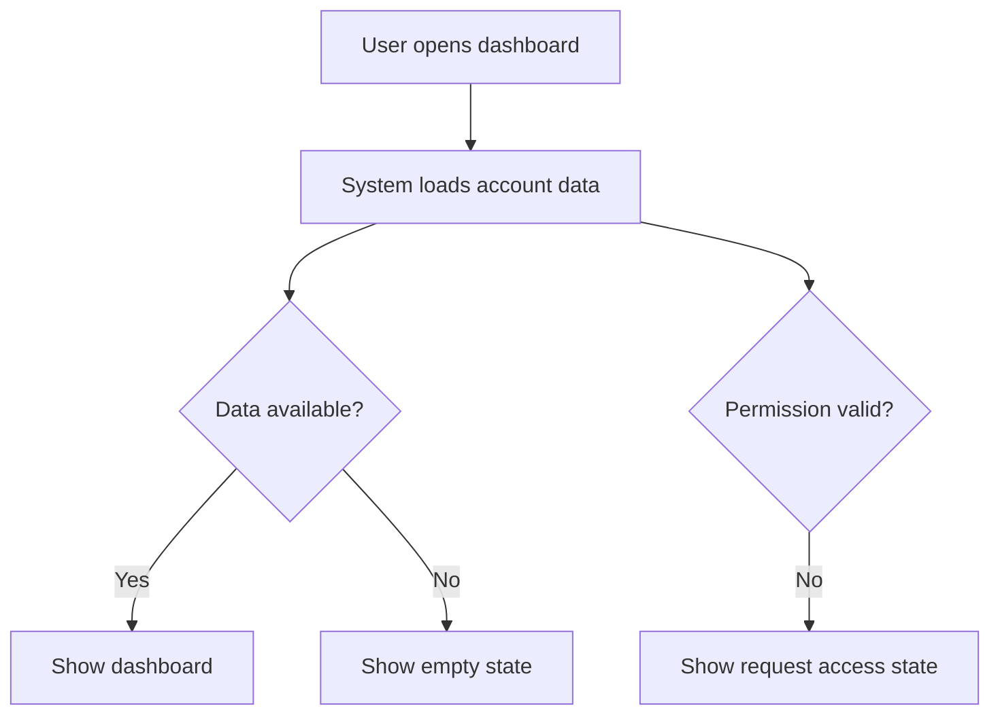

# Wireframe Guide

Use low-fidelity ASCII wireframes plus Mermaid flows. Do not produce Figma or HTML unless the user asks for them.

## ASCII Wireframe Rules

- Use fixed-width fenced code blocks with `text`.
- Keep layouts low fidelity and structural, not decorative.
- Label key regions, controls, data, errors, and actions.
- Show responsive differences when mobile and desktop experiences materially differ.
- Include primary, secondary, and destructive actions when relevant.
- Include loading, empty, error, permission, and success states for each major screen or workflow.

## Screen Template

````markdown
## Screen: [Name]

Purpose: [What user accomplishes here]

```text
+------------------------------------------------------------+
| Product / Section                                  [User]  |
+------------------------------------------------------------+
| Nav         | Main title                         [Action]   |
|-------------+----------------------------------------------|
| Item        | Content area                                  |
| Item        |                                              |
|             | [Primary control] [Secondary control]         |
+------------------------------------------------------------+
```

### States
- Loading: [Skeleton, spinner, progress, disabled controls]
- Empty: [Message and next best action]
- Error: [Error message, retry, support path]
- Permission: [Access denied or request access path]
- Success: [Confirmation and next step]
````

## Mobile Layout Template

```text
+--------------------------+
| Header              Icon |
+--------------------------+
| Summary / context        |
+--------------------------+
| Primary content          |
|                          |
|                          |
+--------------------------+
| [Primary action]         |
+--------------------------+
| Tab 1 | Tab 2 | Tab 3    |
+--------------------------+
```

## Dashboard Layout Template

```text
+----------------------------------------------------------------+
| Header                                           Filters [Run]  |
+----------------------------------------------------------------+
| KPI 1        | KPI 2        | KPI 3        | Alert summary      |
+----------------------------------------------------------------+
| Chart / trend                         | Activity / exceptions  |
|                                       |                        |
+----------------------------------------------------------------+
| Table: records, status, owner, next action                      |
+----------------------------------------------------------------+
```

## Automation Run Detail Template

```text
+----------------------------------------------------------------+
| Workflow: [Name]                         Status: [Running]      |
+----------------------------------------------------------------+
| Trigger       | Input summary            | Started / Duration   |
+----------------------------------------------------------------+
| Step timeline                                                  |
| 1. Validate input                         [Done]                |
| 2. Call integration                       [Running]             |
| 3. Write result                           [Pending]             |
+----------------------------------------------------------------+
| Logs / errors / retry controls                                  |
+----------------------------------------------------------------+
```

## Mermaid Flow Rules

- Use Mermaid for user journeys, system flows, or automation workflows.
- Use quoted node labels.
- Show decision points and failure paths, not only the happy path.
- Keep each diagram focused on one flow.

Example:



## State Coverage

For each primary screen or workflow, define:

- Default state.
- Loading or long-running state.
- Empty state.
- Validation error or integration failure state.
- Permission or blocked state.
- Success or completion state.

If a state does not apply, write `Not applicable` and briefly explain why.
