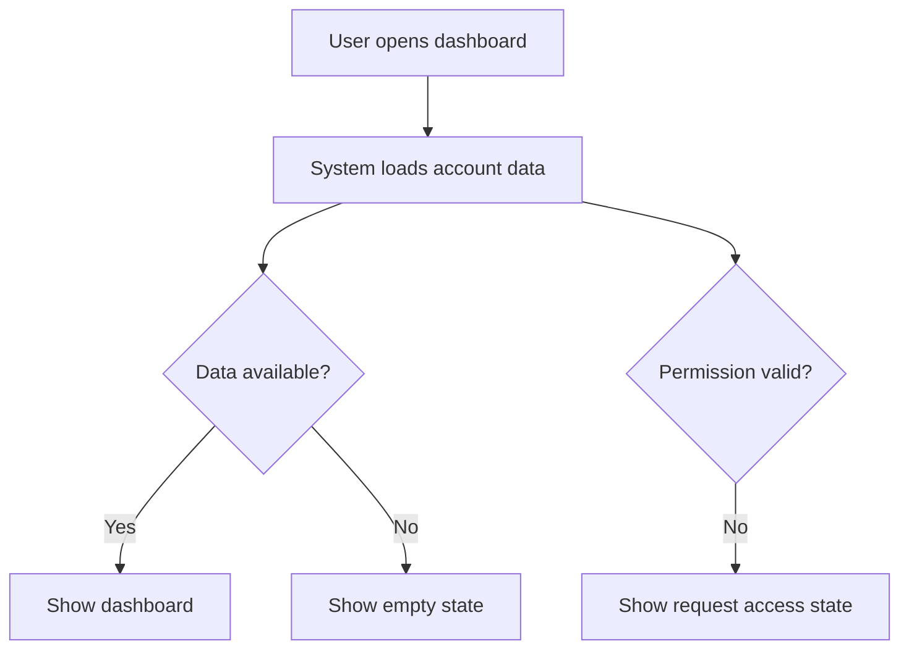

# Wireframe Guide

Use low-fidelity ASCII wireframes plus Mermaid flows. Do not produce Figma or HTML unless the user asks for them.

Across the design handoff, `PRD.md` remains canonical for product scope and low-fidelity wireframes remain canonical for screen structure, flow, visible-region responsibilities, actions, states, and trace IDs. A later visual prototype can interpret that structure, but it cannot replace it.

## Builder UX Direction Gate

Before drafting interface wireframes, ask one organized set of questions about the builder's intended experience. Resolve the builder to the human product/design decision owner or commissioning team; the implementation agent does not supply its own taste as a substitute.

Consume the recorded `Builder UX Direction Decision` from `PRD.md` and carry it into `wireframes.md`. It must cover experience priority, guided versus expert control, information density, familiar versus expressive interaction, primary layout preference, confirmation/recovery behavior, and validation depth. Mark every decision `selected`, `provisional`, or `assumed`. Use `assumed` only when the human owner explicitly authorizes that assumption; the agent cannot self-authorize it. If the decision is missing or incomplete, ask the questions, return the bounded decision update to `prd-builder` or the named product owner for recording, and stop. Do not edit `PRD.md` from this skill. Resume only after the recorded source is available.

Builder preference controls direction, not usability claims. When preference conflicts with observed user needs, accessibility, or task evidence, preserve the conflict as a hypothesis and name the prototype or user test needed to resolve it. Never label a wireframe user-validated merely because the builder approved it.

## Structural Direction And Configuration

- Freeze product and structural constraints before visual exploration: screen purpose, content responsibilities, actions, states, trace IDs, brand rules, accessibility, platform, and performance limits.
- Keep the wireframe simple: grayscale in visual tools, clear hierarchy, consistent alignment, restrained containers, and only enough detail to explain content, behavior, and flow.
- Do not ask the user to choose a fixed high-fidelity style catalog or record `modern-minimal` as the default. Product-specific visual preference discovery happens later through the Visual Direction Gate.
- Translate vague product direction into structural consequences such as information density, hierarchy, region order, imagery responsibility, container use, and interaction behavior. Defer typeface, palette, spacing scale, radius, surface styling, and motion choreography.
- Choose the layout pattern from the screen's primary task and content shape:
  - Landing or narrative page: ordered story, one first-viewport value proposition, one primary action, and secondary detail deferred.
  - App workspace or CRUD screen: stable navigation, task context, primary work area, and actions near the object they affect.
  - Dashboard or monitoring screen: summary, exceptions, trends, then records or next actions; do not force every metric into a card.
  - Form or wizard: progress and context, grouped inputs, inline validation, then one clear next action.
  - Search, catalog, or comparison screen: query and filters, result summary, scannable results, then detail or comparison.
- State the selected layout pattern and density for each important screen. Change the pattern only when the user task or content shape changes.

## Visual Direction Gate

Run this gate for every UI-bearing product after the structural wireframes pass their quality checklist and before fixing design-system tokens or components. The gate is required; optional preview tooling is not.

Select the same one or two representative screens for every direction and carry:

- the selected `UI-*` screen and region IDs;
- each screen's purpose, layout pattern, density, exact copy or display contracts, actions, states, and responsive constraints;
- the Builder UX Direction Decision, known brand constraints, and product-specific visual goals;
- the relevant sourced or reported `MR-*` findings and their source IDs from prior market research;
- an instruction that scope, routes, content responsibilities, interaction behavior, and trace IDs are frozen.

### Style And Reference Intake

Read `market-research.md` and the `MR-*` citations in `PRD.md` when they exist. Build a short Market Design Evidence Brief containing only findings that can reasonably affect audience fit, category expectations, trust, information density, differentiation, or product tone. Keep each item tied to its `MR-*` and `S-*` source IDs. Use only `sourced` or `reported` findings. Treat `UNVALIDATED` rows as open questions, not evidence. Market research about features, pricing, or competitors does not prove a visual convention or user preference; label every resulting design implication as an inference.

If prior market research was skipped, blocked, missing, or contains no relevant supported finding, say so. Ask whether the owner wants to return to `prd-builder` for research or continue with product evidence only. Do not claim that a recommendation is market-research-backed when that evidence is unavailable.

Ask the human owner what style they want and whether they already have visual references in one combined, product-specific set. Cover desired character, density, color constraints, typography feel, imagery or icon preferences, motion tolerance, disliked patterns, and optional images, screenshots, URLs, Figma views, named products, or brand references. Say that `Check This` remains available if the first directions do not fit. Derive the questions from the product's purpose, audience, content, platform, brand inputs, structural wireframes, and Market Design Evidence Brief. Never reuse a fixed catalog. The answers form a non-binding Visual Preference Brief, not a token specification. End the turn and wait for the answer; do not recommend styles in the same turn as these questions.

If the owner supplies a reference, read `design-reference-guide.md`, inspect it through the matching source route, return traceable `Adopt / Adapt / Avoid` principles, and end the turn for confirmation. Do not generate directions from owner-supplied signals before that confirmation.

### Reference-Informed Direction Recommendations

After the combined intake and any owner-supplied reference confirmation are resolved, use `frontend-design` and `design-reference-guide.md` to recommend exactly three materially different, product-specific style directions. Do not add a fourth. The only reduction is an owner-requested lightweight direction pass per `design-reference-guide.md`'s Lightweight exception, which the agent never proposes. Find and inspect one current public reference for every direction; add a second only when it contributes a distinct useful mechanic. Include one contemporary/modern direction by default and a second only when preference, product constraints, and valid evidence support a materially different modern treatment. If the owner rejects modern or a product, platform, brand, or accessibility constraint makes it unsuitable, explain the exception rather than forcing it. Modern is an evidence-backed quality lane, not a fixed catalog entry or `modern-minimal` default.

Base each recommendation on the Visual Preference Brief, valid Market Design Evidence Brief, inspected visual references, and frozen product constraints. For each direction, provide:

- a versioned direction ID such as `VD-R1-01`, modernity classification, memorable style name, and one-sentence concept;
- why it fits the owner's stated preferences;
- the market basis when available, citing applicable `MR-*` and `S-*` IDs and clearly labeling every design inference;
- one or two inspected `REF-*` visual sources with direct URL, retrieval date, evidence status, limitations, and observed mechanics;
- proposed `RP-*` `Adopt / Adapt / Avoid` principles, each resolving to one or more of those inspected `REF-*` sources;
- character, hierarchy, density, color roles, typography roles, surfaces, icon or media treatment, motion approach, and signature decisions;
- the main tradeoff and an explicit avoid list.

Do not call a direction market-supported when prior market research was skipped, blocked, missing, `UNVALIDATED`, or irrelevant. `MR-*`/`S-*` and `REF-*` are separate evidence lanes and cannot substitute for one another.

The three directions use the same frozen structure and states. Make every direction reviewable, then ask the human owner to:

- `Select` one direction;
- `Reject` one or all directions;
- `Mix` named parts of multiple directions into one consolidated direction for another review; or
- `Check This` by providing a URL, screenshot, Figma view, named product, or brand reference.

For a partial `Reject`, record why and keep the remaining directions selectable; if replacements are requested, ask what should change and present a complete versioned set of exactly three rather than appending a fourth. For `Reject`-all, ask what did not fit, update the Visual Preference Brief and avoid list, then create a versioned new set of exactly three directions. For `Check This`, apply `design-reference-guide.md` to the new reference, return `Adopt / Adapt / Avoid`, and wait for confirmation before creating the versioned new set of exactly three. Record what the user actually likes instead of treating the whole reference as approval. For `Mix`, present one consolidated direction for review, but do not proceed to tokens until it is explicitly selected and its contributing principles are confirmed. In an owner-requested lightweight pass, each of these revised sets contains one direction instead of three.

`product-design-builder` must load and use `frontend-design` to create the structural wireframes and every visual direction. Apply its purposeful hierarchy, differentiation, composition, responsive, typography, color, motion, and anti-generic-UI discipline while preserving the frozen product constraints. If `frontend-design` is unavailable, stop; do not use a fallback design path. Preview HTML remains optional and requires an explicit user request. When requested, render complete dependency-free HTML previews for the same representative screens and frozen constraints. Fix tokens, primitives, components, and the registry only after the human explicitly selects the consolidated direction, or explicitly authorizes a provisional assumption.

Candidate and selected HTML are non-canonical design-stage evidence. Keep them outside the staged and published PRD package. They may explore typography, color, composition, texture, imagery, and motion, but they must not add product scope or silently change the canonical wireframes.

The published design system records the selected direction ID, compact `MR-*`/`REF-*`/confirmed `RP-*` provenance, owner confirmation, short summary, and implementation consequences. It does not preserve candidate directions or the full reference analysis.

If the visual pass exposes a structural problem, return a concise finding tied to the affected `UI-*` IDs. The parent or human product/design owner decides whether to make one bounded wireframe revision, preserves unaffected scope and IDs, and reruns the PRD quality checklist. Only then may the visual pass continue from the revised wireframe.

## ASCII Wireframe Rules

- Use fixed-width fenced code blocks with `text`.
- Keep layouts low fidelity and structural, not decorative.
- Label key regions, controls, data, errors, and actions.
- Label image/media and motion needs as `required`, `optional`, or `none`, with a short purpose. Label the style direction of visually important regions with its intended effect on hierarchy or comprehension. Before the Visual Direction Gate, use structural spacing and type-role descriptions rather than invented token values. After the design system is complete, reconcile those descriptions to the final token and component names.
- Show responsive differences when mobile and desktop experiences materially differ.
- Include primary, secondary, and destructive actions when relevant.
- Before the design system exists, include ready, loading, empty, error, permission-denied, and success outcomes plus known edge states. During final reconciliation, make each screen cover every `design-system.json` `stateMatrix` entry or mark it `n/a` with a reason.

## Content Specificity Rules

Every visible region must use one of these content modes:

1. `Exact copy`: write the actual heading, body copy, label, CTA, helper text, validation message, or state message. Mark wording as `approved` or `draft` when that status matters.
2. `Display contract`: when final wording is not available or the region is data-driven, state what the region must display, what the user should understand or do, the content or data source, and any ordering, format, count, or length constraints.

Do not leave `Main content`, `Feature section`, `Card 1`, `Lorem ipsum`, or similar generic placeholders in a final wireframe. If a decision is genuinely unresolved, write `[COPY TBD: specific question or owner]`, add it to open questions, and still provide the section's display responsibility.

## Style And Anti-Slop Structure Rules

- Give each visually important region a short `STYLE` label that describes its visual job, not just a mood word. Examples: `editorial split for narrative contrast`, `full-bleed product proof`, `dense comparison table`, or `unframed text for a quiet transition`.
- Give each animated region a `MOTION` label with `required`, `optional`, or `none`, plus what the animation communicates. `Add animation` without a purpose does not pass.
- A box in an ASCII wireframe must mean real grouping, interaction, state, or hierarchy. Do not box every section merely because ASCII makes it easy.
- Do not imply repeated bordered cards or panels with a colored side rail or accent stripe as a default visual treatment. Allow that pattern only when the stripe communicates a named state, selection, priority, category, or approved brand motif.
- Prefer open layout regions, spacing, typography, alignment, rules, or background changes when they communicate the hierarchy without another container.

## Element Inventory And Spacing

Each region contract lists its elements top-to-bottom, one line each:

`- [element type] [content ref] — [component or custom] — [type role]`

- Element type: `heading`, `text`, `button`, `link`, `input`, `image`, `icon`, `divider`, `list`, or `table`.
- Content ref: the exact-copy key or display-contract summary already in the region contract.
- Component: before the design system exists, write the required role or `custom — [one-line reason]`; during final reconciliation, replace it with the selected design-system primitive or product component. Every unresolved `custom` flag blocks publication.
- Type role: before the design system exists, use a structural role (`display`, `title`, `body`, `caption`), not a font size. Final reconciliation binds it to the design-system type token.

An element not in the inventory does not exist. Downstream image generation and implementation must not invent one; a plausible extra element in a generated image or a built page is a spec gap to add here, never something to copy into code.

Before the Visual Direction Gate, declare spacing relationships as `compact`, `default`, or `generous`, with above, below, padding, and element-gap roles. Never use raw values or vague words such as "some breathing room".

- During final reconciliation, replace each role with the selected design-system token: `Spacing: above <token>, below <token>, padding <token>, element gap <token>`. Above/below is the gap to neighboring regions, padding is inside the region's own container, and element gap sits between inventory elements.
- The same region type uses the same final tokens on every screen; only a stated reason changes them.
- Note mobile only where the relationship or final token differs from desktop. Silence means the same rule.

The final published wireframes cite names only; values live in `design-system.md` and `design-system.json`.

## SEO Copy Rules

Every screen with a public route gets an SEO block right after its Density line:

```text
SEO:
- Primary keyword: [one phrase, the way the target audience actually searches]
- Secondary keywords: [1-2 phrases]
- Meta title: [≤ 60 chars, contains the primary keyword]
- Meta description: [≤ 160 chars, primary keyword plus one concrete benefit]
```

A screen with no public route — an authenticated workspace, a modal, a wizard step — records `SEO: n/a` with the reason, so the skip reads as a decision.

- A primary keyword belongs to exactly one route in the product. Keep the route-to-keyword map in `wireframes.md`'s direction section; two routes competing for one keyword is an authoring error.
- Exactly one `H1` per screen, containing the primary keyword. Heading order `H1 → H2 → H3` never skips a level; the element inventory marks each heading's level.
- Exact copy for the H1, first paragraph, and primary CTA each contains the primary or a secondary keyword, written naturally. Copy that misses every keyword stays `draft`, not `approved`.
- Write keywords in the language the audience searches in, not the language of the internal docs.
- Every meaningful `image` element declares its alt text in the region contract (`alt: "..."`, descriptive, with a keyword only when it fits naturally). Decorative images declare `alt: ""`.
- Implementation never paraphrases a heading, meta field, or alt text. SEO copy is frozen copy: the wireframe wins.

## KISS Landing Page Rules

- Put one clear value proposition and one primary action in the first viewport.
- Give each section one job. Keep it only when it explains the offer, establishes necessary trust, resolves a blocking objection, or enables the next step.
- Do not turn every PRD requirement, feature, workflow, or proof point into a landing-page section. Defer secondary detail to deeper pages, docs, or a bounded FAQ.
- Prefer a short, ordered section list over a large collage of cards, badges, metrics, and repeated calls to action.
- Label media and motion where they are needed; do not add an image or animation merely to fill space.

## Screen Intent

Write this before drawing a screen's ASCII layout. It is the reasoning step that drives the box layout, not a label filled in after the boxes already exist:

- Main purpose: the single primary goal the user must accomplish on this screen, in one sentence. If it cannot be stated in one sentence, the screen is doing too many jobs — split it or pick the one job that wins.
- Primary emphasis: what gets the strongest visual and structural weight, and why that thing serves the main purpose.
- Secondary / quiet: what stays present but subordinate. Do not give it equal visual weight with the primary emphasis.
- Structural rationale: which layout pattern from Direction And Configuration answers the main purpose, and why that pattern over the others.

Carry all four lines into the Screen Template below verbatim. They make the layout pattern choice and the box layout traceable back to a stated reason instead of a default template.

## Screen Template

Lead the screen with the human-readable intent lines. The `UI ID` and trace IDs close the screen in a `### Trace` block, so a reader learns what the screen is for before meeting its identifiers.

`Route(s):` is the one machine-consumed line among them. Implementation looks a route up here to find its screen entry, and a route with no entry is a hard stop downstream — so write the route the way the product actually addresses it (`/settings/billing`, `/orders/:id`, a native route or deep-link name), not a prose description of it. One screen may serve several routes; list them all. A screen with no addressable route — a modal, a step inside a wizard already covered by its parent route, an email or notification surface — records `n/a` with the reason, so a missing route reads as a decision rather than an omission.

````markdown
## Screen: [Name]

Route(s): [Every route this screen serves, exactly as the product addresses it]

Main purpose: [Single primary goal, one sentence]

Primary emphasis: [What gets the strongest weight, and why]

Secondary / quiet: [What stays present but subordinate]

Layout pattern: [Landing / workspace / dashboard / form or wizard / search or catalog / justified custom pattern] — chosen because: [one sentence tying the pattern to the main purpose]

Density: [Sparse / balanced / dense, with a task or content reason]

SEO: [public route: primary keyword, 1-2 secondary keywords, meta title ≤ 60 chars, meta description ≤ 160 chars — otherwise `n/a` with the reason]

```text
[Start from the matching skeleton in Layout Skeletons by Pattern below, then adapt its regions to this screen's actual content.]
```

### States
- Ready: [Normal usable state]
- Loading: [Skeleton, spinner, progress, disabled controls]
- Empty: [Message and next best action]
- Error: [Error message, retry, support path]
- Disabled: [Why the action is unavailable]
- Permission denied: [Access denied or request-access path]
- Stale: [Freshness warning and refresh behavior]
- Expired: [Expired-session or expired-object recovery]
- Long content: [Wrapping, truncation, overflow, or expansion]
- Reduced motion: [Equivalent non-spatial feedback]
- Mobile reflow: [Order, stacking, and never-drop content]

### Content, Style, Media & Motion Notes
One block per visible region, in the order the region appears on screen.

**UI-001-R01 — [Region]**
- Content mode: [exact copy / display contract]
- Exact wording or display contract: [Verbatim wording, or what to show + intended takeaway/action + source + constraints]
- Content priority: [must-have / secondary / defer]
- Style direction: [Visual job and hierarchy/comprehension purpose]
- Element inventory: [one line per element: type, content ref, design-system component or `custom — reason`, type role]
- Spacing: [above / below / padding / element gap as spacing tokens; mobile only where it differs]
- Image / media: [required / optional / none; purpose]
- Motion: [required / optional / none; purpose]
- Notes: [Status, fallback, or handoff question]
- Trace IDs: PRD-001, UX-001

### Trace
UI ID: UI-001

Trace IDs: PRD-001, UX-001, ARCH-001
````

Write the region notes as blocks, not as one wide table. The same fields in a ten-column Markdown table wrap or need horizontal scrolling in every viewer.

## Layout Skeletons by Pattern

Start from the skeleton matching the screen's Structural rationale, then adapt region contents to the real product. Do not reuse the workspace skeleton for a landing page or a wizard merely because it is the most familiar box shape — each pattern reflects a different information architecture, and low-fidelity wireframes should already show that difference instead of hiding it behind one generic box.

### Landing or Narrative Page

```text
+------------------------------------------------------------+
| Logo / Product                                  [Primary nav] |
+------------------------------------------------------------+
| [Value proposition headline]                                |
| [One supporting sentence]                                   |
| [Primary action]                                            |
+------------------------------------------------------------+
| Section: [one job — proof, trust, or how-it-works]          |
+------------------------------------------------------------+
| Section: [next section, one job]                            |
+------------------------------------------------------------+
| Footer: [secondary links, legal]                             |
+------------------------------------------------------------+
```

### App Workspace or CRUD Screen

```text
+------------------------------------------------------------+
| Product / Section                                  [User]  |
+------------------------------------------------------------+
| Nav         | [Exact title or DISPLAY: ...]   [Exact CTA]  |
|-------------+----------------------------------------------|
| Item        | [Exact copy/data or DISPLAY: responsibility] |
| Item        |                                              |
|             | [Exact primary label] [Exact secondary label] |
+------------------------------------------------------------+
```

### Dashboard or Monitoring Screen

```text
+----------------------------------------------------------------+
| Header                                           Filters [Run]  |
+----------------------------------------------------------------+
| KPI 1        | KPI 2        | KPI 3        | Alert summary      |
+----------------------------------------------------------------+
| Chart / trend                         | Activity / exceptions  |
|                                       |                        |
+----------------------------------------------------------------+
| Table: records, status, owner, next action                      |
+----------------------------------------------------------------+
```

### Form or Wizard

```text
+------------------------------------------------------------+
| [Step indicator: Step 2 of 4 — Step name]                   |
+------------------------------------------------------------+
| [Context: why this step, what happens after]                |
+------------------------------------------------------------+
| [Field group: label, input, inline validation]               |
| [Field group: label, input, inline validation]               |
+------------------------------------------------------------+
| [Back]                                    [Primary: Continue]|
+------------------------------------------------------------+
```

### Search, Catalog, or Comparison Screen

```text
+------------------------------------------------------------+
| [Query input]                          [Sort] [View toggle] |
+------------------------------------------------------------+
| Filters: [Filter] [Filter] [Filter]           [Result count] |
+------------------------------------------------------------+
| Result       | Result       | Result                        |
| Result       | Result       | Result                        |
+------------------------------------------------------------+
| [Pagination or load more]                                    |
+------------------------------------------------------------+
```

## Mobile Layout Template

Adapt this cross-cutting responsive variant to whichever pattern skeleton above the screen uses; it is a viewport adjustment, not a sixth pattern.

```text
+--------------------------+
| Header              Icon |
+--------------------------+
| Summary / context        |
+--------------------------+
| Primary content          |
|                          |
|                          |
+--------------------------+
| [Primary action]         |
+--------------------------+
| Tab 1 | Tab 2 | Tab 3    |
+--------------------------+
```

## Specialized Example: Automation Run Detail

```text
+----------------------------------------------------------------+
| Workflow: [Name]                         Status: [Running]      |
+----------------------------------------------------------------+
| Trigger       | Input summary            | Started / Duration   |
+----------------------------------------------------------------+
| Step timeline                                                  |
| 1. Validate input                         [Done]                |
| 2. Call integration                       [Running]             |
| 3. Write result                           [Pending]             |
+----------------------------------------------------------------+
| Logs / errors / retry controls                                  |
+----------------------------------------------------------------+
```

## Mermaid Flow Rules

- Use Mermaid for user journeys, system flows, or automation workflows.
- Use quoted node labels.
- Show decision points and failure paths, not only the happy path.
- Keep each diagram focused on one flow.

Example:



## State Coverage

For each primary screen or workflow, define every state in the final `design-system.json` `stateMatrix`. Use the template's common set as the starting point, then add or remove states only through the design-system contract. If a state does not apply, write `<state>: n/a — <reason>` so validation can distinguish a deliberate exclusion from an omission.
