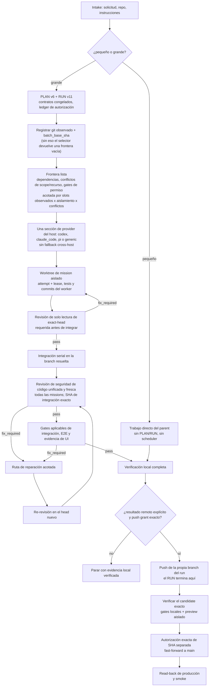

<p align="center">
  
</p>

<p align="center">
  <a href="README.md">English</a> | <a href="README.zh-TW.md">繁體中文</a> | <a href="README.zh-CN.md">简体中文</a> | <strong>Español</strong>
</p>

<p align="center">
  <a href="https://github.com/Phlegonlabs/product-delivery-harness/actions/workflows/harness-ci.yml"></a>
  
  
  
</p>

# Product Delivery Harness

Repositorio de skills para convertir una idea de producto o una solicitud de cambio en un flujo de entrega verificado con Codex, Claude Code, Pi o cualquier host que descubra un directorio de skills de usuario.

No es una colección de prompts. La suite de skills separa la definición del producto, el diseño visual, la ejecución de ingeniería y la revisión de seguridad de código, para que cada etapa tenga una única fuente de verdad, una entrega con límites claros y su propia verificación.

> Define el producto. Compila el diseño. Entrega software verificado.

## Empieza aquí

| Si tienes... | Empieza con | Lo que obtienes |
| --- | --- | --- |
| Una idea de producto | `product-definition-builder` | Requisitos, un archivo de revisión `wireframes/2` responsive para cada surface y state de UI, QA de layout en navegador, arquitectura, decisiones de stack, objetivos de release, tests e investigación de mercado con fuentes |
| Un paquete de wireframes aprobado que necesita diseño visual | UI Design Pass de `product-definition-builder`, luego `design-system-compiler` + `frontend-design` cuando el gate lo exige | Una referencia HTML de diseño, conectada y autocontenida, con todas las páginas en una barra lateral izquierda, CSS completo, flujos clicables y un mock login que entra a la UI autenticada, más un par de design-system vinculante cuando se requiere |
| Un cambio acotado en un repositorio existente | `delivery-harness` | Implementación directa para trabajo pequeño, o un flujo gestionado PLAN/RUN para trabajo grande |
| Un candidato de código integrado y fijado | `code-security-review` | Una revisión de seguridad de solo lectura, sobre el SHA exacto, con hallazgos validados de source-to-sink y brechas de cobertura explícitas |
| Un release entregado que necesita configuración externa | `product-activation` | Acciones de console autorizadas con exactitud, fuentes de medición verificadas y readiness de activación target por target |

Cada skill incluido se puede invocar por separado; el pipeline completo es opcional. Cada modo igual valida sus inputs y dependencias declaradas.

## Garantías centrales

- **El trabajo pequeño se queda pequeño.** Un cambio acotado usa un ciclo directo de inspección, implementación, verificación y revisión.
- **El trabajo grande es explícito.** PLAN v6 define el typed graph; RUN v11 registra autorización, intentos y evidencia.
- **La definición de producto termina en un gate humano.** Un paquete con UI cierra en un `wireframes.html` responsive; cada surface, target, state y acción visible del PRD debe funcionar localmente y pasar la revisión de layout en navegador antes de la aprobación del owner. El checker valida flujos de page, overlay y feedback, además de handoffs `mediaIntent` diferidos. El grading UI ejecuta una sola wave de diagnóstico completa con un lead grader por defecto y hasta dos especialistas justificados con ámbitos no superpuestos. El parent consolida todos los hallazgos antes de un único lote de reparación y una re-review; un segundo fallo vuelve al PRD o exige una estrategia estructural aprobada explícitamente por el owner, sin abrir rounds ilimitadas. Las puntuaciones describen calidad visual; las obligaciones explícitas de contrato, comportamiento, layout, state, motion y accessibility siguen siendo hard gates.
- **Los targets visuales son HTML responsive e interactivo.** La fase visual solicitada produce una referencia HTML de diseño conectada cuyos controles visibles navegan, cambian de state, abren overlays registrados o muestran feedback. El Motion Need Gate del PRD marca cada surface clave como `required`, `recommended`, `not_required` o `blocked`; el owner puede elegir la dirección o aceptar una recomendación de la IA, mientras que el motion generado o que cambie el scope sigue siendo una decisión humana. El motion UI funcional requerido puede ejecutarse localmente en la referencia con una ruta reduced-motion equivalente. Las posiciones de imagen y motion generados quedan como placeholders estáticos con prompts dedicados y `generationStatus: deferred`; ningún proveedor de generación se ejecuta hasta una pasada MCP posterior y explícitamente autorizada. Un Technical Hard Gate rechaza errores de runtime, requests inesperadas, states inaccesibles, efectos de eventos duplicados y fallos del motion requerido. El gate humano de la referencia de diseño exige una puntuación global mínima de 90 y puntuaciones mínimas de 90 en layout `H2`, responsive `H4` y accessibility `H8`; las puntuaciones no críticas entre 60 y 79 son advisory y no abren rounds para perseguir puntuación. Las referencias aprobadas se conservan bajo `docs/design/ui-references/` y los conjuntos reemplazados se archivan en vez de borrarse.
- **Los workers están aislados.** Las missions de escritura usan worktrees dedicados y scopes acotados. El parent valida cada commit y diff devueltos.
- **Cada graph attempt es durable.** Los nodos que no son de mission reservan un attempt, ejecutan su check o acción externa fuera del RUN lock y luego registran outcome y evidencia; un attempt no-runtime interrumpido se registra como `blocked` por la misma ruta de resultados. Un verificador local solo puede ignorar el RUN tracked para efectos de dirty-status: la ruta debe resolver dentro del checkout, y sus bytes exactos y la identidad del archivo quedan protegidos durante la ejecución y el registro del resultado.
- **Los runtime bindings son explícitos.** `lease-worker` deriva provider, driver, model, effort y ejes de runtime portables del directive seleccionado, acepta `--task-thread-id` solo para app tasks, acepta un target exacto existente y materializa un target exacto nuevo solo desde un wildcard grant activo, sin ampliar la autoridad.
- **Tener capacidad no es tener permiso.** Un runtime puede poder hacer push o limpieza, pero cada acción sigue necesitando autorización exacta.
- **La activación se lee de vuelta.** La configuración externa queda fuera de PLAN/RUN, liga la aprobación a un action digest exacto y solo se considera verified tras un read-back independiente y evidencia de comportamiento.
- **La evidencia sigue al SHA.** Un commit nuevo invalida la evidencia previa de gates y UI del head anterior.
- **La seguridad de código es una revisión final nueva.** Cada PLAN gestionado nuevo la marca explícitamente como required o registra por qué una entrega sin código no aplica. La revisión required ejecuta `code-security-review` sobre cada mission en el SHA de integración unificado antes de la broad final validation; su scope declarado debe contener el write scope de cada mission. Valida el resultado estructurado del agente y no puede reutilizar evidencia previa de un tree idéntico. Un PASS de seguridad no tiene exclusions y necesita al menos una revisión de tool o manual registrada como `passed` o `findings`. El nodo required no se puede saltar ni reemplazar; reserve y completion reverifican el Git vivo. Un recibo de interrupción exacto puede quedar como historial solo después de que un reviewer actual posterior entregue el PASS estructurado.
- **La promoción es main-only.** El RUN por defecto termina localmente y solo puede hacer push de su propia branch. La entrega inicial y los enhancements parten del `main` remoto observado; tras cerrar el RUN, el candidato exacto debe pasar todos los gates locales y del preview environment aislado antes de un fast-forward a `main` con autorización separada.

## Qué incluye

| Skill | Úsalo para | Salida principal |
| --- | --- | --- |
| `product-definition-builder` | Descubrimiento de producto, la evaluación research-first previa al borrador y su Research Gate, requisitos, inputs de Builder UX Direction, wireframes interactivos y responsive con QA en navegador y calificación multi-agent condicional ligada al PRD, arquitectura, decisiones de stack, objetivos de release, obligaciones de test, la pasada de reconciliación post-borrador de market research, el UI Design Pass opcional con HTML interactivo de referencia de diseño y generación diferida de media y motion, y la revisión de outcome post-despliegue | `PRD.md`, `research-assessment.md`, `wireframes.html` (productos con UI), `architecture.md`, `stack-decisions.md`, `market-research.md`, `outcome-review.md` |
| `design-system-compiler` | Compilar un UI Design Handoff aprobado en el par design-system congelado, incluyendo el conjunto responsive aprobado exacto y las reglas de layout-safety. Debe cargar el skill `frontend-design` separado y se detiene si esa dependencia no está disponible. | `design-system.md`, `design-system.json` |
| `delivery-harness` | Size gate compartido, PLAN/RUN, autorización, verificación local e integración, más la referencia de adaptadores de runtime (`references/runtime-adapters.md`) que contiene un contrato compartido y una sección de provider por host (Codex, Claude Code, Pi o generic) | Trabajo directo o `PLAN.md` + `RUN.md` |
| `code-security-review` | Revisión de seguridad de solo lectura tras la implementación y la integración unificada, preferentemente en un agente sibling fresco; el penetration testing activo y la remediación quedan fuera de este skill | Decisión de SHA exacto, cobertura de trust boundaries, hallazgos validados y tests de remediación |
| `product-activation` | Configuración post-entrega para targets web, iOS y browser-extension, incluyendo capability routing, autorización exacta de acciones externas, read-back, fuentes de medición y handoff del outcome review | `docs/ACTIVATION.md` |

El núcleo de entrega toma una decisión de tamaño antes de invocar la orquestación gestionada:

- El trabajo pequeño sigue siendo directo, sin planner, scheduler, PLAN/RUN, subagent ni preflight de runtime externo por defecto.
- El trabajo grande entra en planificación gestionada. Puede usar `PLAN.md` y `RUN.md` para una entrega gestionada-secuencial o para múltiples missions y handoff durable; el `docs/tasks.md` del proyecto objetivo es una vista humana bajo demanda, no un estado requerido. Este repositorio fuente no mantiene un log de flujo `Tasks.md` raíz separado.
- El selector deriva `managed_sequential` para menos de dos missions de escritura segura realmente seleccionadas y `parallel_graph` para dos o más. El fan-out del scheduler arranca solo para el segundo; el runtime driver sigue siendo un hecho de transporte separado. El núcleo aplica exactamente una sección de provider del host desde la referencia de adaptadores de runtime; los runtimes externos se preflightean solo cuando la ruta seleccionada los necesita.
- La ejecución del RUN nunca espera al CI remoto. La promoción de branches es una etapa de closeout separada: la verificación del candidato exacto y del preview environment aislado aplicable debe terminar antes de que `main` pueda moverse.

Tamaño significa scope de coordinación y blast radius, no un conteo bruto de archivos o líneas. Si el trabajo pequeño crece, el Harness conserva el trabajo completado y planifica solo el resto.

## Cómo encaja el sistema

```mermaid
flowchart LR
  Idea["Idea de producto o solicitud de cambio"] --> PRD["product-definition-builder\nDefinición de producto y técnica"]
  PRD --> Wireframe["wireframes/3 HTML\nmatriz responsive estructural"]
  Wireframe --> Gate{"Wireframe Approval Gate\nowner humano"}
  Gate -->|"aprobado, con diseño visual solicitado"| Design["UI Design Pass\ndesign-system-compiler cuando se requiere"]
  Gate -->|"aprobado, sin fase visual"| Harness["delivery-harness\nNúcleo de entrega compartido"]
  Design -->|"referencia HTML de todas las páginas aprobada o par design-system"| Harness
  Harness --> Runtime["Una sección de provider del host\nCodex, Claude Code, Pi o generic"]
  Runtime --> Security["code-security-review\nrevisión unificada fresca de SHA exacto"]
  Security --> Evidence["Tests finales amplios y evidencia de UI"]
  Evidence --> Push["Push opcional del run branch exacto\nRUN cierra"]
  Push --> Candidate["Verificar el candidate SHA exacto\ngates locales + preview aislado"]
  Candidate --> Main["Autorización separada de fast-forward\nSHA exacto a main"]
  Main --> Activate["product-activation\nconfiguración externa + read-back"]
  Activate --> Outcome["Fuentes de medición verificadas\noutcome review posterior"]
```



Puedes empezar en cualquier etapa. Por ejemplo, usa solo el Harness para arreglar una app existente. Los skills mantienen sus responsabilidades separadas: `product-definition-builder` define el producto y termina en el `wireframes.html` aprobado; el UI Design Pass opcional y `design-system-compiler` definen el contrato visual — la pass deja una referencia HTML de diseño, autocontenida y aprobada en `docs/design/ui-references/<run-id>/`, con todas las páginas en una barra lateral izquierda, CSS completo, flujos clicables y handoffs diferidos de media/motion; el Harness implementa el resultado congelado; `code-security-review` revisa el candidato unificado sin editarlo; y `product-activation` configura y verifica el release entregado sin reabrir el RUN de entrega.

### Ciclo de vida completo de los skills

El ciclo de vida completo a través de los cinco skills, con cada gate y los mecanismos transversales:

```mermaid
flowchart TB
    user([Idea del usuario o solicitud de cambio])

    subgraph PRD["product-definition-builder — definición de producto"]
        direction TB
        interview[Entrevista estructurada<br/>3 segmentos de texto libre + AskUserQuestion]
        pkg["Borrador del paquete core<br/>PRD.md + architecture.md<br/>+ stack-decisions.md"]
        wf["wireframes.html<br/>un archivo de wireframe interactivo (productos con UI)"]
        wgate{{"Wireframe Approval Gate<br/>(la aprobación humana = un punto de parada completo)"}}
        ra["Evaluación research-first<br/>research-assessment.md (omitible)"]
        rgate{{"Research Gate<br/>go | clarify | stop"}}
        interview --> ra --> rgate --> pkg --> wf --> wgate
        mr["market-research.md<br/>(pasada de brechas, omitible)"]
        ra -.-> mr
        pkg -.-> mr
    end

    subgraph DESIGN["Diseño visual (opcional; solo a pedido explícito del owner)"]
        direction TB
        taste["UI Design Pass<br/>taste skill vía el slot de Skill Bindings"]
        handoff[UI Design Handoff]
        dgate{{"Design System Need Gate"}}
        pair["design-system-compiler<br/>design-system.md + design-system.json"]
        taste --> handoff --> dgate
        dgate -->|required| pair
        dgate -->|not_required| target[Target aprobado fiel a las páginas]
    end

    subgraph HARNESS["delivery-harness — núcleo de entrega"]
        direction TB
        route["System Review And Route<br/>(solo parent, de solo lectura)"]
        size{{"Project Size Gate"}}

        subgraph DIRECT["Ruta directa (pequeño)"]
            direct_impl["Implementar directamente -> verificación local<br/>-> revisión de seguridad de código -> acciones Git autorizadas"]
        end

        subgraph MANAGED["Ruta gestionada (grande)"]
            direction TB
            plan["PLAN v6<br/>typed graph: missions / reviews / gates<br/>allowed_providers + commits atómicos de task"]
            newrun["new_run.py genera<br/>RUN v11 + el ledger de autorización de 12 claves"]

            subgraph LOOP["Bucle de ejecución (por wave)"]
                direction TB
                lock["--session-id acquire-run-lock<br/>(run lock + heartbeat)"]
                obs["record-observation<br/>snapshot de Git vivo"]
                sel["select_ready_nodes.py<br/>selección determinista de la frontera"]
                accept["accept-wave<br/>(binding de base por lote)"]
                adapters["resolver el agent driver disponible<br/>bajo el contrato compartido"]
                lease["lease-worker<br/>(worktree + lease + graph binding)"]
                workers["workers agentes frescos y acotados"]
                record["record-worker-result<br/>revalida evidencia + actualización atómica del RUN"]
                review["revisión de exact-head<br/>(reserve -> reviewer -> record)"]
                integ["record-integration<br/>(serial; SHA del candidato unificado)"]
                lock --> obs --> sel --> accept --> adapters --> lease --> workers --> record --> review --> integ
            end

            plan --> newrun --> LOOP
            security["code-security-review<br/>sibling fresco; todas las missions; SHA exacto"]
            gates2["Validación final amplia<br/>(E2E / regresión / matriz de evidencia de UI)"]
            LOOP --> security --> gates2
        end

        route --> size
        size -->|pequeño| DIRECT
        size -->|grande| MANAGED
    end

    subgraph DEPLOY["Despliegue (plataforma conectada a Git)"]
        direction TB
        handoff["Actualizar docs/DEPLOYMENT.md<br/>(nombres de secretos + tareas de consolas externas)"]
        push["Push autorizado<br/>del run branch"]
        preview["Los preview builds salen solos<br/>(la plataforma construye por push)"]
        merge([El usuario hace merge a main])
        prod["Despliegue a producción<br/>(la plataforma construye desde main)"]
        check["Verificación post-despliegue (solo lectura)<br/>check_deployment.py"]
        status["Reconciliar el registro de despliegue<br/>(estado + acciones humanas pendientes)"]
        handoff --> push --> preview --> merge --> prod --> check --> status
    end

    subgraph ACTIVATE["product-activation — activación post-entrega"]
        direction TB
        profiles["Seleccionar perfiles core + surface<br/>docs/ACTIVATION.md"]
        capability["Probar connector / API / CLI<br/>Browser / Computer Use / manual"]
        actions["Acciones ACT-* exactas<br/>autorización + read-back"]
        ready["Readiness de activación por target<br/>fuentes MS-* verificadas"]
        profiles --> capability --> actions --> ready
    end

    subgraph OUTCOME["Revisión de outcome post-release"]
        outcome["outcome-review.md<br/>(a pedido del owner, tras la ventana de medición)"]
        verdict{{"Veredicto: no_change | enhancement | incident"}}
        outcome --> verdict
    end

    subgraph CROSS["Mecanismos transversales (todas las etapas)"]
        bindings["Skill Bindings<br/>(tabla de slots en AGENTS.md + pins SHA-256)"]
        ledger["Ledger de autorización<br/>12 claves de acción independientes"]
        ver["Version gate + contract digest<br/>(frontera de wave compatible_old)"]
        watch["watchdog + reconcile<br/>(recuperación de interrupciones)"]
    end

    user --> interview
    wgate -->|continuar hacia diseño visual| DESIGN
    wgate -->|parar aquí| HARNESS
    pair --> route
    target --> route
    mr --> route
    DIRECT --> handoff
    gates2 --> handoff
    status --> profiles
    ready --> outcome
    verdict -.->|siguiente solicitud de enhancement| interview
```



El Wireframe Approval y el merge a `main` siguen siendo gates humanos. El bucle de ejecución de la entrega queda dentro de PLAN/RUN; la Activation post-entrega arranca solo después de cerrar el RUN y aplica sus propias aprobaciones exactas de acciones externas.

Para cada release desplegable, `docs/DEPLOYMENT.md` es el handoff del operador. Product Definition lo siembra; Delivery Harness lo reconcilia contra las declaraciones de entorno registradas, el CI y el código de auth/integración antes del push, y luego registra el resultado de despliegue de solo lectura. Cada unidad publicada de forma independiente recibe un nombre de surface en minúsculas: producción usa el nombre canónico `<product-slug>-<surface-suffix>` sin `-prod`, y desarrollo usa ese mismo nombre más `-dev`. Los sufijos normales son `web`, `api` y `extension`; los artifacts nativos y las unidades independientes de admin, worker, jobs, agent, webhook, realtime o CLI usan un sufijo descriptivo propio. El provider y la tienda quedan separados salvo que sus artifacts sean realmente distintos. El registro también lista los nombres exactos de secretos y variables, su ubicación en preview y producción, y tareas de consolas externas como las URLs de callback de auth, pero nunca guarda valores de secretos.

Después de la entrega, `product-activation` crea o reconcilia `docs/ACTIVATION.md`, selecciona los perfiles aplicables de web, iOS o browser-extension, usa la ruta más segura disponible entre connector/API/CLI/Browser/Computer Use y ejecuta solo acciones autorizadas de forma exacta. Las capabilities y la evidencia se ligan al target, entorno, SHA fuente e identidad de artifact/build exactos; el resultado coincidente más nuevo controla el readiness. Registra la configuración separada de la verificación, nunca guarda valores de secretos, mantiene los targets híbridos no soportados fuera de su gate y entrega las fuentes `MS-*` verificadas que coincidan a la revisión de outcome posterior.

El bucle se cierra en ambos extremos. Antes de cualquier decisión de conjunto cerrado, la evaluación research-first frena el borrador con un Research Gate humano `go | clarify | stop` — publicado como `research-assessment.md` con hallazgos estables `RA-*` y reconciliado por la pasada de market research post-borrador. Después de la Activation y la ventana real de medición, el owner puede pedir `outcome-review.md`: valores reales medidos contra las métricas del PRD y las señales esperadas `TEST-*`, usando solo fuentes verificadas coincidentes, con un veredicto `no_change | enhancement | incident` que alimenta el siguiente run de enhancement.

Los cambios pequeños post-entrega mantienen el mismo contrato de producto sin forzar un PLAN/RUN nuevo. Cuando existe `docs/product/PRD.md`, el `AGENTS.md` sembrado exige que cada cambio directo actualice los requisitos del PRD y los trace IDs afectados en el mismo cambio. Clasifica el impacto de UI como `none`, `structure`, `style` o `both`; agregar una página o ruta es al menos `structure`, así que el UI Surface Contract afectado y las páginas de `wireframes.html` se actualizan y se vuelven a aprobar. Los cambios de style revisitan la dirección de UI aprobada, y solo un delta formal de design-system aprobado cambia el par design-system. Los IDs, páginas y decisiones no afectadas quedan iguales.

La higiene de gitignore también aplica al trabajo directo y al gestionado. El scan de scope registra si una task cambia una clase de artifact local, y luego deriva las reglas más estrechas del toolchain observado. Los archivos de entorno y credenciales con valores, el output de build reproducible, los directorios de dependencias, cachés, logs y el estado local de plataformas se ignoran; el código fuente, los tests, los lockfiles, las migraciones, los ejemplos y schemas de configuración registrados y los artifacts canónicos de producto o entrega siguen visibles. Una nueva lectura de variable de entorno actualiza el ejemplo registrado y la regla de ignore en la misma task. El Harness verifica rutas representativas con `git check-ignore`, `git status --ignored` y `git ls-files`; nunca lee un valor de secreto ni esconde un worktree sucio, y un posible secreto ya registrado en Git detiene el run para que actúe el owner.

Los productos comerciales ahora pasan dos decisiones separadas de Product Definition. El Monetization Infrastructure Gate resuelve el modelo, las reglas de pricing/oferta, las surfaces de compra, la fuente de entitlement y el responsable de merchant-of-record/tax antes de comparar opciones actuales como native store billing, RevenueCat, Qonversion, Adapty, Superwall, Stripe Billing, Paddle o Lemon Squeezy; el pricing nunca hace de RevenueCat el default. El Partner Channel Gate resuelve de forma independiente `none`, affiliate, referral, reseller o hybrid. Compara herramientas de link/comisión como Rewardful o FirstPromoter, plataformas de partners más amplias como PartnerStack, una ruta de afiliados integrada de Lemon Squeezy o un servicio de reseller a medida. Billing, entitlement, paywall, tax, atribución, comisión/payout y operaciones de reseller siguen siendo contratos separados de PRD, arquitectura, stack, UI, mission y test.

## Modelo de entrega

El Harness se construye sobre límites explícitos:

1. Inspecciona el proyecto actual e identifica el trabajo requerido.
2. Congela los contratos, fuentes, scopes y pasos de verificación relevantes.
3. Planifica las dependencias antes de empezar la implementación cuando la tarea es lo bastante grande para necesitarlo.
4. Usa workers en paralelo solo cuando al menos dos missions de escritura segura están realmente seleccionadas, el trabajo es independiente y aislado, y cada acción está explícitamente autorizada; el modo gestionado-secuencial igual prueba su escritor aislado, su scope/head y sus gates de revisión.
5. Verifica los resultados de las tasks y las integraciones, ejecuta una revisión de seguridad de código unificada y fresca, luego verifica los recorridos de UI donde aplique y el diff final. Una sola mission no tiene un gate de lote cross-mission inventado.
6. Detén el RUN con evidencia local verificada por defecto. Cualquier push del run branch necesita intención exacta. Tras cerrar el RUN, completa la verificación del candidate exacto y del preview environment aislado aplicable, y luego autoriza por separado el fast-forward de ese SHA a `main`; lee de vuelta y verifica producción.

Para el trabajo respaldado por un plan, registra el scope de la task, las dependencias, la propiedad de los workers, los comandos de verificación y la autorización específica por acción. Un test que pasa no autoriza un push, la eliminación de un worktree ni el borrado de una branch. El push de RUN-v11 exige además intención remota explícita, un único target de integration-branch exacto y autorización del head actual; una identidad de default-branch desconocida falla el push de forma cerrada sin bloquear la ejecución local no relacionada.

Antes de aceptar una wave, el Harness reverifica el árbol de producto limpio observado en la integration branch no default, liga el lote a ese head exacto, vuelve a ejecutar el selector y acepta solo su frontera actual completa. El gate de árbol limpio excluye solo el archivo RUN tracked exacto que las transiciones necesariamente actualizan; cualquier otro cambio sigue bloqueando. Un checkout de integración vinculado se registra como el parent, mientras el checkout primario limpio de Git sigue siendo un sibling reconocido. El run lock durable es dueño del dispatch; un lock corto del sistema operativo serializa cada transacción de lectura/validación/escritura del RUN. Las fuentes congeladas de PRD, wireframe y design-system van ligadas por byte-hash tanto en la validación standalone como en la ruta de escritura de transiciones. Cada PRD congelado se parsea incluso cuando PLAN declara cero surfaces de UI. Cada surface de PRD estructurado posee una ruta literal; un PRD localizado con UI mantiene exactamente un par de fronteras language-neutral y un ancla de `route` y `states` por entrada; los IDs, rutas y states coinciden exactamente entre artifacts. El par design-system mantiene filas fuente separadas de Markdown y JSON, su contrato generado y los namespaces del compiler deben coincidir, y cada trace `DS-*` de PLAN se resuelve por el mismo registro JSON globalmente único. product-definition-builder agrupa cada decisión cerrada aplicable a la capacidad real por llamada de la herramienta de preguntas; no tiene un target de llamada específico de Codex y no descarta ninguna decisión para caber en un conteo del host.



## Adaptadores de runtime ligeros

El núcleo compartido es dueño del único plano de control de PLAN/RUN. Los detalles de lanzamiento específicos del host viven en una referencia — `delivery-harness/references/runtime-adapters.md` — con un contrato de adaptador compartido y una sección de provider por host, aplicadas de forma perezosa:

- Un host aplica solo su propia sección de provider y ejecuta solo los nodos de PLAN cuyo `allowed_providers` incluye ese host.
- Un host Pi deja la selección de role/model/fallback a la configuración instalada de Pi.
- Ninguna sección de provider puede invocar otro runtime. Un nodo listo cuyo provider no coincide con el host actual se difiere con `runtime_unavailable` y queda para un run alojado por un host coincidente.
- Agregar un nuevo host de runtime agrega una sección de provider a esa referencia, no un skill nuevo.

Los scripts, schemas, referencias y templates compartidos quedan bajo `delivery-harness`; las secciones de provider enlazan a ellos en vez de duplicar runtimes. Esto mantiene el prompt por defecto pequeño.

Un run tiene un solo active host a la vez. Un handoff en el mismo repositorio (same-repository) solo se permite después de que el Host A cierre su wave y `RUN.active_wave.status` no sea ni `active` ni `proposed`; el objeto `active_wave` permanece en RUN, así que su ausencia no es una señal de handoff. El Host B preserva PLAN/RUN y el estado del graph, vuelve a probar su runtime y revisa el SHA exacto actual (exact SHA) antes de seleccionar la siguiente wave. Una reparación regresa al Host A e invalida la revisión vieja; el handoff cross-machine no está soportado hasta que un schema futuro agregue identidad portable de repositorio/estado.

## Graph engineering y Dynamic Workflows

Los skills usan dos capas de graph:

- El **org graph** es el contrato estable de roles: producto, arquitectura, UX, design-system, mission-worker, reviewer de surface, reviewer de seguridad, aprobación, integración y responsabilidades de ciclo de vida.
- El **work graph** es el graph de tareas temporal de un run. Los workflows de PRD y diseño usan analysis graphs acotados solo cuando el host puede imponer un tool profile `builder_readonly`; si no, caen al parent secuencial. La ingeniería usa el graph canónico de PLAN v6 y el estado de RUN v11.

Las entrevistas y aprobaciones quedan fuera de los workflows en ejecución porque Claude Code Dynamic Workflows no puede pedir input del usuario a mitad de run. El parent congela los inputs primero, ejecuta un workflow acotado y luego es dueño de las escrituras por etapas, la resolución de conflictos, la aprobación y la publicación.

Para ingeniería, el Harness valida y selecciona la frontera lista por dependencias antes de crear o pedir worktrees. Las missions nativas de Claude usan worktrees gestionados por el parent bajo `.claude/worktrees/`, ligan cada worker a la base exacta del lote y exigen `EnterWorktree` antes del acceso al repositorio. En cada ruta, el parent valida el commit devuelto y el diff real de Git, integra los commits aceptados en serie y recalcula la frontera del graph.

Los nodos de graph no-runtime usan una secuencia reserve/execute/record: `reserve-node-attempt` crea el recibo bajo RUN lock, la aprobación, la espera externa, el verificador determinista o el efecto secundario de ciclo de vida se ejecuta fuera de ese lock, y `record-node-result` cierra solo el attempt coincidente con evidencia y una fase derivada de su outcome declarado. Las transiciones de ciclo de vida registran evidencia solamente; nunca ejecutan la acción. `lease-worker` lleva el binding de runtime derivado del selector y la identidad exacta de task/thread hacia RUN, sujeto a checks de compatibilidad y autorización wildcard existente.

Claude Graph Workflow agrupa una frontera mixta en una llamada por homogeneous `tool_profile`; el model y el reasoning effort pueden variar dentro de un grupo, pero una llamada nunca mezcla write missions con read-only reviews. Un tool profile es una etiqueta y un contrato de prompt/resultado, no una permission-level tool removal.

- `mission_write` exige `EnterWorktree` y el contrato de escritura acotado de la mission.
- `code_review_readonly` exige revisión de rutas exactas y evidencia de resultado de solo lectura para revisión de frontend, backend, integración o seguridad; no elimina las tools heredadas.
- `visual_review_readonly` revisa screenshots retenidos u otra evidencia existente con las tools heredadas del host; el acceso nuevo a navegador debe ser vetado y agregado al contrato del profile antes de usarse.

Cuando Claude Code devuelve IDs reales de Workflow run, el estado de RUN puede retener el ID de workflow/task, el digest del script, el grupo de nodos, el binding graph/base, el tool profile, el estado y las métricas disponibles. El resume en la misma sesión puede usar ese binding; la recuperación cross-session arranca un nuevo attempt de workflow desde el estado canónico de PLAN/RUN.

El `allowed_providers` de un nodo de graph debe incluir el host que realmente está ejecutando el Harness antes de que ese nodo pueda seleccionarse. Codex, Claude Code y Pi no pueden delegar un nodo entre ellos; no hay puente cross-host. Un nodo listo cuyo provider no coincide con el host actual se difiere con `runtime_unavailable` y queda para un run alojado por el adaptador coincidente.

## Instalación

El repositorio es público, así que no se necesita permiso de acceso. Necesitas al menos un host que descubra un directorio de skills de usuario como `~/.agents/skills/` — Codex, Claude Code, Pi o cualquier otro.

```bash
git ls-remote https://github.com/Phlegonlabs/product-delivery-harness.git HEAD
```

### Configuración más rápida

Clona el repositorio y ejecuta el instalador. Mueve cualquier copia existente a un solo backup con timestamp bajo `~/.agents/skill-backups/product-delivery-harness/`, copia los cinco skills de Product Delivery Harness en `~/.agents/skills/` y verifica cada `SKILL.md` copiado:

```bash
git clone https://github.com/Phlegonlabs/product-delivery-harness.git
cd product-delivery-harness
./install.sh             # macOS / Linux / Git Bash
# Windows PowerShell: powershell -ExecutionPolicy Bypass -File install.ps1
```

Equivalente manual:

```bash
cp -r product-delivery-harness/skills/delivery-harness \
      product-delivery-harness/skills/product-definition-builder \
      product-delivery-harness/skills/design-system-compiler \
      product-delivery-harness/skills/code-security-review \
      product-delivery-harness/skills/product-activation \
      ~/.agents/skills/
```

Si el checkout tiene directorios locales `__pycache__` bajo `skills/`, exclúyelos o bórralos de la copia — los hosts nunca necesitan el bytecode. En Windows, `Copy-Item -Recurse` hace lo mismo. El instalador es también el actualizador: volver a ejecutarlo respalda las copias anteriores y las reemplaza. Una actualización necesita aprobación explícita de install/update y ninguna sesión activa que use los skills. Copia los cinco directorios actuales, verifica que sus archivos coincidan con el checkout y arranca una sesión fresca del host. Restaura el backup si la verificación falla; nunca sobrescribas ni borres las copias anteriores.

Al actualizar desde 0.23 o anterior, archiva los directorios heredados bajo sus IDs originales (archive the legacy directories under their original IDs) en ese mismo backup. Luego instala sus reemplazos — `full-harness` → `delivery-harness`, `prd-builder` → `product-definition-builder` y `product-design-builder` → `design-system-compiler` — más el skill nuevo `product-activation`. Después de copiar, verifica que los tres IDs heredados ya no estén en `~/.agents/skills/`; si no, el host descubrirá skills duplicados con triggers solapados.

Los cinco skills incluidos se pueden invocar de forma independiente, pero los modos cross-skill imponen sus dependencias. La validación de wireframe congelada usa el checker de `product-definition-builder` junto a `delivery-harness`; `design-system-compiler` exige un UI Design Handoff de PRD aprobado, un `wireframes.html` aprobado y `frontend-design`; el UI Design Pass opcional usa un skill de dirección de diseño más un skill de implementación frontend; las entregas gestionadas de código nuevas usan `code-security-review` en el slot `code_security_verification` después de la integración; y `product-activation` consume el handoff de release y despliegue después de la entrega. Instala las dependencias del modo que ejecutes.

### Flujo Zero-to-one

1. Instala un host soportado (Codex, Claude Code, Pi o cualquier host que descubra `~/.agents/skills/`) y los cinco skills de Product Delivery Harness, y usa ese host para el run.
2. Arranca una sesión fresca del host, confirma que el skill es visible e invoca `delivery-harness`.
3. Deja que el size gate elija trabajo directo o PLAN/RUN; no pre-crees workers para trabajo pequeño.
4. Para un run grande, mantén un solo host activo a la vez y cierra/revisa cada wave antes de un handoff en el mismo repositorio.

## Prompts típicos

Codex acepta la forma `$skill-name` de abajo. En Claude Code o cualquier otro host, pide el skill por nombre, como `product-definition-builder`. En Pi, usa su project skill descubierto o pasa el directorio del skill con `--skill`, y luego pide `delivery-harness` por nombre.

```text
Usa $product-definition-builder para convertir esta idea en un PRD, wireframes responsive para cada página, target y state, QA de layout en navegador, arquitectura, decisiones de stack, objetivos de release y obligaciones de test.
```

```text
Usa $product-definition-builder para revisar cada combinación página-target-state del wireframes.html en staging, confirmar sin solapamiento ni overflow no intencional en un navegador real, y registrar la decisión del Wireframe Approval antes del trabajo visual o de implementación.
```

```text
Los wireframes están aprobados; continúa hacia el diseño visual con el UI Design Pass de $product-definition-builder. Renderiza cada página y state aprobado en un solo HTML de referencia de diseño autocontenido con CSS completo, una barra lateral izquierda con todas las páginas, flujos clicables y mock login que salta directo a la UI autenticada. Haz browser-check de la matriz completa responsive/state y conserva el archivo aprobado bajo docs/design/ui-references/, invocando $design-system-compiler solo cuando el Design System Need Gate lo exija.
```

```text
Usa $delivery-harness para implementar el plan aprobado, construyendo cada página desde su referencia HTML aprobada en docs/design/ui-references/ dentro de la tolerancia registrada.
```

```text
Usa $delivery-harness para revisar la app existente, planificar el trabajo requerido y detenerte antes de implementar.
```

```text
Usa $delivery-harness para implementar el plan aprobado. Crea una branch y haz commit del cambio verificado, pero no hagas push ni abras un PR.
```

```text
Usa $delivery-harness para implementar este plan y hacer push de la branch verificada. Yo abriré el PR y me encargaré del merge.
```

```text
La entrega está completa. Usa $product-activation para los targets de release de producción, configura solo las acciones externas exactas que apruebo, verifica cada resultado por read-back, y detente después de registrar el readiness de activación y el handoff de la ventana de medición.
```

```text
Usa delivery-harness en este host Pi para ejecutar este plan. Preserva los ajustes de frontend_designer, worker, reviewer, model y fallback instalados de Pi.
```

Para una entrega multi-mission, declara el resultado local y remoto previsto. La creación de branches, los commits, la integración, cada push, el despliegue, la eliminación de worktrees y el borrado siguen siendo acciones separadas. La promoción post-RUN solo puede actualizar `main` con autorización exacta al momento de la acción, prueba de fast-forward, read-back y testing completo del candidate.

## Ejecución en Codex, Claude Code y Pi

El Harness registra la capacidad real del runtime en vez de asumir una desde un CLI instalado.

| Runtime | Ruta paralela preferida | Fallback |
| --- | --- | --- |
| Codex app | App tasks en worktrees app-managed aislados | Subagents directos, luego un parent secuencial |
| Claude Code | Dynamic workflow con worktrees `.claude/worktrees/` parent-managed de base exacta | Subagents directos, luego un parent secuencial |
| Pi | Roles instalados de Pi en worktrees parent-managed, con Pi eligiendo models y fallbacks configurados | Un parent secuencial |
| Cualquier otro host | Subagents frescos con aislamiento propiedad del parent | Un parent secuencial |

En Codex, cada mission seleccionada abre una conversación separada de nivel superior en la barra lateral con su propio worktree app-managed. El parent del Harness despacha por separado cualquier explorer o reviewer de solo lectura como sibling; una task de mission nunca crea child agents. Los subagents directos propiedad del coordinator no reemplazan las top-level tasks pedidas. El adaptador busca en la superficie de tools actual de Codex las tools de project y thread de lazy-loading antes de usar un fallback. Cuando el usuario pide esta topología explícitamente, la falta de capacidad de thread es un blocker, no permiso para colapsar el trabajo de nuevo en una conversación.

Las instrucciones del repositorio objetivo tienen prioridad. Si no hay otras, la entrega inicial y los enhancements arrancan su run branch desde el `main` remoto observado. Los worktrees de mission se integran solo en ese run branch y pasan la revisión de exact-head. Tras cerrar el RUN, el candidate pasa todos los gates locales y del preview environment aislado, y luego llega sin cambios por fast-forward a `main` bajo autorización separada. Los fixes reinician la verificación del candidate en el SHA nuevo.

Cada sección de provider ejecuta solo los nodos de PLAN cuyos allowed providers incluyen su propio host; no hay ruta cross-host. Un nodo que requiere el provider de otro host se difiere con `runtime_unavailable` en vez de ejecutarse aquí.

La implementación en paralelo no tiene un tope fijo pequeño por defecto; el máximo configurado de write-workers es generosamente alto, y la wave efectiva queda acotada por los slots de worker observados, la capacidad de aislamiento y el tamaño de la frontera lista sin conflictos por dependencias. Una meta independiente testeable corresponde a una mission. Cada escritor recibe propiedad explícita de archivos y un worktree limpio de base exacta separado. Las APIs, schemas y types compartidos se congelan antes de que los escritores dependientes hagan fan-out. Explorers, writers y reviewers son siblings despachados por el parent; los workers y los reviewers nunca delegan (nunca delegan — workers and reviewers never delegate). Tras la revisión de exact-head de cada mission, el parent integra los heads que pasan en serie, arranca fresh reviewers (reviewers frescos) sobre el head de integración unificado, ejecuta el `code-security-review` requerido desde un agente sibling y luego corre una validación final amplia sobre el SHA candidato fijo. Los workers nunca editan el `PLAN.md` o `RUN.md` del parent, no hacen push, no abren PRs, no hacen merge, no despliegan ni eliminan worktrees. El parent es dueño de la integración y de cada acción de landing o ciclo de vida.

## Estructura del repositorio

```text
skills/                                      Fuentes canónicas de los skills
assets/                                              Portadas de los READMEs
.github/workflows/harness-ci.yml                     Checks de contrato, unit y E2E
install.sh / install.ps1                             Instaladores de un comando en ~/.agents/skills/
```

## Mantén los skills

Edita solo las fuentes canónicas en `skills/` y luego ejecuta la suite de verificación central:

```bash
python -m pip install -r skills/delivery-harness/requirements-test.txt
python skills/delivery-harness/scripts/check_skill_spec.py
python -m pyflakes skills/delivery-harness/scripts skills/product-definition-builder/scripts skills/design-system-compiler/scripts skills/product-activation/scripts
python -m unittest discover -s skills/delivery-harness/scripts/tests -v
python -m unittest discover -s skills/product-definition-builder/scripts/tests -v
python -m unittest discover -s skills/design-system-compiler/scripts/tests -v
python -m unittest discover -s skills/product-activation/scripts/tests -v
git diff --check
```

El CI también ejecuta el check end-to-end del spine. Ejecútalo localmente con `HARNESS_GOLDEN_PATH=1 python -m unittest discover -s skills/delivery-harness/scripts/tests -p "test_golden_path.py" -v`; recorre el spine real del CLI (`new_run.py` → joins congelados incluyendo el checker completo de wireframes del skill sibling → `validate_result.py --repo-root`) sobre un paquete de producto sintético, así el drift de contrato cross-skill aparece como un solo test en rojo.

## Mantener los READMEs al día

Los READMEs son la documentación de registro: cada cambio que agregue o altere un skill, regla, tabla, diagrama o flujo documentado actualiza las secciones descriptivas del README en el mismo cambio, en los cuatro idiomas. El badge de versión y las entradas del historial de versiones son la parte del release y siguen Releasing abajo.

## Releasing

Cada flujo que aterriza en `main` es un release, y el bump de versión va en el mismo cambio — patch por defecto, minor para un cambio breaking del skill-bundle. Actualiza todo esto junto:

1. El campo `version` de `package.json` y la versión del copied-skill en `skills/delivery-harness/VERSION`.
2. El badge de versión y la entrada del historial de versiones en los cuatro READMEs (`README.md`, `README.zh-TW.md`, `README.zh-CN.md`, `README.es.md`).
3. El default de `required_harness_version` del RUNBOOK en `skills/delivery-harness/assets/templates/MISSION_RUNBOOK.template.md`.
4. Los asserts de versión pineados en `skills/delivery-harness/scripts/tests/test_skill_contract.py`.

Luego ejecuta la verificación completa de arriba, revisa el diff entero y aterriza mediante `branch-promotion-contract.md`. Usa un PR cuando la protección del repositorio lo exija. Si el proveedor crea un SHA nuevo en main, exige igualdad de tree con el candidate verificado y repite inmediatamente la suite completa y la revisión de seguridad sobre ese exact main SHA antes de etiquetar o declarar completo el release. Después de aterrizar, etiqueta el commit de release en `main` con el tag `v<version>` correspondiente (por ejemplo `v0.30.0`); el tag es parte del release, no un extra opcional. Cada versión publicada tiene su tag — `git tag` y `package.json` deben contar la misma historia.

## Seguridad y protección de datos

- Mantén los tokens de GitHub y otras credenciales fuera de este repositorio.
- No borres las copias viejas de los skills instalados hasta confirmar que las nuevas cargan correctamente.
- El skill de orquestación exige autorización explícita para cada acción de Git o ciclo de vida que cambie estado.
- `code-security-review` es de solo lectura por defecto. No instala scanners, no habilita acceso a red, no remedia código ni sondea un target vivo sin autorización explícita separada.

## Licencia

Este repositorio está bajo la Licencia MIT — ver [LICENSE](LICENSE).

## Historial de versiones

Actualiza esta sección con cada release, como parte del bump de versión y el tag descritos en Releasing arriba.

- **0.33.0** — Los cinco skills canónicos pasaron de `.agents/skills/` a una carpeta `skills/` de nivel superior para el layout de mono-repo público, y se añadieron instaladores de un comando. `install.sh` (bash) e `install.ps1` (PowerShell) mueven cualquier copia existente a un solo backup con timestamp bajo `~/.agents/skill-backups/product-delivery-harness/`, copian `skills/` en `~/.agents/skills/` excluyendo `__pycache__` y verifican cada `SKILL.md` copiado; volver a ejecutar el instalador es la vía de actualización. El puntero de skills Pi de `package.json`, el CI, la detección de repo-root de los contract tests y cada ruta interna documentada del repo siguen el movimiento; la convención de instalación del usuario en `~/.agents/skills/` no cambia y las instalaciones existentes siguen funcionando. Es un cambio de layout del skill-bundle de carácter breaking.

- **0.32.0** — Limitó el grading UI de Product Definition a una wave de diagnóstico completa, un ledger consolidado por causa raíz, un lote de reparación y una re-review. Un lead grader es el valor predeterminado; hasta dos especialistas sin superposición requieren una solicitud del owner o un riesgo de alto impacto registrado. Las puntuaciones numéricas describen calidad visual, mientras que los fallos explícitos del PRD y del Technical Hard Gate siguen siendo binarios; la referencia de diseño necesita una puntuación global de 90 y también 90 en `H2`, `H4` y `H8`, las puntuaciones no críticas entre 60 y 79 son advisory y los candidatos aprobados no se rehacen para perseguir 100. Los PRD ahora incluyen un Motion Need Gate; el HTML de referencia de diseño puede demostrar motion UI local requerido con una ruta reduced-motion, y el motion generado sigue diferido hasta que se autorice por separado.

- **0.31.0** — Estandarizó los nombres de unidades de release entre Product Definition y Deployment. Producción usa el nombre canónico `<product-slug>-<surface-suffix>` sin `-prod`; desarrollo agrega `-dev`, y surfaces distintas no pueden reutilizar un release name. Los sufijos normales son `web`, `api` y `extension`; los artifacts nativos y las unidades publicadas por separado usan sufijos de surface explícitos y mantienen separada la identidad del provider/store. El workflow de Product Definition ahora exige y valida pares `surface_suffix`/`release_name`, `docs/DEPLOYMENT.md` registra cada unidad de release y su checker aplica el mismo contrato de nombres. Es un breaking change para los inputs del workflow y los registros de deployment.

- **0.30.0** — Reemplazó la branch persistente `development` por un flujo main-only permanente. La entrega inicial y los enhancements parten del `main` remoto observado; una candidate branch no default contiene implementación, revisión exact-SHA, tests completos y la verificación aplicable del preview environment aislado antes del fast-forward a `main` con autorización separada. El nombre retirado `development` sigue rechazado como target de RUN y solo puede borrarse tras comprobar ancestry y dependencias. Este release también añade `wireframes/3` interactivo, grading UI multi-agent ligado al PRD de 0–100, refinement loop con umbral 80, checks responsive/layout por elemento, accessibility, consistencia de diseño, distinción creativa, handoffs MCP diferidos de media/motion y compatibilidad de lectura con `wireframes/2`.

- **0.29.1** — Agregó `README.es.md` como el cuarto idioma de README. Los switchers de idioma, la regla de mantener los READMEs al día, el checklist de Releasing, el AGENTS.md del repositorio y los tests de contrato de README pineados cubren ahora los cuatro idiomas en el mismo cambio. Ningún comportamiento de skill cambió.

- **0.29.0** — Promoción development-first y gates vivos de gobernanza de producto. La entrega inicial arranca desde `main`; los enhancements arrancan desde el `development` persistente. Un RUN igual solo hace push de su propia branch. Tras cerrar el RUN, el candidato exacto se promueve por separado a `development`, se lee de vuelta y se testa internamente antes de la promoción a producción. Los guards del RUN rechazan `development` y `main` como targets de integración o push, incluidas grafías con mayúsculas mixtas. Un PR requerido puede crear un merge SHA distinto; su tree y checks deben verificarse y los refs protegidos deben reportarse con honestidad. Product Definition ahora mantiene al día los PRDs existentes y los wireframes afectados para trabajo directo de seguimiento, registra los gates de monetización y partner channels, compara RevenueCat con alternativas actuales en vez de dejarlo como default, y separa las operaciones affiliate, referral y reseller. La higiene de gitignore es específica del toolchain, mantiene los ejemplos registrados y se detiene ante posibles secretos ya registrados.

- **0.28.0** — Agregó `code-security-review` como el quinto skill incluido. Cada PLAN gestionado nuevo registra seguridad como `required` o `not_applicable` con una razón de no-código. La revisión required despacha un sibling fresco después de la integración serial y antes de la validación final amplia; `security` debe cubrir cada mission, contener el write scope de cada mission y no se puede saltar ni reemplazar. `record-review-attempt --security-result` valida la decisión estructurada del otro agente, el SHA y base exactos, scope, trust boundaries, tools, cobertura, hallazgos y exclusions vacías del PASS. El reserve y la completion de seguridad reverifican el Git vivo. Los reviewers de seguridad interrumpidos se reconcilian por un recibo exacto; un PASS actual posterior puede cerrar el run conservando ese historial. El PASS necesita al menos una revisión de tool o manual registrada como `passed` o `findings`, y las identidades malformadas del reviewer devuelven errores en vez de crashear. Los verificadores locales protegen la excepción dirty del RUN tracked con snapshots de bytes e identidad de archivo más un check de hash al registrar. Las escrituras atómicas de design-system rechazan destinos symlink. El release también incluye transiciones de nodos no-runtime con guardas, bindings exactos de runtime, checks de artifacts autocontenidos conscientes de CSS escapes y digests de contrato e instalación de cinco skills.
- **0.27.0** — Agregó `product-activation` como el cuarto skill incluido. Arranca después de la entrega, registra acciones exactas post-entrega y fuentes de medición verificadas en `docs/ACTIVATION.md`, enruta el trabajo por handoff connector/API/CLI/Browser/Computer Use/manual, y liga autorización y evidencia al target, entorno, action digest, SHA fuente e identidad de artifact exactos. Product Definition crea la semilla de Activation solo si no existe; Delivery cierra antes del handoff de Activation; las revisiones de outcome posteriores usan solo fuentes `MS-*` verificadas coincidentes. El release también hace del browser extension una surface de release-target de primera clase y actualiza la instalación de cuatro skills, los digests de contrato, el CI y los tests cross-skill.
- **0.26.0** — Los contratos de UI responsive ahora bloquean desde la definición de producto hasta la entrega. Cada entrada `UI-*` declara un conjunto compartido de al menos dos viewports web o clases de tamaño nativas/desktop; `wireframes/2` proyecta cada target con orden de regiones, visibilidad, grid spans, reflow, reglas de interacción y regiones never-drop explícitos. La aprobación de wireframes y de HTML de referencia de diseño exige una matriz página-target-state en navegador real sin solapamiento, recorte, oclusión ni overflow horizontal no intencionales, mientras que los overlays intencionales documentan stacking, focus, safe-area y comportamiento de descarte. El par design-system y PLAN usan el mismo conjunto responsive, y el Harness rechaza cobertura faltante, duplicada, de un solo target, sin ordenar, extra o con drift, manteniendo legibles los schemas legacy.
- **0.25.7** — Eliminó el log de flujo `Tasks.md` de la raíz del repositorio fuente y su regla de logging local. Los proyectos objetivo gestionados siguen renderizando la vista no canónica `docs/tasks.md` bajo demanda; ningún comportamiento de skill cambió.
- **0.25.6** — Documentó las superficies de flags de transición scriptadas (flags de `pause`/`resume`/`cancel`, review-attempt, wave, lease y validación) en la referencia del state-model, agregó tests directos para los checkers de contrato de wireframe HTML y PRD, y anotó la exclusión de bytecode en la docs de instalación. Ningún comportamiento de skill cambió.
- **0.25.5** — Las actualizaciones del flow-log `Tasks.md` ahora quedan locales y aterrizan con la branch y el PR del próximo cambio real en vez de generar un release solo de log.
- **0.25.4** — Agregó el flow-log del repositorio `Tasks.md`: una línea por paso mínimo, marcado al completarse cada uno. Ningún comportamiento de skill cambió.
- **0.25.3** — El repositorio ahora está bajo la Licencia MIT: se agregó un archivo LICENSE, los tres READMEs ganaron una sección de Licencia y el campo `license` de package.json quedó en MIT. Ningún comportamiento de skill cambió.
- **0.25.2** — El repositorio se renombró de `fullstack-goal-dev` a `product-delivery-harness` para coincidir con el nombre del producto. Los badges, comandos de clone y rutas de instalación de los README usan el nombre nuevo, y la nota de instalación describe el repositorio como público; ningún comportamiento de skill cambió.
- **0.25.1** — Corrección del run gestionado y registro de evidencia. `new_run.py` ahora liga la revisión del graph a la revisión real del PLAN, lee la identidad de release de un archivo `VERSION` local al skill que sobrevive a la instalación por copia de directorio, y valida su RUN generado antes de escribirlo. `record-worker-result` observa la branch, head, estado dirty, diff y ascendencia vivos del worktree ligado antes de registrar atómicamente evidencia aceptada o rechazada por el validador; `reject-worker-result` registra un candidato actual rechazado por el parent sin editar el RUN a mano. La transición reverifica el HEAD del worker y el PLAN antes del reemplazo. Las identidades de attempt y lease ahora fallan de forma cerrada ante el reuso ambiguo. El golden path real cross-skill es un paso requerido del CI, y el texto de instalación distingue las etapas invocables independientemente de sus dependencias explícitas.

- **0.25.0** — Research-first gating, outcome review y un solo wireframe checker. El join de wireframes congelados de `delivery-harness` ahora ejecuta el `check_wireframe_html.py` completo de `product-definition-builder` sobre los bytes congelados — shell de reviewer, autocontención, datos llenos, estado aprobado y el join PRD-a-wireframe — en lugar de una re-implementación reducida, con `validate_harness_plan.py --wireframes` enrutado por el mismo checker y un skill sibling faltante reportado como error explícito. `validate_result.py` gana `--repo-root`, re-ejecutando los joins de bytes y semántica de fuentes congeladas dentro de su única caminata de manifest. `product-definition-builder` gana una evaluación research-first previa al borrador (paso 4 del workflow, antes de cualquier decisión de conjunto cerrado) con un Research Gate humano `go | clarify | stop` registrado en `PRD.md`, un `research-assessment.md` publicado con IDs estables `RA-*` y una pasada de market research post-borrador que reconcilia la evaluación en vez de investigar en frío; más un `outcome-review.md` post-despliegue — SHA desplegado, baseline/target/real por métrica y un veredicto `no_change | enhancement | incident` — que el siguiente run de enhancement lee completo. Los paquetes desplegables también siembran un handoff de operador `docs/DEPLOYMENT.md` de solo nombres (Required Secrets and Variables más External Console Setup) que `delivery-harness` reconcilia antes del primer push desplegable y contra el estado observado tras el despliegue vía `check_deployment.py`. Un E2E golden-path opcional (`HARNESS_GOLDEN_PATH=1`, fuera del CI) recorre el spine real del CLI sobre un paquete sintético para que el drift cross-skill aparezca como un solo test en rojo.

- **0.24.0** — Renombró la suite completa de skills a Product Delivery Harness. `prd-builder` es ahora `product-definition-builder`, `product-design-builder` es ahora `design-system-compiler` y `full-harness` es ahora `delivery-harness`. Carpetas canónicas, frontmatter de skills, metadata de UI, templates, CI, tests, comandos de setup, cover art y los tres READMEs usan los nombres nuevos. Las instalaciones existentes tienen una migración recuperable: quiescer sesiones activas, archivar los directorios heredados y de destino fuera de la raíz de descubrimiento, copiar y verificar por bytes los tres skills actuales, confirmar que los IDs heredados ya no son descubribles y restaurar el backup si falla. El id del paquete es ahora `product-delivery-harness`; el slug existente del repositorio de GitHub sigue sin cambios hasta que se renombree por separado.

- **0.23.0** — Endurecimiento de la ruta de escritura y validación cross-artifact. `close-wave` registra tombstones de wave durables y preserva la autorización `run_complete` para el closeout validado de `worker_passed`, mientras que los grants `wave_closed` siguen exigiendo resolución primero. `accept-wave` ahora corre solo con control `running`, exige un checkout de integración no default limpio y vivo en `observed.git.parent_head_sha`, re-ejecuta el selector y acepta exactamente su frontera completa de missions despachables; `lease-worker` rechaza write scopes solapados y recursos serializados o exclusivos, y solo los fallos explícitamente reintentables o la reconciliación de workers interrumpidos pueden re-armar una mission bloqueada. `record-integration` prueba el checkout y la branch de integración observados, el árbol de producto limpio, la ascendencia de batch-base y prior-integration-head y la contención del worker-head, así la integración no puede moverse a un fork que suelte trabajo previo. Estos gates de árbol limpio excluyen solo el archivo RUN tracked exacto que las transiciones necesariamente actualizan; los checkouts de integración vinculados se eligen a sí mismos como parent conservando el checkout primario limpio de Git como sibling reconocido. Cada mutación rechaza locks ajenos sin importar staleness ni parseabilidad del heartbeat; los cinco comandos de dispatch exigen el lock durable retenido, y un lock del sistema operativo más comparación de texto exacto serializa la transacción completa de lectura/validación/escritura del RUN. prd-builder ahora usa un inventario estable de decisiones cerradas y la capacidad real por llamada de la herramienta de preguntas, pregunta cada decisión aplicable y no tiene un target total específico de Codex. El registry de design-system acepta valores `dsId` opcionales de primitives y exige un namespace global para cada token exacto `DS-[A-Z]+-\d+`, mientras que todos los traces de PLAN deben resolver; el bloque Markdown generado congelado, los valores llenos y los namespaces exactos del compiler también deben coincidir con el JSON. Las filas congeladas de PRD, wireframe y design-system separado en Markdown/JSON exigen hashes de bytes coincidentes en validación standalone y de transición; cada PRD congelado se parsea incluso cuando PLAN declara cero UI, cada contrato de UI tiene un par de fronteras coincidente y un ancla `route`/`states` por entrada, y los IDs, rutas y states de PRD/PLAN/wireframe se unen exactamente. El CI y la documentación de tres idiomas quedan pineados al mismo comportamiento.

- **0.22.0** — El marketplace privado y el bundle de plugins quedan retirados. `plugins/`, `.claude-plugin/marketplace.json`, `.agents/plugins/marketplace.json` y `scripts/sync_plugin_skills.py` desaparecen; `skills/` es la única fuente, e instalar o actualizar significa copiar los tres skills del harness a tu directorio de skills de usuario (`~/.agents/skills/`), exactamente como ya lo describía la configuración más rápida. Los READMEs eliminan el badge de marketplace, los comandos de instalación por plugin por host y la sección de marketplace local; `runtime-upgrades.md` ahora nombra el skills sync como la única superficie de actualización del Harness y recorta las notas de actualización por host a instaladores propios del host más restart. El mismo release amplía el run record y el contrato de despliegue: las modificaciones a mitad de run — fixes extra, ediciones de seguimiento o cambios reportados por el usuario — se registran como missions propias mediante una revisión del plan ("Mid-Run Modification Recording" de `execution-state-model.md`), y `docs/tasks.md` renderiza la mission más nueva primero para que la vista termine el run listando cada modificación que hizo. El despliegue gana un runbook por plataforma "Adding A Binding" en el `docs/DEPLOYMENT.md` sembrado: crea el recurso antes de escribir la declaración en ambos lados, verifica preview antes del aterrizaje en la default branch, secretos nunca en el config de wrangler, migraciones D1 preview-first — los pasos de wrangler acotados a cloudflare, y los entornos de Wrangler nombrados renombrados `env.development`/`env.production`. Los READMEs también documentan el propio flujo de release: el checklist de bump de versión, el tag `v<version>` tras aterrizar y la regla de que cualquier cambio a un skill, regla o flujo documentado actualiza las secciones descriptivas de los READMEs en los tres idiomas en el mismo cambio.

- **0.21.12** — Los metadatos SEO son ahora parte del contrato de surface del PRD. Cada entrada `UI-*` registra el `<title>` único de la ruta y la meta description más URL canónica, decisiones de Open Graph/social, robots y structured data (o un `n/a — <razón>` explícito); el SEO de sitio (estrategia de indexación, políticas de sitemap, robots y canónicas, structured data por defecto) se registra en Frontend Delivery Requirements con sus propios traces `TEST-*`. El lado del harness lo liga: la implementación debe renderizar el `<head>` registrado exactamente, un registro SEO faltante es una brecha de contrato del PRD enrutada a `prd-builder`, y la evidencia de UI incluye un check del head renderizado donde `<title>` y meta description deben coincidir con el registro del PRD en el head de integración. El updater de un comando `update-private-skills.ps1` retirado también se elimina en este cambio: las copias por runtime se soltaron deliberadamente el 2026-09-03, así que el setup y las actualizaciones son ahora el skills sync simple — copiar los tres skills del harness de `skills/` a `~/.agents/skills/` — y los READMEs ya no enseñan el script. Correr en un host fuera de los tres runtimes nombrados ahora está libre de detección: una sesión que no es evidentemente Codex, Claude Code o Pi registra `provider: generic` directamente sin sondear por el CLI de otro runtime, y el version gate ya no difiere un host generic por carecer de una own-version observable — el release del Harness cargado y la prueba de capacidad en vivo del driver seleccionado completan la observación. El `AGENTS.md` sembrado también gana una sección de Commit Messages que declara la forma del mensaje (`<type>(<scope>): <resumen imperativo>` con trailers `Task`/`Trace`/`Verified`), la regla de un tipo de cambio por commit y la forma de integración a nivel de mission, así cada runtime escribe commits igual en el momento de commit-and-push.
- **0.21.11** — Los runs de UI ahora cierran con un Final Page-Quality Pass. Después del Final Visual Parity Loop, el skill ligado al nuevo slot `ui_quality_verification` — `impeccable` por defecto — ejecuta un `critique` y un `audit` por página entregada ligada a la referencia de diseño sobre el head de integración exacto. Los hallazgos bloqueantes entran al presupuesto ordinario de reparación; un hallazgo que contradice el PRD congelado, los wireframes o las fuentes visuales se enruta a `prd-builder` como delta de design-input en vez de un cambio local; la pass usa solo comandos de evaluación y no crea autoridad de producto competidora; un skill ligado no disponible registra el gate `UNVALIDATED` y bloquea el closeout salvo que el usuario acepte el descope. La tabla de Skill Bindings del `AGENTS.md` sembrado lleva el slot nuevo.
- **0.21.10** — La vista renderizada de tasks ahora vive en `docs/tasks.md`, no en `docs/goal/tasks.md`. `docs/goal/` conserva solo el estado canónico del run (PLAN, RUN, DECISIONS, evidencia); la vista humana no canónica queda bajo `docs/` junto a `DOCUMENTS.md` y `DEPLOYMENT.md`. El routing del SKILL, la fila del manifest de DOCUMENTS, el texto de ayuda del renderer, el wording del stray-checklist y los tests de contrato pineados siguen la ruta nueva. El `AGENTS.md` sembrado del proyecto ahora declara directamente la regla de archivado de goal-complete: cuando el owner declara completado el goal y la Closeout Bar ha pasado, el runtime del plan terminado (`PLAN.md`/`RUN.md` más su evidencia) se archiva en `docs/goal/archived/<YYYYMMDD-HHMMSS>-<initiative-slug>/` — un move, nunca un delete, y nunca tocando `docs/product/`.
- **0.21.9** — Limpieza de endurecimiento de reviews desde una revisión de arquitectura de cuatro lentes. Un fix real de bug: las llamadas git de seguimiento del cross-check de heads de RUN-v11 (merge-base, diff) ahora degradan a entradas de error en vez de crashear el validador. `CURRENT_SCHEMA_PAIR`/`is_current_pair` reemplazan ocho literales `(6, 11)` escritos a mano; las seams de fake test-patch y un `__all__` obsoleto desaparecen. La lista de "exactamente estos códigos de deferral" del selector está completa otra vez (le faltaban once códigos más los prefijos de reviewer-tools) y un test nuevo liga la lista de la docs a los códigos emitidos. El binding de sequential-parent se define una vez bajo un heading anclado (estaba repetido siete veces) y el presupuesto de review-attempt una vez en Root-Cause Repair Escalation; los tests de contrato pinean las definiciones únicas más los punteros en vez de congelar las repeticiones. La división de commits de integración/bookkeeping queda resuelta (merge commit, luego commit de bookkeeping emparejado) y las reparaciones de paridad se declaran reparaciones ordinarias que cambian el candidato bajo el presupuesto existente. La librería de fixtures de ~1200 líneas se movió de test_harness_manifest.py a manifest_fixtures.py con re-exports, las fixtures canónicas leen versiones de schema de harness_schema, y la normalización CRLF/LF de contract_digest y la exclusión de tests/__pycache__ ganaron tests directos.
- **0.21.8** — La atomicidad es ahora un contrato de commits de todo el run, no solo una regla de workers. Cada commit que cualquier participante crea contiene exactamente un tipo de cambio: un task commit lleva un outcome verificado, un repair commit lleva un fix de causa raíz atribuido a una task, un integration commit lleva heads de missions revisadas y estado de coordinación solamente (nunca un fix o limpieza no relacionado), y un bookkeeping commit lleva solo archivos `PLAN.md`/`RUN.md`, nunca código de producto. Ninguna capa del run — task, repair, integración, cierre de wave o closeout — aterriza un commit catch-all o mixto; dos tipos de cambio aterrizan como dos commits en orden de dependencia.
- **0.21.7** — Los runs de UI ahora cierran con un Final Visual Parity Loop. En el gate final, cada screenshot ruta-breakpoint-state se compara contra la autoridad visual del run: la referencia HTML aprobada renderizada lado a lado en modo target-conformance, o un run limpio de `check_ui_contract.py` más la matriz completa de screenshots en modo system-conformance. Cada fila `ui_evidence` de RUN-v11 registra un `target_comparison` (baseline, artifact de baseline, veredicto) validado por el harness; las diferencias fuera de tolerancia entran a un ciclo de reparación con tope de dos rondas, y una diferencia no resuelta se reporta en vez de re-etiquetarse.
- **0.21.6** — La separación de recursos producción/preview ahora se registra y se chequea, no solo se declara. El registro de despliegue gana una tabla de Resource Isolation — cada clase de binding con estado (D1 database, KV namespace, R2 bucket, Durable Objects) con sus IDs de recurso de producción y preview — y `check_deployment.py` falla un registro cuyas dos columnas comparten un ID. El contrato exige que los bindings declarados del entorno de preview se crucen de solo lectura contra los IDs de producción registrados antes de que el primer push de preview sirva tráfico, el `AGENTS.md` sembrado del proyecto declara la regla de separación total, y las decisiones de frontend stack registran dos conjuntos de IDs por clase de binding.
- **0.21.5** — El aislamiento de binding de preview de los workers se configura, no se asume. El contrato ahora registra que un preview URL de versión sirve una versión nueva del mismo Worker y comparte sus bindings vivos — un preview de versión del Worker de producción escribe en el D1/KV/R2 de producción — así el tráfico de preview con estado va a un Worker de preview con nombre separado creado por un entorno de Wrangler nombrado cuyo conjunto completo de bindings se declara explícitamente, porque los entornos nombrados no heredan bindings. Los recursos no-producción de D1/KV/R2 se crean en el setup del proyecto, antes del primer push de preview; un preview ligado a un recurso de producción es un blocker, no una preferencia de configuración, y el límite no debe depender de un flag experimental.
- **0.21.4** — Los runs de enhancement ya no arrastran CSS obsoleto ni visuales de versiones previas al resultado actualizado. Un enhancement con impacto de style que actualiza una referencia HTML retenida debe regenerar la capa de style de las pantallas afectadas — agregar al CSS del archivo previo no es aprobable, los bloques de style huérfanos, duplicados o sobrescritos se eliminan antes de la revisión del owner, y una edición in-place refresca el SHA-256 registrado del handoff y archiva la copia pre-edición. La implementación del Harness ahora elimina los styles y classes que la referencia nueva ya no contiene, nunca injerta una referencia nueva sobre el CSS de la implementación previa, y el flujo de refinamiento gana un check de stale-carryover: el estado posterior no debe mostrar nada que el delta aceptado reemplace, y el registro del delta nombra cada style reemplazado y sus call sites. La misma disciplina cubre surfaces de backend y app — endpoints, reglas de negocio, queries, flags y jobs reemplazados se eliminan o llevan una retención de compatibilidad explícita y registrada; mantener en silencio la ruta vieja junto a la nueva es una violación de contrato.
- **0.21.3** — El despliegue gana un tercer modo registrado, `ci_connected`: el propio workflow de CI del repositorio despliega por push en lugar de una conexión Git de plataforma. En Cloudflare es el bootstrap de Wrangler — `wrangler pages project create` más un workflow disparado por push que corre `wrangler pages deploy --branch` — con el mismo split de branch que git-connected (branch de producción a producción, cualquier otra branch a un preview URL) y el mismo límite: un despliegue de CI no agrega claves de autorización y el Harness nunca lo dispara. En Workers el mismo workflow corre `wrangler deploy` para la branch de producción y `wrangler versions upload` para cada otra branch, cada versión sirviendo su propio preview URL, con las versiones de preview nunca tocando tráfico de producción. El contrato también registra el límite duro de que un proyecto Direct Upload creado por Wrangler nunca puede convertirse a git-connected después, y declara el default permanente: Workers with Static Assets es la ruta de Cloudflare; Pages entra solo por decisión explícita del owner. La verificación post-despliegue ahora también reporta el preview URL del head pusheado en la conversación — observado de solo lectura desde el output del workflow o el listado de la plataforma, nunca construido ni adivinado.
- **0.21.2** — Las surfaces nativas reciben el mismo tratamiento de wireframes y HTML-preview que la web. `wireframe-guide.md` declara explícitamente que una app nativa móvil o desktop entrega la misma proyección de revisión `wireframes.html` única, con sus propias clases de tamaño como toggle de viewport, y el UI Preview Gate ahora lleva por defecto cada surface con UI — web, móvil nativa o cross-platform, y desktop — a un mock HTML de referencia de diseño en la clase de tamaño de la surface, con generación de imágenes como fallback solo donde HTML no puede representar la surface. Una surface nativa va más lejos: un solo HTML autocontenido de referencia de diseño que contiene cada pantalla `UI-*` con un screen switcher — el mismo principio de archivo único que `wireframes.html` — así el owner revisa toda la app en un archivo. La receta de apertura de la fase visual ahora se declara explícitamente: trabajar desde el paquete PRD aprobado con ambos skills combinados — `design-taste-frontend` liderando la dirección general de diseño y `frontend-design` ejecutando las surfaces que Taste excluye.
- **0.21.1** — Wireframe Reference Pass y clasificación de impacto de UI en enhancements. Antes de redactar `wireframes.html`, prd-builder obtiene las estructuras de dos a cuatro productos vivos mainstream de la categoría y extrae referencias de composición de galerías estilo Dribbble, registrando cada fuente consultada o la razón del skip en el `### Wireframe Approval` de `PRD.md`; las referencias informan estructura solamente. Los runs de enhancement ahora clasifican con el owner el impacto de UI del delta (`none` / `structure` / `style` / `both`) antes de redactar en vez de asumir ninguno: el impacto de structure regenera las páginas de wireframes afectadas y re-ejecuta el gate de aprobación, y el impacto de style exige una decisión registrada del owner de re-ejecutar el UI Design Pass o conservar la dirección existente — un contrato visual obsoleto ya no se publica en silencio. El UI Design Pass ahora también elige iconografía mediante una búsqueda online sobre un conjunto cerrado de candidatos — Lucide, Phosphor, Heroicons y Tabler — registrando un conjunto primario más un fallback nombrado con fuentes oficiales citadas en la línea `Iconography:` del handoff, en vez de dejar por defecto en silencio una librería recordada. La tipografía recibe la misma disciplina de búsqueda — emparejamiento display/body con cobertura Latin más CJK y una estrategia de carga registrada en una línea `Typography:` — y el handoff gana una línea `Color & dark mode:` para la derivación de paleta y el alcance de dark mode. El frontend stack gana una capa de styling-approach (utilidades Tailwind, CSS Modules, CSS moderno vanilla) registrada con el mismo estado por fila y autoridad citada que cualquier otra capa.
- **0.21.0** — Soporte del arquetipo browser-extension de extremo a extremo. prd-builder cubre el arquetipo browser-extension a través de la entrevista, la arquitectura y la selección de stack, y full-harness gana el arquetipo de plataforma correspondiente. Los hallazgos de market research ahora pueden aterrizar en `stack-decisions.md`; `architecture.md` gana secciones de Frontend/Backend Architecture; las filas provisionales de stack ahora frenan la publicación; y la intención de secuenciación de `implementation-plan.md` es un input obligatorio del PLAN.
- **0.20.2** — Agregó el diagrama de ciclo de vida completo de skills a los tres READMEs: un mermaid que cubre prd-builder → diseño visual opcional → el routing del full-harness y el bucle de ejecución por wave (lock, observe, select, accept, adapters, lease, workers, validate, review, integrate) → despliegue conectado a Git, con los mecanismos transversales (skill bindings, ledger de autorización, version gate, watchdog) y los dos puntos de parada humanos señalados.
- **0.20.1** — Endurecimiento de reviews. lease-worker acepta las fases reales de fallo (`worker_failed`, `blocked`) y limpia `last_outcome`/`blockers` obsoletos, así una mission fallida o reconciliada puede reintentarse sin ediciones a mano; `reconcile-interrupted` ya no se queda sin salida. Un verificador malformado en `verifier_executions` reporta errores de clave en vez de crashear el validador. `reserve-review-dispatch --packet-out` se renderiza solo después del gate de validación post-transición. El run lock refresca su heartbeat en las transiciones exitosas del propio holder, falla de forma cerrada ante heartbeats naive o no parseables, y un `run_lock` que no es dict ahora falla el schema. `record-integration` resuelve el nodo de mission desde el graph del PLAN en vez de una convención de nombres; `accept-wave` rechaza una wave viva incluso con el mismo id; `record-observation` tolera worktrees muertos y deriva `managed_by` desde los modos de workspace registrados. Docs/gates: la lista de verificación de AGENTS.md gana el paso de pyflakes; los checkers de registros sembrados cubren los placeholders de sus propios templates; la doc del lock muestra la posición correcta de `--session-id`; la escalera de drivers recupera su línea de Pi; `cursor_wait` se convierte en la etiqueta de schema `thread_poll`; el heading del worker-report, los punteros de File-Size-Limit, la cobertura del checklist de documentos sembrados y el routing de templates E2E/CI quedan arreglados. Seis tests de regresión pinean los fixes.
- **0.20.0** — Descomposición estructural con comportamiento preservado (550 tests sin cambios de principio a fin). Los cuatro bucles de verifier-group casi idénticos se fusionan en un helper `_validate_verifier_group`; `validate_plan` (~680 líneas) se descompone en nueve helpers de sección; `validate_run` suelta sus primeras ~700 líneas en cinco helpers (`observed`, `attempt_log`, `waves`, `workers` con ~400 líneas, `review_lineages`) con locals compartidos pasados explícitamente — las secciones restantes `review_workers` y `runtime_capabilities` quedan inline para una pasada dedicada futura. El selector construye sus índices por pasada (`nodes_by_id`, workers-por-mission, review-workers-por-nodo) una vez por selección en vez de por nodo. Cada paso estuvo frenado por la suite completa quedando en verde.
- **0.19.1** — Pasada de simplificación de código, preservando el comportamiento (550 tests sin cambios). Código muerto eliminado (TOOL_PROFILES, helpers/imports/locals sin uso); `new_run.py` importa el ledger de 12 claves en vez de re-declararlo; el wrapper pass-through y un guard invertido desaparecen; el cuarteto de source-paths se fusiona en dos helpers parametrizados; los lectores de git blob se consolidan en `harness_core.read_git_blob`; `changed_files_digest` es compartido por ambos validadores; el plumbing git de tests se mueve a `manifest_fixtures`; `harness_manifest` declara su API de re-export vía `__all__`; y un paso de pyflakes (45 hallazgos limpiados a cero) entra al CI para que el código muerto no pueda volver en silencio.
- **0.19.0** — Aceleración del runtime: la ruta de escritura queda scriptada. `record-observation` escribe el snapshot observado de Git vivo, `accept-wave` registra la wave más la base del lote, `lease-worker` liga graph/mission/task/worker/attempt en una sola escritura atómica validada, y `record-integration` cierra una mission contra Git vivo — reemplazando las ediciones manuales del JSON de RUN que hacían crecer el output del parent de forma cuadrática. `reserve-review-dispatch --packet-out` renderiza el packet del reviewer desde el run reservado en memoria (un comando, una validación, sin pasada de render separada), y el selector acepta `manifest_already_validated` de callers que acaban de validar el par idéntico; `plan_digest` se iza fuera de los bucles de workflow-run y review-worker.
- **0.18.1** — Los documentos operativos sembrados se movieron bajo `docs/`: `DEPLOYMENT.md` y `DOCUMENTS.md` ahora publican a `docs/` (la ruta por defecto del checker sigue), y la raíz del repositorio lleva solo lo que los runtimes auto-descubren — `AGENTS.md` y `CLAUDE.md`. La excepción de publicación en raíz del ciclo de vida de artifacts desaparece con ellos; la regla de raíz queda sin calificar.
- **0.18.0** — Lote final de deuda técnica. El ciclo de vida de artifacts del PRD ahora inventaría, pone en staging, publica y reporta el `DEPLOYMENT.md`/`DOCUMENTS.md` sembrado en raíz; `configure_project_context.py --check --require-resolved` falla mientras un `AGENTS.md` sembrado aún cargue placeholders sin resolver y corre como el movimiento final de la publicación; `docs/goal/DECISIONS.md` queda definido (log de decisiones a mitad de run propiedad del parent) y el manifest de DOCUMENTS gana las filas de `implementation-plan.md`, archived-documents y DECISIONS; las ramas de deferral del contract-digest (mismatch, unobserved) quedan testeadas; `check_deployment.py` valida estructuralmente el registro de despliegue de solo lectura; y `render_tasks_view.py` emite un fingerprint de estado (revisión/digest del plan, revisión del graph, wave) con un modo de staleness `--check`.
- **0.17.1** — Segunda pasada de deuda. `watchdog --reclaim` ahora honra `--stale-after-minutes` y un RUN sin lock ya no reescribe el documento; `--session-id` se movió a una posición documentada (antes del subcomando) con un mensaje claro de rechazo; `inspect_harness_run.py` muestra el run lock y el estado de control; el manifest de DOCUMENTS localiza el par design-system bajo `docs/product/` y coincide con el `tasks.md` en minúsculas; `skip-integration-review`, `--tree-sha` y los comandos de lock/watchdog quedan nombrados en las docs canónicas y la lista de subcomandos del runbook; los pins de skill-binding se verifican en el gate de resume; `check_skill_spec` dobla las líneas de continuación del frontmatter; el conjunto de verificación requerido empieza con la instalación de dependencias de test que el CI ejecuta; los providers dedicados tienen una única fuente de verdad (`RUNTIME_DRIVER_PRIORITY`).
- **0.17.0** — Pasada de endurecimiento y estándares. Deuda Tier-1 arreglada: el manifest de DOCUMENTS y el wording de TASKS ahora coinciden con la ubicación canónica `docs/goal/`, el skip de integration-review de tree byte-idéntico ganó su ruta de tooling (`record-review-attempt --tree-sha`, `skip-integration-review` verificando contra Git vivo), y el wording obsoleto de adapters salió de los templates sembrados. Nuevo: `check_skill_spec.py` impone la especificación abierta de Agent Skills en el CI; Skill Bindings pinea los skills ligados por SHA-256 del SKILL.md con `check_skill_bindings.py` recomputándolos (un cambio de skill es una actualización deliberada y revisada del pin); y la ejecución durable gana un run lock (`acquire/release/heartbeat-run-lock`; sesiones ajenas bloqueadas, locks stale tomados tras 15 minutos) más un `watchdog` que reporta candidatos de trabajo interrumpido.
- **0.16.0** — Cuando el flujo del PRD siembra un `AGENTS.md` nuevo en la publicación, ahora llena la tabla de Skill Bindings desde los skills instalados localmente visibles para la sesión: los candidatos de slot se listan, el owner confirma los bindings en una pregunta, y los slots sin candidato local se quedan en el default incluido. Un `AGENTS.md` establecido nunca se reabre por esto — una actualización de binding es su propia edición explícita.
- **0.15.0** — La selección de skills es ahora un ajuste de proyecto, no una edición del harness: el `AGENTS.md` sembrado gana una tabla de Skill Bindings que mapea slots de etapas (design_direction, design_compilation, frontend_implementation) a skills instalados, con los skills incluidos como defaults. El UI Design Pass del PRD y el contrato de UI del harness resuelven skills desde el binding — adoptar un skill nuevo de taste o frontend es una edición de una tabla del proyecto, y los skills ligados heredan los mismos modos, fuentes congeladas y gates de revisión.
- **0.14.0** — El flujo del PRD ahora siembra dos documentos en raíz: `DEPLOYMENT.md` (registro de plataforma, checklist humano de setup para conexión Git y cableado Cloudflare/Vercel/AWS, tabla de estado de entornos) y `DOCUMENTS.md` (el manifest de cada documento del flujo, su ubicación, owner y estado canónico). `TASKS.md` se renderiza en la raíz del repositorio cuando arranca un run y después de cada wave aceptada. La raíz lleva los documentos operativos; la familia del PRD queda bajo `docs/product/`.
- **0.13.0** — Agregó el contrato de despliegue: una etapa abstraída de plataforma conectada a Git donde preview sigue al run branch pusheado y producción sigue a la default branch, con secciones por plataforma (cloudflare, vercel, aws, generic — cualquier id en minúsculas), verificación post-despliegue de solo lectura ligada al SHA desplegado, una ruta de migración que cambia el registro en vez del flujo, y una sección de Deployment sembrada en `AGENTS.md`/`CLAUDE.md` del proyecto. El ledger de 12 claves no cambia; el despliegue no agrega claves de autorización.
- **0.12.1** — Agregó el contrato de Re-Orchestrate al gate de upgrade de runtime: tras una actualización, la sesión fresca corre Resume Reconciliation, re-deriva la frontera y liga cada nodo aún no exitoso al runtime nuevo mediante attempts nuevos (los nodos exitosos nunca se re-ejecutan); un cambio de provider pasa por un replan explícito de `allowed_providers`, nunca por un puente inferido.
- **0.12.0** — El skip de integration-review ahora se guía por trees byte-idénticos, no solo por el mismo commit: una wave de una sola mission integrada como merge commit con el mismo tree que su revisión ya aprobada registra `integration.integration_tree_sha` y `review_workers[].tree_sha` y se salta el dispatch unificado. Un reviewer unificado despachado recibe un packet acotado a las seams que lista los heads de missions ya revisados y se enfoca en merge seams, resoluciones de conflictos e interacción cross-mission.
- **0.11.0** — Los ids de provider son abiertos: cualquier id en minúsculas (un runtime de mercado como `gemini_cli` o `cursor`) es válido en schema en `allowed_providers` y en el `runtime_adapter` del RUN, corre la ruta generic y la escalera de drivers, y no necesita cambio de schema; una sección dedicada y una entrada en `RUNTIME_DRIVER_PRIORITY` son refinamientos opcionales. Los nombres de hosts de mercado en la sección generic son ilustraciones, no una lista de soporte.
- **0.10.1** — La sección de provider generic es ahora una ruta completa para cualquier host de agente no listado — selección de driver, version gate, pass-through de model, descubrimiento de contexto y deferral de chrome_devtools — y las descripciones del marketplace y del README presentan el harness como adaptador de cualquier coding agent en vez de los tres runtimes nombrados.
- **0.10.0** — Fusionó los tres skills de runtime adapters en una referencia compartida, `full-harness/references/runtime-adapters.md`, con secciones por provider y una ruta de agregar-provider; `fullstack-harness-codex`, `fullstack-harness-claude-code` y `fullstack-harness-pi` se eliminan del bundle (breaking). Las reviews pueden declarar tools requeridas, RUN registra evidencia de probe por tool del reviewer bajo `runtime_capabilities.reviewer_tools`, y el selector difiere las tools sin probe o no disponibles en vez de sustituir el navegador del parent. Las missions pasan un gate de cohesión y cada task se mapea a un boundary de commit atómico ordenado.
- **0.9.0** — Hizo del HTML de referencia de diseño renderizado por skills de diseño la ruta por defecto de preview web en el UI Design Pass. Las referencias HTML aprobadas se retienen bajo `docs/design/ui-references/<run-id>/`, los conjuntos reemplazados se archivan bajo `docs/design/archived/`, y la implementación target-conformance construye cada página desde su referencia HTML aprobada con hashes congelados por archivo.
- **0.8.0** — Agregó la etapa de wireframes a prd-builder: cada paquete con UI proyecta su contrato de surface de UI en un wireframes.html interactivo autocontenido detrás de un Wireframe Approval Gate humano, y el diseño visual se volvió una fase separada pedida explícitamente (UI Design Pass, preview gate provider-neutral, Design System Need Gate). product-design-builder ahora compila solo un UI Design Handoff aprobado. También arregló la ruta del comando de check del par design-system, unificó el vocabulario de aprobación de wireframes, hizo que sync --check ignore el bytecode de runtime, y agregó git diff --check al CI.
- **0.7.0** — Actualizó el trabajo gestionado a PLAN v6 / RUN v11 con control durable de pause/cancel, lineajes de revisión cross-revision y grants del owner, tolerancia de candidate-head para commits de solo coordinación, digests de contrato loaded/installed, comandos de transición con guardas y packets de revisión acotados.
- **0.6.0** — Agregó un gate de upgrade de runtime compartido para Codex, Claude Code y Pi. RUN-v10 registra versiones de host/Harness, deja que solo una wave compatible-old ya activa llegue a su frontera, bloquea sesiones incompatibles o pendientes de restart, y reanuda el trabajo sin terminar con un attempt fresco tras actualizar y re-probar. El updater ahora soporta paquetes de Pi; las actualizaciones de binarios del host y la migración del skill standalone de Pi siguen siendo explícitas.
- **0.5.0** — Redujo el overhead del run gestionado en Codex, Claude Code y Pi con contexto fresco acotado, completion event-driven, review en streaming de la active-wave, lotes de verificadores paralelos seguros en recursos, caché exacto de sesiones, routing de effort, slices de task más pequeños y telemetría de runtime RUN-v10. El target medido es 75% menos wall time, con 85% como target extendido; la autorización y los gates de SHA exacto no cambian.
- **0.4.0** — Agregó el descubrimiento de imágenes de diseño local al repositorio y conectó la generación de conceptos de Impeccable al gate de dirección visual del Product Design Builder. El modo de creación ahora exige `product-design-builder`, `impeccable` y `frontend-design`, mientras el PRD existente y el paquete de diseño de tres archivos siguen siendo las únicas fuentes canónicas de producto y diseño.
- **0.3.0** — Eliminó el GitHub landing adapter y todo el modelo de despliegue/release. El harness ahora termina en un push a la propia branch del run; aterrizar en la default branch es un paso del usuario. El ledger de autorización se recortó de 19 acciones a 12; `landing` se redujo a `mode`, `remote`, `pushed_head_sha`, `continuity`; `integration.branch` es el único campo de branch. Se eliminaron la evidencia de branch-protection, `target_sources`, los tres marcadores de contrato, `post_merge_cleanup`, `plan.release` y `run.targets`.
- **0.2.0** — Default de worktree por mission; typed graph PLAN v5 / RUN v10 con fan-out multi-reviewer; modelos de release Cloudflare dispatched-deploy y Auto-Deploy (auto-deploy nativo de Git); branches de integración persistentes; prototipos HTML genéricos por página reemplazando la matriz de UI de páginas retirada; soporte de plataformas móvil/desktop incluyendo una guía dedicada de selección de stack móvil (iOS/Android nativos, Flutter, React Native/Expo); scaffolding de environment-secrets vía `.env.example`; un tier de coste Haiku para trabajo delegado acotado/mecánico.
