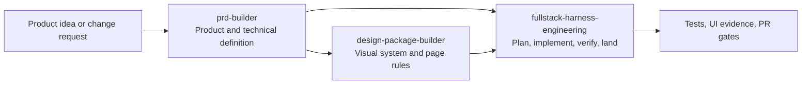

<p align="center">
  
</p>

<p align="center">
  
  
  
  
</p>

# Full Stack Harness

Private skill marketplace for turning a product idea into a verified delivery flow with Codex or Claude Code.

It is not just a collection of prompts. The plugin separates product definition, visual design, and delivery orchestration so each stage has a clear source of truth and a safe handoff to the next.

## What is included

| Skill | Use it for | Main output |
| --- | --- | --- |
| `prd-builder` | Product discovery, requirements, architecture, frontend-stack decisions, and low-fidelity wireframes | `PRD.md`, `architecture.md`, `wireframes.md` |
| `design-package-builder` | Design direction, tokens, icon and motion rules, page specs, and visual acceptance | `design-system.md`, `page-ui-matrix.md`, `ui-mockups.md`, `visual-acceptance.md` |
| `fullstack-harness-engineering` | Traceable implementation planning, safe multi-agent execution, verification, and PR landing | Direct work, `RUN.md`, or `PLAN.md` + `RUN.md` |

The delivery skill makes one size decision before it invokes managed orchestration:

- Small work stays direct with no planner, scheduler, PLAN/RUN, subagent, or external-runtime preflight by default.
- Large work enters managed planning. It may use `RUN.md` for a sequential delivery or `PLAN.md` and `RUN.md` for multiple missions and durable handoff.
- Scheduler fan-out starts only when a large plan has at least two independent ready missions. External Claude is preflighted only when a selected route needs it.

Size means coordination scope and blast radius, not a raw file or line count. If small work grows, the Harness preserves completed work and plans only the remainder.

## How the system fits together



You can start at any stage. For example, use the Harness alone to fix an existing app, or use the design skill when a PRD already exists. The skills keep their responsibilities separate: the PRD skill does not invent a design system, and the design skill does not write a delivery plan.

## Delivery model

The Harness is built around explicit boundaries:

1. Inspect the current project and identify the required work.
2. Freeze the relevant contracts, sources, scope, and verification steps.
3. Plan dependencies before starting implementation when the task is large enough to need it.
4. Use parallel workers only when the work is independent, isolated, and explicitly authorized.
5. Verify task results, integrations, UI journeys where relevant, and the final diff.
6. Land through the repository's PR flow only with separate authorization for each GitHub action.

For plan-backed work, it records task scope, dependencies, worker ownership, verification commands, and action-specific authorization. A passing test does not authorize a push, PR, review action, merge, deploy, or cleanup.

## Graph engineering and Dynamic Workflows

The skills use two graph layers:

- The **org graph** is the stable role contract: product, architecture, UX, design-system, mission-worker, reviewer, approval, integration, and lifecycle responsibilities.
- The **work graph** is the temporary task graph for one run. PRD and design workflows use bounded analysis graphs only when the host can enforce a `builder_readonly` tool profile; otherwise they fall back to the sequential parent. Engineering uses the canonical PLAN v4 graph and RUN v9 state.

Interviews and approvals stay outside running workflows because Claude Code Dynamic Workflows cannot ask for mid-run user input. The parent freezes inputs first, runs a bounded workflow, then owns staged writes, conflict resolution, approval, and publication.

For engineering, the Harness validates and selects the dependency-ready frontier before creating or requesting worktrees. Native Claude and external-Claude missions use parent-managed worktrees under `.claude/worktrees/`, bind every worker to the exact batch base, and require `EnterWorktree` before repository access. Claude-hosted cc-codex missions request one Agent-isolated worktree per write node. In every route, the parent validates the returned commit and actual Git diff, integrates accepted commits serially, and recomputes the graph frontier.

External Claude waves are separated by model, reasoning effort, and tool profile:

- `mission_write` includes `EnterWorktree` and bounded write tools.
- `code_review_readonly` omits write-capable tools.
- `visual_review_readonly` uses the exact read/search allowlist and reviews retained screenshots or other existing evidence. New browser tools must be vetted and added to the profile before use.

When Claude Code returns real Workflow run IDs, RUN state may retain the workflow/task ID, script digest, node group, graph/base binding, tool profile, status, and available metrics. Same-session resume can use that binding; cross-session recovery starts a new workflow attempt from canonical PLAN/RUN state.

Claude Code can also delegate selected graph nodes to Codex through the installed `codex:codex-rescue` Agent. The Harness preflights that exact Agent only when a ready node needs Codex, launches every request with foreground/fresh routing, and gives each write mission its own Agent worktree. The route returns marked candidates through `agent_result`; it does not expose an inner Codex thread ID or add another App Server client. Claude remains the only PLAN/RUN writer and owns validation, serial integration, PR landing, deployment, and cleanup decisions.

## Install

This is a private GitHub marketplace. You need access to `Phlegonlabs/fullstack-goal-dev`, GitHub CLI authentication, and either Codex, Claude Code, or both.

```bash
gh auth login
gh auth setup-git
git ls-remote https://github.com/Phlegonlabs/fullstack-goal-dev.git HEAD
```

### One-command updater

Clone the repository, then run the shared updater. It detects the installed runtimes, adds or updates the marketplace, and installs the plugin where supported.

Windows PowerShell:

```powershell
git clone https://github.com/Phlegonlabs/fullstack-goal-dev.git
Set-Location .\fullstack-goal-dev
pwsh -File .\scripts\update-private-skills.ps1
```

macOS or Linux shell with PowerShell 7:

```bash
git clone https://github.com/Phlegonlabs/fullstack-goal-dev.git
cd fullstack-goal-dev
pwsh -File ./scripts/update-private-skills.ps1
```

Open a new Codex task after updating. Reload or restart Claude Code after updating its plugin.

### Install directly in Codex

```bash
codex plugin marketplace add Phlegonlabs/fullstack-goal-dev --ref main
codex plugin add fullstack-harness@fullstack-goal-dev
codex plugin list
```

### Install directly in Claude Code

```bash
claude plugin marketplace add Phlegonlabs/fullstack-goal-dev --scope user
claude plugin install fullstack-harness@fullstack-goal-dev --scope user
claude plugin list
```

Run `/reload-plugins` or restart Claude Code once the plugin is installed.

### Use a local checkout during development

Use a local marketplace when testing changes in this repository. Do not register the local and GitHub marketplace under the same name at the same time.

```powershell
$repo = (Resolve-Path .).Path
codex plugin marketplace add $repo
codex plugin add fullstack-harness@fullstack-goal-dev
claude plugin marketplace add $repo --scope user
claude plugin install fullstack-harness@fullstack-goal-dev --scope user
```

## Typical prompts

Codex accepts the `$skill-name` form below. In Claude Code, invoke the installed namespaced skill, such as `/fullstack-harness:prd-builder`, or ask for it by name.

```text
Use $prd-builder to turn this idea into a PRD, architecture, and wireframes.
```

```text
Use $design-package-builder to create a design package from doc/PRD.md and doc/wireframes.md.
```

```text
Use $fullstack-harness-engineering to review the existing app, plan the required work, and stop before implementation.
```

```text
Use $fullstack-harness-engineering to implement the approved plan. Create a branch and commit the verified change, but do not push or open a PR.
```

For a multi-mission delivery, state the complete launch and landing permissions in the request. Branch creation, commits, integration, push, PR creation, review management, merge, deployment, and cleanup are independent actions.

## Codex and Claude Code execution

The Harness records the actual runtime capability instead of assuming one from an installed CLI.

| Runtime | Preferred parallel route | Fallback |
| --- | --- | --- |
| Codex app | App tasks in isolated app-managed worktrees | Direct subagents, then one sequential parent |
| Claude Code | Dynamic workflow with exact-base parent-managed `.claude/worktrees/` worktrees | Direct subagents, then one sequential parent |
| Claude Code → cc-codex | One `codex:codex-rescue` Agent per node; isolated Agent worktree for writes | Another PLAN-allowed provider, then the recorded sequential route |

Parallel implementation is capped at three write missions by default. Every worker needs an isolated workspace, a bounded write scope, a verifier, and explicit authorization. Worktrees are allocated only after ready-frontier selection. Native Claude missions enter their assigned parent-managed worktree; external Codex write missions report their Agent-managed path, branch, and head for independent verification. Workers never edit the parent `PLAN.md` or `RUN.md`, push, open PRs, merge, deploy, or remove worktrees. The parent owns integration and every landing or lifecycle action.

## Repository layout

```text
.agents/skills/                   Canonical skill sources
plugins/fullstack-harness/skills/ Generated plugin copies; do not edit directly
.agents/plugins/marketplace.json  Codex marketplace definition
.claude-plugin/marketplace.json   Claude Code marketplace definition
scripts/sync_plugin_skills.py     Copies canonical skills into the plugin bundle
scripts/update-private-skills.ps1 Updates installed marketplaces and plugin
.github/workflows/harness-ci.yml  Contract, unit, and E2E checks
```

## Maintain the marketplace

Edit only the canonical sources in `.agents/skills/`, then sync and verify the generated plugin bundle.

```bash
python scripts/sync_plugin_skills.py
python scripts/sync_plugin_skills.py --check
python -m unittest discover -s .agents/skills/fullstack-harness-engineering/scripts/tests -v
python -m unittest discover -s .agents/skills/design-package-builder/scripts/tests -v
python -m unittest discover -s .agents/skills/prd-builder/scripts/tests -v
git diff --check
```

Before a release, update the matching version in both plugin manifests and `.claude-plugin/marketplace.json`, inspect the entire diff, and use the repository PR flow. Do not push directly to `main`.

## Security and data safety

- Keep GitHub tokens and other credentials out of this repository.
- The updater uses your existing GitHub CLI session; it does not store a token in the project.
- Do not delete old standalone skill copies until the plugin is confirmed to load correctly.
- The orchestration skill requires explicit authorization for every state-changing GitHub or lifecycle action.

---

## 繁體中文

### 這是什麼

Full Stack Harness 是給 Codex 與 Claude Code 使用的私有 skill marketplace。它把一個產品想法或既有系統改動，拆成三個可交接的階段：產品定義、視覺設計、以及可驗證的交付流程。

| Skill | 用途 | 主要產出 |
| --- | --- | --- |
| `prd-builder` | 產品需求、架構、前端技術選擇、低保真 wireframe | PRD、架構與 wireframe 文件 |
| `design-package-builder` | 視覺方向、設計系統、icon 與 motion 規範、頁面規格 | Design system、頁面規格、視覺驗收條件 |
| `fullstack-harness-engineering` | 既有系統盤點、實作規劃、多 agent 協作、驗證與 PR landing | 直接處理、`RUN.md`，或 `PLAN.md` + `RUN.md` |

你可以從任何一段開始：已有 PRD 就直接做設計；已有產品就用 Harness 做盤點、規劃或實作。

### 安裝與更新

需具備 `Phlegonlabs/fullstack-goal-dev` 的存取權限，並先登入 GitHub CLI：

```bash
gh auth login
gh auth setup-git
```

從 repository clone 後，在 Windows 或已安裝 PowerShell 7 的 macOS/Linux 執行：

```powershell
pwsh -File .\scripts\update-private-skills.ps1
```

Updater 會偵測 Codex 與 Claude Code，更新 marketplace 並安裝 plugin。Codex 更新後請開新的 task；Claude Code 則執行 `/reload-plugins` 或重新啟動。

### 使用方式

Codex 可使用下面的 `$skill-name`。Claude Code 請使用已安裝的 namespaced skill，例如 `/fullstack-harness:prd-builder`，或直接用名稱要求執行。

```text
Use $prd-builder to turn this idea into a PRD, architecture, and wireframes.
```

```text
Use $design-package-builder to create a design package from the current PRD and wireframes.
```

```text
Use $fullstack-harness-engineering to review the existing app, plan the work, and stop before implementation.
```

### 交付原則

Harness 會先把工作分成小項目或大項目。小項目直接處理，預設不啟動 planner、scheduler、PLAN/RUN、subagent 或外部 runtime preflight。大項目才進入 managed planning；只有存在兩個以上可獨立執行的 ready missions 時才啟動 scheduler。外部 runtime 也只會在選定的 ready route 確實需要時 preflight：Codex parent 可檢查外部 Claude，Claude Code parent 也可檢查 `codex:codex-rescue`。

大小看的是協調範圍與影響面，不是單純計算檔案數或程式碼行數。小項目途中變大時，Harness 會保留已完成的工作，只規劃剩餘範圍。

Graph engineering 分成兩層：org graph 定義長期穩定的產品、架構、UX、設計、worker、review、approval 與 integration 職責；work graph 則是單次工作的暫時節點、依賴、route、attempt 與 evidence。PRD 與 design workflow 只有在 host 能強制 `builder_readonly` tool profile 時才執行；否則回到 sequential parent。工程 work graph 仍以 PLAN v4 與 RUN v9 為唯一控制面。

多 agent 寫入預設最多三個 mission。Harness 先驗證並選出 ready frontier，之後才配置 worktree。原生 Claude 與外部 Claude route 會在 `.claude/worktrees/` 建立 exact-base worktree，Claude worker 必須先用 `EnterWorktree` 進入指定路徑。外部 Claude wave 會按 model、reasoning effort 與 `mission_write`、`code_review_readonly`、`visual_review_readonly` tool profile 分開，避免 review worker 取得寫入工具。

Claude Code parent 也可透過 `codex:codex-rescue` 把選定節點交給 Codex。每個寫入 mission 會使用獨立的 Agent worktree，request 固定採 foreground 與 fresh route，並回傳 path、branch、head 與標記過的 result candidate。這條 route 不建立 user-owned Codex app task，也不提供內部 Codex thread ID；Claude 仍是唯一的 PLAN/RUN writer，並負責 Git 驗證、依序整合、PR landing 與部署。

每個 mission 都必須有獨立 worktree、限定寫入範圍、驗證指令與明確授權。Worker 絕不修改 parent 的 `PLAN.md` 或 `RUN.md`，也不執行 push、開 PR、merge、deploy 或清理；整合與所有 landing、lifecycle 動作只由 parent 負責。建立 branch、commit、整合、push、開 PR、管理 review、merge、deploy 與清理，都是分開的授權動作；測試通過不等於可以自動執行這些動作。

### 維護 repository

只修改 `.agents/skills/` 下的 canonical skills。`plugins/fullstack-harness/skills/` 是產生檔，使用以下命令同步與驗證：

```bash
python scripts/sync_plugin_skills.py
python scripts/sync_plugin_skills.py --check
python -m unittest discover -s .agents/skills/fullstack-harness-engineering/scripts/tests -v
git diff --check
```

版本發布前需同步更新兩份 plugin manifest 與 `.claude-plugin/marketplace.json` 的版本，跑完 CI 對應測試，並依 PR 流程合併。不要直接 push 到 `main`。
