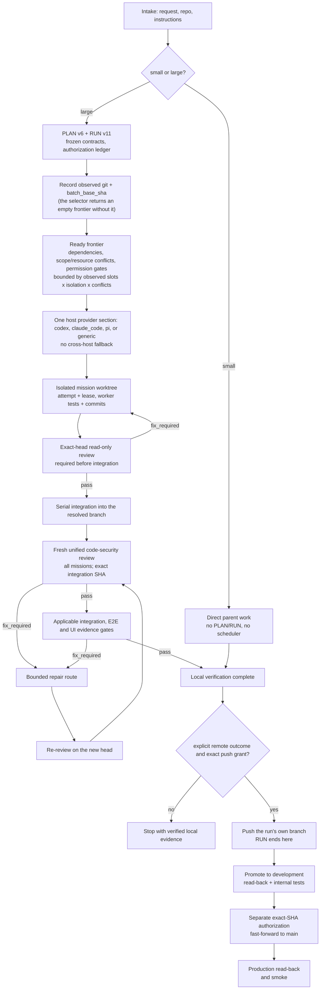

<p align="center">
  
</p>

<p align="center">
  <strong>English</strong> | <a href="README.zh-TW.md">繁體中文</a> | <a href="README.zh-CN.md">简体中文</a> | <a href="README.es.md">Español</a>
</p>

<p align="center">
  <a href="https://github.com/Phlegonlabs/product-delivery-harness/actions/workflows/harness-ci.yml"></a>
  
  
  
</p>

# Product Delivery Harness

Skills repository for turning a product idea or change request into a verified delivery flow with Codex, Claude Code, Pi, or any host that discovers a user skills directory.

It is not a prompt collection. The skill suite separates product definition, visual design, engineering execution, and code-security review so each stage has one source of truth, a bounded handoff, and its own verification.

> Define the product. Compile the design. Deliver verified software.

## Start here

| If you have... | Start with | What you get |
| --- | --- | --- |
| A product idea | `product-definition-builder` | Requirements, a responsive `wireframes/2` review file for every UI surface and state, browser layout QA, architecture, stack decisions, release targets, tests, and sourced market research |
| An approved wireframe package that needs visual design | `product-definition-builder` UI Design Pass, then `design-system-compiler` + `frontend-design` when the gate requires it | One connected, self-contained high-fidelity HTML reference with every page in a left sidebar, complete CSS, clickable flows, and a mock login that enters the authenticated UI, plus a binding design-system pair when required |
| A scoped change in an existing repository | `delivery-harness` | Direct implementation for small work, or a managed PLAN/RUN flow for large work |
| A fixed integrated code candidate | `code-security-review` | A read-only, exact-SHA security review with validated source-to-sink findings and explicit coverage gaps |
| A delivered release that needs external setup | `product-activation` | Exact authorized console actions, verified measurement sources, and target-by-target activation readiness |

Each bundled skill can be invoked on its own; the full pipeline is optional. Each mode still enforces its declared inputs and dependencies.

## Core guarantees

- **Small work stays small.** One bounded change uses a direct inspect, implement, verify, and review loop.
- **Large work is explicit.** PLAN v6 defines the typed graph; RUN v11 records authorization, attempts, and evidence.
- **Product definition stops at a human gate.** A UI-bearing package ends in one responsive low-fidelity `wireframes.html`; every surface, target, state, and visible PRD action must work locally and pass browser layout review before owner approval. Its checker validates page, overlay, and feedback flows plus deferred `mediaIntent` handoffs. When the host has multi-agent browser capability and dispatch is authorized, three fresh read-only graders score every dimension from 0 to 100 against the frozen PRD; when capability is unavailable, the approval record carries the exact skip and the browser, checker, and human gates still run.
- **Visual targets are interactive responsive HTML.** A requested visual phase produces one connected high-fidelity HTML reference whose visible controls navigate, switch state, open recorded overlays, or show feedback. Login, registration, recovery, and authentication-error preview scenes are recorded `n/a` for this pass. Image and motion positions stay as static placeholders with dedicated prompts and `generationStatus: deferred`; no generation provider runs until a later explicitly authorized MCP pass. A Technical Hard Gate rejects runtime errors, unexpected requests, unreachable states, and duplicate event effects. Conditional PRD-bound multi-agent grading requires an overall score of at least 80 plus `H2` layout, `H4` responsive, and `H8` accessibility scores of at least 80, with element-level layout checks at every target; it also scores creative distinction and design consistency without rewarding scope invention or usability loss. A below-threshold candidate returns to refinement and repeats the complete gate and grading sequence before human approval. Approved references stay under `docs/design/ui-references/`, and superseded sets are archived instead of deleted.
- **Workers are isolated.** Write missions use dedicated worktrees and bounded scopes. The parent validates every returned commit and diff.
- **Every graph attempt is durable.** Non-mission nodes reserve an attempt, run their check or external action outside the RUN lock, then record outcome and evidence; an interrupted non-runtime attempt is recorded as `blocked` through the same result path. A local verifier may ignore the tracked RUN only for dirty-status purposes: the path must resolve inside the checkout, and its exact bytes and file identity stay protected across execution and result recording.
- **Runtime bindings are explicit.** `lease-worker` derives the provider, driver, model, effort, and portable runtime axes from the selected directive, accepts `--task-thread-id` only for app tasks, accepts an existing exact target, and materializes a new exact target only from an active wildcard grant without widening authority.
- **Capability is not permission.** A runtime may be able to push or clean up, but each action still needs exact authorization.
- **Activation is read back.** External setup stays outside PLAN/RUN, binds approval to an exact action digest, and becomes verified only after independent read-back and behavior evidence.
- **Evidence follows the SHA.** A new commit invalidates earlier gate and UI evidence for the old head.
- **Code security is a fresh final review.** Every new managed PLAN explicitly requires it or records why a non-code delivery is not applicable. Required review runs `code-security-review` over every mission at the unified integration SHA before broad final validation; its declared scope must contain every mission write scope. It validates the structured agent result and cannot reuse earlier tree-identical evidence. A security PASS has no exclusions and needs at least one tool or manual review recorded as `passed` or `findings`. The required node cannot be skipped or superseded; reserve and completion recheck live Git. An exact interruption receipt can remain as history only after a later current reviewer supplies the structured PASS.
- **Promotion is development-first.** The RUN defaults to local completion and may push only its own branch. After RUN close, initial delivery and enhancements promote the exact candidate to `development`, run the internal suite on that remote head, then separately fast-forward the same SHA to `main`.

## What is included

| Skill | Use it for | Main output |
| --- | --- | --- |
| `product-definition-builder` | Product discovery, the pre-draft research-first assessment and its Research Gate, requirements, Builder UX Direction inputs, interactive responsive low-fidelity wireframes with browser QA and conditional PRD-bound multi-agent grading, architecture, stack decisions, release targets, test obligations, the reconciling post-draft market-research gap pass, the optional interactive high-fidelity HTML Design Pass with deferred media and motion generation, and the post-deploy outcome review | `PRD.md`, `research-assessment.md`, `wireframes.html` (UI-bearing products), `architecture.md`, `stack-decisions.md`, `market-research.md`, `outcome-review.md` |
| `design-system-compiler` | Compiling an approved UI Design Handoff into the frozen design-system pair, including the exact approved responsive set and layout-safety rules. It must load the separate `frontend-design` skill and stops if that dependency is unavailable. | `design-system.md`, `design-system.json` |
| `delivery-harness` | Shared size gate, PLAN/RUN, authorization, local verification, and integration, plus the runtime adapter reference (`references/runtime-adapters.md`) holding one shared contract and one provider section per host (Codex, Claude Code, Pi, or generic) | Direct work or `PLAN.md` + `RUN.md` |
| `code-security-review` | Read-only security review after implementation and unified integration, preferably in a fresh sibling agent; active penetration testing and remediation stay outside this skill | Exact-SHA decision, trust-boundary coverage, validated findings, and remediation tests |
| `product-activation` | Post-delivery setup for web, iOS, and browser-extension targets, including capability routing, exact external-action authorization, read-back, measurement sources, and outcome-review handoff | `docs/ACTIVATION.md` |

The delivery core makes one size decision before it invokes managed orchestration:

- Small work stays direct with no planner, scheduler, PLAN/RUN, subagent, or external-runtime preflight by default.
- Large work enters managed planning. It may use `PLAN.md` and `RUN.md` for a managed-sequential delivery or for multiple missions and durable handoff; the target project's `docs/tasks.md` is an on-demand human view, not required state. This source repository does not keep a separate root `Tasks.md` flow log.
- The selector derives `managed_sequential` for fewer than two actually selected safe write missions and `parallel_graph` for two or more. Scheduler fan-out starts only for the latter; the runtime driver remains a separate transport fact. The core then applies exactly one host provider section from the runtime adapter reference; external runtimes are preflighted only when a selected route needs them.
- RUN execution never waits for remote CI. Branch promotion is a separate closeout stage: `development` read-back and internal verification must finish before `main` can move.

Size means coordination scope and blast radius, not a raw file or line count. If small work grows, the Harness preserves completed work and plans only the remainder.

## How the system fits together

```mermaid
flowchart LR
  Idea["Product idea or change request"] --> PRD["product-definition-builder\nProduct and technical definition"]
  PRD --> Wireframe["wireframes/2 HTML\nresponsive low-fidelity matrix"]
  Wireframe --> Gate{"Wireframe Approval Gate\nhuman owner"}
  Gate -->|"approved, visual design requested"| Design["UI Design Pass\ndesign-system-compiler when required"]
  Gate -->|"approved, no visual phase"| Harness["delivery-harness\nShared delivery core"]
  Design -->|"approved all-pages HTML reference or design-system pair"| Harness
  Harness --> Runtime["One host provider section\nCodex, Claude Code, Pi, or generic"]
  Runtime --> Security["code-security-review\nfresh unified exact-SHA review"]
  Security --> Evidence["Broad final tests and UI evidence"]
  Evidence --> Push["Optional exact run-branch push\nRUN closes"]
  Push --> Dev["Promote exact SHA to development\nread-back + internal tests"]
  Dev --> Main["Separately authorize fast-forward\nsame SHA to main"]
  Main --> Activate["product-activation\nExternal setup + read-back"]
  Activate --> Outcome["Verified measurement sources\nLater outcome review"]
```



You can start at any stage. For example, use the Harness alone to fix an existing app. The skills keep their responsibilities separate: `product-definition-builder` defines the product and stops at the approved `wireframes.html`; the optional UI Design Pass and `design-system-compiler` define the visual contract — the pass leaves one approved self-contained high-fidelity HTML reference in `docs/design/ui-references/<run-id>/`, with every page in a left sidebar, complete CSS, clickable flows, and reviewer-only mock authentication; the Harness implements the frozen result; `code-security-review` reviews the unified candidate without editing it; and `product-activation` configures and verifies the delivered release without reopening the delivery RUN.

### Full skill lifecycle

The complete lifecycle across all five skills, with every gate and the cross-cutting mechanisms:

```mermaid
flowchart TB
    user([User idea or change request])

    subgraph PRD["product-definition-builder — product definition"]
        direction TB
        interview[Structured interview<br/>3 free-text segments + AskUserQuestion]
        pkg["Core package draft<br/>PRD.md + architecture.md<br/>+ stack-decisions.md"]
        wf["wireframes.html<br/>one interactive low-fidelity file (UI products)"]
        wgate{{"Wireframe Approval Gate<br/>(human approval = a complete stop point)"}}
        ra["research-first assessment<br/>research-assessment.md (skippable)"]
        rgate{{"Research Gate<br/>go | clarify | stop"}}
        interview --> ra --> rgate --> pkg --> wf --> wgate
        mr["market-research.md<br/>(gap pass, skippable)"]
        ra -.-> mr
        pkg -.-> mr
    end

    subgraph DESIGN["Visual design (optional; only on explicit owner request)"]
        direction TB
        taste["UI Design Pass<br/>taste skill via the Skill Bindings slot"]
        handoff[UI Design Handoff]
        dgate{{"Design System Need Gate"}}
        pair["design-system-compiler<br/>design-system.md + design-system.json"]
        taste --> handoff --> dgate
        dgate -->|required| pair
        dgate -->|not_required| target[Approved page-faithful target]
    end

    subgraph HARNESS["delivery-harness — delivery core"]
        direction TB
        route["System Review And Route<br/>(parent-only, read-only)"]
        size{{"Project Size Gate"}}

        subgraph DIRECT["Direct route (small)"]
            direct_impl["Implement directly -> local verify<br/>-> code-security review -> authorized Git actions"]
        end

        subgraph MANAGED["Managed route (large)"]
            direction TB
            plan["PLAN v6<br/>typed graph: missions / reviews / gates<br/>allowed_providers + atomic task commits"]
            newrun["new_run.py generates<br/>RUN v11 + the 12-key authorization ledger"]

            subgraph LOOP["Execution loop (per wave)"]
                direction TB
                lock["--session-id acquire-run-lock<br/>(run lock + heartbeat)"]
                obs["record-observation<br/>live-Git snapshot"]
                sel["select_ready_nodes.py<br/>deterministic frontier selection"]
                accept["accept-wave<br/>(batch base binding)"]
                adapters["resolve the available agent driver<br/>under the shared contract"]
                lease["lease-worker<br/>(worktree + lease + graph binding)"]
                workers["fresh bounded agent workers"]
                record["record-worker-result<br/>revalidate evidence + atomic RUN update"]
                review["exact-head review<br/>(reserve -> reviewer -> record)"]
                integ["record-integration<br/>(serial; unified candidate SHA)"]
                lock --> obs --> sel --> accept --> adapters --> lease --> workers --> record --> review --> integ
            end

            plan --> newrun --> LOOP
            security["code-security-review<br/>fresh sibling; all missions; exact SHA"]
            gates2["Broad final validation<br/>(E2E / regression / UI evidence matrix)"]
            LOOP --> security --> gates2
        end

        route --> size
        size -->|small| DIRECT
        size -->|large| MANAGED
    end

    subgraph DEPLOY["Deployment (git-connected platform)"]
        direction TB
        handoff["Refresh docs/DEPLOYMENT.md<br/>(secret names + external-console tasks)"]
        push["Authorized push<br/>of the run branch"]
        preview["Preview builds automatically<br/>(platform builds per push)"]
        merge([User merges to main])
        prod["Production deployment<br/>(platform builds from main)"]
        check["Post-deploy verification (read-only)<br/>check_deployment.py"]
        status["Reconcile deployment record<br/>(status + pending human actions)"]
        handoff --> push --> preview --> merge --> prod --> check --> status
    end

    subgraph ACTIVATE["product-activation — post-delivery activation"]
        direction TB
        profiles["Select core + surface profiles<br/>docs/ACTIVATION.md"]
        capability["Probe connector / API / CLI<br/>Browser / Computer Use / manual"]
        actions["Exact ACT-* actions<br/>authorization + read-back"]
        ready["Per-target activation readiness<br/>verified MS-* sources"]
        profiles --> capability --> actions --> ready
    end

    subgraph OUTCOME["Post-release outcome review"]
        outcome["outcome-review.md<br/>(owner-requested, post measurement window)"]
        verdict{{"Verdict: no_change | enhancement | incident"}}
        outcome --> verdict
    end

    subgraph CROSS["Cross-cutting mechanisms (all stages)"]
        bindings["Skill Bindings<br/>(AGENTS.md slot table + SHA-256 pins)"]
        ledger["Authorization ledger<br/>12 independent action keys"]
        ver["Version gate + contract digest<br/>(compatible_old wave boundary)"]
        watch["watchdog + reconcile<br/>(interruption recovery)"]
    end

    user --> interview
    wgate -->|continue into visual design| DESIGN
    wgate -->|stop here| HARNESS
    pair --> route
    target --> route
    mr --> route
    DIRECT --> handoff
    gates2 --> handoff
    status --> profiles
    ready --> outcome
    verdict -.->|next enhancement request| interview
```



Wireframe Approval and the merge to `main` remain human gates. The delivery execution loop stays inside PLAN/RUN; post-delivery Activation starts only after RUN close and applies its own exact external-action approvals.

For every deployable release, `docs/DEPLOYMENT.md` is the operator handoff. Product Definition seeds it; Delivery Harness reconciles it against tracked environment declarations, CI, and auth/integration code before the push, then records the read-only deployment result afterward. It lists exact secret and variable names, their preview and production placement, and external-console tasks such as auth callback URLs, but never stores secret values.

After delivery, `product-activation` creates or reconciles `docs/ACTIVATION.md`, selects the applicable web, iOS, or browser-extension profiles, uses the safest available connector/API/CLI/Browser/Computer Use route, and performs only exact authorized actions. Capabilities and evidence bind to the exact target, environment, source SHA, and artifact/build identity; the newest matching result controls readiness. It records configuration separately from verification, never stores secret values, keeps unsupported hybrid targets outside its gate, and hands matching verified `MS-*` sources to the later outcome review.

The loop closes at both ends. Before any closed-set decision, the research-first assessment gates drafting with a human `go | clarify | stop` Research Gate — published as `research-assessment.md` with stable `RA-*` findings and reconciled by the post-draft market-research pass. After Activation and the real measurement window, the owner can request `outcome-review.md`: measured actuals against the PRD's metrics and `TEST-*` expected signals, using only matching verified sources, with a `no_change | enhancement | incident` verdict that feeds the next enhancement run.

Small post-delivery changes keep the same product contract without forcing a new PLAN/RUN. When `docs/product/PRD.md` exists, the seeded `AGENTS.md` requires every direct change to update the affected PRD requirements and trace IDs in the same change. It classifies UI impact as `none`, `structure`, `style`, or `both`; adding a page or route is at least `structure`, so the affected UI Surface Contract and `wireframes.html` pages are updated and re-approved. Style changes revisit the approved UI direction, and only an approved formal design-system delta changes the design-system pair. Unaffected IDs, pages, and decisions stay unchanged.

Gitignore hygiene also applies to both direct and managed work. The scope scan records whether a task changes a local-only artifact class, then derives the narrowest rules from the observed toolchain. Value-bearing environment and credential files, reproducible build output, dependency directories, caches, logs, and local platform state are ignored; source, tests, lockfiles, migrations, tracked configuration examples and schemas, and canonical product or delivery artifacts stay visible. A new environment-variable read updates the tracked example and ignore rule in the same task. Harness verifies representative paths with `git check-ignore`, `git status --ignored`, and `git ls-files`; it never reads a secret value or hides a dirty worktree, and a likely secret already tracked by Git stops the run for owner action.

Commercial products now pass two separate Product Definition decisions. The Monetization Infrastructure Gate resolves the model, pricing/offer rules, purchase surfaces, entitlement source, and merchant-of-record/tax ownership before comparing current options such as native store billing, RevenueCat, Qonversion, Adapty, Superwall, Stripe Billing, Paddle, or Lemon Squeezy; pricing never makes RevenueCat the default. The Partner Channel Gate independently resolves `none`, affiliate, referral, reseller, or hybrid. It compares link/commission tools such as Rewardful or FirstPromoter, broader partner platforms such as PartnerStack, an integrated Lemon Squeezy affiliate route, or a custom reseller service. Billing, entitlement, paywall, tax, attribution, commission/payout, and reseller operations remain separate PRD, architecture, stack, UI, mission, and test contracts.

## Delivery model

The Harness is built around explicit boundaries:

1. Inspect the current project and identify the required work.
2. Freeze the relevant contracts, sources, scope, and verification steps.
3. Plan dependencies before starting implementation when the task is large enough to need it.
4. Use parallel workers only when at least two safe write missions are actually selected, the work is independent and isolated, and every action is explicitly authorized; managed-sequential still proves its isolated writer, scope/head, and review gates.
5. Verify task results and integrations, run a fresh unified code-security review, then verify UI journeys where relevant and the final diff. A single mission has no invented cross-mission batch gate.
6. Stop the RUN with verified local evidence by default. Any run-branch push needs exact intent. After RUN close, separately authorize promotion to `development`, test that exact remote head internally, then separately authorize a fast-forward of the unchanged SHA to `main`; read back and verify each environment.

For plan-backed work, it records task scope, dependencies, worker ownership, verification commands, and action-specific authorization. A passing test does not authorize a push, worktree removal, or branch deletion. RUN-v11 push additionally requires explicit remote intent, one exact integration-branch target, and current-head authorization; an unknown default-branch identity fails the push closed without blocking unrelated local execution.

Before a wave is accepted, the Harness rechecks the observed clean product tree on the non-default integration branch, binds the batch to that exact head, reruns the selector, and accepts only its complete current frontier. The clean-tree gate excludes only the exact tracked RUN file that transitions necessarily update; every other change still blocks. A linked integration checkout is recorded as the parent while Git's clean primary checkout remains a recognized sibling. The durable run lock owns dispatch; a short operating-system lock serializes each RUN read/validate/write transaction. Frozen PRD, wireframe, and design-system sources are byte-hash-bound in both standalone validation and the transition write path. Every frozen PRD is parsed even when PLAN claims zero UI surfaces. Every structured PRD surface owns one literal route; a UI-bearing localized PRD keeps exactly one language-neutral boundary pair and one `route` and `states` anchor per entry; IDs, routes, and states agree exactly across artifacts. The design-system pair keeps separate Markdown and JSON source rows, its generated contract and compiler namespaces must agree, and every PLAN `DS-*` trace resolves through the same globally unique JSON registry. product-definition-builder batches every applicable closed decision to the question tool's actual per-call capacity; it has no Codex-specific call target and drops no decision to fit a host count.




## Lightweight runtime adapters

The shared core owns the one PLAN/RUN control plane. Host-specific launch details live in one reference — `delivery-harness/references/runtime-adapters.md` — with a shared adapter contract and one provider section per host, applied lazily:

- A host applies only its own provider section and executes only PLAN nodes whose `allowed_providers` includes that host.
- A Pi host leaves role/model/fallback selection to Pi's installed configuration.
- No provider section can invoke another runtime. A ready node whose provider does not match the current host is deferred with `runtime_unavailable` and left for a run hosted by a matching host.
- Adding a new runtime host adds one provider section to that reference, not a new skill.

Shared scripts, schemas, references, and templates remain under `delivery-harness`; the provider sections link to them rather than shipping duplicate runtimes. This keeps the default prompt small.

One run has one active host. A same-repository handoff is allowed only after Host A closes its wave and `RUN.active_wave.status` is neither `active` nor `proposed`; the `active_wave` object remains in RUN, so its absence is not a handoff signal. Host B preserves PLAN/RUN and graph state, re-probes its runtime, and reviews the current exact SHA before selecting the next wave. A repair routes back to Host A and invalidates the old review; cross-machine handoff is unsupported until a future schema adds portable repository/state identity.

## Graph engineering and Dynamic Workflows

The skills use two graph layers:

- The **org graph** is the stable role contract: product, architecture, UX, design-system, mission-worker, surface reviewer, security reviewer, approval, integration, and lifecycle responsibilities.
- The **work graph** is the temporary task graph for one run. PRD and design workflows use bounded analysis graphs only when the host can enforce a `builder_readonly` tool profile; otherwise they fall back to the sequential parent. Engineering uses the canonical PLAN v6 graph and RUN v11 state.

Interviews and approvals stay outside running workflows because Claude Code Dynamic Workflows cannot ask for mid-run user input. The parent freezes inputs first, runs a bounded workflow, then owns staged writes, conflict resolution, approval, and publication.

For engineering, the Harness validates and selects the dependency-ready frontier before creating or requesting worktrees. Native Claude missions use parent-managed worktrees under `.claude/worktrees/`, bind every worker to the exact batch base, and require `EnterWorktree` before repository access. In every route, the parent validates the returned commit and actual Git diff, integrates accepted commits serially, and recomputes the graph frontier.

Non-runtime graph nodes use a reserve/execute/record sequence: `reserve-node-attempt` creates the RUN-locked receipt, the approval, external wait, deterministic verifier, or lifecycle side effect runs outside that lock, and `record-node-result` closes only the matching attempt with evidence and a phase derived from its declared outcome. Lifecycle transitions record evidence only; they never execute the action. `lease-worker` carries the selector-derived runtime binding and exact task/thread identity into RUN, subject to compatibility checks and existing wildcard authorization.

Claude Graph Workflow batches a mixed frontier into one call per homogeneous `tool_profile`; model and reasoning effort may vary inside a group, but a call never mixes write missions with read-only reviews. A tool profile is a label and prompt/result contract, not permission-level tool removal.

- `mission_write` requires `EnterWorktree` and the mission's bounded write contract.
- `code_review_readonly` requires exact-path review and read-only result evidence for frontend, backend, integration, or security review; it does not remove inherited tools.
- `visual_review_readonly` reviews retained screenshots or other existing evidence with the inherited host tools; new browser access must be vetted and added to the profile contract before use.

When Claude Code returns real Workflow run IDs, RUN state may retain the workflow/task ID, script digest, node group, graph/base binding, tool profile, status, and available metrics. Same-session resume can use that binding; cross-session recovery starts a new workflow attempt from canonical PLAN/RUN state.

A graph node's `allowed_providers` must include the host that is actually running the Harness before that node can be selected. Codex, Claude Code, and Pi cannot delegate a node to one another; there is no cross-host bridge. A ready node whose provider does not match the current host is deferred with `runtime_unavailable` and left for a run hosted by the matching adapter.

## Install

The repository is public, so no access permission is needed. You need at least one host that discovers a user skills directory such as `~/.agents/skills/` — Codex, Claude Code, Pi, or any other.

```bash
git ls-remote https://github.com/Phlegonlabs/product-delivery-harness.git HEAD
```

### Fastest setup

Clone the repository and copy the five Product Delivery Harness skills into your user skills directory:

```bash
git clone https://github.com/Phlegonlabs/product-delivery-harness.git
cp -r product-delivery-harness/.agents/skills/delivery-harness \
      product-delivery-harness/.agents/skills/product-definition-builder \
      product-delivery-harness/.agents/skills/design-system-compiler \
      product-delivery-harness/.agents/skills/code-security-review \
      product-delivery-harness/.agents/skills/product-activation \
      ~/.agents/skills/
```

If the checkout has local `__pycache__` directories under `.agents/skills/`, exclude or delete them from the copy — hosts never need the bytecode. On Windows, `Copy-Item -Recurse` does the same. There is no separate updater script. An update needs explicit install/update approval and no active skill-using session. Before copying, move any existing new-name destinations to one timestamped backup under `~/.agents/skill-backups/product-delivery-harness/`, outside the skills discovery directory. Copy the five current directories, verify their files match the checkout, then start a fresh host session. Restore the backup if verification fails; never overwrite or delete the previous copies.

When upgrading from 0.23 or earlier, archive the legacy directories under their original IDs through that same backup. Then install their replacements — `full-harness` → `delivery-harness`, `prd-builder` → `product-definition-builder`, and `product-design-builder` → `design-system-compiler` — plus the new `product-activation` skill. After copying, verify the three legacy IDs are absent from `~/.agents/skills/`; otherwise the host will discover duplicate skills with overlapping triggers.

The five bundled skills are independently invocable, but cross-skill modes enforce their dependencies. Frozen wireframe validation uses `product-definition-builder`'s checker next to `delivery-harness`; `design-system-compiler` requires an approved PRD UI Design Handoff, approved `wireframes.html`, and `frontend-design`; the optional UI Design Pass uses a design-direction skill plus a frontend-implementation skill; new managed code deliveries use `code-security-review` in the `code_security_verification` slot after integration; and `product-activation` consumes the release and deployment handoff after delivery. Install the dependencies required by the mode you run.

### Zero-to-one flow

1. Install one supported host (Codex, Claude Code, Pi, or any host that discovers `~/.agents/skills/`) and the five Product Delivery Harness skills, then use that host for the run.
2. Start a fresh host session, confirm the skill is visible, and invoke `delivery-harness`.
3. Let the size gate choose direct work or PLAN/RUN; do not pre-create workers for small work.
4. For a large run, keep one host active at a time and close/review each wave before a same-repository handoff.

## Typical prompts

Codex accepts the `$skill-name` form below. In Claude Code or any other host, ask for the skill by name, such as `product-definition-builder`. In Pi, use its discovered project skill or pass the skill directory with `--skill`, then ask for `delivery-harness` by name.

```text
Use $product-definition-builder to turn this idea into a PRD, responsive low-fidelity wireframes for every page, target, and state, browser layout QA, architecture, stack decisions, release targets, and test obligations.
```

```text
Use $product-definition-builder to review every page-target-state in the staged wireframes.html, confirm no unintended overlap or overflow in a real browser, and record the Wireframe Approval decision before visual or implementation work.
```

```text
The wireframes are approved; continue into visual design with $product-definition-builder's UI Design Pass. Render every page and approved state in one self-contained high-fidelity HTML with complete CSS, a left sidebar listing all pages, clickable flows, and mock login that jumps directly to the authenticated UI. Browser-check the full responsive/state matrix and retain the approved file under docs/design/ui-references/, invoking $design-system-compiler only when the Design System Need Gate is required.
```

```text
Use $delivery-harness to implement the approved plan, building each page from its approved HTML reference in docs/design/ui-references/ within the recorded tolerance.
```

```text
Use $delivery-harness to review the existing app, plan the required work, and stop before implementation.
```

```text
Use $delivery-harness to implement the approved plan. Create a branch and commit the verified change, but do not push or open a PR.
```

```text
Use $delivery-harness to implement this plan and push the verified branch. I will open the PR and handle the merge myself.
```

```text
The delivery is complete. Use $product-activation for the production release targets, configure only the exact external actions I approve, verify each result by read-back, and stop after recording activation readiness and the measurement-window handoff.
```

```text
Use delivery-harness on this Pi host to execute this plan. Preserve Pi's installed frontend_designer, worker, reviewer, model, and fallback settings.
```

For a multi-mission delivery, state the intended local and remote outcome. Branch creation, commits, integration, each push, deployment, worktree removal, and deletion remain separate actions. Post-RUN promotion may update `development` and `main` only with exact action-time authorization, fast-forward proof, read-back, and internal testing.

## Codex, Claude Code, and Pi execution

The Harness records the actual runtime capability instead of assuming one from an installed CLI.

| Runtime | Preferred parallel route | Fallback |
| --- | --- | --- |
| Codex app | App tasks in isolated app-managed worktrees | Direct subagents, then one sequential parent |
| Claude Code | Dynamic workflow with exact-base parent-managed `.claude/worktrees/` worktrees | Direct subagents, then one sequential parent |
| Pi | Installed Pi roles in parent-managed worktrees, with Pi selecting configured models and fallbacks | One sequential parent |
| Any other host | Fresh subagents with parent-owned isolation | One sequential parent |

On Codex, each selected mission opens a separate top-level conversation in the left sidebar with its own app-managed worktree. The Harness parent separately dispatches any read-only explorer or reviewer as a sibling; a mission task never creates child agents. Coordinator-owned direct subagents do not replace requested top-level tasks. The adapter searches the current Codex tool surface for lazy-loaded project and thread tools before it uses a fallback. When the user explicitly requests this topology, missing thread capability is a blocker rather than permission to collapse the work back into one conversation.

Target-repository instructions take precedence. Otherwise, initial delivery starts its run branch from `main`; enhancements start from `development`. Mission worktrees integrate only into that run branch and pass exact-head review. After RUN close, the candidate is promoted to `development`, tested on that exact remote head, then fast-forwarded unchanged to `main` under a second authorization. Fixes restart development verification on the new SHA.

Each provider section runs only PLAN nodes whose allowed providers include its own host; there is no cross-host route. A node that requires another host's provider is deferred with `runtime_unavailable` instead of being executed here.

Parallel implementation has no small fixed cap by default; the configured write-worker maximum is set generously high, and the effective wave is bounded by observed worker slots, isolation capacity, and the dependency-ready conflict-free frontier size instead. One independently testable goal maps to one mission. Every writer gets explicit file ownership and a separate clean exact-base worktree. Shared APIs, schemas, and types freeze before dependent writers fan out. Explorers, writers, and reviewers are parent-dispatched siblings; workers and reviewers never delegate. After exact-head mission review, the parent integrates passing heads serially, starts fresh reviewers on the unified integration head, runs the required `code-security-review` from a sibling agent, and then runs one broad final validation on the fixed candidate SHA. Workers never edit the parent `PLAN.md` or `RUN.md`, push, open PRs, merge, deploy, or remove worktrees. The parent owns integration and every landing or lifecycle action.

## Repository layout

```text
.agents/skills/                                      Canonical skill sources
assets/                                              README covers
.github/workflows/harness-ci.yml                     Contract, unit, and E2E checks
```

## Maintain the skills

Edit only the canonical sources in `.agents/skills/`, then run the core verification suite:

```bash
python -m pip install -r .agents/skills/delivery-harness/requirements-test.txt
python .agents/skills/delivery-harness/scripts/check_skill_spec.py
python -m pyflakes .agents/skills/delivery-harness/scripts .agents/skills/product-definition-builder/scripts .agents/skills/design-system-compiler/scripts .agents/skills/product-activation/scripts
python -m unittest discover -s .agents/skills/delivery-harness/scripts/tests -v
python -m unittest discover -s .agents/skills/product-definition-builder/scripts/tests -v
python -m unittest discover -s .agents/skills/design-system-compiler/scripts/tests -v
python -m unittest discover -s .agents/skills/product-activation/scripts/tests -v
git diff --check
```

CI also runs the end-to-end spine check. Run it locally with `HARNESS_GOLDEN_PATH=1 python -m unittest discover -s .agents/skills/delivery-harness/scripts/tests -p "test_golden_path.py" -v`; it walks the real CLI spine (`new_run.py` → frozen joins including the sibling skill's full wireframe checker → `validate_result.py --repo-root`) over one synthetic product package, so cross-skill contract drift surfaces as one red test.

## Keeping the READMEs current

The READMEs are documentation-of-record: every change that adds or alters a skill, rule, table, diagram, or documented flow updates the README's descriptive sections in the same change, in all four languages. The version badge and version-history entries are the release-time part and follow Releasing below.

## Releasing

Every flow that lands on `main` is one release, and the version bump rides in the same change — patch by default, minor for a breaking skill-bundle change. Update all of these together:

1. The `version` field in `package.json` and the copied-skill version in `.agents/skills/delivery-harness/VERSION`.
2. The version badge and the version-history entry in all four READMEs (`README.md`, `README.zh-TW.md`, `README.zh-CN.md`, `README.es.md`).
3. The RUNBOOK `required_harness_version` default in `.agents/skills/delivery-harness/assets/templates/MISSION_RUNBOOK.template.md`.
4. The pinned version asserts in `.agents/skills/delivery-harness/scripts/tests/test_skill_contract.py`.

Then run the full verification above, review the entire diff, and land through the repository's PR flow — never a direct push to `main`. After landing, tag the release commit on `main` with the matching `v<version>` tag (for example `v0.22.1`); the tag is part of the release, not an optional extra. Every released version has its tag — `git tag` and `package.json` must tell the same story.

## Security and data safety

- Keep GitHub tokens and other credentials out of this repository.
- Do not delete old installed skill copies until the new ones are confirmed to load correctly.
- The orchestration skill requires explicit authorization for every state-changing Git or lifecycle action.
- `code-security-review` is read-only by default. It does not install scanners, enable network access, remediate code, or probe a live target without separate explicit authorization.

## License

This repository is licensed under the MIT License — see [LICENSE](LICENSE).

## Version history

Update this section with each release, as part of the version bump and tag described in Releasing above.

- **0.29.1** — Added `README.es.md` as the fourth README language. The language switchers, the Keeping-the-READMEs-current rule, the Releasing checklist, the repository AGENTS.md, and the pinned README contract tests now cover all four languages in the same change. No skill behavior changed.

- **0.29.0** — Added development-first promotion and living product-governance gates. Initial delivery starts from `main`; enhancements start from persistent `development`. A RUN still pushes only its own branch. After RUN close, the exact candidate is separately promoted to `development`, read back, and internally tested before production promotion. RUN guards reject `development` and `main` as integration or push targets, including mixed-case spellings. A required PR may create a different merge SHA; its tree and checks must be verified and the protected refs reported honestly. Product Definition now keeps existing PRDs and affected wireframes current for direct follow-up work, records monetization and partner-channel gates, compares RevenueCat with current alternatives instead of defaulting it, and separates affiliate, referral, and reseller operations. Gitignore hygiene is toolchain-specific, keeps examples tracked, and stops on already tracked likely secrets.

- **0.28.0** — Added `code-security-review` as the fifth bundled skill. Every new managed PLAN records security as `required` or `not_applicable` with a non-code reason. Required review dispatches one fresh sibling after serial integration and before broad final validation; `security` must cover every mission, contain every mission write scope, and cannot be skipped or superseded. `record-review-attempt --security-result` validates the other agent's structured decision, exact SHA and base, scope, trust boundaries, tools, coverage, findings, and empty PASS exclusions. Security reserve and completion recheck live Git. Interrupted security reviewers reconcile through an exact receipt; a later current PASS can close the run while retaining that history. PASS needs at least one tool or manual review recorded as `passed` or `findings`, and malformed reviewer identities return errors instead of crashing. Local verifiers protect the tracked RUN dirty exception with byte and file-identity snapshots plus a record-time hash check. Design-system atomic writes reject symlink destinations. The release also includes guarded non-runtime node transitions, exact runtime bindings, CSS-escape-aware self-contained artifact checks, and five-skill installation and contract digests.
- **0.27.0** — Added `product-activation` as the fourth bundled skill. It starts after delivery, records exact post-delivery actions and verified measurement sources in `docs/ACTIVATION.md`, routes work through connector/API/CLI/Browser/Computer Use/manual handoff, and binds authorization and evidence to the exact target, environment, action digest, source SHA, and artifact identity. Product Definition creates the Activation seed only when absent; Delivery closes before the Activation handoff; later outcome reviews use only matching verified `MS-*` sources. The release also makes browser extensions first-class release-target surfaces and updates four-skill installation, contract digests, CI, and cross-skill tests.
- **0.26.0** — Responsive UI contracts are now blocking from product definition through delivery. Every `UI-*` entry declares one shared set of at least two web viewports or native/desktop size classes; `wireframes/2` projects each target with explicit region order, visibility, grid spans, reflow, interaction rules, and never-drop regions. Wireframe and high-fidelity HTML approval require a real-browser page-target-state matrix with no unintended overlap, clipping, occlusion, or horizontal overflow, while intentional overlays document stacking, focus, safe-area, and dismissal behavior. The design-system pair and PLAN use the same responsive set, and Harness rejects missing, duplicate, one-target, unsorted, extra, or drifting coverage while keeping legacy schemas readable.
- **0.25.7** — Removed the source repository's root `Tasks.md` flow log and its local logging rule. Managed target projects still render the non-canonical `docs/tasks.md` view on demand; no target-project skill behavior changed.
- **0.25.6** — Documented the scripted transition flag surfaces (`pause`/`resume`/`cancel`, review-attempt, wave, lease, and validation flags) in the state-model reference, added direct tests for the wireframe HTML and PRD contract checkers, and noted bytecode exclusion in the install docs. No skill behavior changed.
- **0.25.5** — `Tasks.md` flow-log updates now stay local and land with the next real change's branch and PR instead of getting a log-only release.
- **0.25.4** — Added the repository flow log `Tasks.md`: one line per minimal step, checked off as each completes. No skill behavior changed.
- **0.25.3** — The repository is now licensed under the MIT License: a LICENSE file was added, all three READMEs gained a License section, and the package.json `license` field is set to MIT. No skill behavior changed.
- **0.25.2** — Repository renamed from `fullstack-goal-dev` to `product-delivery-harness` to match the product name. README badges, clone commands, and install paths now use the new name, and the install note now describes the repository as public; no skill behavior changed.
- **0.25.1** — Managed-run correctness and evidence recording. `new_run.py` now binds graph revision to the actual PLAN revision, reads release identity from a skill-local `VERSION` file that survives directory-copy installation, and validates its generated RUN before writing. `record-worker-result` observes the bound worktree's live branch, head, dirty state, diff, and ancestry before atomically recording accepted or validator-rejected evidence; `reject-worker-result` records a parent-rejected current candidate without hand-editing RUN. The transition rechecks both worker HEAD and PLAN before replacement. Attempt and lease identities now fail closed on ambiguous reuse. The real cross-skill golden path is a required CI step, and installation text now distinguishes independently invocable stages from their explicit dependencies.

- **0.25.0** — Research-first gating, outcome review, and one wireframe checker. `delivery-harness`'s frozen wireframe join now runs `product-definition-builder`'s full `check_wireframe_html.py` on the frozen bytes — reviewer shell, self-containment, filled data, approved status, and the PRD-to-wireframe join — instead of a reduced reimplementation, with `validate_harness_plan.py --wireframes` routed through the same checker and a missing sibling skill reported as an explicit error. `validate_result.py` gains `--repo-root`, re-running the frozen-source byte and semantic joins inside its single manifest walk. `product-definition-builder` gains a pre-draft research-first assessment (workflow step 4, before any closed-set decision) with a human `go | clarify | stop` Research Gate recorded in `PRD.md`, a published `research-assessment.md` with stable `RA-*` IDs, and a post-draft market-research pass that reconciles the assessment instead of researching cold; plus a post-deploy `outcome-review.md` — deployed SHA, per-metric baseline/target/actual, and a `no_change | enhancement | incident` verdict — that the next enhancement run reads in full. Deployable packages also seed a names-only `docs/DEPLOYMENT.md` operator handoff (Required Secrets and Variables plus External Console Setup) that `delivery-harness` reconciles before the first deployable push and against observed status after deployment via `check_deployment.py`. An opt-in golden-path E2E (`HARNESS_GOLDEN_PATH=1`, outside CI) walks the real CLI spine over one synthetic package so cross-skill drift surfaces as one red test.

- **0.24.0** — Renamed the complete skill suite to Product Delivery Harness. `prd-builder` is now `product-definition-builder`, `product-design-builder` is now `design-system-compiler`, and `full-harness` is now `delivery-harness`. Canonical folders, skill frontmatter, UI metadata, templates, CI, tests, setup commands, cover art, and all three READMEs use the new names. Existing installs now have a recoverable migration: quiesce active sessions, archive legacy and existing destination directories outside the discovery root, copy and byte-verify the three current skills, confirm the legacy IDs are no longer discoverable, and restore the backup on failure. The package id is now `product-delivery-harness`; the existing GitHub repository slug remains unchanged until it is renamed separately.

- **0.23.0** — Write-path hardening and cross-artifact validation. `close-wave` records durable wave tombstones and preserves `run_complete` authorization for validated `worker_passed` closeout while `wave_closed` grants still require resolution first. `accept-wave` now runs only while control is `running`, requires a live clean non-default integration checkout at `observed.git.parent_head_sha`, reruns the selector, and accepts exactly its complete dispatchable mission frontier; `lease-worker` refuses overlapping write scopes and serialized or exclusive resources, and only explicit retryable failures or interrupted-worker reconciliation can re-arm a blocked mission. `record-integration` proves the observed integration checkout and branch, clean product tree, batch-base and prior-integration-head ancestry, and worker-head containment, so integration cannot move onto a fork that drops earlier work. These clean-tree gates exclude only the exact tracked RUN file that transitions necessarily update; linked integration checkouts select themselves as the parent while retaining Git's clean primary checkout as a recognized sibling. Every mutation refuses foreign locks regardless of staleness or heartbeat parseability; the five dispatch commands require the held durable lock, and an operating-system lock plus exact-text comparison serializes the full RUN read/validate/write transaction. prd-builder now uses a stable closed-decision inventory and the question tool's actual per-call capacity, asks every applicable decision, and has no Codex-specific total-call target. The design-system registry accepts optional primitive `dsId` values and enforces one global namespace for every exact `DS-[A-Z]+-\d+` token, while PLAN traces must all resolve; the frozen Markdown generated block, filled values, and exact compiler namespaces must also agree with JSON. Frozen PRD, wireframe, and separate design-system Markdown/JSON rows require matching byte hashes in standalone and transition validation; every frozen PRD is parsed even when PLAN claims no UI, every UI contract has one matched boundary pair and one `route`/`states` anchor per entry, and PRD/PLAN/wireframe IDs, routes, and states join exactly. CI and the three-language documentation are pinned to the same behavior.

- **0.22.0** — The private marketplace and plugin bundle are retired. `plugins/`, `.claude-plugin/marketplace.json`, `.agents/plugins/marketplace.json`, and `scripts/sync_plugin_skills.py` are gone; `.agents/skills/` is the only source, and installing or updating means copying the three harness skills into your user skills directory (`~/.agents/skills/`), exactly as the Fastest setup already described. The READMEs drop the marketplace badge, the per-host plugin install commands, and the local-marketplace section; `runtime-upgrades.md` now names the skills sync as the only Harness update surface and trims the per-host update notes to host-owned installers plus restart. The same release widens the run record and the deployment contract: mid-run modifications — extra fixes, follow-up edits, or user-reported changes — are recorded as their own missions through a plan revision (`execution-state-model.md`'s "Mid-Run Modification Recording"), and `docs/tasks.md` renders newest mission first so the view ends the run listing every modification the run made. Deployment gains a per-platform "Adding A Binding" runbook in the seeded `docs/DEPLOYMENT.md`: create the resource before writing the declaration on both sides, verify preview before the default-branch landing, secrets never in the wrangler config, D1 migrations preview-first — the wrangler steps scoped to cloudflare, and the named Wrangler environments renamed `env.development`/`env.production`. The READMEs also document the release flow itself: the version-bump checklist, the `v<version>` tag after landing, and the rule that any change to a skill, rule, or documented flow updates the READMEs' descriptive sections in all three languages in the same change.

- **0.21.12** — SEO metadata is now part of the PRD surface contract. Every `UI-*` entry records its route's unique `<title>` and meta description plus canonical URL, Open Graph/social, robots, and structured-data decisions (or an explicit `n/a — <reason>`); site-level SEO (indexing strategy, sitemap and robots policy, canonical policy, default structured data) is recorded in Frontend Delivery Requirements with its own `TEST-*` traces. The harness side binds it through: implementation must render the recorded `<head>` exactly, a missing SEO record is a PRD contract gap routed to `prd-builder`, and UI evidence includes a rendered-head check where `<title>` and meta description must match the PRD record on the integration head. The retired `update-private-skills.ps1` one-command updater is also removed in this change: per-runtime copies were deliberately dropped on 2026-09-03, so setup and updates are now the plain skills sync — copy the three harness skills from `.agents/skills/` into `~/.agents/skills/` — and the READMEs no longer teach the script. Running on a host outside the three named runtimes is now detection-free: a session that is not evidently Codex, Claude Code, or Pi records `provider: generic` outright with no probing for another runtime's CLI, and the version gate no longer defers a generic host for lacking an observable own-version — the loaded Harness release and the selected driver's live capability probe complete the observation. The seeded `AGENTS.md` also gains a Commit Messages section stating the message shape (`<type>(<scope>): <imperative summary>` with `Task`/`Trace`/`Verified` trailers), the one-kind-of-change-per-commit rule, and the mission-level integration form, so every runtime writes commits the same way at commit-and-push time.
- **0.21.11** — UI runs now close with a Final Page-Quality Pass. After the Final Visual Parity Loop, the skill bound to the new `ui_quality_verification` slot — `impeccable` by default — runs one `critique` and one `audit` per delivered high-fidelity page on the exact integration head. Blocking findings enter the ordinary repair budget; a finding that conflicts with the frozen PRD, wireframes, or visual sources routes to `prd-builder` as a design-input delta instead of a local change; the pass uses evaluate commands only and creates no competing product authority; an unavailable bound skill records the gate `UNVALIDATED` and blocks closeout unless the user accepts the descope. The seeded `AGENTS.md` Skill Bindings table carries the new slot.
- **0.21.10** — The rendered tasks view now lives at `docs/tasks.md`, not `docs/goal/tasks.md`. `docs/goal/` keeps only canonical run state (PLAN, RUN, DECISIONS, evidence); the non-canonical human view sits under `docs/` beside `DOCUMENTS.md` and `DEPLOYMENT.md`. SKILL routing, the DOCUMENTS manifest row, the renderer's help text, the stray-checklist wording, and the pinned contract tests all follow the new path. The seeded project `AGENTS.md` now states the goal-complete archival rule directly: once the owner declares the goal complete and the Closeout Bar has passed, the finished plan runtime (`PLAN.md`/`RUN.md` plus its evidence) archives into `docs/goal/archived/<YYYYMMDD-HHMMSS>-<initiative-slug>/` — a move, never a delete, and never touching `docs/product/`.
- **0.21.9** — Review-hardening cleanup from a four-lens architecture review. A real bug fix: the RUN-v11 head cross-check's follow-up git calls (merge-base, diff) now degrade into error entries instead of crashing the validator. `CURRENT_SCHEMA_PAIR`/`is_current_pair` replace eight hand-typed `(6, 11)` literals; fake test-patch seams and a stale `__all__` are gone. The selector's "exactly these deferral codes" list is complete again (it was missing eleven codes plus the reviewer-tool prefixes) and a new test binds the doc list to the emitted codes. The sequential-parent binding is defined once under an anchored heading (it was restated seven times) and the review-attempt budget once in Root-Cause Repair Escalation; contract tests pin the single definitions plus pointers instead of freezing the restatements. The integration/bookkeeping commit split is settled (merge commit, then paired bookkeeping commit) and parity repairs are stated to be ordinary candidate-changing repairs under the existing budget. The ~1200-line fixture library moved from test_harness_manifest.py into manifest_fixtures.py with re-exports, canonical fixtures read schema versions from harness_schema, and contract_digest's CRLF/LF normalization and tests/__pycache__ exclusion gained direct tests.
- **0.21.8** — Atomicity is now a run-wide commit contract, not only a worker rule. Every commit any participant creates holds exactly one kind of change: a task commit carries one verified outcome, a repair commit carries one root-cause fix attributed to one task, an integration commit carries reviewed mission heads and coordination state only (never an unrelated fix or cleanup), and a bookkeeping commit carries `PLAN.md`/`RUN.md` files only, never product code. No run layer — task, repair, integration, wave close, or closeout — lands a catch-all or mixed commit; two kinds of change land as two commits in dependency order.
- **0.21.7** — UI runs now close with a Final Visual Parity Loop. At the final gate, every route-breakpoint-state screenshot is compared against the run's visual authority: the approved HTML reference rendered side by side in target-conformance mode, or a clean `check_ui_contract.py` run plus the full screenshot matrix in system-conformance mode. Each RUN-v11 `ui_evidence` row records a `target_comparison` (baseline, baseline artifact, verdict) validated by the harness; differences outside tolerance enter a repair cycle capped at two rounds, and an unresolved difference is reported instead of relabeled.
- **0.21.6** — Production/preview resource separation is now recorded and checked, not just stated. The deployment record gains a Resource Isolation table — every stateful binding class (D1 database, KV namespace, R2 bucket, Durable Objects) with its production and preview resource IDs — and `check_deployment.py` fails a record whose two columns share one ID. The contract requires the preview environment's declared bindings to be cross-checked read-only against the recorded production IDs before the first preview push serves traffic, the seeded project `AGENTS.md` states the full-separation rule, and the frontend stack decisions record two ID sets per binding class.
- **0.21.5** — Workers preview binding isolation is configured, not assumed. The contract now records that a version preview URL serves a new version of the same Worker and shares its live bindings — a version preview of the production Worker writes to production D1/KV/R2 — so stateful preview traffic goes to a separately named preview Worker created through a named Wrangler environment whose full binding set is declared explicitly, because named environments do not inherit bindings. The non-production D1/KV/R2 resources are created at project setup, before the first preview push; a preview bound to a production resource is a blocker, not a configuration preference, and the boundary must not depend on an experimental flag.
- **0.21.4** — Enhancement runs no longer carry superseded CSS or previous-version visuals into the updated result. A style-impacting enhancement that updates a retained HTML reference must regenerate the affected screens' style layer — appending to the previous file's CSS is not approvable, orphaned, duplicate, or overridden style blocks are removed before owner review, and an in-place edit refreshes the handoff's recorded SHA-256 and archives the pre-edit copy. Harness implementation now removes the styles and classes the new reference no longer contains, never grafts a new reference onto the previous implementation's CSS, and the refinement flow gains a stale-carryover check: the after state must show nothing the accepted delta supersedes, and the delta record names every superseded style and its call sites. The same discipline covers backend and app surfaces — superseded endpoints, business rules, queries, flags, and jobs are removed or carry an explicit recorded compatibility retention; silently keeping the old path beside the new one is a contract violation.
- **0.21.3** — Deployment gains a third recorded mode, `ci_connected`: the repository's own CI workflow deploys on push instead of a platform Git connection. On Cloudflare this is the Wrangler bootstrap — `wrangler pages project create` plus a push-triggered workflow running `wrangler pages deploy --branch` — with the same branch split as git-connected (production branch to production, every other branch to a preview URL) and the same boundary: a CI deployment adds no authorization keys, and the Harness never triggers it. On Workers the same workflow runs `wrangler deploy` for the production branch and `wrangler versions upload` for every other branch, each version serving its own preview URL, with preview versions never touching production traffic. The contract also records the hard limit that a Wrangler-created Direct Upload project can never be converted to git-connected afterwards, and states the standing default: Workers with Static Assets is the Cloudflare route; Pages enters only by an explicit owner decision. Post-deploy verification now also reports the pushed head's preview URL in the conversation — observed read-only from the workflow output or platform listing, never constructed or guessed.
- **0.21.2** — Native surfaces get the same wireframe and HTML-preview treatment as web. `wireframe-guide.md` states explicitly that a native mobile or desktop app ships the same single `wireframes.html` review projection, with its own size classes as the viewport toggle, and the UI Preview Gate now defaults every UI-bearing surface — web, native or cross-platform mobile, and desktop — to a high-fidelity HTML mock at the surface's size class, with image generation as the fallback only where HTML cannot represent the surface. A native surface goes further: one self-contained high-fidelity HTML containing every `UI-*` screen with a screen switcher — the same single-file principle as `wireframes.html` — so the owner reviews the whole app in one file. The visual phase's opening recipe is now stated explicitly: work from the approved PRD package with both skills combined — `design-taste-frontend` leading the overall design direction and `frontend-design` executing the surfaces Taste excludes.
- **0.21.1** — Wireframe Reference Pass and enhancement UI-impact classification. Before drafting `wireframes.html`, prd-builder fetches the structures of two to four mainstream live products in the category and pulls Dribbble-style gallery composition references, recording every consulted source or the skip reason in `PRD.md`'s `### Wireframe Approval`; references inform structure only. Enhancement runs now classify the delta's UI impact (`none` / `structure` / `style` / `both`) with the owner before drafting instead of assuming none: structure impact regenerates the affected wireframe pages and re-runs the approval gate, and style impact requires a recorded owner decision to re-run the UI Design Pass or keep the existing direction — a stale visual contract no longer publishes silently. The UI Design Pass now also chooses iconography through an online lookup over a closed candidate set — Lucide, Phosphor, Heroicons, and Tabler — recording one primary set plus a named fallback with cited official sources in the handoff's `Iconography:` line, instead of silently defaulting to a remembered library. Typography gets the same lookup discipline — display/body pairing with Latin plus CJK coverage and a loading strategy recorded in a `Typography:` line — and the handoff gains a `Color & dark mode:` line for palette derivation and dark-mode scope. The frontend stack gains a styling-approach layer (Tailwind utilities, CSS Modules, vanilla modern CSS) recorded with the same per-row status and cited authority as every other layer.
- **0.21.0** — Browser-extension archetype support end to end. prd-builder covers the browser-extension archetype across the interview, architecture, and stack selection, and full-harness gains the matching platform archetype. Market-research findings can now land in `stack-decisions.md`; `architecture.md` gains Frontend/Backend Architecture sections; provisional stack rows now gate publication; and `implementation-plan.md` sequencing intent is a mandatory PLAN input.
- **0.20.2** — Added the full skill lifecycle diagram to all three READMEs: one mermaid covering prd-builder → optional visual design → the full-harness routing and per-wave execution loop (lock, observe, select, accept, adapters, lease, workers, validate, review, integrate) → git-connected deployment, with the cross-cutting mechanisms (skill bindings, authorization ledger, version gate, watchdog) and the two human stop points called out.
- **0.20.1** — Review hardening. lease-worker accepts the real failure phases (`worker_failed`, `blocked`) and clears stale `last_outcome`/`blockers`, so a failed or reconciled mission can retry without hand edits; `reconcile-interrupted` no longer dead-ends. A malformed verifier in `verifier_executions` reports key errors instead of crashing the validator. `reserve-review-dispatch --packet-out` renders only after the post-transition validation gate. The run lock refreshes its heartbeat on the holder's own successful transitions, fails closed on naive/unparseable heartbeats, and a non-dict `run_lock` now fails schema. `record-integration` resolves the mission node from the PLAN graph instead of a naming convention; `accept-wave` refuses a live wave even with the same id; `record-observation` tolerates dead worktrees and derives `managed_by` from recorded workspace modes. Docs/gates: AGENTS.md's verification list gains the pyflakes step; the seeded-record checkers cover their own templates' placeholders; the lock doc shows the correct `--session-id` position; the driver ladder regains its Pi line; `cursor_wait` becomes the schema label `thread_poll`; the worker-report heading, File-Size-Limit pointers, seeded-document checklist coverage, and E2E/CI template routing are fixed. Six regression tests pin the fixes.
- **0.20.0** — Structural decomposition with behavior preserved (550 tests unchanged throughout). The four near-identical verifier-group loops merge into one `_validate_verifier_group` helper; `validate_plan` (~680 lines) decomposes into nine section helpers; `validate_run` sheds its first ~700 lines into five helpers (`observed`, `attempt_log`, `waves`, `workers` at ~400 lines, `review_lineages`) with shared locals threaded explicitly — the remaining `review_workers` and `runtime_capabilities` sections stay inline for a dedicated future pass. The selector builds its per-pass indexes (`nodes_by_id`, workers-by-mission, review-workers-by-node) once per selection instead of per node. Every step was gated on the full suite staying green.
- **0.19.1** — Code simplification pass, behavior-preserving (550 tests unchanged). Dead code removed (TOOL_PROFILES, unused helpers/imports/locals); `new_run.py` imports the 12-key ledger instead of re-declaring it; the pass-through wrapper and an inverted guard are gone; the source-path quartet merges into two parameterized helpers; git blob readers consolidate into `harness_core.read_git_blob`; `changed_files_digest` is shared by both validators; test git plumbing moves into `manifest_fixtures`; `harness_manifest` declares its re-export API via `__all__`; and a pyflakes step (45 findings cleaned to zero) joins CI so dead code cannot silently return.
- **0.19.0** — Runtime speedup: the write path is scripted. `record-observation` writes the live-Git observed snapshot, `accept-wave` records the wave plus batch base, `lease-worker` binds graph/mission/task/worker/attempt in one atomic validated write, and `record-integration` closes a mission against live Git — replacing the hand-authored RUN JSON edits that made parent output grow quadratically. `reserve-review-dispatch --packet-out` renders the reviewer packet from the in-memory reserved run (one command, one validation, no separate render pass), and the selector accepts `manifest_already_validated` from callers that just validated the identical pair; `plan_digest` is hoisted out of the workflow-run and review-worker loops.
- **0.18.1** — The seeded operational documents moved under `docs/`: `DEPLOYMENT.md` and `DOCUMENTS.md` now publish to `docs/` (the checker's default path follows), and the repository root carries only what runtimes auto-discover — `AGENTS.md` and `CLAUDE.md`. The artifact lifecycle's root-publication exception is gone with them; the root rule now stands unqualified.
- **0.18.0** — Final debt batch. The PRD artifact lifecycle now inventories, stages, publishes, and reports the seeded root `DEPLOYMENT.md`/`DOCUMENTS.md`; `configure_project_context.py --check --require-resolved` fails while a seeded `AGENTS.md` still carries unresolved placeholders and runs as the publish's final move; `docs/goal/DECISIONS.md` is defined (parent-owned mid-run decision log) and the DOCUMENTS manifest gains the `implementation-plan.md`, archived-documents, and DECISIONS rows; the contract-digest deferral branches (mismatch, unobserved) are tested; `check_deployment.py` structurally validates the deployment record read-only; and `render_tasks_view.py` emits a state fingerprint (plan revision/digest, graph revision, wave) with a `--check` staleness mode.
- **0.17.1** — Second debt sweep. `watchdog --reclaim` now honors `--stale-after-minutes` and a lockless RUN no longer rewrites the document; `--session-id` moved to one documented position (before the subcommand) with a clear refusal message; `inspect_harness_run.py` shows the run lock and control state; the DOCUMENTS manifest locates the design-system pair under `docs/product/` and matches the lowercase `tasks.md`; `skip-integration-review`, `--tree-sha`, and the lock/watchdog commands are named in the canonical docs and the runbook subcommand list; skill-binding pins are verified at the resume gate; `check_skill_spec` folds frontmatter continuation lines; the required verification set begins with the test-dependency install CI performs; dedicated providers have one source of truth (`RUNTIME_DRIVER_PRIORITY`).
- **0.17.0** — Hardening and standards pass. Tier-1 debt fixed: the DOCUMENTS manifest and TASKS wording now match the canonical `docs/goal/` placement, the byte-identical-tree integration-review skip gained its tooling path (`record-review-attempt --tree-sha`, `skip-integration-review` verifying against live Git), and stale adapter phrasing left the seeded templates. New: `check_skill_spec.py` enforces the Agent Skills open specification in CI; Skill Bindings pin bound skills by SKILL.md SHA-256 with `check_skill_bindings.py` recomputing them (a skill change is a deliberate, reviewed pin update); and durable execution gains a run lock (`acquire/release/heartbeat-run-lock`; foreign sessions are blocked, stale locks taken over after 15 minutes) plus a `watchdog` transition reporting interrupted-work candidates.
- **0.16.0** — When the PRD flow seeds a new `AGENTS.md` at publication, it now fills the Skill Bindings table from the locally installed skills visible to the session: slot candidates are listed, the owner confirms the bindings in one question, and slots without a local candidate stay at the bundled default. An established `AGENTS.md` is never reopened for this — a binding update is its own explicit edit.
- **0.15.0** — Skill selection is now a project setting, not a harness edit: the seeded `AGENTS.md` gains a Skill Bindings table mapping stage slots (design_direction, design_compilation, frontend_implementation) to installed skills, with the bundled skills as defaults. The PRD UI Design Pass and the harness UI contract resolve skills from the binding — adopting a new taste or frontend skill is a one-table project edit, and bound skills inherit the same modes, frozen sources, and review gates.
- **0.14.0** — The PRD flow now seeds two root documents: `DEPLOYMENT.md` (platform record, human setup checklist for git connection and Cloudflare/Vercel/AWS wiring, environment status table) and `DOCUMENTS.md` (the manifest of every flow document, its location, owner, and canonical status). `TASKS.md` renders at the repository root when a run starts and after each accepted wave. Root carries the operational documents; the PRD family stays under `docs/product/`.
- **0.13.0** — Added the deployment contract: a git-connected, platform-abstracted stage where preview tracks the pushed run branch and production tracks the default branch, with per-platform sections (cloudflare, vercel, aws, generic — any lowercase id), read-only post-deploy verification bound to the deployed SHA, a migration path that changes the record rather than the flow, and a Deployment section seeded into project `AGENTS.md`/`CLAUDE.md`. The 12-key ledger is unchanged; deployment adds no authorization keys.
- **0.12.1** — Added the Re-Orchestrate contract to the runtime upgrade gate: after an update, the fresh session runs Resume Reconciliation, re-derives the frontier, and binds every not-yet-succeeded node to the new runtime through new attempts (succeeded nodes are never re-executed); a provider change goes through an explicit replan of `allowed_providers`, never an inferred bridge.
- **0.12.0** — The integration-review skip now keys on byte-identical trees, not just the same commit: a single-mission wave integrated as a merge commit with the same tree as its already-passed review records `integration.integration_tree_sha` and `review_workers[].tree_sha` and skips the unified dispatch. A dispatched unified reviewer gets a seam-scoped packet listing the already-reviewed mission heads and focusing on merge seams, conflict resolutions, and cross-mission interaction.
- **0.11.0** — Provider ids are open: any lowercase id (a market runtime such as `gemini_cli` or `cursor`) is schema-valid in `allowed_providers` and RUN `runtime_adapter`, runs the generic route and driver ladder, and needs no schema change; a dedicated section and `RUNTIME_DRIVER_PRIORITY` entry are optional refinements. Market host names in the generic section are illustrations, not a support list.
- **0.10.1** — The generic provider section is now a complete route for any unlisted agent host — driver selection, version gate, model pass-through, context discovery, and chrome_devtools deferral — and the marketplace and README descriptions present the harness as adapting any coding agent rather than the three named runtimes.
- **0.10.0** — Merged the three runtime adapter skills into one shared reference, `full-harness/references/runtime-adapters.md`, with per-provider sections and an add-a-provider path; `fullstack-harness-codex`, `fullstack-harness-claude-code`, and `fullstack-harness-pi` are removed from the bundle (breaking). Reviews may declare required tools, RUN records per-tool reviewer probe evidence under `runtime_capabilities.reviewer_tools`, and the selector defers unprobed or unavailable tools instead of substituting the parent's browser. Missions pass a cohesion gate and every task maps to one ordered atomic commit boundary.
- **0.9.0** — Made design-skill-rendered high-fidelity HTML the default web preview route in the UI Design Pass. Approved HTML references are retained under `docs/design/ui-references/<run-id>/`, superseded sets archive under `docs/design/archived/`, and target-conformance implementation builds each page from its approved HTML reference with per-file frozen hashes.
- **0.8.0** — Added the wireframe stage to prd-builder: every UI-bearing package projects its UI surface contract into one self-contained interactive wireframes.html behind a human Wireframe Approval Gate, and visual design became a separate explicitly requested phase (UI Design Pass, provider-neutral preview gate, Design System Need Gate). product-design-builder now compiles only an approved UI Design Handoff. Also fixed the design-system pair-check command path, unified the wireframe approval vocabulary, made sync --check ignore runtime bytecode, and added git diff --check to CI.
- **0.7.0** — Upgraded managed work to PLAN v6 / RUN v11 with durable pause/cancel control, cross-revision review lineages and owner grants, candidate-head tolerance for coordination-only commits, loaded/installed contract digests, guarded transition commands, and bounded review packets.
- **0.6.0** — Added a shared runtime upgrade gate for Codex, Claude Code, and Pi. RUN-v10 records host/Harness versions, lets only an already-active compatible-old wave reach its boundary, blocks incompatible or restart-pending sessions, and resumes unfinished work with a fresh attempt after update and re-probe. The updater now supports Pi packages; host binary updates and standalone Pi skill migration stay explicit.
- **0.5.0** — Reduced managed-run overhead across Codex, Claude Code, and Pi with bounded fresh context, event-driven completion, active-wave streaming review, resource-safe parallel verifier batches, exact session caching, effort routing, smaller task slices, and RUN-v10 runtime telemetry. The measured target is 75% less wall time, with 85% as the stretch target; authorization and exact-SHA gates are unchanged.
- **0.4.0** — Added repository-local design-image discovery and connected Impeccable concept generation to the Product Design Builder visual-direction gate. Creation mode now requires `product-design-builder`, `impeccable`, and `frontend-design`, while the existing PRD and three-file design package remain the only canonical product and design sources.
- **0.3.0** — Removed the GitHub landing adapter and the whole deployment/release model. The harness now ends at a push to the run's own branch; landing on the default branch is the user's own step. Authorization ledger cut from 19 actions to 12; `landing` reduced to `mode`, `remote`, `pushed_head_sha`, `continuity`; `integration.branch` is the only branch field. Dropped branch-protection evidence, `target_sources`, the three contract markers, `post_merge_cleanup`, `plan.release`, and `run.targets`.
- **0.2.0** — Worktree-per-mission default; PLAN v5 / RUN v10 typed graph with multi-reviewer fan-out; Cloudflare dispatched-deploy and Auto-Deploy (native Git auto-deploy) release models; persistent integration branches; per-page generic HTML prototypes replacing the retired page UI matrix; mobile/desktop platform support including a dedicated mobile stack-selection guide (native iOS/Android, Flutter, React Native/Expo); environment-secret scaffolding via `.env.example`; a Haiku cost tier for bounded/mechanical delegated work.
