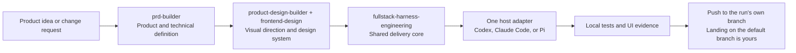
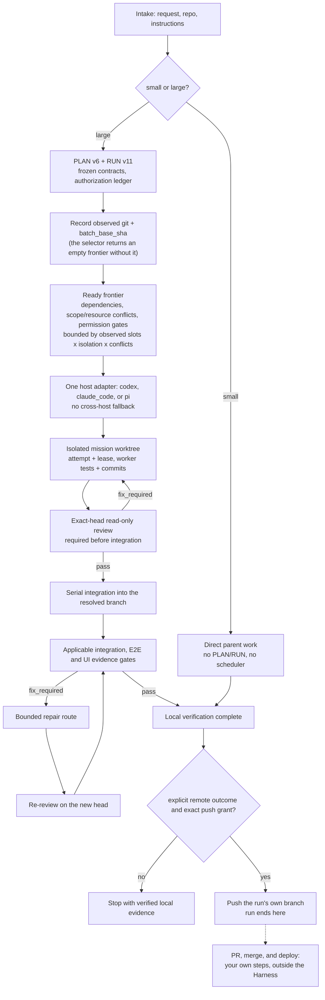

<p align="center">
  
</p>

<p align="center">
  <strong>English</strong> | <a href="README.zh-TW.md">繁體中文</a> | <a href="README.zh-CN.md">简体中文</a>
</p>

<p align="center">
  <a href="https://github.com/Phlegonlabs/fullstack-goal-dev/actions/workflows/harness-ci.yml"></a>
  
  
  
  
</p>

# Full Stack Harness

Private skill marketplace for turning a product idea or change request into a verified delivery flow with Codex, Claude Code, or Pi.

It is not a prompt collection. The plugin separates product definition, visual design, and engineering execution so each stage has one source of truth, a bounded handoff, and its own verification.

> Define the product. Make the design concrete. Execute only the work that is ready. Verify the exact result before it moves.

## Start here

| If you have... | Start with | What you get |
| --- | --- | --- |
| A product idea | `prd-builder` | Requirements, architecture, stack decisions, release targets, tests, and sourced market research |
| Frozen product inputs that need UI design | `product-design-builder` + `frontend-design` | A binding design-system contract based on the PRD UI surface contract |
| A scoped change in an existing repository | `fullstack-harness-engineering` | Direct implementation for small work, or a managed PLAN/RUN flow for large work |
| Per-branch Cloudflare Worker previews | `manage-cloudflare-worker-deployments` | Safe preview Worker deployment and cleanup, with an optional separately gated production bootstrap |

The skills can be used independently. You do not need to run the entire pipeline for every task.

## Core guarantees

- **Small work stays small.** One bounded change uses a direct inspect, implement, verify, and review loop.
- **Large work is explicit.** PLAN v6 defines the typed graph; RUN v11 records authorization, attempts, and evidence.
- **Workers are isolated.** Write missions use dedicated worktrees and bounded scopes. The parent validates every returned commit and diff.
- **Capability is not permission.** A runtime may be able to push or clean up, but each action still needs exact authorization.
- **Evidence follows the SHA.** A new commit invalidates earlier gate and UI evidence for the old head.
- **Local-only is the default.** The harness commits and verifies locally; only an explicit remote outcome authorizes pushing the run's own branch. Landing it on the default branch is yours to do.

## What is included

| Skill | Use it for | Main output |
| --- | --- | --- |
| `prd-builder` | Product discovery, requirements, Builder UX Direction inputs, architecture, stack decisions, release targets, test obligations, and the post-draft market-research gap pass | `PRD.md`, `architecture.md`, `stack-decisions.md`, `market-research.md` |
| `product-design-builder` | Visual direction and the design-system contract. It must load the separate `frontend-design` skill and stops if that dependency is unavailable. | `design-system.md`, `design-system.json` |
| `fullstack-harness-engineering` | Shared size gate, PLAN/RUN, authorization, local verification, and integration | Direct work or `PLAN.md` + `RUN.md` |
| `fullstack-harness-codex` | Top-level Codex tasks with one app-managed worktree per mission and parent-dispatched sibling reviewers | Runtime launch directives and worker results |
| `fullstack-harness-claude-code` | Claude Dynamic Workflow and parent-managed worktrees | Runtime launch directives and worker results |
| `fullstack-harness-pi` | Pi subagent roles with Pi-owned model and fallback selection in parent-managed worktrees | Runtime launch directives, resolved-role/model evidence, and worker results |
| `manage-cloudflare-worker-deployments` | Automatic per-branch Cloudflare Worker previews, guarded cleanup, and optional manual production bootstrap | Installer, lifecycle script, tests, configuration, and GitHub Actions templates |

The delivery core makes one size decision before it invokes managed orchestration:

- Small work stays direct with no planner, scheduler, PLAN/RUN, subagent, or external-runtime preflight by default.
- Large work enters managed planning. It may use `PLAN.md` and `RUN.md` for a managed-sequential delivery or for multiple missions and durable handoff; `tasks.md` is an on-demand human view, not required state.
- The selector derives `managed_sequential` for fewer than two actually selected safe write missions and `parallel_graph` for two or more. Scheduler fan-out starts only for the latter; the runtime driver remains a separate transport fact. The core then loads exactly one host adapter; external runtimes are preflighted only when a selected route needs them.
- Work never waits for remote CI. A run normally finishes with verified local evidence; only an explicit remote outcome moves it to pushing the verified integration head to the run's own branch.

Size means coordination scope and blast radius, not a raw file or line count. If small work grows, the Harness preserves completed work and plans only the remainder.

## How the system fits together



You can start at any stage. For example, use the Harness alone to fix an existing app. The skills keep their responsibilities separate: `prd-builder` defines the product, `product-design-builder` uses `frontend-design` to define its UI contract, and the Harness implements the frozen result.

## Delivery model

The Harness is built around explicit boundaries:

1. Inspect the current project and identify the required work.
2. Freeze the relevant contracts, sources, scope, and verification steps.
3. Plan dependencies before starting implementation when the task is large enough to need it.
4. Use parallel workers only when at least two safe write missions are actually selected, the work is independent and isolated, and every action is explicitly authorized; managed-sequential still proves its isolated writer, scope/head, and review gates.
5. Verify task results, integrations, UI journeys where relevant, and the final diff. A single mission has no invented cross-mission batch gate.
6. Stop with verified local evidence by default. If a remote outcome is explicitly requested, push the run's own branch only with exact remote intent plus branch/head authorization. Opening a PR, merging, and deploying are your own steps outside the Harness.

For plan-backed work, it records task scope, dependencies, worker ownership, verification commands, and action-specific authorization. A passing test does not authorize a push, worktree removal, or branch deletion. RUN-v11 push additionally requires explicit remote intent, one exact integration-branch target, and current-head authorization; an unknown default-branch identity fails the push closed without blocking unrelated local execution.




## Lightweight runtime adapters

The shared core owns the one PLAN/RUN control plane. Runtime-specific launch details are loaded lazily:

- A Codex host loads only `fullstack-harness-codex` and executes only `codex`-provider PLAN nodes.
- A Claude Code host loads only `fullstack-harness-claude-code` and executes only `claude_code`-provider PLAN nodes.
- A Pi host loads only `fullstack-harness-pi`, executes only `pi`-provider PLAN nodes, and leaves role/model/fallback selection to Pi's installed configuration.
- No adapter can invoke another runtime. A ready node whose provider does not match the current host is deferred with `runtime_unavailable` and left for a run hosted by the matching adapter.

Shared scripts, schemas, references, and templates remain under `fullstack-harness-engineering`; adapters link to them rather than shipping duplicate runtimes. This keeps the default prompt small.

One run has one active host. A same-repository handoff is allowed only after Host A closes its wave and `RUN.active_wave.status` is neither `active` nor `proposed`; the `active_wave` object remains in RUN, so its absence is not a handoff signal. Host B preserves PLAN/RUN and graph state, re-probes its runtime, and reviews the current exact SHA before selecting the next wave. A repair routes back to Host A and invalidates the old review; cross-machine handoff is unsupported until a future schema adds portable repository/state identity.

## Graph engineering and Dynamic Workflows

The skills use two graph layers:

- The **org graph** is the stable role contract: product, architecture, UX, design-system, mission-worker, reviewer, approval, integration, and lifecycle responsibilities.
- The **work graph** is the temporary task graph for one run. PRD and design workflows use bounded analysis graphs only when the host can enforce a `builder_readonly` tool profile; otherwise they fall back to the sequential parent. Engineering uses the canonical PLAN v6 graph and RUN v11 state.

Interviews and approvals stay outside running workflows because Claude Code Dynamic Workflows cannot ask for mid-run user input. The parent freezes inputs first, runs a bounded workflow, then owns staged writes, conflict resolution, approval, and publication.

For engineering, the Harness validates and selects the dependency-ready frontier before creating or requesting worktrees. Native Claude missions use parent-managed worktrees under `.claude/worktrees/`, bind every worker to the exact batch base, and require `EnterWorktree` before repository access. In every route, the parent validates the returned commit and actual Git diff, integrates accepted commits serially, and recomputes the graph frontier.

Claude Graph Workflow batches a mixed frontier into one call per homogeneous `tool_profile`; model and reasoning effort may vary inside a group, but a call never mixes write missions with read-only reviews. A tool profile is a label and prompt/result contract, not permission-level tool removal.

- `mission_write` requires `EnterWorktree` and the mission's bounded write contract.
- `code_review_readonly` requires exact-path review and read-only result evidence; it does not remove inherited tools.
- `visual_review_readonly` reviews retained screenshots or other existing evidence with the inherited host tools; new browser access must be vetted and added to the profile contract before use.

When Claude Code returns real Workflow run IDs, RUN state may retain the workflow/task ID, script digest, node group, graph/base binding, tool profile, status, and available metrics. Same-session resume can use that binding; cross-session recovery starts a new workflow attempt from canonical PLAN/RUN state.

A graph node's `allowed_providers` must include the host that is actually running the Harness before that node can be selected. Codex, Claude Code, and Pi cannot delegate a node to one another; there is no cross-host bridge. A ready node whose provider does not match the current host is deferred with `runtime_unavailable` and left for a run hosted by the matching adapter.

## Install

This is a private GitHub marketplace. You need access to `Phlegonlabs/fullstack-goal-dev`, GitHub CLI authentication, and at least one supported host: Codex, Claude Code, or Pi.

```bash
gh auth login
gh auth setup-git
git ls-remote https://github.com/Phlegonlabs/fullstack-goal-dev.git HEAD
```

### Fastest setup

```powershell
git clone https://github.com/Phlegonlabs/fullstack-goal-dev.git
Set-Location .\fullstack-goal-dev
powershell -File .\scripts\update-private-skills.ps1
```

The clone only gives you the script. The updater always installs from GitHub — `Phlegonlabs/fullstack-goal-dev` at `main` by default — and never reads your working directory. Local edits are not installed this way; use [Use a local checkout during development](#use-a-local-checkout-during-development) for that.

Then open a new Codex task, reload Claude Code, or start a fresh Pi session. Confirm the package is visible:

```powershell
codex plugin list
claude plugin list
pi list
```

### Zero-to-one flow

1. Install one supported host (Codex, Claude Code, or Pi) and this plugin, then use that host for the run.
2. Start a fresh host session, confirm the plugin, and invoke `$fullstack-harness-engineering`.
3. Let the size gate choose direct work or PLAN/RUN; do not pre-create workers for small work.
4. For a large run, keep one host active at a time and close/review each wave before a same-repository handoff.

### One-command updater

The shared updater detects Codex, Claude Code, and Pi; adds or updates the marketplace/package; and leaves unrelated runtime settings alone. Re-run the same command when this repository changes. Add `-UpdateHostRuntimes` only when you explicitly want the hosts themselves updated. If legacy standalone Pi Harness skills shadow the package, add `-ReplacePiStandaloneSkills`; it backs up and replaces only the named Harness skill directories.

Windows with PowerShell 7 (`pwsh`):

```powershell
Set-Location .\fullstack-goal-dev
pwsh -File .\scripts\update-private-skills.ps1
```

`pwsh` is a separate install. Windows PowerShell 5.1, which ships with Windows, also runs the script:

```powershell
Set-Location .\fullstack-goal-dev
powershell -File .\scripts\update-private-skills.ps1
```

macOS or Linux shell with PowerShell 7:

```bash
cd fullstack-goal-dev
pwsh -File ./scripts/update-private-skills.ps1
```

Open a new Codex task, reload or restart Claude Code, and start a fresh Pi session after updating. An active session does not hot-reload a changed runtime or Harness release.

### Install directly in Codex

```bash
codex plugin marketplace add Phlegonlabs/fullstack-goal-dev --ref main
codex plugin add fullstack-harness@fullstack-goal-dev
codex plugin list
```

### Install directly in Claude Code

```bash
claude plugin marketplace add Phlegonlabs/fullstack-goal-dev --scope user
claude plugin install fullstack-harness@fullstack-goal-dev --scope user
claude plugin list
```

Run `/reload-plugins` or restart Claude Code once the plugin is installed.

### Install directly in Pi

```bash
pi install git:github.com/Phlegonlabs/fullstack-goal-dev@main --no-approve
pi list --no-approve
```

Start a fresh Pi session after installing or updating. Existing standalone skills under `~/.pi/agent/skills` are user data and are never removed silently.

### Use a local checkout during development

Use a local marketplace when testing changes in this repository. Do not register the local and GitHub marketplace under the same name at the same time.

```powershell
$repo = (Resolve-Path .).Path
codex plugin marketplace add $repo
codex plugin add fullstack-harness@fullstack-goal-dev
claude plugin marketplace add $repo --scope user
claude plugin install fullstack-harness@fullstack-goal-dev --scope user
```

## Typical prompts

Codex accepts the `$skill-name` form below. In Claude Code, invoke the installed namespaced skill, such as `/fullstack-harness:prd-builder`, or ask for it by name. In Pi, use its discovered project skill or pass the skill directory with `--skill`, then ask for `fullstack-harness-pi` by name.

```text
Use $prd-builder to turn this idea into a PRD, architecture, stack decisions, release targets, and test obligations.
```

```text
Use $product-design-builder with $frontend-design to create the design-system contract from the approved docs/product/ product inputs.
```

```text
Use $fullstack-harness-engineering to review the existing app, plan the required work, and stop before implementation.
```

```text
Use $fullstack-harness-engineering to implement the approved plan. Create a branch and commit the verified change, but do not push or open a PR.
```

```text
Use $fullstack-harness-engineering to implement this plan and push the verified branch. I will open the PR and handle the merge myself.
```

```text
Use fullstack-harness-engineering with fullstack-harness-pi to execute this Pi-hosted plan. Preserve Pi's installed frontend_designer, worker, reviewer, model, and fallback settings.
```

```text
Use $manage-cloudflare-worker-deployments to configure safe per-branch Cloudflare Worker previews and cleanup for this repository.
```

For a multi-mission delivery, state the intended local and remote outcome. Branch creation, commits, integration, repository configuration, push, worktree removal, and branch deletion are independent actions. The Harness opens no pull request, merges nothing, and deploys nothing — those stay with you.

## Codex, Claude Code, and Pi execution

The Harness records the actual runtime capability instead of assuming one from an installed CLI.

| Runtime | Preferred parallel route | Fallback |
| --- | --- | --- |
| Codex app (`fullstack-harness-codex`) | App tasks in isolated app-managed worktrees | Direct subagents, then one sequential parent |
| Claude Code (`fullstack-harness-claude-code`) | Dynamic workflow with exact-base parent-managed `.claude/worktrees/` worktrees | Direct subagents, then one sequential parent |
| Pi (`fullstack-harness-pi`) | Installed Pi roles in parent-managed worktrees, with Pi selecting configured models and fallbacks | One sequential parent |

On Codex, each selected mission opens a separate top-level conversation in the left sidebar with its own app-managed worktree. The Harness parent separately dispatches any read-only explorer or reviewer as a sibling; a mission task never creates child agents. Coordinator-owned direct subagents do not replace requested top-level tasks. The adapter searches the current Codex tool surface for lazy-loaded project and thread tools before it uses a fallback. When the user explicitly requests this topology, missing thread capability is a blocker rather than permission to collapse the work back into one conversation.

Target-repository branch instructions take precedence. When a repository does not define another model, mission worktrees start from the current default-branch SHA and pass an exact-head read-only review before local integration into the run's own branch. The run defaults to verified local completion; an explicit remote outcome with an exact branch/head grant may push that branch. Landing it on the default branch is your own step. Fixes require a fresh review on the new head.

Each adapter runs only PLAN nodes whose allowed providers include its own host; there is no cross-host route. A node that requires another host's provider is deferred with `runtime_unavailable` instead of being executed here.

Parallel implementation has no small fixed cap by default; the configured write-worker maximum is set generously high, and the effective wave is bounded by observed worker slots, isolation capacity, and the dependency-ready conflict-free frontier size instead. One independently testable goal maps to one mission. Every writer gets explicit file ownership and a separate clean exact-base worktree. Shared APIs, schemas, and types freeze before dependent writers fan out. Explorers, writers, and reviewers are parent-dispatched siblings; workers and reviewers never delegate. After exact-head mission review, the parent integrates passing heads serially, starts fresh reviewers on the unified integration head, and then runs one broad final validation on the fixed candidate SHA. Workers never edit the parent `PLAN.md` or `RUN.md`, push, open PRs, merge, deploy, or remove worktrees. The parent owns integration and every landing or lifecycle action.

## Repository layout

```text
.agents/skills/                                      Canonical skill sources
plugins/fullstack-harness/skills/                    Generated plugin copies; do not edit directly
plugins/fullstack-harness/.claude-plugin/plugin.json Claude Code plugin manifest
plugins/fullstack-harness/.codex-plugin/plugin.json  Codex plugin manifest
.agents/plugins/marketplace.json                     Codex marketplace definition
.claude-plugin/marketplace.json                      Claude Code marketplace definition
assets/                                              README covers
scripts/sync_plugin_skills.py                        Copies canonical skills into the plugin bundle
scripts/update-private-skills.ps1                    Updates Codex, Claude Code, and Pi packages; host updates are opt-in
.github/workflows/harness-ci.yml                     Contract, unit, and E2E checks
```

## Maintain the marketplace

Edit only the canonical sources in `.agents/skills/`, then sync and verify the generated plugin bundle.

```bash
python scripts/sync_plugin_skills.py
python scripts/sync_plugin_skills.py --check
python -m unittest discover -s .agents/skills/fullstack-harness-engineering/scripts/tests -v
python -m unittest discover -s .agents/skills/prd-builder/scripts/tests -v
python -m unittest discover -s .agents/skills/product-design-builder/scripts/tests -v
python -m unittest discover -s plugins/fullstack-harness/skills/fullstack-harness-engineering/scripts/tests -p "test_packaged_*.py" -v
git diff --check
```

Before a release, update the matching version in both plugin manifests and `.claude-plugin/marketplace.json`, and inspect the entire diff. Do not push directly to `main`.

## Security and data safety

- Keep GitHub tokens and other credentials out of this repository.
- The updater uses your existing GitHub CLI session; it does not store a token in the project.
- Do not delete old standalone skill copies until the plugin is confirmed to load correctly.
- The orchestration skill requires explicit authorization for every state-changing Git or lifecycle action.

## Version history

Update this section with each release, alongside the version bump described above.

- **0.7.0** — Upgraded managed work to PLAN v6 / RUN v11 with durable pause/cancel control, cross-revision review lineages and owner grants, candidate-head tolerance for coordination-only commits, loaded/installed contract digests, guarded transition commands, and bounded review packets.
- **0.6.0** — Added a shared runtime upgrade gate for Codex, Claude Code, and Pi. RUN-v10 records host/Harness versions, lets only an already-active compatible-old wave reach its boundary, blocks incompatible or restart-pending sessions, and resumes unfinished work with a fresh attempt after update and re-probe. The updater now supports Pi packages; host binary updates and standalone Pi skill migration stay explicit.
- **0.5.0** — Reduced managed-run overhead across Codex, Claude Code, and Pi with bounded fresh context, event-driven completion, active-wave streaming review, resource-safe parallel verifier batches, exact session caching, effort routing, smaller task slices, and RUN-v10 runtime telemetry. The measured target is 75% less wall time, with 85% as the stretch target; authorization and exact-SHA gates are unchanged.
- **0.4.0** — Added repository-local design-image discovery and connected Impeccable concept generation to the Product Design Builder visual-direction gate. Creation mode now requires `product-design-builder`, `impeccable`, and `frontend-design`, while the existing PRD and three-file design package remain the only canonical product and design sources.
- **0.3.0** — Removed the GitHub landing adapter and the whole deployment/release model. The harness now ends at a push to the run's own branch; landing on the default branch is the user's own step. Authorization ledger cut from 19 actions to 12; `landing` reduced to `mode`, `remote`, `pushed_head_sha`, `continuity`; `integration.branch` is the only branch field. Dropped branch-protection evidence, `target_sources`, the three contract markers, `post_merge_cleanup`, `plan.release`, and `run.targets`.
- **0.2.0** — Worktree-per-mission default; PLAN v5 / RUN v10 typed graph with multi-reviewer fan-out; Cloudflare dispatched-deploy and Auto-Deploy (native Git auto-deploy) release models; persistent integration branches; per-page generic HTML prototypes replacing the retired page UI matrix; mobile/desktop platform support including a dedicated mobile stack-selection guide (native iOS/Android, Flutter, React Native/Expo); environment-secret scaffolding via `.env.example`; a Haiku cost tier for bounded/mechanical delegated work.
