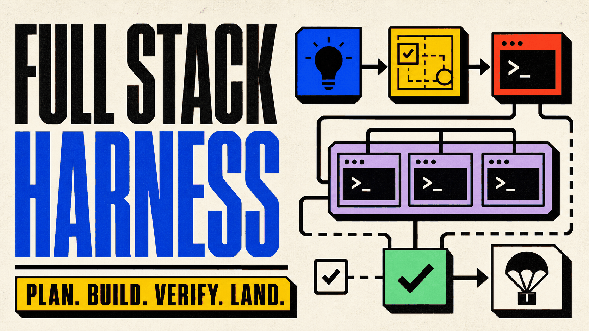
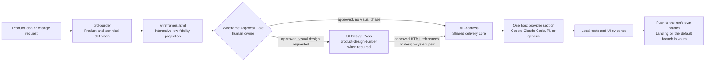

<p align="center">
  
</p>

<p align="center">
  <strong>English</strong> | <a href="README.zh-TW.md">繁體中文</a> | <a href="README.zh-CN.md">简体中文</a>
</p>

<p align="center">
  <a href="https://github.com/Phlegonlabs/fullstack-goal-dev/actions/workflows/harness-ci.yml"></a>
  
  
  
  
</p>

# Full Stack Harness

Private skill marketplace for turning a product idea or change request into a verified delivery flow with Codex, Claude Code, or Pi.

It is not a prompt collection. The plugin separates product definition, visual design, and engineering execution so each stage has one source of truth, a bounded handoff, and its own verification.

> Define the product. Make the design concrete. Execute only the work that is ready. Verify the exact result before it moves.

## Start here

| If you have... | Start with | What you get |
| --- | --- | --- |
| A product idea | `prd-builder` | Requirements, an interactive low-fidelity wireframe for UI-bearing products, architecture, stack decisions, release targets, tests, and sourced market research |
| An approved wireframe package that needs visual design | `prd-builder` UI Design Pass, then `product-design-builder` + `frontend-design` when the gate requires it | An approved visual direction — on web, retained high-fidelity HTML references under `docs/design/ui-references/` — plus a binding design-system pair when required |
| A scoped change in an existing repository | `full-harness` | Direct implementation for small work, or a managed PLAN/RUN flow for large work |

The skills can be used independently. You do not need to run the entire pipeline for every task.

## Core guarantees

- **Small work stays small.** One bounded change uses a direct inspect, implement, verify, and review loop.
- **Large work is explicit.** PLAN v6 defines the typed graph; RUN v11 records authorization, attempts, and evidence.
- **Product definition stops at a human gate.** A UI-bearing package ends in one interactive low-fidelity `wireframes.html` approved by the owner; visual design and implementation continue only on explicit request.
- **Visual targets are real HTML.** A requested web visual phase renders high-fidelity HTML with the loaded design skills, retains the approved references under `docs/design/ui-references/`, and archives superseded sets instead of deleting them; the Harness builds each page from its approved HTML reference.
- **Workers are isolated.** Write missions use dedicated worktrees and bounded scopes. The parent validates every returned commit and diff.
- **Capability is not permission.** A runtime may be able to push or clean up, but each action still needs exact authorization.
- **Evidence follows the SHA.** A new commit invalidates earlier gate and UI evidence for the old head.
- **Local-only is the default.** The harness commits and verifies locally; only an explicit remote outcome authorizes pushing the run's own branch. Landing it on the default branch is yours to do.

## What is included

| Skill | Use it for | Main output |
| --- | --- | --- |
| `prd-builder` | Product discovery, requirements, Builder UX Direction inputs, an interactive low-fidelity wireframe for UI-bearing products, architecture, stack decisions, release targets, test obligations, the post-draft market-research gap pass, and the optional UI Design Pass whose web route renders retained high-fidelity HTML references | `PRD.md`, `wireframes.html` (UI-bearing products), `architecture.md`, `stack-decisions.md`, `market-research.md` |
| `product-design-builder` | Compiling an approved UI Design Handoff into the frozen design-system pair. It must load the separate `frontend-design` skill and stops if that dependency is unavailable. | `design-system.md`, `design-system.json` |
| `full-harness` | Shared size gate, PLAN/RUN, authorization, local verification, and integration, plus the runtime adapter reference (`references/runtime-adapters.md`) holding one shared contract and one provider section per host (Codex, Claude Code, Pi, or generic) | Direct work or `PLAN.md` + `RUN.md` |

The delivery core makes one size decision before it invokes managed orchestration:

- Small work stays direct with no planner, scheduler, PLAN/RUN, subagent, or external-runtime preflight by default.
- Large work enters managed planning. It may use `PLAN.md` and `RUN.md` for a managed-sequential delivery or for multiple missions and durable handoff; `tasks.md` is an on-demand human view, not required state.
- The selector derives `managed_sequential` for fewer than two actually selected safe write missions and `parallel_graph` for two or more. Scheduler fan-out starts only for the latter; the runtime driver remains a separate transport fact. The core then applies exactly one host provider section from the runtime adapter reference; external runtimes are preflighted only when a selected route needs them.
- Work never waits for remote CI. A run normally finishes with verified local evidence; only an explicit remote outcome moves it to pushing the verified integration head to the run's own branch.

Size means coordination scope and blast radius, not a raw file or line count. If small work grows, the Harness preserves completed work and plans only the remainder.

## How the system fits together



You can start at any stage. For example, use the Harness alone to fix an existing app. The skills keep their responsibilities separate: `prd-builder` defines the product and stops at the approved `wireframes.html`, the optional UI Design Pass and `product-design-builder` define the visual contract — on web the pass leaves its approved high-fidelity HTML references in `docs/design/ui-references/<run-id>/` and archives superseded sets under `docs/design/archived/` — and the Harness implements the frozen result.

### Full skill lifecycle

The complete lifecycle across all three skills, with every gate and the cross-cutting mechanisms:

```mermaid
flowchart TB
    user([User idea or change request])

    subgraph PRD["prd-builder — product definition"]
        direction TB
        interview[Structured interview<br/>3 free-text segments + AskUserQuestion]
        pkg["Core package draft<br/>PRD.md + architecture.md<br/>+ stack-decisions.md"]
        wf["wireframes.html<br/>one interactive low-fidelity file (UI products)"]
        wgate{{"Wireframe Approval Gate<br/>(human approval = a complete stop point)"}}
        interview --> pkg --> wf --> wgate
        mr["market-research.md<br/>(gap pass, skippable)"]
        pkg -.-> mr
    end

    subgraph DESIGN["Visual design (optional; only on explicit owner request)"]
        direction TB
        taste["UI Design Pass<br/>taste skill via the Skill Bindings slot"]
        handoff[UI Design Handoff]
        dgate{{"Design System Need Gate"}}
        pair["product-design-builder<br/>design-system.md + design-system.json"]
        taste --> handoff --> dgate
        dgate -->|required| pair
        dgate -->|not_required| target[Approved page-faithful target]
    end

    subgraph HARNESS["full-harness — delivery core"]
        direction TB
        route["System Review And Route<br/>(parent-only, read-only)"]
        size{{"Project Size Gate"}}

        subgraph DIRECT["Direct route (small)"]
            direct_impl["Implement directly -> local verify<br/>-> review -> authorized Git actions"]
        end

        subgraph MANAGED["Managed route (large)"]
            direction TB
            plan["PLAN v6<br/>typed graph: missions / reviews / gates<br/>allowed_providers + atomic task commits"]
            newrun["new_run.py generates<br/>RUN v11 + the 12-key authorization ledger"]

            subgraph LOOP["Execution loop (per wave)"]
                direction TB
                lock["--session-id acquire-run-lock<br/>(run lock + heartbeat)"]
                obs["record-observation<br/>live-Git snapshot"]
                sel["select_ready_nodes.py<br/>deterministic frontier selection"]
                accept["accept-wave<br/>(batch base binding)"]
                adapters["runtime-adapters.md<br/>detect host -> load its provider section"]
                lease["lease-worker<br/>(worktree + lease + graph binding)"]
                workers["fresh bounded workers<br/>(Codex / Claude Code / Pi / generic)"]
                vr["validate_result.py<br/>verification against live Git facts"]
                review["exact-head review<br/>(reserve -> reviewer -> record)"]
                integ["record-integration<br/>(serial; byte-identical tree may skip the unified review)"]
                lock --> obs --> sel --> accept --> adapters --> lease --> workers --> vr --> review --> integ
            end

            plan --> newrun --> LOOP
            gates2["Broad final validation<br/>(E2E / regression / UI evidence matrix)"]
            LOOP --> gates2
        end

        route --> size
        size -->|small| DIRECT
        size -->|large| MANAGED
    end

    subgraph DEPLOY["Deployment (git-connected platform)"]
        direction TB
        push["Authorized push<br/>of the run branch"]
        preview["Preview builds automatically<br/>(platform builds per push)"]
        merge([User merges to main])
        prod["Production deployment<br/>(platform builds from main)"]
        check["Post-deploy verification (read-only)<br/>check_deployment.py"]
        push --> preview --> merge --> prod --> check
    end

    subgraph CROSS["Cross-cutting mechanisms (all stages)"]
        bindings["Skill Bindings<br/>(AGENTS.md slot table + SHA-256 pins)"]
        ledger["Authorization ledger<br/>12 independent action keys"]
        ver["Version gate + contract digest<br/>(compatible_old wave boundary)"]
        watch["watchdog + reconcile<br/>(interruption recovery)"]
    end

    user --> interview
    wgate -->|continue into visual design| DESIGN
    wgate -->|stop here| HARNESS
    pair --> route
    target --> route
    mr --> route
    DIRECT --> push
    gates2 --> push
```



Two human stop points bracket the agent-executable span: the Wireframe Approval and the merge to `main`. The execution loop is the heart of the system — every step in it is an atomic, validated RUN write.

## Delivery model

The Harness is built around explicit boundaries:

1. Inspect the current project and identify the required work.
2. Freeze the relevant contracts, sources, scope, and verification steps.
3. Plan dependencies before starting implementation when the task is large enough to need it.
4. Use parallel workers only when at least two safe write missions are actually selected, the work is independent and isolated, and every action is explicitly authorized; managed-sequential still proves its isolated writer, scope/head, and review gates.
5. Verify task results, integrations, UI journeys where relevant, and the final diff. A single mission has no invented cross-mission batch gate.
6. Stop with verified local evidence by default. If a remote outcome is explicitly requested, push the run's own branch only with exact remote intent plus branch/head authorization. Opening a PR, merging, and deploying are your own steps outside the Harness.

For plan-backed work, it records task scope, dependencies, worker ownership, verification commands, and action-specific authorization. A passing test does not authorize a push, worktree removal, or branch deletion. RUN-v11 push additionally requires explicit remote intent, one exact integration-branch target, and current-head authorization; an unknown default-branch identity fails the push closed without blocking unrelated local execution.


## Lightweight runtime adapters

The shared core owns the one PLAN/RUN control plane. Host-specific launch details live in one reference — `full-harness/references/runtime-adapters.md` — with a shared adapter contract and one provider section per host, applied lazily:

- A host applies only its own provider section and executes only PLAN nodes whose `allowed_providers` includes that host.
- A Pi host leaves role/model/fallback selection to Pi's installed configuration.
- No provider section can invoke another runtime. A ready node whose provider does not match the current host is deferred with `runtime_unavailable` and left for a run hosted by a matching host.
- Adding a new runtime host adds one provider section to that reference, not a new skill.

Shared scripts, schemas, references, and templates remain under `full-harness`; the provider sections link to them rather than shipping duplicate runtimes. This keeps the default prompt small.

One run has one active host. A same-repository handoff is allowed only after Host A closes its wave and `RUN.active_wave.status` is neither `active` nor `proposed`; the `active_wave` object remains in RUN, so its absence is not a handoff signal. Host B preserves PLAN/RUN and graph state, re-probes its runtime, and reviews the current exact SHA before selecting the next wave. A repair routes back to Host A and invalidates the old review; cross-machine handoff is unsupported until a future schema adds portable repository/state identity.

## Graph engineering and Dynamic Workflows

The skills use two graph layers:

- The **org graph** is the stable role contract: product, architecture, UX, design-system, mission-worker, reviewer, approval, integration, and lifecycle responsibilities.
- The **work graph** is the temporary task graph for one run. PRD and design workflows use bounded analysis graphs only when the host can enforce a `builder_readonly` tool profile; otherwise they fall back to the sequential parent. Engineering uses the canonical PLAN v6 graph and RUN v11 state.

Interviews and approvals stay outside running workflows because Claude Code Dynamic Workflows cannot ask for mid-run user input. The parent freezes inputs first, runs a bounded workflow, then owns staged writes, conflict resolution, approval, and publication.

For engineering, the Harness validates and selects the dependency-ready frontier before creating or requesting worktrees. Native Claude missions use parent-managed worktrees under `.claude/worktrees/`, bind every worker to the exact batch base, and require `EnterWorktree` before repository access. In every route, the parent validates the returned commit and actual Git diff, integrates accepted commits serially, and recomputes the graph frontier.

Claude Graph Workflow batches a mixed frontier into one call per homogeneous `tool_profile`; model and reasoning effort may vary inside a group, but a call never mixes write missions with read-only reviews. A tool profile is a label and prompt/result contract, not permission-level tool removal.

- `mission_write` requires `EnterWorktree` and the mission's bounded write contract.
- `code_review_readonly` requires exact-path review and read-only result evidence; it does not remove inherited tools.
- `visual_review_readonly` reviews retained screenshots or other existing evidence with the inherited host tools; new browser access must be vetted and added to the profile contract before use.

When Claude Code returns real Workflow run IDs, RUN state may retain the workflow/task ID, script digest, node group, graph/base binding, tool profile, status, and available metrics. Same-session resume can use that binding; cross-session recovery starts a new workflow attempt from canonical PLAN/RUN state.

A graph node's `allowed_providers` must include the host that is actually running the Harness before that node can be selected. Codex, Claude Code, and Pi cannot delegate a node to one another; there is no cross-host bridge. A ready node whose provider does not match the current host is deferred with `runtime_unavailable` and left for a run hosted by the matching adapter.

## Install

This is a private GitHub marketplace. You need access to `Phlegonlabs/fullstack-goal-dev`, GitHub CLI authentication, and at least one supported host: Codex, Claude Code, or Pi.

```bash
gh auth login
gh auth setup-git
git ls-remote https://github.com/Phlegonlabs/fullstack-goal-dev.git HEAD
```

### Fastest setup

```powershell
git clone https://github.com/Phlegonlabs/fullstack-goal-dev.git
Set-Location .\fullstack-goal-dev
powershell -File .\scripts\update-private-skills.ps1
```

The clone only gives you the script. The updater always installs from GitHub — `Phlegonlabs/fullstack-goal-dev` at `main` by default — and never reads your working directory. Local edits are not installed this way; use [Use a local checkout during development](#use-a-local-checkout-during-development) for that.

Then open a new Codex task, reload Claude Code, or start a fresh Pi session. Confirm the package is visible:

```powershell
codex plugin list
claude plugin list
pi list
```

### Zero-to-one flow

1. Install one supported host (Codex, Claude Code, or Pi) and this plugin, then use that host for the run.
2. Start a fresh host session, confirm the plugin, and invoke `$full-harness`.
3. Let the size gate choose direct work or PLAN/RUN; do not pre-create workers for small work.
4. For a large run, keep one host active at a time and close/review each wave before a same-repository handoff.

### One-command updater

The shared updater detects Codex, Claude Code, and Pi; adds or updates the marketplace/package; and leaves unrelated runtime settings alone. Re-run the same command when this repository changes. Add `-UpdateHostRuntimes` only when you explicitly want the hosts themselves updated. If legacy standalone Pi Harness skills shadow the package, add `-ReplacePiStandaloneSkills`; it backs up and replaces only the named Harness skill directories.

Windows with PowerShell 7 (`pwsh`):

```powershell
Set-Location .\fullstack-goal-dev
pwsh -File .\scripts\update-private-skills.ps1
```

`pwsh` is a separate install. Windows PowerShell 5.1, which ships with Windows, also runs the script:

```powershell
Set-Location .\fullstack-goal-dev
powershell -File .\scripts\update-private-skills.ps1
```

macOS or Linux shell with PowerShell 7:

```bash
cd fullstack-goal-dev
pwsh -File ./scripts/update-private-skills.ps1
```

Open a new Codex task, reload or restart Claude Code, and start a fresh Pi session after updating. An active session does not hot-reload a changed runtime or Harness release.

### Install directly in Codex

```bash
codex plugin marketplace add Phlegonlabs/fullstack-goal-dev --ref main
codex plugin add fullstack-harness@fullstack-goal-dev
codex plugin list
```

### Install directly in Claude Code

```bash
claude plugin marketplace add Phlegonlabs/fullstack-goal-dev --scope user
claude plugin install fullstack-harness@fullstack-goal-dev --scope user
claude plugin list
```

Run `/reload-plugins` or restart Claude Code once the plugin is installed.

### Install directly in Pi

```bash
pi install git:github.com/Phlegonlabs/fullstack-goal-dev@main --no-approve
pi list --no-approve
```

Start a fresh Pi session after installing or updating. Existing standalone skills under `~/.pi/agent/skills` are user data and are never removed silently.

### Use a local checkout during development

Use a local marketplace when testing changes in this repository. Do not register the local and GitHub marketplace under the same name at the same time.

```powershell
$repo = (Resolve-Path .).Path
codex plugin marketplace add $repo
codex plugin add fullstack-harness@fullstack-goal-dev
claude plugin marketplace add $repo --scope user
claude plugin install fullstack-harness@fullstack-goal-dev --scope user
```

## Typical prompts

Codex accepts the `$skill-name` form below. In Claude Code, invoke the installed namespaced skill, such as `/fullstack-harness:prd-builder`, or ask for it by name. In Pi, use its discovered project skill or pass the skill directory with `--skill`, then ask for `full-harness` by name.

```text
Use $prd-builder to turn this idea into a PRD, interactive low-fidelity wireframes for every page, architecture, stack decisions, release targets, and test obligations.
```

```text
Use $prd-builder to review the staged wireframes.html with me and record the Wireframe Approval decision before any visual or implementation work.
```

```text
The wireframes are approved; continue into visual design with $prd-builder's UI Design Pass. Render the web previews as high-fidelity HTML and retain the approved references under docs/design/ui-references/, invoking $product-design-builder only when the Design System Need Gate is required.
```

```text
Use $full-harness to implement the approved plan, building each page from its approved HTML reference in docs/design/ui-references/ within the recorded tolerance.
```

```text
Use $full-harness to review the existing app, plan the required work, and stop before implementation.
```

```text
Use $full-harness to implement the approved plan. Create a branch and commit the verified change, but do not push or open a PR.
```

```text
Use $full-harness to implement this plan and push the verified branch. I will open the PR and handle the merge myself.
```

```text
Use full-harness on this Pi host to execute this plan. Preserve Pi's installed frontend_designer, worker, reviewer, model, and fallback settings.
```

For a multi-mission delivery, state the intended local and remote outcome. Branch creation, commits, integration, repository configuration, push, worktree removal, and branch deletion are independent actions. The Harness opens no pull request, merges nothing, and deploys nothing — those stay with you.

## Codex, Claude Code, and Pi execution

The Harness records the actual runtime capability instead of assuming one from an installed CLI.

| Runtime | Preferred parallel route | Fallback |
| --- | --- | --- |
| Codex app | App tasks in isolated app-managed worktrees | Direct subagents, then one sequential parent |
| Claude Code | Dynamic workflow with exact-base parent-managed `.claude/worktrees/` worktrees | Direct subagents, then one sequential parent |
| Pi | Installed Pi roles in parent-managed worktrees, with Pi selecting configured models and fallbacks | One sequential parent |
| Any other host | Fresh subagents with parent-owned isolation | One sequential parent |

On Codex, each selected mission opens a separate top-level conversation in the left sidebar with its own app-managed worktree. The Harness parent separately dispatches any read-only explorer or reviewer as a sibling; a mission task never creates child agents. Coordinator-owned direct subagents do not replace requested top-level tasks. The adapter searches the current Codex tool surface for lazy-loaded project and thread tools before it uses a fallback. When the user explicitly requests this topology, missing thread capability is a blocker rather than permission to collapse the work back into one conversation.

Target-repository branch instructions take precedence. When a repository does not define another model, mission worktrees start from the current default-branch SHA and pass an exact-head read-only review before local integration into the run's own branch. The run defaults to verified local completion; an explicit remote outcome with an exact branch/head grant may push that branch. Landing it on the default branch is your own step. Fixes require a fresh review on the new head.

Each provider section runs only PLAN nodes whose allowed providers include its own host; there is no cross-host route. A node that requires another host's provider is deferred with `runtime_unavailable` instead of being executed here.

Parallel implementation has no small fixed cap by default; the configured write-worker maximum is set generously high, and the effective wave is bounded by observed worker slots, isolation capacity, and the dependency-ready conflict-free frontier size instead. One independently testable goal maps to one mission. Every writer gets explicit file ownership and a separate clean exact-base worktree. Shared APIs, schemas, and types freeze before dependent writers fan out. Explorers, writers, and reviewers are parent-dispatched siblings; workers and reviewers never delegate. After exact-head mission review, the parent integrates passing heads serially, starts fresh reviewers on the unified integration head, and then runs one broad final validation on the fixed candidate SHA. Workers never edit the parent `PLAN.md` or `RUN.md`, push, open PRs, merge, deploy, or remove worktrees. The parent owns integration and every landing or lifecycle action.

## Repository layout

```text
.agents/skills/                                      Canonical skill sources
plugins/fullstack-harness/skills/                    Generated plugin copies; do not edit directly
plugins/fullstack-harness/.claude-plugin/plugin.json Claude Code plugin manifest
plugins/fullstack-harness/.codex-plugin/plugin.json  Codex plugin manifest
.agents/plugins/marketplace.json                     Codex marketplace definition
.claude-plugin/marketplace.json                      Claude Code marketplace definition
assets/                                              README covers
scripts/sync_plugin_skills.py                        Copies canonical skills into the plugin bundle
scripts/update-private-skills.ps1                    Updates Codex, Claude Code, and Pi packages; host updates are opt-in
.github/workflows/harness-ci.yml                     Contract, unit, and E2E checks
```

## Maintain the marketplace

Edit only the canonical sources in `.agents/skills/`, then sync and verify the generated plugin bundle.

```bash
python scripts/sync_plugin_skills.py
python scripts/sync_plugin_skills.py --check
python -m unittest discover -s .agents/skills/full-harness/scripts/tests -v
python -m unittest discover -s .agents/skills/prd-builder/scripts/tests -v
python -m unittest discover -s .agents/skills/product-design-builder/scripts/tests -v
python -m unittest discover -s plugins/fullstack-harness/skills/full-harness/scripts/tests -p "test_packaged_*.py" -v
git diff --check
```

Before a release, update the matching version in both plugin manifests and `.claude-plugin/marketplace.json`, and inspect the entire diff. Do not push directly to `main`.

## Security and data safety

- Keep GitHub tokens and other credentials out of this repository.
- The updater uses your existing GitHub CLI session; it does not store a token in the project.
- Do not delete old standalone skill copies until the plugin is confirmed to load correctly.
- The orchestration skill requires explicit authorization for every state-changing Git or lifecycle action.

## Version history

Update this section with each release, alongside the version bump described above.

- **0.21.7** — UI runs now close with a Final Visual Parity Loop. At the final gate, every route-breakpoint-state screenshot is compared against the run's visual authority: the approved HTML reference rendered side by side in target-conformance mode, or a clean `check_ui_contract.py` run plus the full screenshot matrix in system-conformance mode. Each RUN-v11 `ui_evidence` row records a `target_comparison` (baseline, baseline artifact, verdict) validated by the harness; differences outside tolerance enter a repair cycle capped at two rounds, and an unresolved difference is reported instead of relabeled.
- **0.21.6** — Production/preview resource separation is now recorded and checked, not just stated. The deployment record gains a Resource Isolation table — every stateful binding class (D1 database, KV namespace, R2 bucket, Durable Objects) with its production and preview resource IDs — and `check_deployment.py` fails a record whose two columns share one ID. The contract requires the preview environment's declared bindings to be cross-checked read-only against the recorded production IDs before the first preview push serves traffic, the seeded project `AGENTS.md` states the full-separation rule, and the frontend stack decisions record two ID sets per binding class.
- **0.21.5** — Workers preview binding isolation is configured, not assumed. The contract now records that a version preview URL serves a new version of the same Worker and shares its live bindings — a version preview of the production Worker writes to production D1/KV/R2 — so stateful preview traffic goes to a separately named preview Worker created through a named Wrangler environment whose full binding set is declared explicitly, because named environments do not inherit bindings. The non-production D1/KV/R2 resources are created at project setup, before the first preview push; a preview bound to a production resource is a blocker, not a configuration preference, and the boundary must not depend on an experimental flag.
- **0.21.4** — Enhancement runs no longer carry superseded CSS or previous-version visuals into the updated result. A style-impacting enhancement that updates a retained HTML reference must regenerate the affected screens' style layer — appending to the previous file's CSS is not approvable, orphaned, duplicate, or overridden style blocks are removed before owner review, and an in-place edit refreshes the handoff's recorded SHA-256 and archives the pre-edit copy. Harness implementation now removes the styles and classes the new reference no longer contains, never grafts a new reference onto the previous implementation's CSS, and the refinement flow gains a stale-carryover check: the after state must show nothing the accepted delta supersedes, and the delta record names every superseded style and its call sites. The same discipline covers backend and app surfaces — superseded endpoints, business rules, queries, flags, and jobs are removed or carry an explicit recorded compatibility retention; silently keeping the old path beside the new one is a contract violation.
- **0.21.3** — Deployment gains a third recorded mode, `ci_connected`: the repository's own CI workflow deploys on push instead of a platform Git connection. On Cloudflare this is the Wrangler bootstrap — `wrangler pages project create` plus a push-triggered workflow running `wrangler pages deploy --branch` — with the same branch split as git-connected (production branch to production, every other branch to a preview URL) and the same boundary: a CI deployment adds no authorization keys, and the Harness never triggers it. On Workers the same workflow runs `wrangler deploy` for the production branch and `wrangler versions upload` for every other branch, each version serving its own preview URL, with preview versions never touching production traffic. The contract also records the hard limit that a Wrangler-created Direct Upload project can never be converted to git-connected afterwards, and states the standing default: Workers with Static Assets is the Cloudflare route; Pages enters only by an explicit owner decision. Post-deploy verification now also reports the pushed head's preview URL in the conversation — observed read-only from the workflow output or platform listing, never constructed or guessed.
- **0.21.2** — Native surfaces get the same wireframe and HTML-preview treatment as web. `wireframe-guide.md` states explicitly that a native mobile or desktop app ships the same single `wireframes.html` review projection, with its own size classes as the viewport toggle, and the UI Preview Gate now defaults every UI-bearing surface — web, native or cross-platform mobile, and desktop — to a high-fidelity HTML mock at the surface's size class, with image generation as the fallback only where HTML cannot represent the surface. A native surface goes further: one self-contained high-fidelity HTML containing every `UI-*` screen with a screen switcher — the same single-file principle as `wireframes.html` — so the owner reviews the whole app in one file. The visual phase's opening recipe is now stated explicitly: work from the approved PRD package with both skills combined — `design-taste-frontend` leading the overall design direction and `frontend-design` executing the surfaces Taste excludes.
- **0.21.1** — Wireframe Reference Pass and enhancement UI-impact classification. Before drafting `wireframes.html`, prd-builder fetches the structures of two to four mainstream live products in the category and pulls Dribbble-style gallery composition references, recording every consulted source or the skip reason in `PRD.md`'s `### Wireframe Approval`; references inform structure only. Enhancement runs now classify the delta's UI impact (`none` / `structure` / `style` / `both`) with the owner before drafting instead of assuming none: structure impact regenerates the affected wireframe pages and re-runs the approval gate, and style impact requires a recorded owner decision to re-run the UI Design Pass or keep the existing direction — a stale visual contract no longer publishes silently. The UI Design Pass now also chooses iconography through an online lookup over a closed candidate set — Lucide, Phosphor, Heroicons, and Tabler — recording one primary set plus a named fallback with cited official sources in the handoff's `Iconography:` line, instead of silently defaulting to a remembered library. Typography gets the same lookup discipline — display/body pairing with Latin plus CJK coverage and a loading strategy recorded in a `Typography:` line — and the handoff gains a `Color & dark mode:` line for palette derivation and dark-mode scope. The frontend stack gains a styling-approach layer (Tailwind utilities, CSS Modules, vanilla modern CSS) recorded with the same per-row status and cited authority as every other layer.
- **0.21.0** — Browser-extension archetype support end to end. prd-builder covers the browser-extension archetype across the interview, architecture, and stack selection, and full-harness gains the matching platform archetype. Market-research findings can now land in `stack-decisions.md`; `architecture.md` gains Frontend/Backend Architecture sections; provisional stack rows now gate publication; and `implementation-plan.md` sequencing intent is a mandatory PLAN input.
- **0.20.2** — Added the full skill lifecycle diagram to all three READMEs: one mermaid covering prd-builder → optional visual design → the full-harness routing and per-wave execution loop (lock, observe, select, accept, adapters, lease, workers, validate, review, integrate) → git-connected deployment, with the cross-cutting mechanisms (skill bindings, authorization ledger, version gate, watchdog) and the two human stop points called out.
- **0.20.1** — Review hardening. lease-worker accepts the real failure phases (`worker_failed`, `blocked`) and clears stale `last_outcome`/`blockers`, so a failed or reconciled mission can retry without hand edits; `reconcile-interrupted` no longer dead-ends. A malformed verifier in `verifier_executions` reports key errors instead of crashing the validator. `reserve-review-dispatch --packet-out` renders only after the post-transition validation gate. The run lock refreshes its heartbeat on the holder's own successful transitions, fails closed on naive/unparseable heartbeats, and a non-dict `run_lock` now fails schema. `record-integration` resolves the mission node from the PLAN graph instead of a naming convention; `accept-wave` refuses a live wave even with the same id; `record-observation` tolerates dead worktrees and derives `managed_by` from recorded workspace modes. Docs/gates: AGENTS.md's verification list gains the pyflakes step; the seeded-record checkers cover their own templates' placeholders; the lock doc shows the correct `--session-id` position; the driver ladder regains its Pi line; `cursor_wait` becomes the schema label `thread_poll`; the worker-report heading, File-Size-Limit pointers, seeded-document checklist coverage, and E2E/CI template routing are fixed. Six regression tests pin the fixes.
- **0.20.0** — Structural decomposition with behavior preserved (550 tests unchanged throughout). The four near-identical verifier-group loops merge into one `_validate_verifier_group` helper; `validate_plan` (~680 lines) decomposes into nine section helpers; `validate_run` sheds its first ~700 lines into five helpers (`observed`, `attempt_log`, `waves`, `workers` at ~400 lines, `review_lineages`) with shared locals threaded explicitly — the remaining `review_workers` and `runtime_capabilities` sections stay inline for a dedicated future pass. The selector builds its per-pass indexes (`nodes_by_id`, workers-by-mission, review-workers-by-node) once per selection instead of per node. Every step was gated on the full suite staying green.
- **0.19.1** — Code simplification pass, behavior-preserving (550 tests unchanged). Dead code removed (TOOL_PROFILES, unused helpers/imports/locals); `new_run.py` imports the 12-key ledger instead of re-declaring it; the pass-through wrapper and an inverted guard are gone; the source-path quartet merges into two parameterized helpers; git blob readers consolidate into `harness_core.read_git_blob`; `changed_files_digest` is shared by both validators; test git plumbing moves into `manifest_fixtures`; `harness_manifest` declares its re-export API via `__all__`; and a pyflakes step (45 findings cleaned to zero) joins CI so dead code cannot silently return.
- **0.19.0** — Runtime speedup: the write path is scripted. `record-observation` writes the live-Git observed snapshot, `accept-wave` records the wave plus batch base, `lease-worker` binds graph/mission/task/worker/attempt in one atomic validated write, and `record-integration` closes a mission against live Git — replacing the hand-authored RUN JSON edits that made parent output grow quadratically. `reserve-review-dispatch --packet-out` renders the reviewer packet from the in-memory reserved run (one command, one validation, no separate render pass), and the selector accepts `manifest_already_validated` from callers that just validated the identical pair; `plan_digest` is hoisted out of the workflow-run and review-worker loops.
- **0.18.1** — The seeded operational documents moved under `docs/`: `DEPLOYMENT.md` and `DOCUMENTS.md` now publish to `docs/` (the checker's default path follows), and the repository root carries only what runtimes auto-discover — `AGENTS.md` and `CLAUDE.md`. The artifact lifecycle's root-publication exception is gone with them; the root rule now stands unqualified.
- **0.18.0** — Final debt batch. The PRD artifact lifecycle now inventories, stages, publishes, and reports the seeded root `DEPLOYMENT.md`/`DOCUMENTS.md`; `configure_project_context.py --check --require-resolved` fails while a seeded `AGENTS.md` still carries unresolved placeholders and runs as the publish's final move; `docs/goal/DECISIONS.md` is defined (parent-owned mid-run decision log) and the DOCUMENTS manifest gains the `implementation-plan.md`, archived-documents, and DECISIONS rows; the contract-digest deferral branches (mismatch, unobserved) are tested; `check_deployment.py` structurally validates the deployment record read-only; and `render_tasks_view.py` emits a state fingerprint (plan revision/digest, graph revision, wave) with a `--check` staleness mode.
- **0.17.1** — Second debt sweep. `watchdog --reclaim` now honors `--stale-after-minutes` and a lockless RUN no longer rewrites the document; `--session-id` moved to one documented position (before the subcommand) with a clear refusal message; `inspect_harness_run.py` shows the run lock and control state; the DOCUMENTS manifest locates the design-system pair under `docs/product/` and matches the lowercase `tasks.md`; `skip-integration-review`, `--tree-sha`, and the lock/watchdog commands are named in the canonical docs and the runbook subcommand list; skill-binding pins are verified at the resume gate; `check_skill_spec` folds frontmatter continuation lines; the required verification set begins with the test-dependency install CI performs; dedicated providers have one source of truth (`RUNTIME_DRIVER_PRIORITY`).
- **0.17.0** — Hardening and standards pass. Tier-1 debt fixed: the DOCUMENTS manifest and TASKS wording now match the canonical `docs/goal/` placement, the byte-identical-tree integration-review skip gained its tooling path (`record-review-attempt --tree-sha`, `skip-integration-review` verifying against live Git), and stale adapter phrasing left the seeded templates. New: `check_skill_spec.py` enforces the Agent Skills open specification in CI; Skill Bindings pin bound skills by SKILL.md SHA-256 with `check_skill_bindings.py` recomputing them (a skill change is a deliberate, reviewed pin update); and durable execution gains a run lock (`acquire/release/heartbeat-run-lock`; foreign sessions are blocked, stale locks taken over after 15 minutes) plus a `watchdog` transition reporting interrupted-work candidates.
- **0.16.0** — When the PRD flow seeds a new `AGENTS.md` at publication, it now fills the Skill Bindings table from the locally installed skills visible to the session: slot candidates are listed, the owner confirms the bindings in one question, and slots without a local candidate stay at the bundled default. An established `AGENTS.md` is never reopened for this — a binding update is its own explicit edit.
- **0.15.0** — Skill selection is now a project setting, not a harness edit: the seeded `AGENTS.md` gains a Skill Bindings table mapping stage slots (design_direction, design_compilation, frontend_implementation) to installed skills, with the bundled skills as defaults. The PRD UI Design Pass and the harness UI contract resolve skills from the binding — adopting a new taste or frontend skill is a one-table project edit, and bound skills inherit the same modes, frozen sources, and review gates.
- **0.14.0** — The PRD flow now seeds two root documents: `DEPLOYMENT.md` (platform record, human setup checklist for git connection and Cloudflare/Vercel/AWS wiring, environment status table) and `DOCUMENTS.md` (the manifest of every flow document, its location, owner, and canonical status). `TASKS.md` renders at the repository root when a run starts and after each accepted wave. Root carries the operational documents; the PRD family stays under `docs/product/`.
- **0.13.0** — Added the deployment contract: a git-connected, platform-abstracted stage where preview tracks the pushed run branch and production tracks the default branch, with per-platform sections (cloudflare, vercel, aws, generic — any lowercase id), read-only post-deploy verification bound to the deployed SHA, a migration path that changes the record rather than the flow, and a Deployment section seeded into project `AGENTS.md`/`CLAUDE.md`. The 12-key ledger is unchanged; deployment adds no authorization keys.
- **0.12.1** — Added the Re-Orchestrate contract to the runtime upgrade gate: after an update, the fresh session runs Resume Reconciliation, re-derives the frontier, and binds every not-yet-succeeded node to the new runtime through new attempts (succeeded nodes are never re-executed); a provider change goes through an explicit replan of `allowed_providers`, never an inferred bridge.
- **0.12.0** — The integration-review skip now keys on byte-identical trees, not just the same commit: a single-mission wave integrated as a merge commit with the same tree as its already-passed review records `integration.integration_tree_sha` and `review_workers[].tree_sha` and skips the unified dispatch. A dispatched unified reviewer gets a seam-scoped packet listing the already-reviewed mission heads and focusing on merge seams, conflict resolutions, and cross-mission interaction.
- **0.11.0** — Provider ids are open: any lowercase id (a market runtime such as `gemini_cli` or `cursor`) is schema-valid in `allowed_providers` and RUN `runtime_adapter`, runs the generic route and driver ladder, and needs no schema change; a dedicated section and `RUNTIME_DRIVER_PRIORITY` entry are optional refinements. Market host names in the generic section are illustrations, not a support list.
- **0.10.1** — The generic provider section is now a complete route for any unlisted agent host — driver selection, version gate, model pass-through, context discovery, and chrome_devtools deferral — and the marketplace and README descriptions present the harness as adapting any coding agent rather than the three named runtimes.
- **0.10.0** — Merged the three runtime adapter skills into one shared reference, `full-harness/references/runtime-adapters.md`, with per-provider sections and an add-a-provider path; `fullstack-harness-codex`, `fullstack-harness-claude-code`, and `fullstack-harness-pi` are removed from the bundle (breaking). Reviews may declare required tools, RUN records per-tool reviewer probe evidence under `runtime_capabilities.reviewer_tools`, and the selector defers unprobed or unavailable tools instead of substituting the parent's browser. Missions pass a cohesion gate and every task maps to one ordered atomic commit boundary.
- **0.9.0** — Made design-skill-rendered high-fidelity HTML the default web preview route in the UI Design Pass. Approved HTML references are retained under `docs/design/ui-references/<run-id>/`, superseded sets archive under `docs/design/archived/`, and target-conformance implementation builds each page from its approved HTML reference with per-file frozen hashes.
- **0.8.0** — Added the wireframe stage to prd-builder: every UI-bearing package projects its UI surface contract into one self-contained interactive wireframes.html behind a human Wireframe Approval Gate, and visual design became a separate explicitly requested phase (UI Design Pass, provider-neutral preview gate, Design System Need Gate). product-design-builder now compiles only an approved UI Design Handoff. Also fixed the design-system pair-check command path, unified the wireframe approval vocabulary, made sync --check ignore runtime bytecode, and added git diff --check to CI.
- **0.7.0** — Upgraded managed work to PLAN v6 / RUN v11 with durable pause/cancel control, cross-revision review lineages and owner grants, candidate-head tolerance for coordination-only commits, loaded/installed contract digests, guarded transition commands, and bounded review packets.
- **0.6.0** — Added a shared runtime upgrade gate for Codex, Claude Code, and Pi. RUN-v10 records host/Harness versions, lets only an already-active compatible-old wave reach its boundary, blocks incompatible or restart-pending sessions, and resumes unfinished work with a fresh attempt after update and re-probe. The updater now supports Pi packages; host binary updates and standalone Pi skill migration stay explicit.
- **0.5.0** — Reduced managed-run overhead across Codex, Claude Code, and Pi with bounded fresh context, event-driven completion, active-wave streaming review, resource-safe parallel verifier batches, exact session caching, effort routing, smaller task slices, and RUN-v10 runtime telemetry. The measured target is 75% less wall time, with 85% as the stretch target; authorization and exact-SHA gates are unchanged.
- **0.4.0** — Added repository-local design-image discovery and connected Impeccable concept generation to the Product Design Builder visual-direction gate. Creation mode now requires `product-design-builder`, `impeccable`, and `frontend-design`, while the existing PRD and three-file design package remain the only canonical product and design sources.
- **0.3.0** — Removed the GitHub landing adapter and the whole deployment/release model. The harness now ends at a push to the run's own branch; landing on the default branch is the user's own step. Authorization ledger cut from 19 actions to 12; `landing` reduced to `mode`, `remote`, `pushed_head_sha`, `continuity`; `integration.branch` is the only branch field. Dropped branch-protection evidence, `target_sources`, the three contract markers, `post_merge_cleanup`, `plan.release`, and `run.targets`.
- **0.2.0** — Worktree-per-mission default; PLAN v5 / RUN v10 typed graph with multi-reviewer fan-out; Cloudflare dispatched-deploy and Auto-Deploy (native Git auto-deploy) release models; persistent integration branches; per-page generic HTML prototypes replacing the retired page UI matrix; mobile/desktop platform support including a dedicated mobile stack-selection guide (native iOS/Android, Flutter, React Native/Expo); environment-secret scaffolding via `.env.example`; a Haiku cost tier for bounded/mechanical delegated work.
