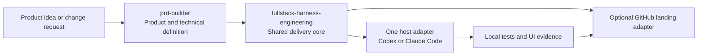

<p align="center">
  
</p>

<p align="center">
  <strong>English</strong> | <a href="README.zh-TW.md">繁體中文</a> | <a href="README.zh-CN.md">简体中文</a>
</p>

<p align="center">
  <a href="https://github.com/Phlegonlabs/fullstack-goal-dev/actions/workflows/harness-ci.yml"></a>
  
  
  
  
</p>

# Full Stack Harness

Private skill marketplace for turning a product idea or change request into a verified delivery flow with Codex or Claude Code.

It is not a prompt collection. The plugin separates product definition, visual design, engineering execution, and GitHub landing so each stage has one source of truth, a bounded handoff, and its own verification.

> Define the product. Make the design concrete. Execute only the work that is ready. Verify the exact result before it moves.

## Start here

| If you have... | Start with | What you get |
| --- | --- | --- |
| A product idea | `prd-builder` | Requirements, architecture, stack decisions, wireframes, and the design system |
| A scoped change in an existing repository | `fullstack-harness-engineering` | Direct implementation for small work, or a managed PLAN/RUN flow for large work |
| A verified local candidate that must reach GitHub | `fullstack-harness-github-landing` | Current-head push, PR, CI/review convergence, and exact-head merge |

The skills can be used independently. You do not need to run the entire pipeline for every task.

## Core guarantees

- **Small work stays small.** One bounded change uses a direct inspect, implement, verify, and review loop.
- **Large work is explicit.** PLAN v5 defines the typed graph and provider-neutral release targets; RUN v10 records authorization, attempts, evidence, release state, and landing state.
- **Workers are isolated.** Write missions use dedicated worktrees and bounded scopes. The parent validates every returned commit and diff.
- **Capability is not permission.** A runtime may be able to push, merge, deploy, or clean up, but each action still needs exact authorization.
- **Evidence follows the SHA.** A new push invalidates earlier CI, review, deployment, and UI evidence for the old head.
- **Deployment is a separate lifecycle.** Development and production targets keep separate data, secrets, auth, payment modes, and verification.

## What is included

| Skill | Use it for | Main output |
| --- | --- | --- |
| `prd-builder` | Product discovery, requirements, architecture, frontend-stack decisions, low-fidelity wireframes, and the design system: tokens, primitive contracts with closed variant sets, product components, motion rules, and the state matrix | `PRD.md`, `architecture.md`, `stack-decisions.md`, `wireframes.md`, `design-system.md`, `design-system.json` |
| `fullstack-harness-engineering` | Shared size gate, PLAN/RUN, authorization, local verification, and integration | Direct work, `RUN.md`, or `PLAN.md` + `RUN.md` |
| `fullstack-harness-codex` | Top-level Codex tasks, one app-managed worktree per mission, and task-local read-only Multi-agent helpers | Runtime launch directives and worker results |
| `fullstack-harness-claude-code` | Claude Dynamic Workflow and parent-managed worktrees | Runtime launch directives and worker results |
| `fullstack-harness-github-landing` | Final-head push, PR, concurrent CI/review, and exact-head merge | Remote landing evidence |

The delivery core makes one size decision before it invokes managed orchestration:

- Small work stays direct with no planner, scheduler, PLAN/RUN, subagent, or external-runtime preflight by default.
- Large work enters managed planning. It may use `RUN.md` for a sequential delivery or `PLAN.md` and `RUN.md` for multiple missions and durable handoff.
- Scheduler fan-out starts only when a large plan has at least two independent ready missions. The core then loads exactly one host adapter; external runtimes are preflighted only when a selected route needs them.
- Local implementation, branch, and commit work does not load the GitHub adapter or wait for remote CI. Pull-request delivery pushes the final verified candidate and evaluates current-head CI and Codex review concurrently.

Size means coordination scope and blast radius, not a raw file or line count. If small work grows, the Harness preserves completed work and plans only the remainder.

## How the system fits together



You can start at any stage. For example, use the Harness alone to fix an existing app. The skills keep their responsibilities separate: `prd-builder` defines what to build and what it looks like, and the Harness builds it without redesigning it.

## Delivery model

The Harness is built around explicit boundaries:

1. Inspect the current project and identify the required work.
2. Freeze the relevant contracts, sources, scope, and verification steps.
3. Plan dependencies before starting implementation when the task is large enough to need it.
4. Use parallel workers only when the work is independent, isolated, and explicitly authorized.
5. Verify task results, integrations, UI journeys where relevant, and the final diff.
6. Stop locally unless a remote outcome is requested; then land through the repository's PR flow only with separate authorization for each GitHub action.

For plan-backed work, it records task scope, dependencies, worker ownership, verification commands, and action-specific authorization. A passing test does not authorize a push, PR, review action, merge, deploy, or cleanup.

<p align="center">
  
</p>

<p align="center"><sub>Illustrated control flow. The canonical behavior lives in the installed skills and current PLAN/RUN schemas.</sub></p>

## Lightweight runtime and landing adapters

The shared core owns the one PLAN/RUN control plane. Runtime-specific launch details are loaded lazily:

- A Codex host loads only `fullstack-harness-codex` and executes only `codex`-provider PLAN nodes.
- A Claude Code host loads only `fullstack-harness-claude-code` and executes only `claude_code`-provider PLAN nodes.
- Neither adapter can invoke the other runtime. A ready node whose provider does not match the current host is reported blocked on provider mismatch and left for a run hosted by the matching adapter.
- `fullstack-harness-github-landing` is loaded only for an explicit push, PR, CI, review, merge, or repository-configuration outcome.

Shared scripts, schemas, references, and templates remain under `fullstack-harness-engineering`; adapters link to them rather than shipping duplicate runtimes. This keeps the default prompt small and avoids remote verification during local-only work.

For remote delivery, the final local candidate is pushed once. GitHub Actions and Codex review start or are observed as sibling gates for that same PR head and are polled concurrently. A new push invalidates both, and merge still requires both to pass on the same SHA.

Codex Cloud review is available only when the repository is connected to Codex Cloud and code review is enabled. Automatic review may start when a PR opens; otherwise request it with `@codex review`. If review capability is missing, record the review gate as unavailable, never passed.

## Graph engineering and Dynamic Workflows

The skills use two graph layers:

- The **org graph** is the stable role contract: product, architecture, UX, design-system, mission-worker, reviewer, approval, integration, and lifecycle responsibilities.
- The **work graph** is the temporary task graph for one run. PRD and design workflows use bounded analysis graphs only when the host can enforce a `builder_readonly` tool profile; otherwise they fall back to the sequential parent. Engineering uses the canonical PLAN v5 graph and RUN v10 state.

Interviews and approvals stay outside running workflows because Claude Code Dynamic Workflows cannot ask for mid-run user input. The parent freezes inputs first, runs a bounded workflow, then owns staged writes, conflict resolution, approval, and publication.

For engineering, the Harness validates and selects the dependency-ready frontier before creating or requesting worktrees. Native Claude missions use parent-managed worktrees under `.claude/worktrees/`, bind every worker to the exact batch base, and require `EnterWorktree` before repository access. In every route, the parent validates the returned commit and actual Git diff, integrates accepted commits serially, and recomputes the graph frontier.

Claude waves are separated by model, reasoning effort, and tool profile:

- `mission_write` includes `EnterWorktree` and bounded write tools.
- `code_review_readonly` omits write-capable tools.
- `visual_review_readonly` uses the exact read/search allowlist and reviews retained screenshots or other existing evidence. New browser tools must be vetted and added to the profile before use.

When Claude Code returns real Workflow run IDs, RUN state may retain the workflow/task ID, script digest, node group, graph/base binding, tool profile, status, and available metrics. Same-session resume can use that binding; cross-session recovery starts a new workflow attempt from canonical PLAN/RUN state.

A graph node's `allowed_providers` must include the host that is actually running the Harness before that node can be selected. Claude Code cannot delegate a node to Codex, and Codex cannot delegate a node to Claude Code; there is no cross-host bridge. A ready node whose provider does not match the current host is recorded blocked on provider mismatch and left for a run hosted by the matching adapter.

## Release and deployment safety

The delivery graph treats deployment as a first-class, separately authorized lifecycle:

- A deployable product records its provider, targets, commands, migrations, prerequisites, and deployed-environment checks in the plan.
- Cloudflare projects use one codebase with isolated `development` and `production` Workers and separate D1, KV, R2, queue, Durable Object, secret, auth, payment, route, and webhook configuration.
- The default Cloudflare model uses exact-SHA GitHub Actions dispatch. Development binds to the reviewed `development` head; production binds to the resulting `production` head after user-approved promotion.
- An optional Cloudflare Workers Builds model can auto-deploy the persistent `development` and protected `production` branches to their matching Workers. It is used only when explicitly selected and never mixed with the dispatched model.
- Day-one bootstrap creates only the confirmed environment resources and Worker shells. Real feature deployment still needs target-specific authorization.
- `docs/deployment.md` records the human-facing topology and setup; RUN remains the machine-readable execution record.
- Mobile and desktop deliveries use the same separation of development/beta and production credentials, backends, store tracks, and release evidence without forcing a Cloudflare-shaped contract.

## Install

This is a private GitHub marketplace. You need access to `Phlegonlabs/fullstack-goal-dev`, GitHub CLI authentication, and either Codex, Claude Code, or both.

```bash
gh auth login
gh auth setup-git
git ls-remote https://github.com/Phlegonlabs/fullstack-goal-dev.git HEAD
```

### Fastest setup

```powershell
git clone https://github.com/Phlegonlabs/fullstack-goal-dev.git
Set-Location .\fullstack-goal-dev
pwsh -File .\scripts\update-private-skills.ps1
```

Then open a new Codex task or reload Claude Code. Confirm the plugin is visible:

```powershell
codex plugin list
claude plugin list
```

### One-command updater

The shared updater detects installed runtimes, adds or updates the marketplace, and installs the plugin where supported. Re-run the same command when this repository changes.

Windows PowerShell:

```powershell
Set-Location .\fullstack-goal-dev
pwsh -File .\scripts\update-private-skills.ps1
```

macOS or Linux shell with PowerShell 7:

```bash
cd fullstack-goal-dev
pwsh -File ./scripts/update-private-skills.ps1
```

Open a new Codex task after updating. Reload or restart Claude Code after updating its plugin.

### Install directly in Codex

```bash
codex plugin marketplace add Phlegonlabs/fullstack-goal-dev --ref main
codex plugin add fullstack-harness@fullstack-goal-dev
codex plugin list
```

### Install directly in Claude Code

```bash
claude plugin marketplace add Phlegonlabs/fullstack-goal-dev --scope user
claude plugin install fullstack-harness@fullstack-goal-dev --scope user
claude plugin list
```

Run `/reload-plugins` or restart Claude Code once the plugin is installed.

### Use a local checkout during development

Use a local marketplace when testing changes in this repository. Do not register the local and GitHub marketplace under the same name at the same time.

```powershell
$repo = (Resolve-Path .).Path
codex plugin marketplace add $repo
codex plugin add fullstack-harness@fullstack-goal-dev
claude plugin marketplace add $repo --scope user
claude plugin install fullstack-harness@fullstack-goal-dev --scope user
```

## Typical prompts

Codex accepts the `$skill-name` form below. In Claude Code, invoke the installed namespaced skill, such as `/fullstack-harness:prd-builder`, or ask for it by name.

```text
Use $prd-builder to turn this idea into a PRD, architecture, stack decisions, and wireframes.
```

```text
Use $prd-builder to add the design system to docs/product/ from the existing PRD.md and wireframes.md.
```

```text
Use $fullstack-harness-engineering to review the existing app, plan the required work, and stop before implementation.
```

```text
Use $fullstack-harness-engineering to implement the approved plan. Create a branch and commit the verified change, but do not push or open a PR.
```

```text
Use $fullstack-harness-engineering to deliver this through a Draft PR. Request current-head CI and Codex review, but stop before merge or deployment.
```

For a multi-mission delivery, state the intended local and remote outcome. Branch creation, commits, integration, repository configuration, push, PR creation, review management, merge, deployment, worktree removal, and branch deletion are independent actions.

## Codex and Claude Code execution

The Harness records the actual runtime capability instead of assuming one from an installed CLI.

| Runtime | Preferred parallel route | Fallback |
| --- | --- | --- |
| Codex app (`fullstack-harness-codex`) | App tasks in isolated app-managed worktrees | Direct subagents, then one sequential parent |
| Claude Code (`fullstack-harness-claude-code`) | Dynamic workflow with exact-base parent-managed `.claude/worktrees/` worktrees | Direct subagents, then one sequential parent |

On Codex, the preferred route is two-level: each selected mission opens a separate top-level conversation in the left sidebar with its own app-managed worktree, then that task runs its own bounded Multi-agent helpers. Coordinator-owned subagents do not replace those top-level tasks. The adapter searches the current Codex tool surface for lazy-loaded project and thread tools before it uses a fallback. When the user explicitly requests this topology, missing thread capability is a blocker rather than permission to collapse the work back into one conversation.

Target-repository branch and pull-request instructions take precedence. When a repository does not define another model, mission worktrees start from the current `development` SHA, pass an exact-head read-only review before integration into `development`, and reach `production` only through a later explicitly approved `development -> production` promotion. Fixes require a fresh review on the new head.

Each adapter runs only PLAN nodes whose allowed providers include its own host; there is no cross-host route. A node that requires the other host's provider is reported blocked on provider mismatch instead of being executed here.

Parallel implementation has no small fixed cap by default; the configured write-worker maximum is set generously high, and the effective wave is bounded by observed worker slots, isolation capacity, and the dependency-ready conflict-free frontier size instead. Every worker needs an isolated workspace, a bounded write scope, a verifier, and explicit authorization. Worktrees are allocated only after ready-frontier selection. Native Claude missions enter their assigned parent-managed worktree. Workers never edit the parent `PLAN.md` or `RUN.md`, push, open PRs, merge, deploy, or remove worktrees. The parent owns integration and every landing or lifecycle action.

## Repository layout

```text
.agents/skills/                   Canonical skill sources
plugins/fullstack-harness/skills/ Generated plugin copies; do not edit directly
.agents/plugins/marketplace.json  Codex marketplace definition
.claude-plugin/marketplace.json   Claude Code marketplace definition
assets/                           README covers and workflow illustrations
scripts/sync_plugin_skills.py     Copies canonical skills into the plugin bundle
scripts/update-private-skills.ps1 Updates installed marketplaces and plugin
.github/workflows/harness-ci.yml  Contract, unit, and E2E checks
```

## Maintain the marketplace

Edit only the canonical sources in `.agents/skills/`, then sync and verify the generated plugin bundle.

```bash
python scripts/sync_plugin_skills.py
python scripts/sync_plugin_skills.py --check
python -m unittest discover -s .agents/skills/fullstack-harness-engineering/scripts/tests -v
python -m unittest discover -s .agents/skills/prd-builder/scripts/tests -v
git diff --check
```

Before a release, update the matching version in both plugin manifests and `.claude-plugin/marketplace.json`, inspect the entire diff, and use the repository PR flow. Do not push directly to `main`.

## Security and data safety

- Keep GitHub tokens and other credentials out of this repository.
- The updater uses your existing GitHub CLI session; it does not store a token in the project.
- Do not delete old standalone skill copies until the plugin is confirmed to load correctly.
- The orchestration skill requires explicit authorization for every state-changing GitHub or lifecycle action.

## Version history

Update this section with each release, alongside the version bump described above.

- **0.2.0** — Worktree-per-mission default; PLAN-v4 typed graph with multi-reviewer fan-out; Cloudflare dispatched-deploy and Auto-Deploy (native Git auto-deploy) release models; persistent integration branches; mobile/desktop platform support including a dedicated mobile stack-selection guide (native iOS/Android, Flutter, React Native/Expo); environment-secret scaffolding via `.env.example`; a Haiku cost tier for bounded/mechanical delegated work.
