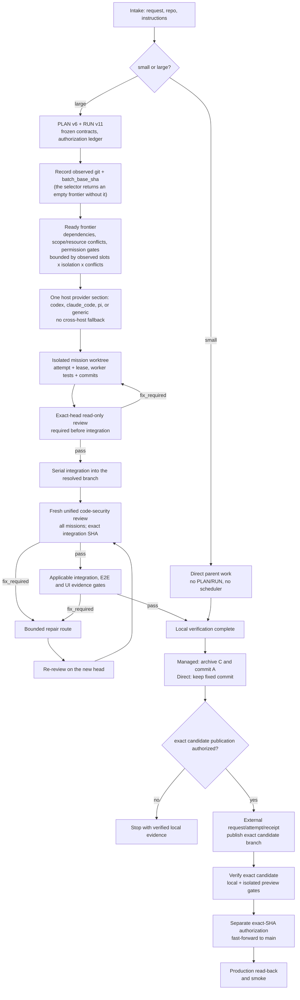

<p align="center">
  
</p>

<p align="center">
  <strong>English</strong> | <a href="README.zh-TW.md">繁體中文</a> | <a href="README.zh-CN.md">简体中文</a> | <a href="README.es.md">Español</a>
</p>

<p align="center">
  <a href="https://github.com/Phlegonlabs/product-delivery-harness/actions/workflows/harness-ci.yml"></a>
  
  
  
</p>

# Product Delivery Harness

Skills repository for turning a product idea or change request into a verified delivery flow with Codex, Claude Code, Pi, or any host that discovers a user skills directory.

It is not a prompt collection. The skill suite separates product definition, visual design, engineering execution, code-security review, activation, and post-release organic-growth review so each stage has one source of truth, a bounded handoff, and its own verification.

> Define the product. Compile the design. Deliver verified software.

## Start here

| If you have... | Start with | What you get |
| --- | --- | --- |
| A product idea | `product-definition-builder` | An owner-approved Product Definition with complete frontend/backend architecture, stack choices, UI behavior, release targets, and tests |
| An approved Product Definition that needs UI design | `ui-design-builder` | Human UI/style/motion/media intake, responsive `wireframes/4`, `frontend-design` Style Integration, Impeccable HiFi review, W/H scoring, Visual Approval, and a design-system decision |
| A scoped change in an existing repository | `delivery-harness` | Direct implementation for small work, or a managed PLAN/RUN flow for large work |
| A fixed integrated code candidate | `code-security-review` | A read-only, exact-SHA security review with validated source-to-sink findings and explicit coverage gaps |
| A delivered release that needs external setup | `product-activation` | Exact authorized console actions, verified measurement sources, and target-by-target activation readiness |
| A public production site that needs SEO or organic-growth analysis | `seo-growth-review` | A read-only technical and measurement review, evidence-ranked keyword/page opportunities, and routed follow-ups |

Each bundled skill can be invoked on its own; the full pipeline is optional. Each mode still enforces its declared inputs and dependencies.

## Core guarantees

- **Small work stays small.** One bounded change uses a direct inspect, implement, verify, and review loop.
- **Large work is explicit.** PLAN v6 defines the typed graph; RUN v11 records authorization, attempts, and evidence.
- **Product definition is approved before UI design.** Research-first evidence, applicable baselines, a complete candidate, explicit recommendation choices, and any accepted delta precede the final approvals. Every release surface selects its required architecture and stack areas from one closed applicability matrix: hosted UI needs frontend, native UI needs mobile/desktop, services and agents need backend/data/interface decisions, and CLI delivery needs an explicit toolchain. Product and Stack approvals carry canonical content digests, a structured revision, a non-future decision time, and exact acceptance references for every retained open item. At a human review gate, the agent proactively links the complete actual candidate and waits for explicit approval. UI-bearing products enter `ui-design-builder` only on an explicit request. CLI and `other_nonpublic` share the canonical `Toolchain` approval area (`CLI/toolchain` is an alias), with language, toolchain, distribution mechanism, and testing layers.
- **Security starts in Product Definition.** Executable software — including static sites, clients, CLI tools, and agents — records a human-owned Security Requirements Gate. Each required row traces an existing PRD requirement and security TEST, then Harness task gates implement controls plus denial/no-side-effect negative tests before commit; the fresh exact-SHA code-security review remains final.

Security exemptions also require a documentation-only product description and Product Archetype, plus explicitly absent executable architecture surfaces. Required security TEST signals and Harness criteria use `denial: rejected (<signal>); no unauthorized side effects: unchanged (<state evidence>)`, with concrete observations for both assertions.
- **Recommendations are not implementation authority.** Product Definition presents two or three coherent technology bundles per applicable area. New accepted choices are `Approved`, existing choices remain `Selected`, and hard constraints are `Required`; `Recommended` and `Provisional` block delivery. The checkpoint's closed area set must equal the applicable resolved areas, and the approved option's layer map must equal the executable stack rows. `render_stack_option_map.py` prints a candidate map from existing rows for owner review; it cannot approve or rewrite the package. Explicit option maps are wrapped as `||...||`; legacy comma-only maps remain readable, and commas in layer names or selections require the explicit form.
- **UI design has its own approval spine.** `ui-design-builder` asks the human owner for UI, style, motion, and media choices before drawing. Schema-4 wireframes freeze copy and display contracts. Wireframe and Visual Approval responses link the complete current HTML page/state set and affected design handoff; approval links point to final logical paths in the authorized publication checkout, then to the source checkout after publication. Hybrid products bind every `UI-*` surface to its exact architecture `releaseSurface`, `surfaceClass`, `captureMode`, and per-surface responsive set; hosted, extension, native, and desktop evidence remain separate. The HiFi target carries that exact scope, one restrictive CSP, and a human-attested sandboxed-offline receipt with retained console, network, navigation, form, and popup attempts. A required design system uses one narrow handshake: Visual Approval records `required/pending`, the compiler validates that exact approved input and creates the pair, then the owner links both hashes and final validation rejects the pending state. An agent cannot mint either approval. Docker/Podman is not required for UI review; the offline receipt describes enforced browser restrictions.
- **HiFi pages must connect through product controls.** New or revised `ui-hifi/2` references use an `index.html` manifest with hash-bound sibling HTML pages and explicit control destinations. Offline `ui-output/2` evidence checks click and keyboard outcomes at every responsive target; missing pages, stale hashes, dead controls, wrong destinations, and undeclared navigation block approval. Each page renders exactly its assigned surfaces. Publish and retain the complete package. Schema-1 references remain inspection-only; every current Visual Approval requires schema 2. A frozen Git revision must contain every listed child page with the same bytes.
- **Visual quality has its own floor.** HiFi H5 (visual slop), H7 (creative distinction), and H9 (design consistency) each require 80; an overall 90 cannot average away a weak visual dimension. Reviews cite inspected screenshots and confirmed direction principles. Numeric validation does not prove beauty or human inspection.
- **Choose directions from representative screens.** Before selection, each direction shows the same primary task and stress case with frozen content. The Direction comparison table binds screenshots by path/hash and requires matching cases for one or three directions. Full connected HiFi follows human selection; studies never authorize production UI.
- **Platforms share a brand, not control defaults.** Platform rules cover each approved platform separately. iOS addresses system text styles, Dynamic Type, SF Symbols and native input/layout; Web libraries are not forced onto it. HTML remains a review projection. Native implementation proves the representative cases with platform tooling before expanding, then completes the final full matrix.
- **Workers are isolated.** Write missions use dedicated worktrees and bounded scopes. The parent validates every returned commit and diff.
- **Every graph attempt is durable; local verification defaults to the host.** New PLANs explicitly use `execution.isolation: "host"` for build, lint, and test with the project toolchain. Results retain exact SHA, command identity, cwd, exit status, logs, and source/Git guards. Host verification ends its owned child processes before the final source/Git check, including after a timeout. Host commands run fresh and serially with current user permissions; worktrees are not OS sandboxes. Optional `container` declarations retain machine-approved Docker/Podman, pinned images and all isolation checks, with no automatic host fallback. Attempts still reserve before execution and the inspector never infers process liveness from a phase. Independent workers launch in separate worktrees before the parent waits for results; host verification does not cap mission concurrency. Re-observe actual capacity instead of keeping seeded one-slot defaults.
- **Runtime bindings are explicit.** `lease-worker` derives the provider, driver, model, effort, and portable runtime axes from the selected directive, accepts `--task-thread-id` only for app tasks, accepts an existing exact target, and materializes a new exact target only from an active wildcard grant without widening authority.
- **Capability is not permission.** A runtime may be able to push or clean up, but each action still needs exact authorization.
- **Activation is read back.** Activation, Outcome, and SEO first revalidate the approved Product/Stack bytes and the full Deployment contract. External setup stays outside PLAN/RUN, binds approval to an exact action digest and typed release target, and becomes verified only after independent read-back and behavior evidence. Outcome coverage preserves the PRD method and owner plus an exact target-to-source map; measurement windows begin after each target is available. Multi-target reviews use one closed mode, bind their primary fields to the first ordered target, preserve earlier rows append-only, and derive the aggregate verdict and required follow-up.
- **SEO growth is evidence-led.** Saved lifecycle SEO reviews are limited to an exact public, discoverable hosted-web production target. Their mode-specific record fixes market, language, outcome, timezone, comparison windows, and segmentation. Per-source verification time remains separate from the review's common data-coverage boundary. Search Console visibility stays separate from GA4 on-site behavior, and every change routes to its owning workflow.
- **Evidence follows the SHA.** A new commit invalidates earlier gate and UI evidence for the old head.
- **UI evidence proves layout, not pixels.** Runs pinned to harness 0.34.0 or later record a `layout_check` on every route-breakpoint-state evidence row from a real-browser geometry scan, every UI task classifies its impact (`none`/`style`/`structure`/`both`) before acceptance, accepted parity deviations land in a cited deviation ledger, and shipped motion traces to `ui-design.md`'s Motion and Media Intent. Runs pinned to 0.35.0 or later also machine-check the `deviation_ledger` and a per-mission `ui_impact_summary`.
- **Completed managed runs fold away before promotion.** `archive_run.py` verifies C, current `main`, every coordination path, evidence, and the move list under no-follow handles, then journals a durable C→A transaction, writes the closed receipt plus immutable checkout-external anchor, and preserves concurrent user data during recovery. Archive-only A is revalidated against that anchor before any separately authorized publication. `push_archived_candidate.py` binds the exact canonical push URL, machine policy, verifier, immutable request/attempt/receipt, and detached trusted-host evidence; the local agent prepares the handoff but never executes its publication argv. Direct work keeps its fixed verified candidate and does not invent a PLAN/RUN archive.
- **Parity is captured, not remembered.** Hosted-browser surfaces use `parity_capture.py` at every route×viewport×state. Extensions, native apps, and desktop apps use platform tooling or labeled manual captures and never substitute a hosted URL. Any unsupported required group makes the result partial and non-gating. Every row binds accepted Git blobs, authority paths/hashes, baseline image/hash, capture method, trusted launcher identity, and layout result. Screenshot filenames include the full SHA-256 of the surface/route/breakpoint/state tuple, so token normalization and case-insensitive paths cannot merge distinct evidence pairs.
- **Reading the rules is mandatory.** The seeded project `AGENTS.md` requires every session to read the installed `delivery-harness` SKILL.md before managed work and the affected PRD sections before product-affecting direct work; skipping it is a blocking review finding.
- **Code security is a fresh final review.** Every code PLAN requires `code-security-review`; `not_applicable` is accepted only for narrowly scoped documentation-only work. Actual candidate paths must stay inside mission/security scope and may never include parent coordination files. Project-required security commands are graph-ordered host or container verifiers whose exact current-head execution keys are checked before review. A PASS is exact-SHA, complete, exclusion-free, and cannot reuse earlier tree-identical evidence.
- **Promotion is main-only.** Initial delivery and enhancements start from observed remote `main`. Harness 0.38 RUNs close local-only at C and cannot push. Authorized publication of A requires the pre-archive external anchor plus immutable request/attempt/receipt records and a trusted-host/human boundary. After candidate gates, exact A moves unchanged to `main` under another authorization and read-back. If candidate or preview evidence fails after A, create a fresh PLAN/RUN on the same non-default branch from exact A, import prior verified scope plus repair and bind A's records as historical inputs, close C2, archive new-anchor A2, and never rewrite A's history or reuse its records. A published A requires A2 remote pre-state exactly A; an unpublished A requires it absent.

## What is included

| Skill | Use it for | Main output |
| --- | --- | --- |
| `product-definition-builder` | Discovery, research, security requirements, measurable product/UI behavior, complete frontend/backend architecture, coherent stack choices, release targets, tests, and Product Definition Approval | Approved `PRD.md`, `architecture.md`, `stack-decisions.md`, and research artifacts |
| `ui-design-builder` | UI Design Intake, typed motion/media intent, responsive wireframes, Style Integration with `frontend-design`, Impeccable HiFi review, W/H scoring, Visual Approval, and the Design System Need Gate | `docs/design/ui-design.md`, `wireframes.html`, and an approved connected HiFi target |
| `design-system-compiler` | Compiling an approved `ui-design.md` target into the frozen design-system pair after Visual Approval when required | `docs/design/design-system.md`, `docs/design/design-system.json` |
| `delivery-harness` | Shared size gate, security-aware task gates, PLAN/RUN, authorization, local verification, and integration, plus the runtime adapter reference (`references/runtime-adapters.md`) holding one shared contract and one provider section per host (Codex, Claude Code, Pi, or generic) | Direct work or `PLAN.md` + `RUN.md` |
| `code-security-review` | Read-only security review after implementation and unified integration, preferably in a fresh sibling agent; active penetration testing and remediation stay outside this skill | Exact-SHA decision, trust-boundary coverage, validated findings, and remediation tests |
| `product-activation` | Post-delivery setup for every supported web, API/backend, iOS, Android, macOS, Windows, browser-extension, and hybrid release target, including capability routing, exact external-action authorization, read-back, measurement sources, and outcome-review handoff | `docs/ACTIVATION.md` |
| `seo-growth-review` | Read-only post-release technical SEO, measurement integrity, keyword research, organic-traffic diagnosis, and query-to-page opportunity prioritization | Inline review by default; optional dated report on explicit request |

The delivery core makes one size decision before it invokes managed orchestration:

- Small work stays direct with no planner, scheduler, PLAN/RUN, subagent, or external-runtime preflight by default.
- Large work enters managed planning. It may use `PLAN.md` and `RUN.md` for a managed-sequential delivery or for multiple missions and durable handoff; `new_run.py` writes the initial `docs/tasks.md` with `--out` and `--repo-root`, and guarded `accept-wave`, `record-worker-result`, `reject-worker-result`, `record-integration`, `reconcile-interrupted`, `reconcile-interrupted-reviews`, and `close-wave` transitions with `--repo-root` refresh it while preserving the Update Log. Projection failure never rolls back RUN; the standalone `render_tasks_view.py` repairs or checks that non-canonical view. This source repository does not keep a separate root `Tasks.md` flow log.

- The selector derives `managed_sequential` for fewer than two actually selected safe write missions and `parallel_graph` for two or more. Scheduler fan-out starts only for the latter; the runtime driver remains a separate transport fact. The core then applies exactly one host provider section from the runtime adapter reference; external runtimes are preflighted only when a selected route needs them.
- RUN execution never waits for remote CI. Branch promotion is a separate closeout stage: exact candidate and applicable isolated preview-environment verification must finish before `main` can move.

Only RUN and its declared generated tasks view are clean-checkout exceptions; verifier hashes still protect both. Product dirt and hand-authored views still block. Routine RUN operations use guarded transitions, while formal revisions preserve history and need exact new authorization. For a package containing only `Selected`/`Required` layers with no approved new option, keep `Approved option map: None` and skip the optional generator. The checker accepts case-insensitive `None` without an options table only when no layer or option is newly approved.

Size means coordination scope and blast radius, not a raw file or line count. If small work grows, the Harness preserves completed work and plans only the remainder.

## How the system fits together

Wireframes use a neutral grayscale canvas with review annotations off by default. Authors compose a frequent task and a dense or alternate state before expanding the full matrix. W5 checks task/type hierarchy, spacing, content form, density, platform reflow, and review separation against inspected screenshots; its independent minimum is 80. Optional region presentations cover navigation, editorial content, lists, forms, and tables without changing product copy or selecting a production stack.

```mermaid
flowchart LR
  Idea["Product idea or change request"] --> PRD["Product Definition candidate\nPRD + architecture + stack"]
  PRD --> ProductGate{"Stack Decision +\nProduct Definition Approval"}
  ProductGate -->|"approved UI product, explicit request"| UIDesign["ui-design-builder\nintake + wireframes/4 + Style Integration"]
  UIDesign --> UIReview["frontend-design author\nImpeccable review + W/H scoring"]
  UIReview --> Design["approved HiFi target\ndesign-system-compiler when required"]
  ProductGate -->|"approved, UI phase deferred"| Harness["delivery-harness\nShared delivery core"]
  ProductGate -->|"approved headless product"| Harness
  Design -->|"approved all-pages HTML reference or design-system pair"| Harness
  Harness --> Runtime["One host provider section\nCodex, Claude Code, Pi, or generic"]
  Runtime --> Security["code-security-review\nfresh unified exact-SHA review"]
  Security --> Evidence["Broad final tests and UI evidence"]
  Evidence --> Close["RUN closes on exact integration head"]
  Close --> Archive["Archive coordination on run branch\ncommit + reverify archive-only candidate"]
  Archive --> Push["External request/attempt/receipt\nfor exact candidate push"]
  Push --> Candidate["Verify exact candidate SHA\nlocal + isolated preview gates"]
  Candidate --> Main["Separately authorize fast-forward\nexact SHA to main"]
  Main --> Activate["product-activation\nExternal setup + read-back"]
  Activate --> Outcome["Verified measurement sources\nLater outcome review"]
  Activate -.-> SEO["seo-growth-review\nOptional organic-growth review"]
  SEO -.-> Outcome
```



You can start at any stage. `product-definition-builder` stops at an approved Product Definition. `ui-design-builder` separately freezes copy and approves wireframes and HiFi when requested. Harness implements only frozen approved product and UI sources; security review and activation keep their later boundaries. `seo-growth-review` is an optional later read-only analysis and never reopens delivery or performs the changes it recommends.

### Full skill lifecycle

The complete lifecycle across all seven skills, with every gate and the cross-cutting mechanisms:

```mermaid
flowchart TB
    user([User idea or change request])

    subgraph PRD["product-definition-builder — product definition"]
        direction TB
        interview[Structured interview<br/>3 free-text segments + AskUserQuestion]
        pkg["Core package candidate<br/>PRD.md + architecture.md<br/>+ stack-decisions.md"]
        mr["market-research.md<br/>(reconcile candidate, skippable)"]
        rchoice{{"Platform optimization recommendations<br/>owner accepts / revise / defer / reject"}}
        revision["Apply accepted changes only"]
        sgate{{"Stack Decision Checkpoint<br/>Required | Selected | Approved"}}
        pgate{{"Product Definition Approval<br/>all products"}}
        ra["research-first assessment<br/>research-assessment.md (skippable)"]
        rgate{{"Research Gate<br/>go | clarify | stop"}}
        interview --> ra --> rgate --> pkg --> mr --> rchoice
        rchoice -->|accepted| revision --> sgate --> pgate
        rchoice -->|revise proposal| mr
        rchoice -->|none, deferred, or rejected; no blockers| sgate
    end

    subgraph DESIGN["ui-design-builder — UI design (explicit owner request)"]
        direction TB
        intake{{"UI Design Intake<br/>style + motion + media; wait for owner"}}
        wf["frontend-design structural mode<br/>wireframes/4"]
        cgate{{"Copy Freeze<br/>copy owner before structure"}}
        wgate{{"Wireframe Approval<br/>W1–W5 + human owner"}}
        style["frontend-design<br/>Style Integration + HiFi target"]
        review["Impeccable critique + audit<br/>H1–H9 grading"]
        vgate{{"Human Visual Approval"}}
        dgate{{"Design System Need Gate"}}
        pending["Approved required/pending marker<br/>bound to Visual Approval digest"]
        pair["design-system-compiler preflight + compile<br/>design-system.md + design-system.json"]
        linked["Owner links pair hashes<br/>final UI validation"]
        intake --> wf --> cgate --> wgate --> style --> review --> vgate --> dgate
        dgate -->|required| pending --> pair --> linked
        dgate -->|not_required| target[Approved page-faithful target]
    end

    subgraph HARNESS["delivery-harness — delivery core"]
        direction TB
        route["System Review And Route<br/>(parent-only, read-only)"]
        size{{"Project Size Gate"}}

        subgraph DIRECT["Direct route (small)"]
            direct_impl["Implement directly -> local verify<br/>-> code-security review -> authorized Git actions"]
        end

        subgraph MANAGED["Managed route (large)"]
            direction TB
            plan["PLAN v6<br/>typed graph: missions / reviews / gates<br/>allowed_providers + atomic task commits"]
            newrun["new_run.py generates<br/>RUN v11 + the 12-key authorization ledger"]

            subgraph LOOP["Execution loop (per wave)"]
                direction TB
                lock["--session-id acquire-run-lock<br/>(run lock + heartbeat)"]
                obs["record-observation<br/>live-Git snapshot"]
                sel["select_ready_nodes.py<br/>deterministic frontier selection"]
                accept["accept-wave<br/>(batch base binding)"]
                adapters["resolve the available agent driver<br/>under the shared contract"]
                lease["lease-worker<br/>(worktree + lease + graph binding)"]
                workers["fresh bounded agent workers"]
                record["record-worker-result<br/>revalidate evidence + atomic RUN update"]
                review["exact-head review<br/>(reserve -> reviewer -> record)"]
                integ["record-integration<br/>(serial; unified candidate SHA)"]
                lock --> obs --> sel --> accept --> adapters --> lease --> workers --> record --> review --> integ
            end

            plan --> newrun --> LOOP
            security["code-security-review<br/>fresh sibling; all missions; exact SHA"]
            gates2["Broad final validation<br/>(E2E / regression / UI evidence matrix)"]
            LOOP --> security --> gates2
        end

        route --> size
        size -->|small| DIRECT
        size -->|large| MANAGED
    end

    subgraph DEPLOY["Deployment (git-connected platform)"]
        direction TB
        handoff["Managed: refresh docs/DEPLOYMENT.md<br/>(typed targets + secret names + console tasks)"]
        archive["Close RUN, archive coordination<br/>commit + reverify candidate"]
        push["Checkout-external request/attempt/receipt<br/>for the exact run-branch candidate"]
        directhandoff["Direct: refresh deployment record<br/>retain one fixed verified candidate"]
        directpush["Separately authorized direct<br/>candidate publication"]
        preview["Preview builds automatically<br/>(platform builds per push)"]
        merge([Separately authorized exact-SHA<br/>fast-forward to main])
        prod["Production deployment<br/>(platform builds from main)"]
        check["Post-deploy verification (read-only)<br/>check_deployment.py"]
        status["Reconcile deployment record<br/>(status + pending human actions)"]
        handoff --> archive --> push --> preview --> merge --> prod --> check --> status
        directhandoff --> directpush --> preview
    end

    subgraph ACTIVATE["product-activation — post-delivery activation"]
        direction TB
        profiles["Select core + surface profiles<br/>docs/ACTIVATION.md"]
        capability["Probe connector / API / CLI<br/>Browser / Computer Use / manual"]
        actions["Exact ACT-* actions<br/>authorization + read-back"]
        ready["Per-target activation readiness<br/>verified MS-* sources"]
        profiles --> capability --> actions --> ready
    end

    subgraph SEO["seo-growth-review — optional post-release review"]
        direction TB
        seo_sources["Production pages + verified sources<br/>Search Console / GA4 / estimates"]
        seo_review["Technical SEO + measurement integrity<br/>query-to-page opportunities"]
        seo_route["Prioritized routed follow-ups<br/>no direct mutation"]
        seo_sources --> seo_review --> seo_route
    end

    subgraph OUTCOME["Post-release outcome review"]
        outcome["docs/product/outcomes/YYYY-MM-DD-release-set.md<br/>(owner-requested, post measurement window)"]
        verdict{{"Verdict: no_change | enhancement | incident"}}
        outcome --> verdict
    end

    subgraph CROSS["Cross-cutting mechanisms (all stages)"]
        bindings["Skill Bindings<br/>(AGENTS.md slot table + SHA-256 pins)"]
        ledger["Authorization ledger<br/>12 independent action keys"]
        ver["Version gate + contract digest<br/>(compatible_old wave boundary)"]
        watch["watchdog + reconcile<br/>(interruption recovery)"]
    end

    user --> interview
    pgate -->|approved UI product and explicit UI request| intake
    pgate -->|headless or UI phase deferred| HARNESS
    linked --> route
    target --> route
    DIRECT --> directhandoff
    gates2 --> handoff
    status --> profiles
    ready --> outcome
    ready -.-> seo_sources
    seo_route -.-> outcome
    verdict -.->|next enhancement request| interview
```

Product Definition Approval, UI Wireframe Approval, and the merge to `main` are separate human gates. Publication authorization is also separate: accepting product content never authorizes overwriting or moving files.

For every deployable release, `docs/DEPLOYMENT.md` is the operator handoff. Product Definition seeds typed `Surface class` and `Public discoverability` fields; Delivery Harness joins every development/production target to those fields, its exact provider/channel, endpoint or typed native disposition, expected/deployed SHA, artifact identity, availability evidence, and checked time. Production uses canonical `<product-slug>-<surface-suffix>` with no `-prod`; development adds `-dev`. The record lists secret and variable names plus external-console tasks, never secret values.

After production deployment, `product-activation` creates or reconciles `docs/ACTIVATION.md`, derives profiles from typed release targets, and performs only exact authorized actions through the safest available route. Capabilities, read-back, behavior evidence, measurement sources, and readiness bind to the exact target, environment, SHA, artifact, provider/channel, and action digest. The later strict Outcome Review repeats the PRD metric or TEST definition, baseline, target, window, exact production release, and matching verified `MS-*` evidence.

After activation, `seo-growth-review` can run as an independent read-only pass for a typed public hosted-web production target. Its dated report must match the Review date, deployment hostname, exact release and Activation hash, verified source roles, data cutoff, and PASS integrity checks. It audits crawl/index behavior, separates Search Console visibility from GA4 behavior, ranks evidence-labeled opportunities, and routes follow-up without changing the site or external accounts.

The loop closes at both ends. Research-first evidence gates drafting and supplies applicable baselines; the complete candidate receives post-draft reconciliation and owner decisions on evidence-based recommendations before any revision, Stack Decision Checkpoint, or Product Definition Approval. Metrics now carry baseline, target/guardrail, measurement window, source/method, and owner so the later outcome review has a real contract.

Enhancements record impact across product behavior, UI structure/style, data/integrations, architecture/stack, data trust/AI, commercial channels, and release/operations. Changed product content reopens Product Definition Approval; UI keeps its `none`/`structure`/`style`/`both` gate and refreshes only affected artifacts.

Gitignore hygiene also applies to both direct and managed work. The scope scan records whether a task changes a local-only artifact class, then derives the narrowest rules from the observed toolchain. Value-bearing environment and credential files, reproducible build output, dependency directories, caches, logs, and local platform state are ignored; source, tests, lockfiles, migrations, tracked configuration examples and schemas, and canonical product or delivery artifacts stay visible. A new environment-variable read updates the tracked example and ignore rule in the same task. Harness verifies representative paths with `git check-ignore`, `git status --ignored`, and `git ls-files`; it never reads a secret value or hides a dirty worktree, and a likely secret already tracked by Git stops the run for owner action.

Commercial products now pass two separate Product Definition decisions. The Monetization Infrastructure Gate resolves the model, pricing/offer rules, purchase surfaces, entitlement source, and merchant-of-record/tax ownership before comparing current options such as native store billing, RevenueCat, Qonversion, Adapty, Superwall, Stripe Billing, Paddle, or Lemon Squeezy; pricing never makes RevenueCat the default. The Partner Channel Gate independently resolves `none`, affiliate, referral, reseller, or hybrid. It compares link/commission tools such as Rewardful or FirstPromoter, broader partner platforms such as PartnerStack, an integrated Lemon Squeezy affiliate route, or a custom reseller service. Billing, entitlement, paywall, tax, attribution, commission/payout, and reseller operations remain separate PRD, architecture, stack, UI, mission, and test contracts.

## Delivery model

Acceptance rejects embedded identity placeholders and requires checkout-relative evidence paths, so retained results remain portable between checkouts.

Every skill invocation starts with the shared [document-sync contract](skills/delivery-harness/references/document-sync-contract.md): review changed live instructions, skill/runtime identity and product documents, without rewriting historical approvals or runs. The current PRD stays the next enhancement's baseline; superseded PRDs remain linked references. [Bounded enhancement](skills/delivery-harness/references/bounded-enhancement.md) reuses one accepted scope for repairs, same-scope module replacement and retesting instead of repeated approval prompts. Stop at the repair budget and hand unresolved requirements to the next round; ending a round is not a delivery PASS or permission to publish.

The [delivery-acceptance contract](skills/delivery-harness/references/delivery-acceptance-contract.md) joins required PRD TEST IDs to a frozen scenario/platform matrix and exact-version evidence. Prepare isolated synthetic accounts and owned test data only under the declared test-environment authority. Mock login proves mocked behavior, not real authentication; Web, native iOS and agent-tool outcomes need their own evidence. No production login bypass, secret-bearing fixture, skipped required test, stale build or deferred blocker can count as PASS. The checkers validate retained evidence and coverage, not whether a human attestation or external observation is truthful.

The Harness is built around explicit boundaries:

1. Inspect the current project and identify the required work.
2. Freeze the relevant contracts, sources, scope, and verification steps.
3. Plan dependencies before starting implementation when the task is large enough to need it.
4. Use parallel workers only when at least two safe write missions are actually selected, the work is independent and isolated, and every action is explicitly authorized; managed-sequential still proves its isolated writer, scope/head, and review gates.
5. Verify task results and integrations, run a fresh unified code-security review, then verify UI journeys where relevant and the final diff. A single mission has no invented cross-mission batch gate.
6. Close the Harness 0.38 RUN local-only at C. Archive and commit exact A, then use a new action-time instruction plus checkout-external request/attempt/receipt for any run-branch publication. Verify A before separately promoting it to `main` and verifying production.

For plan-backed work, it records task scope, dependencies, worker ownership, verification commands, and action-specific authorization. Harness 0.38 keeps RUN push false. The post-archive protocol derives C and the branch from the archive, verifies exact C→A relocation and remote pre-state, binds an exact canonical URL plus observed trust policy/verifier, prepares a URL-only no-force handoff, and leaves publication to a trusted host; recovery verifies detached execution evidence and reads back A. Legacy pinned runs keep their older path only for recovery.

Before a wave is accepted, the Harness rechecks the observed clean product tree on the non-default integration branch, binds the batch to that exact head, reruns the selector, and accepts only its complete current frontier. The clean-tree gate excludes only the exact tracked RUN file that transitions necessarily update; every other change still blocks. A linked integration checkout is recorded as the parent while Git's clean primary checkout remains a recognized sibling. The durable run lock owns dispatch; a short operating-system lock serializes each RUN read/validate/write transaction. Frozen PRD, wireframe, and design-system sources are byte-hash-bound in both standalone validation and the transition write path. Every frozen PRD is parsed even when PLAN claims zero UI surfaces. Every structured PRD surface owns one literal route; a UI-bearing localized PRD keeps exactly one language-neutral boundary pair and one `route` and `states` anchor per entry; IDs, routes, and states agree exactly across artifacts. The design-system pair keeps separate Markdown and JSON source rows, its generated contract and compiler namespaces must agree, and every PLAN `DS-*` trace resolves through the same globally unique JSON registry. product-definition-builder batches every applicable closed decision to the question tool's actual per-call capacity; it has no Codex-specific call target and drops no decision to fit a host count.




## Lightweight runtime adapters

The shared core owns the one PLAN/RUN control plane. Host-specific launch details live in one reference — `delivery-harness/references/runtime-adapters.md` — with a shared adapter contract and one provider section per host, applied lazily:

- A host applies only its own provider section and executes only PLAN nodes whose `allowed_providers` includes that host.
- A Pi host leaves role/model/fallback selection to Pi's installed configuration.
- No provider section can invoke another runtime. A ready node whose provider does not match the current host is deferred with `runtime_unavailable` and left for a run hosted by a matching host.
- Adding a new runtime host adds one provider section to that reference, not a new skill.

Shared scripts, schemas, references, and templates remain under `delivery-harness`; the provider sections link to them rather than shipping duplicate runtimes. This keeps the default prompt small.

One run has one active host. A same-repository handoff is allowed only after Host A closes its wave and `RUN.active_wave.status` is neither `active` nor `proposed`; the `active_wave` object remains in RUN, so its absence is not a handoff signal. Host B preserves PLAN/RUN and graph state, re-probes its runtime, and reviews the current exact SHA before selecting the next wave. A repair routes back to Host A and invalidates the old review; cross-machine handoff is unsupported until a future schema adds portable repository/state identity.

## Graph execution across agent hosts

The skills use two graph layers:

- The **org graph** is the stable role contract: product, architecture, UX, design-system, mission-worker, surface reviewer, security reviewer, approval, integration, and lifecycle responsibilities.
- The **work graph** is the temporary task graph for one run. Product-definition and design skills use bounded read-only agent graphs only when the current host can enforce the required tool boundary; otherwise they fall back to the sequential parent. Engineering uses the canonical PLAN v6 graph and RUN v11 state.

Child-agent runs never own interviews or approvals. The parent freezes the inputs first, starts a bounded host-native agent run, then owns staged writes, conflict resolution, approval, and publication. This contract is the same in Codex, Claude Code, Pi, and generic hosts.

For engineering, the Harness validates and selects the dependency-ready frontier before creating or requesting worktrees. Native Claude missions use parent-managed worktrees under `.claude/worktrees/`, bind every worker to the exact batch base, and require `EnterWorktree` before repository access. In every route, the parent validates the returned commit and actual Git diff, integrates accepted commits serially, and recomputes the graph frontier.

Non-runtime graph nodes use a reserve/execute/record sequence: `reserve-node-attempt` creates the RUN-locked receipt, the approval, external wait, deterministic verifier, or lifecycle side effect runs outside that lock, and `record-node-result` closes only the matching attempt with evidence and a phase derived from its declared outcome. Lifecycle transitions record evidence only; they never execute the action. `lease-worker` carries the selector-derived runtime binding and exact task/thread identity into RUN, subject to compatibility checks and existing wildcard authorization.

PLAN v6 validates gate bindings before execution: each `local_command` or `harness_parent` verifier node must reference a `batch_verifiers` or `final_gates` entry, and every such entry needs at least one deterministic node. Runtime review references do not execute these commands or populate gate results. Task, worker, and mission-integration verifiers keep their existing execution paths. Older schemas remain readable for recovery.

On Claude Code, the host adapter batches a mixed frontier into one call per homogeneous `tool_profile`; model and reasoning effort may vary inside a group, but a call never mixes write missions with read-only reviews. A tool profile is a label and prompt/result contract, not permission-level tool removal.

- `mission_write` requires `EnterWorktree` and the mission's bounded write contract.
- `code_review_readonly` requires exact-path review and read-only result evidence for frontend, backend, integration, or security review; it does not remove inherited tools.
- `visual_review_readonly` reviews retained screenshots or other existing evidence with the inherited host tools; new browser access must be vetted and added to the profile contract before use.

When Claude Code returns real Workflow run IDs, RUN state may retain the workflow/task ID, script digest, node group, graph/base binding, tool profile, status, and available metrics. Same-session resume can use that binding; cross-session recovery starts a new workflow attempt from canonical PLAN/RUN state.

A graph node's `allowed_providers` must include the host that is actually running the Harness before that node can be selected. Codex, Claude Code, and Pi cannot delegate a node to one another; there is no cross-host bridge. A ready node whose provider does not match the current host is deferred with `runtime_unavailable` and left for a run hosted by the matching adapter.

The runtime performance path removes repeated work without moving a gate. `docs_weight.py` reads a resolved baseline's blobs in one `cat-file --batch`; verifier results expose read-only setup, guard, snapshot, command, and postcheck timings; review packets remove only duplicated diff material; same-batch immutable archive bytes are reused while each verifier gets its own checked extraction; verifier slots refill with conflict-free work instead of waiting for a wave; and only a deterministic opted-in PASS from the same runner may reuse a container result after fresh guard and runtime/image trust checks. No container result enters a durable cache. New reuse must include its origin in the current parent-observed batch; RUN history alone cannot authorize it.

## Install

The repository is public, so no access permission is needed. You need Python 3.10 or newer, Git, and at least one host that discovers a user skills directory such as `~/.agents/skills/` — Codex, Claude Code, Pi, or any other. Install the pinned Python test/runtime dependencies, including Pillow, before validation:

```bash
python -m pip install -r skills/delivery-harness/requirements-test.txt
```

```bash
git ls-remote https://github.com/Phlegonlabs/product-delivery-harness.git HEAD
```

### Fastest setup

Clone the repository and run the installer. It takes one destination-wide lock, stages only Git-index-tracked files from the seven skills, moves current and legacy managed IDs to one timestamped backup under `~/.agents/skill-backups/product-delivery-harness/`, installs the staged trees, and verifies every path and byte before releasing the lock:

```bash
git clone https://github.com/Phlegonlabs/product-delivery-harness.git
cd product-delivery-harness
./install.sh             # macOS / Linux / Git Bash
# Windows PowerShell: powershell -ExecutionPolicy Bypass -File install.ps1
```

There is no safe raw-copy equivalent for updates: it would bypass the tracked-file manifest, destination lock, ownership markers, complete verification, and rollback. If neither installer can run, stop and repair that environment instead of copying over an existing install.

The installer ignores reproducible Python caches and refuses every other untracked or ignored source artifact, including local `.env` and `.dev.vars` values; tracked example files remain allowed. Its lock serializes Bash and PowerShell updaters. Both installers reject tracked symlink/gitlink modes and junction/reparse components in source, destination, backup, staging, and managed targets before and immediately around mutation. Each created target carries an attempt owner marker until full-tree verification finishes, so rollback removes only paths created by that attempt and restores the prior backup. A foreign or concurrently created path is preserved. Re-running the installer is the update path and still requires explicit authorization plus quiesced skill-using sessions. Start a fresh host session only after success.

When upgrading from 0.23 or earlier, let the installer archive the legacy directories under their original IDs in the same backup and install all seven current skills: `delivery-harness`, `product-definition-builder`, `ui-design-builder`, `design-system-compiler`, `code-security-review`, `product-activation`, and `seo-growth-review`. The migration is `full-harness` → `delivery-harness`, `prd-builder` → `product-definition-builder`, and `product-design-builder` → `design-system-compiler`; the installer verifies that every legacy ID is no longer discoverable.

The seven bundled skills are independently invocable, but cross-skill modes enforce dependencies. UI Design, Design System, Activation, and Harness each run the same full Product checker unconditionally with exact PRD, architecture, stack, and repository root. UI Design also joins Copy Freeze, schema-4 wireframes, structured HiFi/CSP/offline evidence, and the optional schema-2 pair; hybrid products require schema-2 `surfaceContracts` to match every approved `UI-*` release surface, capture mode, and responsive set, while platform and styling choices remain in the approved stack source. Deployment, Activation, Outcome Review, and saved SEO lifecycle reports reuse the same production identity.

New project Skill Bindings are deliberately unresolved until the session observes installed candidates and the owner confirms one skill per slot. Pins cover each complete skill tree, not only `SKILL.md`. The public dependency manifest pins the source locator and install route for both required UI dependencies: ask Codex's `$skill-installer` to install `frontend-design` from the recorded Anthropic path, and install Impeccable with `npx impeccable install` (its current npx route requires Node.js 22.18+). Then run `check_external_skill_dependencies.py`; a changed upstream tree must not silently replace the pinned bytes. The Harness owns conformance and compilation contracts. Impeccable is never a default read-only Harness reviewer: using its pinned workflow needs separate authorization for subagents, browser/server work, snapshot writes, and any optional binary download.

Managed local build/test uses the project toolchain without Docker or Podman by default. Only explicitly selected container verifiers require an administrator-installed runtime and machine trust policy (`runtime-trust.md`). Archive publication still requires its separate machine trust policy and signing setup (`branch-promotion-contract.md`); the installer creates neither privileged policy.

### Zero-to-one flow

1. Install one supported host and all seven skills. The installer locks the destination, backs up managed IDs, copies only Git-tracked files, and verifies every byte. Restart the host.
2. Start with `product-definition-builder`: research-first evidence, candidate drafting and reconciliation, explicit recommendation choices, accepted changes, coherent stack choices, typed release targets, tests, Stack Decision Checkpoint, and human Product Definition Approval.
3. For a UI product, run `ui-design-builder`: human intake, Copy Freeze, schema-4 wireframe checks and approval, Style Integration, structured HiFi, human-attested evidence receipts, H1–H9 review, and Visual Approval.
4. If the Design System Need Gate is `required`, record the exact approved `required/pending` marker, run the compiler's narrow preflight, compile the schema-2 Markdown/JSON pair, link both hashes through an owner record, and pass normal final UI validation. If it is `not_required`, record the disposition of any existing pair and keep the approved target replacement.
5. Invoke `delivery-harness`. Its size gate keeps one bounded writer direct or creates PLAN-v6/RUN-v11 for managed work. Obtain exact authorization before every state-changing action.
6. Before a managed launch, pass exact source joins and run `python "<delivery-harness-skill-root>/scripts/harness_transition.py" --plan docs/goal/PLAN.md --run docs/goal/RUN.md --repo-root <absolute-root> record-observation`; `--probe-sandboxes` is diagnostic only. Execute missions in isolated worktrees and candidate commands on the host by default; explicitly selected containers retain pinned sandbox execution.
7. Run exact-head mission reviews, graph-ordered security checks, a fresh unified `code-security-review`, broad regression gates, and platform-correct UI evidence.
8. For managed work only, close the RUN. Dry-run/apply `archive_run.py` with exact `main` evidence and an absolute external `--anchor-out`; commit the journaled move plus `ARCHIVE_RECEIPT.json` as A and reverify it against the anchor. Direct work keeps its already verified fixed candidate and skips RUN archival.
9. Under separate action-time authorization, prepare A through its external anchor and immutable request/attempt/receipt. The trusted host reloads and validates them, performs the exact URL-only no-force publication, signs evidence, and recovery verifies that evidence and reads back A. Local agents never execute the emitted publication argv.
10. Run the isolated non-production candidate gates against the exact read-back candidate. If they fail after A, create a fresh continuation PLAN/RUN from exact A, close C2, bind the prior publication state, and archive A2 under a new anchor.
11. Under a separate exact-A authorization, fast-forward the unchanged candidate to `main`, read it back, and verify production.
12. Run `product-activation` for exact approved external actions, independent read-back, behavior evidence, readiness, and verified measurement sources.
13. After every target-specific measurement window, run the strict append-only Outcome Review. Optionally run `seo-growth-review` for an exact public hosted-web production target.

### Running installed skills and publication checks

Resolve each `<skill-name-skill-root>` to its installed absolute directory (normally `~/.agents/skills/<skill-name>`), quote the script path, and keep the working directory and `--repo-root` at the target project. Reference paths such as `skills/<name>/scripts/` are logical installed paths, not a requirement to copy skills into that project. Source-repository maintenance commands below retain their repository-relative paths.

Skill Bindings checks default to all slots. Product Definition uses `--stage product-definition` and may retain `pending`/`pending` future rows. UI authoring and compilation use `ui-design` and `design-compilation`; `backend` is limited to a proven headless or backend-only scope. Each stage rechecks required installed full-tree pins; no earlier result grants a later stage.

Approve UI artifacts at final logical paths in a separately authorized publication checkout at the source HEAD with complete Git history. `check_ui_publication.py` compares upstream bytes and runs the approved Product and final UI gates; after authorized publication, `--published` checks exact transferred bytes. `.ui-staging` is for unapproved drafts. Compiler `sourceBindings.uiDesign.sha256` uses `ui_approval_digest.py`, excluding derived pair/replacement linkage; other bindings use raw-file hashes. Homogeneous responsive sets stay global, while hybrids use exact per-surface `surfaceContracts` and approved stack semantics.

Private HTTPS publication may use the administrator's exact-endpoint credential-helper policy from `trusted-host-publication.md`. Requests bind policy/helper hashes; prepare, trusted-host push, and recovery reject drift and never inherit arbitrary repository/user helpers. No credentials enter evidence. Activation may prepare separately authorized deployment prerequisites at a fixed implementation SHA; readiness and verified measurement handoff still require exact deployment evidence. Activation checker commands include PRD, architecture, deployment, stack decisions, activation path, and repository root.

## Typical prompts

Codex accepts the `$skill-name` form below. In Claude Code or any other host, ask for the skill by name, such as `product-definition-builder`. In Pi, use its discovered project skill or pass the skill directory with `--skill`, then ask for `delivery-harness` by name.

```text
Use $product-definition-builder to define this product, including complete frontend/backend architecture, data/auth/deployment choices, coherent stack options, UI behavior, release targets, tests, and Product Definition Approval. Stop before wireframes.
```

```text
The Product Definition is approved. Use $ui-design-builder to ask me for UI, style, motion, and per-region image/motion preferences, then use $frontend-design to create and score responsive wireframes/4. Stop for my Wireframe Approval.
```

```text
The wireframes are approved. Continue $ui-design-builder with $frontend-design Style Integration, create one connected HiFi reference, run $impeccable critique and audit plus H1-H9 grading, obtain Visual Approval, and invoke $design-system-compiler only when required.
```

```text
Use $delivery-harness to implement the approved plan, building each page from its approved HTML reference in docs/design/ui-references/ within the recorded tolerance.
```

```text
Use $delivery-harness to review the existing app, plan the required work, and stop before implementation.
```

```text
Use $delivery-harness to implement the approved plan. Create a branch and commit the verified change, but do not push or open a PR.
```

```text
Use $delivery-harness only if the size gate selects the direct route: implement this bounded change, verify one fixed candidate, and push that non-default branch under this exact authorization. Stop if PLAN/RUN managed delivery is required; managed publication needs a new post-archive request.
```

```text
The delivery is complete. Use $product-activation for the production release targets, configure only the exact external actions I approve, verify each result by read-back, and stop after recording activation readiness and the measurement-window handoff.
```

```text
The RUN is complete on its non-default branch. Use $delivery-harness to dry-run and archive the completed coordination set on that same branch, verify the archive-only candidate, and stop before any push or main promotion.
```

```text
The archive-only candidate A is verified. Prepare its immutable trusted-host publication request from the external anchor and stop. Do not execute the emitted publication command locally; wait for separate trusted-host evidence and recovery.
```

```text
The production measurement window has closed. Use $product-definition-builder to validate the Outcome Review against the exact PRD metrics, TEST signals, deployment, Activation hash, and verified MS sources.
```

```text
Use $seo-growth-review to audit this production website, reconcile Search Console visibility with GA4 on-site outcomes, prioritize evidence-backed keyword and page opportunities, and route every proposed change without modifying the site or external accounts.
```

```text
Use delivery-harness on this Pi host to execute this plan. Preserve Pi's installed frontend_designer, worker, reviewer, model, and fallback settings.
```

For a multi-mission delivery, state the intended local and remote outcome. Branch creation, commits, integration, each push, deployment, worktree removal, and deletion remain separate actions. Post-RUN promotion may update only `main`, with exact action-time authorization, fast-forward proof, read-back, and complete candidate testing.

## Codex, Claude Code, and Pi execution

The Harness records the actual runtime capability instead of assuming one from an installed CLI.

| Runtime | Preferred parallel route | Fallback |
| --- | --- | --- |
| Codex app | App tasks in isolated app-managed worktrees | Direct subagents, then one sequential parent |
| Claude Code | Flat sibling-agent runner with exact-base parent-managed `.claude/worktrees/` worktrees | Direct subagents, then one sequential parent |
| Pi | Installed Pi roles in parent-managed worktrees, with Pi selecting configured models and fallbacks | One sequential parent |
| Any other host | Fresh subagents with parent-owned isolation | One sequential parent |

On Codex, each selected mission opens a separate top-level conversation in the left sidebar with its own app-managed worktree. The Harness parent separately dispatches any read-only explorer or reviewer as a sibling; a mission task never creates child agents. Coordinator-owned direct subagents do not replace requested top-level tasks. The adapter searches the current Codex tool surface for lazy-loaded project and thread tools before it uses a fallback. When the user explicitly requests this topology, missing thread capability is a blocker rather than permission to collapse the work back into one conversation.

Target-repository instructions take precedence. Otherwise, initial delivery and enhancements both start their run branch from observed remote `main`. Mission worktrees integrate only into that run branch and pass exact-head review. After RUN close, the candidate completes every required local and isolated preview-environment gate, then fast-forwards unchanged to `main` under separate authorization. Fixes restart candidate verification on the new SHA.

Each provider section runs only PLAN nodes whose allowed providers include its own host; there is no cross-host route. A node that requires another host's provider is deferred with `runtime_unavailable` instead of being executed here.

Parallel implementation has no small fixed cap by default; the configured write-worker maximum is set generously high, and the effective wave is bounded by observed worker slots, isolation capacity, and the dependency-ready conflict-free frontier size instead. One independently testable goal maps to one mission. Every writer gets explicit file ownership and a separate clean exact-base worktree. Shared APIs, schemas, and types freeze before dependent writers fan out. Explorers, writers, and reviewers are parent-dispatched siblings; workers and reviewers never delegate. After exact-head mission review, the parent integrates passing heads serially, starts fresh reviewers on the unified integration head, runs the required `code-security-review` from a sibling agent, and then runs one broad final validation on the fixed candidate SHA. Workers never edit the parent `PLAN.md` or `RUN.md`, push, open PRs, merge, deploy, or remove worktrees. The parent owns integration and every landing or lifecycle action.

## Repository layout

```text
skills/                                              Canonical skill sources
assets/                                              README covers
.github/workflows/harness-ci.yml                     Contract, unit, and E2E checks
install.sh / install.ps1                             One-command installers into ~/.agents/skills/
```

## Maintain the skills

Edit only the canonical sources in `skills/`, then run the core verification suite:

```bash
python -m pip install -r skills/delivery-harness/requirements-test.txt
python skills/delivery-harness/scripts/check_skill_spec.py
python -m pyflakes skills/delivery-harness/scripts skills/product-definition-builder/scripts skills/ui-design-builder/scripts skills/design-system-compiler/scripts skills/product-activation/scripts skills/seo-growth-review/scripts
python skills/delivery-harness/scripts/docs_weight.py
python -m unittest discover -s skills/delivery-harness/scripts/tests -v
python -m unittest discover -s skills/product-definition-builder/scripts/tests -v
python -m unittest discover -s skills/ui-design-builder/scripts/tests -v
python -m unittest discover -s skills/design-system-compiler/scripts/tests -v
python -m unittest discover -s skills/product-activation/scripts/tests -v
python -m unittest discover -s skills/seo-growth-review/scripts/tests -v
git diff --check
```

CI also runs the end-to-end spine check. In a POSIX shell use `HARNESS_GOLDEN_PATH=1 python -m unittest discover -s skills/delivery-harness/scripts/tests -p "test_golden_path.py" -v`. In PowerShell use `$env:HARNESS_GOLDEN_PATH='1'; python -m unittest discover -s skills/delivery-harness/scripts/tests -p "test_golden_path.py" -v; Remove-Item Env:HARNESS_GOLDEN_PATH`. It walks the real CLI spine (`new_run.py` → frozen joins including the sibling skill's full wireframe checker → `validate_result.py --repo-root`) over one synthetic product package.

## Keeping the READMEs current

The READMEs are documentation-of-record: every change that adds or alters a skill, rule, table, diagram, or documented flow updates the README's descriptive sections in the same change, in all four languages. The version badge and version-history entries are the release-time part and follow Releasing below.

## Releasing

Windows CI stops after any failed Python suite. Test fixtures resolve temporary paths before binding executable or repository identities, including Windows 8.3 aliases.

Every flow that lands on `main` is one release, and the version bump rides in the same change — patch by default, minor for a breaking skill-bundle change. Update all of these together:

1. The `version` field in `package.json` and the copied-skill version in `skills/delivery-harness/VERSION`.
2. The version badge and the version-history entry in all four READMEs (`README.md`, `README.zh-TW.md`, `README.zh-CN.md`, `README.es.md`).
3. The RUNBOOK `required_harness_version` default in `skills/delivery-harness/assets/templates/MISSION_RUNBOOK.template.md`.
4. The pinned version asserts in `skills/delivery-harness/scripts/tests/test_skill_contract.py`.

Then run the full verification above, review the entire diff, and land through `branch-promotion-contract.md`. Use a PR when repository protection requires it. If the provider creates a new main SHA, require tree equality with the verified candidate and immediately rerun the full suite plus security review on that exact main SHA before tagging or claiming release completion. After landing, tag the release commit on `main` with the matching `v<version>` tag (for example `v0.30.0`); the tag is part of the release, not an optional extra. Every released version has its tag — `git tag` and `package.json` must tell the same story.

## Security and data safety

- Keep GitHub tokens and other credentials out of this repository.
- Do not delete old installed skill copies until the new ones are confirmed to load correctly.
- The orchestration skill requires explicit authorization for every state-changing Git or lifecycle action.
- `code-security-review` is read-only by default. It does not install scanners, enable network access, remediate code, or probe a live target without separate explicit authorization.

## License

This repository is licensed under the MIT License — see [LICENSE](LICENSE).

## Version history

Update this section with each release, as part of the version bump and tag described in Releasing above.

- **0.43.0** — Every skill invocation reviews live document and runtime drift. Preserve the current PRD as the enhancement baseline and link historical references. Add frozen requirement-to-scenario acceptance, isolated synthetic fixtures, and separate Web/native/agent evidence. Bound repair and module replacement without repeated same-scope approval; unresolved requirements never become PASS. Harden bounded contract reads. New delivery workflows require these checks; legacy RUNs are not migrated.

- **0.42.0** — Executable product packages require a human-owned Security Requirements Gate: required rows trace existing `PRD-*` requirements to Required-Yes security `TEST-*` IDs, and Harness task gates enforce controls plus denial/no-side-effect tests before commit. Existing product packages require renewed Product Definition Approval. PLAN-v6 requires each deterministic batch/final verifier node to reference `batch_verifiers`/`final_gates`, and every declared gate to have a node. Breaking skill-bundle change.

- **0.41.1** — Stop Windows CI at the first failed Python suite and normalize temporary fixture paths before strict identity checks. This fixes failures hidden by later successful commands.

- **0.41.0** — Default new managed build/lint/test checks to explicit host execution with executable and source evidence; keep Docker/Podman optional and existing container declarations unchanged. Record actual worker/worktree capacity and launch independent missions before waiting. Present complete PRD, wireframe and HiFi review links, and derive PRD improvement recommendations from prior market research. UI browser review needs no container. New host declarations require this bundle version.

- **0.40.1** — Fix strict stack validation for existing Selected/Required choices with `Approved option map: None`, including packages without an options table. Newly approved choices still require an exact option map.

- **0.40.0** — Visual quality now requires H5, H7, and H9 scores of at least 80 independently. Direction selection uses comparable primary/stress screenshots with validated scope, platform coverage, image files, and hashes. Platform rules separate Web and native typography, icons, layout, and input; iOS explicitly assesses system text styles, Dynamic Type, and SF Symbols. HTML is review-only; native representative cases are verified before implementation expands. Existing visual contracts need the new comparison, platform, and score records plus renewed affected approvals. Breaking skill-bundle change; no legacy approval is silently upgraded. This release also adds guarded checkpoint task-view refreshes, a read-only stack option-map renderer, retained dispatch evidence inspection, batched documentation reads, smaller review packets, verifier timings, and exact same-batch container reuse with independent guards.

- **0.39.0** — Connected HiFi packages use `ui-hifi/2` with hash-bound sibling HTML pages, declared product-control destinations, and `ui-output/2` click/keyboard evidence. Frozen Git revisions must include every child page. Schema-1 references remain inspection-only; Visual Approval requires the new contract. Also fixes CLI/nonpublic Toolchain approval, parity filename collisions, and Windows executable-file ACL checks. Adds final-path UI publication checks, stage-aware skill bindings, installed command paths, approved HTTPS credential helpers, canonical UI digests, hybrid responsive guidance, and predeployment Activation preparation.

- **0.38.0** — Full zero-to-one contract hardening. Release-surface applicability, canonical Product/Stack approval digests, exact `PD-Rn@sha256` revisions, closed approval-reference/option sets, exact product identity, full Deployment revalidation, target-specific measurement provenance/windows, typed append-only Outcome/Verdict History, and mode-specific SEO records close the Product→Activation→Outcome chain. Required design systems use a pending→compile→owner-link handshake; Stack styling and platform choices bind through UI and schema-2 `surfaceContracts`. PLAN-v6 commands run only through a machine-approved OS-protected native Docker/Podman executable whose path/hash/owner-DACL/version/RepoDigest are retained; fake PATH runtimes and Windows script wrappers are rejected. Parity is non-gating for unsupported groups and binds trusted launcher identities. Archive C→A uses complete no-follow inventories, a durable recovery journal, canonical paths/modes, isolated Git filtering, and closed recovery mappings. Authority-file writers atomically exchange or retain a displaced backup before accepting new bytes, so concurrent data is restored or preserved. Trusted-host policy setup and signed publication evidence are executable and remain outside the local agent boundary. Git, transition, design-system, and installer writes reject link/reparse swaps; Windows has a targeted CI lane; public external UI dependencies and Python/Pillow prerequisites are explicit. RUN closes local-only at C, direct work skips managed archival, and failed A enters a fresh C2/A2 continuation without rewriting history. Breaking skill-bundle change.
- **0.37.0** — UI design is now a separate approved skill boundary. `product-definition-builder` freezes product scope plus complete frontend/backend architecture and stack decisions, then stops. New `ui-design-builder` owns human UI/style/motion/media intake, `wireframes/4` typed image/motion placeholders, W1–W5 structural scoring, `frontend-design` Style Integration, connected HiFi HTML, Impeccable critique/audit, H1–H9 scoring, Visual Approval, conditional GSAP routing, optional exactly authorized Higgsfield MCP motion generation, and the Design System Need Gate. Schema-4 wireframes now freeze exact static, action, feedback, and alternate-state copy plus bounded dynamic display contracts before grading or structural approval; the copy owner, locale, and date are recorded in `ui-design.md`, and later wording changes reopen Product Definition, Copy Freeze, responsive review, and Wireframe Approval. Formal tokens compile only after visual approval, canonical UI artifacts live under `docs/design/`, and Harness 0.37.0+ requires a frozen approved `ui-design.md` for UI delivery while retaining legacy design paths for read compatibility. Product Definition's read-only analysis graph now uses the current host's native sibling-agent runner with the same role and parent-ownership contract across Codex, Claude Code, Pi, and generic hosts. The seventh bundled skill, `seo-growth-review`, adds an optional read-only post-release pass over production crawl/index evidence, verified Search Console and GA4 sources when available, current Trends or Keyword Planner estimates, and user-provided exports. It keeps search visibility distinct from on-site behavior, labels claims as observed, estimated, or hypothesis, ranks query-to-page opportunities, and routes every follow-up without changing the site or external accounts. Breaking skill-bundle change.
- **0.36.0** — Product-first decisions now have an approval spine. Post-draft market research reconciles the core candidate before a human Stack Decision Checkpoint and Product Definition Approval; UI wireframes start only from that approved revision, while headless products still require product approval. New technology choices are presented as coherent bundles and become executable only as `Required`, `Selected`, or `Approved`; `Recommended` and `Provisional` block Harness. Frontend separates language, package manager, component foundation such as shadcn/ui, and styling; mobile destinations are separate from native/cross-platform and framework decisions. PRDs add Data & Trust and AI/Automation gates, measurable metric ownership, structured assumptions/open questions, and enhancement-wide impact records. The new `check_product_package.py` validates the three core files and is reused by the Harness frozen join when the approval marker is present. Breaking skill-bundle change.
- **0.35.5** — New `scripts/parity_capture.py`: the Final Visual Parity Loop becomes executable — it enumerates the route×breakpoint×state matrix from PLAN `ui_surfaces`, drives the agent-browser CLI to capture the design-reference render and the implemented page at the same viewport (`-target.png`/`-actual.png` pairs under `docs/goal/evidence/parity/`), runs a DOM geometry probe per app page (horizontal overflow plus visible overlap findings) for the `layout_check` attestation, and writes `manifest.json` plus a self-contained `parity-board.html` for the judgment; a small per-run route map supplies reference selectors and optional state triggers, the ready state captures without a trigger, and manual capture remains the no-CLI fallback. Production smoke gets its first content definition: UI-bearing candidates re-capture parity at the production URL into `docs/goal/evidence/production/` (promotion contract condition 7, deployment contract, seeded AGENTS.md), so a deploy that drifted from the design reference is a recorded finding instead of a post-deploy surprise.
- **0.35.4** — Direct small work now commits with the structured subject too: the seeded `AGENTS.md` and `commit-convention.md` require `<type>(<scope>): <imperative summary>` for every commit outside a managed run — including plan-mode edits made in place without a branch — with trailers optional and a shipped example pair (`fix(dashboard): correct save-button copy`, `chore(deps): bump playwright to 1.49`). The subject is the record: small changes between runs leave a searchable, typed trail in git history.
- **0.35.3** — Added `scripts/docs_weight.py`: a read-only complexity-ratchet report that counts the normative words in every skill's SKILL.md plus its references and prints the per-file, per-skill, and grand-total deltas against the most recent `v*` tag. It runs in CI and in the Required Verification suite so documentation growth is visible at every release; it reports and never gates.
- **0.35.2** — Hardening pass over the 0.34/0.35 gate stack. The harness version gate now uses one strict parser (`harness_schema.version_at_least`) everywhere, so pre-release pins such as `0.35.1-rc.1` enable gates consistently and short or malformed pins disable them consistently — closing the fork where the layout/ledger gates and the impact-summary/security gates disagreed. Runs pinned to harness 0.34.0+ now get the three-viewport web floor enforced at the harness joins too (design-system pair and PRD anchors); legacy and unpinned runs keep two-target readability. `archive_run.py` runs the real PLAN/RUN pair validation before archiving, refusing hand-edited or invalid "complete" runs. The tasks view's generated header scopes its never-edit warning to the generated part; coordination-path seeds now include `docs/tasks.md` and `docs/goal/REFINEMENT_BACKLOG.md`, so documented closeout rewrites no longer trip the stale-head check; the Required Reading rule names the orchestration skill truthfully; activation is ordered after promotion and before archival, with its findings logged by the parent; UI-impact classifications travel in the worker payload's integration notes and aggregate strongest-impact-first into `ui_impact_summary`; and layout_check, deviation_ledger, and ui_impact_summary values are labeled as recorded attestations — validated for completeness and shape, verifiable by lookup — with `inspect_harness_run.py` surfacing their counts and gaps.
- **0.35.1** — The seeded project `AGENTS.md` gains a Required Reading section: managed harness work reads the bound `delivery-harness` SKILL.md and product-affecting direct work reads the affected `docs/product/PRD.md` sections plus the documents `DOCUMENTS.md` names, with skipping treated as a blocking review finding; the repository's own `AGENTS.md` carries the maintainer-side mirror. `docs/tasks.md` gained a hand-maintained Update Log fenced by `update-log` markers — `render_tasks_view.py` rewrites everything above the markers, preserves the fenced rows verbatim, and `--check` ignores log edits — where every owner or agent update after a completed plan lands as one dated row until archival; product-affecting updates also follow Keep Product Contracts Current into the PRD. The PRD/run separation is now stated across archival: the archived set references its PRD only through the frozen `content_sha256` in PLAN's sources, nothing under `docs/product/` ever enters `docs/goal/archived/`, and the PRD stays published as the living reference for later enhancement runs. `archive_run.py` also gained `--stamp` to pin the archive timestamp for deterministic re-runs.
- **0.35.0** — UI alignment became machine-enforced: RUN-v11 files pinned to harness 0.35.0 or later carry a `deviation_ledger` — every accepted parity deviation needs one cited row, and an uncited row is rejected — and a `ui_impact_summary` that classifies every mission on a UI run as `none`/`style`/`structure`/`both`, with `structure` or `both` naming its accepted upstream doc delta; both are validated at closeout. New `scripts/archive_run.py` folds a completed run's whole coordination set — PLAN.md, RUN.md, DECISIONS.md, REFINEMENT_BACKLOG.md, evidence/, and the rendered tasks view — into `docs/goal/archived/<YYYYMMDD-HHMMSS>-<run-id>/` behind a dry-run move list, records the row in DOCUMENTS.md, and never deletes; the completion flow makes post-promotion archival the mandatory next step, the archival commit rides the run branch to `main` through the same promotion path, and new_run points a completed run at the archiver instead of a bare overwrite refusal. Breaking skill-bundle change, version-gated to 0.35.0+ runs.
- **0.34.0** — Renamed the fidelity vocabulary end to end: the high-fidelity HTML review is now the design reference and wireframes are explicitly structural; frozen PRD bytes are unaffected. Web responsive sets now require at least three ascending viewports from PRD authoring through the wireframe checker and the design-system pair, while historical `wireframes/2` files keep two-target readability and a legacy two-target web set must be raised through a design-input delta before its next re-validation. The harness PRD join now requires exactly one `responsive` anchor per `UI-*` entry instead of silently skipping the breakpoint comparison. RUN-v11 files pinned to harness 0.34.0 or later record a `layout_check` on every UI evidence row — a real-browser DOM geometry scan (overlap, clipping, occlusion, horizontal overflow), a labeled manual or native basis, or a recorded reason — and a PASS row with a failed check never closes. UI tasks classify their impact (`none`/`style`/`structure`/`both`) before acceptance, structural changes integrate only behind their doc delta, accepted parity deviations land in a deviation ledger with citations, direct and open-ended refinement work carries the same doc-sync duty, and shipped motion must trace to the PRD Motion Need Gate decision. Breaking skill-bundle change.
- **0.33.0** — Moved the five canonical skills from `.agents/skills/` to a top-level `skills/` folder for the public mono-repo layout, and added one-command installers. `install.sh` (bash) and `install.ps1` (PowerShell) move any existing copies to one timestamped backup under `~/.agents/skill-backups/product-delivery-harness/`, copy `skills/` into `~/.agents/skills/` excluding `__pycache__`, and verify each copied `SKILL.md`; re-running the installer is the update path. `package.json`'s Pi skills pointer, CI, the contract tests' repo-root detection, and every documented repo-internal path follow the move; the user-side `~/.agents/skills/` install convention is unchanged, so existing installs keep working. Breaking skill-bundle layout change.

- **0.32.0** — Bounded Product Definition UI grading to one complete diagnostic wave, one consolidated root-cause ledger, one repair batch, and one re-review. One lead grader is now the default; at most two non-overlapping specialists require an owner request or recorded high-impact risk. Numeric scores describe visual quality, while explicit PRD and Technical Hard Gate failures remain binary; design-reference output needs an overall score of 90 with `H2`, `H4`, and `H8` also at 90, non-critical 60–79 scores are advisory, and passing candidates are not reworked to chase 100. PRDs now include a Motion Need Gate, design-reference HTML may demonstrate required local UI motion with a reduced-motion path, and generated motion remains deferred until separately authorized.

- **0.31.0** — Standardized release-unit naming across Product Definition and Deployment. Production uses the canonical `<product-slug>-<surface-suffix>` name without `-prod`; development adds `-dev`, and distinct surfaces cannot reuse one release name. The normal suffixes are `web`, `api`, and `extension`, while native artifacts and separately released units use explicit surface suffixes and keep provider/store identity separate. The Product Definition workflow now requires and validates `surface_suffix`/`release_name` pairs, `docs/DEPLOYMENT.md` records every release unit, and its checker enforces the same naming contract. This is a breaking change for workflow inputs and deployment records.

- **0.30.0** — Replaced the persistent `development` branch with a permanent main-only flow. Initial delivery and enhancements both start from observed remote `main`; a non-default candidate branch carries implementation, exact-SHA review, complete tests, and any isolated preview-environment verification before separately authorized fast-forward promotion to `main`. The retired `development` name remains refused as a RUN target and can be deleted only after ancestry and dependency checks. This release also adds interactive `wireframes/3`, PRD-bound multi-agent UI grading from 0–100, the 80-point refinement loop, element-level responsive/layout checks, accessibility, design consistency, creative distinction, deferred MCP media/motion handoffs, and backward read compatibility for `wireframes/2`.

- **0.29.1** — Added `README.es.md` as the fourth README language. The language switchers, the Keeping-the-READMEs-current rule, the Releasing checklist, the repository AGENTS.md, and the pinned README contract tests now cover all four languages in the same change. No skill behavior changed.

- **0.29.0** — Added development-first promotion and living product-governance gates. Initial delivery starts from `main`; enhancements start from persistent `development`. A RUN still pushes only its own branch. After RUN close, the exact candidate is separately promoted to `development`, read back, and internally tested before production promotion. RUN guards reject `development` and `main` as integration or push targets, including mixed-case spellings. A required PR may create a different merge SHA; its tree and checks must be verified and the protected refs reported honestly. Product Definition now keeps existing PRDs and affected wireframes current for direct follow-up work, records monetization and partner-channel gates, compares RevenueCat with current alternatives instead of defaulting it, and separates affiliate, referral, and reseller operations. Gitignore hygiene is toolchain-specific, keeps examples tracked, and stops on already tracked likely secrets.

- **0.28.0** — Added `code-security-review` as the fifth bundled skill. Every new managed PLAN records security as `required` or `not_applicable` with a non-code reason. Required review dispatches one fresh sibling after serial integration and before broad final validation; `security` must cover every mission, contain every mission write scope, and cannot be skipped or superseded. `record-review-attempt --security-result` validates the other agent's structured decision, exact SHA and base, scope, trust boundaries, tools, coverage, findings, and empty PASS exclusions. Security reserve and completion recheck live Git. Interrupted security reviewers reconcile through an exact receipt; a later current PASS can close the run while retaining that history. PASS needs at least one tool or manual review recorded as `passed` or `findings`, and malformed reviewer identities return errors instead of crashing. Local verifiers protect the tracked RUN dirty exception with byte and file-identity snapshots plus a record-time hash check. Design-system atomic writes reject symlink destinations. The release also includes guarded non-runtime node transitions, exact runtime bindings, CSS-escape-aware self-contained artifact checks, and five-skill installation and contract digests.
- **0.27.0** — Added `product-activation` as the fourth bundled skill. It starts after delivery, records exact post-delivery actions and verified measurement sources in `docs/ACTIVATION.md`, routes work through connector/API/CLI/Browser/Computer Use/manual handoff, and binds authorization and evidence to the exact target, environment, action digest, source SHA, and artifact identity. Product Definition creates the Activation seed only when absent; Delivery closes before the Activation handoff; later outcome reviews use only matching verified `MS-*` sources. The release also makes browser extensions first-class release-target surfaces and updates four-skill installation, contract digests, CI, and cross-skill tests.
- **0.26.0** — Responsive UI contracts are now blocking from product definition through delivery. Every `UI-*` entry declares one shared set of at least two web viewports or native/desktop size classes; `wireframes/2` projects each target with explicit region order, visibility, grid spans, reflow, interaction rules, and never-drop regions. Wireframe and design-reference HTML approval require a real-browser page-target-state matrix with no unintended overlap, clipping, occlusion, or horizontal overflow, while intentional overlays document stacking, focus, safe-area, and dismissal behavior. The design-system pair and PLAN use the same responsive set, and Harness rejects missing, duplicate, one-target, unsorted, extra, or drifting coverage while keeping legacy schemas readable.
- **0.25.7** — Removed the source repository's root `Tasks.md` flow log and its local logging rule. Managed target projects still render the non-canonical `docs/tasks.md` view on demand; no target-project skill behavior changed.
- **0.25.6** — Documented the scripted transition flag surfaces (`pause`/`resume`/`cancel`, review-attempt, wave, lease, and validation flags) in the state-model reference, added direct tests for the wireframe HTML and PRD contract checkers, and noted bytecode exclusion in the install docs. No skill behavior changed.
- **0.25.5** — `Tasks.md` flow-log updates now stay local and land with the next real change's branch and PR instead of getting a log-only release.
- **0.25.4** — Added the repository flow log `Tasks.md`: one line per minimal step, checked off as each completes. No skill behavior changed.
- **0.25.3** — The repository is now licensed under the MIT License: a LICENSE file was added, all three READMEs gained a License section, and the package.json `license` field is set to MIT. No skill behavior changed.
- **0.25.2** — Repository renamed from `fullstack-goal-dev` to `product-delivery-harness` to match the product name. README badges, clone commands, and install paths now use the new name, and the install note now describes the repository as public; no skill behavior changed.
- **0.25.1** — Managed-run correctness and evidence recording. `new_run.py` now binds graph revision to the actual PLAN revision, reads release identity from a skill-local `VERSION` file that survives directory-copy installation, and validates its generated RUN before writing. `record-worker-result` observes the bound worktree's live branch, head, dirty state, diff, and ancestry before atomically recording accepted or validator-rejected evidence; `reject-worker-result` records a parent-rejected current candidate without hand-editing RUN. The transition rechecks both worker HEAD and PLAN before replacement. Attempt and lease identities now fail closed on ambiguous reuse. The real cross-skill golden path is a required CI step, and installation text now distinguishes independently invocable stages from their explicit dependencies.

- **0.25.0** — Research-first gating, outcome review, and one wireframe checker. `delivery-harness`'s frozen wireframe join now runs `product-definition-builder`'s full `check_wireframe_html.py` on the frozen bytes — reviewer shell, self-containment, filled data, approved status, and the PRD-to-wireframe join — instead of a reduced reimplementation, with `validate_harness_plan.py --wireframes` routed through the same checker and a missing sibling skill reported as an explicit error. `validate_result.py` gains `--repo-root`, re-running the frozen-source byte and semantic joins inside its single manifest walk. `product-definition-builder` gains a pre-draft research-first assessment (workflow step 4, before any closed-set decision) with a human `go | clarify | stop` Research Gate recorded in `PRD.md`, a published `research-assessment.md` with stable `RA-*` IDs, and a post-draft market-research pass that reconciles the assessment instead of researching cold; plus a post-deploy `outcome-review.md` — deployed SHA, per-metric baseline/target/actual, and a `no_change | enhancement | incident` verdict — that the next enhancement run reads in full. Deployable packages also seed a names-only `docs/DEPLOYMENT.md` operator handoff (Required Secrets and Variables plus External Console Setup) that `delivery-harness` reconciles before the first deployable push and against observed status after deployment via `check_deployment.py`. An opt-in golden-path E2E (`HARNESS_GOLDEN_PATH=1`, outside CI) walks the real CLI spine over one synthetic package so cross-skill drift surfaces as one red test.

- **0.24.0** — Renamed the complete skill suite to Product Delivery Harness. `prd-builder` is now `product-definition-builder`, `product-design-builder` is now `design-system-compiler`, and `full-harness` is now `delivery-harness`. Canonical folders, skill frontmatter, UI metadata, templates, CI, tests, setup commands, cover art, and all three READMEs use the new names. Existing installs now have a recoverable migration: quiesce active sessions, archive legacy and existing destination directories outside the discovery root, copy and byte-verify the three current skills, confirm the legacy IDs are no longer discoverable, and restore the backup on failure. The package id is now `product-delivery-harness`; the existing GitHub repository slug remains unchanged until it is renamed separately.

- **0.23.0** — Write-path hardening and cross-artifact validation. `close-wave` records durable wave tombstones and preserves `run_complete` authorization for validated `worker_passed` closeout while `wave_closed` grants still require resolution first. `accept-wave` now runs only while control is `running`, requires a live clean non-default integration checkout at `observed.git.parent_head_sha`, reruns the selector, and accepts exactly its complete dispatchable mission frontier; `lease-worker` refuses overlapping write scopes and serialized or exclusive resources, and only explicit retryable failures or interrupted-worker reconciliation can re-arm a blocked mission. `record-integration` proves the observed integration checkout and branch, clean product tree, batch-base and prior-integration-head ancestry, and worker-head containment, so integration cannot move onto a fork that drops earlier work. These clean-tree gates exclude only the exact tracked RUN file that transitions necessarily update; linked integration checkouts select themselves as the parent while retaining Git's clean primary checkout as a recognized sibling. Every mutation refuses foreign locks regardless of staleness or heartbeat parseability; the five dispatch commands require the held durable lock, and an operating-system lock plus exact-text comparison serializes the full RUN read/validate/write transaction. prd-builder now uses a stable closed-decision inventory and the question tool's actual per-call capacity, asks every applicable decision, and has no Codex-specific total-call target. The design-system registry accepts optional primitive `dsId` values and enforces one global namespace for every exact `DS-[A-Z]+-\d+` token, while PLAN traces must all resolve; the frozen Markdown generated block, filled values, and exact compiler namespaces must also agree with JSON. Frozen PRD, wireframe, and separate design-system Markdown/JSON rows require matching byte hashes in standalone and transition validation; every frozen PRD is parsed even when PLAN claims no UI, every UI contract has one matched boundary pair and one `route`/`states` anchor per entry, and PRD/PLAN/wireframe IDs, routes, and states join exactly. CI and the three-language documentation are pinned to the same behavior.

- **0.22.0** — The private marketplace and plugin bundle are retired. `plugins/`, `.claude-plugin/marketplace.json`, `.agents/plugins/marketplace.json`, and `scripts/sync_plugin_skills.py` are gone; `.agents/skills/` is the only source, and installing or updating means copying the three harness skills into your user skills directory (`~/.agents/skills/`), exactly as the Fastest setup already described. The READMEs drop the marketplace badge, the per-host plugin install commands, and the local-marketplace section; `runtime-upgrades.md` now names the skills sync as the only Harness update surface and trims the per-host update notes to host-owned installers plus restart. The same release widens the run record and the deployment contract: mid-run modifications — extra fixes, follow-up edits, or user-reported changes — are recorded as their own missions through a plan revision (`execution-state-model.md`'s "Mid-Run Modification Recording"), and `docs/tasks.md` renders newest mission first so the view ends the run listing every modification the run made. Deployment gains a per-platform "Adding A Binding" runbook in the seeded `docs/DEPLOYMENT.md`: create the resource before writing the declaration on both sides, verify preview before the default-branch landing, secrets never in the wrangler config, D1 migrations preview-first — the wrangler steps scoped to cloudflare, and the named Wrangler environments renamed `env.development`/`env.production`. The READMEs also document the release flow itself: the version-bump checklist, the `v<version>` tag after landing, and the rule that any change to a skill, rule, or documented flow updates the READMEs' descriptive sections in all three languages in the same change.

- **0.21.12** — SEO metadata is now part of the PRD surface contract. Every `UI-*` entry records its route's unique `<title>` and meta description plus canonical URL, Open Graph/social, robots, and structured-data decisions (or an explicit `n/a — <reason>`); site-level SEO (indexing strategy, sitemap and robots policy, canonical policy, default structured data) is recorded in Frontend Delivery Requirements with its own `TEST-*` traces. The harness side binds it through: implementation must render the recorded `<head>` exactly, a missing SEO record is a PRD contract gap routed to `prd-builder`, and UI evidence includes a rendered-head check where `<title>` and meta description must match the PRD record on the integration head. The retired `update-private-skills.ps1` one-command updater is also removed in this change: per-runtime copies were deliberately dropped on 2026-09-03, so setup and updates are now the plain skills sync — copy the three harness skills from `.agents/skills/` into `~/.agents/skills/` — and the READMEs no longer teach the script. Running on a host outside the three named runtimes is now detection-free: a session that is not evidently Codex, Claude Code, or Pi records `provider: generic` outright with no probing for another runtime's CLI, and the version gate no longer defers a generic host for lacking an observable own-version — the loaded Harness release and the selected driver's live capability probe complete the observation. The seeded `AGENTS.md` also gains a Commit Messages section stating the message shape (`<type>(<scope>): <imperative summary>` with `Task`/`Trace`/`Verified` trailers), the one-kind-of-change-per-commit rule, and the mission-level integration form, so every runtime writes commits the same way at commit-and-push time.
- **0.21.11** — UI runs now close with a Final Page-Quality Pass. After the Final Visual Parity Loop, the skill bound to the new `ui_quality_verification` slot — `impeccable` by default — runs one `critique` and one `audit` per delivered design-reference page on the exact integration head. Blocking findings enter the ordinary repair budget; a finding that conflicts with the frozen PRD, wireframes, or visual sources routes to `prd-builder` as a design-input delta instead of a local change; the pass uses evaluate commands only and creates no competing product authority; an unavailable bound skill records the gate `UNVALIDATED` and blocks closeout unless the user accepts the descope. The seeded `AGENTS.md` Skill Bindings table carries the new slot.
- **0.21.10** — The rendered tasks view now lives at `docs/tasks.md`, not `docs/goal/tasks.md`. `docs/goal/` keeps only canonical run state (PLAN, RUN, DECISIONS, evidence); the non-canonical human view sits under `docs/` beside `DOCUMENTS.md` and `DEPLOYMENT.md`. SKILL routing, the DOCUMENTS manifest row, the renderer's help text, the stray-checklist wording, and the pinned contract tests all follow the new path. The seeded project `AGENTS.md` now states the goal-complete archival rule directly: once the owner declares the goal complete and the Closeout Bar has passed, the finished plan runtime (`PLAN.md`/`RUN.md` plus its evidence) archives into `docs/goal/archived/<YYYYMMDD-HHMMSS>-<initiative-slug>/` — a move, never a delete, and never touching `docs/product/`.
- **0.21.9** — Review-hardening cleanup from a four-lens architecture review. A real bug fix: the RUN-v11 head cross-check's follow-up git calls (merge-base, diff) now degrade into error entries instead of crashing the validator. `CURRENT_SCHEMA_PAIR`/`is_current_pair` replace eight hand-typed `(6, 11)` literals; fake test-patch seams and a stale `__all__` are gone. The selector's "exactly these deferral codes" list is complete again (it was missing eleven codes plus the reviewer-tool prefixes) and a new test binds the doc list to the emitted codes. The sequential-parent binding is defined once under an anchored heading (it was restated seven times) and the review-attempt budget once in Root-Cause Repair Escalation; contract tests pin the single definitions plus pointers instead of freezing the restatements. The integration/bookkeeping commit split is settled (merge commit, then paired bookkeeping commit) and parity repairs are stated to be ordinary candidate-changing repairs under the existing budget. The ~1200-line fixture library moved from test_harness_manifest.py into manifest_fixtures.py with re-exports, canonical fixtures read schema versions from harness_schema, and contract_digest's CRLF/LF normalization and tests/__pycache__ exclusion gained direct tests.
- **0.21.8** — Atomicity is now a run-wide commit contract, not only a worker rule. Every commit any participant creates holds exactly one kind of change: a task commit carries one verified outcome, a repair commit carries one root-cause fix attributed to one task, an integration commit carries reviewed mission heads and coordination state only (never an unrelated fix or cleanup), and a bookkeeping commit carries `PLAN.md`/`RUN.md` files only, never product code. No run layer — task, repair, integration, wave close, or closeout — lands a catch-all or mixed commit; two kinds of change land as two commits in dependency order.
- **0.21.7** — UI runs now close with a Final Visual Parity Loop. At the final gate, every route-breakpoint-state screenshot is compared against the run's visual authority: the approved HTML reference rendered side by side in target-conformance mode, or a clean `check_ui_contract.py` run plus the full screenshot matrix in system-conformance mode. Each RUN-v11 `ui_evidence` row records a `target_comparison` (baseline, baseline artifact, verdict) validated by the harness; differences outside tolerance enter a repair cycle capped at two rounds, and an unresolved difference is reported instead of relabeled.
- **0.21.6** — Production/preview resource separation is now recorded and checked, not just stated. The deployment record gains a Resource Isolation table — every stateful binding class (D1 database, KV namespace, R2 bucket, Durable Objects) with its production and preview resource IDs — and `check_deployment.py` fails a record whose two columns share one ID. The contract requires the preview environment's declared bindings to be cross-checked read-only against the recorded production IDs before the first preview push serves traffic, the seeded project `AGENTS.md` states the full-separation rule, and the frontend stack decisions record two ID sets per binding class.
- **0.21.5** — Workers preview binding isolation is configured, not assumed. The contract now records that a version preview URL serves a new version of the same Worker and shares its live bindings — a version preview of the production Worker writes to production D1/KV/R2 — so stateful preview traffic goes to a separately named preview Worker created through a named Wrangler environment whose full binding set is declared explicitly, because named environments do not inherit bindings. The non-production D1/KV/R2 resources are created at project setup, before the first preview push; a preview bound to a production resource is a blocker, not a configuration preference, and the boundary must not depend on an experimental flag.
- **0.21.4** — Enhancement runs no longer carry superseded CSS or previous-version visuals into the updated result. A style-impacting enhancement that updates a retained HTML reference must regenerate the affected screens' style layer — appending to the previous file's CSS is not approvable, orphaned, duplicate, or overridden style blocks are removed before owner review, and an in-place edit refreshes the handoff's recorded SHA-256 and archives the pre-edit copy. Harness implementation now removes the styles and classes the new reference no longer contains, never grafts a new reference onto the previous implementation's CSS, and the refinement flow gains a stale-carryover check: the after state must show nothing the accepted delta supersedes, and the delta record names every superseded style and its call sites. The same discipline covers backend and app surfaces — superseded endpoints, business rules, queries, flags, and jobs are removed or carry an explicit recorded compatibility retention; silently keeping the old path beside the new one is a contract violation.
- **0.21.3** — Deployment gains a third recorded mode, `ci_connected`: the repository's own CI workflow deploys on push instead of a platform Git connection. On Cloudflare this is the Wrangler bootstrap — `wrangler pages project create` plus a push-triggered workflow running `wrangler pages deploy --branch` — with the same branch split as git-connected (production branch to production, every other branch to a preview URL) and the same boundary: a CI deployment adds no authorization keys, and the Harness never triggers it. On Workers the same workflow runs `wrangler deploy` for the production branch and `wrangler versions upload` for every other branch, each version serving its own preview URL, with preview versions never touching production traffic. The contract also records the hard limit that a Wrangler-created Direct Upload project can never be converted to git-connected afterwards, and states the standing default: Workers with Static Assets is the Cloudflare route; Pages enters only by an explicit owner decision. Post-deploy verification now also reports the pushed head's preview URL in the conversation — observed read-only from the workflow output or platform listing, never constructed or guessed.
- **0.21.2** — Native surfaces get the same wireframe and HTML-preview treatment as web. `wireframe-guide.md` states explicitly that a native mobile or desktop app ships the same single `wireframes.html` review projection, with its own size classes as the viewport toggle, and the UI Preview Gate now defaults every UI-bearing surface — web, native or cross-platform mobile, and desktop — to a design-reference HTML mock at the surface's size class, with image generation as the fallback only where HTML cannot represent the surface. A native surface goes further: one self-contained design-reference HTML containing every `UI-*` screen with a screen switcher — the same single-file principle as `wireframes.html` — so the owner reviews the whole app in one file. The visual phase's opening recipe is now stated explicitly: work from the approved PRD package with both skills combined — `design-taste-frontend` leading the overall design direction and `frontend-design` executing the surfaces Taste excludes.
- **0.21.1** — Wireframe Reference Pass and enhancement UI-impact classification. Before drafting `wireframes.html`, prd-builder fetches the structures of two to four mainstream live products in the category and pulls Dribbble-style gallery composition references, recording every consulted source or the skip reason in `PRD.md`'s `### Wireframe Approval`; references inform structure only. Enhancement runs now classify the delta's UI impact (`none` / `structure` / `style` / `both`) with the owner before drafting instead of assuming none: structure impact regenerates the affected wireframe pages and re-runs the approval gate, and style impact requires a recorded owner decision to re-run the UI Design Pass or keep the existing direction — a stale visual contract no longer publishes silently. The UI Design Pass now also chooses iconography through an online lookup over a closed candidate set — Lucide, Phosphor, Heroicons, and Tabler — recording one primary set plus a named fallback with cited official sources in the handoff's `Iconography:` line, instead of silently defaulting to a remembered library. Typography gets the same lookup discipline — display/body pairing with Latin plus CJK coverage and a loading strategy recorded in a `Typography:` line — and the handoff gains a `Color & dark mode:` line for palette derivation and dark-mode scope. The frontend stack gains a styling-approach layer (Tailwind utilities, CSS Modules, vanilla modern CSS) recorded with the same per-row status and cited authority as every other layer.
- **0.21.0** — Browser-extension archetype support end to end. prd-builder covers the browser-extension archetype across the interview, architecture, and stack selection, and full-harness gains the matching platform archetype. Market-research findings can now land in `stack-decisions.md`; `architecture.md` gains Frontend/Backend Architecture sections; provisional stack rows now gate publication; and `implementation-plan.md` sequencing intent is a mandatory PLAN input.
- **0.20.2** — Added the full skill lifecycle diagram to all three READMEs: one mermaid covering prd-builder → optional visual design → the full-harness routing and per-wave execution loop (lock, observe, select, accept, adapters, lease, workers, validate, review, integrate) → git-connected deployment, with the cross-cutting mechanisms (skill bindings, authorization ledger, version gate, watchdog) and the two human stop points called out.
- **0.20.1** — Review hardening. lease-worker accepts the real failure phases (`worker_failed`, `blocked`) and clears stale `last_outcome`/`blockers`, so a failed or reconciled mission can retry without hand edits; `reconcile-interrupted` no longer dead-ends. A malformed verifier in `verifier_executions` reports key errors instead of crashing the validator. `reserve-review-dispatch --packet-out` renders only after the post-transition validation gate. The run lock refreshes its heartbeat on the holder's own successful transitions, fails closed on naive/unparseable heartbeats, and a non-dict `run_lock` now fails schema. `record-integration` resolves the mission node from the PLAN graph instead of a naming convention; `accept-wave` refuses a live wave even with the same id; `record-observation` tolerates dead worktrees and derives `managed_by` from recorded workspace modes. Docs/gates: AGENTS.md's verification list gains the pyflakes step; the seeded-record checkers cover their own templates' placeholders; the lock doc shows the correct `--session-id` position; the driver ladder regains its Pi line; `cursor_wait` becomes the schema label `thread_poll`; the worker-report heading, File-Size-Limit pointers, seeded-document checklist coverage, and E2E/CI template routing are fixed. Six regression tests pin the fixes.
- **0.20.0** — Structural decomposition with behavior preserved (550 tests unchanged throughout). The four near-identical verifier-group loops merge into one `_validate_verifier_group` helper; `validate_plan` (~680 lines) decomposes into nine section helpers; `validate_run` sheds its first ~700 lines into five helpers (`observed`, `attempt_log`, `waves`, `workers` at ~400 lines, `review_lineages`) with shared locals threaded explicitly — the remaining `review_workers` and `runtime_capabilities` sections stay inline for a dedicated future pass. The selector builds its per-pass indexes (`nodes_by_id`, workers-by-mission, review-workers-by-node) once per selection instead of per node. Every step was gated on the full suite staying green.
- **0.19.1** — Code simplification pass, behavior-preserving (550 tests unchanged). Dead code removed (TOOL_PROFILES, unused helpers/imports/locals); `new_run.py` imports the 12-key ledger instead of re-declaring it; the pass-through wrapper and an inverted guard are gone; the source-path quartet merges into two parameterized helpers; git blob readers consolidate into `harness_core.read_git_blob`; `changed_files_digest` is shared by both validators; test git plumbing moves into `manifest_fixtures`; `harness_manifest` declares its re-export API via `__all__`; and a pyflakes step (45 findings cleaned to zero) joins CI so dead code cannot silently return.
- **0.19.0** — Runtime speedup: the write path is scripted. `record-observation` writes the live-Git observed snapshot, `accept-wave` records the wave plus batch base, `lease-worker` binds graph/mission/task/worker/attempt in one atomic validated write, and `record-integration` closes a mission against live Git — replacing the hand-authored RUN JSON edits that made parent output grow quadratically. `reserve-review-dispatch --packet-out` renders the reviewer packet from the in-memory reserved run (one command, one validation, no separate render pass), and the selector accepts `manifest_already_validated` from callers that just validated the identical pair; `plan_digest` is hoisted out of the workflow-run and review-worker loops.
- **0.18.1** — The seeded operational documents moved under `docs/`: `DEPLOYMENT.md` and `DOCUMENTS.md` now publish to `docs/` (the checker's default path follows), and the repository root carries only what runtimes auto-discover — `AGENTS.md` and `CLAUDE.md`. The artifact lifecycle's root-publication exception is gone with them; the root rule now stands unqualified.
- **0.18.0** — Final debt batch. The PRD artifact lifecycle now inventories, stages, publishes, and reports the seeded root `DEPLOYMENT.md`/`DOCUMENTS.md`; `configure_project_context.py --check --require-resolved` fails while a seeded `AGENTS.md` still carries unresolved placeholders and runs as the publish's final move; `docs/goal/DECISIONS.md` is defined (parent-owned mid-run decision log) and the DOCUMENTS manifest gains the `implementation-plan.md`, archived-documents, and DECISIONS rows; the contract-digest deferral branches (mismatch, unobserved) are tested; `check_deployment.py` structurally validates the deployment record read-only; and `render_tasks_view.py` emits a state fingerprint (plan revision/digest, graph revision, wave) with a `--check` staleness mode.
- **0.17.1** — Second debt sweep. `watchdog --reclaim` now honors `--stale-after-minutes` and a lockless RUN no longer rewrites the document; `--session-id` moved to one documented position (before the subcommand) with a clear refusal message; `inspect_harness_run.py` shows the run lock and control state; the DOCUMENTS manifest locates the design-system pair under `docs/product/` and matches the lowercase `tasks.md`; `skip-integration-review`, `--tree-sha`, and the lock/watchdog commands are named in the canonical docs and the runbook subcommand list; skill-binding pins are verified at the resume gate; `check_skill_spec` folds frontmatter continuation lines; the required verification set begins with the test-dependency install CI performs; dedicated providers have one source of truth (`RUNTIME_DRIVER_PRIORITY`).
- **0.17.0** — Hardening and standards pass. Tier-1 debt fixed: the DOCUMENTS manifest and TASKS wording now match the canonical `docs/goal/` placement, the byte-identical-tree integration-review skip gained its tooling path (`record-review-attempt --tree-sha`, `skip-integration-review` verifying against live Git), and stale adapter phrasing left the seeded templates. New: `check_skill_spec.py` enforces the Agent Skills open specification in CI; Skill Bindings pin bound skills by SKILL.md SHA-256 with `check_skill_bindings.py` recomputing them (a skill change is a deliberate, reviewed pin update); and durable execution gains a run lock (`acquire/release/heartbeat-run-lock`; foreign sessions are blocked, stale locks taken over after 15 minutes) plus a `watchdog` transition reporting interrupted-work candidates.
- **0.16.0** — When the PRD flow seeds a new `AGENTS.md` at publication, it now fills the Skill Bindings table from the locally installed skills visible to the session: slot candidates are listed, the owner confirms the bindings in one question, and slots without a local candidate stay at the bundled default. An established `AGENTS.md` is never reopened for this — a binding update is its own explicit edit.
- **0.15.0** — Skill selection is now a project setting, not a harness edit: the seeded `AGENTS.md` gains a Skill Bindings table mapping stage slots (design_direction, design_compilation, frontend_implementation) to installed skills, with the bundled skills as defaults. The PRD UI Design Pass and the harness UI contract resolve skills from the binding — adopting a new taste or frontend skill is a one-table project edit, and bound skills inherit the same modes, frozen sources, and review gates.
- **0.14.0** — The PRD flow now seeds two root documents: `DEPLOYMENT.md` (platform record, human setup checklist for git connection and Cloudflare/Vercel/AWS wiring, environment status table) and `DOCUMENTS.md` (the manifest of every flow document, its location, owner, and canonical status). `TASKS.md` renders at the repository root when a run starts and after each accepted wave. Root carries the operational documents; the PRD family stays under `docs/product/`.
- **0.13.0** — Added the deployment contract: a git-connected, platform-abstracted stage where preview tracks the pushed run branch and production tracks the default branch, with per-platform sections (cloudflare, vercel, aws, generic — any lowercase id), read-only post-deploy verification bound to the deployed SHA, a migration path that changes the record rather than the flow, and a Deployment section seeded into project `AGENTS.md`/`CLAUDE.md`. The 12-key ledger is unchanged; deployment adds no authorization keys.
- **0.12.1** — Added the Re-Orchestrate contract to the runtime upgrade gate: after an update, the fresh session runs Resume Reconciliation, re-derives the frontier, and binds every not-yet-succeeded node to the new runtime through new attempts (succeeded nodes are never re-executed); a provider change goes through an explicit replan of `allowed_providers`, never an inferred bridge.
- **0.12.0** — The integration-review skip now keys on byte-identical trees, not just the same commit: a single-mission wave integrated as a merge commit with the same tree as its already-passed review records `integration.integration_tree_sha` and `review_workers[].tree_sha` and skips the unified dispatch. A dispatched unified reviewer gets a seam-scoped packet listing the already-reviewed mission heads and focusing on merge seams, conflict resolutions, and cross-mission interaction.
- **0.11.0** — Provider ids are open: any lowercase id (a market runtime such as `gemini_cli` or `cursor`) is schema-valid in `allowed_providers` and RUN `runtime_adapter`, runs the generic route and driver ladder, and needs no schema change; a dedicated section and `RUNTIME_DRIVER_PRIORITY` entry are optional refinements. Market host names in the generic section are illustrations, not a support list.
- **0.10.1** — The generic provider section is now a complete route for any unlisted agent host — driver selection, version gate, model pass-through, context discovery, and chrome_devtools deferral — and the marketplace and README descriptions present the harness as adapting any coding agent rather than the three named runtimes.
- **0.10.0** — Merged the three runtime adapter skills into one shared reference, `full-harness/references/runtime-adapters.md`, with per-provider sections and an add-a-provider path; `fullstack-harness-codex`, `fullstack-harness-claude-code`, and `fullstack-harness-pi` are removed from the bundle (breaking). Reviews may declare required tools, RUN records per-tool reviewer probe evidence under `runtime_capabilities.reviewer_tools`, and the selector defers unprobed or unavailable tools instead of substituting the parent's browser. Missions pass a cohesion gate and every task maps to one ordered atomic commit boundary.
- **0.9.0** — Made design-skill-rendered design-reference HTML the default web preview route in the UI Design Pass. Approved HTML references are retained under `docs/design/ui-references/<run-id>/`, superseded sets archive under `docs/design/archived/`, and target-conformance implementation builds each page from its approved HTML reference with per-file frozen hashes.
- **0.8.0** — Added the wireframe stage to prd-builder: every UI-bearing package projects its UI surface contract into one self-contained interactive wireframes.html behind a human Wireframe Approval Gate, and visual design became a separate explicitly requested phase (UI Design Pass, provider-neutral preview gate, Design System Need Gate). product-design-builder now compiles only an approved UI Design Handoff. Also fixed the design-system pair-check command path, unified the wireframe approval vocabulary, made sync --check ignore runtime bytecode, and added git diff --check to CI.
- **0.7.0** — Upgraded managed work to PLAN v6 / RUN v11 with durable pause/cancel control, cross-revision review lineages and owner grants, candidate-head tolerance for coordination-only commits, loaded/installed contract digests, guarded transition commands, and bounded review packets.
- **0.6.0** — Added a shared runtime upgrade gate for Codex, Claude Code, and Pi. RUN-v10 records host/Harness versions, lets only an already-active compatible-old wave reach its boundary, blocks incompatible or restart-pending sessions, and resumes unfinished work with a fresh attempt after update and re-probe. The updater now supports Pi packages; host binary updates and standalone Pi skill migration stay explicit.
- **0.5.0** — Reduced managed-run overhead across Codex, Claude Code, and Pi with bounded fresh context, event-driven completion, active-wave streaming review, resource-safe parallel verifier batches, exact session caching, effort routing, smaller task slices, and RUN-v10 runtime telemetry. The measured target is 75% less wall time, with 85% as the stretch target; authorization and exact-SHA gates are unchanged.
- **0.4.0** — Added repository-local design-image discovery and connected Impeccable concept generation to the Product Design Builder visual-direction gate. Creation mode now requires `product-design-builder`, `impeccable`, and `frontend-design`, while the existing PRD and three-file design package remain the only canonical product and design sources.
- **0.3.0** — Removed the GitHub landing adapter and the whole deployment/release model. The harness now ends at a push to the run's own branch; landing on the default branch is the user's own step. Authorization ledger cut from 19 actions to 12; `landing` reduced to `mode`, `remote`, `pushed_head_sha`, `continuity`; `integration.branch` is the only branch field. Dropped branch-protection evidence, `target_sources`, the three contract markers, `post_merge_cleanup`, `plan.release`, and `run.targets`.
- **0.2.0** — Worktree-per-mission default; PLAN v5 / RUN v10 typed graph with multi-reviewer fan-out; Cloudflare dispatched-deploy and Auto-Deploy (native Git auto-deploy) release models; persistent integration branches; per-page generic HTML prototypes replacing the retired page UI matrix; mobile/desktop platform support including a dedicated mobile stack-selection guide (native iOS/Android, Flutter, React Native/Expo); environment-secret scaffolding via `.env.example`; a Haiku cost tier for bounded/mechanical delegated work.
