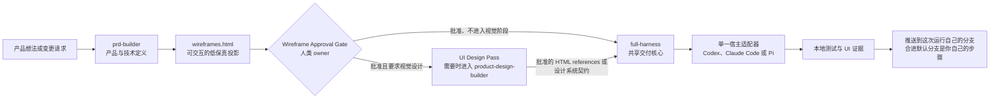
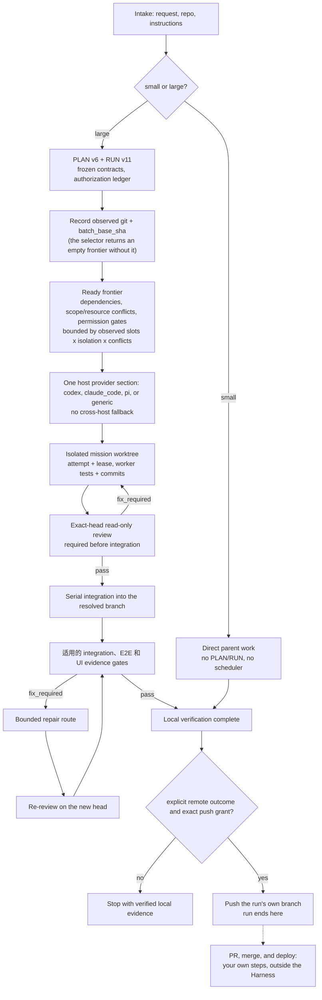

<p align="center">
  
</p>

<p align="center">
  <a href="README.md">English</a> | <a href="README.zh-TW.md">繁體中文</a> | <strong>简体中文</strong>
</p>

<p align="center">
  <a href="https://github.com/Phlegonlabs/fullstack-goal-dev/actions/workflows/harness-ci.yml"></a>
  
  
  
  
</p>

# Full Stack Harness

私有技能市场，用于借助 Codex、Claude Code 或 Pi 把产品想法或变更需求变成一条经过验证的交付流程。

它不是提示词集合。这个插件把产品定义、视觉设计和工程执行拆开，让每个阶段都有单一事实源、清晰的交接边界，以及自己的验证方式。

> 定义产品。把设计做具体。只执行已就绪的工作。每次移交前，都验证实际结果。

## 从这里开始

| 你目前有什么 | 从哪个技能开始 | 会得到什么 |
| --- | --- | --- |
| 一个产品想法 | `prd-builder` | 需求、UI 产品的低保真交互线框图、架构、技术栈决策、发布目标、测试义务，以及带来源的市场调研 |
| 已批准线框图、需要视觉设计的包 | `prd-builder` UI Design Pass；gate 判定为 required 时再进入 `product-design-builder` + `frontend-design` | 批准的视觉方向——在 web 上是保留于 `docs/design/ui-references/` 的高保真 HTML references——以及需要时有约束力的设计系统契约 |
| 现有仓库中的明确变更 | `full-harness` | 小型工作直接实现；大型工作进入受管的 PLAN/RUN 流程 |

这些技能可以单独使用。不是每个任务都要运行整条流程。

## 核心保证

- **小型工作保持精简。** 一个有界变更只走检查、实现、验证和审查。
- **大型工作明确记录。** PLAN v6 定义 typed graph；RUN v11 记录授权、尝试和证据。
- **产品定义止于人工关卡。** UI 产品以一份可交互的低保真 `wireframes.html` 收尾，由 owner 批准；视觉设计和实现只在明确要求后继续。
- **视觉目标是真正的 HTML。** 被要求的 web 视觉阶段会用已加载的设计技能产出高保真 HTML，把批准的 references 保留在 `docs/design/ui-references/`，被取代的组合归档而非删除；Harness 按每页批准的 HTML reference 实现。
- **工作节点彼此隔离。** 写入任务使用独立工作树和有界范围；父级会验证每个返回的提交和差异。
- **有能力不等于有权限。** 即使运行时能够推送或清理，每个动作仍需要精确授权。
- **证据跟随 SHA。** 新的提交会让旧 head 的门禁和 UI 证据失效。
- **默认只在本地完成。** Harness 负责提交并验证本地结果；只有明确的远程意图才会授权推送这次运行自己的分支。把它合进默认分支是你自己的步骤。

## 包含哪些内容

| 技能 | 适用场景 | 主要产出 |
| --- | --- | --- |
| `prd-builder` | 产品探索、需求、Builder UX Direction 输入、UI 产品的低保真交互线框图、架构、技术栈决策、发布目标、测试义务、草稿完成后的市场调研补缺，以及 web 路线会产出保留高保真 HTML references 的可选 UI Design Pass | `PRD.md`、`wireframes.html`（UI 产品）、`architecture.md`、`stack-decisions.md`、`market-research.md` |
| `product-design-builder` | 将已批准的 UI Design Handoff 编译成冻结的设计系统契约。它必须加载独立的 `frontend-design` 技能；依赖不可用时会停止。 | `design-system.md`、`design-system.json` |
| `full-harness` | 共享的规模判定、PLAN/RUN、授权、本地验证和集成，外加 runtime adapter 参考文档（`references/runtime-adapters.md`）：一份共享契约，加上每个宿主（Codex、Claude Code、Pi 或 generic）各一段 provider 章节 | 直接完成的工作，或 `PLAN.md` + `RUN.md` |

交付核心在调用托管编排之前，会先做一个规模判定：

- 小型工作保持直接完成，默认不启用规划器、调度器、PLAN/RUN、子代理或外部运行时预检。
- 大型工作进入托管规划。它可以用 `PLAN.md` 和 `RUN.md` 完成一次受管顺序交付，或者处理多个任务并实现可持久的移交；`tasks.md` 只是按需生成的人类视图，不是必需状态。
- 选择器会在实际选中的安全写入 mission 少于两个时派生 `managed_sequential`，达到两个或更多时派生 `parallel_graph`。只有后者才启用调度器扇出；runtime driver 仍是独立的传输事实。核心只套用 runtime adapter 参考文档中对应所检测宿主的那一个 provider 章节；只有当选定的路线需要外部运行时，才会对其做预检。
- 工作不需要等待远程 CI。运行通常以验证过的本地证据结束；只有明确的远程结果才会把验证过的集成 head 推送到这次运行自己的分支。

规模指的是协调范围和影响面，而不是原始的文件数或行数。如果小型工作变大，Harness 会保留已完成的工作，只对剩余部分做规划。

## 系统如何协同



你可以从任意阶段起步。比如，单独用 Harness 去修复一个已有的应用。各技能职责分离：`prd-builder` 定义产品并止于批准的 `wireframes.html`，可选的 UI Design Pass 与 `product-design-builder` 定义视觉契约——在 web 上，pass 会把批准的高保真 HTML references 留在 `docs/design/ui-references/<run-id>/`，被取代的组合移入 `docs/design/archived/`——Harness 实现已冻结的结果。

## 交付模型

Harness 是围绕明确的边界构建的：

1. 检查当前项目，识别需要完成的工作。
2. 冻结相关的契约、来源、范围和验证步骤。
3. 当任务大到需要时，在动手实现之前先规划依赖关系。
4. 只有当至少两个安全写入 mission 实际被选中、工作彼此独立且相互隔离，并且每个动作都获得明确授权时，才使用并行工作节点；受管顺序路线仍要证明隔离 writer、scope/head 和 review gates。
5. 验证任务结果、集成、相关的 UI 流程，以及最终的差异（diff）。单 mission 不会凭空增加跨 mission batch gate。
6. 默认带着验证过的本地证据停下。如果明确要求远程结果，只有在明确远程意图以及精确的分支/head 推送授权下，才推送这次运行自己的分支。开 PR、合并和部署都是你在 Harness 之外自己做的步骤。

对于有计划支撑的工作，它会记录任务范围、依赖关系、工作节点归属、验证命令，以及针对具体动作的授权。一次测试通过并不等于授权推送、移除工作树或删除分支。RUN-v11 的推送还需要明确的远程意图、唯一的集成分支目标和当前 head 授权；如果默认分支身份未知，推送会安全失败，但不会阻止无关的本地执行。




## 轻量的运行时适配器

共享核心掌管唯一的 PLAN/RUN 控制平面。运行时相关的启动细节放在同一份参考文档 —— `full-harness/references/runtime-adapters.md` —— 内含一份共享适配契约，加上每个宿主一段 provider 章节，按需套用：

- 每个宿主只套用自己的 provider 章节，并且只执行 `allowed_providers` 包含该宿主的 PLAN 节点。
- Pi 宿主沿用 Pi 已安装的角色、模型和回退设置。
- 任何 provider 章节都不能调用另一个运行时。一个已就绪、但其提供方与当前宿主不匹配的节点，会被 deferred with `runtime_unavailable`，留给由匹配宿主托管的运行去处理。
- 以后新增一个运行时宿主，只是在这份参考文档加一段 provider 章节，不需要新增 skill。

共享的脚本、schema、参考文档和模板仍然放在 `full-harness` 下；各 provider 章节链接到它们，而不是各自附带一套重复的运行时。这样能让默认提示词保持精简。

一次运行只有一个 active host。same-repository handoff 只有在 Host A 关闭 wave、且 `RUN.active_wave.status` 既不是 `active` 也不是 `proposed` 后才允许；`active_wave` 对象仍保留在 RUN 中，不能把对象缺失当作交接信号：Host B 保留 PLAN/RUN 和 graph state，重新探测 runtime，并在选取下一波前审查当前 exact SHA。若需修复，路由回 Host A 且旧 review 立即失效；除非未来 schema 增加可携带的仓库/状态身份，否则不支持 cross-machine handoff。

## 图工程与动态工作流

这些技能使用两层图：

- **组织图（org graph）** 是稳定的角色契约：产品、架构、UX、设计系统、任务工作节点、审查者、审批、集成和生命周期职责。
- **工作图（work graph）** 是单次运行的临时任务图。只有当宿主能够强制执行 `builder_readonly` 工具画像时，PRD 和设计工作流才会使用有界的分析图；否则它们退回到顺序执行的父级。工程部分使用规范的 PLAN v6 图和 RUN v11 状态。

访谈和审批保持在运行中的工作流之外，因为 Claude Code 的动态工作流无法在运行途中征询用户输入。父级先冻结输入，运行一个有界的工作流，再自行负责分阶段写入、冲突解决、审批和发布。

对于工程部分，Harness 会在创建或申请工作树之前，先验证并选出依赖已就绪的前沿（frontier）。原生 Claude 任务使用 `.claude/worktrees/` 下父级托管的工作树，把每个工作节点绑定到精确的批次基点，并要求在访问仓库前先执行 `EnterWorktree`。在每一条路线中，父级都会验证返回的提交和实际的 Git 差异，串行地集成被接受的提交，并重新计算图的前沿。

Claude Graph Workflow 会把 mixed frontier 按 homogeneous `tool_profile` 分成多个调用；同一组内可以使用不同模型和推理强度，但一次调用绝不混合写入 mission 与只读 review。tool profile 是标签和 prompt/result 契约，不是 permission-level tool removal。

- `mission_write` 要求 `EnterWorktree` 和 mission 的有界写入契约。
- `code_review_readonly` 要求精确路径审查和只读结果证据；它不会移除继承的工具。
- `visual_review_readonly` 使用宿主继承的工具审查保留下来的截图或其他既有证据；新增浏览器访问必须先审核并加入画像契约后才能使用。

当 Claude Code 返回真实的工作流运行 ID 时，RUN 状态可以保留工作流/任务 ID、脚本摘要、节点分组、图/基点绑定、工具画像、状态和可用指标。同会话续跑可以复用该绑定；跨会话恢复则从规范的 PLAN/RUN 状态开启一次新的工作流尝试。

图节点的 `allowed_providers` 必须包含真正在运行 Harness 的宿主，该节点才能被选中。Codex、Claude Code 和 Pi 不能互相委派节点；它们之间没有跨宿主桥接。一个已就绪、但其提供方与当前宿主不匹配的节点，会被 deferred with `runtime_unavailable`，留给由匹配适配器托管的运行去处理。

## 安装

这是一个私有的 GitHub 市场。你需要具备对 `Phlegonlabs/fullstack-goal-dev` 的访问权限、完成 GitHub CLI 认证，并且至少安装一个受支持的宿主：Codex、Claude Code 或 Pi。

```bash
gh auth login
gh auth setup-git
git ls-remote https://github.com/Phlegonlabs/fullstack-goal-dev.git HEAD
```

### 最快安装方式

```powershell
git clone https://github.com/Phlegonlabs/fullstack-goal-dev.git
Set-Location .\fullstack-goal-dev
powershell -File .\scripts\update-private-skills.ps1
```

克隆只是为了拿到这个脚本。更新脚本始终从 GitHub 安装（默认是 `Phlegonlabs/fullstack-goal-dev` 的 `main`），它不会读取你当前的工作目录。用这种方式装不上本地改动；要测试本地改动，请看下文「开发时使用本地检出」。

然后打开新的 Codex 任务、重新加载 Claude Code，或启动新的 Pi 会话。确认 package 已出现在列表中：

```powershell
codex plugin list
claude plugin list
pi list
```

### Zero-to-one 流程（从零开始）

1. 安装一个受支持的宿主（Codex、Claude Code 或 Pi）和本插件，并用该宿主运行本次交付。
2. 开启新的宿主会话，确认插件可见，然后调用 `$full-harness`。
3. 让规模闸决定直接工作还是 PLAN/RUN；小型工作不要预先创建工作节点。
4. 大型运行一次只保留一个 active host，并在 same-repository handoff 前关闭和审查每个 wave。

### 一条命令完成更新

共享更新脚本会检测 Codex、Claude Code 和 Pi，添加或更新市场／package，并保留无关的 runtime 设置。这个仓库更新后，重新运行同一条命令即可。只有明确要更新宿主本身时才加入 `-UpdateHostRuntimes`。如果旧的 standalone Pi Harness skill 遮蔽 package，可加入 `-ReplacePiStandaloneSkills`；它只备份并替换具名的 Harness skill 目录。

装有 PowerShell 7（`pwsh`）的 Windows：

```powershell
Set-Location .\fullstack-goal-dev
pwsh -File .\scripts\update-private-skills.ps1
```

`pwsh` 需要单独安装。Windows 自带的 Windows PowerShell 5.1 同样能运行这个脚本：

```powershell
Set-Location .\fullstack-goal-dev
powershell -File .\scripts\update-private-skills.ps1
```

装有 PowerShell 7 的 macOS 或 Linux shell：

```bash
cd fullstack-goal-dev
pwsh -File ./scripts/update-private-skills.ps1
```

更新后请开一个新的 Codex 任务、重新加载或重启 Claude Code，并启动新的 Pi 会话。现有会话不会热加载已变更的 runtime 或 Harness release。

### 直接在 Codex 中安装

```bash
codex plugin marketplace add Phlegonlabs/fullstack-goal-dev --ref main
codex plugin add fullstack-harness@fullstack-goal-dev
codex plugin list
```

### 直接在 Claude Code 中安装

```bash
claude plugin marketplace add Phlegonlabs/fullstack-goal-dev --scope user
claude plugin install fullstack-harness@fullstack-goal-dev --scope user
claude plugin list
```

插件安装完成后，运行 `/reload-plugins` 或重启 Claude Code。

### 直接在 Pi 中安装

```bash
pi install git:github.com/Phlegonlabs/fullstack-goal-dev@main --no-approve
pi list --no-approve
```

安装或更新后请启动新的 Pi 会话。`~/.pi/agent/skills` 中现有的 standalone skill 属于用户数据，绝不会被静默移除。

### 开发时使用本地检出

在本仓库中测试改动时，使用本地市场。不要同时以相同名称注册本地市场和 GitHub 市场。

```powershell
$repo = (Resolve-Path .).Path
codex plugin marketplace add $repo
codex plugin add fullstack-harness@fullstack-goal-dev
claude plugin marketplace add $repo --scope user
claude plugin install fullstack-harness@fullstack-goal-dev --scope user
```

## 常见提示词

Codex 接受下面的 `$skill-name` 形式。在 Claude Code 中，调用已安装的带命名空间的技能，例如 `/fullstack-harness:prd-builder`，或者按名称请求它。在 Pi 中，可以使用自动发现的项目技能，或通过 `--skill` 传入技能目录，然后按名称请求 `full-harness`。

```text
Use $prd-builder to turn this idea into a PRD, interactive low-fidelity wireframes for every page, architecture, stack decisions, release targets, and test obligations.
```

```text
Use $prd-builder to review the staged wireframes.html with me and record the Wireframe Approval decision before any visual or implementation work.
```

```text
The wireframes are approved; continue into visual design with $prd-builder's UI Design Pass. Render the web previews as high-fidelity HTML and retain the approved references under docs/design/ui-references/, invoking $product-design-builder only when the Design System Need Gate is required.
```

```text
Use $full-harness to implement the approved plan, building each page from its approved HTML reference in docs/design/ui-references/ within the recorded tolerance.
```

```text
Use $full-harness to review the existing app, plan the required work, and stop before implementation.
```

```text
Use $full-harness to implement the approved plan. Create a branch and commit the verified change, but do not push or open a PR.
```

```text
Use $full-harness to implement this plan and push the verified branch. I will open the PR and handle the merge myself.
```

```text
Use full-harness on this Pi host to execute this plan. Preserve Pi's installed frontend_designer, worker, reviewer, model, and fallback settings.
```

对于多任务交付，请在请求中写清预期的本地和远程结果。分支创建、提交、集成、仓库设置、推送、移除工作树和删除分支都是彼此独立的动作。Harness 不会开 PR、不会合并、也不会部署——这些步骤由你自己完成。

## Codex、Claude Code 与 Pi 执行

Harness 记录的是实际的运行时能力，而不是从已安装的 CLI 去假定一个。

| 运行时 | 首选并行路线 | 回退方案 |
| --- | --- | --- |
| Codex 应用 | 在隔离的、应用托管的工作树中运行应用任务 | 直接子代理，然后退到单一顺序父级 |
| Claude Code | 采用精确基点、父级托管的 `.claude/worktrees/` 工作树的动态工作流 | 直接子代理，然后退到单一顺序父级 |
| Pi | 在父级托管工作树中使用已安装的 Pi 角色，并由 Pi 选择模型和回退方案 | 单一顺序父级 |
| 其他任何宿主 | 父级隔离的全新子代理 | 单一顺序父级 |

在 Codex 中，每个选中的 mission 都会在左侧栏打开一个独立的顶层会话，并绑定自己的应用托管 worktree。任何只读 explorer 或 reviewer 都由 Harness parent 另行作为同级节点派发；mission 任务不能创建子代理。协调器直接创建的子代理不能替代这些顶层任务。如果 project/thread 工具一开始尚未加载，适配器会先从当前 Codex 工具界面中找到它们，再考虑回退路线。当用户明确要求这种结构时，缺少 thread 能力就是 blocker，不能把工作缩回同一个会话。

目标仓库自己的分支规则优先。当仓库没有定义其他流程时，mission 工作树从当前默认分支的 SHA 开始，在绑定当前 head 的只读审查通过后集成进这次运行自己的分支。运行默认以验证过的本地结果完成；只有明确远程结果并取得精确分支/head 授权后才推送该分支。把它合进默认分支是你自己的步骤。如果有修复，必须对新 head 重新审查。

每个 provider 章节只运行其允许提供方包含自身宿主的 PLAN 节点；不存在跨宿主路线。需要其他宿主提供方的节点会被 deferred with `runtime_unavailable`，而不会在这里执行。

并行实现默认没有一个小的固定上限；配置的写入工作节点上限设得足够高，实际的波宽由观察到的工作节点槽位、隔离容量，以及依赖已就绪、无冲突的前沿大小限定。一个可独立验证的目标对应一个 mission。每个写入节点都有明确的文件 ownership 和独立、干净、固定基线的 worktree。共享 API、schema 和类型必须先冻结，再开始依赖它们的并行写入。探索、写入和评审节点都由 parent 作为同级节点派发；工作节点和评审节点都不能再次分派。每个 mission 通过 exact-head 评审后，由 parent 串行整合；统一整合完成后再启动 fresh reviewers，最后只对固定候选 SHA 运行一次完整验证。工作节点绝不编辑父级的 `PLAN.md` 或 `RUN.md`，也不推送、开 PR、合并、部署或删除 worktree。集成以及每一个落地或生命周期动作都由父级负责。

## 仓库结构

```text
.agents/skills/                                      规范的技能源
plugins/fullstack-harness/skills/                    生成的插件副本；请勿直接编辑
plugins/fullstack-harness/.claude-plugin/plugin.json Claude Code 插件清单
plugins/fullstack-harness/.codex-plugin/plugin.json  Codex 插件清单
.agents/plugins/marketplace.json                     Codex 市场定义
.claude-plugin/marketplace.json                      Claude Code 市场定义
assets/                                              README 封面
scripts/sync_plugin_skills.py                        把规范技能复制到插件包
scripts/update-private-skills.ps1                    更新 Codex、Claude Code 和 Pi package；宿主更新需明确开启
.github/workflows/harness-ci.yml                     契约、单元和 E2E 检查
```

## 维护市场

只编辑 `.agents/skills/` 中的规范源，然后同步并校验生成的插件包。

```bash
python scripts/sync_plugin_skills.py
python scripts/sync_plugin_skills.py --check
python -m unittest discover -s .agents/skills/full-harness/scripts/tests -v
python -m unittest discover -s .agents/skills/prd-builder/scripts/tests -v
python -m unittest discover -s .agents/skills/product-design-builder/scripts/tests -v
python -m unittest discover -s plugins/fullstack-harness/skills/full-harness/scripts/tests -p "test_packaged_*.py" -v
git diff --check
```

发布前，请在两个插件清单和 `.claude-plugin/marketplace.json` 中更新一致的版本号，检查整个 diff，并走仓库的 PR 流程。不要直接推送到 `main`。

## 安全与数据安全

- 不要把 GitHub 令牌和其他凭据留在本仓库中。
- 更新脚本使用你现有的 GitHub CLI 会话；它不会在项目中存储令牌。
- 在确认插件能正确加载之前，不要删除旧的独立技能副本。
- 编排技能对每一个改变状态的 GitHub 或生命周期动作都要求明确授权。

## 版本历史

每次发布都要更新本节，同时完成上文所述的版本号提升。

- **0.16.0** — PRD 流程在发布时种入新 `AGENTS.md`，现在会顺势把 Skill Bindings 表填满：列出该 session 看得到的本地已安装 skills 作为各槽位候选、owner 用一个问题确认绑定、没有候选的槽位留在随附默认。既有的 `AGENTS.md` 绝不为此重开——绑定更新本身是一次明确的编辑。
- **0.15.0** — Skill 选择改为项目设置而非修改 harness：种入的 `AGENTS.md` 新增 Skill Bindings 表，把阶段槽位（design_direction、design_compilation、frontend_implementation）绑到安装的 skills，随附 skills 为默认。PRD 的 UI Design Pass 与 harness 的 UI 契约都从绑定表解析——采用新的 taste 或 frontend skill 只需改项目里的一张表，绑定的 skill 继承相同的模式、冻结来源与 review 闸门。
- **0.14.0** — PRD 流程现在会种入两份 root 文档：`DEPLOYMENT.md`（平台纪录、git connection 与 Cloudflare/Vercel/AWS 接线的人工设定清单、环境状态表）和 `DOCUMENTS.md`（全流程文档总清单：位置、拥有者、是否 canonical）。`TASKS.md` 在 run 开始与每次接受 wave 后于 root 渲染。root 放运营文档；PRD 家族留在 `docs/product/`。
- **0.13.0** — 新增 deployment 契约：git-connected、平台抽象的部署阶段——preview 绑 run 分支、production 绑默认分支（main 即 production），各平台一段（cloudflare、vercel、aws、generic，任何小写 id 皆可）、绑定部署 SHA 的只读部署后验证、只改纪录不改流程的迁移路径，并在项目 `AGENTS.md`/`CLAUDE.md` 种入 Deployment 段落。12-key ledger 不变；部署不新增任何授权键。
- **0.12.1** — runtime 升级闸新增重新编排契约：更新后，新的 session 执行 Resume Reconciliation、重新推导 frontier，并以新的 attempt 把所有未完成的节点绑到新 runtime（已完成节点永不重跑）；更换 provider 必须通过明确的 `allowed_providers` replan，绝不由升级自行推断。
- **0.12.0** — integration review 的 skip 改以字节相同的 tree 为准，不再限于同一个 commit：单一 mission 的 wave 以 merge commit 集成、tree 与已通过的 review 相同时，记录 `integration.integration_tree_sha` 与 `review_workers[].tree_sha` 并跳过 unified dispatch。仍需派遣时，unified reviewer 拿到接缝导向的 packet：列出各 mission 已审 head，聚焦 merge 接缝、冲突解算与跨 mission 交互。
- **0.11.0** — Provider id 开放：任何小写 id（市场 runtime 如 `gemini_cli`、`cursor`）在 `allowed_providers` 与 RUN `runtime_adapter` 都是 schema 合法值，直接走 generic 路线与 driver ladder，不需要改 schema；专属 section 与 `RUNTIME_DRIVER_PRIORITY` 条目降为可选优化。generic 章节的市场 host 名称为示意，非支持清单。
- **0.10.1** — generic provider 章节补成完整路线，任何未命名的 agent 宿主都能直接执行（驱动选择、版本闸、模型传递、context 探索、chrome_devtools 递延）；市集与 README 的对外描述改为适配任何 coding agent，而非只列三个命名运行时。
- **0.10.0** — 三个运行时适配器 skill 合并为一份共享参考文档 `full-harness/references/runtime-adapters.md`，每个 provider 一段章节并附新增 provider 的步骤；`fullstack-harness-codex`、`fullstack-harness-claude-code`、`fullstack-harness-pi` 从 bundle 移除（破坏性变更）。review 可声明 required tools，RUN 在 `runtime_capabilities.reviewer_tools` 记录逐工具的 reviewer probe 证据，selector 对未探测或不可用的工具改为 defer，不以父级浏览器代替。mission 需通过内聚门禁，每个 task 对应一个有序的原子提交边界。
- **0.9.0** — UI Design Pass 的 web 预览路线改为默认由设计技能产出高保真 HTML。批准的 HTML references 保留在 `docs/design/ui-references/<run-id>/`，被取代的组合归档到 `docs/design/archived/`；target-conformance 实现按每页批准的 HTML reference 进行，并逐文件冻结 hash。
- **0.8.0** — 为 prd-builder 加入线框图阶段：每个 UI 产品包都会把 UI surface contract 投影成单一自包含的可交互 wireframes.html，并经人工 Wireframe Approval Gate 批准；视觉设计改为独立、需明确要求的阶段（UI Design Pass、provider 中立的 preview gate、Design System Need Gate）。product-design-builder 只编译已批准的 UI Design Handoff。同时修复 design-system pair 检查命令路径、统一线框批准词汇、让 sync --check 忽略 runtime bytecode，并在 CI 加入 git diff --check。
- **0.7.0** — 将 managed work 升级为 PLAN v6 / RUN v11：加入 durable pause/cancel、跨 revision review lineage 与 owner grant、仅含协调文件提交时不会失效的 candidate head、loaded/installed contract digest、受控状态转移命令，以及有界 review packet。
- **0.6.0** — 为 Codex、Claude Code 和 Pi 加入共享 runtime upgrade gate。RUN-v10 会记录宿主／Harness 版本，只允许已启动且仍兼容的旧版 wave 运行到安全边界，阻止不兼容或等待重启的会话，并在更新和重新 probe 后用新的 attempt 继续未完成工作。更新脚本现在支持 Pi package；宿主 binary 更新与 standalone Pi skill migration 仍需明确开启。
- **0.5.0** — 降低 Codex、Claude Code 和 Pi 的 managed-run 开销：加入有界 fresh context、event-driven completion、active-wave 流式 review、资源安全的并行 verifier batch、exact session cache、effort routing、更小的 task slice，以及 RUN-v10 runtime telemetry。测量目标为 wall time 至少降低 75%，stretch target 为 85%；授权和 exact-SHA gate 保持不变。
- **0.4.0** — 新增仓库内设计图片发现，并把 Impeccable concept generation 接入 Product Design Builder 的 visual-direction gate。Creation mode 现在要求 `product-design-builder`、`impeccable` 和 `frontend-design`，同时保留现有 PRD 与三文件设计 package 作为唯一正式的产品与设计来源。
- **0.3.0** — 移除 GitHub 落地适配器和整套部署/发布模型。Harness 现在到「推送本次运行自己的分支」为止；把分支合进默认分支是用户自己的步骤。授权账本从 19 个动作缩到 12 个；`landing` 精简为 `mode`、`remote`、`pushed_head_sha`、`continuity`；`integration.branch` 是唯一的分支字段。移除分支保护证据、`target_sources`、三个契约标记、`post_merge_cleanup`、`plan.release` 和 `run.targets`。
- **0.2.0** — 默认每个任务一个工作树；带多审查者扇出的 PLAN v5 / RUN v10 类型化图；Cloudflare 派发式部署（dispatched-deploy）和自动部署（Auto-Deploy，即原生 Git 自动部署）发布模型；持久化的集成分支；用通用的逐页 HTML 原型取代已下线的页面 UI 矩阵；移动端/桌面端平台支持，包含一份专门的移动端技术栈选型指南（原生 iOS/Android、Flutter、React Native/Expo）；通过 `.env.example` 生成环境密钥脚手架；为有界/机械式委派工作提供的 Haiku 成本档位。
