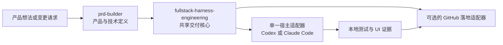
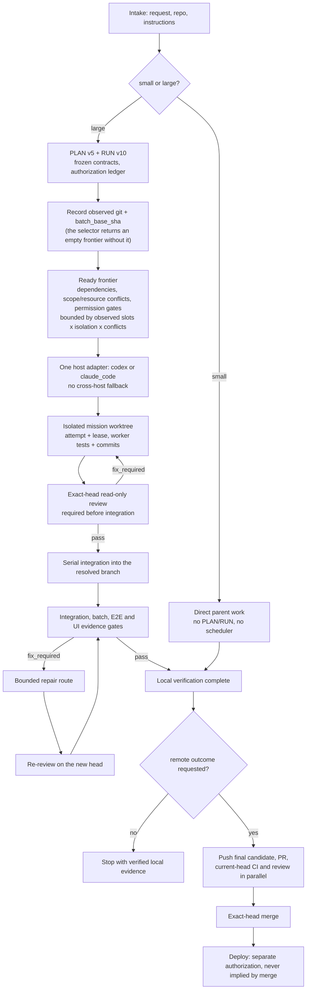

<p align="center">
  
</p>

<p align="center">
  <a href="README.md">English</a> | <a href="README.zh-TW.md">繁體中文</a> | <strong>简体中文</strong>
</p>

<p align="center">
  <a href="https://github.com/Phlegonlabs/fullstack-goal-dev/actions/workflows/harness-ci.yml"></a>
  
  
  
  
</p>

# Full Stack Harness

私有技能市场，用于借助 Codex 或 Claude Code 把产品想法或变更需求变成一条经过验证的交付流程。

它不是提示词集合。这个插件把产品定义、视觉设计、工程执行和 GitHub 落地拆开，让每个阶段都有单一事实源、清晰的交接边界，以及自己的验证方式。

> 定义产品。把设计做具体。只执行已就绪的工作。每次移交前，都验证实际结果。

## 从这里开始

| 你目前有什么 | 从哪个技能开始 | 会得到什么 |
| --- | --- | --- |
| 一个产品想法 | `prd-builder` | 需求、架构、技术栈决策、线框图、带来源的市场调研，以及设计系统 |
| 现有仓库中的明确变更 | `fullstack-harness-engineering` | 小型工作直接实现；大型工作进入受管的 PLAN/RUN 流程 |
| 已验证、需要送上 GitHub 的本地候选版本 | `fullstack-harness-github-landing` | 绑定当前 head 的推送、PR、CI/审查收敛和精确合并 |

这些技能可以单独使用。不是每个任务都要运行整条流程。

## 核心保证

- **小型工作保持精简。** 一个有界变更只走检查、实现、验证和审查。
- **大型工作明确记录。** PLAN v5 定义 typed graph；RUN v10 记录授权、尝试、证据和落地状态。
- **工作节点彼此隔离。** 写入任务使用独立工作树和有界范围；父级会验证每个返回的提交和差异。
- **有能力不等于有权限。** 即使运行时能够推送、合并、部署或清理，每个动作仍需要精确授权。
- **证据跟随 SHA。** 新的推送会让旧 head 的 CI、审查、部署和 UI 证据失效。
- **部署是独立生命周期。** 开发与生产环境使用分离的数据、密钥、认证、支付模式和验证。

## 包含哪些内容

| 技能 | 适用场景 | 主要产出 |
| --- | --- | --- |
| `prd-builder` | 产品探索、需求、架构、前端技术栈决策、低保真线框图、草稿完成后的市场调研补缺，以及设计系统：设计令牌、封闭变体集的基元契约、产品组件、动效规则和状态矩阵 | `PRD.md`、`architecture.md`、`stack-decisions.md`、`wireframes.md`、`market-research.md`、`design-system.md`、`design-system.json` |
| `fullstack-harness-engineering` | 共享的规模判定、PLAN/RUN、授权、本地验证和集成 | 直接完成的工作、`RUN.md`，或 `PLAN.md` + `RUN.md` |
| `fullstack-harness-codex` | 左侧栏中的独立 Codex 任务、每个 mission 一个应用托管的工作树，以及各任务自己的只读 Multi-agent 辅助 | 运行时启动指令和工作节点结果 |
| `fullstack-harness-claude-code` | Claude 动态工作流（Dynamic Workflow）和父级托管的工作树 | 运行时启动指令和工作节点结果 |
| `fullstack-harness-github-landing` | 终态提交推送、PR、并发的 CI/审查，以及精确到提交点的合并 | 远程落地证据 |

交付核心在调用托管编排之前，会先做一个规模判定：

- 小型工作保持直接完成，默认不启用规划器、调度器、PLAN/RUN、子代理或外部运行时预检。
- 大型工作进入托管规划。它可以用 `RUN.md` 完成一次顺序交付，或者用 `PLAN.md` 和 `RUN.md` 处理多个任务并实现可持久的移交。
- 只有当一个大型计划中至少有两个彼此独立、可立即执行的任务时，调度器才会开始扇出。此时核心只加载一个宿主适配器；只有当选定的路线需要外部运行时，才会对其做预检。
- 本地的实现、分支和提交工作不会加载 GitHub 适配器，也不会等待远程 CI。拉取请求（PR）交付会推送最终验证通过的候选版本，并对同一提交点的 CI 和 Codex 审查并发评估。

规模指的是协调范围和影响面，而不是原始的文件数或行数。如果小型工作变大，Harness 会保留已完成的工作，只对剩余部分做规划。

## 系统如何协同



你可以从任意阶段起步。比如，单独用 Harness 去修复一个已有的应用，或者在 PRD 已存在时使用设计技能。这些技能各自的职责保持分离：PRD 技能不会自己发明一套设计系统，设计技能也不会去写交付计划。

## 交付模型

Harness 是围绕明确的边界构建的：

1. 检查当前项目，识别需要完成的工作。
2. 冻结相关的契约、来源、范围和验证步骤。
3. 当任务大到需要时，在动手实现之前先规划依赖关系。
4. 只有当工作彼此独立、相互隔离且获得明确授权时，才使用并行工作节点。
5. 验证任务结果、集成、相关的 UI 流程，以及最终的差异（diff）。
6. 默认在本地停下，除非明确要求远程结果；届时才通过仓库的 PR 流程落地，并且每一个 GitHub 动作都需要单独授权。

对于有计划支撑的工作，它会记录任务范围、依赖关系、工作节点归属、验证命令，以及针对具体动作的授权。一次测试通过并不等于授权推送、开 PR、执行审查动作、合并、部署或清理。

<p align="center">
  
</p>

<p align="center"><sub>流程示意图，保留作为概览。这张图早于当前的 schema，上面写的是 PLAN v4／RUN v9，实际请用 PLAN v5／RUN v10；图中也漏了每次集成前都必须通过的 exact-head review，而且 wave 没有固定上限。下方才是当前的流程。</sub></p>




## 轻量的运行时与落地适配器

共享核心掌管唯一的 PLAN/RUN 控制平面。运行时相关的启动细节按需惰性加载：

- Codex 宿主只加载 `fullstack-harness-codex`，并且只执行 `codex` 提供方的 PLAN 节点。
- Claude Code 宿主只加载 `fullstack-harness-claude-code`，并且只执行 `claude_code` 提供方的 PLAN 节点。
- 两个适配器都不能调用另一个运行时。一个已就绪、但其提供方与当前宿主不匹配的节点，会被报告为“因提供方不匹配而阻塞”，留给由匹配适配器托管的运行去处理。
- 只有在明确需要推送、PR、CI、审查、合并或仓库配置这类结果时，才会加载 `fullstack-harness-github-landing`。

共享的脚本、schema、参考文档和模板仍然放在 `fullstack-harness-engineering` 下；各适配器链接到它们，而不是各自附带一套重复的运行时。这样能让默认提示词保持精简，并避免在纯本地工作时进行远程验证。

对于远程交付，最终的本地候选版本只推送一次。GitHub Actions 和 Codex 审查会作为同一个 PR 提交点上的并列门禁被启动或观察，并被并发轮询。一次新的推送会使二者同时失效，合并仍然要求二者在同一个 SHA 上都通过。

## 图工程与动态工作流

这些技能使用两层图：

- **组织图（org graph）** 是稳定的角色契约：产品、架构、UX、设计系统、任务工作节点、审查者、审批、集成和生命周期职责。
- **工作图（work graph）** 是单次运行的临时任务图。只有当宿主能够强制执行 `builder_readonly` 工具画像时，PRD 和设计工作流才会使用有界的分析图；否则它们退回到顺序执行的父级。工程部分使用规范的 PLAN v5 图和 RUN v10 状态。

访谈和审批保持在运行中的工作流之外，因为 Claude Code 的动态工作流无法在运行途中征询用户输入。父级先冻结输入，运行一个有界的工作流，再自行负责分阶段写入、冲突解决、审批和发布。

对于工程部分，Harness 会在创建或申请工作树之前，先验证并选出依赖已就绪的前沿（frontier）。原生 Claude 任务使用 `.claude/worktrees/` 下父级托管的工作树，把每个工作节点绑定到精确的批次基点，并要求在访问仓库前先执行 `EnterWorktree`。在每一条路线中，父级都会验证返回的提交和实际的 Git 差异，串行地集成被接受的提交，并重新计算图的前沿。

Claude 的批次波（wave）按模型、推理强度和工具画像区分开：

- `mission_write` 包含 `EnterWorktree` 和有界的写入工具。
- `code_review_readonly` 不含任何具备写入能力的工具。
- `visual_review_readonly` 使用精确的读取/搜索白名单，审查保留下来的截图或其他既有证据。任何新的浏览器工具都必须先经过审核并加入画像后才能使用。

当 Claude Code 返回真实的工作流运行 ID 时，RUN 状态可以保留工作流/任务 ID、脚本摘要、节点分组、图/基点绑定、工具画像、状态和可用指标。同会话续跑可以复用该绑定；跨会话恢复则从规范的 PLAN/RUN 状态开启一次新的工作流尝试。

图节点的 `allowed_providers` 必须包含真正在运行 Harness 的宿主，该节点才能被选中。Claude Code 不能把节点委派给 Codex，Codex 也不能把节点委派给 Claude Code；两者之间没有跨宿主桥接。一个已就绪、但其提供方与当前宿主不匹配的节点，会被记录为“因提供方不匹配而阻塞”，留给由匹配适配器托管的运行去处理。

## 发布与部署安全

交付图把部署视为一级且需要独立授权的生命周期：

- 可部署产品会在计划中记录提供方、目标环境、命令、迁移、前置条件和部署后检查。
- Cloudflare 项目使用同一份代码库，但 `development` 与 `production` Worker 完全分离；D1、KV、R2、queue、Durable Object、密钥、认证、支付模式、路由和 webhook 也按环境设置。
- 默认 Cloudflare 模型使用绑定精确 SHA 的 GitHub Actions 调度。开发环境绑定已审查的 `development` head；生产环境绑定用户审批升版后产生的 `production` head。
- 可选的 Cloudflare Workers Builds 模型可以把持久的 `development` 和受保护的 `production` 分支自动部署到对应 Worker。只有明确选择时才启用，也不会与调度模型混用。
- 第一天引导只创建已确认需要的环境资源和 Worker 外壳。真正部署功能代码仍需要目标环境专属授权。
- `docs/deployment.md` 保存供维护者阅读的拓扑与设置；RUN 仍是机器可读的执行记录。
- 移动端和桌面端交付同样分离 development/beta 与 production 的凭据、后端、商店轨道和发布证据，不会强套 Cloudflare 格式。

## 安装

这是一个私有的 GitHub 市场。你需要具备对 `Phlegonlabs/fullstack-goal-dev` 的访问权限、完成 GitHub CLI 认证，并且安装了 Codex、Claude Code，或两者。

```bash
gh auth login
gh auth setup-git
git ls-remote https://github.com/Phlegonlabs/fullstack-goal-dev.git HEAD
```

### 最快安装方式

```powershell
git clone https://github.com/Phlegonlabs/fullstack-goal-dev.git
Set-Location .\fullstack-goal-dev
powershell -File .\scripts\update-private-skills.ps1
```

克隆只是为了拿到这个脚本。更新脚本始终从 GitHub 安装（默认是 `Phlegonlabs/fullstack-goal-dev` 的 `main`），它不会读取你当前的工作目录。用这种方式装不上本地改动；要测试本地改动，请看下文「开发时使用本地检出」。

然后打开新的 Codex 任务，或重新加载 Claude Code。确认插件已出现在列表中：

```powershell
codex plugin list
claude plugin list
```

### 一条命令完成更新

共享更新脚本会检测已安装的运行时，添加或更新市场，并在支持的地方安装插件。这个仓库更新后，重新运行同一条命令即可。

装有 PowerShell 7（`pwsh`）的 Windows：

```powershell
Set-Location .\fullstack-goal-dev
pwsh -File .\scripts\update-private-skills.ps1
```

`pwsh` 需要单独安装。Windows 自带的 Windows PowerShell 5.1 同样能运行这个脚本：

```powershell
Set-Location .\fullstack-goal-dev
powershell -File .\scripts\update-private-skills.ps1
```

装有 PowerShell 7 的 macOS 或 Linux shell：

```bash
cd fullstack-goal-dev
pwsh -File ./scripts/update-private-skills.ps1
```

更新后请开一个新的 Codex 任务。更新 Claude Code 的插件后请重新加载或重启 Claude Code。

### 直接在 Codex 中安装

```bash
codex plugin marketplace add Phlegonlabs/fullstack-goal-dev --ref main
codex plugin add fullstack-harness@fullstack-goal-dev
codex plugin list
```

### 直接在 Claude Code 中安装

```bash
claude plugin marketplace add Phlegonlabs/fullstack-goal-dev --scope user
claude plugin install fullstack-harness@fullstack-goal-dev --scope user
claude plugin list
```

插件安装完成后，运行 `/reload-plugins` 或重启 Claude Code。

### 开发时使用本地检出

在本仓库中测试改动时，使用本地市场。不要同时以相同名称注册本地市场和 GitHub 市场。

```powershell
$repo = (Resolve-Path .).Path
codex plugin marketplace add $repo
codex plugin add fullstack-harness@fullstack-goal-dev
claude plugin marketplace add $repo --scope user
claude plugin install fullstack-harness@fullstack-goal-dev --scope user
```

## 常见提示词

Codex 接受下面的 `$skill-name` 形式。在 Claude Code 中，调用已安装的带命名空间的技能，例如 `/fullstack-harness:prd-builder`，或者按名称请求它。

```text
Use $prd-builder to turn this idea into a PRD, architecture, stack decisions, and wireframes.
```

```text
Use $prd-builder to add the design system to docs/product/ from the existing PRD.md and wireframes.md.
```

```text
Use $fullstack-harness-engineering to review the existing app, plan the required work, and stop before implementation.
```

```text
Use $fullstack-harness-engineering to implement the approved plan. Create a branch and commit the verified change, but do not push or open a PR.
```

```text
Use $fullstack-harness-engineering to deliver this through a Draft PR. Request current-head CI and Codex review, but stop before merge or deployment.
```

对于多任务交付，请在请求中写清预期的本地和远程结果。分支创建、提交、集成、仓库设置、推送、创建 PR、审查管理、合并、部署、移除工作树和删除分支都是彼此独立的动作。

## Codex 与 Claude Code 执行

Harness 记录的是实际的运行时能力，而不是从已安装的 CLI 去假定一个。

| 运行时 | 首选并行路线 | 回退方案 |
| --- | --- | --- |
| Codex 应用（`fullstack-harness-codex`） | 在隔离的、应用托管的工作树中运行应用任务 | 直接子代理，然后退到单一顺序父级 |
| Claude Code（`fullstack-harness-claude-code`） | 采用精确基点、父级托管的 `.claude/worktrees/` 工作树的动态工作流 | 直接子代理，然后退到单一顺序父级 |

在 Codex 中，首选路线分为两层：每个选中的 mission 先在左侧栏打开一个独立的顶层会话，并绑定自己的应用托管工作树；然后由该任务运行自己的有界 Multi-agent 辅助。协调器直接创建的子代理不能替代这些顶层任务。如果 project/thread 工具一开始尚未加载，适配器会先从当前 Codex 工具界面中找到它们，再考虑回退路线。当用户明确要求这种结构时，缺少 thread 能力就是 blocker，不能把工作缩回同一个会话。

目标仓库自己的分支与 PR 规则优先。只有当仓库没有定义其他流程时，mission 工作树才默认从当前 `development` SHA 开始，在完成绑定当前 head 的只读审查后集成回 `development`，并在用户最终明确审批后才开始 `development -> production` 升版；如果有修复，必须对新 head 重新审查。

每个适配器只运行其允许提供方包含自身宿主的 PLAN 节点；不存在跨宿主路线。需要另一宿主提供方的节点会被报告为“因提供方不匹配而阻塞”，而不会在这里执行。

并行实现默认没有一个小的固定上限；配置的写入工作节点上限设得足够高，实际的波宽转而由观察到的工作节点槽位、隔离容量，以及依赖已就绪、无冲突的前沿大小来限定。每个工作节点都需要一个隔离的工作区、一个有界的写入范围、一个验证器和明确的授权。工作树只在前沿选定之后才分配。原生 Claude 任务会进入分配给它的、父级托管的工作树。工作节点绝不编辑父级的 `PLAN.md` 或 `RUN.md`，也不推送、开 PR、合并、部署或删除工作树。集成以及每一个落地或生命周期动作都由父级负责。

## 仓库结构

```text
.agents/skills/                                      规范的技能源
plugins/fullstack-harness/skills/                    生成的插件副本；请勿直接编辑
plugins/fullstack-harness/.claude-plugin/plugin.json Claude Code 插件清单
plugins/fullstack-harness/.codex-plugin/plugin.json  Codex 插件清单
.agents/plugins/marketplace.json                     Codex 市场定义
.claude-plugin/marketplace.json                      Claude Code 市场定义
assets/                                              README 封面和流程图
scripts/sync_plugin_skills.py                        把规范技能复制到插件包
scripts/update-private-skills.ps1                    更新已安装的市场和插件
.github/workflows/harness-ci.yml                     契约、单元和 E2E 检查
```

## 维护市场

只编辑 `.agents/skills/` 中的规范源，然后同步并校验生成的插件包。

```bash
python scripts/sync_plugin_skills.py
python scripts/sync_plugin_skills.py --check
python -m unittest discover -s .agents/skills/fullstack-harness-engineering/scripts/tests -v
python -m unittest discover -s .agents/skills/prd-builder/scripts/tests -v
git diff --check
```

发布前，请在两个插件清单和 `.claude-plugin/marketplace.json` 中更新一致的版本号，检查整个 diff，并走仓库的 PR 流程。不要直接推送到 `main`。

## 安全与数据安全

- 不要把 GitHub 令牌和其他凭据留在本仓库中。
- 更新脚本使用你现有的 GitHub CLI 会话；它不会在项目中存储令牌。
- 在确认插件能正确加载之前，不要删除旧的独立技能副本。
- 编排技能对每一个改变状态的 GitHub 或生命周期动作都要求明确授权。

## 版本历史

每次发布都要更新本节，同时完成上文所述的版本号提升。

- **0.2.0** — 默认每个任务一个工作树；带多审查者扇出的 PLAN v5 / RUN v10 类型化图；Cloudflare 派发式部署（dispatched-deploy）和自动部署（Auto-Deploy，即原生 Git 自动部署）发布模型；持久化的集成分支；用通用的逐页 HTML 原型取代已下线的页面 UI 矩阵；移动端/桌面端平台支持，包含一份专门的移动端技术栈选型指南（原生 iOS/Android、Flutter、React Native/Expo）；通过 `.env.example` 生成环境密钥脚手架；为有界/机械式委派工作提供的 Haiku 成本档位。
