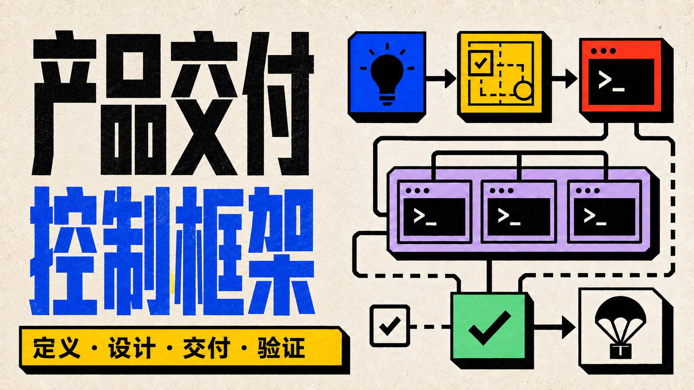
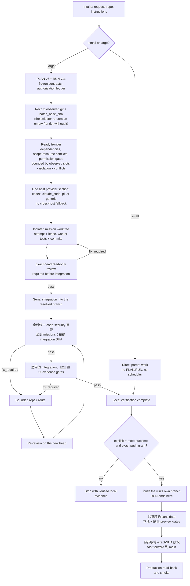

<p align="center">
  
</p>

<p align="center">
  <a href="README.md">English</a> | <a href="README.zh-TW.md">繁體中文</a> | <strong>简体中文</strong> | <a href="README.es.md">Español</a>
</p>

<p align="center">
  <a href="https://github.com/Phlegonlabs/product-delivery-harness/actions/workflows/harness-ci.yml"></a>
  
  
  
</p>

# Product Delivery Harness

技能仓库，用于借助 Codex、Claude Code、Pi 或任何会发现用户 skills 目录的宿主，把产品想法或变更需求变成一条经过验证的交付流程。

它不是提示词集合。这套技能把产品定义、视觉设计、工程执行和代码安全审查拆开，让每个阶段都有单一事实源、清晰的交接边界，以及自己的验证方式。

> 定义产品。编译设计。交付已验证的软件。

## 从这里开始

| 你目前有什么 | 从哪个技能开始 | 会得到什么 |
| --- | --- | --- |
| 一个产品想法 | `product-definition-builder` | 需求、覆盖每个 UI surface 与 state 的响应式 `wireframes/2` 审查文件、浏览器布局 QA、架构、技术栈决策、发布目标、测试义务，以及带来源的市场调研 |
| 已批准线框图、需要视觉设计的包 | `product-definition-builder` UI Design Pass；gate 判定为 required 时再进入 `design-system-compiler` + `frontend-design` | 一份相互连通、自包含的设计参考 HTML reference，左侧栏列出所有页面，包含完整 CSS、可点击流程和直接进入已登录 UI 的模拟登录；需要时再加有约束力的设计系统契约 |
| 现有仓库中的明确变更 | `delivery-harness` | 小型工作直接实现；大型工作进入受管的 PLAN/RUN 流程 |
| 已固定并完成集成的代码候选 | `code-security-review` | 只读、绑定精确 SHA 的安全审查，包含经验证的 source-to-sink 发现与明确的覆盖缺口 |
| 已交付、需要外部设置的 release | `product-activation` | 精确授权的 console 动作、已验证的量测来源，以及逐 target 的 activation readiness |

五个内置技能都可以单独调用；完整流程是可选的。但每种模式仍会校验明确声明的输入和依赖。

## 核心保证

- **小型工作保持精简。** 一个有界变更只走检查、实现、验证和审查。
- **大型工作明确记录。** PLAN v6 定义 typed graph；RUN v11 记录授权、尝试和证据。
- **产品定义止于人工关卡。** UI 产品以一份响应式 `wireframes.html` 收尾；每个 surface、target、state 和可见 PRD 动作都必须能在本地运行并通过浏览器布局检查，owner 才能批准。Web 套件宣告至少三个递增的 responsive viewport；原生／桌面沿用平台自身的 size class。Checker 会验证 page、overlay、feedback flow 以及延后生成的 `mediaIntent` handoff。UI 评分只执行一个完整诊断 wave：默认一位 lead grader；只有 owner 要求或已记录的高影响风险才可增加最多两位检查范围不重叠的 specialist。Parent 先合并所有发现，再由单一 owner 完成一批修正与一次重验；第二次仍失败就回到 PRD，或要求 owner 批准结构性策略，不得展开无上限 round。分数描述视觉质量；明确的契约、行为、布局、state、motion 和 accessibility 义务仍是硬门槛。
- **视觉目标是可交互的响应式 HTML。** 被要求的视觉阶段会产出一份连通的设计参考 HTML reference；每个可见控件都能换页、切换 state、打开已记录的 overlay 或显示 feedback。PRD Motion Need Gate 会把每个关键 surface 标记为 `required`、`recommended`、`not_required` 或 `blocked`；owner 可以自行选择，也可以接受 AI 建议，但会改变 scope 或需要生成服务的 motion 仍由人决定。必要的 functional UI motion 可以在 reference 内以本地方式运行，并提供等价的 reduced-motion 路径。生成式 image 和 motion 位置保留为静态 placeholder，附专属 prompt 与 `generationStatus: deferred`；只有后续获得明确授权的 MCP 阶段才会调用生成工具。Technical Hard Gate 会拒绝 runtime error、意外请求、无法到达的 state、重复事件效果和必要 motion 失效。设计参考人工关卡要求总分至少 90，`H2` 排版、`H4` responsive 和 `H8` accessibility 也都至少 90；非关键的 60–79 分是 advisory，不会触发追分 round。批准的 references 保留在 `docs/design/ui-references/`，被取代的组合归档而非删除。
- **工作节点彼此隔离。** 写入任务使用独立工作树和有界范围；父级会验证每个返回的提交和差异。
- **每个 graph attempt 都可持久追踪。** 非 mission 节点先保留 attempt，在 RUN lock 外执行检查或外部动作，再记录 outcome 与证据；中断的非 runtime attempt 也通过同一结果路径记录为 `blocked`。本地 verifier 只能在 dirty-status 检查中忽略 tracked RUN；路径必须解析在 checkout 内，且执行与结果记录期间都会保护其精确字节和文件身份。
- **Runtime binding 明确可验证。** `lease-worker` 从选择器 directive 派生 provider、driver、model、effort 和 portable runtime axes；只有 app task 接受 `--task-thread-id`，既有精确目标可直接沿用，新精确目标只能从已启用的 wildcard 授权 materialize，不会扩大权限。
- **有能力不等于有权限。** 即使运行时能够推送或清理，每个动作仍需要精确授权。
- **Activation 必须读回验证。** 外部设置留在 PLAN/RUN 之外，批准绑定精确 action digest，而且只有独立 read-back 与行为证据完成后才算 verified。
- **证据跟随 SHA。** 新的提交会让旧 head 的门禁和 UI 证据失效。
- **UI 证据证明版面，而不只是像素。** 固定到 harness 0.34.0 及之后的 RUN 会在每条 route-breakpoint-state 证据行记录来自真实浏览器几何扫描的 `layout_check`；每个 UI 任务在验收前分类其影响（`none`/`style`/`structure`/`both`），被接受的 parity 偏差连同引用记入 deviation ledger，上线 motion 必须追溯到 PRD Motion Need Gate 的决策。固定到 0.35.0 及之后的 RUN 还会机器校验 `deviation_ledger` 与逐 mission 的 `ui_impact_summary`。
- **完成的 run 会收档。** 晋升之后，`scripts/archive_run.py` 在 dry-run 移动清单确认后，把整个协作集——PLAN、RUN、决策、backlog、证据、tasks 视图——移入 `docs/goal/archived/<timestamp>-<run-id>/`，永不删除，归档 commit 沿同一条晋升路径落到 `main`。tasks 视图结尾有一个 renderer 逐字保留的手写 Update Log：plan 完成后，owner 或 agent 每一笔未进 PRD 的更新都以带日期的一行记在那里；归档集只以冻结 hash 引用 PRD——PRD 永不进归档，始终是活引用。
- **读规则是强制的。** 种子化的项目 `AGENTS.md` 要求：受管工作前必读已安装的 `delivery-harness` SKILL.md，影响产品的直接工作前必读受影响的 PRD 段落；跳过即 blocking review finding。
- **代码安全是全新的最终审查。** 每个新的受管 PLAN 都要明确标记 required，或说明非代码交付为何 not applicable。Required review 会在 broad final validation 前，让 `code-security-review` 覆盖统一集成 SHA 上的每个 mission；其声明 scope 必须包含每个 mission 的完整 write scope。它会验证 agent 的结构化结果，并且不能复用相同 tree 的早期证据。Security PASS 不得带 exclusions，且至少一个 tool 或人工审查必须记录为 `passed` 或 `findings`。Required node 不得跳过或被 supersede；reserve 和 completion 会重查 live Git。精确的 interruption receipt 只能在后续 current reviewer 提供 structured PASS 后作为历史保留。
- **Promotion 一律 main-only。** RUN 仍默认在本地完成，也只能选择性推送自己的 run branch。第一次交付与后续 enhancement 都从观察到的 remote `main` 开始；RUN 关闭后，精确 candidate 必须通过所有本地与隔离 preview environment gate，才能另行授权 fast-forward 到 `main`。

## 包含哪些内容

| 技能 | 适用场景 | 主要产出 |
| --- | --- | --- |
| `product-definition-builder` | 产品探索、起草前的 research-first 评估与 Research Gate、需求、Builder UX Direction 输入、带浏览器 QA 和基于 PRD 的条件式 multi-agent 评分的可交互响应式 wireframe、架构、技术栈决策、发布目标、测试义务、负责对账的草稿后市场调研补缺、使用可交互设计参考 HTML 且延后 media 与 motion 生成的可选 UI Design Pass，以及部署后的 outcome review | `PRD.md`、`research-assessment.md`、`wireframes.html`（UI 产品）、`architecture.md`、`stack-decisions.md`、`market-research.md`、`outcome-review.md` |
| `design-system-compiler` | 将已批准的 UI Design Handoff 编译成冻结的设计系统契约，包含完全一致的已批准响应式集合与布局安全规则。它必须加载独立的 `frontend-design` 技能；依赖不可用时会停止。 | `design-system.md`、`design-system.json` |
| `delivery-harness` | 共享的规模判定、PLAN/RUN、授权、本地验证和集成，外加 runtime adapter 参考文档（`references/runtime-adapters.md`）：一份共享契约，加上每个宿主（Codex、Claude Code、Pi 或 generic）各一段 provider 章节 | 直接完成的工作，或 `PLAN.md` + `RUN.md` |
| `code-security-review` | 实现与统一集成后的只读安全审查，优先由 fresh sibling agent 执行；主动渗透测试与修复不属于本技能 | 精确 SHA 决策、trust-boundary 覆盖、验证后的发现与修复测试 |
| `product-activation` | Web、iOS 与 browser-extension target 的交付后设置，包括 capability routing、精确外部动作授权、read-back、量测来源与 outcome-review 交接 | `docs/ACTIVATION.md` |

交付核心在调用托管编排之前，会先做一个规模判定：

- 小型工作保持直接完成，默认不启用规划器、调度器、PLAN/RUN、子代理或外部运行时预检。
- 大型工作进入托管规划。它可以用 `PLAN.md` 和 `RUN.md` 完成一次受管顺序交付，或者处理多个任务并实现可持久的移交；目标项目的 `docs/tasks.md` 只是按需生成的人类视图，不是必需状态。本源码仓库不再另外维护根目录 `Tasks.md` 流程记录。
- 选择器会在实际选中的安全写入 mission 少于两个时派生 `managed_sequential`，达到两个或更多时派生 `parallel_graph`。只有后者才启用调度器扇出；runtime driver 仍是独立的传输事实。核心只套用 runtime adapter 参考文档中对应所检测宿主的那一个 provider 章节；只有当选定的路线需要外部运行时，才会对其做预检。
- RUN 执行不等待远程 CI；branch promotion 是独立 closeout。精确 candidate 与适用的隔离 preview environment 验证完成前，`main` 不得移动。

规模指的是协调范围和影响面，而不是原始的文件数或行数。如果小型工作变大，Harness 会保留已完成的工作，只对剩余部分做规划。

## 系统如何协同

```mermaid
flowchart LR
  Idea["产品想法或变更请求"] --> PRD["product-definition-builder\n产品与技术定义"]
  PRD --> Wireframe["wireframes/3 HTML\n响应式结构矩阵"]
  Wireframe --> Gate{"Wireframe Approval Gate\n人类 owner"}
  Gate -->|"批准且要求视觉设计"| Design["UI Design Pass\n需要时进入 design-system-compiler"]
  Gate -->|"批准、不进入视觉阶段"| Harness["delivery-harness\n共享交付核心"]
  Design -->|"批准的全页面 HTML reference 或设计系统契约"| Harness
  Harness --> Runtime["单一宿主适配器\nCodex、Claude Code 或 Pi"]
  Runtime --> Security["code-security-review\n全新统一 exact-SHA 审查"]
  Security --> Evidence["完整最终测试与 UI 证据"]
  Evidence --> Push["选择性推送精确 run branch\nRUN 关闭"]
  Push --> Candidate["验证精确 candidate SHA\n本地 + 隔离 preview gates"]
  Candidate --> Main["另行授权 fast-forward\n精确 SHA 到 main"]
  Main --> Activate["product-activation\n外部设置 + read-back"]
  Activate --> Outcome["已验证量测来源\n后续 outcome review"]
```



你可以从任意阶段起步。比如，单独用 Harness 去修复一个已有的应用。各技能职责分离：`product-definition-builder` 定义产品并止于批准的 `wireframes.html`；可选的 UI Design Pass 与 `design-system-compiler` 定义视觉契约——pass 会在 `docs/design/ui-references/<run-id>/` 留下一份批准的自包含设计参考 HTML reference，左侧栏列出所有页面，包含完整 CSS、可点击流程与 deferred media/motion handoff；Harness 实现已冻结的结果；`code-security-review` 审查统一候选而不修改它；`product-activation` 则在不重开 delivery RUN 的情况下设置并验证已交付 release。

### 完整技能生命周期

五个 skill 的完整生命周期，包含每个闸门与横切机制：

```mermaid
flowchart TB
    user([用户想法或变更请求])

    subgraph PRD["product-definition-builder — 产品定义"]
        direction TB
        interview[结构化访谈<br/>3 段 free-text + AskUserQuestion]
        pkg["核心套件起草<br/>PRD.md + architecture.md<br/>+ stack-decisions.md"]
        wf["wireframes.html<br/>单一互动式线框档（UI 产品）"]
        wgate{{"Wireframe Approval Gate<br/>（人工核准 = 完整停点）"}}
        ra["research-first 评估<br/>research-assessment.md（可跳过）"]
        rgate{{"Research Gate<br/>go | clarify | stop"}}
        interview --> ra --> rgate --> pkg --> wf --> wgate
        mr["market-research.md<br/>（gap pass，可跳过）"]
        ra -.-> mr
        pkg -.-> mr
    end

    subgraph DESIGN["视觉设计（可选；owner 明确要求才进场）"]
        direction TB
        taste["UI Design Pass<br/>依 Skill Bindings 槽位选 taste skill"]
        handoff[UI Design Handoff]
        dgate{{"Design System Need Gate"}}
        pair["design-system-compiler<br/>design-system.md + design-system.json"]
        taste --> handoff --> dgate
        dgate -->|required| pair
        dgate -->|not_required| target[核准的 page-faithful target]
    end

    subgraph HARNESS["delivery-harness — 交付核心"]
        direction TB
        route["System Review And Route<br/>（parent-only、read-only）"]
        size{{"Project Size Gate"}}

        subgraph DIRECT["Direct 路线（small）"]
            direct_impl["直接实现 -> 本地验证<br/>-> code-security 审查 -> 授权 Git 动作"]
        end

        subgraph MANAGED["Managed 路线（large）"]
            direction TB
            plan["PLAN v6<br/>typed graph：missions / reviews / gates<br/>allowed_providers + 原子 task commit"]
            newrun["new_run.py 产生<br/>RUN v11 + 12 键授权 ledger"]

            subgraph LOOP["执行循环（每个 wave）"]
                direction TB
                lock["--session-id acquire-run-lock<br/>（run lock + heartbeat）"]
                obs["record-observation<br/>live-Git 快照"]
                sel["select_ready_nodes.py<br/>确定性 frontier 选择"]
                accept["accept-wave<br/>（batch base 绑定）"]
                adapters["按共用契约解析<br/>可用的 agent driver"]
                lease["lease-worker<br/>（worktree + lease + graph 绑定）"]
                workers["fresh bounded agent workers"]
                record["record-worker-result<br/>重校验证据 + 原子 RUN 更新"]
                review["exact-head review<br/>（reserve -> reviewer -> record）"]
                integ["record-integration<br/>（序列集成；统一候选 SHA）"]
                lock --> obs --> sel --> accept --> adapters --> lease --> workers --> record --> review --> integ
            end

            plan --> newrun --> LOOP
            security["code-security-review<br/>fresh sibling；全部 missions；精确 SHA"]
            gates2["广域 final validation<br/>（E2E / 回归 / UI 证据矩阵）"]
            LOOP --> security --> gates2
        end

        route --> size
        size -->|small| DIRECT
        size -->|large| MANAGED
    end

    subgraph DEPLOY["部署（git-connected 平台）"]
        direction TB
        handoff["更新 docs/DEPLOYMENT.md<br/>（secret 名称 + 外部 console 任务）"]
        push["授权 push<br/>run 分支"]
        preview["Preview 自动部署<br/>（平台按 push 构建）"]
        merge([用户合并到 main])
        prod["Production 部署<br/>（平台从 main 构建）"]
        check["部署后验证（只读）<br/>check_deployment.py"]
        status["核对 deployment 记录<br/>（状态 + 待人工处理事项）"]
        handoff --> push --> preview --> merge --> prod --> check --> status
    end

    subgraph ACTIVATE["product-activation — 交付后启用"]
        direction TB
        profiles["选择 core + surface profiles<br/>docs/ACTIVATION.md"]
        capability["探测 connector / API / CLI<br/>Browser / Computer Use / manual"]
        actions["精确 ACT-* 动作<br/>授权 + read-back"]
        ready["逐 target activation readiness<br/>已验证 MS-* 来源"]
        profiles --> capability --> actions --> ready
    end

    subgraph OUTCOME["Release 后 outcome review"]
        outcome["outcome-review.md<br/>（owner 主动要求，量测窗口后）"]
        verdict{{"判定：no_change | enhancement | incident"}}
        outcome --> verdict
    end

    subgraph CROSS["横切机制（贯穿各阶段）"]
        bindings["Skill Bindings<br/>（AGENTS.md 槽位表 + SHA-256 pin）"]
        ledger["授权 ledger<br/>12 个独立动作键"]
        ver["版本闸 + contract digest<br/>（compatible_old 波界）"]
        watch["watchdog + reconcile<br/>（中断恢复）"]
    end

    user --> interview
    wgate -->|继续视觉设计| DESIGN
    wgate -->|止于此| HARNESS
    pair --> route
    target --> route
    mr --> route
    DIRECT --> handoff
    gates2 --> handoff
    status --> profiles
    ready --> outcome
    verdict -.->|下一次 enhancement 请求| interview
```



Wireframe Approval 与合并到 `main` 仍是人工闸门。Delivery 执行循环留在 PLAN/RUN 内；交付后 Activation 只在 RUN 关闭后开始，并使用自己精确的外部动作授权。

每个可部署版本都以 `docs/DEPLOYMENT.md` 作为操作交接文档。Product Definition 先建立骨架；Delivery Harness 在 push 前根据已跟踪的环境声明、CI 和 auth／integration 代码补全，部署后再用只读结果更新状态。每个独立发布单元使用一个小写 surface 名称：production 使用不带 `-prod` 的标准 `<product-slug>-<surface-suffix>`，development 则在同一个名称后加 `-dev`。常用后缀是 `web`、`api` 和 `extension`；原生 artifact，以及独立发布的 admin、worker、job、agent、webhook、realtime 或 CLI 单元，使用各自有意义的后缀。除非 artifact 确实不同，否则 provider 和 store 名称分开记录。文档也会列出准确的 secret 与 variable 名称、preview／production 放置位置，以及 auth callback URL 等外部 console 任务，但永远不保存 secret 值。

交付之后，`product-activation` 会建立或核对 `docs/ACTIVATION.md`、选择适用的 web、iOS 或 browser-extension profiles，使用最安全可用的 connector/API/CLI/Browser/Computer Use 路线，而且只执行精确授权的动作。Capability 与 evidence 会绑定精确 target、environment、source SHA 和 artifact/build identity，并由最新的相符结果决定 readiness。它会分开记录 configured 与 verified、不保存 secret 值、把 hybrid 产品中不支持的 target 留在 gate 之外，并把相符且已验证的 `MS-*` 来源交给后续 outcome review。

循环在两端都闭合。任何封闭选项决策之前，research-first 评估以人工 `go | clarify | stop` Research Gate 把关起草——发布为含稳定 `RA-*` 发现的 `research-assessment.md`，并由草稿后的 market-research 对账。Activation 与真实量测窗口结束后，owner 可以要求产出 `outcome-review.md`：对照 PRD metrics 与 `TEST-*` 预期信号的实测值，只使用相符且已验证的来源，附带喂给下一次 enhancement run 的 `no_change | enhancement | incident` 判定。

交付后的小改不必为了维护产品契约而另开 PLAN/RUN。当 `docs/product/PRD.md` 存在时，种子化的 `AGENTS.md` 会要求每次直接修改都在同一份变更中更新受影响的 PRD 需求与跟踪 ID，并先把 UI 影响分类为 `none`、`structure`、`style` 或 `both`。新增页面或 route 至少属于 `structure`，因此要更新并重新批准受影响的 UI Surface Contract 与 `wireframes.html` 页面。样式变更要重新确认已批准的 UI 方向，只有经批准且需要正式 design-system delta 时才修改 design-system pair；未受影响的 ID、页面与决策保持不变。

Gitignore 管理同时适用于 direct 与 managed 工作。scope scan 会记录任务是否改变 local-only artifact 类型，再按实际工具链生成最窄的规则。含值的环境与 credential 文件、可重建的 build output、dependency 目录、cache、log 和本地平台状态要忽略；source、tests、lockfiles、migrations、受跟踪的配置示例与 schema，以及权威产品或交付产物必须保持可见。程序新增环境变量读取时，同一个 task 要更新受跟踪的 example 与 ignore 规则。Harness 会用 `git check-ignore`、`git status --ignored` 和 `git ls-files` 验证代表路径；它不读取 secret 值、不用规则隐藏 dirty worktree，如果可能的 secret 已被 Git 跟踪，就停止并交给 owner 处理。

商业产品现在会经过两个分开的 Product Definition 决策。Monetization Infrastructure Gate 先解析商业模式、定价／offer 规则、购买 surface、entitlement source 与 merchant-of-record／税务责任，再比较 native store billing、RevenueCat、Qonversion、Adapty、Superwall、Stripe Billing、Paddle 或 Lemon Squeezy 等当前选项；有定价不代表默认 RevenueCat。Partner Channel Gate 则独立解析 `none`、affiliate、referral、reseller 或 hybrid，再比较 Rewardful、FirstPromoter 这类 link／commission 工具、PartnerStack 这类完整 partner platform、Lemon Squeezy 的集成 affiliate 路线，或自建 reseller service。Billing、entitlement、paywall、税务、attribution、commission／payout 与 reseller operations 会保持为分开的 PRD、architecture、stack、UI、mission 与 test 契约。

## 交付模型

Harness 是围绕明确的边界构建的：

1. 检查当前项目，识别需要完成的工作。
2. 冻结相关的契约、来源、范围和验证步骤。
3. 当任务大到需要时，在动手实现之前先规划依赖关系。
4. 只有当至少两个安全写入 mission 实际被选中、工作彼此独立且相互隔离，并且每个动作都获得明确授权时，才使用并行工作节点；受管顺序路线仍要证明隔离 writer、scope/head 和 review gates。
5. 验证任务结果与集成，执行全新的统一 code-security 审查，再验证相关 UI 流程与最终差异（diff）。单 mission 不会凭空增加跨 mission batch gate。
6. RUN 默认以验证过的本地证据结束；run-branch push 需要精确授权。RUN 关闭后，完成 exact candidate 与适用的隔离 preview environment 验证，再另行授权把该 SHA fast-forward 到 `main`，并 read-back 与验证 production。

对于有计划支撑的工作，它会记录任务范围、依赖关系、工作节点归属、验证命令，以及针对具体动作的授权。一次测试通过并不等于授权推送、移除工作树或删除分支。RUN-v11 的推送还需要明确的远程意图、唯一的集成分支目标和当前 head 授权；如果默认分支身份未知，推送会安全失败，但不会阻止无关的本地执行。

wave 接受前，Harness 会重新检查观测到的非默认集成分支及干净产品树，把 batch 绑定到该精确 head，重跑 selector，并且只接受完整的当前 frontier。clean-tree gate 只排除 transition 必然更新的那个精确 tracked RUN 文件；其他任何变化仍会阻断。集成分支位于 linked worktree 时，该 checkout 会正确记录为 parent，Git 的干净主 checkout 则保留为已识别的同级项。持久 run lock 负责 dispatch；短期操作系统锁串行化每一次 RUN 的读取、验证与写入事务。冻结的 PRD、wireframe 和 design-system source 会在独立校验与 transition 写入路径中按字节 hash 绑定；即使 PLAN 声称 UI surface 为空，冻结的 PRD 仍会被解析。每个结构化 PRD surface 只拥有一个 literal route；带 UI 的翻译 PRD 只能有一对语言无关的边界标记，并且每个条目各有一个 `route` 与 `states` 锚点；各产物的 ID、route 与 state 必须完全一致。design-system 的 Markdown 与 JSON 各有独立 source row，其 generated contract 与 compiler namespace 必须一致；每个 PLAN `DS-*` trace 也必须在同一个全局唯一的 JSON 注册表中解析。product-definition-builder 会按问题工具真实的每次容量分批询问所有适用的封闭决策；没有 Codex 专属的调用次数目标，也不会为了凑宿主次数而丢掉问题。




## 轻量的运行时适配器

共享核心掌管唯一的 PLAN/RUN 控制平面。运行时相关的启动细节放在同一份参考文档 —— `delivery-harness/references/runtime-adapters.md` —— 内含一份共享适配契约，加上每个宿主一段 provider 章节，按需套用：

- 每个宿主只套用自己的 provider 章节，并且只执行 `allowed_providers` 包含该宿主的 PLAN 节点。
- Pi 宿主沿用 Pi 已安装的角色、模型和回退设置。
- 任何 provider 章节都不能调用另一个运行时。一个已就绪、但其提供方与当前宿主不匹配的节点，会被 deferred with `runtime_unavailable`，留给由匹配宿主托管的运行去处理。
- 以后新增一个运行时宿主，只是在这份参考文档加一段 provider 章节，不需要新增 skill。

共享的脚本、schema、参考文档和模板仍然放在 `delivery-harness` 下；各 provider 章节链接到它们，而不是各自附带一套重复的运行时。这样能让默认提示词保持精简。

一次运行只有一个 active host。same-repository handoff 只有在 Host A 关闭 wave、且 `RUN.active_wave.status` 既不是 `active` 也不是 `proposed` 后才允许；`active_wave` 对象仍保留在 RUN 中，不能把对象缺失当作交接信号：Host B 保留 PLAN/RUN 和 graph state，重新探测 runtime，并在选取下一波前审查当前 exact SHA。若需修复，路由回 Host A 且旧 review 立即失效；除非未来 schema 增加可携带的仓库/状态身份，否则不支持 cross-machine handoff。

## 图工程与动态工作流

这些技能使用两层图：

- **组织图（org graph）** 是稳定的角色契约：产品、架构、UX、设计系统、任务工作节点、surface 审查者、security 审查者、审批、集成和生命周期职责。
- **工作图（work graph）** 是单次运行的临时任务图。只有当宿主能够强制执行 `builder_readonly` 工具画像时，PRD 和设计工作流才会使用有界的分析图；否则它们退回到顺序执行的父级。工程部分使用规范的 PLAN v6 图和 RUN v11 状态。

访谈和审批保持在运行中的工作流之外，因为 Claude Code 的动态工作流无法在运行途中征询用户输入。父级先冻结输入，运行一个有界的工作流，再自行负责分阶段写入、冲突解决、审批和发布。

对于工程部分，Harness 会在创建或申请工作树之前，先验证并选出依赖已就绪的前沿（frontier）。原生 Claude 任务使用 `.claude/worktrees/` 下父级托管的工作树，把每个工作节点绑定到精确的批次基点，并要求在访问仓库前先执行 `EnterWorktree`。在每一条路线中，父级都会验证返回的提交和实际的 Git 差异，串行地集成被接受的提交，并重新计算图的前沿。

非 runtime 图节点采用 reserve／execute／record 顺序：`reserve-node-attempt` 在 RUN lock 内建立 receipt，approval、external wait、deterministic verifier 或 lifecycle side effect 在 lock 外执行，`record-node-result` 只关闭相符的 attempt，并按声明的 outcome 派生 graph phase。Lifecycle transition 只记录证据，不执行动作。`lease-worker` 把选择器派生的 runtime binding 与精确 task／thread 身份写入 RUN，并遵守 compatibility 检查与现有 wildcard 授权。

Claude Graph Workflow 会把 mixed frontier 按 homogeneous `tool_profile` 分成多个调用；同一组内可以使用不同模型和推理强度，但一次调用绝不混合写入 mission 与只读 review。tool profile 是标签和 prompt/result 契约，不是 permission-level tool removal。

- `mission_write` 要求 `EnterWorktree` 和 mission 的有界写入契约。
- `code_review_readonly` 要求 frontend、backend、integration 或 security 的精确路径审查和只读结果证据；它不会移除继承的工具。
- `visual_review_readonly` 使用宿主继承的工具审查保留下来的截图或其他既有证据；新增浏览器访问必须先审核并加入画像契约后才能使用。

当 Claude Code 返回真实的工作流运行 ID 时，RUN 状态可以保留工作流/任务 ID、脚本摘要、节点分组、图/基点绑定、工具画像、状态和可用指标。同会话续跑可以复用该绑定；跨会话恢复则从规范的 PLAN/RUN 状态开启一次新的工作流尝试。

图节点的 `allowed_providers` 必须包含真正在运行 Harness 的宿主，该节点才能被选中。Codex、Claude Code 和 Pi 不能互相委派节点；它们之间没有跨宿主桥接。一个已就绪、但其提供方与当前宿主不匹配的节点，会被 deferred with `runtime_unavailable`，留给由匹配适配器托管的运行去处理。

## 安装

这是公开仓库，不需要访问权限。你只需要至少有一个会发现 `~/.agents/skills/` 这类用户 skills 目录的宿主——Codex、Claude Code、Pi 或其他都可以。

```bash
git ls-remote https://github.com/Phlegonlabs/product-delivery-harness.git HEAD
```

### 最快安装方式

克隆仓库并运行安装脚本。它会把现有副本移到 `~/.agents/skill-backups/product-delivery-harness/` 下同一个带时间戳的备份中，把五个 Product Delivery Harness skills 复制进 `~/.agents/skills/`，并验证每个复制出来的 `SKILL.md`：

```bash
git clone https://github.com/Phlegonlabs/product-delivery-harness.git
cd product-delivery-harness
./install.sh             # macOS / Linux / Git Bash
# Windows PowerShell：powershell -ExecutionPolicy Bypass -File install.ps1
```

手动等效做法：

```bash
cp -r product-delivery-harness/skills/delivery-harness \
      product-delivery-harness/skills/product-definition-builder \
      product-delivery-harness/skills/design-system-compiler \
      product-delivery-harness/skills/code-security-review \
      product-delivery-harness/skills/product-activation \
      ~/.agents/skills/
```

如果 checkout 的 `skills/` 下有本机 `__pycache__` 目录，复制时排除或删掉——宿主不需要字节码。Windows 上改用 `Copy-Item -Recurse` 即可。安装脚本同时也是更新脚本：重跑一次会先备份旧副本再替换。更新前必须获得明确的安装／更新授权，并结束所有正在使用这些 skills 的会话。复制五个当前目录，验证文件与 checkout 一致，然后开启新宿主会话。验证失败时恢复备份；不要直接覆盖或删除旧副本。

从 0.23 或更早版本升级时，先在同一份备份中用原 ID 保存各旧目录。然后安装对应的新版本——`full-harness` → `delivery-harness`、`prd-builder` → `product-definition-builder`、`product-design-builder` → `design-system-compiler`——以及新的 `product-activation` skill。复制完成后，验证 `~/.agents/skills/` 中已没有三个旧 ID；否则宿主会发现重复且触发范围重叠的 skills。

五个内置技能都可以独立调用，但跨技能模式会校验各自的依赖。冻结 wireframe 校验会使用 `delivery-harness` 旁的 `product-definition-builder` checker；`design-system-compiler` 需要已批准的 PRD UI Design Handoff、已批准的 `wireframes.html` 和 `frontend-design`；可选的 UI Design Pass 需要 design-direction skill 与 frontend-implementation skill；新的受管代码交付会在集成后通过 `code_security_verification` 槽位使用 `code-security-review`；`product-activation` 在 Delivery 后使用 release 与 deployment 交接。只需安装所选模式要求的依赖。

### Zero-to-one 流程（从零开始）

1. 安装一个受支持的宿主（Codex、Claude Code、Pi 或任何会发现 `~/.agents/skills/` 的宿主）和五个 Product Delivery Harness skills，并用该宿主运行本次交付。
2. 开启新的宿主会话，确认技能可见，然后调用 `delivery-harness`。
3. 让规模闸决定直接工作还是 PLAN/RUN；小型工作不要预先创建工作节点。
4. 大型运行一次只保留一个 active host，并在 same-repository handoff 前关闭和审查每个 wave。

## 常见提示词

Codex 接受下面的 `$skill-name` 形式。在 Claude Code 或其他宿主中，直接按名称请求技能，例如 `product-definition-builder`。在 Pi 中，可以使用自动发现的项目技能，或通过 `--skill` 传入技能目录，然后按名称请求 `delivery-harness`。

```text
Use $product-definition-builder to turn this idea into a PRD, responsive wireframes for every page, target, and state, browser layout QA, architecture, stack decisions, release targets, and test obligations.
```

```text
Use $product-definition-builder to review every page-target-state in the staged wireframes.html, confirm no unintended overlap or overflow in a real browser, and record the Wireframe Approval decision before visual or implementation work.
```

```text
The wireframes are approved; continue into visual design with $product-definition-builder's UI Design Pass. Render every page and approved state in one self-contained design-reference HTML with complete CSS, a left sidebar listing all pages, clickable flows, and mock login that jumps directly to the authenticated UI. Browser-check the full responsive/state matrix and retain the approved file under docs/design/ui-references/, invoking $design-system-compiler only when the Design System Need Gate is required.
```

```text
Use $delivery-harness to implement the approved plan, building each page from its approved HTML reference in docs/design/ui-references/ within the recorded tolerance.
```

```text
Use $delivery-harness to review the existing app, plan the required work, and stop before implementation.
```

```text
Use $delivery-harness to implement the approved plan. Create a branch and commit the verified change, but do not push or open a PR.
```

```text
Use $delivery-harness to implement this plan and push the verified branch. I will open the PR and handle the merge myself.
```

```text
The delivery is complete. Use $product-activation for the production release targets, configure only the exact external actions I approve, verify each result by read-back, and stop after recording activation readiness and the measurement-window handoff.
```

```text
Use delivery-harness on this Pi host to execute this plan. Preserve Pi's installed frontend_designer, worker, reviewer, model, and fallback settings.
```

多任务交付仍要写清本地和远程结果；分支创建、commit、集成、每次 push、deployment、移除工作树和删除分支都是独立动作。Post-RUN promotion 只有在 exact action-time authorization、fast-forward 证明、read-back 与完整 candidate 测试齐全时才能更新 `main`。

## Codex、Claude Code 与 Pi 执行

Harness 记录的是实际的运行时能力，而不是从已安装的 CLI 去假定一个。

| 运行时 | 首选并行路线 | 回退方案 |
| --- | --- | --- |
| Codex 应用 | 在隔离的、应用托管的工作树中运行应用任务 | 直接子代理，然后退到单一顺序父级 |
| Claude Code | 采用精确基点、父级托管的 `.claude/worktrees/` 工作树的动态工作流 | 直接子代理，然后退到单一顺序父级 |
| Pi | 在父级托管工作树中使用已安装的 Pi 角色，并由 Pi 选择模型和回退方案 | 单一顺序父级 |
| 其他任何宿主 | 父级隔离的全新子代理 | 单一顺序父级 |

在 Codex 中，每个选中的 mission 都会在左侧栏打开一个独立的顶层会话，并绑定自己的应用托管 worktree。任何只读 explorer 或 reviewer 都由 Harness parent 另行作为同级节点派发；mission 任务不能创建子代理。协调器直接创建的子代理不能替代这些顶层任务。如果 project/thread 工具一开始尚未加载，适配器会先从当前 Codex 工具界面中找到它们，再考虑回退路线。当用户明确要求这种结构时，缺少 thread 能力就是 blocker，不能把工作缩回同一个会话。

目标仓库的 branch 规则优先；否则第一次交付与 enhancement 都从观察到的 remote `main` 创建 run branch。Mission 工作树只集成进 run branch 并接受 exact-head review。RUN 关闭后，candidate 通过所有必要的本地与隔离 preview environment gate，再以独立授权把未变化的同一 SHA fast-forward 到 `main`。任何修复都要在新 SHA 上重跑 candidate 验证。

每个 provider 章节只运行其允许提供方包含自身宿主的 PLAN 节点；不存在跨宿主路线。需要其他宿主提供方的节点会被 deferred with `runtime_unavailable`，而不会在这里执行。

并行实现默认没有一个小的固定上限；配置的写入工作节点上限设得足够高，实际的波宽由观察到的工作节点槽位、隔离容量，以及依赖已就绪、无冲突的前沿大小限定。一个可独立验证的目标对应一个 mission。每个写入节点都有明确的文件 ownership 和独立、干净、固定基线的 worktree。共享 API、schema 和类型必须先冻结，再开始依赖它们的并行写入。探索、写入和评审节点都由 parent 作为同级节点派发；工作节点和评审节点都不能再次分派。每个 mission 通过 exact-head 评审后，由 parent 串行整合；统一整合完成后启动 fresh reviewers，由 sibling agent 执行必需的 `code-security-review`，最后只对固定候选 SHA 运行一次完整验证。工作节点绝不编辑父级的 `PLAN.md` 或 `RUN.md`，也不推送、开 PR、合并、部署或删除 worktree。集成以及每一个落地或生命周期动作都由父级负责。

## 仓库结构

```text
skills/                                      规范的技能源
assets/                                              README 封面
.github/workflows/harness-ci.yml                     契约、单元和 E2E 检查
install.sh / install.ps1                             一键安装进 ~/.agents/skills/
```

## 维护技能

只编辑 `skills/` 中的规范源，然后运行核心校验套件：

```bash
python -m pip install -r skills/delivery-harness/requirements-test.txt
python skills/delivery-harness/scripts/check_skill_spec.py
python -m pyflakes skills/delivery-harness/scripts skills/product-definition-builder/scripts skills/design-system-compiler/scripts skills/product-activation/scripts
python skills/delivery-harness/scripts/docs_weight.py
python -m unittest discover -s skills/delivery-harness/scripts/tests -v
python -m unittest discover -s skills/product-definition-builder/scripts/tests -v
python -m unittest discover -s skills/design-system-compiler/scripts/tests -v
python -m unittest discover -s skills/product-activation/scripts/tests -v
git diff --check
```

CI 也会运行端到端主干检查。本地可用 `HARNESS_GOLDEN_PATH=1 python -m unittest discover -s skills/delivery-harness/scripts/tests -p "test_golden_path.py" -v` 运行；它会用一个合成产品套件走真实 CLI 主干（`new_run.py` → 含 sibling skill 完整 wireframe checker 的冻结 join → `validate_result.py --repo-root`），让跨 skill 契约漂移一次爆红。

## 保持 README 与代码同步

README 是记录文档：每个新增或改动 skill、规则、表格、图或文档化流程的变更，都要在同一份变更里更新 README 的对应描述部分，四种语言一起改。版本 badge 与版本历史条目属于发布时的工作，按下面《发布》的规则走。

## 发布

每个落在 `main` 的流程就是一次 release，版本号提升要在同一份变更里完成——默认升 patch，skill bundle 有破坏性变更升 minor。以下几个地方要一起更新：

1. `package.json` 的 `version` 字段与 `skills/delivery-harness/VERSION` 中会随技能目录复制的版本。
2. 四份 README（`README.md`、`README.zh-TW.md`、`README.zh-CN.md`、`README.es.md`）的版本 badge 与版本历史条目。
3. `skills/delivery-harness/assets/templates/MISSION_RUNBOOK.template.md` 的 RUNBOOK `required_harness_version` 默认值。
4. `skills/delivery-harness/scripts/tests/test_skill_contract.py` 中钉住的版本断言。

然后跑完上面的完整验证、检查整个 diff，并依 `branch-promotion-contract.md` 落地。Repository protection 要求时使用 PR；如果 provider 产生新的 main SHA，必须先证明其 tree 与 verified candidate 相同，并立即在该 exact main SHA 上重跑完整 suite 与 security review，才能 tag 或声明 release 完成。落地之后，在 `main` 的 release commit 上打上对应的 `v<版本>` tag（例如 `v0.30.0`）；tag 是 release 的一部分，不是可有可无的附加动作。每个发布的版本都要有它的 tag——`git tag` 和 `package.json` 必须讲同一个故事。

## 安全与数据安全

- 不要把 GitHub 令牌和其他凭据留在本仓库中。
- 在确认新的技能副本能正确加载之前，不要删除旧的安装副本。
- 编排技能对每一个改变状态的 GitHub 或生命周期动作都要求明确授权。
- `code-security-review` 默认只读；没有单独的明确授权时，它不会安装 scanner、启用网络、修复代码或探测 live target。

## 许可证

本仓库采用 MIT 许可证，全文见 [LICENSE](LICENSE)。

## 版本历史

每次发布都要更新本节，连同上面《发布》一节描述的版本号提升与 tag 一起完成。

- **0.35.4** — 小型直接工作的 commit 现在也用结构化 subject：种子 `AGENTS.md` 与 `commit-convention.md` 要求 managed run 之外的每个 commit——包括 plan-mode 原地修改、不开分支——使用 `<type>(<scope>): <imperative summary>`，尾码可选，并附示例（`fix(dashboard): correct save-button copy`、`chore(deps): bump playwright to 1.49`）。subject 即记录：run 之间的小改动在 git 历史里留下可搜索、带类型的轨迹。
- **0.35.3** — 新增 `scripts/docs_weight.py`：只读的复杂度棘轮报告——统计每个 skill 的 SKILL.md 与 references 的规范字数，对照最近的 `v*` tag 输出逐档、逐 skill 与总计的增减。它在 CI 与 Required Verification 套件中运行，让文档增长在每个 release 可见；只报告、不拦截。
- **0.35.2** — 对 0.34/0.35 闸门栈的加固。harness 版本闸门全面改用单一严格解析器（`harness_schema.version_at_least`）：`0.35.1-rc.1` 这类预发布 pin 一致地启用闸门，短版号或畸形 pin 一致地停用——关闭 layout/ledger 闸门与 impact-summary/安全闸门判断相反的分叉。固定到 harness 0.34.0+ 的 run 在 harness join（design-system pair 与 PRD 锚点）同样强制 web 三 viewport 下限；legacy 与未钉版本的 run 维持双目标可读。`archive_run.py` 归档前先跑真正的 PLAN/RUN 配对验证，拒绝手改或无效的 "complete" run。tasks 视图生成头的不可手编辑警告收敛到生成区；coordination-paths 种子纳入 `docs/tasks.md` 与 `docs/goal/REFINEMENT_BACKLOG.md`，文件规定的 closeout 重写不再触发 stale-head 检查；Required Reading 如实指名编排 skill 本身；activation 定序在晋升之后、归档之前，其发现由 parent 记录；UI-impact 分类经由 worker payload 的 integration notes 传递，按最强影响聚合进 `ui_impact_summary`；layout_check、deviation_ledger 与 ui_impact_summary 的值如实标注为「记录式 attestation」——机器只验完整性与形状、可按引用查证——并由 `inspect_harness_run.py` 呈现计数与缺口。
- **0.35.1** — 种子化的项目 `AGENTS.md` 新增 Required Reading 段：受管 harness 工作先读绑定的 `delivery-harness` SKILL.md，影响产品的直接工作先读 `docs/product/PRD.md` 受影响段落与 `DOCUMENTS.md` 指名的文件，跳过阅读视为 blocking review finding；本仓库自身的 `AGENTS.md` 带维护者侧镜像。`docs/tasks.md` 新增由 `update-log` 标记围起的手写 Update Log——`render_tasks_view.py` 重写标记以上的一切、逐字保留围内行、`--check` 忽略 log 编辑——plan 完成后到归档前，owner 或 agent 的每笔未进 PRD 的更新都以带日期的一行记入；影响产品的更新同时按 Keep Product Contracts Current 进 PRD。PRD 与 run 文件的分离在归档全程明文化：归档集仅以 PLAN sources 里冻结的 `content_sha256` 引用 PRD，`docs/product/` 永不进入 `docs/goal/archived/`，PRD 留在正式路径作为后续 enhancement run 的活引用。`archive_run.py` 另增 `--stamp` 以在确定性重跑中钉住归档时间戳。
- **0.35.0** — UI 对齐改为机器强制：固定到 harness 0.35.0 及之后的 RUN-v11 文件携带 `deviation_ledger`——每条被接受的 parity 偏差都要有一行带引用的记录，无对应偏差的行会被拒绝——以及 `ui_impact_summary`，为 UI run 的每个 mission 分类 `none`/`style`/`structure`/`both`，`structure`/`both` 必须指名其被接受的上游 doc delta；两者都在 closeout 校验。新增 `scripts/archive_run.py`：dry-run 列出移动清单后，把完成 run 的整个协作集——PLAN.md、RUN.md、DECISIONS.md、REFINEMENT_BACKLOG.md、evidence/ 与 tasks 渲染视图——收进 `docs/goal/archived/<YYYYMMDD-HHMMSS>-<run-id>/`，在 DOCUMENTS.md 记录该行，永不删除；完成流程把「晋升后归档」列为必经下一步，归档 commit 沿 run 分支经同一晋升路径进 `main`，new_run 遇到已完成的 run 会直接指向归档脚本。破坏性 skill bundle 变更，版本闸门限定 0.35.0+ 的 run。
- **0.34.0** — 全链路更名保真度词汇：高保真 HTML 审查稿改为设计参考（design reference），线框明确为结构线框；已冻结的 PRD 字节不受影响。Web responsive 集合从 PRD 起草、线框检查器到设计系统契约一律要求至少三个递增 viewport；历史 `wireframes/2` 文件保持双目标可读，旧的双目标 web 集合在下次重验前必须先通过 design-input delta 提升。harness 的 PRD join 现在要求每个 `UI-*` 条目恰好一个 `responsive` 锚点，不再静默跳过 breakpoint 比对。固定到 harness 0.34.0 及之后的 RUN-v11 文件在每条 UI 证据行记录 `layout_check`——真实浏览器 DOM 几何扫描（重叠、裁切、遮挡、水平溢出）、标注的人工或原生依据，或记录在案的原因——带失败检查的 PASS 行永远无法结案。UI 任务在验收前分类影响（`none`/`style`/`structure`/`both`），结构性变更只在其文档 delta 之后整合，被接受的 parity 偏差连引用记入 deviation ledger，direct 与 open-ended refinement 同样承担文档同步义务，上线 motion 必须追溯 PRD Motion Need Gate 决策。破坏性 skill bundle 变更。
- **0.33.0** — 五个标准 skill 从 `.agents/skills/` 移到顶层 `skills/`，确立公开 mono-repo 布局，并新增一键安装脚本。`install.sh`（bash）和 `install.ps1`（PowerShell）会先把现有副本移到 `~/.agents/skill-backups/product-delivery-harness/` 下同一个带时间戳的备份，再将 `skills/` 排除 `__pycache__` 后复制进 `~/.agents/skills/`，并验证每份 `SKILL.md`；重跑脚本即更新。`package.json` 的 Pi skills 指向、CI、contract test 的 repo-root 检测以及所有 repo 内部文档路径一并跟随迁移；用户端 `~/.agents/skills/` 安装约定不变，现有安装继续有效。属于 breaking skill-bundle 布局变更。

- **0.32.0** — 把 Product Definition UI 评分限制为一个完整诊断 wave、一份 root-cause ledger、一批修正和一次重验。默认只使用一位 lead grader；最多两位不重叠的 specialist 必须由 owner 要求或有高影响风险。数字分数只描述视觉质量；PRD 和 Technical Hard Gate 问题仍按二元结果处理，设计参考设计总分以及 `H2`、`H4`、`H8` 都要达到 90，非关键的 60–79 分是 advisory，已通过的 candidate 不会为了追求 100 分而重做。PRD 新增 Motion Need Gate；设计参考 HTML 可以展示必要的本地 UI motion 与 reduced-motion 路径，生成式 motion 则保持 deferred，直到另行授权。

- **0.31.0** — 统一 Product Definition 与 Deployment 的发布单元命名。Production 使用不带 `-prod` 的标准 `<product-slug>-<surface-suffix>` 名称，development 再加 `-dev`，不同 surface 不得重用同一个 release name。常用后缀为 `web`、`api` 和 `extension`；原生 artifact 与独立发布单元使用明确的 surface 后缀，并把 provider/store 身份分开记录。Product Definition workflow 现在要求并验证 `surface_suffix`／`release_name` 配对，`docs/DEPLOYMENT.md` 会记录每个发布单元，其 checker 也执行同一命名契约。这是 workflow 输入与 deployment record 的 breaking change。

- **0.30.0** — 以永久 main-only 流程取代持久 `development` branch。第一次交付与后续 enhancement 都从观察到的 remote `main` 开始；非默认 candidate branch 承载实现、exact-SHA review、完整测试与适用的隔离 preview environment 验证，之后才另行授权 fast-forward 到 `main`。退役的 `development` 名称仍会被拒绝作为 RUN target，且只有通过 ancestry 与 dependency 检查后才能删除。本版也加入可交互 `wireframes/3`、PRD-bound 0–100 multi-agent UI 评分、80 分 refinement loop、element-level responsive/layout 检查、accessibility、设计一致性、创意表现、deferred MCP media/motion handoff，以及 `wireframes/2` 向后读取兼容。

- **0.29.1** — 新增 `README.es.md` 作为第四种 README 语言。语言切换列、《维持 README 与时俱进》规则、《发布》清单、repo 的 AGENTS.md，以及 pin 住的 README 合约测试，都在同一份变更里涵盖四种语言。没有 skill 行为变更。

- **0.29.0** — 新增 development-first promotion 与持续维护的产品治理闸门。第一次交付从 `main` 开始，后续 enhancement 从持久的 `development` 开始；RUN 仍只能推自己的 branch。RUN 关闭后，exact candidate 要另行 promotion 到 `development`、read-back 并完成内部测试，才能进入 production。RUN guards 会拒绝把 `development` 或 `main` 当成 integration／push target，包括大小写变体。如果 repository rule 强制 PR 并产生不同 merge SHA，必须验证其 tree 与 checks，并如实报告 protected refs。Product Definition 现在会在直接 follow-up 中更新既有 PRD 与受影响 wireframe，记录 monetization 与 partner-channel gates，比较 RevenueCat 与当前替代方案而不默认选用，并分开 affiliate、referral、reseller operations。Gitignore 管理按实际 toolchain 决定、保留 example，并在发现可能的 secret 已被跟踪时停止。

- **0.28.0** — 新增 `code-security-review` 作为第五个内置 skill。每个新的受管 PLAN 都把 security 记录为 `required`，或用非代码原因标记 `not_applicable`。Required review 会在串行集成后、broad final validation 前派发 fresh sibling；`security` 必须覆盖每个 mission、包含每个 mission 的完整 write scope，且不得跳过或被 supersede。`record-review-attempt --security-result` 会验证另一 agent 的结构化 decision、精确 SHA 与 base、scope、trust boundaries、tools、coverage、findings，以及 PASS 的空 exclusions。Security reserve 与 completion 会重查 live Git。中断 reviewer 通过精确 receipt reconciliation；后续 current PASS 成立后可保留为历史，但 receipt 本身不能满足 gate。PASS 至少需要一个 tool 或人工审查记录为 `passed` 或 `findings`，malformed reviewer identity 会返回 validation errors，不会 crash。本地 verifier 会用字节和文件身份快照保护 tracked RUN 的 dirty exception，并在记录结果时重新核对 hash。Design-system 原子写入会拒绝 symlink 目标。本版也包含受守卫的非 runtime node transitions、精确 runtime bindings、可识别 CSS escapes 的 self-contained artifact checks，以及五 skill 安装与 contract digest。
- **0.27.0** — 新增 `product-activation` 作为第四个内置 skill。它在 Delivery 后启动，把精确的交付后动作与已验证量测来源写入 `docs/ACTIVATION.md`，通过 connector/API/CLI/Browser/Computer Use/manual handoff 路由工作，并把授权与 evidence 绑定到精确 target、environment、action digest、source SHA 和 artifact identity。Product Definition 只在缺少时建立 Activation seed；Delivery 会先关闭再交接；后续 outcome review 只使用相符且已验证的 `MS-*` 来源。本版也把 browser extension 纳入一级 release-target surface，并同步四 skill 安装、contract digest、CI 与 cross-skill tests。
- **0.26.0** — 响应式 UI 契约现在从产品定义到交付全程阻断不完整结果。每个 `UI-*` 条目声明同一组至少两个 web viewport 或原生／桌面 size class；`wireframes/2` 为每个目标明确投影区域顺序、可见性、网格跨度、重排、交互规则与不可丢弃区域。线框图与设计参考 HTML 的批准要求真实浏览器中的 page-target-state 完整矩阵，不得出现非预期重叠、裁切、遮挡或水平溢出；有意叠层必须记录层级、焦点、安全区域与关闭行为。设计系统契约与 PLAN 使用同一响应式集合，Harness 会拒绝缺失、重复、单一目标、未排序、额外或漂移的覆盖，同时保持旧 schema 可读。
- **0.25.7** — 移除源码仓库根目录的 `Tasks.md` 流程记录及其本地记录规则。受管目标项目仍会按需渲染非权威的 `docs/tasks.md` 视图；目标项目的 skill 行为不变。
- **0.25.6** — 在 state-model 参考加上脚本转换的参数面文档（`pause`/`resume`/`cancel`、review-attempt、wave、lease 与验证参数），为 wireframe HTML 与 PRD 契约 checker 新增直接测试，安装说明加上了排除字节码的提示。skill 行为不变。
- **0.25.5** — `Tasks.md` 流程记录改为累积在本机，搭下一个实际变更的分支与 PR 一起落地，不再为记录单独开 release。
- **0.25.4** — 加入仓库流程记录档 `Tasks.md`：每个最小步骤一行、逐项勾选。skill 行为不变。
- **0.25.3** — 仓库改用 MIT 许可证：新增 LICENSE 文件、三语 README 加上许可段落，并在 package.json 设置 `license` 字段。skill 行为不变。
- **0.25.2** — 仓库由 `fullstack-goal-dev` 更名为 `product-delivery-harness`，与产品名一致。README badge、clone 命令与安装路径全部改用新名，安装说明也改为描述公开仓库；skill 行为不变。
- **0.25.1** — 修正受管 run 与证据写入。`new_run.py` 现在把 graph revision 绑定到实际 PLAN revision，从会随技能目录复制的 `VERSION` 读取 release identity，并在写文件前校验生成的 RUN。`record-worker-result` 会直接观察绑定 worktree 的 live branch、head、dirty state、diff 与 ancestry，再原子记录接受或被 validator 拒绝的证据；`reject-worker-result` 可记录 parent 拒绝的当前 candidate，不必手改 RUN。写入前还会重查 worker HEAD 与 PLAN。Attempt 与 lease identity 遇到模糊复用时会 fail closed。真实跨 skill golden path 现在是必要 CI step，安装说明也已区分可独立调用的阶段与明确依赖。

- **0.25.0** — Research-first 把关、outcome review、单一 wireframe checker。`delivery-harness` 的冻结 wireframe join 现在直接对冻结 bytes 运行 `product-definition-builder` 的完整 `check_wireframe_html.py`（reviewer shell、自包含、填写完成、approved 状态、PRD 对 wireframe 的 join），取代原先的缩减重实现；`validate_harness_plan.py --wireframes` 走同一个 checker，sibling skill 缺失时返回明确错误。`validate_result.py` 新增 `--repo-root`，在单次 manifest walk 内重跑 冻结 source 的 byte 与语义 join。`product-definition-builder` 新增起草前的 research-first 评估（workflow 步骤 4，早于任何封闭选项决策）：人工 `go | clarify | stop` Research Gate 记录在 `PRD.md`，发布含稳定 `RA-*` ID 的 `research-assessment.md`，草稿后的 market-research 改为对账而非冷启动研究；并新增部署后的 `outcome-review.md`——部署 SHA、每个 metric 的 baseline/target/actual、`no_change | enhancement | incident` 判定——下一次 enhancement run 会完整读取。可部署套件同时播种只含名称的 `docs/DEPLOYMENT.md` 操作交接（Required Secrets and Variables 与 External Console Setup），由 `delivery-harness` 在首次可部署 push 前与部署后通过 `check_deployment.py` 对账。另新增 opt-in 的 golden-path E2E（`HARNESS_GOLDEN_PATH=1`，不在 CI 内），用一个合成套件走真实 CLI 主干，让跨 skill 漂移一次爆红。

- **0.24.0** — 完整技能套件改名为 Product Delivery Harness。`prd-builder` 改为 `product-definition-builder`，`product-design-builder` 改为 `design-system-compiler`，`full-harness` 改为 `delivery-harness`。正式目录、skill frontmatter、UI metadata、模板、CI、测试、安装命令、封面与三语 README 都已使用新名称。既有安装现在有可恢复的迁移流程：先结束活动会话，把旧 ID 和已有目标目录备份到发现目录之外，再复制并按字节验证三个当前 skills，确认旧 ID 不再被发现；失败时恢复备份。package id 改为 `product-delivery-harness`；现有 GitHub 仓库 slug 暂时保留，等另行改名后再更新链接。

- **0.23.0** — 写入路径与跨产物校验加固。`close-wave` 会记录持久 wave tombstone；在 `run_complete` 授权边界下，已验证的 `worker_passed` mission 可以进入收尾，而 `wave_closed` 授权仍要求先解决 mission。`accept-wave` 现在只在 control 为 `running` 时执行，要求 live Git 位于观测到的干净、非默认集成分支及 `observed.git.parent_head_sha`，重跑 selector，并且只接受完整的当前 dispatchable mission frontier；`lease-worker` 拒绝重叠的 write scope 与 serialized 或 exclusive resource，只有明确的可重试失败或 interrupted-worker reconciliation 能重新启用被阻塞的 mission。`record-integration` 会证明观测到的集成 checkout 与分支、干净产品树、batch base 和上一 integration head 的祖先关系，以及 worker head 包含关系，不能切到丢失早先整合结果的分叉。clean-tree gate 只排除 transition 必然更新的那个精确 tracked RUN 文件；linked integration checkout 会把自己记录为 parent，同时保留 Git 的干净主 checkout 为已识别的同级项。所有 mutation 都拒绝外来 lock，不受 stale 或 heartbeat 能否解析影响；五个 dispatch 命令要求持有持久 lock，操作系统锁加精确文本比较会串行化完整的 RUN 读取、验证与写入事务。prd-builder 现在使用稳定的封闭决策清单，按问题工具真实的每次容量询问所有适用决策，不再设置 Codex 专属的总调用次数目标。design-system 注册表接受 primitive 的可选 `dsId`，并对每个精确的 `DS-[A-Z]+-\d+` token 强制一个全局命名空间；PLAN 中的所有 DS trace 都必须解析，冻结 Markdown 的 generated block、已填写值与精确 compiler namespace 也必须和 JSON 一致。冻结的 PRD、wireframe 以及分别记录的 design-system Markdown/JSON source 都必须在独立校验和 transition 校验中匹配字节 hash；冻结的 PRD 即使在 PLAN 声称没有 UI 时仍会被解析，每份 UI contract 只能有一对边界标记且每个条目各有一个 `route`/`states` 锚点，PRD、PLAN 与 wireframe 的 ID、route、state 必须完全一致。CI 与三语文档已钉住同一套行为。

- **0.22.0** — 私有市场与插件包正式退休。`plugins/`、`.claude-plugin/marketplace.json`、`.agents/plugins/marketplace.json` 和 `scripts/sync_plugin_skills.py` 全部移除；`skills/` 是唯一来源，安装与更新就是把三个 harness skills 复制进用户 skills 目录（`~/.agents/skills/`），与「最快安装方式」描述的完全一致。README 移除市场 badge、各宿主的插件安装命令和本地市场章节；`runtime-upgrades.md` 改为把技能同步定位成唯一的 Harness 更新面，各宿主的更新说明缩减为宿主自属安装器与重启。同一版同时扩充了 run 记录与部署契约：mid-run 的修改——额外修复、后续编辑、用户报告的改动——一律通过 plan revision 记录成自己的 mission（`execution-state-model.md` 的 Mid-Run Modification Recording），`docs/tasks.md` 改为最新 mission 在上、M1 在下，run 结束时这份视图列出 run 做过的每一项修改。部署面新增跨平台的「Adding A Binding」runbook（seed 进 `docs/DEPLOYMENT.md`）：两侧都是先开资源再写声明、preview 验证先于 default branch 落地、secrets 永不进 wrangler 配置、D1 migration 先套 preview 库——wrangler 步骤限 cloudflare，具名环境统一为 `env.development`/`env.production`。README 并补上发布流程本身：版本提升清单、落地后打 `v<版本>` tag，以及「任何 skill、规则或文档化流程的变更，都要在同一份变更里更新三语 README 的描述部分」的规则。

- **0.21.12** — SEO metadata 现在是 PRD surface contract 的一部分。每个 `UI-*` 条目记录该 route 专属且不重复的 `<title>` 与 meta description，加上 canonical URL、Open Graph/社交、robots 与 structured-data 决策（或明确的 `n/a — <reason>`）；整站 SEO（索引策略、sitemap 与 robots 政策、canonical 政策、默认 structured data）记在 Frontend Delivery Requirements 并带自己的 `TEST-*` 追踪。harness 端绑到底：实现必须如实渲染记录的 `<head>`，缺少 SEO 记录是改道 `prd-builder` 的 PRD 契约缺口，UI 证据新增 rendered-head 检查——integration head 上的 `<title>` 与 meta description 必须与 PRD 记录一致。这批同时移除已退休的 `update-private-skills.ps1` 一条命令更新器：per-runtime 副本已于 2026-09-03 刻意移除，安装与更新从此就是单纯的 skills 同步——把 `skills/` 的三个 harness skills 复制进 `~/.agents/skills/`——README 也不再教这个脚本。在三个具名 runtime 之外的宿主上运行现在免检测：不是明确的 Codex、Claude Code 或 Pi 的会话直接记 `provider: generic`，不去探测其他 runtime 的 CLI；版本闸门也不再以「拿不到宿主自身版本号」挡通用宿主——加载中的 Harness release 加上所选 driver 的即时能力探测即完成观察。种子化的 `AGENTS.md` 另新增 Commit Messages 一节，写明消息格式（`<type>(<scope>): <imperative summary>` 加 `Task`/`Trace`/`Verified` 尾行）、一个提交一种变更的规则与 mission 层级的 integration 提交格式，让每个 runtime 在 commit 与 push 时写法一致。
- **0.21.11** — UI run 现在以 Final Page-Quality Pass 收尾。Final Visual Parity Loop 之后，绑定在新增 `ui_quality_verification` 槽位的 skill（默认 `impeccable`）会在确切的 integration head 上，对每个交付的设计参考页面各跑一次 `critique` 与一次 `audit`。阻断性发现进入既有修复预算；与冻结的 PRD、wireframes 或视觉来源冲突的发现改道 `prd-builder` 处理为 design-input delta，而不是本地改动；此步骤只用 evaluate 指令、不建立任何竞争性 product authority；绑定的 skill 不可用时该 gate 记为 `UNVALIDATED`，除非用户明确接受否则挡下 closeout。种子化的 `AGENTS.md` Skill Bindings 表带有这个新槽位。
- **0.21.10** — 渲染产生的 tasks view 改放在 `docs/tasks.md`，不再位于 `docs/goal/tasks.md`。`docs/goal/` 只保留权威 run 状态（PLAN、RUN、DECISIONS、evidence）；非权威的人类阅读 view 与 `DOCUMENTS.md`、`DEPLOYMENT.md` 同放在 `docs/`。SKILL 路由、DOCUMENTS manifest 行、renderer 说明文字、stray 检查措辞与 pin 住的契约测试都改用新路径。种子化的项目 `AGENTS.md` 现在直接写明 goal 完成后的归档规则：所有者宣布 goal 完成且 Closeout Bar 通过后，完成的 plan runtime（`PLAN.md`/`RUN.md` 加 evidence）即移入 `docs/goal/archived/<YYYYMMDD-HHMMSS>-<initiative-slug>/`——只搬移、不删除，也不动 `docs/product/`。
- **0.21.9** — 来自四视角架构评审的加固清理。真实 bug 修复：RUN-v11 head 交叉检查的后续 git 调用（merge-base、diff）现在会降级为错误条目，而不是让 validator 崩溃。`CURRENT_SCHEMA_PAIR`/`is_current_pair` 取代八处手打的 `(6, 11)` 字面量；删除了假的测试 patch seam 与过期的 `__all__`。selector 的「只会发出这些 deferral code」清单补齐了缺失的十一个 code 与 reviewer-tool 前缀，并有新测试把文档清单绑定到实际发出的 code。sequential-parent 绑定改为在锚点标题下定义一次（原先重复七处）、review 尝试预算收敛到 Root-Cause Repair Escalation 一处；契约测试改为 pin 单一定义加指标句，不再冻结重复陈述。integration/bookkeeping 提交拆分定案（先 merge commit，随后配对 bookkeeping commit），parity 修复明写为既有预算下的普通 candidate-changing repair。约 1200 行 fixture 库从 test_harness_manifest.py 移入 manifest_fixtures.py 并保留 re-export，canonical fixture 改从 harness_schema 读版本号，contract_digest 的 CRLF/LF 正规化与 tests/__pycache__ 排除新增直接测试。
- **0.21.8** — 原子性现在贯穿整个 run 的提交契约，不再只是 worker 规则。任何参与者创建的每个提交都只承载一种变更：任务提交承载一个已验证的结果，修复提交承载归属单一任务的根因修复，integration 提交只承载已审查的 mission heads 与协调状态（绝不含无关修复或清理），bookkeeping 提交只承载 `PLAN.md`/`RUN.md` 文件、绝不含产品代码。run 的任何一层——任务、修复、integration、wave 收尾、closeout——都不落地 catch-all 或混合提交；两种变更就按依赖顺序落两个提交。
- **0.21.7** — UI run 现在以 Final Visual Parity Loop 收尾。最终 gate 上，每个 route-breakpoint-state 截图都与该 run 的视觉权威比对：target-conformance 模式下把 approved HTML reference 与实现页并排渲染比对，system-conformance 模式下以干净的 `check_ui_contract.py` 运行加完整截图矩阵为比对证据。每条 RUN-v11 `ui_evidence` 记录都带有 `target_comparison`（baseline、baseline artifact、verdict）并由 harness 校验；超出 tolerance 的差异进入最多两轮的修复循环，仍无法解决的差异如实上报，不再改标签了事。
- **0.21.6** — production/preview 资源分离现在有记录、有检查，不再只是一句原则。部署记录新增 Resource Isolation 表——每个有状态的 binding class（D1 database、KV namespace、R2 bucket、Durable Objects）各自记录 production 与 preview 的 resource ID——`check_deployment.py` 发现两列共用同一个 ID 即判失败。契约要求在第一次 preview push 服务流量之前，把 preview environment 声明的 bindings 与记录的 production ID 只读交叉核对；seeded 项目 `AGENTS.md` 写明完全分离规则；前端 stack decision 也按 binding class 记录两套 ID。
- **0.21.5** — Workers 的 preview 绑定隔离现在是配置出来的，不是默认就有的。契约记下：version preview URL 服务的是同一个 Worker 的新 version，并共用该 Worker 的现有 bindings——production Worker 的 version preview 会直接写 production D1/KV/R2——因此有状态的 preview 流量必须走 named Wrangler environment 部署的另一个具名 preview Worker，且其完整 binding 集要逐项显式声明，因为 named environments 不继承 bindings。非 production 的 D1/KV/R2 资源在项目建立时、第一次 preview push 之前就要创建；preview 绑到 production 资源是 blocker 而非配置偏好，这条边界也不得依赖实验性 flag。
- **0.21.4** — Enhancement 不再把被取代的 CSS 或旧版本视觉带进更新后的结果。style 影响的 enhancement 更新 retained HTML reference 时，UI Design Pass 必须重新生成受影响 screen 的 style layer——在旧文件 CSS 上追加不可审批，孤儿、重复、被覆盖的 style block 要在 owner 审查前移除；就地编辑也要刷新 handoff 记录的 SHA-256 并归档编辑前副本。Harness 实现侧现在会移除新 reference 不再包含的样式与 class，绝不把新 reference 嫁接到旧实现的 CSS 上；refinement 流程并新增 stale-carryover 检查：after 状态不得出现 accepted delta 已取代的任何东西，delta 记录要列明每个被取代样式及其 call site。同一套纪律覆盖后端与 app 面——被取代的 endpoint、business rule、query、flag、job 要么移除、要么留下明确记录的兼容保留；默默把旧路径留在新路径旁边即是 contract violation。
- **0.21.3** — 部署记录新增第三种 mode：`ci_connected`——由仓库自己的 CI workflow 在 push 时部署，取代平台 Git 连接。Cloudflare 上即 Wrangler bootstrap：`wrangler pages project create` 加上 push 触发、运行 `wrangler pages deploy --branch` 的 workflow；branch 分流与 git_connected 完全一致（production branch 进 production，其余 branch 进 preview URL），边界也一样：CI 部署不新增任何 authorization key，Harness 永不触发它。在 Workers 上，同一个 workflow 对 production branch 跑 `wrangler deploy`、对其余 branch 跑 `wrangler versions upload`，每个 version 各有自己的 preview URL，preview version 永不触碰 production 流量。契约同时记下硬限制：Wrangler 创建的 Direct Upload 项目永远不能事后转成 git-connected；并写明常设默认：Cloudflare 路线一律 Workers with Static Assets，Pages 只有 owner 明确决定才采用。部署后的只读验证现在也会把该次 push 的 preview URL 直接报在对话里——从 workflow 输出或平台列表只读观察得来，绝不自行拼凑或猜测。
- **0.21.2** — 原生 surface 与 web 同等待遇的 wireframe 与 HTML 预览。`wireframe-guide.md` 明说原生手机／桌面 app 一样交付单一 `wireframes.html` 审查投影（以产品自身的 size class 作为 viewport 切换），UI Preview Gate 也改为所有 UI-bearing surface——web、原生或跨平台手机、桌面——默认产出该 size class 的设计参考 HTML mock，只有 HTML 无法呈现的 surface 才退回图像生成。原生 surface 更进一步：单一自给自足的设计参考 HTML 装下每个 `UI-*` 画面并附画面切换器——与 `wireframes.html` 同一的单一文件原则——让 owner 在一个文件里审完整个 app。视觉阶段的起手配方也明文化：从已核准的 PRD package 出发、两个 skill 配套跑——`design-taste-frontend` 主导整体设计方向，`frontend-design` 执行 Taste 排除的面。
- **0.21.1** — Wireframe 参考查找与 enhancement 的 UI 影响分类。起草 `wireframes.html` 前，prd-builder 会先抓 2–4 个同类别主流活产品的页面结构，再上 Dribbble 这类设计 gallery 找构图参考，并把每个来源（或跳过原因）记进 `PRD.md` 的 `### Wireframe Approval`；参考只影响结构。Enhancement 流程现在会在起草前与 owner 明确分类 UI 影响（`none` / `structure` / `style` / `both`），不再默认 none：结构影响会重新生成受影响的 wireframe 页并重跑 approval gate，风格影响必须留下 owner 决定（重跑 UI Design Pass 或维持既有方向）——过期的视觉契约不再能默默发布。UI Design Pass 现在也通过线上查找选择 iconography——候选集封闭为 Lucide、Phosphor、Heroicons、Tabler 四套——推荐一套主力加指定备援，并在 handoff 的 `Iconography:` 行记录引用来源——不再默默凭记忆预设某套 library。字体也比照同一套查找纪律——display/body 配对、Latin 加 CJK 涵盖、加载策略记进 `Typography:` 行——handoff 并新增 `Color & dark mode:` 行记录 palette 推导与深色模式范围。前端技术选型新增 styling approach 层（Tailwind、CSS Modules、vanilla modern CSS），与其他层同样逐行记录状态与引用来源。
- **0.21.0** — browser-extension archetype 端到端支持。prd-builder 的访谈、架构与技术栈决策现在覆盖 browser-extension archetype，full-harness 新增对应的平台 archetype。市场调研结论现在可以落进 `stack-decisions.md`；`architecture.md` 新增 Frontend/Backend Architecture 小节；临时（provisional）stack 行现在会挡住发布；`implementation-plan.md` 的排序意图成为必填的 PLAN 输入。
- **0.20.2** — 三份 README 新增完整技能生命周期图：一张 mermaid 涵盖 prd-builder → 选用视觉设计 → full-harness 的路由与每波执行循环（lock、observe、select、accept、adapters、lease、workers、validate、review、integrate）→ git-connected 部署，并标出横切机制（skill 绑定、授权 ledger、版本闸、watchdog）与两个人工停点。
- **0.20.1** — 审查后强化。lease-worker 接受真实的失败 phase（`worker_failed`、`blocked`）并清除残留的 `last_outcome`/`blockers`——失败或 reconciled 的 mission 不再需要手改即可重试，`reconcile-interrupted` 不再是死路。畸形 verifier 改为回报键值错误而非 crash 验证器。`--packet-out` 只在转移后验证闸通过后渲染。Run lock 在持有者自己的成功转移时刷新心跳、时区天真/无法解析的心跳 fail-closed、非 dict `run_lock` 过不了 schema。`record-integration` 从 PLAN 图解析节点而非命名惯例；`accept-wave` 同 id 也拒绝活跃 wave；`record-observation` 容忍死 worktree 并依 workspace 模式推导 `managed_by`。文件与闸门：AGENTS.md 验证清单补 pyflakes、种入检查器涵盖自己模板的占位符、锁文件更正 `--session-id` 位置、driver 阶梯补回 Pi、`cursor_wait` 改为 schema 标签 `thread_poll`、worker 回报标题/File-Size-Limit 指向/种入文件清单/E2E 与 CI 模板引用修正。六个回归测试钉住这些修复。
- **0.20.0** — 结构分解，行为全程保持（550 测试不变）。四处近似相同的 verifier-group 循环合并为单一 `_validate_verifier_group`；`validate_plan`（约 680 行）分解为九个 section helper；`validate_run` 瘦身约 700 行进五个 helper（`observed`、`attempt_log`、`waves`、约 400 行的 `workers`、`review_lineages`），共用局部变量显式传递——剩余的 `review_workers` 与 `runtime_capabilities` 段留待专门批次。Selector 改为每次选择只建一次索引（`nodes_by_id`、workers-by-mission、review-workers-by-node），不再逐节点重建。每一步都以全套测试绿灯为闸。
- **0.19.1** — 代码简化批次，行为完全不变（550 测试原样通过）。移除死码（TOOL_PROFILES、未使用的 helper/import/局部变量）；`new_run.py` 改 import 12 键帐本而非重复宣告；穿隧包装器与倒装守卫移除；source-path 四个函数合并为两个参数化 helper；git blob 读取器收敛至 `harness_core.read_git_blob`；`changed_files_digest` 由两个 validator 共用；测试 git 管线收进 `manifest_fixtures`；`harness_manifest` 以 `__all__` 明示 re-export API；CI 加入 pyflakes 步骤（45 项清到 0），死码无法再悄悄回归。
- **0.19.0** — Runtime 提速：写入路径全面脚本化。`record-observation` 写入 live-Git 观测快照、`accept-wave` 记录 wave 与 batch base、`lease-worker` 以一次原子验证写入绑定 graph/mission/task/worker/attempt、`record-integration` 对 live Git 收结 mission——取代原本让 parent 输出二次方增长的手工 RUN JSON 编辑。`reserve-review-dispatch --packet-out` 从内存中的 reserved run 直接渲染 reviewer packet（一个指令、一次验证、省掉独立渲染），selector 接受 `manifest_already_validated` 跳过刚验证过的重复步行；`plan_digest` 提出循环不再逐笔重算。
- **0.18.1** — 种入的运营文档移到 `docs/` 底下：`DEPLOYMENT.md` 与 `DOCUMENTS.md` 改发布到 `docs/`（检查器默认路径跟进），repo root 只留 runtime 会自动发现的 `AGENTS.md` 与 `CLAUDE.md`。artifact lifecycle 的 root 发布例外句随之取消，root 禁则回到无例外。
- **0.18.0** — 最后一批技术债。PRD 的 artifact lifecycle 现在会盘点、暂存、发布并回报种入的 root `DEPLOYMENT.md`/`DOCUMENTS.md`；`configure_project_context.py --check --require-resolved` 在种入的 `AGENTS.md` 仍有未解析占位符时失败，并作为发布的最后一步；`docs/goal/DECISIONS.md` 有了定义（parent 拥有的执行中决策日志），DOCUMENTS 清单补上 `implementation-plan.md`、归档文档与 DECISIONS 列；contract-digest 的递延分支（不一致、未观测）有测试；`check_deployment.py` 只读验证部署纪录结构；`render_tasks_view.py` 输出状态指纹（plan 修订/digest、graph 修订、wave）并提供 `--check` 过期侦测。
- **0.17.1** — 第二轮技术债清扫。`watchdog --reclaim` 正确使用 `--stale-after-minutes`、无锁时不再重写文件；`--session-id` 统一放在子指令前并有明确错误信息；`inspect_harness_run.py` 显示 run lock 与 control 状态；DOCUMENTS 清单把 design-system pair 标回 `docs/product/` 并统一 `tasks.md` 大小写；`skip-integration-review`、`--tree-sha` 与 lock/watchdog 指令写进正典文档和 runbook 清单；skill pins 在 resume 闸验证；`check_skill_spec` 支持 frontmatter 续行；必跑验证从测试依赖安装开始、与 CI 一致；专属 provider 收敛为单一事实来源（`RUNTIME_DRIVER_PRIORITY`）。
- **0.17.0** — 强化与标准整理。Tier 1 技术债修毕：DOCUMENTS 清单与 TASKS 措辞回归正典 `docs/goal/` 位置、同 tree 的 integration review skip 补上工具路径（`record-review-attempt --tree-sha`、对 live Git 验证的 `skip-integration-review`）、种入模板的残留 adapter 措辞清除。新增：`check_skill_spec.py` 在 CI 强制 Agent Skills 开放规格；Skill Bindings 以 SKILL.md 的 SHA-256 钉住绑定的 skill，`check_skill_bindings.py` 重算比对（skill 变更 = 需刻意审视的 pin 更新）；耐久执行加入 run lock（`acquire/release/heartbeat-run-lock`，外来 session 被挡、15 分钟后过期可接管）与回报中断候选的 `watchdog` 转移。
- **0.16.0** — PRD 流程在发布时种入新 `AGENTS.md`，现在会顺势把 Skill Bindings 表填满：列出该 session 看得到的本地已安装 skills 作为各槽位候选、owner 用一个问题确认绑定、没有候选的槽位留在随附默认。既有的 `AGENTS.md` 绝不为此重开——绑定更新本身是一次明确的编辑。
- **0.15.0** — Skill 选择改为项目设置而非修改 harness：种入的 `AGENTS.md` 新增 Skill Bindings 表，把阶段槽位（design_direction、design_compilation、frontend_implementation）绑到安装的 skills，随附 skills 为默认。PRD 的 UI Design Pass 与 harness 的 UI 契约都从绑定表解析——采用新的 taste 或 frontend skill 只需改项目里的一张表，绑定的 skill 继承相同的模式、冻结来源与 review 闸门。
- **0.14.0** — PRD 流程现在会种入两份 root 文档：`DEPLOYMENT.md`（平台纪录、git connection 与 Cloudflare/Vercel/AWS 接线的人工设定清单、环境状态表）和 `DOCUMENTS.md`（全流程文档总清单：位置、拥有者、是否 canonical）。`TASKS.md` 在 run 开始与每次接受 wave 后于 root 渲染。root 放运营文档；PRD 家族留在 `docs/product/`。
- **0.13.0** — 新增 deployment 契约：git-connected、平台抽象的部署阶段——preview 绑 run 分支、production 绑默认分支（main 即 production），各平台一段（cloudflare、vercel、aws、generic，任何小写 id 皆可）、绑定部署 SHA 的只读部署后验证、只改纪录不改流程的迁移路径，并在项目 `AGENTS.md`/`CLAUDE.md` 种入 Deployment 段落。12-key ledger 不变；部署不新增任何授权键。
- **0.12.1** — runtime 升级闸新增重新编排契约：更新后，新的 session 执行 Resume Reconciliation、重新推导 frontier，并以新的 attempt 把所有未完成的节点绑到新 runtime（已完成节点永不重跑）；更换 provider 必须通过明确的 `allowed_providers` replan，绝不由升级自行推断。
- **0.12.0** — integration review 的 skip 改以字节相同的 tree 为准，不再限于同一个 commit：单一 mission 的 wave 以 merge commit 集成、tree 与已通过的 review 相同时，记录 `integration.integration_tree_sha` 与 `review_workers[].tree_sha` 并跳过 unified dispatch。仍需派遣时，unified reviewer 拿到接缝导向的 packet：列出各 mission 已审 head，聚焦 merge 接缝、冲突解算与跨 mission 交互。
- **0.11.0** — Provider id 开放：任何小写 id（市场 runtime 如 `gemini_cli`、`cursor`）在 `allowed_providers` 与 RUN `runtime_adapter` 都是 schema 合法值，直接走 generic 路线与 driver ladder，不需要改 schema；专属 section 与 `RUNTIME_DRIVER_PRIORITY` 条目降为可选优化。generic 章节的市场 host 名称为示意，非支持清单。
- **0.10.1** — generic provider 章节补成完整路线，任何未命名的 agent 宿主都能直接执行（驱动选择、版本闸、模型传递、context 探索、chrome_devtools 递延）；市集与 README 的对外描述改为适配任何 coding agent，而非只列三个命名运行时。
- **0.10.0** — 三个运行时适配器 skill 合并为一份共享参考文档 `full-harness/references/runtime-adapters.md`，每个 provider 一段章节并附新增 provider 的步骤；`fullstack-harness-codex`、`fullstack-harness-claude-code`、`fullstack-harness-pi` 从 bundle 移除（破坏性变更）。review 可声明 required tools，RUN 在 `runtime_capabilities.reviewer_tools` 记录逐工具的 reviewer probe 证据，selector 对未探测或不可用的工具改为 defer，不以父级浏览器代替。mission 需通过内聚门禁，每个 task 对应一个有序的原子提交边界。
- **0.9.0** — UI Design Pass 的 web 预览路线改为默认由设计技能产出设计参考 HTML。批准的 HTML references 保留在 `docs/design/ui-references/<run-id>/`，被取代的组合归档到 `docs/design/archived/`；target-conformance 实现按每页批准的 HTML reference 进行，并逐文件冻结 hash。
- **0.8.0** — 为 prd-builder 加入线框图阶段：每个 UI 产品包都会把 UI surface contract 投影成单一自包含的可交互 wireframes.html，并经人工 Wireframe Approval Gate 批准；视觉设计改为独立、需明确要求的阶段（UI Design Pass、provider 中立的 preview gate、Design System Need Gate）。product-design-builder 只编译已批准的 UI Design Handoff。同时修复 design-system pair 检查命令路径、统一线框批准词汇、让 sync --check 忽略 runtime bytecode，并在 CI 加入 git diff --check。
- **0.7.0** — 将 managed work 升级为 PLAN v6 / RUN v11：加入 durable pause/cancel、跨 revision review lineage 与 owner grant、仅含协调文件提交时不会失效的 candidate head、loaded/installed contract digest、受控状态转移命令，以及有界 review packet。
- **0.6.0** — 为 Codex、Claude Code 和 Pi 加入共享 runtime upgrade gate。RUN-v10 会记录宿主／Harness 版本，只允许已启动且仍兼容的旧版 wave 运行到安全边界，阻止不兼容或等待重启的会话，并在更新和重新 probe 后用新的 attempt 继续未完成工作。更新脚本现在支持 Pi package；宿主 binary 更新与 standalone Pi skill migration 仍需明确开启。
- **0.5.0** — 降低 Codex、Claude Code 和 Pi 的 managed-run 开销：加入有界 fresh context、event-driven completion、active-wave 流式 review、资源安全的并行 verifier batch、exact session cache、effort routing、更小的 task slice，以及 RUN-v10 runtime telemetry。测量目标为 wall time 至少降低 75%，stretch target 为 85%；授权和 exact-SHA gate 保持不变。
- **0.4.0** — 新增仓库内设计图片发现，并把 Impeccable concept generation 接入 Product Design Builder 的 visual-direction gate。Creation mode 现在要求 `product-design-builder`、`impeccable` 和 `frontend-design`，同时保留现有 PRD 与三文件设计 package 作为唯一正式的产品与设计来源。
- **0.3.0** — 移除 GitHub 落地适配器和整套部署/发布模型。Harness 现在到「推送本次运行自己的分支」为止；把分支合进默认分支是用户自己的步骤。授权账本从 19 个动作缩到 12 个；`landing` 精简为 `mode`、`remote`、`pushed_head_sha`、`continuity`；`integration.branch` 是唯一的分支字段。移除分支保护证据、`target_sources`、三个契约标记、`post_merge_cleanup`、`plan.release` 和 `run.targets`。
- **0.2.0** — 默认每个任务一个工作树；带多审查者扇出的 PLAN v5 / RUN v10 类型化图；Cloudflare 派发式部署（dispatched-deploy）和自动部署（Auto-Deploy，即原生 Git 自动部署）发布模型；持久化的集成分支；用通用的逐页 HTML 原型取代已下线的页面 UI 矩阵；移动端/桌面端平台支持，包含一份专门的移动端技术栈选型指南（原生 iOS/Android、Flutter、React Native/Expo）；通过 `.env.example` 生成环境密钥脚手架；为有界/机械式委派工作提供的 Haiku 成本档位。
