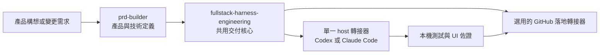
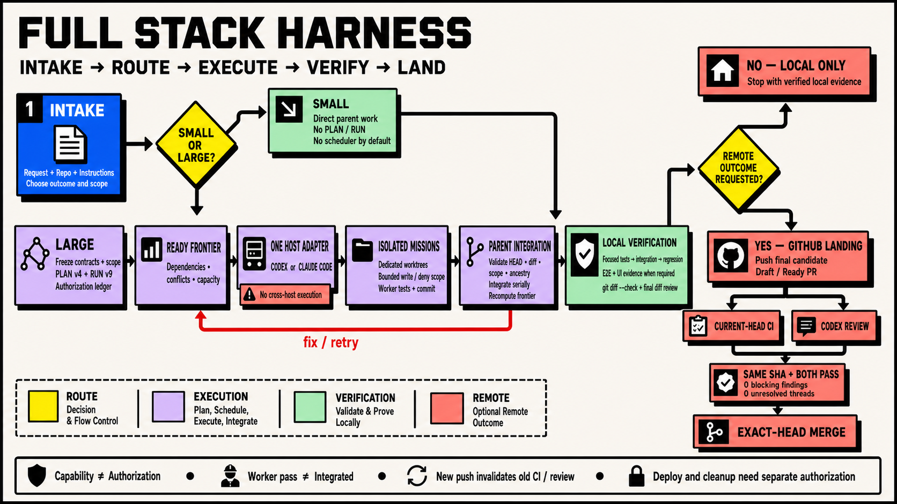

<p align="center">
  
</p>

<p align="center">
  <a href="README.md">English</a> | <strong>繁體中文</strong> | <a href="README.zh-CN.md">简体中文</a>
</p>

<p align="center">
  <a href="https://github.com/Phlegonlabs/fullstack-goal-dev/actions/workflows/harness-ci.yml"></a>
  
  
  
  
</p>

# Full Stack Harness

私有技能市集，讓你用 Codex 或 Claude Code 把產品構想或變更需求轉化為經過驗證的交付流程。

它不是提示詞集合。這個外掛把產品定義、視覺設計、工程執行與 GitHub 落地拆開，讓每個階段都有單一真實來源、清楚的交接邊界，以及自己的驗證方式。

> 定義產品。把設計做具體。只執行已就緒的工作。每次移交前，都驗證實際結果。

## 從這裡開始

| 你目前有什麼 | 從哪個技能開始 | 會得到什麼 |
| --- | --- | --- |
| 一個產品構想 | `prd-builder` | 需求、架構、技術選型與線框圖 |
| 既有儲存庫中的明確變更 | `fullstack-harness-engineering` | 小型工作直接實作；大型工作進入受管的 PLAN/RUN 流程 |
| 已驗證、需要送上 GitHub 的本機候選版本 | `fullstack-harness-github-landing` | 綁定當前 head 的推送、PR、CI／審查收斂與精確合併 |

這些技能可以單獨使用。不是每個任務都要跑完整條流程。

## 核心保證

- **小型工作維持精簡。** 一個有界變更只走檢查、實作、驗證與審查。
- **大型工作明確記錄。** PLAN v5 定義 typed graph；RUN v10 記錄授權、嘗試、佐證與落地狀態。
- **Worker 彼此隔離。** 寫入任務使用獨立 worktree 與有界範圍；parent 會驗證每個回傳的 commit 與 diff。
- **有能力不等於有權限。** 即使執行環境能推送、合併、部署或清理，每個動作仍需要精確授權。
- **佐證跟著 SHA。** 新的推送會讓舊 head 的 CI、審查、部署與 UI 佐證失效。
- **部署是獨立生命週期。** 開發與正式環境使用分離的資料、密鑰、認證、付款模式與驗證。

## 包含的內容

| 技能 | 適用情境 | 主要產出 |
| --- | --- | --- |
| `prd-builder` | 產品探索、需求、架構、前端技術選型，以及低保真線框圖 | `PRD.md`、`architecture.md`、`stack-decisions.md`、`wireframes.md` |
| `fullstack-harness-engineering` | 共用的規模判定閘、PLAN/RUN、授權、本機驗證，以及整合 | 直接動手、`RUN.md`，或 `PLAN.md` + `RUN.md` |
| `fullstack-harness-codex` | 左側欄的獨立 Codex 任務、每個 mission 一個由 app 管理的 worktree，以及各任務自己的唯讀 Multi-agent 輔助 | 執行環境啟動指令與 worker 結果 |
| `fullstack-harness-claude-code` | Claude Dynamic Workflow 與由 parent 管理的 worktree | 執行環境啟動指令與 worker 結果 |
| `fullstack-harness-github-landing` | 最終 head 推送、PR、並行 CI/審查，以及對齊 head 的合併 | 遠端落地的佐證 |

交付核心在啟動受管編排之前，會先做一個規模決策：

- 小型工作維持直接動手，預設不啟用 planner、scheduler、PLAN/RUN、subagent，也不做外部執行環境的預檢。
- 大型工作進入受管規劃。它可以用 `RUN.md` 走循序交付，或用 `PLAN.md` 加 `RUN.md` 處理多任務與可持久的交棒。
- 只有在大型計畫至少有兩個彼此獨立、已就緒的任務時，scheduler 才會開始扇出。核心接著只載入一個 host 轉接器；只有在選定路線需要時，才對外部執行環境做預檢。
- 本機的實作、分支與提交工作不會載入 GitHub 轉接器，也不會等待遠端 CI。Pull request 交付會推送最終驗證過的候選版本，並同時評估當前 head 的 CI 與 Codex 審查。

規模指的是協調範圍與影響半徑，而不是原始的檔案或行數。如果小型工作長大了，Harness 會保留已完成的部分，只針對剩下的部分重新規劃。

## 各部分如何組合在一起



你可以從任何階段開始。舉例來說，可以只用 Harness 修既有的 app，或在 PRD 已存在時只用設計技能。這些技能各司其職：PRD 技能不會自行發明設計系統，設計技能也不會撰寫交付計畫。

## 交付模型

Harness 是圍繞明確的邊界所打造的：

1. 檢視目前的專案，找出需要做的工作。
2. 凍結相關的契約、來源、範圍與驗證步驟。
3. 當任務大到需要時，先規劃相依關係，再開始實作。
4. 只有在工作彼此獨立、隔離且經過明確授權時，才使用平行 worker。
5. 驗證任務結果、整合、相關的 UI 流程，以及最終的 diff。
6. 除非有人要求遠端結果，否則停在本機；要遠端時，只能透過儲存庫的 PR 流程落地，且每個 GitHub 動作都要各自取得授權。

對於有計畫支撐的工作，它會記錄任務範圍、相依關係、worker 歸屬、驗證指令，以及各動作專屬的授權。測試通過並不代表授權推送、開 PR、審查動作、合併、部署或清理。

<p align="center">
  
</p>

<p align="center"><sub>流程示意圖。標準行為以已安裝的技能與目前的 PLAN／RUN schema 為準。</sub></p>

## 輕量的執行環境與落地轉接器

共用核心掌管唯一的 PLAN/RUN 控制平面。執行環境專屬的啟動細節採延遲載入：

- Codex host 只載入 `fullstack-harness-codex`，也只執行 `codex` provider 的 PLAN 節點。
- Claude Code host 只載入 `fullstack-harness-claude-code`，也只執行 `claude_code` provider 的 PLAN 節點。
- 兩個轉接器都無法呼叫另一個執行環境。若某個已就緒節點的 provider 與當前 host 不符，會被回報為因 provider 不符而受阻，留給由對應轉接器主持的執行去處理。
- `fullstack-harness-github-landing` 只在明確需要推送、PR、CI、審查、合併或儲存庫設定等結果時才載入。

共用的 script、schema、參考文件與範本仍放在 `fullstack-harness-engineering` 底下；轉接器只是連結到它們，而不會各自夾帶重複的執行環境。這讓預設提示詞維持精簡，也避免在純本機工作時觸發遠端驗證。

在遠端交付時，最終的本機候選版本只推送一次。GitHub Actions 與 Codex 審查會作為同一個 PR head 的並列閘一起啟動或被觀察，並且並行輪詢。任何新的推送都會讓兩者失效，而合併仍要求兩者在同一個 SHA 上都通過。

## 圖引擎與 Dynamic Workflow

這些技能使用兩層圖：

- **org 圖**是穩定的角色契約：產品、架構、UX、設計系統、mission-worker、reviewer、審批、整合，以及生命週期職責。
- **work 圖**是單次執行的暫時性任務圖。PRD 與設計工作流只有在 host 能夠強制套用 `builder_readonly` 工具設定檔時，才會使用有界的分析圖；否則會退回循序的 parent。工程流則使用標準的 PLAN v5 圖與 RUN v10 狀態。

訪談與審批留在執行中的工作流之外，因為 Claude Code Dynamic Workflow 無法在執行途中向使用者索取輸入。Parent 會先凍結輸入，執行一個有界的工作流，接著掌管分階段寫入、衝突解決、審批與發佈。

在工程流中，Harness 會先驗證並選出相依已就緒的 frontier，才建立或請求 worktree。原生的 Claude mission 使用位於 `.claude/worktrees/` 底下、由 parent 管理的 worktree，把每個 worker 綁到精確的批次 base，並要求在存取儲存庫前先 `EnterWorktree`。在每一條路線上，parent 都會驗證回傳的 commit 與實際的 Git diff、序列化地整合被接受的 commit，並重新計算圖的 frontier。

Claude 的各波依模型、推理強度與工具設定檔區隔：

- `mission_write` 包含 `EnterWorktree` 與有界的寫入工具。
- `code_review_readonly` 不含具寫入能力的工具。
- `visual_review_readonly` 使用精確的讀取/搜尋允許清單，審查保留下來的截圖或其他既有佐證。任何新的瀏覽器工具都必須先審核並加入設定檔，才能使用。

當 Claude Code 回傳真實的 Workflow 執行 ID 時，RUN 狀態可以保留 workflow/task ID、script digest、node group、圖/base 綁定、工具設定檔、狀態，以及可取得的度量。同一 session 內的續跑可以沿用該綁定；跨 session 的復原則從標準的 PLAN/RUN 狀態重新啟動一次新的 workflow 嘗試。

圖節點的 `allowed_providers` 必須包含實際在執行 Harness 的 host，該節點才能被選取。Claude Code 不能把節點委派給 Codex，Codex 也不能把節點委派給 Claude Code；兩者之間沒有跨 host 的橋接。若某個已就緒節點的 provider 與當前 host 不符，會被記錄為因 provider 不符而受阻，留給由對應轉接器主持的執行去處理。

## 發佈與部署安全

交付圖把部署視為第一級、且需要獨立授權的生命週期：

- 可部署產品會在計畫中記錄 provider、目標環境、指令、migration、前置條件與部署後檢查。
- Cloudflare 專案使用同一份 codebase，但 `development` 與 `production` Worker 完全分離；D1、KV、R2、queue、Durable Object、密鑰、認證、付款模式、route 與 webhook 也分環境設定。
- 預設的 Cloudflare 模型使用綁定精確 SHA 的 GitHub Actions dispatch。開發環境綁定已 review 的 `development` head；正式環境綁定經使用者審批升版後產生的 `production` head。
- 選用的 Cloudflare Workers Builds 模型可以把持久的 `development` 與受保護的 `production` 分支自動部署到對應 Worker。只有明確選用時才啟用，也不會與 dispatch 模型混用。
- Day-one bootstrap 只建立已確認需要的環境資源與 Worker shell。真正部署功能程式碼仍需要目標環境專屬授權。
- `docs/deployment.md` 保存給維護者閱讀的拓樸與設定；RUN 仍是機器可讀的執行紀錄。
- 行動裝置與桌面交付同樣分離 development／beta 與 production 的憑證、後端、商店軌道與發佈佐證，不會硬套 Cloudflare 格式。

## 安裝

這是一個私有的 GitHub 市集。你需要有 `Phlegonlabs/fullstack-goal-dev` 的存取權、完成 GitHub CLI 認證，並且安裝 Codex、Claude Code，或兩者皆有。

```bash
gh auth login
gh auth setup-git
git ls-remote https://github.com/Phlegonlabs/fullstack-goal-dev.git HEAD
```

### 最快安裝方式

```powershell
git clone https://github.com/Phlegonlabs/fullstack-goal-dev.git
Set-Location .\fullstack-goal-dev
pwsh -File .\scripts\update-private-skills.ps1
```

接著開啟新的 Codex 任務，或重新載入 Claude Code。確認外掛已出現在清單中：

```powershell
codex plugin list
claude plugin list
```

### 單一指令更新器

共用更新器會偵測已安裝的執行環境、新增或更新市集，並在支援的地方安裝外掛。這個儲存庫更新後，重跑同一個指令即可。

Windows PowerShell：

```powershell
Set-Location .\fullstack-goal-dev
pwsh -File .\scripts\update-private-skills.ps1
```

搭配 PowerShell 7 的 macOS 或 Linux shell：

```bash
cd fullstack-goal-dev
pwsh -File ./scripts/update-private-skills.ps1
```

更新後請開一個新的 Codex 任務。更新 Claude Code 的外掛後，請重新載入或重啟 Claude Code。

### 直接在 Codex 中安裝

```bash
codex plugin marketplace add Phlegonlabs/fullstack-goal-dev --ref main
codex plugin add fullstack-harness@fullstack-goal-dev
codex plugin list
```

### 直接在 Claude Code 中安裝

```bash
claude plugin marketplace add Phlegonlabs/fullstack-goal-dev --scope user
claude plugin install fullstack-harness@fullstack-goal-dev --scope user
claude plugin list
```

外掛安裝完成後，執行 `/reload-plugins` 或重啟 Claude Code。

### 開發期間使用本機 checkout

當你要測試這個儲存庫中的變更時，使用本機市集。不要在同一時間用同一個名稱同時註冊本機與 GitHub 市集。

```powershell
$repo = (Resolve-Path .).Path
codex plugin marketplace add $repo
codex plugin add fullstack-harness@fullstack-goal-dev
claude plugin marketplace add $repo --scope user
claude plugin install fullstack-harness@fullstack-goal-dev --scope user
```

## 常見提示詞

Codex 接受下列的 `$skill-name` 寫法。在 Claude Code 中，請呼叫已安裝、帶命名空間的技能，例如 `/fullstack-harness:prd-builder`，或直接用名稱指定。

```text
Use $prd-builder to turn this idea into a PRD, architecture, stack decisions, and wireframes.
```

```text
Use $prd-builder to add the design system to docs/product/ from the existing PRD.md and wireframes.md.
```

```text
Use $fullstack-harness-engineering to review the existing app, plan the required work, and stop before implementation.
```

```text
Use $fullstack-harness-engineering to implement the approved plan. Create a branch and commit the verified change, but do not push or open a PR.
```

```text
Use $fullstack-harness-engineering to deliver this through a Draft PR. Request current-head CI and Codex review, but stop before merge or deployment.
```

若要進行多任務交付，請在需求中說清楚預期的本機與遠端結果。建立分支、提交、整合、儲存庫設定、推送、建立 PR、審查管理、合併、部署、移除 worktree 與刪除分支，都是各自獨立的動作。

## Codex 與 Claude Code 的執行

Harness 記錄的是實際的執行環境能力，而不是從已安裝的 CLI 去假設一個。

| 執行環境 | 偏好的平行路線 | 退回方案 |
| --- | --- | --- |
| Codex app（`fullstack-harness-codex`） | 在隔離、由 app 管理的 worktree 中執行 app 任務 | 直接使用 subagent，再退到單一循序的 parent |
| Claude Code（`fullstack-harness-claude-code`） | 使用對齊 base、由 parent 管理的 `.claude/worktrees/` worktree 執行 Dynamic Workflow | 直接使用 subagent，再退到單一循序的 parent |

在 Codex 中，偏好的路線分成兩層：每個選中的 mission 先在左側欄開一個獨立的 top-level conversation，並綁定自己的 app-managed worktree；接著由該任務執行自己的有界 Multi-agent 輔助。Coordinator 直接建立的 subagent 不能取代這些 top-level 任務。若 project/thread 工具一開始尚未載入，轉接器會先從目前的 Codex 工具介面找出它們，再考慮退回方案。當使用者明確要求這個結構時，缺少 thread 能力是 blocker，不能把工作縮回同一個 conversation。

目標 repo 自己的 branch 與 PR 規則優先。只有在 repo 未定義其他流程時，mission worktree 才預設從目前的 `development` SHA 開始，完成綁定當前 head 的唯讀 review 後整合回 `development`，並在最後明確審批後才開始 `development -> production` 升版；若有修正，必須對新 head 重新 review。

每個轉接器只執行那些允許 provider 包含自身 host 的 PLAN 節點；沒有跨 host 的路線。若某個節點需要另一個 host 的 provider，會被回報為因 provider 不符而受阻，而不會在這裡執行。

平行實作預設沒有固定的小上限；設定中的寫入 worker 上限刻意設得很高，實際的波次是由觀察到的 worker 名額、隔離容量，以及相依已就緒、無衝突的 frontier 大小來界定。每個 worker 都需要隔離的工作區、有界的寫入範圍、一個 verifier，以及明確的授權。Worktree 只有在選出就緒 frontier 之後才會配置。原生的 Claude mission 會進入分派給它的、由 parent 管理的 worktree。Worker 絕不編輯 parent 的 `PLAN.md` 或 `RUN.md`，也不推送、開 PR、合併、部署或移除 worktree。Parent 掌管整合以及每一個落地或生命週期動作。

## 儲存庫結構

```text
.agents/skills/                   標準技能來源
plugins/fullstack-harness/skills/ 產生的外掛副本；請勿直接編輯
.agents/plugins/marketplace.json  Codex 市集定義
.claude-plugin/marketplace.json   Claude Code 市集定義
assets/                           README 封面與流程圖
scripts/sync_plugin_skills.py     把標準技能複製進外掛套件
scripts/update-private-skills.ps1 更新已安裝的市集與外掛
.github/workflows/harness-ci.yml  契約、單元與 E2E 檢查
```

## 維護市集

只編輯 `.agents/skills/` 中的標準來源，接著同步並驗證產生出來的外掛套件。

```bash
python scripts/sync_plugin_skills.py
python scripts/sync_plugin_skills.py --check
python -m unittest discover -s .agents/skills/fullstack-harness-engineering/scripts/tests -v
python -m unittest discover -s .agents/skills/prd-builder/scripts/tests -v
git diff --check
```

發佈之前，請在兩份外掛 manifest 與 `.claude-plugin/marketplace.json` 中更新一致的版本號、檢視完整的 diff，並使用儲存庫的 PR 流程。不要直接推送到 `main`。

## 安全性與資料安全

- 別把 GitHub token 及其他憑證放進這個儲存庫。
- 更新器使用你既有的 GitHub CLI session；它不會在專案裡儲存 token。
- 在確認外掛能正確載入之前，別刪掉舊的獨立技能副本。
- 編排技能對於每一個會改變狀態的 GitHub 或生命週期動作，都要求明確授權。

## 版本紀錄

每次發佈都要更新這一節，並搭配上面說明的版本號提升。

- **0.2.0** — 預設每個 mission 一個 worktree；PLAN-v4 typed graph，支援多 reviewer 扇出；Cloudflare 的 dispatched-deploy 與 Auto-Deploy（原生 Git 自動部署）發佈模型；持久的整合分支；以逐頁通用 HTML 樣稿取代已退役的 page UI matrix；行動裝置／桌面平台支援，包含一份專屬的行動裝置技術選型指南（原生 iOS/Android、Flutter、React Native/Expo）；透過 `.env.example` 產生環境密鑰的 scaffolding；為有界／機械式的委派工作新增 Haiku 成本層級。
