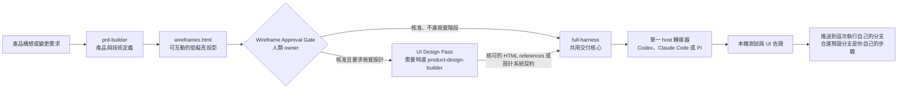

<p align="center">
  
</p>

<p align="center">
  <a href="README.md">English</a> | <strong>繁體中文</strong> | <a href="README.zh-CN.md">简体中文</a>
</p>

<p align="center">
  <a href="https://github.com/Phlegonlabs/fullstack-goal-dev/actions/workflows/harness-ci.yml"></a>
  
  
  
</p>

# Full Stack Harness

私有技能儲存庫，讓你用 Codex、Claude Code、Pi 或任何會探索使用者 skills 目錄的 host，把產品構想或變更需求轉化為經過驗證的交付流程。

它不是提示詞集合。這套技能把產品定義、視覺設計與工程執行拆開，讓每個階段都有單一真實來源、清楚的交接邊界，以及自己的驗證方式。

> 定義產品。把設計做具體。只執行已就緒的工作。每次移交前，都驗證實際結果。

## 從這裡開始

| 你目前有什麼 | 從哪個技能開始 | 會得到什麼 |
| --- | --- | --- |
| 一個產品構想 | `prd-builder` | 需求、UI 產品的低擬真互動線框稿、架構、技術選型、發佈目標、測試義務，以及附來源的市場研究 |
| 已核准線框稿、需要視覺設計的套件 | `prd-builder` UI Design Pass；gate 判定 required 時再進 `product-design-builder` + `frontend-design` | 核准的視覺方向——在 web 上是保留於 `docs/design/ui-references/` 的高擬真 HTML references——以及需要時具約束力的設計系統契約 |
| 既有儲存庫中的明確變更 | `full-harness` | 小型工作直接實作；大型工作進入受管的 PLAN/RUN 流程 |

這些技能可以單獨使用。不是每個任務都要跑完整條流程。

## 核心保證

- **小型工作維持精簡。** 一個有界變更只走檢查、實作、驗證與審查。
- **大型工作明確記錄。** PLAN v6 定義 typed graph；RUN v11 記錄授權、嘗試與佐證。
- **產品定義止於人工關卡。** UI 產品以一份可互動的低擬真 `wireframes.html` 作結，由 owner 核准；視覺設計與實作只在明確要求後繼續。
- **視覺目標是真正的 HTML。** 受要求的 web 視覺階段會用載入的設計技能產出高擬真 HTML，把核可的 references 保留在 `docs/design/ui-references/`，被取代的組合採歸檔而非刪除；Harness 依每頁核可的 HTML reference 實作。
- **Worker 彼此隔離。** 寫入任務使用獨立 worktree 與有界範圍；parent 會驗證每個回傳的 commit 與 diff。
- **有能力不等於有權限。** 即使執行環境能推送或清理，每個動作仍需要精確授權。
- **佐證跟著 SHA。** 新的 commit 會讓舊 head 的閘門與 UI 佐證失效。
- **預設只在本機完成。** Harness 負責 commit 並驗證本機結果；只有明確的遠端意圖才會授權推送這次執行自己的分支。把它合進預設分支是你自己的步驟。

## 包含的內容

| 技能 | 適用情境 | 主要產出 |
| --- | --- | --- |
| `prd-builder` | 產品探索、需求、Builder UX Direction 輸入、UI 產品的低擬真互動線框稿、架構、技術選型、發佈目標、測試義務、草稿完成後的市場研究補缺，以及 web 路線會產出保留高擬真 HTML references 的選用 UI Design Pass | `PRD.md`、`wireframes.html`（UI 產品）、`architecture.md`、`stack-decisions.md`、`market-research.md` |
| `product-design-builder` | 將已核准的 UI Design Handoff 編譯成凍結的設計系統契約。它必須載入獨立的 `frontend-design` 技能；依賴無法使用時會停止。 | `design-system.md`、`design-system.json` |
| `full-harness` | 共用的規模判定閘、PLAN/RUN、授權、本機驗證與整合，外加 runtime adapter 參考文件（`references/runtime-adapters.md`）：一份共用契約，加上每個 host（Codex、Claude Code、Pi 或 generic）各一段 provider 段落 | 直接動手，或 `PLAN.md` + `RUN.md` |

交付核心在啟動受管編排之前，會先做一個規模決策：

- 小型工作維持直接動手，預設不啟用 planner、scheduler、PLAN/RUN、subagent，也不做外部執行環境的預檢。
- 大型工作進入受管規劃。它可以用 `PLAN.md` 加 `RUN.md` 走受管循序交付，或處理多任務與可持久的交棒；`tasks.md` 是按需產生的人類視圖，不是必要狀態。
- 選擇器會在實際選中的安全寫入 mission 少於兩個時派生 `managed_sequential`，達到兩個或更多時派生 `parallel_graph`。只有後者才啟用 scheduler 扇出；runtime driver 仍是獨立的傳輸事實。核心只套用 runtime adapter 參考文件裡對應偵測到的 host 的那一個 provider 段落；只有在選定路線需要時，才對外部執行環境做預檢。
- 工作不需要等待遠端 CI。執行通常以驗證過的本機佐證結束；只有明確的遠端結果才會把驗證過的整合 head 推送到這次執行自己的分支。

規模指的是協調範圍與影響半徑，而不是原始的檔案或行數。如果小型工作長大了，Harness 會保留已完成的部分，只針對剩下的部分重新規劃。

## 各部分如何組合在一起



你可以從任何階段開始。舉例來說，可以只用 Harness 修既有的 app。各技能各司其職：`prd-builder` 定義產品並止於核准的 `wireframes.html`，選用的 UI Design Pass 與 `product-design-builder` 定義視覺契約——在 web 上，pass 會把核可的高擬真 HTML references 留在 `docs/design/ui-references/<run-id>/`，被取代的組合搬進 `docs/design/archived/`——Harness 實作已凍結的結果。

### 完整技能生命週期

三個 skill 的完整生命周期，包含每個閘門與橫切機制：

```mermaid
flowchart TB
    user([使用者想法或變更請求])

    subgraph PRD["prd-builder — 產品定義"]
        direction TB
        interview[結構化訪談<br/>3 段 free-text + AskUserQuestion]
        pkg["核心套件起草<br/>PRD.md + architecture.md<br/>+ stack-decisions.md"]
        wf["wireframes.html<br/>單一互動式低保真檔（UI 產品）"]
        wgate{{"Wireframe Approval Gate<br/>（人工核可 = 完整停點）"}}
        interview --> pkg --> wf --> wgate
        mr["market-research.md<br/>（gap pass，可跳過）"]
        pkg -.-> mr
    end

    subgraph DESIGN["視覺設計（可選；owner 明確要求才進場）"]
        direction TB
        taste["UI Design Pass<br/>依 Skill Bindings 槽位選 taste skill"]
        handoff[UI Design Handoff]
        dgate{{"Design System Need Gate"}}
        pair["product-design-builder<br/>design-system.md + design-system.json"]
        taste --> handoff --> dgate
        dgate -->|required| pair
        dgate -->|not_required| target[核可的 page-faithful target]
    end

    subgraph HARNESS["full-harness — 交付核心"]
        direction TB
        route["System Review And Route<br/>（parent-only、read-only）"]
        size{{"Project Size Gate"}}

        subgraph DIRECT["Direct 路線（small）"]
            direct_impl["直接實作 -> 本地驗證<br/>-> 審查 -> 授權 Git 動作"]
        end

        subgraph MANAGED["Managed 路線（large）"]
            direction TB
            plan["PLAN v6<br/>typed graph：missions / reviews / gates<br/>allowed_providers + 原子 task commit"]
            newrun["new_run.py 產生<br/>RUN v11 + 12 鍵授權 ledger"]

            subgraph LOOP["執行迴圈（每個 wave）"]
                direction TB
                lock["--session-id acquire-run-lock<br/>（run lock + heartbeat）"]
                obs["record-observation<br/>live-Git 快照"]
                sel["select_ready_nodes.py<br/>確定性 frontier 選擇"]
                accept["accept-wave<br/>（batch base 綁定）"]
                adapters["runtime-adapters.md<br/>偵測 host -> 載入對應 provider 段"]
                lease["lease-worker<br/>（worktree + lease + graph 綁定）"]
                workers["fresh bounded workers<br/>（Codex / Claude Code / Pi / generic）"]
                vr["validate_result.py<br/>對 live Git 事實驗證"]
                review["exact-head review<br/>（reserve -> reviewer -> record）"]
                integ["record-integration<br/>（序列整合；同 tree 可跳過 unified review）"]
                lock --> obs --> sel --> accept --> adapters --> lease --> workers --> vr --> review --> integ
            end

            plan --> newrun --> LOOP
            gates2["廣域 final validation<br/>（E2E / 回歸 / UI 證據矩陣）"]
            LOOP --> gates2
        end

        route --> size
        size -->|small| DIRECT
        size -->|large| MANAGED
    end

    subgraph DEPLOY["部署（git-connected 平台）"]
        direction TB
        push["授權 push<br/>run 分支"]
        preview["Preview 自動部署<br/>（平台按 push 建置）"]
        merge([使用者合併到 main])
        prod["Production 部署<br/>（平台從 main 建置）"]
        check["部署後驗證（唯讀）<br/>check_deployment.py"]
        push --> preview --> merge --> prod --> check
    end

    subgraph CROSS["橫切機制（貫穿各階段）"]
        bindings["Skill Bindings<br/>（AGENTS.md 槽位表 + SHA-256 pin）"]
        ledger["授權 ledger<br/>12 個獨立動作鍵"]
        ver["版本閘 + contract digest<br/>（compatible_old 波界）"]
        watch["watchdog + reconcile<br/>（中斷恢復）"]
    end

    user --> interview
    wgate -->|繼續視覺設計| DESIGN
    wgate -->|止於此| HARNESS
    pair --> route
    target --> route
    mr --> route
    DIRECT --> push
    gates2 --> push
```



兩個人工停點框住 agent 可執行的範圍：Wireframe Approval 與合併到 `main`。執行迴圈是系統的心臟——其中每一步都是原子、驗證過的 RUN 寫入。

## 交付模型

Harness 是圍繞明確的邊界所打造的：

1. 檢視目前的專案，找出需要做的工作。
2. 凍結相關的契約、來源、範圍與驗證步驟。
3. 當任務大到需要時，先規劃相依關係，再開始實作。
4. 只有在至少兩個安全寫入 mission 實際被選中、工作彼此獨立且隔離，並且每個動作都經過明確授權時，才使用平行 worker；受管循序路線仍要證明隔離 writer、scope/head 與 review gates。
5. 驗證任務結果、整合、相關的 UI 流程，以及最終的 diff。單一 mission 不會憑空增加跨 mission batch gate。
6. 預設帶著驗證過的本機佐證停下。若明確要求遠端結果，只有在明確遠端意圖以及精確的分支/head 推送授權下，才推送這次執行自己的分支。開 PR、合併與部署都是你在 Harness 之外自己做的步驟。

對於有計畫支撐的工作，它會記錄任務範圍、相依關係、worker 歸屬、驗證指令，以及各動作專屬的授權。測試通過並不代表授權推送、移除 worktree 或刪除分支。RUN-v11 的推送還需要明確的遠端意圖、唯一的整合分支目標與目前 head 授權；若預設分支身分未知，推送會安全失敗，但不會阻止無關的本機執行。


## 輕量的執行環境轉接器

共用核心掌管唯一的 PLAN/RUN 控制平面。執行環境專屬的啟動細節放在同一份參考文件 —— `full-harness/references/runtime-adapters.md` —— 內含一份共用轉接契約，加上每個 host 一段 provider 段落，按需套用：

- 每個 host 只套用自己的 provider 段落，也只執行 `allowed_providers` 包含該 host 的 PLAN 節點。
- Pi host 沿用 Pi 已安裝的角色、模型與 fallback 設定。
- 任何 provider 段落都無法呼叫另一個執行環境。若某個已就緒節點的 provider 與當前 host 不符，會被 deferred with `runtime_unavailable`，留給由對應 host 主持的執行去處理。
- 未來新增一個執行環境 host，只是在這份參考文件加一段 provider 段落，不需要新增 skill。

共用的 script、schema、參考文件與範本仍放在 `full-harness` 底下；各 provider 段落只是連結到它們，而不會各自夾帶重複的執行環境。這讓預設提示詞維持精簡。

一次執行只有一個 active host。same-repository handoff 只有在 Host A 關閉 wave、且 `RUN.active_wave.status` 既不是 `active` 也不是 `proposed` 後才允許；`active_wave` 物件仍保留在 RUN 中，不能把物件缺失當成交接訊號：Host B 保留 PLAN/RUN 與 graph state，重新探測 runtime，並在選取下一波前審查目前的 exact SHA。若需要修復，路由回 Host A 且舊 review 立即失效；除非未來 schema 增加可攜式的儲存庫／狀態身分，否則不支援 cross-machine handoff。

## 圖引擎與 Dynamic Workflow

這些技能使用兩層圖：

- **org 圖**是穩定的角色契約：產品、架構、UX、設計系統、mission-worker、reviewer、審批、整合，以及生命週期職責。
- **work 圖**是單次執行的暫時性任務圖。PRD 與設計工作流只有在 host 能夠強制套用 `builder_readonly` 工具設定檔時，才會使用有界的分析圖；否則會退回循序的 parent。工程流則使用標準的 PLAN v6 圖與 RUN v11 狀態。

訪談與審批留在執行中的工作流之外，因為 Claude Code Dynamic Workflow 無法在執行途中向使用者索取輸入。Parent 會先凍結輸入，執行一個有界的工作流，接著掌管分階段寫入、衝突解決、審批與發佈。

在工程流中，Harness 會先驗證並選出相依已就緒的 frontier，才建立或請求 worktree。原生的 Claude mission 使用位於 `.claude/worktrees/` 底下、由 parent 管理的 worktree，把每個 worker 綁到精確的批次 base，並要求在存取儲存庫前先 `EnterWorktree`。在每一條路線上，parent 都會驗證回傳的 commit 與實際的 Git diff、序列化地整合被接受的 commit，並重新計算圖的 frontier。

Claude Graph Workflow 會把 mixed frontier 按 homogeneous `tool_profile` 分成多個呼叫；同一組內可以使用不同模型與推理強度，但一次呼叫絕不混合寫入 mission 與唯讀 review。tool profile 是標籤與 prompt/result 契約，不是 permission-level tool removal。

- `mission_write` 要求 `EnterWorktree` 與 mission 的有界寫入契約。
- `code_review_readonly` 要求精確路徑審查與唯讀結果佐證；它不會移除繼承的工具。
- `visual_review_readonly` 使用 host 繼承的工具審查保留下來的截圖或其他既有佐證；新增瀏覽器存取必須先審核並加入設定檔契約，才能使用。

當 Claude Code 回傳真實的 Workflow 執行 ID 時，RUN 狀態可以保留 workflow/task ID、script digest、node group、圖/base 綁定、工具設定檔、狀態，以及可取得的度量。同一 session 內的續跑可以沿用該綁定；跨 session 的復原則從標準的 PLAN/RUN 狀態重新啟動一次新的 workflow 嘗試。

圖節點的 `allowed_providers` 必須包含實際在執行 Harness 的 host，該節點才能被選取。Codex、Claude Code 與 Pi 不能彼此委派節點；它們之間沒有跨 host 的橋接。若某個已就緒節點的 provider 與當前 host 不符，會被 deferred with `runtime_unavailable`，留給由對應轉接器主持的執行去處理。

## 安裝

這是一個私有儲存庫。你需要有 `Phlegonlabs/fullstack-goal-dev` 的存取權、完成 GitHub CLI 認證，並且至少有一個會探索 `~/.agents/skills/` 這類使用者 skills 目錄的 host——Codex、Claude Code、Pi 或其他都可以。

```bash
gh auth login
gh auth setup-git
git ls-remote https://github.com/Phlegonlabs/fullstack-goal-dev.git HEAD
```

### 最快安裝方式

clone 儲存庫，把三個 harness skills 複製進你的使用者 skills 目錄：

```bash
git clone https://github.com/Phlegonlabs/fullstack-goal-dev.git
cp -r fullstack-goal-dev/.agents/skills/full-harness \
      fullstack-goal-dev/.agents/skills/prd-builder \
      fullstack-goal-dev/.agents/skills/product-design-builder \
      ~/.agents/skills/
```

Windows 上改用 `Copy-Item -Recurse` 即可。之後更新就是把 `~/.agents/skills/` 下那三個目錄換成新版 checkout 的副本——沒有另外的更新腳本。會讀 `~/.agents/skills/` 的 host 在下一個新 session 就能載入；要測試本機修改，同樣從你的 checkout 複製即可。

### Zero-to-one 流程（從零開始）

1. 安裝一個受支援的 host（Codex、Claude Code、Pi 或任何會探索 `~/.agents/skills/` 的 host）與三個 harness skills，並用該 host 執行這次交付。
2. 開啟新的 host session，確認技能可見，然後呼叫 `full-harness`。
3. 讓規模閘決定直接工作或 PLAN/RUN；小型工作不要預先建立 worker。
4. 大型執行一次只保留一個 active host，並在 same-repository handoff 前關閉與審查每個 wave。

## 常見提示詞

Codex 接受下列的 `$skill-name` 寫法。在 Claude Code 或其他 host 中，直接用名稱指定技能，例如 `prd-builder`。在 Pi 中，可以使用自動找到的 project skill，或用 `--skill` 傳入技能目錄，再直接指定 `full-harness`。

```text
Use $prd-builder to turn this idea into a PRD, interactive low-fidelity wireframes for every page, architecture, stack decisions, release targets, and test obligations.
```

```text
Use $prd-builder to review the staged wireframes.html with me and record the Wireframe Approval decision before any visual or implementation work.
```

```text
The wireframes are approved; continue into visual design with $prd-builder's UI Design Pass. Render the web previews as high-fidelity HTML and retain the approved references under docs/design/ui-references/, invoking $product-design-builder only when the Design System Need Gate is required.
```

```text
Use $full-harness to implement the approved plan, building each page from its approved HTML reference in docs/design/ui-references/ within the recorded tolerance.
```

```text
Use $full-harness to review the existing app, plan the required work, and stop before implementation.
```

```text
Use $full-harness to implement the approved plan. Create a branch and commit the verified change, but do not push or open a PR.
```

```text
Use $full-harness to implement this plan and push the verified branch. I will open the PR and handle the merge myself.
```

```text
Use full-harness on this Pi host to execute this plan. Preserve Pi's installed frontend_designer, worker, reviewer, model, and fallback settings.
```

若要進行多任務交付，請在需求中說清楚預期的本機與遠端結果。建立分支、提交、整合、儲存庫設定、推送、移除 worktree 與刪除分支，都是各自獨立的動作。Harness 不會開 PR、不會合併、也不會部署——這些步驟由你自己完成。

## Codex、Claude Code 與 Pi 的執行

Harness 記錄的是實際的執行環境能力，而不是從已安裝的 CLI 去假設一個。

| 執行環境 | 偏好的平行路線 | 退回方案 |
| --- | --- | --- |
| Codex app | 在隔離、由 app 管理的 worktree 中執行 app 任務 | 直接使用 subagent，再退到單一循序的 parent |
| Claude Code | 使用對齊 base、由 parent 管理的 `.claude/worktrees/` worktree 執行 Dynamic Workflow | 直接使用 subagent，再退到單一循序的 parent |
| Pi | 在 parent 管理的 worktree 中使用已安裝的 Pi 角色，並由 Pi 選擇模型與 fallback | 單一循序的 parent |
| 其他任何 host | 由 parent 隔離的 fresh subagent | 單一循序的 parent |

在 Codex 中，每個選中的 mission 都會在左側欄開一個獨立的 top-level conversation，並綁定自己的 app-managed worktree。任何唯讀 explorer 或 reviewer 都由 Harness parent 另行作為同層節點派發；mission 任務不能建立子代理。Coordinator 直接建立的 subagent 不能取代這些 top-level 任務。若 project/thread 工具一開始尚未載入，轉接器會先從目前的 Codex 工具介面找出它們，再考慮退回方案。當使用者明確要求這個結構時，缺少 thread 能力是 blocker，不能把工作縮回同一個 conversation。

目標 repo 自己的 branch 規則優先。當 repo 未定義其他流程時，mission worktree 從目前預設分支的 SHA 開始，在綁定當前 head 的唯讀 review 通過後整合進這次執行自己的分支。執行預設以驗證過的本機結果完成；只有明確遠端結果並取得精確 branch/head 授權後才推送該分支。把它合進預設分支是你自己的步驟。若有修正，必須對新 head 重新 review。

每個 provider 段落只執行那些允許 provider 包含自身 host 的 PLAN 節點；沒有跨 host 的路線。若某個節點需要其他 host 的 provider，會被 deferred with `runtime_unavailable`，而不會在這裡執行。

平行實作預設沒有固定的小上限；設定中的寫入 worker 上限刻意設得很高，實際波次由觀察到的 worker 名額、隔離容量，以及相依已就緒、無衝突的 frontier 大小界定。一個可獨立驗證的目標對應一個 mission。每個 writer 都有明確的檔案 ownership，以及獨立、乾淨、固定基線的 worktree。共享 API、schema 與型別必須先凍結，再開始依賴它們的平行寫入。探索、寫入與 reviewer 都由 parent 作為同層節點派發；worker 與 reviewer 都不能再次分派。每個 mission 通過 exact-head review 後，由 parent 串行整合；統一整合完成後再啟動 fresh reviewers，最後只對固定候選 SHA 執行一次完整驗證。Worker 絕不編輯 parent 的 `PLAN.md` 或 `RUN.md`，也不推送、開 PR、合併、部署或移除 worktree。Parent 掌管整合以及每一個落地或生命週期動作。

## 儲存庫結構

```text
.agents/skills/                                      標準技能來源
assets/                                              README 封面
.github/workflows/harness-ci.yml                     契約、單元與 E2E 檢查
```

## 維護技能

只編輯 `.agents/skills/` 中的標準來源，接著跑驗證套件。

```bash
python -m unittest discover -s .agents/skills/full-harness/scripts/tests -v
python -m unittest discover -s .agents/skills/prd-builder/scripts/tests -v
python -m unittest discover -s .agents/skills/product-design-builder/scripts/tests -v
git diff --check
```

發佈之前，請更新 `package.json` 的版本號、三種語言 README 的 badge 與版本紀錄，以及 RUNBOOK 的 `required_harness_version` 預設值，檢視完整的 diff，並使用儲存庫的 PR 流程。不要直接推送到 `main`。

## 安全性與資料安全

- 別把 GitHub token 及其他憑證放進這個儲存庫。
- 在確認新的技能副本能正確載入之前，別刪掉舊的安裝副本。
- 編排技能對於每一個會改變狀態的 GitHub 或生命週期動作，都要求明確授權。

## 版本紀錄

每次發佈都要更新這一節，並搭配上面說明的版本號提升。

- **0.22.0** — 私有市集與外掛套件正式退休。`plugins/`、`.claude-plugin/marketplace.json`、`.agents/plugins/marketplace.json` 與 `scripts/sync_plugin_skills.py` 全數移除；`.agents/skills/` 是唯一來源，安裝與更新就是把三個 harness skills 複製進使用者 skills 目錄（`~/.agents/skills/`），跟「最快安裝方式」描述的完全一致。README 移除市集 badge、各 host 的外掛安裝指令與本機市集章節；`runtime-upgrades.md` 改為把技能同步定位成唯一的 Harness 更新面，各 host 的更新說明縮減為 host 自屬安裝器與重啟。

- **0.21.12** — SEO metadata 現在是 PRD surface contract 的一部分。每個 `UI-*` 條目記錄該 route 專屬且不重複的 `<title>` 與 meta description，加上 canonical URL、Open Graph/社交、robots 與 structured-data 決策（或明確的 `n/a — <reason>`）；整站 SEO（索引策略、sitemap 與 robots 政策、canonical 政策、預設 structured data）記在 Frontend Delivery Requirements 並帶自己的 `TEST-*` 追蹤。harness 端綁到底：實作必須如實渲染記錄的 `<head>`，缺少 SEO 紀錄是改道 `prd-builder` 的 PRD 契約缺口，UI 證據新增 rendered-head 檢查——integration head 上的 `<title>` 與 meta description 必須與 PRD 紀錄一致。這批同時移除已退休的 `update-private-skills.ps1` 單一指令更新器：per-runtime 副本已於 2026-09-03 刻意移除，安裝與更新從此就是單純的 skills 同步——把 `.agents/skills/` 的三個 harness skills 複製進 `~/.agents/skills/`——README 也不再教這個腳本。在三個具名 runtime 之外的 host 上執行現在免檢測：不是明確的 Codex、Claude Code 或 Pi 的 session 直接記 `provider: generic`，不去探測其他 runtime 的 CLI；版本閘門也不再用「拿不到 host 自身版本號」擋通用 host——載入中的 Harness release 加上所選 driver 的即時能力探測即完成觀察。種子化的 `AGENTS.md` 另新增 Commit Messages 一節，寫明訊息格式（`<type>(<scope>): <imperative summary>` 加 `Task`/`Trace`/`Verified` 尾行）、一個提交一種變更的規則與 mission 層級的 integration 提交格式，讓每個 runtime 在 commit 與 push 時寫法一致。
- **0.21.11** — UI run 現在以 Final Page-Quality Pass 收尾。Final Visual Parity Loop 之後，綁定在新增 `ui_quality_verification` 槽位的 skill（預設 `impeccable`）會在確切的 integration head 上，對每個交付的高保真頁面各跑一次 `critique` 與一次 `audit`。阻斷性發現進入既有修復預算；與凍結的 PRD、wireframes 或視覺來源衝突的發現改道 `prd-builder` 處理為 design-input delta，而不是本地改動；此步驟只用 evaluate 指令、不建立任何競爭性 product authority；綁定的 skill 不可用時該 gate 記為 `UNVALIDATED`，除非使用者明確接受否則擋下 closeout。種子化的 `AGENTS.md` Skill Bindings 表帶有這個新槽位。
- **0.21.10** — 渲染產生的 tasks view 改放在 `docs/tasks.md`，不再位於 `docs/goal/tasks.md`。`docs/goal/` 只保留權威 run 狀態（PLAN、RUN、DECISIONS、evidence）；非權威的人類閱讀 view 與 `DOCUMENTS.md`、`DEPLOYMENT.md` 同放在 `docs/`。SKILL 路由、DOCUMENTS manifest 列、renderer 說明文字、stray 檢查措辭與 pin 住的契約測試都改用新路徑。種子化的專案 `AGENTS.md` 現在直接寫明 goal 完成後的歸檔規則：擁有者宣告 goal 完成且 Closeout Bar 通過後，完成的 plan runtime（`PLAN.md`/`RUN.md` 加 evidence）即移入 `docs/goal/archived/<YYYYMMDD-HHMMSS>-<initiative-slug>/`——只搬移、不刪除，也不動 `docs/product/`。
- **0.21.9** — 來自四視角架構评审的加固清理。真實 bug 修復：RUN-v11 head 交叉檢查的後續 git 呼叫（merge-base、diff）現在會降級為錯誤條目，而不是讓 validator 崩潰。`CURRENT_SCHEMA_PAIR`/`is_current_pair` 取代八處手打的 `(6, 11)` 字面值；刪除了假的測試 patch seam 與過期的 `__all__`。selector 的「只會發出這些 deferral code」清單補齊了缺失的十一個 code 與 reviewer-tool 前綴，並有新測試把文件清單綁定到實際發出的 code。sequential-parent 綁定改為在錨點標題下定義一次（原先重複七處）、review 嘗試預算收斂到 Root-Cause Repair Escalation 一處；契約測試改為 pin 單一定義加指標句，不再凍結重複陳述。integration/bookkeeping 提交拆分定案（先 merge commit，隨後配對 bookkeeping commit），parity 修復明寫為既有預算下的普通 candidate-changing repair。約 1200 行 fixture 庫從 test_harness_manifest.py 移入 manifest_fixtures.py 並保留 re-export，canonical fixture 改從 harness_schema 讀版本號，contract_digest 的 CRLF/LF 正規化與 tests/__pycache__ 排除新增直接測試。
- **0.21.8** — 原子性現在貫穿整個 run 的提交契約，不再只是 worker 規則。任何參與者建立的每個提交都只承載一種變更：任務提交承載一個已驗證的結果，修復提交承載歸屬單一根因任務的修復，integration 提交只承載已審查的 mission heads 與協調狀態（絕不含無關修復或清理），bookkeeping 提交只承載 `PLAN.md`/`RUN.md` 檔案、絕不含產品程式碼。run 的任何一層——任務、修復、integration、wave 收尾、closeout——都不落地 catch-all 或混合提交；兩種變更就按依賴順序落兩個提交。
- **0.21.7** — UI run 現在以 Final Visual Parity Loop 收尾。最終 gate 上，每個 route-breakpoint-state 截圖都與該 run 的視覺權威比對：target-conformance 模式下把 approved HTML reference 與實作頁並排渲染比對，system-conformance 模式下以乾淨的 `check_ui_contract.py` 執行加完整截圖矩陣作為比對證據。每條 RUN-v11 `ui_evidence` 紀錄都帶有 `target_comparison`（baseline、baseline artifact、verdict）並由 harness 校驗；超出 tolerance 的差異進入最多兩輪的修復循環，仍無法解決的差異如實上報，不再改標籤了事。
- **0.21.6** — production/preview 資源分離現在有紀錄、有檢查，不再只是一句原則。部署紀錄新增 Resource Isolation 表——每個有狀態的 binding class（D1 database、KV namespace、R2 bucket、Durable Objects）各自紀錄 production 與 preview 的 resource ID——`check_deployment.py` 發現兩欄共用同一個 ID 即判失敗。契約要求在第一次 preview push 服務流量之前，把 preview environment 宣告的 bindings 與紀錄的 production ID 唯讀交叉核對；seeded 專案 `AGENTS.md` 寫明完全分離規則；前端 stack decision 也按 binding class 紀錄兩套 ID。
- **0.21.5** — Workers 的 preview 綁定隔離現在是配置出來的，不是預設就有的。契約記下：version preview URL 服務的是同一個 Worker 的新 version，並共用該 Worker 的現有 bindings——production Worker 的 version preview 會直接寫 production D1/KV/R2——因此有狀態的 preview 流量必須走 named Wrangler environment 部署的另一個具名 preview Worker，且其完整 binding 集要逐項明確宣告，因為 named environments 不繼承 bindings。非 production 的 D1/KV/R2 資源在專案建立時、第一次 preview push 之前就要建立；preview 綁到 production 資源是 blocker 而非配置偏好，這條邊界也不得依賴實驗性 flag。
- **0.21.4** — Enhancement 不再將被取代的 CSS 或舊版本視覺帶進更新後的結果。style 影響的 enhancement 更新 retained HTML reference 時，UI Design Pass 必須重新生成受影響 screen 的 style layer——在舊檔案 CSS 上追加不可審批，孤兒、重複、被覆蓋的 style block 要在 owner 審查前移除；就地編輯也要刷新 handoff 紀錄的 SHA-256 並歸檔編輯前副本。Harness 實作側現在會移除新 reference 不再包含的樣式與 class，絕不把新 reference 嫁接到舊實作的 CSS 上；refinement 流程並新增 stale-carryover 檢查：after 狀態不得出現 accepted delta 已取代的任何東西，delta 紀錄要列明每個被取代樣式及其 call site。同一套紀律覆蓋後端與 app 面——被取代的 endpoint、business rule、query、flag、job 要麼移除、要麼留下明確紀錄的相容保留；默默把舊路徑留在新路徑旁邊即是 contract violation。
- **0.21.3** — 部署紀錄新增第三種 mode：`ci_connected`——由 repo 自己的 CI workflow 在 push 時部署，取代平台 Git 連接。Cloudflare 上即 Wrangler bootstrap：`wrangler pages project create` 加上 push 觸發、跑 `wrangler pages deploy --branch` 的 workflow；branch 分流與 git_connected 完全一致（production branch 進 production，其餘 branch 進 preview URL），邊界也一樣：CI 部署不新增任何 authorization key，Harness 永不觸發它。在 Workers 上，同一個 workflow 對 production branch 跑 `wrangler deploy`、對其餘 branch 跑 `wrangler versions upload`，每個 version 各有自己的 preview URL，preview version 永不觸碰 production 流量。契約同時記下硬限制：Wrangler 建立的 Direct Upload 項目永遠不能事後轉成 git-connected；並寫明常設預設：Cloudflare 路線一律 Workers with Static Assets，Pages 只有 owner 明確決定才採用。部署後嘅唯讀驗證而家亦會將嗰次 push 嘅 preview URL 直接報喺對話入面——由 workflow 輸出或平台列表唯讀觀察得嚟,絕不自行拼湊或猜測。
- **0.21.2** — 原生 surface 與 web 同等待遇的 wireframe 與 HTML 預覽。`wireframe-guide.md` 明說原生手機／桌面 app 一樣交付單一 `wireframes.html` 審查投影（以產品自身的 size class 作為 viewport 切換），UI Preview Gate 也改為所有 UI-bearing surface——web、原生或跨平台手機、桌面——預設產出該 size class 的高保真 HTML mock，只有 HTML 無法呈現的 surface 才退回圖像生成。原生 surface 更進一步：單一自給自足的高保真 HTML 裝下每個 `UI-*` 畫面並附畫面切換器——與 `wireframes.html` 同一的單檔原則——讓 owner 在一個檔案裡審完整個 app。視覺階段的起手配方也明文化：從已核准的 PRD package 出發、兩個 skill 配套跑——`design-taste-frontend` 主導整體設計方向，`frontend-design` 執行 Taste 排除的面。
- **0.21.1** — Wireframe 參考查找與 enhancement 的 UI 影響分類。起草 `wireframes.html` 前，prd-builder 會先抓 2–4 個同類別主流活產品的頁面結構，再上 Dribbble 這類設計 gallery 找構圖參考，並把每個來源（或跳過原因）記進 `PRD.md` 的 `### Wireframe Approval`；參考只影響結構。Enhancement 流程現在會在起草前與 owner 明確分類 UI 影響（`none` / `structure` / `style` / `both`），不再預設 none：結構影響會重生成受影響的 wireframe 頁並重跑 approval gate，風格影響必須留下 owner 決定（重跑 UI Design Pass 或維持既有方向）——過期的視覺契約不再能默默發佈。UI Design Pass 現在也透過線上查找選擇 iconography——候選集封閉為 Lucide、Phosphor、Heroicons、Tabler 四套——推薦一套主力加指定備援，並在 handoff 的 `Iconography:` 行記錄引用來源——不再默默憑記憶預設某套 library。字體也比照同一套查找紀律——display/body 配對、Latin 加 CJK 涵蓋、載入策略記進 `Typography:` 行——handoff 並新增 `Color & dark mode:` 行記錄 palette 推導與深色模式範圍。前端技術選型新增 styling approach 層（Tailwind、CSS Modules、vanilla modern CSS），與其他層同樣逐列紀錄狀態與引用來源。
- **0.21.0** — browser-extension archetype 端到端支援。prd-builder 的訪談、架構與技術選型現在涵蓋 browser-extension archetype，full-harness 新增對應的平台 archetype。市場研究結論現在可以落進 `stack-decisions.md`；`architecture.md` 新增 Frontend/Backend Architecture 小節；暫定（provisional）stack 列現在會擋住發佈；`implementation-plan.md` 的排序意圖成為必填的 PLAN 輸入。
- **0.20.2** — 三份 README 新增完整技能生命週期圖：一張 mermaid 涵蓋 prd-builder → 選用視覺設計 → full-harness 的路由與每波執行迴圈（lock、observe、select、accept、adapters、lease、workers、validate、review、integrate）→ git-connected 部署，並標出橫切機制（skill 綁定、授權 ledger、版本閘、watchdog）與兩個人工停點。
- **0.20.1** — 審查後強化。lease-worker 接受真實的失敗 phase（`worker_failed`、`blocked`）並清除殘留的 `last_outcome`/`blockers`——失敗或 reconciled 的 mission 不再需要手改即可重試，`reconcile-interrupted` 不再是死路。畸形 verifier 改為回報鍵值錯誤而非 crash 驗證器。`--packet-out` 只在轉移後驗證閘通過後渲染。Run lock 在持有者自己的成功轉移時刷新心跳、時區天真/無法解析的心跳 fail-closed、非 dict `run_lock` 過不了 schema。`record-integration` 從 PLAN 圖解析節點而非命名慣例；`accept-wave` 同 id 也拒絕活躍 wave；`record-observation` 容忍死 worktree 並依 workspace 模式推導 `managed_by`。文件與閘門：AGENTS.md 驗證清單補 pyflakes、種入檢查器涵蓋自己模板的佔位符、鎖文件更正 `--session-id` 位置、driver 階梯補回 Pi、`cursor_wait` 改為 schema 標籤 `thread_poll`、worker 回報標題/File-Size-Limit 指向/種入文件清單/E2E 與 CI 模板引用修正。六個回歸測試釘住這些修復。
- **0.20.0** — 結構分解，行為全程保持（550 測試不變）。四處近似相同的 verifier-group 迴圈合併為單一 `_validate_verifier_group`；`validate_plan`（約 680 行）分解為九個 section helper；`validate_run` 瘦身約 700 行進五個 helper（`observed`、`attempt_log`、`waves`、約 400 行的 `workers`、`review_lineages`），共用區域變數顯式傳遞——剩餘的 `review_workers` 與 `runtime_capabilities` 段留待專門批次。Selector 改為每次選擇只建一次索引（`nodes_by_id`、workers-by-mission、review-workers-by-node），不再逐節點重建。每一步都以全套測試綠燈為閘。
- **0.19.1** — 程式碼簡化批次，行為完全不變（550 測試原樣通過）。移除死碼（TOOL_PROFILES、未使用的 helper/import/區域變數）；`new_run.py` 改 import 12 鍵帳本而非重複宣告；穿隧包裝器與倒裝守衛移除；source-path 四個函式合併為兩個參數化 helper；git blob 讀取器收斂至 `harness_core.read_git_blob`；`changed_files_digest` 由兩個 validator 共用；測試 git 管線收進 `manifest_fixtures`；`harness_manifest` 以 `__all__` 明示 re-export API；CI 加入 pyflakes 步驟（45 項清到 0），死碼無法再悄悄回歸。
- **0.19.0** — Runtime 提速：寫入路徑全面腳本化。`record-observation` 寫入 live-Git 觀測快照、`accept-wave` 記錄 wave 與 batch base、`lease-worker` 以一次原子驗證寫入綁定 graph/mission/task/worker/attempt、`record-integration` 對 live Git 收結 mission——取代原本讓 parent 輸出二次方增長的手工 RUN JSON 編輯。`reserve-review-dispatch --packet-out` 從記憶體中的 reserved run 直接渲染 reviewer packet（一個指令、一次驗證、省掉獨立渲染），selector 接受 `manifest_already_validated` 略過剛驗證過的重複步行；`plan_digest` 提出迴圈不再逐筆重算。
- **0.18.1** — 種入的運營文件移到 `docs/` 底下：`DEPLOYMENT.md` 與 `DOCUMENTS.md` 改發佈到 `docs/`（檢查器預設路徑跟進），repo root 只留 runtime 會自動發現的 `AGENTS.md` 與 `CLAUDE.md`。artifact lifecycle 的 root 發佈例外句隨之取消，root 禁則回到無例外。
- **0.18.0** — 最後一批技術債。PRD 的 artifact lifecycle 現在會盤點、暫存、發佈並回報種入的 root `DEPLOYMENT.md`/`DOCUMENTS.md`；`configure_project_context.py --check --require-resolved` 在種入的 `AGENTS.md` 仍有未解析佔位符時失敗，並作為發佈的最後一步；`docs/goal/DECISIONS.md` 有了定義（parent 擁有的執行中決策日誌），DOCUMENTS 清單補上 `implementation-plan.md`、歸檔文件與 DECISIONS 列；contract-digest 的遞延分支（不一致、未觀測）有測試；`check_deployment.py` 唯讀驗證部署紀錄結構；`render_tasks_view.py` 輸出狀態指紋（plan 修訂/digest、graph 修訂、wave）並提供 `--check` 過期偵測。
- **0.17.1** — 第二輪技術債清掃。`watchdog --reclaim` 正確使用 `--stale-after-minutes`、無鎖時不再重寫檔案；`--session-id` 統一放在子指令前並有明確錯誤訊息；`inspect_harness_run.py` 顯示 run lock 與 control 狀態；DOCUMENTS 清單把 design-system pair 標回 `docs/product/` 並統一 `tasks.md` 大小寫；`skip-integration-review`、`--tree-sha` 與 lock/watchdog 指令寫進正典文件和 runbook 清單；skill pins 在 resume 閘驗證；`check_skill_spec` 支援 frontmatter 接續行；必跑驗證從測試依賴安裝開始、與 CI 一致；專屬 provider 收斂為單一事實來源（`RUNTIME_DRIVER_PRIORITY`）。
- **0.17.0** — 強化與標準整理。Tier 1 技術債修畢：DOCUMENTS 清單與 TASKS 措辭回歸正典 `docs/goal/` 位置、同 tree 的 integration review skip 補上工具路徑（`record-review-attempt --tree-sha`、對 live Git 驗證的 `skip-integration-review`）、種入模板的殘留 adapter 措辭清除。新增：`check_skill_spec.py` 在 CI 强制 Agent Skills 開放規格；Skill Bindings 以 SKILL.md 的 SHA-256 釘住綁定的 skill，`check_skill_bindings.py` 重算比對（skill 變更 = 需刻意審視的 pin 更新）；耐久執行加入 run lock（`acquire/release/heartbeat-run-lock`，外來 session 被擋、15 分鐘後過期可接管）與回報中斷候選的 `watchdog` 轉移。
- **0.16.0** — PRD 流程在發佈時種入新 `AGENTS.md`，現在會順勢把 Skill Bindings 表填滿：列出該 session 看得到的本地已安裝 skills 作為各槽位候選、owner 用一個問題確認綁定、沒有候選的槽位留在隨附預設。既有的 `AGENTS.md` 絕不為此重開——綁定更新本身是一次明確的編輯。
- **0.15.0** — Skill 選擇改為專案設定而非修改 harness：種入的 `AGENTS.md` 新增 Skill Bindings 表，把階段槽位（design_direction、design_compilation、frontend_implementation）綁到安裝的 skills，隨附 skills 為預設。PRD 的 UI Design Pass 與 harness 的 UI 契約都從綁定表解析——採用新的 taste 或 frontend skill 只需改專案裡的一張表，綁定的 skill 繼承相同的模式、凍結來源與 review 閘門。
- **0.14.0** — PRD 流程現在會種入兩份 root 文件：`DEPLOYMENT.md`（平台紀錄、git connection 與 Cloudflare/Vercel/AWS 接線的人工設定清單、環境狀態表）和 `DOCUMENTS.md`（全流程文件總清單：位置、擁有者、是否 canonical）。`TASKS.md` 在 run 開始與每次接受 wave 後於 root 渲染。root 放運營文件；PRD 家族留在 `docs/product/`。
- **0.13.0** — 新增 deployment 契約：git-connected、平台抽象的部署階段——preview 綁 run 分支、production 綁預設分支（main 即 production），各平台一段（cloudflare、vercel、aws、generic，任何小寫 id 皆可）、綁定部署 SHA 的唯讀部署後驗證、只改紀錄不改流程的遷移路徑，並在專案 `AGENTS.md`/`CLAUDE.md` 種入 Deployment 段落。12-key ledger 不變；部署不新增任何授權鍵。
- **0.12.1** — runtime 升級閘新增重新編排契約：更新後，新的 session 執行 Resume Reconciliation、重新推導 frontier，並以新的 attempt 把所有未完成的節點綁到新 runtime（已完成節點永不重跑）；更換 provider 必須透過明確的 `allowed_providers` replan，絕不由升級自行推斷。
- **0.12.0** — integration review 的 skip 改以位元組相同的 tree 為準，不再限於同一個 commit：單一 mission 的 wave 以 merge commit 整合、tree 與已通過的 review 相同時，記錄 `integration.integration_tree_sha` 與 `review_workers[].tree_sha` 並跳過 unified dispatch。仍需派遣時，unified reviewer 拿到接縫導向的 packet：列出各 mission 已審 head，聚焦 merge 接縫、衝突解算與跨 mission 交互。
- **0.11.0** — Provider id 開放：任何小寫 id（市場 runtime 如 `gemini_cli`、`cursor`）在 `allowed_providers` 與 RUN `runtime_adapter` 都是 schema 合法值，直接走 generic 路線與 driver ladder，不需要改 schema；專屬 section 與 `RUNTIME_DRIVER_PRIORITY` 條目降為選用優化。generic 段落的市場 host 名稱為示意，非支援清單。
- **0.10.1** — generic provider 段落補成完整路線，任何未具名的 agent host 都能直接執行（driver 選擇、版本閘、模型傳遞、context 探索、chrome_devtools 遞延）；市集與 README 的對外描述改為適配任何 coding agent，而非只列三個命名執行環境。
- **0.10.0** — 三個 runtime adapter skill 合併為一份共用參考文件 `full-harness/references/runtime-adapters.md`，各 provider 一段章節並附新增 provider 的步驟；`fullstack-harness-codex`、`fullstack-harness-claude-code`、`fullstack-harness-pi` 自 bundle 移除（breaking）。review 可宣告 required tools，RUN 在 `runtime_capabilities.reviewer_tools` 記錄逐工具的 reviewer probe 佐證，selector 對未探測或不可用的工具改為 defer，不以 parent 的瀏覽器代替。mission 需通過 cohesion gate，每個 task 對應一個有序的 atomic commit 邊界。
- **0.9.0** — UI Design Pass 的 web 預覽路線改為預設由設計技能產出高擬真 HTML。核可的 HTML references 保留在 `docs/design/ui-references/<run-id>/`，被取代的組合歸檔到 `docs/design/archived/`；target-conformance 實作依每頁核可的 HTML reference 進行，並逐檔凍結 hash。
- **0.8.0** — 為 prd-builder 加入線框稿階段：每個 UI 產品包都會把 UI surface contract 投影成單一自包含的可互動 wireframes.html，並經人類 Wireframe Approval Gate 核可；視覺設計改為獨立、需明確要求的階段（UI Design Pass、provider 中立的 preview gate、Design System Need Gate）。product-design-builder 只編譯已核可的 UI Design Handoff。同時修復 design-system pair 檢查命令路徑、統一線框核可詞彙、讓 sync --check 忽略 runtime bytecode，並在 CI 加入 git diff --check。
- **0.7.0** — 將 managed work 升級為 PLAN v6 / RUN v11：加入 durable pause/cancel、跨 revision review lineage 與 owner grant、只含協調檔提交時不失效的 candidate head、loaded/installed contract digest、受控狀態轉移指令，以及有界 review packet。
- **0.6.0** — 為 Codex、Claude Code 與 Pi 加入共用 runtime upgrade gate。RUN-v10 會記錄 host／Harness 版本，只允許已啟動且仍相容的舊版 wave 跑到安全邊界，阻擋不相容或等待 restart 的 session，並在更新及重新 probe 後用新的 attempt 繼續未完成工作。更新器現在支援 Pi package；host binary 更新與 standalone Pi skill migration 仍需明確啟用。
- **0.5.0** — 降低 Codex、Claude Code 與 Pi 的 managed-run 開銷：加入有界 fresh context、event-driven completion、active-wave 串流 review、資源安全的平行 verifier batch、exact session cache、effort routing、較小 task slice，以及 RUN-v10 runtime telemetry。量測目標為 wall time 至少降低 75%，stretch target 為 85%；授權與 exact-SHA gate 維持不變。
- **0.4.0** — 新增 repository 內設計圖片探索，並把 Impeccable concept generation 接到 Product Design Builder 的 visual-direction gate。Creation mode 現在要求 `product-design-builder`、`impeccable` 與 `frontend-design`，同時保留現有 PRD 與三檔設計 package 作為唯一正式的產品與設計來源。
- **0.3.0** — 移除 GitHub 落地轉接器與整套部署／發佈模型。Harness 現在到「推送這次執行自己的分支」為止；把分支合進預設分支是使用者自己的步驟。授權帳本從 19 個動作縮到 12 個；`landing` 精簡為 `mode`、`remote`、`pushed_head_sha`、`continuity`；`integration.branch` 是唯一的分支欄位。移除分支保護佐證、`target_sources`、三個契約標記、`post_merge_cleanup`、`plan.release` 與 `run.targets`。
- **0.2.0** — 預設每個 mission 一個 worktree；PLAN v5 / RUN v10 typed graph，支援多 reviewer 扇出；Cloudflare 的 dispatched-deploy 與 Auto-Deploy（原生 Git 自動部署）發佈模型；持久的整合分支；以逐頁通用 HTML 樣稿取代已退役的 page UI matrix；行動裝置／桌面平台支援，包含一份專屬的行動裝置技術選型指南（原生 iOS/Android、Flutter、React Native/Expo）；透過 `.env.example` 產生環境密鑰的 scaffolding；為有界／機械式的委派工作新增 Haiku 成本層級。
