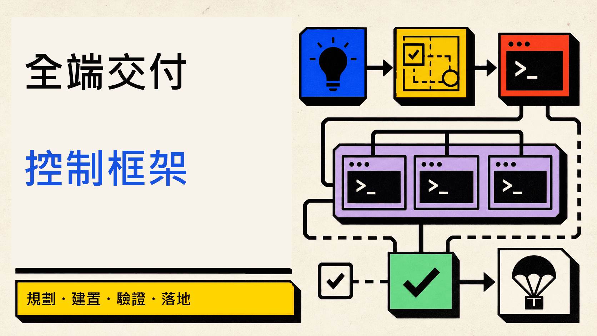
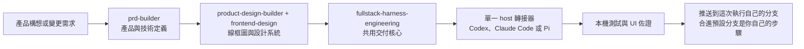
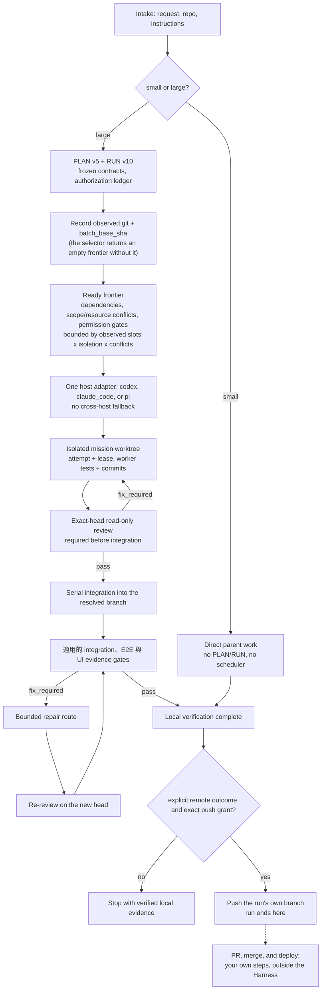

<p align="center">
  
</p>

<p align="center">
  <a href="README.md">English</a> | <strong>繁體中文</strong> | <a href="README.zh-CN.md">简体中文</a>
</p>

<p align="center">
  <a href="https://github.com/Phlegonlabs/fullstack-goal-dev/actions/workflows/harness-ci.yml"></a>
  
  
  
  
</p>

# Full Stack Harness

私有技能市集，讓你用 Codex、Claude Code 或 Pi 把產品構想或變更需求轉化為經過驗證的交付流程。

它不是提示詞集合。這個外掛把產品定義、視覺設計與工程執行拆開，讓每個階段都有單一真實來源、清楚的交接邊界，以及自己的驗證方式。

> 定義產品。把設計做具體。只執行已就緒的工作。每次移交前，都驗證實際結果。

## 從這裡開始

| 你目前有什麼 | 從哪個技能開始 | 會得到什麼 |
| --- | --- | --- |
| 一個產品構想 | `prd-builder` | 需求、架構、技術選型、發佈目標、測試義務，以及附來源的市場研究 |
| 已凍結、需要 UI 設計的產品輸入 | `product-design-builder` + `frontend-design` | 低保真線框圖與具約束力的設計系統契約 |
| 既有儲存庫中的明確變更 | `fullstack-harness-engineering` | 小型工作直接實作；大型工作進入受管的 PLAN/RUN 流程 |
| 每個分支各自的 Cloudflare Worker 預覽 | `manage-cloudflare-worker-deployments` | 安全的預覽 Worker 部署與清理，以及可選、獨立設閘的正式環境初始部署 |

這些技能可以單獨使用。不是每個任務都要跑完整條流程。

## 核心保證

- **小型工作維持精簡。** 一個有界變更只走檢查、實作、驗證與審查。
- **大型工作明確記錄。** PLAN v5 定義 typed graph；RUN v10 記錄授權、嘗試與佐證。
- **Worker 彼此隔離。** 寫入任務使用獨立 worktree 與有界範圍；parent 會驗證每個回傳的 commit 與 diff。
- **有能力不等於有權限。** 即使執行環境能推送或清理，每個動作仍需要精確授權。
- **佐證跟著 SHA。** 新的 commit 會讓舊 head 的閘門與 UI 佐證失效。
- **預設只在本機完成。** Harness 負責 commit 並驗證本機結果；只有明確的遠端意圖才會授權推送這次執行自己的分支。把它合進預設分支是你自己的步驟。

## 包含的內容

| 技能 | 適用情境 | 主要產出 |
| --- | --- | --- |
| `prd-builder` | 產品探索、需求、Builder UX Direction 輸入、架構、技術選型、發佈目標、測試義務，以及草稿完成後的市場研究補缺 | `PRD.md`、`architecture.md`、`stack-decisions.md`、`market-research.md` |
| `product-design-builder` | 產品線框圖、視覺方向與設計系統契約。它必須載入獨立的 `frontend-design` 技能；依賴無法使用時會停止。 | `wireframes.md`、`design-system.md`、`design-system.json` |
| `fullstack-harness-engineering` | 共用的規模判定閘、PLAN/RUN、授權、本機驗證，以及整合 | 直接動手，或 `PLAN.md` + `RUN.md` |
| `fullstack-harness-codex` | 左側欄的獨立 Codex 任務、每個 mission 一個由 app 管理的 worktree，以及由 parent 派發的同層 reviewers | 執行環境啟動指令與 worker 結果 |
| `fullstack-harness-claude-code` | Claude Dynamic Workflow 與由 parent 管理的 worktree | 執行環境啟動指令與 worker 結果 |
| `fullstack-harness-pi` | 在 parent 管理的 worktree 中使用 Pi subagent 角色，並由 Pi 選擇模型與 fallback | 執行環境啟動指令、實際角色／模型佐證與 worker 結果 |
| `manage-cloudflare-worker-deployments` | 自動為每個分支建立 Cloudflare Worker 預覽、受保護的清理流程，以及可選的手動正式環境初始部署 | 安裝器、生命週期腳本、測試、設定與 GitHub Actions 範本 |

交付核心在啟動受管編排之前，會先做一個規模決策：

- 小型工作維持直接動手，預設不啟用 planner、scheduler、PLAN/RUN、subagent，也不做外部執行環境的預檢。
- 大型工作進入受管規劃。它可以用 `PLAN.md` 加 `RUN.md` 走受管循序交付，或處理多任務與可持久的交棒；`tasks.md` 是按需產生的人類視圖，不是必要狀態。
- 選擇器會在實際選中的安全寫入 mission 少於兩個時派生 `managed_sequential`，達到兩個或更多時派生 `parallel_graph`。只有後者才啟用 scheduler 扇出；runtime driver 仍是獨立的傳輸事實。核心只載入一個 host 轉接器；只有在選定路線需要時，才對外部執行環境做預檢。
- 工作不需要等待遠端 CI。執行通常以驗證過的本機佐證結束；只有明確的遠端結果才會把驗證過的整合 head 推送到這次執行自己的分支。

規模指的是協調範圍與影響半徑，而不是原始的檔案或行數。如果小型工作長大了，Harness 會保留已完成的部分，只針對剩下的部分重新規劃。

## 各部分如何組合在一起



你可以從任何階段開始。舉例來說，可以只用 Harness 修既有的 app。各技能各司其職：`prd-builder` 定義產品，`product-design-builder` 使用 `frontend-design` 定義 UI 契約，Harness 實作已凍結的結果。

## 交付模型

Harness 是圍繞明確的邊界所打造的：

1. 檢視目前的專案，找出需要做的工作。
2. 凍結相關的契約、來源、範圍與驗證步驟。
3. 當任務大到需要時，先規劃相依關係，再開始實作。
4. 只有在至少兩個安全寫入 mission 實際被選中、工作彼此獨立且隔離，並且每個動作都經過明確授權時，才使用平行 worker；受管循序路線仍要證明隔離 writer、scope/head 與 review gates。
5. 驗證任務結果、整合、相關的 UI 流程，以及最終的 diff。單一 mission 不會憑空增加跨 mission batch gate。
6. 預設帶著驗證過的本機佐證停下。若明確要求遠端結果，只有在明確遠端意圖以及精確的分支/head 推送授權下，才推送這次執行自己的分支。開 PR、合併與部署都是你在 Harness 之外自己做的步驟。

對於有計畫支撐的工作，它會記錄任務範圍、相依關係、worker 歸屬、驗證指令，以及各動作專屬的授權。測試通過並不代表授權推送、移除 worktree 或刪除分支。RUN-v10 的推送還需要明確的遠端意圖、唯一的整合分支目標與目前 head 授權；若預設分支身分未知，推送會安全失敗，但不會阻止無關的本機執行。




## 輕量的執行環境轉接器

共用核心掌管唯一的 PLAN/RUN 控制平面。執行環境專屬的啟動細節採延遲載入：

- Codex host 只載入 `fullstack-harness-codex`，也只執行 `codex` provider 的 PLAN 節點。
- Claude Code host 只載入 `fullstack-harness-claude-code`，也只執行 `claude_code` provider 的 PLAN 節點。
- Pi host 只載入 `fullstack-harness-pi`，也只執行 `pi` provider 的 PLAN 節點，並沿用 Pi 已安裝的角色、模型與 fallback 設定。
- 任何轉接器都無法呼叫另一個執行環境。若某個已就緒節點的 provider 與當前 host 不符，會被 deferred with `runtime_unavailable`，留給由對應轉接器主持的執行去處理。

共用的 script、schema、參考文件與範本仍放在 `fullstack-harness-engineering` 底下；轉接器只是連結到它們，而不會各自夾帶重複的執行環境。這讓預設提示詞維持精簡。

一次執行只有一個 active host。same-repository handoff 只有在 Host A 關閉 wave、且 `RUN.active_wave.status` 既不是 `active` 也不是 `proposed` 後才允許；`active_wave` 物件仍保留在 RUN 中，不能把物件缺失當成交接訊號：Host B 保留 PLAN/RUN 與 graph state，重新探測 runtime，並在選取下一波前審查目前的 exact SHA。若需要修復，路由回 Host A 且舊 review 立即失效；除非未來 schema 增加可攜式的儲存庫／狀態身分，否則不支援 cross-machine handoff。

## 圖引擎與 Dynamic Workflow

這些技能使用兩層圖：

- **org 圖**是穩定的角色契約：產品、架構、UX、設計系統、mission-worker、reviewer、審批、整合，以及生命週期職責。
- **work 圖**是單次執行的暫時性任務圖。PRD 與設計工作流只有在 host 能夠強制套用 `builder_readonly` 工具設定檔時，才會使用有界的分析圖；否則會退回循序的 parent。工程流則使用標準的 PLAN v5 圖與 RUN v10 狀態。

訪談與審批留在執行中的工作流之外，因為 Claude Code Dynamic Workflow 無法在執行途中向使用者索取輸入。Parent 會先凍結輸入，執行一個有界的工作流，接著掌管分階段寫入、衝突解決、審批與發佈。

在工程流中，Harness 會先驗證並選出相依已就緒的 frontier，才建立或請求 worktree。原生的 Claude mission 使用位於 `.claude/worktrees/` 底下、由 parent 管理的 worktree，把每個 worker 綁到精確的批次 base，並要求在存取儲存庫前先 `EnterWorktree`。在每一條路線上，parent 都會驗證回傳的 commit 與實際的 Git diff、序列化地整合被接受的 commit，並重新計算圖的 frontier。

Claude Graph Workflow 會把 mixed frontier 按 homogeneous `tool_profile` 分成多個呼叫；同一組內可以使用不同模型與推理強度，但一次呼叫絕不混合寫入 mission 與唯讀 review。tool profile 是標籤與 prompt/result 契約，不是 permission-level tool removal。

- `mission_write` 要求 `EnterWorktree` 與 mission 的有界寫入契約。
- `code_review_readonly` 要求精確路徑審查與唯讀結果佐證；它不會移除繼承的工具。
- `visual_review_readonly` 使用 host 繼承的工具審查保留下來的截圖或其他既有佐證；新增瀏覽器存取必須先審核並加入設定檔契約，才能使用。

當 Claude Code 回傳真實的 Workflow 執行 ID 時，RUN 狀態可以保留 workflow/task ID、script digest、node group、圖/base 綁定、工具設定檔、狀態，以及可取得的度量。同一 session 內的續跑可以沿用該綁定；跨 session 的復原則從標準的 PLAN/RUN 狀態重新啟動一次新的 workflow 嘗試。

圖節點的 `allowed_providers` 必須包含實際在執行 Harness 的 host，該節點才能被選取。Codex、Claude Code 與 Pi 不能彼此委派節點；它們之間沒有跨 host 的橋接。若某個已就緒節點的 provider 與當前 host 不符，會被 deferred with `runtime_unavailable`，留給由對應轉接器主持的執行去處理。

## 安裝

這是一個私有的 GitHub 市集。你需要有 `Phlegonlabs/fullstack-goal-dev` 的存取權、完成 GitHub CLI 認證，並且至少安裝一個受支援的 host：Codex、Claude Code 或 Pi。

```bash
gh auth login
gh auth setup-git
git ls-remote https://github.com/Phlegonlabs/fullstack-goal-dev.git HEAD
```

### 最快安裝方式

```powershell
git clone https://github.com/Phlegonlabs/fullstack-goal-dev.git
Set-Location .\fullstack-goal-dev
powershell -File .\scripts\update-private-skills.ps1
```

clone 只是為了拿到這個腳本。更新器一律從 GitHub 安裝（預設是 `Phlegonlabs/fullstack-goal-dev` 的 `main`），不會讀取你目前的工作目錄。本機的修改不會透過這個方式安裝；要測試本機修改，請看下面的「開發期間使用本機 checkout」。

接著開啟新的 Codex 任務，或重新載入 Claude Code。確認外掛已出現在清單中：

```powershell
codex plugin list
claude plugin list
```

### Zero-to-one 流程（從零開始）

1. 安裝一個受支援的 host（Codex、Claude Code 或 Pi）與本外掛，並用該 host 執行這次交付。
2. 開啟新的 host session，確認外掛可見，然後呼叫 `$fullstack-harness-engineering`。
3. 讓規模閘決定直接工作或 PLAN/RUN；小型工作不要預先建立 worker。
4. 大型執行一次只保留一個 active host，並在 same-repository handoff 前關閉與審查每個 wave。

### 單一指令更新器

共用更新器會偵測已安裝的執行環境、新增或更新市集，並在支援的地方安裝外掛。這個儲存庫更新後，重跑同一個指令即可。

搭配 PowerShell 7（`pwsh`）的 Windows：

```powershell
Set-Location .\fullstack-goal-dev
pwsh -File .\scripts\update-private-skills.ps1
```

`pwsh` 要另外安裝。Windows 內建的 Windows PowerShell 5.1 也能執行這個腳本：

```powershell
Set-Location .\fullstack-goal-dev
powershell -File .\scripts\update-private-skills.ps1
```

搭配 PowerShell 7 的 macOS 或 Linux shell：

```bash
cd fullstack-goal-dev
pwsh -File ./scripts/update-private-skills.ps1
```

更新後請開一個新的 Codex 任務。更新 Claude Code 的外掛後，請重新載入或重啟 Claude Code。

### 直接在 Codex 中安裝

```bash
codex plugin marketplace add Phlegonlabs/fullstack-goal-dev --ref main
codex plugin add fullstack-harness@fullstack-goal-dev
codex plugin list
```

### 直接在 Claude Code 中安裝

```bash
claude plugin marketplace add Phlegonlabs/fullstack-goal-dev --scope user
claude plugin install fullstack-harness@fullstack-goal-dev --scope user
claude plugin list
```

外掛安裝完成後，執行 `/reload-plugins` 或重啟 Claude Code。

### 開發期間使用本機 checkout

當你要測試這個儲存庫中的變更時，使用本機市集。不要在同一時間用同一個名稱同時註冊本機與 GitHub 市集。

```powershell
$repo = (Resolve-Path .).Path
codex plugin marketplace add $repo
codex plugin add fullstack-harness@fullstack-goal-dev
claude plugin marketplace add $repo --scope user
claude plugin install fullstack-harness@fullstack-goal-dev --scope user
```

## 常見提示詞

Codex 接受下列的 `$skill-name` 寫法。在 Claude Code 中，請呼叫已安裝、帶命名空間的技能，例如 `/fullstack-harness:prd-builder`，或直接用名稱指定。在 Pi 中，可以使用自動找到的 project skill，或用 `--skill` 傳入技能目錄，再直接指定 `fullstack-harness-pi`。

```text
Use $prd-builder to turn this idea into a PRD, architecture, stack decisions, release targets, and test obligations.
```

```text
Use $product-design-builder with $frontend-design to create wireframes and the design-system contract from the approved docs/product/ product inputs.
```

```text
Use $fullstack-harness-engineering to review the existing app, plan the required work, and stop before implementation.
```

```text
Use $fullstack-harness-engineering to implement the approved plan. Create a branch and commit the verified change, but do not push or open a PR.
```

```text
Use $fullstack-harness-engineering to implement this plan and push the verified branch. I will open the PR and handle the merge myself.
```

```text
Use fullstack-harness-engineering with fullstack-harness-pi to execute this Pi-hosted plan. Preserve Pi's installed frontend_designer, worker, reviewer, model, and fallback settings.
```

```text
Use $manage-cloudflare-worker-deployments to configure safe per-branch Cloudflare Worker previews and cleanup for this repository.
```

若要進行多任務交付，請在需求中說清楚預期的本機與遠端結果。建立分支、提交、整合、儲存庫設定、推送、移除 worktree 與刪除分支，都是各自獨立的動作。Harness 不會開 PR、不會合併、也不會部署——這些步驟由你自己完成。

## Codex、Claude Code 與 Pi 的執行

Harness 記錄的是實際的執行環境能力，而不是從已安裝的 CLI 去假設一個。

| 執行環境 | 偏好的平行路線 | 退回方案 |
| --- | --- | --- |
| Codex app（`fullstack-harness-codex`） | 在隔離、由 app 管理的 worktree 中執行 app 任務 | 直接使用 subagent，再退到單一循序的 parent |
| Claude Code（`fullstack-harness-claude-code`） | 使用對齊 base、由 parent 管理的 `.claude/worktrees/` worktree 執行 Dynamic Workflow | 直接使用 subagent，再退到單一循序的 parent |
| Pi（`fullstack-harness-pi`） | 在 parent 管理的 worktree 中使用已安裝的 Pi 角色，並由 Pi 選擇模型與 fallback | 單一循序的 parent |

在 Codex 中，每個選中的 mission 都會在左側欄開一個獨立的 top-level conversation，並綁定自己的 app-managed worktree。任何唯讀 explorer 或 reviewer 都由 Harness parent 另行作為同層節點派發；mission 任務不能建立子代理。Coordinator 直接建立的 subagent 不能取代這些 top-level 任務。若 project/thread 工具一開始尚未載入，轉接器會先從目前的 Codex 工具介面找出它們，再考慮退回方案。當使用者明確要求這個結構時，缺少 thread 能力是 blocker，不能把工作縮回同一個 conversation。

目標 repo 自己的 branch 規則優先。當 repo 未定義其他流程時，mission worktree 從目前預設分支的 SHA 開始，在綁定當前 head 的唯讀 review 通過後整合進這次執行自己的分支。執行預設以驗證過的本機結果完成；只有明確遠端結果並取得精確 branch/head 授權後才推送該分支。把它合進預設分支是你自己的步驟。若有修正，必須對新 head 重新 review。

每個轉接器只執行那些允許 provider 包含自身 host 的 PLAN 節點；沒有跨 host 的路線。若某個節點需要其他 host 的 provider，會被 deferred with `runtime_unavailable`，而不會在這裡執行。

平行實作預設沒有固定的小上限；設定中的寫入 worker 上限刻意設得很高，實際波次由觀察到的 worker 名額、隔離容量，以及相依已就緒、無衝突的 frontier 大小界定。一個可獨立驗證的目標對應一個 mission。每個 writer 都有明確的檔案 ownership，以及獨立、乾淨、固定基線的 worktree。共享 API、schema 與型別必須先凍結，再開始依賴它們的平行寫入。探索、寫入與 reviewer 都由 parent 作為同層節點派發；worker 與 reviewer 都不能再次分派。每個 mission 通過 exact-head review 後，由 parent 串行整合；統一整合完成後再啟動 fresh reviewers，最後只對固定候選 SHA 執行一次完整驗證。Worker 絕不編輯 parent 的 `PLAN.md` 或 `RUN.md`，也不推送、開 PR、合併、部署或移除 worktree。Parent 掌管整合以及每一個落地或生命週期動作。

## 儲存庫結構

```text
.agents/skills/                                      標準技能來源
plugins/fullstack-harness/skills/                    產生的外掛副本；請勿直接編輯
plugins/fullstack-harness/.claude-plugin/plugin.json Claude Code 外掛 manifest
plugins/fullstack-harness/.codex-plugin/plugin.json  Codex 外掛 manifest
.agents/plugins/marketplace.json                     Codex 市集定義
.claude-plugin/marketplace.json                      Claude Code 市集定義
assets/                                              README 封面
scripts/sync_plugin_skills.py                        把標準技能複製進外掛套件
scripts/update-private-skills.ps1                    更新已安裝的市集與外掛
.github/workflows/harness-ci.yml                     契約、單元與 E2E 檢查
```

## 維護市集

只編輯 `.agents/skills/` 中的標準來源，接著同步並驗證產生出來的外掛套件。

```bash
python scripts/sync_plugin_skills.py
python scripts/sync_plugin_skills.py --check
python -m unittest discover -s .agents/skills/fullstack-harness-engineering/scripts/tests -v
python -m unittest discover -s .agents/skills/prd-builder/scripts/tests -v
python -m unittest discover -s .agents/skills/product-design-builder/scripts/tests -v
python -m unittest discover -s plugins/fullstack-harness/skills/fullstack-harness-engineering/scripts/tests -p "test_packaged_*.py" -v
git diff --check
```

發佈之前，請在兩份外掛 manifest 與 `.claude-plugin/marketplace.json` 中更新一致的版本號、檢視完整的 diff，並使用儲存庫的 PR 流程。不要直接推送到 `main`。

## 安全性與資料安全

- 別把 GitHub token 及其他憑證放進這個儲存庫。
- 更新器使用你既有的 GitHub CLI session；它不會在專案裡儲存 token。
- 在確認外掛能正確載入之前，別刪掉舊的獨立技能副本。
- 編排技能對於每一個會改變狀態的 GitHub 或生命週期動作，都要求明確授權。

## 版本紀錄

每次發佈都要更新這一節，並搭配上面說明的版本號提升。

- **0.4.0** — 新增 repository 內設計圖片探索，並把 Impeccable concept generation 接到 Product Design Builder 的 visual-direction gate。Creation mode 現在要求 `product-design-builder`、`impeccable` 與 `frontend-design`，同時保留現有 PRD 與三檔設計 package 作為唯一正式的產品與設計來源。
- **0.3.0** — 移除 GitHub 落地轉接器與整套部署／發佈模型。Harness 現在到「推送這次執行自己的分支」為止；把分支合進預設分支是使用者自己的步驟。授權帳本從 19 個動作縮到 12 個；`landing` 精簡為 `mode`、`remote`、`pushed_head_sha`、`continuity`；`integration.branch` 是唯一的分支欄位。移除分支保護佐證、`target_sources`、三個契約標記、`post_merge_cleanup`、`plan.release` 與 `run.targets`。
- **0.2.0** — 預設每個 mission 一個 worktree；PLAN v5 / RUN v10 typed graph，支援多 reviewer 扇出；Cloudflare 的 dispatched-deploy 與 Auto-Deploy（原生 Git 自動部署）發佈模型；持久的整合分支；以逐頁通用 HTML 樣稿取代已退役的 page UI matrix；行動裝置／桌面平台支援，包含一份專屬的行動裝置技術選型指南（原生 iOS/Android、Flutter、React Native/Expo）；透過 `.env.example` 產生環境密鑰的 scaffolding；為有界／機械式的委派工作新增 Haiku 成本層級。
