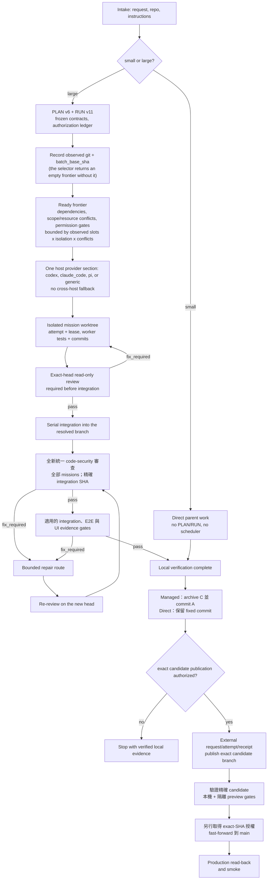

<p align="center">
  
</p>

<p align="center">
  <a href="README.md">English</a> | <strong>繁體中文</strong> | <a href="README.zh-CN.md">简体中文</a> | <a href="README.es.md">Español</a>
</p>

<p align="center">
  <a href="https://github.com/Phlegonlabs/product-delivery-harness/actions/workflows/harness-ci.yml"></a>
  
  
  
</p>

# Product Delivery Harness

技能儲存庫，讓你用 Codex、Claude Code、Pi 或任何會探索使用者 skills 目錄的 host，把產品構想或變更需求轉化為經過驗證的交付流程。

它不是提示詞集合。這套技能把產品定義、視覺設計、工程執行、程式安全審查、啟用與 release 後自然流量 review 拆開，讓每個階段都有單一真實來源、清楚的交接邊界，以及自己的驗證方式。

> 定義產品。編譯設計。交付已驗證的軟體。

## 從這裡開始

| 你目前有什麼 | 從哪個技能開始 | 會得到什麼 |
| --- | --- | --- |
| 一個產品構想 | `product-definition-builder` | 經 owner 核准的 Product Definition，包含完整 frontend/backend 架構、stack、UI 行為、release targets 與 tests |
| 已核准 Product Definition、需要 UI 設計 | `ui-design-builder` | 人工 UI/style/motion/media intake、responsive `wireframes/4`、`frontend-design` Style Integration、Impeccable HiFi review、W/H 評分、Visual Approval 與 design-system 決策 |
| 既有儲存庫中的明確變更 | `delivery-harness` | 小型工作直接實作；大型工作進入受管的 PLAN/RUN 流程 |
| 已固定並完成整合的程式候選 | `code-security-review` | 唯讀、綁定精確 SHA 的安全審查，包含經驗證的 source-to-sink 發現與明確的覆蓋缺口 |
| 已交付、需要外部設定的 release | `product-activation` | 精確授權的 console 動作、已驗證的量測來源，以及逐 target 的 activation readiness |
| 需要 SEO 或自然流量分析的 production 公開網站 | `seo-growth-review` | 唯讀技術與量測 review、按證據排序的關鍵詞／頁面機會，以及已路由的後續動作 |

七個內建技能都可以單獨呼叫；完整流程是選用的。不過每種模式仍會驗證明確宣告的輸入與依賴。

## 核心保證

- **實作前主動提供建議.** 使用者沒有技術偏好時，提出符合產品的預設建議及替代方案，涵蓋前端、部署、後端/runtime 和 agent 編排，說明相容性、成本假設與重新評估條件。Enhancement 先檢視現有 UI，展示受影響範圍的前後比較。研究 template 與 CSS 參考時檢查授權和 stack，手機介面保留原生慣例。明確要求的 hero 和動效持續追蹤至交付。Visual Approval 要求每個動效具備綁定雜湊的正常及 reduced-motion 觀察紀錄；HTML 證據只證明審閱投影。
- **小型工作維持精簡。** 一個有界變更只走檢查、實作、驗證與審查。
- **大型工作明確記錄。** PLAN v6 定義 typed graph；RUN v11 記錄授權、嘗試與佐證。
- **先核准 Product Definition，再進 UI 設計。** Research-first evidence、適用 baseline、完整 candidate、明確 recommendation choices，以及 accepted delta 都在最終 approvals 之前。每種 release surface 都由同一份封閉 applicability matrix 決定必填架構與 stack：hosted UI 需要 frontend，native UI 需要 mobile/desktop，service 與 agent 需要 backend/data/interface，CLI 需要明確 toolchain。Product 與 Stack 核准綁定 canonical content digest、結構化 revision、非未來時間，以及每個保留 open item 的精確接受引用。每個人工 review gate 都會主動提供完整待審版本的已驗證 Markdown 絕對路徑連結，並在明確核准前停止。UI 產品仍只在 owner 明確要求後進 `ui-design-builder`。 CLI 與 `other_nonpublic` 共用標準 `Toolchain` 核准 area（`CLI/toolchain` 為別名），分別記錄 language、toolchain、distribution mechanism 與 testing layers。
- **安全從 Product Definition 開始。** 所有可執行軟體——包含 static site、client、CLI 與 agent——都記錄由人員負責的 Security Requirements Gate。每條 required row 追蹤既有 PRD 需求與資安 TEST；Harness task gate 會在 commit 前實作防護措施，並用 negative tests 證明拒絕存取與沒有未授權副作用；最後仍須執行全新的 exact-SHA code-security review。

安全豁免還須有 documentation-only 產品描述與 Product Archetype，並明確記錄不存在的可執行架構介面。Required security TEST 訊號與 Harness criterion 使用 `denial: rejected (<signal>); no unauthorized side effects: unchanged (<state evidence>)`，兩項斷言皆須有具體觀測。
- **建議不等於實作權威。** 每個適用領域先提供兩到三組 coherent stack。新選擇經核准後標記 `Approved`，既有選擇是 `Selected`，硬限制是 `Required`；`Recommended` 與 `Provisional` 會阻擋 delivery。Checkpoint 的封閉 area set 必須等於適用且已解決的 areas，核准 option 的 layer map 必須等於可執行 stack rows。`render_stack_option_map.py` 會從既有 rows 產生供 owner review 的候選 map；它不能核准或改寫套件。明確 option map 以 `||...||` 包裹；僅用逗號的 legacy map 仍可讀取，但 layer 名稱或 selection 含逗號時必須使用明確形式。
- **UI 設計有獨立核准主線。** `ui-design-builder` 先完成 UI/style/motion/media intake。Schema 4 wireframe 會凍結文案與顯示契約；Wireframe 與 Visual Approval 回應會連結完整現行 HTML page/state set 與相關 design handoff，審核連結指向已授權 publication checkout 內的最終邏輯路徑，發布後再連到來源 checkout。hybrid 產品逐 `UI-*` surface 綁定 `releaseSurface`、`surfaceClass`、`captureMode` 與 responsive set。HiFi target 必須帶精確 scope、restrictive CSP，以及保留 console、network、navigation、form、popup 嘗試的人工 sandboxed-offline receipt。需要正式 design system 時走唯一窄路徑：Visual Approval 記錄 `required/pending`，compiler 驗證該核准 digest 並產生 pair，owner 再連結兩份 hash；一般 final validation 會拒絕 pending。Agent 不能代替 owner 核准。 UI 審核不要求 Docker／Podman；offline receipt 記錄的是實際執行的瀏覽器限制。
- **HiFi 頁面必須由產品控制項連通。** 新增或修訂的 `ui-hifi/2` 以 `index.html` 清單綁定同目錄 HTML 頁面的雜湊與控制項目的地。離線 `ui-output/2` 證據逐 responsive target 驗證點擊及鍵盤操作；缺頁、過期雜湊、無效控制項、錯誤目的地或未宣告跳轉均阻擋核准。每頁只能呈現分配給該頁的 surface。發布與保留須包含完整套件；schema-1 僅供讀取檢查，正式 Visual Approval 一律要求 schema 2。 指定 Git revision 凍結時，該 revision 必須包含所有子頁面且內容一致。
- **視覺品質有獨立門檻。** HiFi 的 H5（避免模板感）、H7（創意辨識度）與 H9（設計一致性）各須達到 80；總分 90 不能抵銷視覺分項不足。審查須引用已檢視的截圖與已確認的方向原則；數字驗證不代表美感或人工檢視已獲證明。
- **用代表畫面選擇方向。** 選定前，每個方向呈現相同的主要操作與壓力情境，保留已凍結內容。Direction comparison 表以路徑與雜湊綁定截圖，並驗證一個或三個方向的案例一致。人工選定後才製作完整連通 HiFi；局部研究不授權正式 UI 實作。
- **平台共享品牌，分別定義控制項。** Platform rules 逐核准平台記錄規則。iOS 明確評估 system text styles、Dynamic Type、SF Symbols 與原生操作／版面，不強制套用 Web 元件庫。HTML 僅供審稿；原生實作先以平台工具驗證代表案例，再擴展其他畫面，最後仍須完成全矩陣驗證。
- **Worker 彼此隔離。** 寫入任務使用獨立 worktree 與有界範圍；parent 會驗證每個回傳的 commit 與 diff。
- **每次執行都有紀錄，本機驗證為預設。** 新 PLAN 明確使用 `execution.isolation: "host"`，以專案工具鏈執行 build、lint、test。結果保留 exact SHA、指令身分、工作目錄、退出碼、log 與原始碼／Git 檢查。本機驗證會在最終原始碼／Git 檢查前結束其所屬子程序，逾時也會清理。本機指令循序執行且每次重跑，具有目前使用者的權限；worktree 不是作業系統沙箱。選用 `container` 時仍須通過 Docker/Podman 信任、固定映像與隔離檢查，失敗不會自動改用本機。執行前仍須 reserve，inspector 不會從 phase 推斷程序是否存活。 獨立 worker 在各自 worktree 啟動後才等待結果；本機驗證不會限制 mission 並行數。容量必須依現場觀察更新，不能沿用預設的單一 slot。
- **Runtime binding 明確可驗證。** `lease-worker` 從選取器 directive 衍生 provider、driver、model、effort 與 portable runtime axes；只有 app task 接受 `--task-thread-id`，既有精確目標可直接沿用，新精確目標只能從已啟用的 wildcard 授權 materialize，不會擴大權限。
- **有能力不等於有權限。** 即使執行環境能推送或清理，每個動作仍需要精確授權。
- **Activation 必須讀回驗證。** Activation、Outcome、SEO 會先重驗已核准的 Product/Stack bytes 與完整 Deployment contract。Outcome coverage 保留 PRD method、owner 與逐 target 精確 source map；measurement window 必須在各 target 可用之後開始。Multi-target review 只允許一種 mode，primary fields 綁第一個有序 target，既有 rows 只能 append，aggregate verdict 與 follow-up 由規則決定。
- **SEO growth 必須以證據為準。** Lifecycle SEO review 只接受精確、公開、可索引的 hosted-web production target；不同 mode 必須記錄 market、language、outcome、timezone、comparison windows 與 segmentation。逐 source 的 verified time 與共同 data-coverage boundary 分開，Search Console 與 GA4 仍分開解讀。
- **佐證跟著 SHA。** 新的 commit 會讓舊 head 的閘門與 UI 佐證失效。
- **UI 佐證證明版面，而不只是像素。** 固定到 harness 0.34.0 及之後的 RUN 會在每條 route-breakpoint-state 佐證行記錄真實瀏覽器幾何掃描的 `layout_check`；每個 UI 任務在驗收前分類影響（`none`/`style`/`structure`/`both`），被接受的 parity 偏差連同引用記入 deviation ledger，上線 motion 必須追溯 `ui-design.md` 的 Motion and Media Intent。固定到 0.35.0 及之後的 RUN 還會機器校驗 `deviation_ledger` 與逐 mission 的 `ui_impact_summary`。
- **完成的 managed run 會在晉升前收檔。** `archive_run.py` 會在 no-follow handle 下重驗 C、目前 `main`、完整 coordination inventory、evidence 與 move list，以 durable journal 執行 C→A，並在 recovery 時保留並行使用者資料。Archive-only A 先對 checkout 外部 immutable anchor 重驗；本機 agent 只準備綁定 machine policy、verifier 與 detached trusted-host evidence 的 handoff，永遠不執行 publication argv。Direct 工作保留固定 verified candidate，不虛構 PLAN/RUN archive。
- **Parity 靠實拍，不靠記憶。** hosted-browser surface 逐 route×viewport×state capture；extension、native 與 desktop app 使用平台工具或明確的人工 capture，不能拿 hosted URL 代替。任何未支援的 required group 都讓結果成為 partial、不可作 gate。每列綁定 Git blob、authority hash、baseline、capture method、trusted launcher identity 與 layout result。 截圖檔名包含完整 surface/route/breakpoint/state tuple 的 SHA-256，避免名稱正規化或大小寫不敏感的路徑合併不同證據。
- **讀規則是強制的。** 種子化的專案 `AGENTS.md` 要求：受管工作前必讀已安裝的 `delivery-harness` SKILL.md，影響產品的直接工作前必讀受影響的 PRD 段落；跳過即 blocking review finding。
- **程式安全是全新的最終審查。** 所有 code PLAN 都必須執行 `code-security-review`；`not_applicable` 只允許窄範圍的純文件工作。實際 candidate path 必須落在 mission/security scope，且永遠不能帶入 parent coordination files。專案要求的 security commands 是 graph 排序的 host 或 container verifiers；review 前會核對 exact current-head execution key。PASS 必須綁 exact SHA、完整 coverage、零 exclusion，且不可沿用舊結果。
- **Promotion 一律 main-only。** 初次交付與 enhancement 都從觀察到的 remote `main` 開始。Harness 0.38 RUN 在 C 以 local-only 關閉，不能由 RUN push。A 的授權 publication 必須同時帶 pre-archive external anchor、immutable request/attempt/receipt 與 trusted-host/human boundary；candidate gates 通過後，再另行授權與 read-back，把未變更的 A fast-forward 到 `main`。若 A 之後的 candidate/preview evidence 失敗，在同一個 non-default branch 以精確 A 建立新的 PLAN/RUN continuation，匯入既有 verified scope 與 repair、把 A records 綁為歷史輸入，關閉 C2、以新 anchor 收檔 A2；不能改寫 A history 或重用舊 records。已 publication 的 A 要求 A2 remote pre-state 精確等於 A；未 publication 的 A 則必須維持 absent。

## 包含的內容

| 技能 | 適用情境 | 主要產出 |
| --- | --- | --- |
| `product-definition-builder` | Discovery、research、security requirements、可量測產品/UI 行為、完整 frontend/backend 架構、coherent stack、release targets、tests 與 Product Definition Approval | 已核准的 `PRD.md`、`architecture.md`、`stack-decisions.md` 與研究產物 |
| `ui-design-builder` | UI Design Intake、typed motion/media、responsive wireframe、`frontend-design` Style Integration、Impeccable HiFi review、W/H 評分、Visual Approval 與 Design System Need Gate | `docs/design/ui-design.md`、`wireframes.html` 與已核准連通 HiFi target |
| `design-system-compiler` | Visual Approval 後按需把已核准 `ui-design.md` target 編譯成凍結 design-system pair | `docs/design/design-system.md`、`docs/design/design-system.json` |
| `delivery-harness` | 共用的規模判定與 security task gate、PLAN/RUN、授權、本機驗證與整合，外加 runtime adapter 參考文件（`references/runtime-adapters.md`）：一份共用契約，加上每個 host（Codex、Claude Code、Pi 或 generic）各一段 provider 段落 | 直接動手，或 `PLAN.md` + `RUN.md` |
| `code-security-review` | 實作與統一整合後的唯讀安全審查，優先由 fresh sibling agent 執行；主動滲透測試與修復不屬於本技能 | 精確 SHA 決策、trust-boundary 覆蓋、驗證後的發現與修復測試 |
| `product-activation` | 所有支援的 Web、API/backend、iOS、Android、macOS、Windows、browser-extension 與 hybrid release target 的交付後設定，包含 capability routing、精確外部動作授權、read-back、量測來源與 outcome-review 交接 | `docs/ACTIVATION.md` |
| `seo-growth-review` | 唯讀的 release 後技術 SEO、量測完整性、關鍵詞研究、自然流量診斷與 query-to-page 機會排序 | 預設 inline review；明確要求時才保存日期化報告 |

交付核心在啟動受管編排之前，會先做一個規模決策：

- 小型工作維持直接動手，預設不啟用 planner、scheduler、PLAN/RUN、subagent，也不做外部執行環境的預檢。
- 大型工作進入受管規劃。它可以用 `PLAN.md` 加 `RUN.md` 走受管循序交付，或處理多任務與可持久的交棒；`new_run.py` 在帶 `--out` 與 `--repo-root` 時寫出初始 `docs/tasks.md`，帶 `--repo-root` 的受管 `accept-wave`、`record-worker-result`、`reject-worker-result`、`record-integration`、`reconcile-interrupted`、`reconcile-interrupted-reviews`、`close-wave` 轉換會刷新它並保留 Update Log。Projection 失敗不會回滾 RUN；獨立的 `render_tasks_view.py` 負責修復或檢查這份非權威視圖。本原始碼儲存庫不再另外維護根目錄 `Tasks.md` 流程記錄。

- 選擇器會在實際選中的安全寫入 mission 少於兩個時派生 `managed_sequential`，達到兩個或更多時派生 `parallel_graph`。只有後者才啟用 scheduler 扇出；runtime driver 仍是獨立的傳輸事實。核心只套用 runtime adapter 參考文件裡對應偵測到的 host 的那一個 provider 段落；只有在選定路線需要時，才對外部執行環境做預檢。
- RUN 執行不等待遠端 CI；branch promotion 是獨立 closeout。精確 candidate 與適用的隔離 preview environment 驗證完成前，`main` 不得移動。

只有 RUN 與它已宣告的生成 tasks view 例外於乾淨目錄檢查；verifier 仍以雜湊保護兩者。產品修改與手寫 view 仍會阻擋執行。日常 RUN 操作使用 guarded transitions；正式 revision 保留歷史並取得精確的新授權。若套件只有 `Selected`／`Required` layers，沒有新核准 option，維持 `Approved option map: None`，跳過可選的生成器。 檢查器接受不分大小寫的 `None`；只有沒有新增核准 layer 或 option 時，才可省略選項表。

規模指的是協調範圍與影響半徑，而不是原始的檔案或行數。如果小型工作長大了，Harness 會保留已完成的部分，只針對剩下的部分重新規劃。

## 各部分如何組合在一起

Wireframe 預設使用中性灰階，審核標註可另行開啟。先做好常用任務與高密度或替代狀態，再展開全套頁面。W5 依實際截圖檢查任務與文字層次、留白、內容形態、密度、平台重排及審核資訊分離，獨立最低分為 80。區域可選導航、編輯式內容、列表、表單或表格呈現，不改產品文案，也不代選正式技術棧。

Wireframe 以中保真為目標：實際文案、清楚排版、合理範例資料，並透過產品控制項驗證已定義的主要流程。唯讀欄位不能證明輸入或恢復流程。審閱用 Design System Draft 頁展示共用原型數值及實際 renderer 元件，不新增產品路由或批准關卡。Visual Approval 後，compiler 從通過驗證的 Markdown／JSON pair 產生 `design-system-preview.html`；檢查器拒絕過期或被手改的展示頁及過期來源。Pair 保持權威，已批准 wireframe 維持原樣。元件外觀以批准的 HiFi 為準，不從 registry 名稱猜測。

```mermaid
flowchart LR
  Idea["產品構想或變更需求"] --> PRD["Product Definition candidate\nPRD + architecture + stack"]
  PRD --> ProductGate{"Stack Decision +\nProduct Definition Approval"}
  ProductGate -->|"UI 產品核准且明確要求"| UIDesign["ui-design-builder\nintake + wireframes/4 + Style Integration"]
  UIDesign --> UIReview["frontend-design 作者\nImpeccable review + W/H 評分"]
  UIReview --> Design["已核准 HiFi target\n需要時進 design-system-compiler"]
  ProductGate -->|"核准、延後 UI 階段"| Harness["delivery-harness\n共用交付核心"]
  ProductGate -->|"核准的 headless 產品"| Harness
  Design -->|"核可的全頁面 HTML reference 或設計系統契約"| Harness
  Harness --> Runtime["單一 host provider section\nCodex、Claude Code、Pi 或 generic"]
  Runtime --> Security["code-security-review\n全新統一 exact-SHA 審查"]
  Security --> Evidence["完整最終測試與 UI 佐證"]
  Evidence --> Close["RUN 在精確 integration head 關閉"]
  Close --> Archive["在 run branch 歸檔協作狀態\ncommit + 重驗 archive-only candidate"]
  Archive --> Push["checkout 外部 request/attempt/receipt\n精確 candidate publication"]
  Push --> Candidate["驗證精確 candidate SHA\n本機 + 隔離 preview gates"]
  Candidate --> Main["另行授權 fast-forward\n精確 SHA 到 main"]
  Main --> Activate["product-activation\n外部設定 + read-back"]
  Activate --> Outcome["已驗證量測來源\n後續 outcome review"]
  Activate -.-> SEO["seo-growth-review\n選用自然流量 review"]
  SEO -.-> Outcome
```



你可以從任何階段開始。`product-definition-builder` 止於已核准的 Product Definition；`ui-design-builder` 在明確要求後凍結文案並另外建立、核准 wireframe 與 HiFi。Harness 只實作凍結並核准的 product/UI sources，security review 與 activation 維持後續邊界。`seo-growth-review` 是更後面的選用唯讀分析，不會重開 Delivery，也不會直接執行它建議的變更。

### 完整技能生命週期

七個 skill 的完整生命周期，包含每個閘門與橫切機制：

```mermaid
flowchart TB
    user([使用者想法或變更請求])

    subgraph PRD["product-definition-builder — 產品定義"]
        direction TB
        interview[結構化訪談<br/>3 段 free-text + AskUserQuestion]
        pkg["核心套件 candidate<br/>PRD.md + architecture.md<br/>+ stack-decisions.md"]
        mr["market-research.md<br/>（對帳 candidate，可跳過）"]
        rchoice{{"平台優化建議<br/>owner accepts / revise / defer / reject"}}
        revision["只套用 accepted 變更"]
        sgate{{"Stack Decision Checkpoint<br/>Required | Selected | Approved"}}
        pgate{{"Product Definition Approval<br/>所有產品"}}
        ra["research-first 評估<br/>research-assessment.md（可跳過）"]
        rgate{{"Research Gate<br/>go | clarify | stop"}}
        interview --> ra --> rgate --> pkg --> mr --> rchoice
        rchoice -->|accepted| revision --> sgate --> pgate
        rchoice -->|revise proposal| mr
        rchoice -->|none, deferred, or rejected; no blockers| sgate
    end

    subgraph DESIGN["ui-design-builder — UI 設計（owner 明確要求）"]
        direction TB
        intake{{"UI Design Intake<br/>style + motion + media；等待 owner"}}
        wf["frontend-design 結構模式<br/>wireframes/4"]
        cgate{{"Copy Freeze<br/>先由文案 owner 核准"}}
        wgate{{"Wireframe Approval<br/>W1–W5 + 人類 owner"}}
        style["frontend-design<br/>Style Integration + HiFi target"]
        review["Impeccable critique + audit<br/>H1–H9 評分"]
        vgate{{"Human Visual Approval"}}
        dgate{{"Design System Need Gate"}}
        pending["已核准 required/pending marker<br/>綁 Visual Approval digest"]
        pair["design-system-compiler preflight + compile<br/>design-system.md + design-system.json"]
        linked["Owner 連結 pair hashes<br/>final UI validation"]
        intake --> wf --> cgate --> wgate --> style --> review --> vgate --> dgate
        dgate -->|required| pending --> pair --> linked
        dgate -->|not_required| target[核可的 page-faithful target]
    end

    subgraph HARNESS["delivery-harness — 交付核心"]
        direction TB
        route["System Review And Route<br/>（parent-only、read-only）"]
        size{{"Project Size Gate"}}

        subgraph DIRECT["Direct 路線（small）"]
            direct_impl["直接實作 -> 本地驗證<br/>-> code-security 審查 -> 授權 Git 動作"]
        end

        subgraph MANAGED["Managed 路線（large）"]
            direction TB
            plan["PLAN v6<br/>typed graph：missions / reviews / gates<br/>allowed_providers + 原子 task commit"]
            newrun["new_run.py 產生<br/>RUN v11 + 12 鍵授權 ledger"]

            subgraph LOOP["執行迴圈（每個 wave）"]
                direction TB
                lock["--session-id acquire-run-lock<br/>（run lock + heartbeat）"]
                obs["record-observation<br/>live-Git 快照"]
                sel["select_ready_nodes.py<br/>確定性 frontier 選擇"]
                accept["accept-wave<br/>（batch base 綁定）"]
                adapters["依共用契約解析<br/>可用的 agent driver"]
                lease["lease-worker<br/>（worktree + lease + graph 綁定）"]
                workers["fresh bounded agent workers"]
                record["record-worker-result<br/>重驗證佐證 + 原子 RUN 更新"]
                review["exact-head review<br/>（reserve -> reviewer -> record）"]
                integ["record-integration<br/>（序列整合；統一候選 SHA）"]
                lock --> obs --> sel --> accept --> adapters --> lease --> workers --> record --> review --> integ
            end

            plan --> newrun --> LOOP
            security["code-security-review<br/>fresh sibling；全部 missions；精確 SHA"]
            gates2["廣域 final validation<br/>（E2E / 回歸 / UI 證據矩陣）"]
            LOOP --> security --> gates2
        end

        route --> size
        size -->|small| DIRECT
        size -->|large| MANAGED
    end

    subgraph DEPLOY["部署（git-connected 平台）"]
        direction TB
        handoff["Managed：更新 docs/DEPLOYMENT.md<br/>（typed targets + secret 名稱 + console 任務）"]
        archive["關閉 RUN、歸檔協作狀態<br/>commit + 重驗 candidate"]
        push["checkout 外部 request/attempt/receipt<br/>精確 run-branch candidate publication"]
        directhandoff["Direct：更新 deployment record<br/>保留單一 fixed verified candidate"]
        directpush["另行授權 direct<br/>candidate publication"]
        preview["Preview 自動部署<br/>（平台按 push 建置）"]
        merge([另行授權 exact-SHA<br/>fast-forward 到 main])
        prod["Production 部署<br/>（平台從 main 建置）"]
        check["部署後驗證（唯讀）<br/>check_deployment.py"]
        status["核對 deployment 紀錄<br/>（狀態 + 尚待人工處理項目）"]
        handoff --> archive --> push --> preview --> merge --> prod --> check --> status
        directhandoff --> directpush --> preview
    end

    subgraph ACTIVATE["product-activation — 交付後啟用"]
        direction TB
        profiles["選擇 core + surface profiles<br/>docs/ACTIVATION.md"]
        capability["探測 connector / API / CLI<br/>Browser / Computer Use / manual"]
        actions["精確 ACT-* 動作<br/>授權 + read-back"]
        ready["逐 target activation readiness<br/>已驗證 MS-* 來源"]
        profiles --> capability --> actions --> ready
    end

    subgraph SEO["seo-growth-review — 選用 release 後 review"]
        direction TB
        seo_sources["Production 頁面 + 已驗證來源<br/>Search Console / GA4 / estimates"]
        seo_review["技術 SEO + 量測完整性<br/>query-to-page 機會"]
        seo_route["按優先級路由 follow-up<br/>不直接修改"]
        seo_sources --> seo_review --> seo_route
    end

    subgraph OUTCOME["Release 後 outcome review"]
        outcome["docs/product/outcomes/YYYY-MM-DD-release-set.md<br/>（owner 主動要求，量測窗口後）"]
        verdict{{"判定：no_change | enhancement | incident"}}
        outcome --> verdict
    end

    subgraph CROSS["橫切機制（貫穿各階段）"]
        bindings["Skill Bindings<br/>（AGENTS.md 槽位表 + SHA-256 pin）"]
        ledger["授權 ledger<br/>12 個獨立動作鍵"]
        ver["版本閘 + contract digest<br/>（compatible_old 波界）"]
        watch["watchdog + reconcile<br/>（中斷恢復）"]
    end

    user --> interview
    pgate -->|UI 產品核准且明確要求 UI| intake
    pgate -->|headless 或延後 UI| HARNESS
    linked --> route
    target --> route
    DIRECT --> directhandoff
    gates2 --> handoff
    status --> profiles
    ready --> outcome
    ready -.-> seo_sources
    seo_route -.-> outcome
    verdict -.->|下一次 enhancement 請求| interview
```

Product Definition Approval、UI Wireframe Approval 與合併到 `main` 是分開的人工閘門。Publication authorization 也獨立存在；接受產品內容不代表授權覆寫或移動檔案。

每個可部署版本都以 `docs/DEPLOYMENT.md` 作為操作交接文件。Product Definition 先定義 typed `Surface class` 與 `Public discoverability`；Delivery Harness 再把每個 development/production target 精確 join 到 provider/channel、endpoint 或 typed native disposition、Expected/Deployed SHA、artifact identity、availability evidence 與 checked time。Production 使用不帶 `-prod` 的 `<product-slug>-<surface-suffix>`，development 加 `-dev`。文件只記 secret/variable 名稱與外部 console 任務，永遠不保存 secret 值。

Production deployment 之後，`product-activation` 會從 typed release targets 衍生 profiles，只透過最安全可用路線執行精確授權的動作。Capability、read-back、behavior evidence、measurement sources 與 readiness 都綁定 target、environment、SHA、artifact、provider/channel 和 action digest。後續 strict Outcome Review 會逐字重複 PRD metric 或 TEST definition、baseline、target、window、production release 與相符的 verified `MS-*` evidence。

Activation 之後，`seo-growth-review` 可對 typed public hosted-web production target 做獨立唯讀 review。Dated report 必須對齊 Review date、deployment hostname、exact release、Activation hash、verified source roles、data cutoff 與 PASS integrity checks；它不修改網站或外部帳戶。

迴圈在兩端都閉合。Research-first evidence 先把關是否起草，並提供適用 baseline；完整 candidate 經過 post-draft reconciliation，owner 對 evidence-based recommendations 做明確決定後，才修訂並進入 Stack Decision Checkpoint 與 Product Definition Approval。Metrics 現在包含 baseline、target/guardrail、measurement window、source/method 與 owner，讓 outcome review 有可執行的量測契約。

Enhancement 會分類 product behavior、UI structure/style、data/integrations、architecture/stack、data trust/AI、commercial channels 與 release/operations。產品內容改變會重開 Product Definition Approval；UI 仍沿用 `none`/`structure`/`style`/`both` 並只更新受影響產物。

Gitignore 衛生同時適用於 direct 與 managed 工作。scope scan 會記錄任務是否改變 local-only artifact 類型，再依實際工具鏈產生最窄的規則。含值的環境與 credential 檔、可重建的 build output、dependency 目錄、cache、log 與本機平台狀態要忽略；source、tests、lockfiles、migrations、受追蹤的設定範例與 schema，以及權威產品或交付產物必須保持可見。程式新增環境變數讀取時，同一個 task 要更新受追蹤的 example 與 ignore 規則。Harness 會以 `git check-ignore`、`git status --ignored` 和 `git ls-files` 驗證代表路徑；它不讀 secret 值、不以規則隱藏 dirty worktree，若可能的 secret 已被 Git 追蹤，就停止並交由 owner 處理。

商業產品現在會經過兩個分開的 Product Definition 決策。Monetization Infrastructure Gate 先解析商業模式、定價／offer 規則、購買 surface、entitlement source 與 merchant-of-record／稅務責任，再比較 native store billing、RevenueCat、Qonversion、Adapty、Superwall、Stripe Billing、Paddle 或 Lemon Squeezy 等現行選項；有定價不代表預設 RevenueCat。Partner Channel Gate 則獨立解析 `none`、affiliate、referral、reseller 或 hybrid，再比較 Rewardful、FirstPromoter 這類 link／commission 工具、PartnerStack 這類完整 partner platform、Lemon Squeezy 的整合 affiliate 路線，或自建 reseller service。Billing、entitlement、paywall、稅務、attribution、commission／payout 與 reseller operations 會保持為分開的 PRD、architecture、stack、UI、mission 與 test 契約。

## 交付模型

驗收會拒絕嵌入文字的身分佔位符，並要求證據使用 checkout 相對路徑，讓保留的結果能跨 checkout 使用。

文件檢查會列出變更來源、受影響成果與必須重驗項目，由父代理審查語意差異；雜湊與分流提示不代表批准。既有 `document-sync/1` snapshot 保持可讀。

每次調用 skill 都先套用共用的[文件同步契約](skills/delivery-harness/references/document-sync-contract.md)，檢查現行指引、skill/runtime 身分與產品文件的變動，不改寫歷史批准或 RUN。現行 PRD 持續作為下一輪 enhancement 的基準，被取代的 PRD 保留連結供參考。[有界 enhancement](skills/delivery-harness/references/bounded-enhancement.md) 沿用一次確認的範圍，執行修復、範圍內 module 重寫與重測，不反覆要求批准。達修復上限就把未解決需求移交下一輪；本輪結束不等於交付 PASS，也不授權發布。

[交付驗收契約](skills/delivery-harness/references/delivery-acceptance-contract.md) 把必要 PRD TEST ID、凍結的情境／平台矩陣與精確版本證據串起來。只在已授權的隔離測試環境準備合成帳號與本輪擁有的資料。Mock 登入不能證明真實認證通過；Web、原生 iOS 與 agent 工具結果各需自己的證據。Production 登入後門、含祕密的 fixture、跳過必要測試、過期 build 或延後處理的阻塞問題，都不能算 PASS。檢查器驗證覆蓋與保留證據，不宣稱能證明人工聲明或外部觀測的真實性。

Harness 是圍繞明確的邊界所打造的：

1. 檢視目前的專案，找出需要做的工作。
2. 凍結相關的契約、來源、範圍與驗證步驟。
3. 當任務大到需要時，先規劃相依關係，再開始實作。
4. 只有在至少兩個安全寫入 mission 實際被選中、工作彼此獨立且隔離，並且每個動作都經過明確授權時，才使用平行 worker；受管循序路線仍要證明隔離 writer、scope/head 與 review gates。
5. 驗證任務結果與整合，執行全新的統一 code-security 審查，再驗證相關 UI 流程與最終 diff。單一 mission 不會憑空增加跨 mission batch gate。
6. Harness 0.38 RUN 在 C 以 local-only 結束，RUN 不會 push。完成 archive-only A 並重驗後，任何 run-branch publication 都要使用新的 action-time instruction 與 checkout 外部 request/attempt/receipt；驗證 A 後，才可另行授權把它 fast-forward 到 `main` 並 read-back、驗證 production。

對於有計畫支撐的工作，它會記錄任務範圍、相依關係、worker 歸屬、驗證指令，以及各動作專屬的授權。測試通過並不代表授權推送、移除 worktree 或刪除分支。Harness 0.38 會讓 RUN push 保持 false；archive protocol 從 archive 推導 C 與 branch，驗證精確 C→A relocation 以及 remote pre-state，綁定規範 URL 與已觀察的 trust policy/verifier，只準備精確 URL-only no-force publication handoff 並交給 trusted host；recovery 先驗證簽名 evidence 再讀回 A。Legacy pinned run 只保留舊流程供 recovery。

wave 接受前，Harness 會重新檢查觀測到的非預設整合分支及乾淨產品樹，把 batch 綁到該精確 head，重跑 selector，並且只接受完整的目前 frontier。clean-tree gate 只排除 transition 必然更新的那個精確 tracked RUN 檔案；其他任何變更仍會阻斷。整合分支位於 linked worktree 時，該 checkout 會正確記錄為 parent，Git 的乾淨主要 checkout 則保留為已識別的同層項目。持久 run lock 負責 dispatch；短期作業系統鎖會序列化每一次 RUN 的讀取、驗證與寫入交易。凍結的 PRD、wireframe 與 design-system source 會在獨立驗證和 transition 寫入路徑中按位元組 hash 綁定；即使 PLAN 聲稱 UI surface 為空，凍結的 PRD 仍會被解析。每個結構化 PRD surface 只擁有一個 literal route；帶 UI 的翻譯 PRD 只能有一對語言無關的邊界標記，並且每個條目各有一個 `route` 與 `states` 錨點；各產物的 ID、route 與 state 必須完全一致。design-system 的 Markdown 與 JSON 各有獨立 source row，其 generated contract 與 compiler namespace 必須一致；每個 PLAN `DS-*` trace 也必須在同一個全域唯一的 JSON 註冊表中解析。product-definition-builder 會按問題工具實際的每次容量分批詢問所有適用的封閉決策；沒有 Codex 專屬的呼叫次數目標，也不會為了配合 host 次數而丟掉問題。




## 輕量的執行環境轉接器

共用核心掌管唯一的 PLAN/RUN 控制平面。執行環境專屬的啟動細節放在同一份參考文件 —— `delivery-harness/references/runtime-adapters.md` —— 內含一份共用轉接契約，加上每個 host 一段 provider 段落，按需套用：

- 每個 host 只套用自己的 provider 段落，也只執行 `allowed_providers` 包含該 host 的 PLAN 節點。
- Pi host 沿用 Pi 已安裝的角色、模型與 fallback 設定。
- 任何 provider 段落都無法呼叫另一個執行環境。若某個已就緒節點的 provider 與當前 host 不符，會被 deferred with `runtime_unavailable`，留給由對應 host 主持的執行去處理。
- 未來新增一個執行環境 host，只是在這份參考文件加一段 provider 段落，不需要新增 skill。

共用的 script、schema、參考文件與範本仍放在 `delivery-harness` 底下；各 provider 段落只是連結到它們，而不會各自夾帶重複的執行環境。這讓預設提示詞維持精簡。

一次執行只有一個 active host。same-repository handoff 只有在 Host A 關閉 wave、且 `RUN.active_wave.status` 既不是 `active` 也不是 `proposed` 後才允許；`active_wave` 物件仍保留在 RUN 中，不能把物件缺失當成交接訊號：Host B 保留 PLAN/RUN 與 graph state，重新探測 runtime，並在選取下一波前審查目前的 exact SHA。若需要修復，路由回 Host A 且舊 review 立即失效；除非未來 schema 增加可攜式的儲存庫／狀態身分，否則不支援 cross-machine handoff。

## 跨 agent host 的圖執行

這些技能使用兩層圖：

- **org 圖**是穩定的角色契約：產品、架構、UX、設計系統、mission-worker、surface reviewer、security reviewer、審批、整合，以及生命週期職責。
- **work 圖**是單次執行的暫時性任務圖。Product Definition 與設計技能只有在目前 host 能夠強制套用必要的唯讀工具邊界時，才會使用有界的 agent 分析圖；否則退回循序 parent。工程流則使用標準的 PLAN v6 圖與 RUN v11 狀態。

Child agent run 不負責訪談或審批。Parent 先凍結輸入，再啟動有界的 host-native agent run，並自行掌管分階段寫入、衝突解決、審批與發佈。Codex、Claude Code、Pi 與 generic host 都遵守同一份契約。

在工程流中，Harness 會先驗證並選出相依已就緒的 frontier，才建立或請求 worktree。原生的 Claude mission 使用位於 `.claude/worktrees/` 底下、由 parent 管理的 worktree，把每個 worker 綁到精確的批次 base，並要求在存取儲存庫前先 `EnterWorktree`。在每一條路線上，parent 都會驗證回傳的 commit 與實際的 Git diff、序列化地整合被接受的 commit，並重新計算圖的 frontier。

非 runtime graph 節點採用 reserve／execute／record 順序：`reserve-node-attempt` 在 RUN lock 內建立 receipt，approval、external wait、deterministic verifier 或 lifecycle side effect 在 lock 外執行，`record-node-result` 只關閉相符的 attempt，並以宣告的 outcome 推導 graph phase。Lifecycle transition 只記錄佐證，不執行動作。`lease-worker` 把選取器衍生的 runtime binding 與精確 task／thread 身分帶入 RUN，並遵守 compatibility 檢查與既有 wildcard 授權。

PLAN v6 在執行前檢查 gate 綁定：每個 `local_command` 或 `harness_parent` verifier 節點只能引用 `batch_verifiers` 或 `final_gates`，且每項宣告至少需要一個確定性節點。Runtime review 的引用不會執行這些命令，也不會填入 gate 結果。Task、worker 與 mission-integration verifier 維持既有執行路徑。舊版 schema 仍可讀取以供復原。

在 Claude Code 上，host adapter 會把 mixed frontier 按 homogeneous `tool_profile` 分成多個呼叫；同一組內可以使用不同模型與推理強度，但一次呼叫絕不混合寫入 mission 與唯讀 review。tool profile 是標籤與 prompt/result 契約，不是 permission-level tool removal。

- `mission_write` 要求 `EnterWorktree` 與 mission 的有界寫入契約。
- `code_review_readonly` 要求 frontend、backend、integration 或 security 的精確路徑審查與唯讀結果佐證；它不會移除繼承的工具。
- `visual_review_readonly` 使用 host 繼承的工具審查保留下來的截圖或其他既有佐證；新增瀏覽器存取必須先審核並加入設定檔契約，才能使用。

當 Claude Code 回傳真實的 Workflow 執行 ID 時，RUN 狀態可以保留 workflow/task ID、script digest、node group、圖/base 綁定、工具設定檔、狀態，以及可取得的度量。同一 session 內的續跑可以沿用該綁定；跨 session 的復原則從標準的 PLAN/RUN 狀態重新啟動一次新的 workflow 嘗試。

圖節點的 `allowed_providers` 必須包含實際在執行 Harness 的 host，該節點才能被選取。Codex、Claude Code 與 Pi 不能彼此委派節點；它們之間沒有跨 host 的橋接。若某個已就緒節點的 provider 與當前 host 不符，會被 deferred with `runtime_unavailable`，留給由對應轉接器主持的執行去處理。

Runtime 提速路徑只移除重複工作，不搬動 gate。`docs_weight.py` 用一次 `cat-file --batch` 讀取已解析 baseline 的 blobs；verifier 結果可記錄唯讀的 setup、guard、snapshot、command 與 postcheck 耗時；review packet 只移除 diff 內重複出現的材料；同一 batch 可重用 immutable archive bytes，但每個 verifier 仍有自己通過檢查的解壓目錄；verifier slot 會補入無衝突工作，不等整個 wave；只有同一 runner 產生的 deterministic opted-in PASS 可在重新檢查 guard 與 runtime/image trust 後重用 container 結果。container 結果不進入持久 cache。 新接受的重用必須在目前 parent 觀察到的 batch 中附帶原始執行；只有 RUN 歷史紀錄不足以授權。

## 安裝

這是公開儲存庫，不需要存取權。你需要 Python 3.10 以上、Git，以及至少一個會探索 `~/.agents/skills/` 的 host。驗證前先安裝含 Pillow 的固定 Python 依賴：

```bash
python -m pip install -r skills/delivery-harness/requirements-test.txt
```

```bash
git ls-remote https://github.com/Phlegonlabs/product-delivery-harness.git HEAD
```

### 最快安裝方式

clone 儲存庫並執行安裝腳本。它會先取得整個目的地的單一鎖，只 staging 七個 skill 中已進 Git index 的檔案，把目前與舊版 managed ID 一起移到 `~/.agents/skill-backups/product-delivery-harness/` 下同一個帶時間戳的備份，安裝 staging tree，並在釋放鎖前逐路徑、逐位元組驗證：

```bash
git clone https://github.com/Phlegonlabs/product-delivery-harness.git
cd product-delivery-harness
./install.sh             # macOS / Linux / Git Bash
# Windows PowerShell：powershell -ExecutionPolicy Bypass -File install.ps1
```

更新時沒有安全的 raw-copy 等效做法：手動複製會繞過 tracked-file manifest、目的地鎖、ownership marker、完整驗證與 rollback。若兩個 installer 都無法執行，先停止並修復環境，不要覆蓋既有安裝。

安裝器會忽略可重建的 Python cache，並拒絕其他所有未追蹤或被忽略的來源檔，包括本機 `.env` 與 `.dev.vars` 值；已追蹤的 example 檔仍可安裝。Bash 與 PowerShell updater 共用同一把鎖，兩者都會在 mutation 前後拒絕 tracked symlink/gitlink mode，以及 source、destination、backup、staging、managed target 中的 junction/reparse component。每個新 target 在完整 tree 驗證前都有本次 attempt 的 owner marker，因此 rollback 只會移除本次建立的路徑並還原舊備份；其他程序或使用者建立的路徑一律保留。重跑安裝器仍需明確授權並先結束使用中 session，成功後才重開 host。

從 0.23 或更早版本升級時，讓 installer 在同一份備份中用原 ID 保存各舊目錄，並安裝目前七個 skills：`delivery-harness`、`product-definition-builder`、`ui-design-builder`、`design-system-compiler`、`code-security-review`、`product-activation`、`seo-growth-review`。遷移對應為 `full-harness` → `delivery-harness`、`prd-builder` → `product-definition-builder`、`product-design-builder` → `design-system-compiler`；installer 會驗證舊 ID 已不再可被探索。

七個內建技能可獨立呼叫，但跨技能模式會驗證依賴。Product Definition、UI Design、Design System、Activation 與 Harness 都會在 delivery 前，以 exact PRD、architecture、stack 與 repository root 無條件執行同一套 full Product checker；UI Design 另外 join Copy Freeze、schema-4 wireframe、structured HiFi/CSP/offline evidence 與選用的 schema-2 pair；hybrid 產品必須讓 schema-2 `surfaceContracts` 精確對應每個已核准的 `UI-*` release surface、capture mode 與 responsive set，平台和 styling 選擇則留在已核准的 stack source。Deployment、Activation、Outcome 與保存的 SEO lifecycle report 共用同一 production identity。

新專案的 Skill Bindings 會刻意保持 unresolved，直到 session 觀察本機候選且 owner 確認每個 slot 的唯一 skill。Pin 涵蓋完整 skill tree，不只 `SKILL.md`。公開 dependency manifest 會固定兩個必要 UI dependency 的 source locator 與 install route：請 Codex `$skill-installer` 從紀錄的 Anthropic path 安裝 `frontend-design`；Impeccable 使用 `npx impeccable install`（目前 npx 路徑需要 Node.js 22.18+）。接著執行 `check_external_skill_dependencies.py`；upstream tree 改變時不得悄悄取代 pinned bytes。Harness 負責 conformance 與 compilation contract，Impeccable workflow 仍需額外授權。

Managed 本機 build／test 預設使用專案工具鏈，不需要 Docker 或 Podman。只有明確選用容器的 verifier 才需要管理員安裝的 runtime 與 machine trust policy，詳見 `runtime-trust.md`。Archive publication 仍須另備 machine trust policy 與簽章設定，詳見 `branch-promotion-contract.md`；installer 不會建立這些高權限政策。

### Zero-to-one 流程（從零開始）

1. 安裝一個受支援的 host 與七個 skills。Installer 會鎖住目的地、備份 managed IDs、只複製 Git-tracked files，並逐 byte 驗證；完成後重啟 host。
2. 先用 `product-definition-builder` 完成 research-first evidence、candidate drafting/reconciliation、明確 recommendation choices、accepted 變更、coherent stack、typed release targets、tests、Stack Decision Checkpoint 與人工 Product Definition Approval。
3. UI 產品進 `ui-design-builder`：human intake、Copy Freeze、schema-4 wireframe 驗證與核准、Style Integration、structured HiFi、human-attested receipts、H1–H9 review 與 Visual Approval。
4. Design System Need Gate 為 `required` 時，先記錄精確 `required/pending` marker，通過 compiler 的窄 preflight，產生 schema-2 pair，由 owner 連結兩份 hash，再通過一般 final UI validation。`not_required` 時要記錄既有 pair 的 retain/retire disposition。
5. 再呼叫 `delivery-harness`。Size gate 讓單一小改動維持 direct；大型工作才建立 PLAN-v6/RUN-v11。每個會改狀態的動作都要精確授權。
6. Managed launch 前先通過 frozen source joins，並執行 `python "<delivery-harness-skill-root>/scripts/harness_transition.py" --plan docs/goal/PLAN.md --run docs/goal/RUN.md --repo-root <absolute-root> record-observation`；`--probe-sandboxes` 只作診斷。Mission 使用隔離 worktree；candidate commands 預設在本機執行，明確選用容器時保留固定映像與隔離檢查。
7. 完成 exact-head mission reviews、graph-ordered security checks、全新的 unified `code-security-review`、broad regression gates 與 platform-correct UI evidence。
8. 只有 managed 工作要關閉 RUN：用 exact `main` evidence 與絕對 external `--anchor-out` dry-run/apply `archive_run.py`，commit journaled move 與 `ARCHIVE_RECEIPT.json` 為 A，再依 anchor 重驗。Direct 工作保留既有 fixed candidate，跳過 RUN archive。
9. 另行取得 action-time authorization，以 external anchor 與 immutable request/attempt/receipt 準備 A。Trusted host 重新讀取並驗證後執行 exact URL-only no-force publication、簽署 evidence；recovery 驗證 evidence 並讀回 A。本機 agent 不執行該 argv。
10. 對 exact read-back candidate 執行隔離的 non-production gates。若 A 後失敗，從 exact A 建立新的 continuation PLAN/RUN，關閉 C2、綁定先前 publication state，並用新 anchor 收檔 A2。
11. 另行精確授權，把未變的 candidate fast-forward 到 `main`、讀回並驗證 production。
12. 執行 `product-activation`：精確外部動作、獨立 read-back、behavior evidence、readiness 與 verified measurement sources。
13. 每個 target 的 measurement window 結束後執行 append-only Outcome Review；public hosted-web production target 可再選用 `seo-growth-review`。

### 執行已安裝技能與發布檢查

將 `<skill-name-skill-root>` 解析為已安裝技能的絕對目錄（通常是 `~/.agents/skills/<skill-name>`），為 script 路徑加引號，工作目錄與 `--repo-root` 保持指向目標專案。reference 中的 `skills/<name>/scripts/` 是邏輯安裝路徑，不代表要把 skills 複製進專案。下方來源儲存庫維護命令仍使用相對路徑。

Skill Bindings 預設檢查全部 slot。Product Definition 使用 `--stage product-definition`，未進入的階段可以保留 `pending`/`pending`；UI 與編譯分別使用 `ui-design`、`design-compilation`，`backend` 僅適用於已確認無 UI 的產品或純後端範圍。每個階段重新驗證必要技能的完整 tree pin，前階段結果不代表後階段通過。

UI 核准使用另行授權的 publication checkout，保留來源 HEAD、完整 Git 歷史與最終邏輯路徑。`check_ui_publication.py` 比對上游 bytes 並執行完整 Product 與最終 UI gates；授權發布後以 `--published` 確認轉移的 bytes 完全相同。`.ui-staging` 只放未核准草稿。Compiler 的 `sourceBindings.uiDesign.sha256` 使用 `ui_approval_digest.py` 排除衍生 pair/replacement linkage，其餘來源使用原始檔案 hash。單一平台使用全域 responsive set，hybrid 使用每個 surface 的 `surfaceContracts` 與已核准 stack。

Private HTTPS 發布可使用 `trusted-host-publication.md` 定義的管理員 credential-helper policy，只允許精確 endpoint。Request 綁定 policy/helper hash，prepare、trusted-host push 與 recovery 都拒絕漂移，也不繼承任意 repo/user helper；evidence 不含憑證。Activation 可在固定 implementation SHA 下準備另行授權的部署前置設定；readiness 與 verified measurement handoff 仍要求精確 deployment evidence。Activation checker 命令須包含 PRD、architecture、deployment、stack-decisions、activation 路徑與 repository root。

## 常見提示詞

Codex 接受下列的 `$skill-name` 寫法。在 Claude Code 或其他 host 中，直接用名稱指定技能，例如 `product-definition-builder`。在 Pi 中，可以使用自動找到的 project skill，或用 `--skill` 傳入技能目錄，再直接指定 `delivery-harness`。

```text
Use $product-definition-builder to define this product, including complete frontend/backend architecture, data/auth/deployment choices, coherent stack options, UI behavior, release targets, tests, and Product Definition Approval. Stop before wireframes.
```

```text
The Product Definition is approved. Use $ui-design-builder to ask me for UI, style, motion, and per-region image/motion preferences, then use $frontend-design to create and score responsive wireframes/4. Stop for my Wireframe Approval.
```

```text
The wireframes are approved. Continue $ui-design-builder with $frontend-design Style Integration, create one connected HiFi reference, run $impeccable critique and audit plus H1-H9 grading, obtain Visual Approval, and invoke $design-system-compiler only when required.
```

```text
Use $delivery-harness to implement the approved plan, building each page from its approved HTML reference in docs/design/ui-references/ within the recorded tolerance.
```

```text
Use $delivery-harness to review the existing app, plan the required work, and stop before implementation.
```

```text
Use $delivery-harness to implement the approved plan. Create a branch and commit the verified change, but do not push or open a PR.
```

```text
Use $delivery-harness only if the size gate selects the direct route: implement this bounded change, verify one fixed candidate, and push that non-default branch under this exact authorization. Stop if PLAN/RUN managed delivery is required; managed publication needs a new post-archive request.
```

```text
The delivery is complete. Use $product-activation for the production release targets, configure only the exact external actions I approve, verify each result by read-back, and stop after recording activation readiness and the measurement-window handoff.
```

```text
The RUN is complete on its non-default branch. Use $delivery-harness to dry-run and archive the completed coordination set on that same branch, verify the archive-only candidate, and stop before any push or main promotion.
```

```text
The archive-only candidate A is verified. Prepare its immutable trusted-host publication request from the external anchor and stop. Do not execute the emitted publication command locally; wait for separate trusted-host evidence and recovery.
```

```text
The production measurement window has closed. Use $product-definition-builder to validate the Outcome Review against the exact PRD metrics, TEST signals, deployment, Activation hash, and verified MS sources.
```

```text
Use $seo-growth-review to audit this production website, reconcile Search Console visibility with GA4 on-site outcomes, prioritize evidence-backed keyword and page opportunities, and route every proposed change without modifying the site or external accounts.
```

```text
Use delivery-harness on this Pi host to execute this plan. Preserve Pi's installed frontend_designer, worker, reviewer, model, and fallback settings.
```

多任務交付仍要說清楚本機與遠端結果；建立分支、commit、整合、每次 push、deployment、移除 worktree 與刪除分支都是獨立動作。Post-RUN promotion 只有在 exact action-time authorization、fast-forward 證明、read-back 與完整 candidate 測試齊全時才能更新 `main`。

## Codex、Claude Code 與 Pi 的執行

Harness 記錄的是實際的執行環境能力，而不是從已安裝的 CLI 去假設一個。

| 執行環境 | 偏好的平行路線 | 退回方案 |
| --- | --- | --- |
| Codex app | 在隔離、由 app 管理的 worktree 中執行 app 任務 | 直接使用 subagent，再退到單一循序的 parent |
| Claude Code | 在對齊 base、由 parent 管理的 `.claude/worktrees/` worktree 中執行平面的 sibling-agent runner | 直接使用 subagent，再退到單一循序的 parent |
| Pi | 在 parent 管理的 worktree 中使用已安裝的 Pi 角色，並由 Pi 選擇模型與 fallback | 單一循序的 parent |
| 其他任何 host | 由 parent 隔離的 fresh subagent | 單一循序的 parent |

在 Codex 中，每個選中的 mission 都會在左側欄開一個獨立的 top-level conversation，並綁定自己的 app-managed worktree。任何唯讀 explorer 或 reviewer 都由 Harness parent 另行作為同層節點派發；mission 任務不能建立子代理。Coordinator 直接建立的 subagent 不能取代這些 top-level 任務。若 project/thread 工具一開始尚未載入，轉接器會先從目前的 Codex 工具介面找出它們，再考慮退回方案。當使用者明確要求這個結構時，缺少 thread 能力是 blocker，不能把工作縮回同一個 conversation。

目標 repo 的 branch 規則優先；否則第一次交付與 enhancement 都從觀察到的 remote `main` 建立 run branch。Mission worktree 只整合進 run branch 並接受 exact-head review。RUN 關閉後，candidate 通過所有必要的本機與隔離 preview environment gate，再以獨立授權把未變更的同一 SHA fast-forward 到 `main`。任何修正都要在新 SHA 上重跑 candidate 驗證。

每個 provider 段落只執行那些允許 provider 包含自身 host 的 PLAN 節點；沒有跨 host 的路線。若某個節點需要其他 host 的 provider，會被 deferred with `runtime_unavailable`，而不會在這裡執行。

平行實作預設沒有固定的小上限；設定中的寫入 worker 上限刻意設得很高，實際波次由觀察到的 worker 名額、隔離容量，以及相依已就緒、無衝突的 frontier 大小界定。一個可獨立驗證的目標對應一個 mission。每個 writer 都有明確的檔案 ownership，以及獨立、乾淨、固定基線的 worktree。共享 API、schema 與型別必須先凍結，再開始依賴它們的平行寫入。探索、寫入與 reviewer 都由 parent 作為同層節點派發；worker 與 reviewer 都不能再次分派。每個 mission 通過 exact-head review 後，由 parent 串行整合；統一整合完成後啟動 fresh reviewers，由 sibling agent 執行必要的 `code-security-review`，最後只對固定候選 SHA 執行一次完整驗證。Worker 絕不編輯 parent 的 `PLAN.md` 或 `RUN.md`，也不推送、開 PR、合併、部署或移除 worktree。Parent 掌管整合以及每一個落地或生命週期動作。

## 儲存庫結構

```text
skills/                                      標準技能來源
assets/                                              README 封面
.github/workflows/harness-ci.yml                     契約、單元與 E2E 檢查
install.sh / install.ps1                             一鍵安裝進 ~/.agents/skills/
```

## 維護技能

只編輯 `skills/` 中的標準來源，接著跑核心驗證套件：

```bash
python -m pip install -r skills/delivery-harness/requirements-test.txt
python skills/delivery-harness/scripts/check_skill_spec.py
python -m pyflakes skills/delivery-harness/scripts skills/product-definition-builder/scripts skills/ui-design-builder/scripts skills/design-system-compiler/scripts skills/product-activation/scripts skills/seo-growth-review/scripts
python skills/delivery-harness/scripts/docs_weight.py
python -m unittest discover -s skills/delivery-harness/scripts/tests -v
python -m unittest discover -s skills/product-definition-builder/scripts/tests -v
python -m unittest discover -s skills/ui-design-builder/scripts/tests -v
python -m unittest discover -s skills/design-system-compiler/scripts/tests -v
python -m unittest discover -s skills/product-activation/scripts/tests -v
python -m unittest discover -s skills/seo-growth-review/scripts/tests -v
git diff --check
```

CI 也會執行端到端主幹檢查。POSIX shell 使用 `HARNESS_GOLDEN_PATH=1 python -m unittest discover -s skills/delivery-harness/scripts/tests -p "test_golden_path.py" -v`；PowerShell 使用 `$env:HARNESS_GOLDEN_PATH='1'; python -m unittest discover -s skills/delivery-harness/scripts/tests -p "test_golden_path.py" -v; Remove-Item Env:HARNESS_GOLDEN_PATH`。它會用合成產品套件走真實 CLI 主幹。

## 維持 README 與時俱進

README 是紀錄文件：每個新增或改動 skill、規則、表格、圖或文件化流程的變更，都要在同一份變更裏更新 README 的對應描述段落，四種語言一起改。版本 badge 與版本紀錄條目屬於發佈時的工作，照下面《發佈》的規則走。

## 發佈

Windows CI 會在任一 Python 測試組失敗後立即停止。測試資料在綁定執行檔或儲存庫身分前先解析暫存路徑，包括 Windows 8.3 別名。

每個落在 `main` 的流程就是一次 release，版本號提升要在同一份變更裏完成——預設升 patch，skill bundle 有破壞性變更升 minor。以下幾個地方要一起更新：

1. `package.json` 的 `version` 欄位與 `skills/delivery-harness/VERSION` 中會隨技能目錄複製的版本。
2. 四份 README（`README.md`、`README.zh-TW.md`、`README.zh-CN.md`、`README.es.md`）的版本 badge 與版本紀錄條目。
3. `skills/delivery-harness/assets/templates/MISSION_RUNBOOK.template.md` 的 RUNBOOK `required_harness_version` 預設值。
4. `skills/delivery-harness/scripts/tests/test_skill_contract.py` 裏釘住的版本斷言。

接著跑完上面的完整驗證、檢視整份 diff，並依 `branch-promotion-contract.md` 落地。Repository protection 要求時使用 PR；若 provider 產生新的 main SHA，必須先證明其 tree 與 verified candidate 相同，並立即在該 exact main SHA 上重跑完整 suite 與 security review，才能 tag 或宣告 release 完成。落地之後，在 `main` 的 release commit 上打上對應的 `v<版本>` tag（例如 `v0.30.0`）；tag 是 release 的一部分，不是可有可無的附加動作。每個釋出的版本都要有它的 tag——`git tag` 和 `package.json` 必須說同一個故事。

## 安全性與資料安全

- 別把 GitHub token 及其他憑證放進這個儲存庫。
- 在確認新的技能副本能正確載入之前，別刪掉舊的安裝副本。
- 編排技能對於每一個會改變狀態的 GitHub 或生命週期動作，都要求明確授權。
- `code-security-review` 預設唯讀；沒有另外的明確授權時，它不會安裝 scanner、啟用網路、修復程式或探測 live target。

## 授權

本儲存庫採用 MIT 授權，全文見 [LICENSE](LICENSE)。

## 版本紀錄

每次發佈都要更新這一節，連同上面《發佈》一節描述的版本號提升與 tag 一起完成。

- **0.46.0** — 加入產品適配的 stack、agent runtime 建議、設計參考研究及局部 enhancement 指引。動效必須具備已批准 intent 和正常/reduced-motion 的結構化投影證據。原生實作仍須平台驗證。破壞性 skill-bundle 變更。
- **0.45.0** — 中保真 wireframe 加入審閱用 Design System Draft 頁，共用原型數值與元件實例。從通過驗證的正式 pair 產生設計系統 HTML，發布時拒絕缺漏、過期或被手改的展示頁。保留已批准 wireframe，正式元件外觀仍以 HiFi 為準。Required pair 發布新增衍生展示頁要求。破壞性 skill-bundle 變更。

- **0.44.0** — Wireframe 改用中性灰階，預設呈現產品內容，審核標註可另行開啟。加入符合任務的導航、編輯式內容、表格、列表、表單與明確的主要操作層次。先檢查代表案例再展開全套頁面，W5 構圖品質須獨立達到 80 分。既有核准記錄須補上 W5 分數才能重新驗證。破壞性 skill-bundle 變更。

- **0.43.0** — 每次調用 skill 都檢查現行文件與 runtime 差異。現行 PRD 保留為 enhancement 基準，歷史版本保留參考連結。新增凍結的需求／情境驗收、隔離合成測試資料與分開的 Web／原生／agent 證據。有界修復與 module 重寫沿用原範圍批准；未解決需求不能算 PASS。限制契約讀取大小與路徑。新交付流程要求這些檢查，不遷移舊 RUN。

- **0.42.0** — 可執行產品套件必須有人工負責的 Security Requirements Gate：required 列把既有 `PRD-*` 需求追蹤到 Required-Yes security `TEST-*`，Harness task gate 在 commit 前執行控制與拒絕／無副作用 negative tests。既有產品套件須重新取得 Product Definition Approval。PLAN-v6 要求每個 deterministic batch/final verifier node 參照 `batch_verifiers`／`final_gates`，且每個宣告的 gate 都要有 node。破壞性 skill-bundle 變更。

- **0.41.1** — Windows CI 在第一組 Python 測試失敗時停止，避免後續成功指令掩蓋失敗；暫存測試路徑先正規化，再執行嚴格身分檢查。

- **0.41.0** — 新受管 build／lint／test 預設明確使用 host，保留執行檔與原始碼證據；Docker／Podman 改為選用，既有 container 宣告保持原模式。記錄實際 worker／worktree 容量，先啟動獨立 missions 再等待。主動提供完整 PRD、wireframe 與 HiFi 審核連結，並從前期市場研究提出 PRD 改善建議。UI 瀏覽器審核不需要容器。新的 host 宣告須使用此版套件。

- **0.40.1** — 修正既有 Selected／Required 選型使用 `Approved option map: None` 時的嚴格驗證，也支援沒有選項表的套件。新增核准選型仍須提供完全相符的 option map。

- **0.40.0** — H5、H7、H9 各須達到 80，視覺品質不再被總分抵銷。選方向須提供主要／壓力情境的可比較截圖，驗證範圍、平台覆蓋、圖像檔與雜湊。Platform rules 分開 Web 與原生字體、圖示、版面及操作；iOS 明確評估 system text styles、Dynamic Type 與 SF Symbols。HTML 僅供審稿，原生代表案例先驗證再擴展實作。既有視覺契約須補齊比較、平台與分數紀錄，並重新取得受影響的核准。破壞性 skill-bundle 變更，不自動升級舊核准。 同版納入 checkpoint 自動刷新進度頁、唯讀 stack option-map 產生器、保留的 dispatch 證據檢視、文件批次讀取、review packet 去重、verifier 計時，以及保留各自 guard 的同批 container 結果重用。

- **0.39.0** — 連通 HiFi 採用 `ui-hifi/2`，綁定同目錄 HTML 頁面雜湊、產品控制項目的地，以及 `ui-output/2` 點擊／鍵盤證據。凍結的 Git revision 必須包含所有子頁面。舊 schema-1 僅供讀取檢查；正式 Visual Approval 一律使用新契約。同時修正 CLI／非公開工具的 Toolchain 核准、parity 檔名碰撞，以及 Windows 執行檔 ACL 檢查。 新增最終路徑 UI 發布檢查、分階段 Skill Bindings、已安裝命令路徑、管理員核准的 HTTPS credential helper、canonical UI digest、hybrid responsive 指引與部署前 Activation 準備。

- **0.38.0** — 完整加固 zero-to-one 契約。Release-surface applicability、Product/Stack digests、精確 `PD-Rn@sha256` revision、封閉 approval-reference/option sets、exact product identity、full Deployment revalidation、逐 target measurement provenance/window、typed append-only Outcome/Verdict History 與 mode-specific SEO record 關閉 Product→Activation→Outcome 證據鏈。Required design system 走 pending→compile→owner-link；Stack styling/platform 一路綁到 UI 與 schema-2 `surfaceContracts`。PLAN-v6 只透過 machine-approved、OS-protected 原生 Docker/Podman executable，保留 path/hash/owner-DACL/version/RepoDigest；拒絕假 PATH runtime 與 Windows script wrapper。Parity 遇 unsupported group 即 non-gating，且綁 trusted launcher identity。Archive C→A 使用 no-follow inventory、durable journal、canonical path/mode、isolated Git filtering 與封閉 recovery mapping；authority-file writer 先 atomic exchange 或保留 displaced backup，並行資料只能還原或保留。Trusted-host policy 與 signed evidence 可執行且留在本機 agent 邊界外。Git、transition、design-system、installer 寫入拒絕 link/reparse swap；Windows 有 targeted CI；external UI dependencies 與 Python/Pillow prerequisite 已明示。RUN 在 C local-only 關閉，direct 跳過 managed archive，失敗 A 走新 C2/A2 且不改寫 history。破壞性 skill-bundle 變更。
- **0.37.0** — UI 設計正式拆成獨立核准邊界。`product-definition-builder` 定案產品 scope、完整 frontend/backend 架構與 stack 後即停止；新 `ui-design-builder` 負責人工 UI/style/motion/media intake、`wireframes/4` typed image/motion placeholders、W1–W5 結構評分、`frontend-design` Style Integration、連通 HiFi HTML、Impeccable critique/audit、H1–H9 評分、Visual Approval、條件式 GSAP 路由、精確授權的 Higgsfield MCP 生成動畫，以及 Design System Need Gate。Schema 4 wireframe 會在評分或結構核准前凍結靜態、動作、feedback、替代狀態文案與有界動態顯示契約；`ui-design.md` 記錄文案 owner、locale 與日期，後續文字變更會重新開啟 Product Definition、Copy Freeze、響應式檢查和 Wireframe Approval。正式 tokens 只在視覺核准後編譯；canonical UI 產物改放 `docs/design/`，Harness 0.37.0+ 對 UI delivery 強制 join 已核准 `ui-design.md`，舊設計路徑維持讀取相容。Product Definition 的唯讀分析圖改用目前 host 的原生 sibling-agent runner；Codex、Claude Code、Pi 與 generic host 共用同一份角色與 parent-ownership 契約。第七個內建 skill `seo-growth-review` 新增選用唯讀的 release 後 review，使用 production crawl/index、Search Console、GA4 與目前估算，分開搜尋可見度和站內行為、標示證據強度、排序 query-to-page 機會，並在不修改網站或外部帳戶的前提下路由 follow-up。破壞性 skill-bundle 變更。
- **0.36.0** — Product-first 決策加入完整核准主線。草稿後 market research 先對帳核心 candidate，再進人工 Stack Decision Checkpoint 與 Product Definition Approval；UI wireframe 只能從該核准 revision 開始，headless 產品仍須產品核准。技術選項以 coherent bundles 呈現，只有 `Required`、`Selected`、`Approved` 可實作；`Recommended` 與 `Provisional` 會阻擋 Harness。Frontend 分開 language、package manager、shadcn/ui 這類 component foundation 與 styling；mobile destination 與 native/cross-platform、framework 決策分離。PRD 新增 Data & Trust、AI/Automation gates、可量測 metric ownership、結構化 assumptions/open questions，以及涵蓋全契約的 enhancement impact record。新 `check_product_package.py` 驗證三份核心文件，Harness 在 approval marker 存在時沿用同一 checker。破壞性 skill-bundle 變更。
- **0.35.5** — 新增 `scripts/parity_capture.py`：Final Visual Parity Loop 變為可執行——從 PLAN `ui_surfaces` 列舉 route×breakpoint×state 矩陣，驅動 agent-browser CLI 以同一 viewport 拍攝設計參考渲染與實作頁面（`docs/goal/evidence/parity/` 下的 `-target.png`/`-actual.png` 配對），每頁跑 DOM 幾何探針（水平溢位＋可見重疊）供 `layout_check` attestation 引用，並寫出 `manifest.json` 與自包含的 `parity-board.html` 供判定；每 run 一份小 route map 提供參考選擇器與可選狀態觸發，ready 狀態免觸發即可拍，無 CLI 時手動拍攝仍是後備。Production smoke 首次獲得內容定義：帶 UI 的候選用同一腳本對正式 URL 重拍 parity 到 `docs/goal/evidence/production/`（晉升合約第 7 條、部署合約、種子 AGENTS.md）——部署偏離設計參考從此是被記錄的 finding，而不是 deploy 後的驚喜。
- **0.35.4** — 小型直接工作的 commit 現在也用結構化 subject：種子 `AGENTS.md` 與 `commit-convention.md` 要求 managed run 之外的每個 commit——包括 plan-mode 原地修改、不開分支——使用 `<type>(<scope>): <imperative summary>`，尾碼可選，並附範例（`fix(dashboard): correct save-button copy`、`chore(deps): bump playwright to 1.49`）。subject 即記錄：run 之間的小改動在 git 歷史裡留下可搜尋、帶類型的軌跡。
- **0.35.3** — 新增 `scripts/docs_weight.py`：唯讀的複雜度棘輪報告——統計每個 skill 的 SKILL.md 與 references 的規範字數，對照最近的 `v*` tag 輸出逐檔、逐 skill 與總計的增減。它在 CI 與 Required Verification 套件中執行，讓文件成長在每個 release 可見；只報告、不攔截。
- **0.35.2** — 對 0.34/0.35 閘門棧的加固。harness 版本閘門全面改用單一嚴格解析器（`harness_schema.version_at_least`）：`0.35.1-rc.1` 這類預發布 pin 一致地啟用閘門，短版號或畸形 pin 一致地停用——關閉 layout/ledger 閘門與 impact-summary/安全閘門判斷相反的分岔。固定到 harness 0.34.0+ 的 run 在 harness join（design-system pair 與 PRD 錨點）同樣強制 web 三 viewport 下限；legacy 與未釘版本的 run 維持雙目標可讀。`archive_run.py` 歸檔前先跑真正的 PLAN/RUN 配對驗證，拒絕手改或無效的 "complete" run。tasks 視圖生成頭的不可手編輯警告收斂到生成區；coordination-paths 種子納入 `docs/tasks.md` 與 `docs/goal/REFINEMENT_BACKLOG.md`，文件規定的 closeout 重寫不再觸發 stale-head 檢查；Required Reading 如實指名編排 skill 本身；activation 定序在晉升之後、歸檔之前，其發現由 parent 記錄；UI-impact 分類經由 worker payload 的 integration notes 傳遞，按最強影響聚合進 `ui_impact_summary`；layout_check、deviation_ledger 與 ui_impact_summary 的值如實標注為「記錄式 attestation」——機器只驗完整性與形狀、可按引用查證——並由 `inspect_harness_run.py` 呈現計數與缺口。
- **0.35.1** — 種子化的專案 `AGENTS.md` 新增 Required Reading 段：受管 harness 工作先讀綁定的 `delivery-harness` SKILL.md，影響產品的直接工作先讀 `docs/product/PRD.md` 受影響段落與 `DOCUMENTS.md` 指名的檔案，跳過閱讀視為 blocking review finding；本倉庫自身的 `AGENTS.md` 帶維護者側鏡像。`docs/tasks.md` 新增由 `update-log` 標記圍起的手寫 Update Log——`render_tasks_view.py` 重寫標記以上的一切、逐字保留圍內行、`--check` 忽略 log 編輯——plan 完成後到歸檔前，owner 或 agent 的每筆未進 PRD 的更新都以帶日期的一行記入；影響產品的更新同時按 Keep Product Contracts Current 進 PRD。PRD 與 run 文件的分離在歸檔全程明文化：歸檔集僅以 PLAN sources 裡凍結的 `content_sha256` 引用 PRD，`docs/product/` 永不進入 `docs/goal/archived/`，PRD 留在正式路徑作為後續 enhancement run 的活引用。`archive_run.py` 另增 `--stamp` 以在確定性重跑中釘住歸檔時間戳。
- **0.35.0** — UI 對齊改為機器強制：固定到 harness 0.35.0 及之後的 RUN-v11 檔案攜帶 `deviation_ledger`——每條被接受的 parity 偏差都要有一行帶引用的記錄，無對應偏差的行會被拒絕——以及 `ui_impact_summary`，為 UI run 的每個 mission 分類 `none`/`style`/`structure`/`both`，`structure`/`both` 必須指名其被接受的上游 doc delta；兩者都在 closeout 校驗。新增 `scripts/archive_run.py`：dry-run 列出移動清單後，把完成 run 的整個協作集——PLAN.md、RUN.md、DECISIONS.md、REFINEMENT_BACKLOG.md、evidence/ 與 tasks 渲染視圖——收進 `docs/goal/archived/<YYYYMMDD-HHMMSS>-<run-id>/`，在 DOCUMENTS.md 記錄該行，永不刪除；完成流程把「晉升後歸檔」列為必經下一步，歸檔 commit 沿 run 分支經同一晉升路徑進 `main`，new_run 遇到已完成的 run 會直接指向歸檔腳本。破壞性 skill bundle 變更，版本閘門限定 0.35.0+ 的 run。
- **0.34.0** — 全鏈路更名保真度詞彙：高擬真 HTML 審查稿改為設計參考（design reference），線框明確為結構線框；已凍結的 PRD 位元組不受影響。Web responsive 集合從 PRD 起草、線框檢查器到設計系統契約一律要求至少三個遞增 viewport；歷史 `wireframes/2` 檔案維持雙目標可讀，舊的雙目標 web 集合在下次重驗前必須先透過 design-input delta 提升。harness 的 PRD join 現在要求每個 `UI-*` 條目恰好一個 `responsive` 錨點，不再靜默跳過 breakpoint 比對。固定到 harness 0.34.0 及之後的 RUN-v11 檔案在每條 UI 佐證行記錄 `layout_check`——真實瀏覽器 DOM 幾何掃描（重疊、裁切、遮擋、水平溢出）、標注的人工或原生依據，或記錄在案的原因——帶失敗檢查的 PASS 行永遠無法結案。UI 任務在驗收前分類影響（`none`/`style`/`structure`/`both`），結構性變更只在其文件 delta 之後整合，被接受的 parity 偏差連引用記入 deviation ledger，direct 與 open-ended refinement 同樣承擔文件同步義務，上線 motion 必須追溯 PRD Motion Need Gate 決策。破壞性 skill bundle 變更。
- **0.33.0** — 五個標準 skill 由 `.agents/skills/` 移至頂層 `skills/`，確立公開 mono-repo 佈局，並新增一鍵安裝腳本。`install.sh`（bash）與 `install.ps1`（PowerShell）會先把現有副本移到 `~/.agents/skill-backups/product-delivery-harness/` 下同一個帶時間戳的備份，再將 `skills/` 排除 `__pycache__` 後複製進 `~/.agents/skills/`，並驗證每份 `SKILL.md`；重跑腳本即更新。`package.json` 的 Pi skills 指向、CI、contract test 的 repo-root 偵測與所有 repo 內部文件路徑一併跟隨搬移；使用者端 `~/.agents/skills/` 安裝慣例不變，現有安裝繼續有效。屬 breaking skill-bundle 佈局變更。

- **0.32.0** — 把 Product Definition UI 評分限制為一個完整診斷 wave、一份 root-cause ledger、一批修正與一次重驗。預設只用一位 lead grader；最多兩位不重疊的 specialist 必須由 owner 要求或有高影響風險。數字分數只描述視覺品質；PRD 與 Technical Hard Gate 問題仍以二元結果處理，設計參考設計總分以及 `H2`、`H4`、`H8` 都要達到 90，非關鍵的 60–79 分是 advisory，已通過的 candidate 不會為追求 100 分而重做。PRD 新增 Motion Need Gate；設計參考 HTML 可以展示必要的本機 UI motion 與 reduced-motion 路徑，生成式 motion 則維持 deferred，直到另行授權。

- **0.31.0** — 統一 Product Definition 與 Deployment 的發布單元命名。Production 使用不帶 `-prod` 的標準 `<product-slug>-<surface-suffix>` 名稱，development 再加 `-dev`，不同 surface 不得重用同一個 release name。常用後綴為 `web`、`api` 與 `extension`；原生 artifact 與獨立發布單元使用明確的 surface 後綴，並把 provider/store 身分分開記錄。Product Definition workflow 現在要求並驗證 `surface_suffix`／`release_name` 配對，`docs/DEPLOYMENT.md` 會記錄每個發布單元，其 checker 也執行同一命名契約。這是 workflow 輸入與 deployment record 的 breaking change。

- **0.30.0** — 以永久 main-only 流程取代持久 `development` branch。第一次交付與後續 enhancement 都從觀察到的 remote `main` 開始；非預設 candidate branch 承載實作、exact-SHA review、完整測試與適用的隔離 preview environment 驗證，之後才另行授權 fast-forward 到 `main`。退役的 `development` 名稱仍會被拒絕作為 RUN target，且只有通過 ancestry 與 dependency 檢查後才能刪除。本版也加入可互動 `wireframes/3`、PRD-bound 0–100 multi-agent UI 評分、80 分 refinement loop、element-level responsive/layout 檢查、accessibility、設計一致性、創意表現、deferred MCP media/motion handoff，以及 `wireframes/2` 向後讀取相容。

- **0.29.1** — 新增 `README.es.md` 作為第四種 README 語言。語言切換列、《維持 README 與時俱進》規則、《發佈》清單、repo 的 AGENTS.md，以及 pine 住的 README 合約測試，都在同一份變更裏涵蓋四種語言。沒有 skill 行為變更。

- **0.29.0** — 新增 development-first promotion 與持續維護的產品治理閘門。第一次交付從 `main` 開始，後續 enhancement 從持久的 `development` 開始；RUN 仍只能推自己的 branch。RUN 關閉後，exact candidate 要另行 promotion 到 `development`、read-back 並完成內部測試，才能進 production。RUN guards 會拒絕把 `development` 或 `main` 當成 integration／push target，包含大小寫變體。若 repository rule 強制 PR 並產生不同 merge SHA，必須驗證其 tree 與 checks，並如實回報 protected refs。Product Definition 現在會在直接 follow-up 中更新既有 PRD 與受影響 wireframe，記錄 monetization 與 partner-channel gates，比較 RevenueCat 與現行替代方案而不預設選用，並分開 affiliate、referral、reseller operations。Gitignore 管理依實際 toolchain 決定、保留 example，且發現可能的 secret 已被追蹤時停止。

- **0.28.0** — 新增 `code-security-review` 作為第五個內建 skill。每個新的受管 PLAN 都把 security 記為 `required`，或用非程式原因標記 `not_applicable`。Required review 會在序列整合後、broad final validation 前派發 fresh sibling；`security` 必須涵蓋每個 mission、包含每個 mission 的完整 write scope，且不得跳過或被 supersede。`record-review-attempt --security-result` 會驗證另一個 agent 的結構化 decision、精確 SHA 與 base、scope、trust boundaries、tools、coverage、findings，以及 PASS 的空 exclusions。Security reserve 與 completion 會重查 live Git。中斷 reviewer 以精確 receipt reconciliation；後續 current PASS 成立後可保留為歷史，但 receipt 本身不能滿足 gate。PASS 至少需要一個 tool 或人工審查記為 `passed` 或 `findings`，malformed reviewer identity 會回傳 validation errors，不會 crash。本機 verifier 會用位元組與檔案身分快照保護 tracked RUN 的 dirty exception，並在記錄結果時重新核對 hash。Design-system 原子寫入會拒絕 symlink 目標。本版也包含受守衛的非 runtime node transitions、精確 runtime bindings、可識別 CSS escapes 的 self-contained artifact checks，以及五 skill 安裝與 contract digest。
- **0.27.0** — 新增 `product-activation` 作為第四個內建 skill。它在 Delivery 後啟動，把精確的交付後動作與已驗證量測來源記入 `docs/ACTIVATION.md`，透過 connector/API/CLI/Browser/Computer Use/manual handoff 路由工作，並把授權與 evidence 綁定到精確 target、environment、action digest、source SHA 與 artifact identity。Product Definition 只在缺少時建立 Activation seed；Delivery 會先關閉再交接；後續 outcome review 只使用相符且已驗證的 `MS-*` 來源。本版也把 browser extension 納入一級 release-target surface，並同步四 skill 安裝、contract digest、CI 與 cross-skill tests。
- **0.26.0** — Responsive UI 契約現在從產品定義到交付全程阻擋不完整結果。每個 `UI-*` 條目宣告同一組至少兩個 web viewport 或原生／桌面 size class；`wireframes/2` 會為每個目標明確投影區域順序、可見性、網格跨度、重排、互動規則與不可捨棄區域。線框稿與設計參考 HTML 的核准要求真實瀏覽器中的 page-target-state 完整矩陣，不得出現非預期重疊、裁切、遮擋或水平溢出；刻意疊層必須記錄層級、焦點、安全區域與關閉行為。設計系統契約與 PLAN 使用同一 responsive set，Harness 會拒絕缺失、重複、單一目標、未排序、額外或漂移的覆蓋，同時維持舊 schema 可讀。
- **0.25.7** — 移除原始碼儲存庫根目錄的 `Tasks.md` 流程記錄及其本機記錄規則。受管目標專案仍會按需渲染非權威的 `docs/tasks.md` 檢視；目標專案的 skill 行為不變。
- **0.25.6** — 在 state-model 參考加上腳本轉換的旗標面文件（`pause`/`resume`/`cancel`、review-attempt、wave、lease 與驗證旗標），為 wireframe HTML 與 PRD 契約 checker 新增直接測試，安裝說明加上了排除位元碼的提示。skill 行為不變。
- **0.25.5** — `Tasks.md` 流程記錄改為累積在本機，搭下一個實際變更的分支與 PR 一起落地，不再為記錄單獨開 release。
- **0.25.4** — 加入儲存庫流程記錄檔 `Tasks.md`：每個最小步驟一行、逐項勾選。skill 行為不變。
- **0.25.3** — 儲存庫改採 MIT 授權：新增 LICENSE 檔、三語 README 加上授權段落，並在 package.json 設定 `license` 欄位。skill 行為不變。
- **0.25.2** — 儲存庫由 `fullstack-goal-dev` 更名為 `product-delivery-harness`，與產品名一致。README badge、clone 指令與安裝路徑全部改用新名，安裝說明也改為描述公開儲存庫；skill 行為不變。
- **0.25.1** — 修正受管 run 與佐證寫入。`new_run.py` 現在把 graph revision 綁到實際 PLAN revision，從會隨技能目錄複製的 `VERSION` 讀取 release identity，並在寫檔前驗證產生的 RUN。`record-worker-result` 會直接觀察綁定 worktree 的 live branch、head、dirty state、diff 與 ancestry，再原子記錄接受或被 validator 拒絕的佐證；`reject-worker-result` 可記錄 parent 拒絕的目前 candidate，不必手改 RUN。寫入前還會重查 worker HEAD 與 PLAN。Attempt 與 lease identity 遇到模糊重用時會 fail closed。真實跨 skill golden path 現在是必要 CI step，安裝說明也已區分可獨立呼叫的階段與明確依賴。

- **0.25.0** — Research-first 把關、outcome review、單一 wireframe checker。`delivery-harness` 的凍結 wireframe join 現在直接對凍結 bytes 執行 `product-definition-builder` 的完整 `check_wireframe_html.py`（reviewer shell、自包含、填寫完成、approved 狀態、PRD 對 wireframe 的 join），取代原本的縮減重實作；`validate_harness_plan.py --wireframes` 走同一個 checker，sibling skill 缺失時回明確錯誤。`validate_result.py` 新增 `--repo-root`，在單次 manifest walk 內重跑 凍結 source 的 byte 與語意 join。`product-definition-builder` 新增起草前的 research-first 評估（workflow 步驟 4，早於任何封閉選項決策）：人工 `go | clarify | stop` Research Gate 記錄在 `PRD.md`，發布含穩定 `RA-*` ID 的 `research-assessment.md`，草稿後的 market-research 改為對帳而非冷啟研究；並新增部署後的 `outcome-review.md`——部署 SHA、每個 metric 的 baseline/target/actual、`no_change | enhancement | incident` 判定——下一次 enhancement run 會完整讀取。可部署套件同時播種只含名稱的 `docs/DEPLOYMENT.md` 操作交接（Required Secrets and Variables 與 External Console Setup），由 `delivery-harness` 在首次可部署 push 前與部署後透過 `check_deployment.py` 對帳。另新增 opt-in 的 golden-path E2E（`HARNESS_GOLDEN_PATH=1`，不在 CI 內），以一個合成套件走真實 CLI 主幹，讓跨 skill 漂移一次爆紅。

- **0.24.0** — 完整技能套件改名為 Product Delivery Harness。`prd-builder` 改為 `product-definition-builder`，`product-design-builder` 改為 `design-system-compiler`，`full-harness` 改為 `delivery-harness`。正式目錄、skill frontmatter、UI metadata、範本、CI、測試、安裝指令、封面與三語 README 都已使用新名稱。既有安裝現在有可復原的遷移流程：先結束活動中的 session，把舊 ID 與既有目標目錄備份到探索目錄之外，再複製並按位元組驗證三個目前 skills，確認舊 ID 不再被探索；失敗時還原備份。package id 改為 `product-delivery-harness`；現有 GitHub 儲存庫 slug 暫時保留，等另行改名後再更新連結。

- **0.23.0** — 寫入路徑與跨產物驗證加固。`close-wave` 會記錄持久 wave tombstone；在 `run_complete` 授權邊界下，已驗證的 `worker_passed` mission 可以進入收尾，而 `wave_closed` 授權仍要求先解決 mission。`accept-wave` 現在只在 control 為 `running` 時執行，要求 live Git 位於觀測到的乾淨、非預設整合分支及 `observed.git.parent_head_sha`，重跑 selector，並且只接受完整的目前 dispatchable mission frontier；`lease-worker` 拒絕重疊的 write scope 與 serialized 或 exclusive resource，只有明確的可重試失敗或 interrupted-worker reconciliation 能重新啟用被阻塞的 mission。`record-integration` 會證明觀測到的整合 checkout 與分支、乾淨產品樹、batch base 和上一個 integration head 的祖先關係，以及 worker head 包含關係，不能切到遺失先前整合結果的分叉。clean-tree gate 只排除 transition 必然更新的那個精確 tracked RUN 檔案；linked integration checkout 會把自己記錄為 parent，同時保留 Git 的乾淨主要 checkout 為已識別的同層項目。所有 mutation 都拒絕外來 lock，不受 stale 或 heartbeat 能否解析影響；五個 dispatch 指令要求持有持久 lock，作業系統鎖加精確文字比較會序列化完整的 RUN 讀取、驗證與寫入交易。prd-builder 現在使用穩定的封閉決策清單，按問題工具實際的每次容量詢問所有適用決策，不再設定 Codex 專屬的總呼叫次數目標。design-system 註冊表接受 primitive 的選填 `dsId`，並對每個精確的 `DS-[A-Z]+-\d+` token 強制一個全域命名空間；PLAN 中的所有 DS trace 都必須解析，凍結 Markdown 的 generated block、已填寫值與精確 compiler namespace 也必須和 JSON 一致。凍結的 PRD、wireframe，以及分別記錄的 design-system Markdown/JSON source，都必須在獨立驗證與 transition 驗證中符合位元組 hash；凍結的 PRD 即使在 PLAN 聲稱沒有 UI 時仍會被解析，每份 UI contract 只能有一對邊界標記且每個條目各有一個 `route`/`states` 錨點，PRD、PLAN 與 wireframe 的 ID、route、state 必須完全一致。CI 與三語文件已釘住同一套行為。

- **0.22.0** — 私有市集與外掛套件正式退休。`plugins/`、`.claude-plugin/marketplace.json`、`.agents/plugins/marketplace.json` 與 `scripts/sync_plugin_skills.py` 全數移除；`skills/` 是唯一來源，安裝與更新就是把三個 harness skills 複製進使用者 skills 目錄（`~/.agents/skills/`），跟「最快安裝方式」描述的完全一致。README 移除市集 badge、各 host 的外掛安裝指令與本機市集章節；`runtime-upgrades.md` 改為把技能同步定位成唯一的 Harness 更新面，各 host 的更新說明縮減為 host 自屬安裝器與重啟。同一版同時擴充了 run 紀錄與部署契約：mid-run 的修改——額外修復、後續編輯、使用者回報的改動——一律透過 plan revision 記錄成自己的 mission（`execution-state-model.md` 的 Mid-Run Modification Recording），`docs/tasks.md` 改為最新 mission 在上、M1 在下，run 結束時這份檢視列出 run 做過的每一項修改。部署面新增跨平台的「Adding A Binding」runbook（seed 進 `docs/DEPLOYMENT.md`）：兩側都是先開資源再寫宣告、preview 驗證先於 default branch 落地、secrets 永不進 wrangler 設定檔、D1 migration 先套 preview 庫——wrangler 步驟限 cloudflare，具名環境統一為 `env.development`/`env.production`。README 並補上發佈流程本身：版本提升清單、落地後打 `v<版本>` tag，以及「任何 skill、規則或文件化流程的變更，都要在同一份變更裏更新三語 README 的描述段落」的規則。

- **0.21.12** — SEO metadata 現在是 PRD surface contract 的一部分。每個 `UI-*` 條目記錄該 route 專屬且不重複的 `<title>` 與 meta description，加上 canonical URL、Open Graph/社交、robots 與 structured-data 決策（或明確的 `n/a — <reason>`）；整站 SEO（索引策略、sitemap 與 robots 政策、canonical 政策、預設 structured data）記在 Frontend Delivery Requirements 並帶自己的 `TEST-*` 追蹤。harness 端綁到底：實作必須如實渲染記錄的 `<head>`，缺少 SEO 紀錄是改道 `prd-builder` 的 PRD 契約缺口，UI 證據新增 rendered-head 檢查——integration head 上的 `<title>` 與 meta description 必須與 PRD 紀錄一致。這批同時移除已退休的 `update-private-skills.ps1` 單一指令更新器：per-runtime 副本已於 2026-09-03 刻意移除，安裝與更新從此就是單純的 skills 同步——把 `skills/` 的三個 harness skills 複製進 `~/.agents/skills/`——README 也不再教這個腳本。在三個具名 runtime 之外的 host 上執行現在免檢測：不是明確的 Codex、Claude Code 或 Pi 的 session 直接記 `provider: generic`，不去探測其他 runtime 的 CLI；版本閘門也不再用「拿不到 host 自身版本號」擋通用 host——載入中的 Harness release 加上所選 driver 的即時能力探測即完成觀察。種子化的 `AGENTS.md` 另新增 Commit Messages 一節，寫明訊息格式（`<type>(<scope>): <imperative summary>` 加 `Task`/`Trace`/`Verified` 尾行）、一個提交一種變更的規則與 mission 層級的 integration 提交格式，讓每個 runtime 在 commit 與 push 時寫法一致。
- **0.21.11** — UI run 現在以 Final Page-Quality Pass 收尾。Final Visual Parity Loop 之後，綁定在新增 `ui_quality_verification` 槽位的 skill（預設 `impeccable`）會在確切的 integration head 上，對每個交付的設計參考頁面各跑一次 `critique` 與一次 `audit`。阻斷性發現進入既有修復預算；與凍結的 PRD、wireframes 或視覺來源衝突的發現改道 `prd-builder` 處理為 design-input delta，而不是本地改動；此步驟只用 evaluate 指令、不建立任何競爭性 product authority；綁定的 skill 不可用時該 gate 記為 `UNVALIDATED`，除非使用者明確接受否則擋下 closeout。種子化的 `AGENTS.md` Skill Bindings 表帶有這個新槽位。
- **0.21.10** — 渲染產生的 tasks view 改放在 `docs/tasks.md`，不再位於 `docs/goal/tasks.md`。`docs/goal/` 只保留權威 run 狀態（PLAN、RUN、DECISIONS、evidence）；非權威的人類閱讀 view 與 `DOCUMENTS.md`、`DEPLOYMENT.md` 同放在 `docs/`。SKILL 路由、DOCUMENTS manifest 列、renderer 說明文字、stray 檢查措辭與 pin 住的契約測試都改用新路徑。種子化的專案 `AGENTS.md` 現在直接寫明 goal 完成後的歸檔規則：擁有者宣告 goal 完成且 Closeout Bar 通過後，完成的 plan runtime（`PLAN.md`/`RUN.md` 加 evidence）即移入 `docs/goal/archived/<YYYYMMDD-HHMMSS>-<initiative-slug>/`——只搬移、不刪除，也不動 `docs/product/`。
- **0.21.9** — 來自四視角架構评审的加固清理。真實 bug 修復：RUN-v11 head 交叉檢查的後續 git 呼叫（merge-base、diff）現在會降級為錯誤條目，而不是讓 validator 崩潰。`CURRENT_SCHEMA_PAIR`/`is_current_pair` 取代八處手打的 `(6, 11)` 字面值；刪除了假的測試 patch seam 與過期的 `__all__`。selector 的「只會發出這些 deferral code」清單補齊了缺失的十一個 code 與 reviewer-tool 前綴，並有新測試把文件清單綁定到實際發出的 code。sequential-parent 綁定改為在錨點標題下定義一次（原先重複七處）、review 嘗試預算收斂到 Root-Cause Repair Escalation 一處；契約測試改為 pin 單一定義加指標句，不再凍結重複陳述。integration/bookkeeping 提交拆分定案（先 merge commit，隨後配對 bookkeeping commit），parity 修復明寫為既有預算下的普通 candidate-changing repair。約 1200 行 fixture 庫從 test_harness_manifest.py 移入 manifest_fixtures.py 並保留 re-export，canonical fixture 改從 harness_schema 讀版本號，contract_digest 的 CRLF/LF 正規化與 tests/__pycache__ 排除新增直接測試。
- **0.21.8** — 原子性現在貫穿整個 run 的提交契約，不再只是 worker 規則。任何參與者建立的每個提交都只承載一種變更：任務提交承載一個已驗證的結果，修復提交承載歸屬單一根因任務的修復，integration 提交只承載已審查的 mission heads 與協調狀態（絕不含無關修復或清理），bookkeeping 提交只承載 `PLAN.md`/`RUN.md` 檔案、絕不含產品程式碼。run 的任何一層——任務、修復、integration、wave 收尾、closeout——都不落地 catch-all 或混合提交；兩種變更就按依賴順序落兩個提交。
- **0.21.7** — UI run 現在以 Final Visual Parity Loop 收尾。最終 gate 上，每個 route-breakpoint-state 截圖都與該 run 的視覺權威比對：target-conformance 模式下把 approved HTML reference 與實作頁並排渲染比對，system-conformance 模式下以乾淨的 `check_ui_contract.py` 執行加完整截圖矩陣作為比對證據。每條 RUN-v11 `ui_evidence` 紀錄都帶有 `target_comparison`（baseline、baseline artifact、verdict）並由 harness 校驗；超出 tolerance 的差異進入最多兩輪的修復循環，仍無法解決的差異如實上報，不再改標籤了事。
- **0.21.6** — production/preview 資源分離現在有紀錄、有檢查，不再只是一句原則。部署紀錄新增 Resource Isolation 表——每個有狀態的 binding class（D1 database、KV namespace、R2 bucket、Durable Objects）各自紀錄 production 與 preview 的 resource ID——`check_deployment.py` 發現兩欄共用同一個 ID 即判失敗。契約要求在第一次 preview push 服務流量之前，把 preview environment 宣告的 bindings 與紀錄的 production ID 唯讀交叉核對；seeded 專案 `AGENTS.md` 寫明完全分離規則；前端 stack decision 也按 binding class 紀錄兩套 ID。
- **0.21.5** — Workers 的 preview 綁定隔離現在是配置出來的，不是預設就有的。契約記下：version preview URL 服務的是同一個 Worker 的新 version，並共用該 Worker 的現有 bindings——production Worker 的 version preview 會直接寫 production D1/KV/R2——因此有狀態的 preview 流量必須走 named Wrangler environment 部署的另一個具名 preview Worker，且其完整 binding 集要逐項明確宣告，因為 named environments 不繼承 bindings。非 production 的 D1/KV/R2 資源在專案建立時、第一次 preview push 之前就要建立；preview 綁到 production 資源是 blocker 而非配置偏好，這條邊界也不得依賴實驗性 flag。
- **0.21.4** — Enhancement 不再將被取代的 CSS 或舊版本視覺帶進更新後的結果。style 影響的 enhancement 更新 retained HTML reference 時，UI Design Pass 必須重新生成受影響 screen 的 style layer——在舊檔案 CSS 上追加不可審批，孤兒、重複、被覆蓋的 style block 要在 owner 審查前移除；就地編輯也要刷新 handoff 紀錄的 SHA-256 並歸檔編輯前副本。Harness 實作側現在會移除新 reference 不再包含的樣式與 class，絕不把新 reference 嫁接到舊實作的 CSS 上；refinement 流程並新增 stale-carryover 檢查：after 狀態不得出現 accepted delta 已取代的任何東西，delta 紀錄要列明每個被取代樣式及其 call site。同一套紀律覆蓋後端與 app 面——被取代的 endpoint、business rule、query、flag、job 要麼移除、要麼留下明確紀錄的相容保留；默默把舊路徑留在新路徑旁邊即是 contract violation。
- **0.21.3** — 部署紀錄新增第三種 mode：`ci_connected`——由 repo 自己的 CI workflow 在 push 時部署，取代平台 Git 連接。Cloudflare 上即 Wrangler bootstrap：`wrangler pages project create` 加上 push 觸發、跑 `wrangler pages deploy --branch` 的 workflow；branch 分流與 git_connected 完全一致（production branch 進 production，其餘 branch 進 preview URL），邊界也一樣：CI 部署不新增任何 authorization key，Harness 永不觸發它。在 Workers 上，同一個 workflow 對 production branch 跑 `wrangler deploy`、對其餘 branch 跑 `wrangler versions upload`，每個 version 各有自己的 preview URL，preview version 永不觸碰 production 流量。契約同時記下硬限制：Wrangler 建立的 Direct Upload 項目永遠不能事後轉成 git-connected；並寫明常設預設：Cloudflare 路線一律 Workers with Static Assets，Pages 只有 owner 明確決定才採用。部署後嘅唯讀驗證而家亦會將嗰次 push 嘅 preview URL 直接報喺對話入面——由 workflow 輸出或平台列表唯讀觀察得嚟,絕不自行拼湊或猜測。
- **0.21.2** — 原生 surface 與 web 同等待遇的 wireframe 與 HTML 預覽。`wireframe-guide.md` 明說原生手機／桌面 app 一樣交付單一 `wireframes.html` 審查投影（以產品自身的 size class 作為 viewport 切換），UI Preview Gate 也改為所有 UI-bearing surface——web、原生或跨平台手機、桌面——預設產出該 size class 的設計參考 HTML mock，只有 HTML 無法呈現的 surface 才退回圖像生成。原生 surface 更進一步：單一自給自足的設計參考 HTML 裝下每個 `UI-*` 畫面並附畫面切換器——與 `wireframes.html` 同一的單檔原則——讓 owner 在一個檔案裡審完整個 app。視覺階段的起手配方也明文化：從已核准的 PRD package 出發、兩個 skill 配套跑——`design-taste-frontend` 主導整體設計方向，`frontend-design` 執行 Taste 排除的面。
- **0.21.1** — Wireframe 參考查找與 enhancement 的 UI 影響分類。起草 `wireframes.html` 前，prd-builder 會先抓 2–4 個同類別主流活產品的頁面結構，再上 Dribbble 這類設計 gallery 找構圖參考，並把每個來源（或跳過原因）記進 `PRD.md` 的 `### Wireframe Approval`；參考只影響結構。Enhancement 流程現在會在起草前與 owner 明確分類 UI 影響（`none` / `structure` / `style` / `both`），不再預設 none：結構影響會重生成受影響的 wireframe 頁並重跑 approval gate，風格影響必須留下 owner 決定（重跑 UI Design Pass 或維持既有方向）——過期的視覺契約不再能默默發佈。UI Design Pass 現在也透過線上查找選擇 iconography——候選集封閉為 Lucide、Phosphor、Heroicons、Tabler 四套——推薦一套主力加指定備援，並在 handoff 的 `Iconography:` 行記錄引用來源——不再默默憑記憶預設某套 library。字體也比照同一套查找紀律——display/body 配對、Latin 加 CJK 涵蓋、載入策略記進 `Typography:` 行——handoff 並新增 `Color & dark mode:` 行記錄 palette 推導與深色模式範圍。前端技術選型新增 styling approach 層（Tailwind、CSS Modules、vanilla modern CSS），與其他層同樣逐列紀錄狀態與引用來源。
- **0.21.0** — browser-extension archetype 端到端支援。prd-builder 的訪談、架構與技術選型現在涵蓋 browser-extension archetype，full-harness 新增對應的平台 archetype。市場研究結論現在可以落進 `stack-decisions.md`；`architecture.md` 新增 Frontend/Backend Architecture 小節；暫定（provisional）stack 列現在會擋住發佈；`implementation-plan.md` 的排序意圖成為必填的 PLAN 輸入。
- **0.20.2** — 三份 README 新增完整技能生命週期圖：一張 mermaid 涵蓋 prd-builder → 選用視覺設計 → full-harness 的路由與每波執行迴圈（lock、observe、select、accept、adapters、lease、workers、validate、review、integrate）→ git-connected 部署，並標出橫切機制（skill 綁定、授權 ledger、版本閘、watchdog）與兩個人工停點。
- **0.20.1** — 審查後強化。lease-worker 接受真實的失敗 phase（`worker_failed`、`blocked`）並清除殘留的 `last_outcome`/`blockers`——失敗或 reconciled 的 mission 不再需要手改即可重試，`reconcile-interrupted` 不再是死路。畸形 verifier 改為回報鍵值錯誤而非 crash 驗證器。`--packet-out` 只在轉移後驗證閘通過後渲染。Run lock 在持有者自己的成功轉移時刷新心跳、時區天真/無法解析的心跳 fail-closed、非 dict `run_lock` 過不了 schema。`record-integration` 從 PLAN 圖解析節點而非命名慣例；`accept-wave` 同 id 也拒絕活躍 wave；`record-observation` 容忍死 worktree 並依 workspace 模式推導 `managed_by`。文件與閘門：AGENTS.md 驗證清單補 pyflakes、種入檢查器涵蓋自己模板的佔位符、鎖文件更正 `--session-id` 位置、driver 階梯補回 Pi、`cursor_wait` 改為 schema 標籤 `thread_poll`、worker 回報標題/File-Size-Limit 指向/種入文件清單/E2E 與 CI 模板引用修正。六個回歸測試釘住這些修復。
- **0.20.0** — 結構分解，行為全程保持（550 測試不變）。四處近似相同的 verifier-group 迴圈合併為單一 `_validate_verifier_group`；`validate_plan`（約 680 行）分解為九個 section helper；`validate_run` 瘦身約 700 行進五個 helper（`observed`、`attempt_log`、`waves`、約 400 行的 `workers`、`review_lineages`），共用區域變數顯式傳遞——剩餘的 `review_workers` 與 `runtime_capabilities` 段留待專門批次。Selector 改為每次選擇只建一次索引（`nodes_by_id`、workers-by-mission、review-workers-by-node），不再逐節點重建。每一步都以全套測試綠燈為閘。
- **0.19.1** — 程式碼簡化批次，行為完全不變（550 測試原樣通過）。移除死碼（TOOL_PROFILES、未使用的 helper/import/區域變數）；`new_run.py` 改 import 12 鍵帳本而非重複宣告；穿隧包裝器與倒裝守衛移除；source-path 四個函式合併為兩個參數化 helper；git blob 讀取器收斂至 `harness_core.read_git_blob`；`changed_files_digest` 由兩個 validator 共用；測試 git 管線收進 `manifest_fixtures`；`harness_manifest` 以 `__all__` 明示 re-export API；CI 加入 pyflakes 步驟（45 項清到 0），死碼無法再悄悄回歸。
- **0.19.0** — Runtime 提速：寫入路徑全面腳本化。`record-observation` 寫入 live-Git 觀測快照、`accept-wave` 記錄 wave 與 batch base、`lease-worker` 以一次原子驗證寫入綁定 graph/mission/task/worker/attempt、`record-integration` 對 live Git 收結 mission——取代原本讓 parent 輸出二次方增長的手工 RUN JSON 編輯。`reserve-review-dispatch --packet-out` 從記憶體中的 reserved run 直接渲染 reviewer packet（一個指令、一次驗證、省掉獨立渲染），selector 接受 `manifest_already_validated` 略過剛驗證過的重複步行；`plan_digest` 提出迴圈不再逐筆重算。
- **0.18.1** — 種入的運營文件移到 `docs/` 底下：`DEPLOYMENT.md` 與 `DOCUMENTS.md` 改發佈到 `docs/`（檢查器預設路徑跟進），repo root 只留 runtime 會自動發現的 `AGENTS.md` 與 `CLAUDE.md`。artifact lifecycle 的 root 發佈例外句隨之取消，root 禁則回到無例外。
- **0.18.0** — 最後一批技術債。PRD 的 artifact lifecycle 現在會盤點、暫存、發佈並回報種入的 root `DEPLOYMENT.md`/`DOCUMENTS.md`；`configure_project_context.py --check --require-resolved` 在種入的 `AGENTS.md` 仍有未解析佔位符時失敗，並作為發佈的最後一步；`docs/goal/DECISIONS.md` 有了定義（parent 擁有的執行中決策日誌），DOCUMENTS 清單補上 `implementation-plan.md`、歸檔文件與 DECISIONS 列；contract-digest 的遞延分支（不一致、未觀測）有測試；`check_deployment.py` 唯讀驗證部署紀錄結構；`render_tasks_view.py` 輸出狀態指紋（plan 修訂/digest、graph 修訂、wave）並提供 `--check` 過期偵測。
- **0.17.1** — 第二輪技術債清掃。`watchdog --reclaim` 正確使用 `--stale-after-minutes`、無鎖時不再重寫檔案；`--session-id` 統一放在子指令前並有明確錯誤訊息；`inspect_harness_run.py` 顯示 run lock 與 control 狀態；DOCUMENTS 清單把 design-system pair 標回 `docs/product/` 並統一 `tasks.md` 大小寫；`skip-integration-review`、`--tree-sha` 與 lock/watchdog 指令寫進正典文件和 runbook 清單；skill pins 在 resume 閘驗證；`check_skill_spec` 支援 frontmatter 接續行；必跑驗證從測試依賴安裝開始、與 CI 一致；專屬 provider 收斂為單一事實來源（`RUNTIME_DRIVER_PRIORITY`）。
- **0.17.0** — 強化與標準整理。Tier 1 技術債修畢：DOCUMENTS 清單與 TASKS 措辭回歸正典 `docs/goal/` 位置、同 tree 的 integration review skip 補上工具路徑（`record-review-attempt --tree-sha`、對 live Git 驗證的 `skip-integration-review`）、種入模板的殘留 adapter 措辭清除。新增：`check_skill_spec.py` 在 CI 强制 Agent Skills 開放規格；Skill Bindings 以 SKILL.md 的 SHA-256 釘住綁定的 skill，`check_skill_bindings.py` 重算比對（skill 變更 = 需刻意審視的 pin 更新）；耐久執行加入 run lock（`acquire/release/heartbeat-run-lock`，外來 session 被擋、15 分鐘後過期可接管）與回報中斷候選的 `watchdog` 轉移。
- **0.16.0** — PRD 流程在發佈時種入新 `AGENTS.md`，現在會順勢把 Skill Bindings 表填滿：列出該 session 看得到的本地已安裝 skills 作為各槽位候選、owner 用一個問題確認綁定、沒有候選的槽位留在隨附預設。既有的 `AGENTS.md` 絕不為此重開——綁定更新本身是一次明確的編輯。
- **0.15.0** — Skill 選擇改為專案設定而非修改 harness：種入的 `AGENTS.md` 新增 Skill Bindings 表，把階段槽位（design_direction、design_compilation、frontend_implementation）綁到安裝的 skills，隨附 skills 為預設。PRD 的 UI Design Pass 與 harness 的 UI 契約都從綁定表解析——採用新的 taste 或 frontend skill 只需改專案裡的一張表，綁定的 skill 繼承相同的模式、凍結來源與 review 閘門。
- **0.14.0** — PRD 流程現在會種入兩份 root 文件：`DEPLOYMENT.md`（平台紀錄、git connection 與 Cloudflare/Vercel/AWS 接線的人工設定清單、環境狀態表）和 `DOCUMENTS.md`（全流程文件總清單：位置、擁有者、是否 canonical）。`TASKS.md` 在 run 開始與每次接受 wave 後於 root 渲染。root 放運營文件；PRD 家族留在 `docs/product/`。
- **0.13.0** — 新增 deployment 契約：git-connected、平台抽象的部署階段——preview 綁 run 分支、production 綁預設分支（main 即 production），各平台一段（cloudflare、vercel、aws、generic，任何小寫 id 皆可）、綁定部署 SHA 的唯讀部署後驗證、只改紀錄不改流程的遷移路徑，並在專案 `AGENTS.md`/`CLAUDE.md` 種入 Deployment 段落。12-key ledger 不變；部署不新增任何授權鍵。
- **0.12.1** — runtime 升級閘新增重新編排契約：更新後，新的 session 執行 Resume Reconciliation、重新推導 frontier，並以新的 attempt 把所有未完成的節點綁到新 runtime（已完成節點永不重跑）；更換 provider 必須透過明確的 `allowed_providers` replan，絕不由升級自行推斷。
- **0.12.0** — integration review 的 skip 改以位元組相同的 tree 為準，不再限於同一個 commit：單一 mission 的 wave 以 merge commit 整合、tree 與已通過的 review 相同時，記錄 `integration.integration_tree_sha` 與 `review_workers[].tree_sha` 並跳過 unified dispatch。仍需派遣時，unified reviewer 拿到接縫導向的 packet：列出各 mission 已審 head，聚焦 merge 接縫、衝突解算與跨 mission 交互。
- **0.11.0** — Provider id 開放：任何小寫 id（市場 runtime 如 `gemini_cli`、`cursor`）在 `allowed_providers` 與 RUN `runtime_adapter` 都是 schema 合法值，直接走 generic 路線與 driver ladder，不需要改 schema；專屬 section 與 `RUNTIME_DRIVER_PRIORITY` 條目降為選用優化。generic 段落的市場 host 名稱為示意，非支援清單。
- **0.10.1** — generic provider 段落補成完整路線，任何未具名的 agent host 都能直接執行（driver 選擇、版本閘、模型傳遞、context 探索、chrome_devtools 遞延）；市集與 README 的對外描述改為適配任何 coding agent，而非只列三個命名執行環境。
- **0.10.0** — 三個 runtime adapter skill 合併為一份共用參考文件 `full-harness/references/runtime-adapters.md`，各 provider 一段章節並附新增 provider 的步驟；`fullstack-harness-codex`、`fullstack-harness-claude-code`、`fullstack-harness-pi` 自 bundle 移除（breaking）。review 可宣告 required tools，RUN 在 `runtime_capabilities.reviewer_tools` 記錄逐工具的 reviewer probe 佐證，selector 對未探測或不可用的工具改為 defer，不以 parent 的瀏覽器代替。mission 需通過 cohesion gate，每個 task 對應一個有序的 atomic commit 邊界。
- **0.9.0** — UI Design Pass 的 web 預覽路線改為預設由設計技能產出設計參考 HTML。核可的 HTML references 保留在 `docs/design/ui-references/<run-id>/`，被取代的組合歸檔到 `docs/design/archived/`；target-conformance 實作依每頁核可的 HTML reference 進行，並逐檔凍結 hash。
- **0.8.0** — 為 prd-builder 加入線框稿階段：每個 UI 產品包都會把 UI surface contract 投影成單一自包含的可互動 wireframes.html，並經人類 Wireframe Approval Gate 核可；視覺設計改為獨立、需明確要求的階段（UI Design Pass、provider 中立的 preview gate、Design System Need Gate）。product-design-builder 只編譯已核可的 UI Design Handoff。同時修復 design-system pair 檢查命令路徑、統一線框核可詞彙、讓 sync --check 忽略 runtime bytecode，並在 CI 加入 git diff --check。
- **0.7.0** — 將 managed work 升級為 PLAN v6 / RUN v11：加入 durable pause/cancel、跨 revision review lineage 與 owner grant、只含協調檔提交時不失效的 candidate head、loaded/installed contract digest、受控狀態轉移指令，以及有界 review packet。
- **0.6.0** — 為 Codex、Claude Code 與 Pi 加入共用 runtime upgrade gate。RUN-v10 會記錄 host／Harness 版本，只允許已啟動且仍相容的舊版 wave 跑到安全邊界，阻擋不相容或等待 restart 的 session，並在更新及重新 probe 後用新的 attempt 繼續未完成工作。更新器現在支援 Pi package；host binary 更新與 standalone Pi skill migration 仍需明確啟用。
- **0.5.0** — 降低 Codex、Claude Code 與 Pi 的 managed-run 開銷：加入有界 fresh context、event-driven completion、active-wave 串流 review、資源安全的平行 verifier batch、exact session cache、effort routing、較小 task slice，以及 RUN-v10 runtime telemetry。量測目標為 wall time 至少降低 75%，stretch target 為 85%；授權與 exact-SHA gate 維持不變。
- **0.4.0** — 新增 repository 內設計圖片探索，並把 Impeccable concept generation 接到 Product Design Builder 的 visual-direction gate。Creation mode 現在要求 `product-design-builder`、`impeccable` 與 `frontend-design`，同時保留現有 PRD 與三檔設計 package 作為唯一正式的產品與設計來源。
- **0.3.0** — 移除 GitHub 落地轉接器與整套部署／發佈模型。Harness 現在到「推送這次執行自己的分支」為止；把分支合進預設分支是使用者自己的步驟。授權帳本從 19 個動作縮到 12 個；`landing` 精簡為 `mode`、`remote`、`pushed_head_sha`、`continuity`；`integration.branch` 是唯一的分支欄位。移除分支保護佐證、`target_sources`、三個契約標記、`post_merge_cleanup`、`plan.release` 與 `run.targets`。
- **0.2.0** — 預設每個 mission 一個 worktree；PLAN v5 / RUN v10 typed graph，支援多 reviewer 扇出；Cloudflare 的 dispatched-deploy 與 Auto-Deploy（原生 Git 自動部署）發佈模型；持久的整合分支；以逐頁通用 HTML 樣稿取代已退役的 page UI matrix；行動裝置／桌面平台支援，包含一份專屬的行動裝置技術選型指南（原生 iOS/Android、Flutter、React Native/Expo）；透過 `.env.example` 產生環境密鑰的 scaffolding；為有界／機械式的委派工作新增 Haiku 成本層級。
