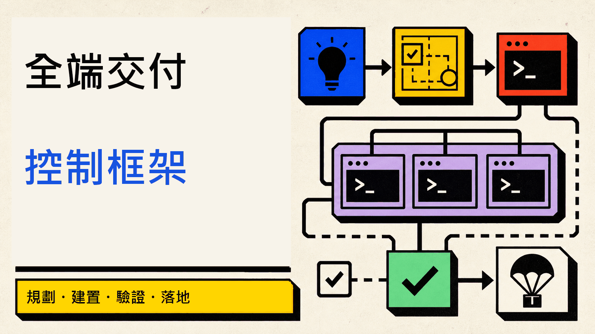

<p align="center">
  
</p>

<p align="center">
  <a href="README.md">English</a> | <strong>繁體中文</strong> | <a href="README.zh-CN.md">简体中文</a> | <a href="README.es.md">Español</a>
</p>

<p align="center">
  <a href="https://github.com/Phlegonlabs/product-delivery-harness/actions/workflows/harness-ci.yml"></a>
  
</p>

# Product Delivery Harness

這套技能讓 Codex、Claude Code、Pi 或其他支援 skills 的 host，把產品構想與變更需求轉成經過驗證的軟體。產品定義、設計、實作、安全與外部設定各自保留來源、證據及 owner 決定。

## 安裝

需要 Python 3.10 以上、Git，以及能探索 `~/.agents/skills/` 的 host。Windows 請在 Git Bash 執行 `./install.sh`。

```bash
git clone https://github.com/Phlegonlabs/product-delivery-harness.git
cd product-delivery-harness
./install.sh
```

安裝器會鎖定目的地，只暫存 Git index 已追蹤的 bundle 檔案。它把目前與舊版 managed ID 備份到 `~/.agents/skill-backups/product-delivery-harness/`，再逐路徑、逐位元組驗證安裝結果。

安裝器拒絕不安全的連結與非預期來源檔案。Attempt ownership marker 讓 rollback 只處理本次建立的路徑，保留外來路徑與舊備份。來源收據記錄 source SHA 與未提交狀態。

安裝器複製 scripts、references、assets 與 templates。測試保留在來源 checkout，請在該處執行。驗證前先安裝固定的 Python 依賴：

```bash
python -m pip install -r skills/delivery-harness/requirements-test.txt
```

更新沿用同一安裝器，不能用 raw-copy 覆蓋。先取得授權、暫停相關 skill session 並保留備份；驗證成功後才開啟新的 host session。安裝失敗會 rollback；後續驗證失敗時，從前一個 release tag 重跑安裝器。

從 0.23 或更早版本升級時，在同一份備份中用原 ID 保存各舊目錄：`full-harness` → `delivery-harness`、`prd-builder` → `product-definition-builder`、`product-design-builder` → `design-system-compiler`。自 0.73.0 起安裝器也會退役 `code-security-review`（改為 `delivery-harness/references/security-review.md`）、`product-activation`（改為 deployment record 與 `references/external-setup.md`）與 `seo-growth-review`（改為 `growth-review`）。

UI 工作另需 [dependency manifest](skills/delivery-harness/assets/external-skill-dependencies.json) 固定的完整 `frontend-design` 與 `impeccable` tree。依紀錄的路徑安裝，再執行 `check_external_skill_dependencies.py`。更新 full-tree pin 前須審查變更；專案 Skill Bindings 保留 owner 已確認的選擇，不可悄悄換 skill。

## 從這裡開始

| 目前起點 | Skill | 結果 |
| --- | --- | --- |
| 產品構想 | `product-definition-builder` | 已批准的 PRD、architecture、stack 與 TEST 義務 |
| 已批准且包含 UI 的 Product Definition | `ui-design-builder` | 方向、完整 HiFi、瀏覽器證據與 Visual Approval |
| 已批准且需要設計系統的 HiFi | `design-system-compiler` | 凍結的 pair 與來源綁定衍生 HTML |
| 有界實作或維護 | `delivery-harness` | Direct 工作或 managed PLAN/RUN |
| 已發布且有任何可被發現 surface 的產品 | `growth-review` | 逐 surface 的唯讀增長 review，以及已路由後續工作 |

五個核心 skills 與三個獨立 skills 都只在你明確點名呼叫時啟動，例如 `$delivery-harness`；亦可繼續已呼叫的工作。一般任務不會自動跑 Harness 分流、文件同步、Epic 紀錄或 PLAN/RUN。安裝、專案指令與既有文件都不代表呼叫。被呼叫的 skill 保留必要檢查與依賴；新的頂層階段需要明確要求。Codex 設定為 `allow_implicit_invocation: false`，其他 host 依同一指令邊界執行。

相關選擇尚未解決，或既有決定需要參考背景時，使用[參考選擇規則](skills/delivery-harness/references/reference-selection.md)與[可選目錄](skills/delivery-harness/references/option-library/README.md)。兩者都不是前置條件，也不授予執行權限；既有決定與批准仍有效。

## 常見提示詞

Codex 使用 `$skill-name`；其他 host 可直接指定 skill 名稱。說明準確寫入範圍，以及本機或遠端的預期結果。

```text
Use $product-definition-builder to define this product, including complete frontend/backend architecture, data/auth/deployment choices, coherent stack options, UI behavior, release targets, tests, and Product Definition Approval. Stop before UI design.
```

```text
The Product Definition is approved. Use $ui-design-builder with the `ui-design/3` contract and mandatory $frontend-design. Run the product preflight, read the PRD UI Surface Contract directly, and show three materially different directions over the same representative cases for my selection.
```

```text
I selected a direction. Continue $ui-design-builder with $frontend-design: build the complete connected HiFi, run the HiFi completeness preflight, then run separately authorized $impeccable critique and audit plus H1-H9 grading. Ask for one full Visual Approval covering copy, structure, product menus, tabs, visuals and tokens, then use $design-system-compiler for the required `design-system/4` pair and frozen derived HTML.
```

```text
Use $delivery-harness to implement the approved plan. Create a branch and commit the verified change, but do not push or open a PR.
```

```text
The delivery is complete. Use $delivery-harness to perform the external setup rows in docs/DEPLOYMENT.md for the production release targets, configure only the exact actions I approve, verify each result by read-back, and record the Measurement Sources status.
```

```text
Use $growth-review to read back every surface of this released product with its own lens, reconcile the verified measurement sources against the Growth Contract, prioritize evidence-backed opportunities per surface, and route every proposed change without modifying the product or external accounts.
```

## 包含的內容

| Skill | 負責範圍 |
| --- | --- |
| `product-definition-builder` | 含 `## Ambition`、At a Glance `Shape` 列與 `## Growth Contract` 的 `PRD.md`、`architecture.md`、`stack-decisions.md`、研究、各輪 PRD delta 與 Product Definition Approval |
| `ui-design-builder` | `docs/design/ui-design.md`、方向研究與完整已批准 HiFi 包 |
| `design-system-compiler` | 凍結的 `design-system.md`／`design-system.json` 與 `design-system-preview.html` |
| `delivery-harness` | 範圍路由、授權、任務、整合、驗證、安全 lens、`docs/DEPLOYMENT.md` 內的外部設定與量測來源，需要時的 PLAN/RUN，以及 managed stage cards 與自主執行用的 launch brief |
| `growth-review` | 依 Surface Catalog 逐 surface 各用一個 lens：搜尋與答案引擎、商店列表、registry 與目錄、bot 平台，以及團隊經營的帳號；含 `pre_launch`、`baseline`、Day 7 與 Day 30 `growth_review` 與 `traffic_drop` 模式，直接回覆 |

## 獨立 skills

[Go To Market](standalone-skills/go-to-market/SKILL.md) 選擇渠道與實驗、每個專案保留一份 messaging record、把 PRD 的 Launch Window 延伸成 launch runbook、為 Growth Contract 的再觸及機制撰寫 lifecycle messaging，並準備各渠道草稿、素材、日曆與附兩個 hook 的各渠道變體，涵蓋開發者渠道與商店 listing。

[Customer Discovery](standalone-skills/customer-discovery/SKILL.md) 規劃使用者訪談、整理去識別化筆記，並把 `RA-*` 候選發現交回 Product Definition。[README Studio](standalone-skills/readme-studio/SKILL.md) 用實際展示編寫專案 README。[Release Packager](standalone-skills/release-packager/SKILL.md) 驗證 release artifact 與使用者安裝路徑。

這四個完整 skill 目錄須另行向 host 註冊；`install.sh` 只安裝五個核心 skills。註冊、build、下載、簽章、發佈、排程與帳戶變更保留各自授權。沿用既有產品與量測紀錄，不新增 review wave。

## 各部分如何組合在一起


```mermaid
flowchart LR
  Product["Product Definition 與 Ambition、Growth Contract、owner 批准"] --> UI["UI 方向與完整 HiFi"] --> Design["Visual Approval 與必要設計系統 pair"]
  Product -->|"無 UI，或限域增強或維護"| Harness["Direct 或 managed 交付"]
  Design --> Harness
  Harness --> Review["最終 SHA 的一次合併 review"] --> Tests["一次 broad final validation"] --> C["固定候選 C"]
  C -->|managed| A["僅 managed：archive-only A"] --> Publish["已授權候選發佈與適用 Preview"]
  C -->|direct| Publish
  Publish --> Main["另行授權 exact-SHA main landing"] --> Setup["逐 target 外部設定讀回"] --> Outcome["量測成效與可選 growth review"]
```

初次 UI 交付須先完成設計與所有適用自查，才能進入 Harness 執行。依[作者自查](skills/delivery-harness/references/pre-delivery-self-review.md)，在下表的 Product、方向與 HiFi 既有出口完成檢查。

## 運作規則

以下流程規則只適用於你明確呼叫的 skill 工作。

Delivery core 只做一次規模判斷：一位 writer 配一段連貫驗證即可完成的工作走 direct。可獨立寫入的 missions、持久交接或有界 correction graph 使用 PLAN/RUN。Mission 是功能批次，細 task 各自保留 atomic commit。owner 選擇 `Delivery profile: mvp` 時，小型專案或一週 MVP 走壓縮路線：stack 與產品批准一次合併呼叫、必要頁面才做 HiFi、一次合併交付 review 併入 Final UI Acceptance，owner gate 最多四個；證據、安全與資料保護規則不變。

- [進場與交接](skills/delivery-harness/references/governance/task-and-handoff.md)：檢查目前指令與來源；未知的 loaded identity 維持未知。managed run 從 inspector 的 `Next` 區塊恢復；停滯的 `running` RUN 先要 owner 決定，自主執行從已簽署的 launch brief 開始。
- [分工](skills/delivery-harness/references/delegation-contract.md)：agent 設定與 AGENTS 決定 executor、model、effort 與 fallback。每個 checkout 只有一位 writer；被分派的 worker 不能再次分派。brief 與 review packet 在啟動前先依路線的時間、turn 與 byte 上限切好大小。
- [驗證](skills/delivery-harness/references/verification-gates.md)：必要證據綁定準確候選；缺能力或證據維持 blocked。
- [候選發佈與晉升](skills/delivery-harness/references/branch-promotion-contract.md)：保留準確 target、授權與遠端讀回，不得 force-push。
- [來源維護](skills/delivery-harness/references/governance/source-maintenance.md)：每個 atomic task 跑聚焦檢查，固定候選跑一次完整 matrix。

每次交接前，核對來源雜湊（source hashes）、Epic 紀錄與文件一致性，並原地重寫 Epic 的 `## Handoff` 區塊（階段、有效核准、剩餘工作、下一步）；每個 skill 進場先讀這個區塊。`docs/tasks.md` 由 RUN 衍生，不能手動編輯產生區段。[文件同步](skills/delivery-harness/references/document-sync-contract.md)、[有界修復](skills/delivery-harness/references/bounded-enhancement.md) 與[交付驗收](skills/delivery-harness/references/delivery-acceptance-contract.md) 擁有這些檢查規則。

| 階段 | 預設 review 與停止條件 |
| --- | --- |
| Product Definition | 封閉式決策前先回讀 Product Thesis。草稿與研究對帳完成後，作者自查整套文件一次；owner 批准前重查受影響變更；之後再做一次獨立唯讀 PRD review 與一次定向複查，owner 依十題 review 指南決定。Discovery 追加 Ambition 段落，`PRD.md` 放 `## Ambition`，且每輪 PRD 發布與其 Epic 對齊的 delta。At a Glance 的 `Shape` 列宣告 track、companion 介面與 console，交由 checker 驗證；`## Growth Contract` 記錄 north star、再觸及、discovery surfaces 與 launch window。套件預算是作者自查、一次獨立 review 與一次定向複查；之後的缺陷走隔離修復加 scoped review。 |
| 方向 | 原作者先檢查並修復已渲染的研究，再交 owner 選擇。三個研究；修改只新增一個所選方向的修訂研究與一次決定，拒絕才重做整組。 |
| HiFi | 完整性 preflight 後，原作者先自查及修復，再交獨立 review。一次診斷 wave、一批集中修復與一次受影響範圍複查。保留必要瀏覽器覆蓋、Impeccable `critique` **與** `audit`、四捨五入的 H1–H9 總平均 **至少 85** 及每項 **至少 80**，再取得 Visual Approval。未變證據連同身分沿用。此階段保有同樣的兩次 review 預算；之後的缺陷走隔離修復，並對修復差異做 scoped review。 |
| 交付 | `review_policy: final_candidate`：固定最終 SHA 上一次合併 code、適用 UI visual 與 security review（UI 使用真實瀏覽器），findings 分為 blocking 與 notes，另加一次定向複查。複查後每個剩餘或新缺陷各成一筆有界修復，附自己的聚焦 verifier，並只對修復差異做 scoped review（finding、修復差異、直接消費者）；差異碰到信任邊界時安全維度才加入，scoped PASS 重新綁定被修復路徑，scoped review 不佔用 attempt 預算。除非修復碰到 UI 頁面，否則不重跑 Final UI Acceptance，碰到時只重跑該頁面；broad final validation 每個候選於最後跑一次。環境受阻的 attempt 不佔用預算。 |
| Release | 一個 owner 指令可指定多個準確 release 動作。Archive-only A 與 tree 相同的 server main S 按下列規則繼承已驗證證據；tree 不同就是新候選。 |
| 外部設定 | `docs/DEPLOYMENT.md` 每個動作一列 External Console Setup，另有 Measurement Sources 表。逐 release target 驗證授權、獨立讀回與適用行為；前置準備與 production readiness 分開。 |

缺少 `review_policy` 時保留舊版 `per_mission` 行為。保留凍結 PLAN/RUN pin 與歷史批准，不可改 node 名稱重設已用 attempts。預算用完後，剩餘缺陷走隔離修復，並對每個修復差異做 scoped review；沒有額外 review 輪次。可執行差異必須有安全審查，缺少時報 `UNVALIDATED`，不能報 PASS。僅含 docs、copy、Epic、證據或簿記的差異改記 `security: not_applicable (<reason>)` 並列出路徑。範圍不相交而沿用的 PASS 保留原始 SHA，不得改稱全新。 HiFi 初審涵蓋每個 audit 軸；複查只在受影響頁面與狀態重跑 critique 和 audit，仍保留完整證據矩陣。

HiFi 仍須使用 Impeccable，但它不是預設的唯讀實作 reviewer。其 workflow 的 subagent、瀏覽器／server、snapshot 寫入與可選下載須另有授權。產品、stack、方向與 Visual Approval 決定仍屬原 owner。

## 通用 runtime adapter

目前 driver 為 `subagents` 與 `sequential_parent`，由 [runtime adapter](skills/delivery-harness/references/runtime-adapters.md) 對應實際觀察到的 native 工具。Parent 執行不能替代獨立 review。Host verifier 使用目前使用者權限，不提供檔案系統或網路隔離；有能力不等於有授權。

保留十二個[動作權限](skills/delivery-harness/references/execution-state-model.md#authorization-action-ledger)：

```text
invoke_external_runtime, spawn_subagents, create_user_owned_tasks,
create_local_worktrees, create_app_managed_worktrees, create_local_branches,
create_local_commits, integrate_locally, push, archive_worker_tasks,
remove_worktrees, delete_branches
```

目前 RUN 在本機以 `local_only` 結束，`push` 為 false，`pushed_head_sha` 為 null。發佈、受保護分支 landing、部署、安裝、歸檔與清理保留各自授權。任務通過時 worker 回傳 `WORKER_RESULT`，阻塞或失敗時回傳 `worker_result: null` 的 graph node result，驗證、review 與整合權保留在 parent。

## 儲存庫結構

| 路徑 | 用途 |
| --- | --- |
| `skills/` | 五個 canonical skills、references、assets、templates 與來源測試 |
| `standalone-skills/` | 另行註冊的可選 skills |
| `assets/` | README 封面素材 |
| `docs/` | 現行索引與任務紀錄 |
| `.github/workflows/harness-ci.yml` | Exact-candidate CI |
| `install.sh` | 經驗證的 bundle 安裝與更新 |

## 維護技能

修改 canonical 來源時，同步更新四種語言 README 的說明。依變動檔案選擇聚焦測試與反例；在來源 checkout 執行：

```bash
python skills/delivery-harness/scripts/check_skill_spec.py
python -m unittest discover -s skills/delivery-harness/scripts/tests -p "test_skill_contract.py"
python skills/delivery-harness/scripts/docs_weight.py
git diff --check
```

[必要 matrix](skills/delivery-harness/references/governance/source-maintenance.md#required-verification) 在固定候選上透過 CI 跑一次，只有 CI 不可用時才在本機執行完整 matrix。保留瀏覽器與 native 覆蓋，失敗或輸入變更時重驗受影響部分；沿用證據須保留原始來源。

## 發佈

遵循[來源 Git flow](skills/delivery-harness/references/governance/source-maintenance.md#git-flow) 與[必要驗證](skills/delivery-harness/references/governance/source-maintenance.md#required-verification)。已審查的來源候選經必要 PR 進入受保護 `main`，並在該 commit 加上 `v<version>` tag。以下 release 欄位一併更新：

1. `package.json` version 與 `skills/delivery-harness/VERSION`。
2. 四種語言 README 的版本 badge 與目前版本紀錄。
3. Delivery skill 的 `assets/templates/MISSION_RUNBOOK.template.md` 內 `required_harness_version`。
4. 測試繼續從 `VERSION` 讀取版本，不新增 hard-coded literal。

Archive-only A 須為 C 的直接子 commit，通過準確、receipt-bound 歸檔驗證後才繼承 C 的證據。差異只可包含收據列出的 coordination／evidence 搬移、可選的衍生 `docs/tasks.md`、`docs/DOCUMENTS.md` 更新與 `ARCHIVE_RECEIPT.json`，其他路徑保持不變。保留 C 已審 SHA 與各結果的原始來源，不把繼承證據當作 A 的新執行。Server 產生的 main SHA S 若 tree 相同，連同原始來源繼承候選證據；不因 tree 相同而重跑完整 suite 或安全審查。Tree 不同則重新驗證新候選。

發佈須綁定 owner 授權的準確 SHA 與 branch，使用 no-force push 並讀回遠端。一個 release 指令可同時綁定這些授權；遇到 drift 或 gate 失敗就停止。正式 release 驗證完成後，若已安裝 bundle 不同，在相關 session 靜止時以官方安裝器更新，保留備份及驗證。Badge 不能證明已安裝或已部署。

## 安全與資料保護

憑證與使用者資料不得進入儲存庫。保留無關檔案、worktree 與備份，刪除或替換須有準確 owner 授權。唯讀安全審查不會擅自安裝 scanner、改程式或探測線上 target。詳見[安全審查](skills/delivery-harness/references/security-review.md)與[資料保護](skills/delivery-harness/references/governance/development-rules.md#protect-local-data)。

## 授權

[MIT](LICENSE)。重用第三方程式與素材時保留授權與署名。

## 版本紀錄

- **0.74.1** — document-sync 盤點不再因單一檔案整體失敗：超過 2 MB 單檔上限的 `docs/goal/PLAN.md` 或 `RUN.md` 改以串流計算雜湊並記錄安靜的 `oversized_document` 發現，預設的 Epic 與 PRD delta 掃描會跳過符合機密與歷史排除規則的檔名。明確指定的路徑維持嚴格。

- **0.74.0** — 流程不再中途斷掉。`inspect_harness_run.py` 先印出附一條建議命令的 `Next` 區塊，沒有 lock 的 `running` RUN 必須先由 owner 決定才能選工作。七張短 stage card 取代長 contract 成為日常讀物，已簽署的 launch brief 把授權與預先記錄的 owner 決定帶進自主迴圈，brief 與 review packet 依路線的時間、turn 與 byte 上限切好，readiness 先探一次環境，每個 Epic 結尾有一個 `## Handoff` 區塊，每個 skill 進場先讀它。Product Definition 先回讀 Product Thesis，審批前多一次獨立唯讀 PRD review，並給 owner 十題審閱指南。Go To Market 新增 messaging record、lifecycle messaging、開發者、商店與港台渠道 playbook 和 launch runbook，新的 standalone Customer Discovery skill 把使用者訪談整理成 `RA-*` 候選。

- **0.73.0** — 一個專案就是一組 surface。新的 [Surface Catalog](skills/delivery-harness/references/surface-catalog.md) 列出 22 種發布面（新增 MCP server、skill 與 plugin、library、messaging bot、marketplace app、assistant listing、container 與 internal service）和五種存在面（social、video channel、newsletter、community、docs site），存在面以 `platform:handle` 寫在 PRD Growth Contract；Shape 列新增 `tool` 與 `content` track，Launch Window 新增 Destination 欄。bundle 從七個 skills 縮成五個：`code-security-review` 成為 harness 的安全 lens（`references/security-review.md`），`product-activation` 收進 deployment record（External Console Setup 列加上 Measurement Sources 表，設定目錄在 `references/external-setup.md`），`seo-growth-review` 改為 `growth-review`，逐一 surface 用各自的 lens 讀回，並從專案自己的 stack decisions 解析供應商。`gtm-content` 併入 `go-to-market`，未使用的 templates、死碼與重複的 validator CLI 一併移除。

- **0.72.1** — 任務通過時 worker 回傳 `WORKER_RESULT`；阻塞或失敗的任務回傳 `worker_result: null` 的 graph node result，驗證、review 與整合權保留在 parent。

- **0.72.0** — `ci_test_shards.py run --suite <name> --workers N` 以多個行程並行執行一個套件的測試模組並保留逐模組 log，本機的 Required Verification 矩陣從單核 27 分鐘縮到幾分鐘。

較早版本：[英文 CHANGELOG.md](CHANGELOG.md)。
